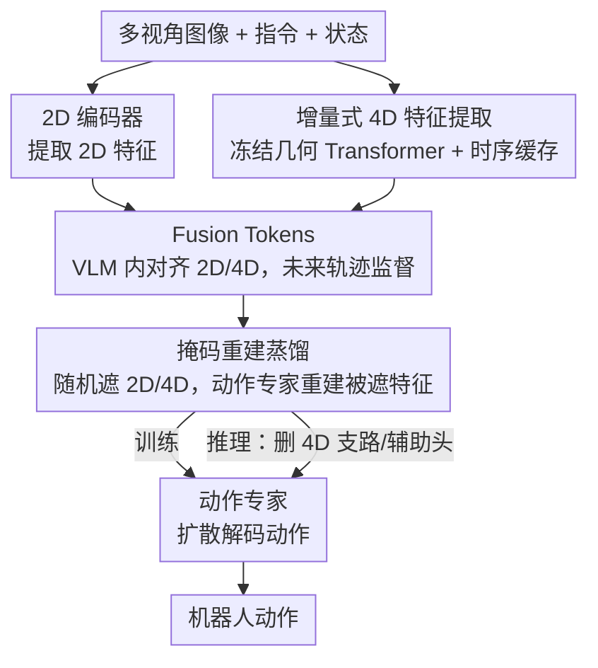

# SwiftVLA: Unlocking Spatiotemporal Dynamics for Lightweight VLA Models at Minimal Overhead

**会议**: CVPR 2026  
**论文**: [CVF Open Access](https://openaccess.thecvf.com/content/CVPR2026/html/Ni_SwiftVLA_Unlocking_Spatiotemporal_Dynamics_for_Lightweight_VLA_Models_at_Minimal_CVPR_2026_paper.html)  
**代码**: 无（仅有项目页 https://Swiftvla.github.io）  
**领域**: 机器人 / 具身智能  
**关键词**: VLA, 轻量化, 4D 时空特征, 掩码重建, 边缘部署

## 一句话总结
SwiftVLA 让一个 0.45B 的小 VLA 在训练时"借用"4D 时空特征学会几何与动态推理，再用掩码重建把这份知识蒸馏进 2D 分支，从而在推理时直接丢掉 4D 模块——在边缘设备上比 π0 快 18×、省 12× 显存，成功率却追平参数量大 7× 的模型。

## 研究背景与动机
**领域现状**：VLA（Vision-Language-Action）模型把预训练 VLM 的视觉语言推理能力直接映射成机器人动作，是当前具身操作的主流范式（OpenVLA、π0 等）。但这些骨干动辄 3B~7B，推理延迟和显存占用让它们很难在机械臂这类资源受限平台上做实时控制。

**现有痛点**：为了上边缘设备，人们把 VLM 缩小（SmolVLA 砍到 0.5B、跳过部分层）。可一旦骨干变小，空间推理能力随之崩塌——论文 Fig.1 给的例子很直观：问"最左边的碗是什么颜色"，PaliGemma-3B 答对，SmolVLM-0.5B 答错。小模型看不准 3D 几何，抓取就会定位偏、轨迹糙，成功率显著低于大模型。

**核心矛盾**：注入 3D/4D 信息能补回空间感知，但现有两条注入路线都和"轻量"对着干。一条是**直接融合**（3D-VLA、SpatialVLA、Evo-0）：把 3D 特征塞进 VLM 一起算，可 2D 像素和 3D 几何之间 domain gap 太大，小 VLM 根本对齐不了，必须靠大 VLM 才 work。另一条是**解耦分支**（PointVLA、GeoVLA）：单开一个 3D 专家分支，参数开销陡增，照样不适合紧凑模型。两条路都没解决"轻量设计 ↔ 鲁棒时空感知"之间的根本权衡。而且大多只管 3D 空间、忽略时间维度，4D-VLA 虽然补了时间却要多帧采样、又增加推理开销。

**本文目标**：在小 VLM 上注入 4D（3D 空间 + 时间）时空信息，但推理时不增加任何 4D 计算成本。

**切入角度**：4D 特征只是"训练时的老师"，不一定要在推理时常驻。如果能让 2D 分支在训练中把 4D 蕴含的几何与动态知识吃进去，推理时就能把整条 4D 支路连同辅助头一起删掉。

**核心 idea**：用一个冻结的 4D 几何 Transformer + 时序缓存增量提取 4D 特征当监督信号，用 Fusion Tokens 在小 VLM 内对齐 2D/4D，再用**掩码重建**把 4D 知识蒸馏进模型——推理时只留 2D，性能几乎不掉。

## 方法详解

### 整体框架
SwiftVLA 由两个串起来的部件组成：一个轻量 VLM（SmolVLM-0.5B）+ 一个动作专家（基于扩散的连续动作解码器，约 100M 参数，整模 ~450M）。每个时间步 $t$，机器人拿到语言指令 $l$、多视角观测 $o_t=\{o_t^v\}_{v\in S}$（视角顺序 $S=[\text{left, right, front}]$）和本体状态 $s_t$。

整条流水线是：① 用图像编码器从各视角抽 2D 特征 $F_{2D}^t$；② 用冻结的预训练 4D 几何 Transformer + 时序缓存增量抽 4D 特征 $F_{4D}^t$；③ 一组可学习的 Fusion Tokens $Q_f$ 在 VLM 内与 2D/4D 特征、状态/语言嵌入交叉注意，产出统一表征 $Z_f^t = V(Q_f, E_s^t, E_l^t, F_{4D}^t, F_{2D}^t)$；④ Fusion Tokens 那部分被解码去预测末端执行器未来轨迹（提供监督），VLM 的中间隐状态 $\{h_V^{(i)}\}$ 作为分层条件喂给动作专家 $A$ 生成动作。训练时额外做**随机掩码**：随机遮住 2D 或 4D 特征，让动作专家在生成动作的同时重建被遮的特征。推理时把 4D 提取器、重建头、轨迹头全部移除，只剩 VLM + 动作专家。

### 关键设计

**1. 增量式 4D 特征提取：用时序缓存把流式帧滚成 4D，不靠额外传感器**

痛点在于：3D/4D 信息能补空间感知，但现有方法要么依赖深度相机/LiDAR，要么忽略时间维度。SwiftVLA 直接用一个**冻结**的预训练 4D 视觉几何 Transformer（编码器 + 时空解码器 + 时序缓存）从普通 RGB 图像增量地抽 4D 特征，不需要任何额外传感器。每个时间步先把各视角观测编码 $F_e^{t,v}=\text{Encoder}(o_t^v)$，再按视角顺序送进时空解码器：空间注意捕捉视角内几何，时间注意让当前特征与**时序缓存**做交叉注意以注入历史上下文。解码按 $k\in\{1,2,3\}$ 逐视角推进：$(F_{4D}^{t,v}, C^{t,k}) = \text{Decoder}(\text{CrossAttn}(F_e^{t,v}, C^{t,k-1}))$，缓存从 $C^{t,0}=C^{t-1}$ 起递推、处理完所有视角后更新为 $C^t=C^{t,3}$。缓存用 **FIFO** 只保留最近 $K$ 份 4D 表征以控开销。为省训练成本，只有 front 视角的 4D 特征 $F_{4D}^t=F_{4D}^{t,\text{front}}$ 真正喂给 VLM，left/right 仅用于更新缓存、提供更全的时空上下文。这一步是后面所有蒸馏的"知识来源"。

**2. Fusion Tokens：用一组可学习 token + 未来轨迹监督，把小 VLM 撬动起来融合 2D/4D**

小 VLM 的死穴是空间推理弱、没法把 2D 和 4D 自然融进一个 3D-aware 的隐空间，而以往直接喂 3D 进 VLM 的做法都默认你有个大 VLM 来兜底对齐。SwiftVLA 引入一组可学习的 Fusion Tokens $Q_f$，让它们在 VLM 内与聚合后的多模态序列（2D 特征 $F_{2D}^t$、4D 特征 $F_{4D}^t$、语言嵌入 $E_l^t$、状态嵌入 $E_s^t$）做交叉注意，产出融合表征 $Z_f^t$（Eq.1）。关键在于**监督信号**：用机械臂末端执行器的未来轨迹直接监督 Fusion Tokens 的输出——$\hat{\tau}_t = h_{\text{traj}}(Z_f^t)$，$L_{\text{traj}}=\|\hat{\tau}_t-\tau_t\|_2^2$。这个"预测我接下来要去哪"的任务把多模态特征和时空语义对齐，逼着小模型真正用上 4D 几何线索而不是把它当噪声忽略掉，从而让条件信号 $h_V^{(i)}$ 对动作生成更有效。消融里加上 Fusion Tokens 让 SR 从 0.40 提到 0.50，说明小模型确实需要这个"任务牵引"才会用 4D。

**3. 掩码重建蒸馏：训练借 4D、推理丢 4D，性能几乎不掉**

即便上了 4D + Fusion Tokens，4D 支路本身的参数和算力又和"轻量"相悖。SwiftVLA 的解法是把 4D 当成训练期的蒸馏目标而非推理期的常驻输入。训练时以一定概率**随机遮住 2D 或 4D 特征**，被遮的模态不参与动作生成，但动作专家产出的动作隐变量 $Z_A^t$ 必须同时重建出被遮的特征：$L_{2D}=\|h_{2D}(Z_A^t)-F_{2D}^t\|_2$，$L_{4D}=\|h_{4D}(Z_A^t)-F_{4D}^t\|_2$（Eq.7）。动作本身用扩散噪声预测 $L_{\text{action}}=\mathbb{E}_{\epsilon}\|h_{\text{action}}(Z_A^t)-\epsilon\|_2^2$（Eq.8）监督，总损失为四项加权和 $L_{\text{total}}=\lambda_{2D}L_{2D}+\lambda_{4D}L_{4D}+\lambda_{\text{action}}L_{\text{action}}+\lambda_{\text{traj}}L_{\text{traj}}$。这样训练逼着模型即使没有显式 4D 输入也能**隐式重建并推理 4D 空间结构**，几何与动态知识被内化进 2D 分支。推理时把 4D 提取器、两个重建头、轨迹头一并删掉，只留 VLM + 动作专家。消融（Tab.6）直接验证了这条路的必要性：什么策略都不用、推理时硬删 4D，SR 暴跌到 0.02；只加 4D 掩码升到 0.40；再加特征重建升到 0.53，逼近带 4D 输入的 0.55。一个反直觉的发现是：适度遮 **2D** 特征反而促使模型更依赖底层 4D 几何线索、增强跨模态一致性。

### 损失函数 / 训练策略
总损失 $L_{\text{total}}=\lambda_{2D}L_{2D}+\lambda_{4D}L_{4D}+\lambda_{\text{action}}L_{\text{action}}+\lambda_{\text{traj}}L_{\text{traj}}$，各 $\lambda$ 为平衡系数（具体取值原文未在正文给出，⚠️ 以原文/附录为准）。骨干用 SmolVLM，整模约 450M（动作专家约 100M）。在公开数据集上做两阶段训练（细节见附录）。缓存大小 $K$ 在训练时用随机策略（每步从 $\{3,4,5,6\}$ 采样）效果最好。

## 实验关键数据

### 主实验（RoboTwin 2.0 仿真，成功率 SR↑ / 轨迹长度↓）

| 方法 | 参数量 | 平均 SR ↑ | 平均 Length ↓ |
|------|--------|-----------|----------------|
| π0 | 3B | 0.47 | 152 |
| GO-1 | — | 0.46 | 158 |
| TinyVLA | — | 0.07 | 220 |
| SmolVLA | 0.45B | 0.29 | 188 |
| SmolVLA†（同配置预训练+微调） | 0.45B | 0.36 | 163 |
| **SwiftVLA（推理不用 4D）** | 0.45B | **0.53** | **150** |
| SwiftVLA with 4D input | 1.65B | 0.55 | 143 |

SwiftVLA 只用 π0 约 15% 的参数就追平甚至超过它，相比 SmolVLA 的 SR 相对提升 82.76%。LIBERO benchmark 上（Tab.3），0.45B 的 SwiftVLA 平均 94.7，逼近 3B 的 π0（94.1）和 GR00T-N1（93.9），把同量级小模型 SmolVLA（87.3）远远甩开。

### 真实机器人 + 边缘部署

| 平台 / 实验 | 指标 | SwiftVLA | π0 | SmolVLA |
|-------------|------|----------|-----|---------|
| AgileX 机械臂（真实，平均 SR） | SR ↑ | 0.80 | 0.61 | 0.34 |
| Jetson Orin 推理时间 | s ↓ | 0.167 | 2.966 | 0.166 |
| Jetson Orin 显存 | MB ↓ | 1398.4 | 16236.2 | 1397.5 |
| Jetson Orin 平均 SR | SR ↑ | 0.76 | 0.48 | 0.30 |

边缘设备上比 π0 快约 18×、省约 12× 显存，延迟几乎与 SmolVLA 持平，但 SR（0.76）远高于 π0（0.48）和 SmolVLA（0.30）。

### 消融实验

| 配置 | 平均 SR | 说明 |
|------|---------|------|
| 仅 2D | 0.36 | 无 4D，空间推理弱 |
| 2D & 4D（无 Fusion Tokens） | 0.40 | 小模型用不好 4D |
| 2D & 4D + Fusion Tokens | 0.50 | 任务牵引让 4D 真正被用上 |

掩码重建策略消融（Tab.6，推理时仅用 2D）：

| 4D掩码 | 2D掩码 | 特征重建 | SwiftVLA（推理无4D） | with 4D |
|:---:|:---:|:---:|:---:|:---:|
| ✗ | ✗ | ✗ | 0.02 | 0.50 |
| ✓ | ✗ | ✗ | 0.40 | 0.48 |
| ✓ | ✓ | ✗ | 0.50 | 0.52 |
| ✓ | ✓ | ✓ | **0.53** | **0.55** |

缓存大小 $K$ 消融（Tab.7）：固定 $K=6$ 得 0.52，随机采样 $K\in\{3,4,5,6\}$ 最佳 0.53。

### 关键发现
- **掩码重建是"丢 4D 不掉点"的命脉**：不做任何处理直接删 4D，SR 从 0.50 崩到 0.02；完整策略下推理无 4D 仍有 0.53，逼近带 4D 的 0.55——说明知识真的蒸馏进了 2D 分支。
- **小模型必须靠任务牵引才会用 4D**：单纯把 4D 喂进去只涨 0.04（0.36→0.40），加上未来轨迹监督的 Fusion Tokens 才跳到 0.50。
- **适度遮 2D 反而增强 4D 几何利用**，是个反直觉但可复用的正则技巧。
- **随机缓存长度优于固定长度**：训练中暴露多种时间跨度提升了适应性。

## 亮点与洞察
- **"训练借力、推理瘦身"的蒸馏范式很优雅**：把昂贵的 4D 几何 Transformer 当一次性老师，通过重建目标把知识压进小模型，推理时零成本——这套思路可迁移到任何"辅助模态贵、但只在训练时可得"的场景（如训练有深度图、部署只有 RGB）。
- **用未来轨迹当跨模态对齐的监督信号**很巧：它给 Fusion Tokens 一个具体、与任务强相关的优化目标，避免小模型把 4D 当噪声，比单纯特征对齐更有牵引力。
- **增量时序缓存 + FIFO** 让 4D 提取在流式控制里复用历史帧、摊薄算力，是把"时间维度"塞进 VLA 的低成本做法。
- 最"啊哈"的一点：消融里"什么都不做直接删 4D → SR 0.02"和"完整策略 → 0.53"的对比，干净利落地证明了方法不是锦上添花，而是让"推理丢 4D"这件事第一次可行。

## 局限与展望
- **依赖一个预训练好的 4D 几何 Transformer**（冻结使用），其质量直接决定蒸馏天花板；该模块在更杂乱/动态场景下的鲁棒性论文未充分讨论。
- 各损失权重 $\lambda$ 的取值、两阶段训练细节都放在附录，正文未给，复现需查附录。
- 真实实验集中在桌面抓取/堆叠这类相对结构化任务，面对接触丰富、长时序的复杂操作能否保持优势仍待验证。
- 推理虽删了 4D 支路，但训练成本（要跑 4D Transformer + 多个辅助头）并不低，门槛主要被转移到了训练侧。

## 相关工作与启发
- **vs 直接融合派（3D-VLA / SpatialVLA / Evo-0）**：他们把 3D 特征直接塞进 VLM 一起算，受限于 2D-3D 的 domain gap，必须靠大 VLM 才能对齐；SwiftVLA 不强行在小 VLM 里硬融，而是用重建把 4D 蒸馏进去，推理时干脆不带 4D。
- **vs 解耦分支派（PointVLA / GeoVLA）**：他们单开 3D 专家分支，参数开销大且只管空间、忽略时间；SwiftVLA 的 4D 分支推理时被整体删除，且显式建模时间维度。
- **vs 4D-VLA**：同样补了时间维度，但 4D-VLA 靠多帧关键帧采样、推理时仍有额外开销；SwiftVLA 用时序缓存增量提取 + 推理丢 4D，把时间信息的代价压到训练侧。
- **vs 小模型派（SmolVLA / TinyVLA）**：他们只靠砍骨干换速度，牺牲空间推理；SwiftVLA 在同样 0.45B 量级下用 4D 蒸馏补回了空间感知，速度持平而 SR 大幅领先。

## 评分
- 新颖性: ⭐⭐⭐⭐ "训练借 4D、推理丢 4D"的掩码重建蒸馏组合干净有效，虽各组件源自已有思路但拼法新颖。
- 实验充分度: ⭐⭐⭐⭐⭐ 仿真（RoboTwin + LIBERO）、真机、边缘设备、四组消融齐全，对比覆盖大中小三档 VLA。
- 写作质量: ⭐⭐⭐⭐ 动机递进清晰、图示到位，部分超参与训练细节下放附录略影响自洽阅读。
- 价值: ⭐⭐⭐⭐⭐ 在边缘设备上 18× 加速、12× 省显存还追平 7× 大模型，对落地实时机器人控制有直接价值。

<!-- RELATED:START -->

## 相关论文

- [\[CVPR 2026\] AtomicVLA: Unlocking the Potential of Atomic Skill Learning in Robots](atomicvla_unlocking_the_potential_of_atomic_skill_learning_in_robots.md)
- [\[CVPR 2026\] ACoT-VLA: Action Chain-of-Thought for Vision-Language-Action Models](acot-vla_action_chain-of-thought_for_vision-language-action_models.md)
- [\[CVPR 2026\] VLA Models Are More Generalizable Than You Think: Revisiting Physical and Spatial Modeling](vla_models_are_more_generalizable_than_you_think_revisiting_physical_and_spatial.md)
- [\[CVPR 2026\] AT-VLA: Adaptive Tactile Injection for Enhanced Feedback Reaction in Vision-Language-Action Models](at-vla_adaptive_tactile_injection_for_enhanced_feedback_reaction_in_vision-langu.md)
- [\[CVPR 2026\] Contact-Aware Neural Dynamics](contact-aware_neural_dynamics.md)

<!-- RELATED:END -->
