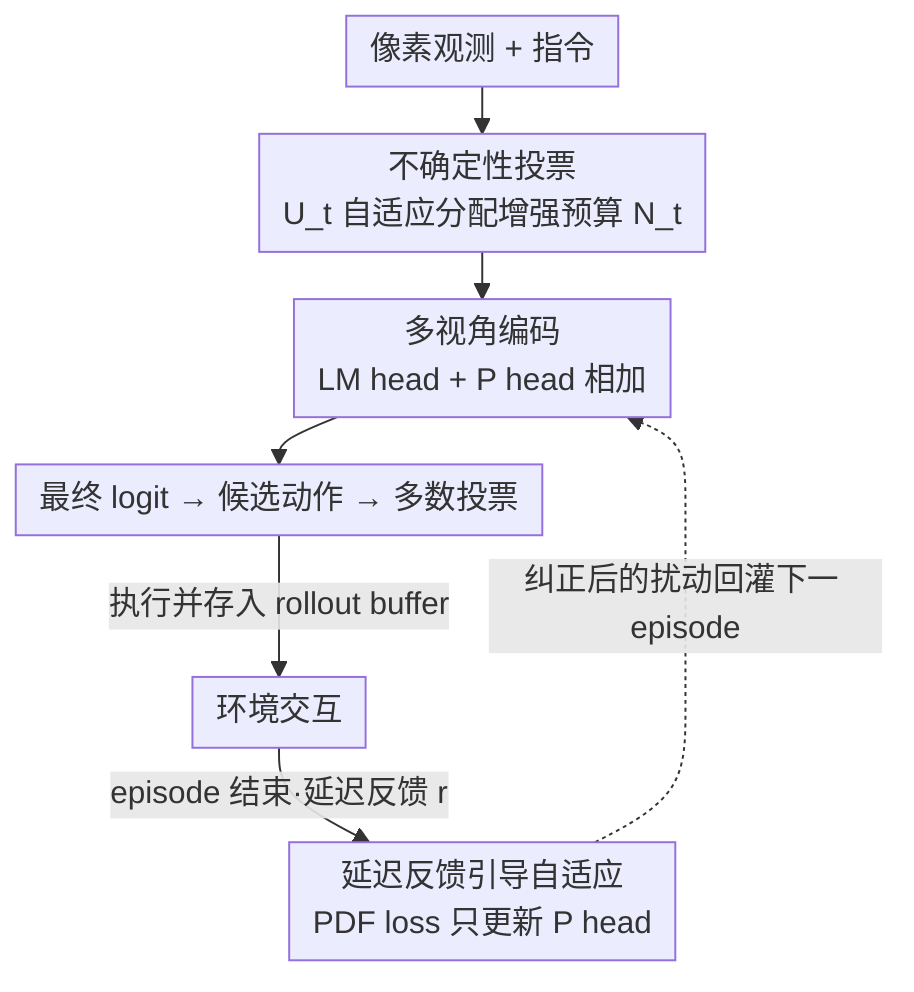

# Test-Time Perturbation Tuning with Delayed Feedback for Vision-Language-Action Models

**会议**: CVPR 2026  
**论文**: [CVF Open Access](https://openaccess.thecvf.com/content/CVPR2026/html/Zang_Test-Time_Perturbation_Tuning_with_Delayed_Feedback_for_Vision-Language-Action_Models_CVPR_2026_paper.html)  
**代码**: https://github.com/zhoujiahuan1991/CVPR2026-PDF  
**领域**: 机器人 / 具身智能 / VLA  
**关键词**: 视觉-语言-动作模型, 测试时自适应, 轨迹过拟合, 延迟反馈, 数据增强

## 一句话总结
针对 VLA 在物体微小位姿变化下就崩的"轨迹过拟合"问题，本文提出 PDF——一个无需 verifier、不更新主干参数的测试时自适应框架：用不确定性自适应分配的数据增强+多视角投票抑制虚假相关，再用 episode 结束后的延迟反馈训练一个轻量扰动头来纠正模型的过度自信，在 LIBERO 上成功率 +7.4%、Atari 上人类归一化分 +0.10。

## 研究背景与动机
**领域现状**：视觉-语言-动作模型（VLA，如 OpenVLA、Gato/Jat、RT-2）把视觉、语言、动作联合建模，通过多模态预训练把指令翻译成可执行动作，在机器人操作和像素控制任务上展现出通用具身智能的雏形。

**现有痛点**：这些模型对**语义上无关紧要的微小环境变化**异常脆弱——比如物体位姿稍微挪一点，成功率就大幅下降甚至任务失败。作者通过诊断实验揭示了一个有趣的行为偏差：让机械臂去抓碗，它可能抓不到却继续朝盘子移动；即使把目标碗用 mask 遮掉，机械臂依然复现出几乎一样的动作轨迹。这说明策略根本没有"看着目标做决策"，而是在背诵训练时见过的轨迹。

**核心矛盾**：作者把这个失败模式命名为**轨迹过拟合（trajectory overfitting）**——VLA 在训练时记住了与成功相关的轨迹特定视觉/上下文模式（夹爪外观、背景纹理等），把"动作"和"实体"之间的**虚假相关**当成了决策依据，而非真正理解任务语义。一旦测试输入与历史轨迹相似，它就照搬记忆中的次优动作。

**现有方案的不足**：缓解这个问题的自然思路是测试时自适应（TTA）。但 **verifier-based TTA**（如 RoboMonkey、VGPS）需要预训练一个打分器、反复 rollout，开销大且难泛化到新环境；**verifier-free TTA** 又依赖熵最小化这类自监督置信度指标——当模型本身预测被误校准（对错误动作过度自信）时，熵最小化反而会**进一步放大错误 logit**，把模型推向更自信的错误决策。

**切入角度**：作者发现一个关键现象——对像素观测做**受控数据增强**，能让夹爪重新把注意力聚焦回目标碗、恢复正确执行（论文 Fig.1d）。这说明扰动输入分布本身就能打破轨迹过拟合。同时，episode 结束后环境会给出"成功/失败/累计奖励"这类**延迟反馈**，这是比自监督置信度更可靠的监督信号，只是来得晚。

**核心 idea**：用"不确定性驱动的数据增强+投票"在线打破虚假相关，再用"延迟反馈训练一个轻量扰动头"回溯性地纠正动作 logit 的过度自信——全程冻结 VLA 主干，不做微调、不要 verifier。

## 方法详解

### 整体框架
PDF（Perturbation learning with Delayed Feedback）是一个**即插即用、verifier-free、不更新主干参数**的测试时自适应框架，由两大组件串成一条"在线决策 + 离线回溯"的闭环。

在线阶段：每个时间步 $t$，VLA 接收像素观测 $o_t$ 和指令 $c_t$，先估计当前决策的**动作 logit 不确定性** $U_t$，据此自适应分配一个数据增强预算 $N_t$；原始观测和增强观测一起编码成多模态特征 $f_t$，分别送进两个并联的头——LM head 产出决策 logit，扰动头（P head）产出 logit 扰动；二者相加得到最终 logit，detokenize 成候选动作集，再由**多数投票**选出最终动作 $a_t$。特征和投票后的最终 logit 被存进 rollout buffer $D$。

离线阶段：一个 episode 结束后，环境给出延迟反馈 $r$（成功/失败/奖励）；从 buffer 采一个 batch，用 PDF 损失（含 REINFORCE 项 + 门控 KL 正则）**只更新 P head**，所有 VLA 参数（视觉编码器、token embedding、causal transformer、LM head）始终冻结。这样把"昂贵但可靠的环境反馈"以极低成本（仅 9M 可训练参数、无需对主干求梯度）回灌到下一个 episode 的决策里。

### 关键设计

**1. 不确定性驱动的动作投票：把宝贵的增强预算只花在"模型自己也拿不准"的步上**

直接对每一步都做大量数据增强能抑制轨迹过拟合，但增强会带来显著推理开销，全程平铺成本太高；而在序贯决策里，**单个高不确定性动作就可能直接导致整段任务失败**。PDF 因此先量化每步的预测不确定性，定义为动作分布的归一化香农熵：

$$U_t = -\frac{1}{\log K}\sum_{k=1}^{K} p(a_k \mid s_k)\log p(a_k \mid s_k)$$

其中 $K$ 是可能的动作 token 数，$p(a_t = a_k \mid s_t) = \mathrm{softmax}(z_t)_k$。然后按不确定性**自适应**决定增强预算 $N_t = N_{\max}\cdot U_t$：模型越没把握，就采样越多增强视角。原始观测 $o_t$ 与 $N_t$ 个增强视角 $\{T_j(o_t)\}$ 各自编码、各出一组候选动作，最终用多数投票选 $a_t$。这等于把"模型确定的步快速放行、不确定的步多看几眼再投票"，既打破了对单一记忆轨迹的依赖，又把算力精准投到刀刃上——实验中固定 $N_{\max}=3$ 即可（预算再大反而因噪声累积掉点）。

**2. 延迟反馈引导的扰动头自适应：用 episode 结束后才到的真反馈，回溯性地纠正过度自信**

verifier-free TTA 的老毛病是只能靠自监督置信度（如熵最小化）自适应，而模型一旦对错误动作过度自信，这类信号会**把错误越推越自信**。PDF 改用一个更可靠但来得晚的信号——episode 结束后的延迟反馈 $r$。具体做法是给最终 logit 加一个可学习的扰动项：

$$\tilde{z}_t = h_\phi(f_t) + \lambda h_\theta(f_t)$$

其中 $h_\phi$ 是冻结的 LM head，$h_\theta$ 是**唯一可训练**的扰动头（P head），$\lambda$ 是权重。episode 结束拿到 $r$ 后，从 buffer 采 batch 重算带梯度的 $\tilde{z}_b$，用如下损失只更新 P head：

$$L_{PDF} = -(r-b)\log\pi_\phi + \lambda_{KL}\,\mathbb{I}[r>b]\,\mathrm{KL}(\pi_\phi \,\|\, \tilde{\pi})$$

第一项是 REINFORCE 风格目标：当反馈 $r$ 超过基线 $b$（即这条扰动后策略 $\tilde{\pi}$ 表现好）时，提高其动作的似然，把扰动推向成功方向、压制失败方向。第二项 KL 正则**仅在正反馈 $r>b$ 时由指示函数 $\mathbb{I}$ 门控开启**，用来稳定更新、加速收敛；而 $r\le b$ 时关掉 KL，给模型留出探索空间。这样把"哪条动作真的导致了成功"这种 ground-truth 级信号，以仅训练 9M 参数、不碰主干梯度的代价，转化为对 logit 的回溯性修正——这正是它能纠正 entropy-minimization 纠不了的过度自信的根本原因。

> ⚠️ 损失公式中 $\log\pi_\phi$ 与 $\mathrm{KL}(\pi_\phi\|\tilde\pi)$ 的下标 $\phi$ 与正文"扰动后策略 $\tilde\pi$"的表述略有出入，疑为原文 typo，含义以"提高扰动策略中成功动作的似然、并用 KL 约束其不偏离过远"为准，⚠️ 以原文为准。

### 损失函数 / 训练策略
训练目标即上面的 $L_{PDF}$（REINFORCE 项 + 门控 KL）。整个测试时自适应只优化 P head $h_\theta$，VLA 全部参数冻结；优化在每个 episode 结束后从 rollout buffer 采 batch 进行。base 模型 LIBERO 上用 OpenVLA、Atari 上用 Jat（Gato 开源实现），各自先训练 50 episode 再评估，全部实验在单卡 Tesla V100-32GB 上完成。增强预算上限 $N_{\max}=3$。

## 实验关键数据

### 主实验（LIBERO 四套件成功率）

| 方法 | 发表 | 参数 | Spatial | Object | Goal | Long | Avg. SR↑ | 平均排名↓ |
|------|------|------|---------|--------|------|------|----------|-----------|
| OpenVLA† | CoRL'24 | - | 0.85 | 0.64 | 0.76 | 0.53 | 0.69 | 5.8 |
| TraceVLA | ICLR'25 | 130M | 0.85 | 0.85 | 0.75 | 0.54 | 0.75 | 6.5 |
| OpenVLA-DPO | Arxiv'25 | 130M | 0.84 | 0.89 | 0.79 | 0.53 | 0.76 | 4 |
| SFT-4LIBERO | Arxiv'25 | 130M | 0.85 | 0.87 | 0.77 | 0.55 | 0.76 | 3.5 |
| MG-Select | Arxiv'25 | 130M | 0.82 | 0.73 | 0.73 | 0.55 | 0.71 | 6 |
| **PDF (Ours)** | - | **9M** | **0.90** | 0.72 | **0.86** | **0.59** | **0.77** | **2.5** |

PDF 以最少的可训练参数（9M vs 93–130M）拿到最佳平均成功率（0.77）和最佳平均排名（2.5）。长程任务（Long）提升最明显（0.59，比最强 baseline 高 +0.04），说明它对序贯决策质量的提升最实在；比同为 verifier-free 的 MG-Select 平均 SR 高近 6 个点。Object 套件是它的弱项（0.72），原因见消融。Atari-57 上 HNS 达 1.07，比 Jat base 的 0.97 高 +0.10，57 个游戏里 47 个有正向提升（BOXING +0.60 最高）。

### 消融实验

**组件消融（DA = 数据增强，DF = 延迟反馈，LIBERO）**

| 配置 | 关键表现 | 说明 |
|------|---------|------|
| OpenVLA (baseline) | 较低 | 无任何 TTA |
| PDF w/o DA | 多数任务超过 baseline | 只用原始观测学扰动、无数据增强 |
| PDF w/o DF | Object 掉到 0.50、Goal 掉到 0.77 | 只靠多视角投票、无延迟反馈，明显下滑 |
| **PDF (Full)** | 四套件平均最高、最稳 | DA+DF 协同 |

**损失项消融（人类归一化分 / 成功率，跨五个 benchmark）**

| 配置 | Atari | Spatial | Object | Goal | Long |
|------|-------|---------|--------|------|------|
| OpenVLA | 0.97 | 0.85 | 0.62 | 0.82 | 0.56 |
| w/o KL | 1.04 | 0.86 | 0.65 | 0.82 | 0.57 |
| w/o RE | 0.96 | 0.89 | 0.69 | 0.85 | 0.58 |
| **PDF (Full)** | **1.07** | **0.89** | **0.72** | **0.86** | **0.59** |

### 关键发现
- **DF 是稳健性的关键**：去掉延迟反馈（w/o DF）在 Object（0.50）和 Goal（0.77）上大幅下滑，说明物体操作和目标条件任务尤其依赖真实反馈来纠偏；而 w/o DA 仍能超过 baseline，二者协同才达到最佳——DA 负责在线打破虚假相关，DF 负责离线纠正过度自信。
- **两个损失项都有用，KL 影响更大**：REINFORCE 项和门控 KL 各去其一都掉点，去掉 KL 对最终结果影响更显著，印证 KL 正则对稳定测试时更新的作用。
- **增强不是越多越好**：增强预算从 0 增到 4，五个 benchmark 普遍**单调掉点**——预算越大噪声累积越严重。小预算（max=3）才是打破轨迹过拟合与引入低质视角之间的最佳折中，作者据此建议按 benchmark 自适应设上限而非一味拉满。

## 亮点与洞察
- **把"轨迹过拟合"诊断得很到位**：mask 掉目标物体后机械臂仍复现相同动作——这个实验直观证明了 VLA 在背诵轨迹而非理解语义，比泛泛说"鲁棒性差"有说服力得多，是全文动机的基石。
- **不确定性当"增强预算分配器"很巧**：把香农熵既当"该不该多看几眼"的开关、又当增强数量的连续旋钮，等于自动在确定的步省算力、不确定的步加保险，避免了对每步无脑增强的开销。
- **延迟反馈 + 冻结主干 + 轻量扰动头的组合可迁移**：当下游有"episode 级稀疏反馈但无法/不愿微调大模型"的场景（很多机器人、推荐、对话 agent 都是），这套"冻结主干、只训一个小扰动头、用 REINFORCE+门控 KL 回灌反馈"的范式可以直接借用。
- **9M 参数、不碰主干梯度**：相比动辄 130M 且要对主干求梯度的 baseline，部署成本和显存友好度高一个量级。

## 局限与展望
- **依赖延迟反馈信号可得**：方法成立的前提是 episode 结束能拿到成功/失败/奖励。完全无反馈或反馈极稀疏/噪声大的真实环境里，DF 这一支可能失效，退化成只剩投票。
- **Object 套件反而偏弱**：主表里 PDF 在 Object 上只有 0.72，落后多个 baseline，论文未深入分析为何物体识别类任务受益较小，可能与该套件虚假相关本就不严重有关。
- **延迟带来的信用分配粗糙**：反馈是 episode 级的，但 PDF 用它更新整段 buffer 的扰动，对"具体哪一步动作该负责"的信用分配较粗，长程复杂任务里可能稀释纠正信号。
- **增强变换是手工设定的**：变换集合 $T$ 固定，未探索按任务/不确定性自适应选择增强类型，这块还有提升空间。

## 相关工作与启发
- **vs verifier-based TTA（RoboMonkey / VGPS）**：他们要预训练一个 verifier 打分 + best-of-N 反复 rollout，开销大且难泛化新环境；PDF 完全不要 verifier，用环境自带的延迟反馈替代外部打分器，参数和算力都低得多。
- **vs verifier-free TTA / 熵最小化（MG-Select 等）**：他们靠自监督置信度（熵/KL）自适应，模型一旦误校准就会把错误越放越自信；PDF 用真实延迟反馈纠正过度自信，从根上避开了"自监督信号不可靠"的陷阱，平均 SR 高近 6 点。
- **vs 微调类方法（OpenVLA-DPO / SFT-4LIBERO）**：他们需要更新 130M 主干参数；PDF 冻结主干、只训 9M 扰动头，在不微调的前提下达到甚至超过这些强微调模型的水平。

## 评分
- 新颖性: ⭐⭐⭐⭐ "轨迹过拟合"诊断 + 延迟反馈训扰动头的组合在 VLA TTA 里是清新角度，但各组件单看（数据增强、REINFORCE、冻结主干训小头）都不算全新。
- 实验充分度: ⭐⭐⭐⭐ LIBERO 四套件 + Atari-57 两类任务、组件/损失/预算三组消融较完整；Object 偏弱处缺深入分析。
- 写作质量: ⭐⭐⭐⭐ 动机的诊断实验讲得清楚，框架图到位；损失公式下标存在疑似 typo。
- 价值: ⭐⭐⭐⭐ verifier-free、不微调、9M 参数即可上线，对资源受限的具身部署有实用价值。

<!-- RELATED:START -->

## 相关论文

- [\[CVPR 2026\] Adaptive Action Chunking at Inference-time for Vision-Language-Action Models](adaptive_action_chunking_at_inference-time_for_vision-language-action_models.md)
- [\[CVPR 2026\] Test-time Sparsity for Extreme Fast Action Diffusion](test-time_sparsity_for_extreme_fast_action_diffusion.md)
- [\[CVPR 2026\] AT-VLA: Adaptive Tactile Injection for Enhanced Feedback Reaction in Vision-Language-Action Models](at-vla_adaptive_tactile_injection_for_enhanced_feedback_reaction_in_vision-langu.md)
- [\[CVPR 2026\] Cross-Hand Latent Representation for Vision-Language-Action Models](cross-hand_latent_representation_for_vision-language-action_models.md)
- [\[CVPR 2026\] QuantVLA: Scale-Calibrated Post-Training Quantization for Vision-Language-Action Models](quantvla_scale-calibrated_post-training_quantization_for_vision-language-action_.md)

<!-- RELATED:END -->
