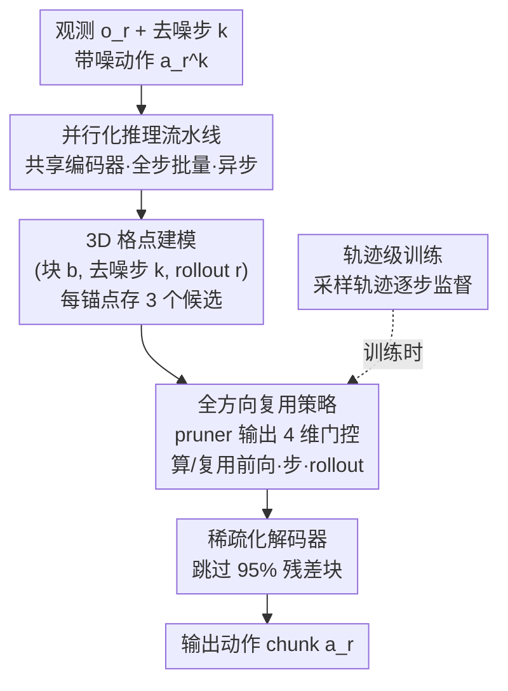

# Test-time Sparsity for Extreme Fast Action Diffusion

**会议**: CVPR 2026  
**论文**: [CVF Open Access](https://openaccess.thecvf.com/content/CVPR2026/html/Ji_Test-time_Sparsity_for_Extreme_Fast_Action_Diffusion_CVPR_2026_paper.html)  
**代码**: https://github.com/ky-ji/Test-time-Sparsity  
**领域**: 机器人 / 具身智能  
**关键词**: 动作扩散, Diffusion Policy, 推理加速, 特征复用, 测试时稀疏

## 一句话总结
针对动作扩散策略（Diffusion Policy / VLA）迭代去噪太慢的问题，本文提出"测试时稀疏"：用一个轻量 pruner 在每次前向时动态预测可剪枝的残差块，再配上"全方向特征复用"和高度并行化的推理流水线，在 95% 稀疏率下做到无损精度、FLOPs 降 92%、动作生成提速约 5 倍，推理频率达 47.5 Hz。

## 研究背景与动机

**领域现状**：动作扩散（action diffusion）因为能很好地建模多模态动作分布，已经成为现代视觉运动策略（Diffusion Policy）和 VLA 模型里生成动作 chunk 的主力模块，尤其适合复杂灵巧操作任务。

**现有痛点**：扩散天生要做多步迭代去噪，频率太低——Diffusion Policy 在消费级 GPU 上只有 6 Hz、3D Diffusion Policy 只有 5 Hz，而真实机器人任务往往要求 30 Hz 以上，差距巨大。现有的加速做法（复用缓存特征）主要是图像扩散那一套搬过来的：要么复用上一轮 rollout 部分去噪后的动作，要么复用上一去噪步的中间特征。

**核心矛盾**：这些方法都依赖**静态调度**（固定间隔更新缓存、离线生成复用计划），而开放环境里策略是动态的——多轮交互、感知不断变化，每次前向的"稀疏模式"其实一直在变。静态调度跟这种演化中的动态对不上，所以要么剪不动、要么剪狠了精度崩。

**本文目标**：让加速调度**随策略动态自适应**，并且把这种自适应做到既能在测试时跑、又不引入新的开销。具体要解决两个瓶颈：① 每步都重复做条件编码 + 剪枝预测，这部分开销会把省下来的解码时间又吃回去；② 激进稀疏（95%）下，光靠"上一去噪步"的缓存特征不足以约束巨大的剪枝误差。

**切入角度**：作者观察到不同 rollout 迭代之间的特征高度相似（图 6），而且把某个特征当锚点、可视化来自不同方向的缓存特征会发现它们都和锚点对齐良好，且各自有互补优势（不同的逼近角度、更短的潜空间距离，图 7）。这说明历史特征里藏着远比"单方向"更丰富的可复用信息。

**核心 idea**：用一个共享编码器的轻量 pruner 在**测试时动态**预测每个残差块该算还是该复用，并把可复用的来源从"单方向"扩成"全方向"（当前前向 / 上一去噪步 / 上一 rollout），再用并行化流水线把 pruner 和编码器的额外开销压到毫秒级。

## 方法详解

### 整体框架

动作扩散 transformer 由一个条件编码器和一个 transformer 解码器组成。解码器把带噪动作 $a_r^k$ 作为 token，经过 $L$ 层（每层含自注意力 SA、交叉注意力 CA、前馈 FFN 三个残差块）逐步精炼。第 $l$ 层的更新是残差求和 $h_k^l = h_k^{l-1} + \mathrm{SA}_k^l + \mathrm{CA}_k^l + \mathrm{FFN}_k^l$，因为"块（block）"是最小残差计算单元，所以它就是本文的**剪枝目标**——整个解码器共 $3L$ 个块。

整套方法走的是"先剪后复用（prune-then-reuse）"范式：一个参数化 pruner 预测每次前向里哪些残差块可以跳过，跳过的块用缓存特征顶替。围绕这个范式，本文搭了四个组件：① **并行化推理流水线**把非解码器（编码 + 剪枝）的延迟压到毫秒；② **全方向复用**在 95% 稀疏率下靠多方向缓存约束剪枝误差；③ **3D 格点建模**高效组织海量历史特征；④ **轨迹级训练**监督全方向复用策略的学习。

### 关键设计

**1. 并行化推理流水线：把 pruner 自身的开销从 182ms 压到 0.45ms**

朴素范式里最大的瓶颈是自回归去噪循环里的重复操作。测试时剪枝确实把解码延迟从 705ms 降到了 95ms（95% 稀疏），但 pruner 自己每步都要重复推理，反而吃掉 182ms——比省下来的解码还多。直接"一次性编码所有去噪步"虽然能解耦循环，但实验（图 5 的损失曲线）显示 all-step 编码下 pruner 精度明显变差，存在"全步编码效率 vs 单步编码精度"的根本权衡。

本文的解法是**用批量并行绕开这个权衡**：pruner 虽然按单个去噪步 $k$ 设计，但推理时把它重写成大批量操作——先一次性算好所有 $K$ 个去噪步的正弦位置嵌入，再把时间维 $K$ 折叠进 batch 维 $N$，形成有效批大小 $N\times K$ 的大张量喂进 pruner 一次前向，同时算出所有步的剪枝掩码。这样 $K$ 步串行循环就变成一次全批量前向。再叠加三招：① pruner 与扩散 transformer **共享条件编码器**，省掉 40ms 的重复编码；② 用一个轻量 transformer decoder block 实例化 pruner，它把块索引编码成 query、以共享编码器输出为条件，再过 MLP head 出掩码 $M\in\{0,1\}^{3L}$；③ **异步流水线**——给编码器和 pruner 各设一个 buffer 把一次性算好的条件嵌入和掩码存起来，之后进入"只跑解码器"的循环；并且因为分析发现除首步外 pruner 几乎跳光早期步的计算（图 4），作者在条件编码后开两个并行线程让 pruner 和解码器重叠运行，最终把测试时剪枝开销压到只剩 0.45ms。

**2. 全方向复用 + 3D 格点建模：在 95% 稀疏下用多源缓存压住剪枝误差**

只复用"上一去噪步"的单方向缓存，在高稀疏下会严重掉点（见消融表）。本文把历史特征空间建模成一个由三条正交轴定义的 **3D 格点**：块索引 $b$、去噪步 $k$、rollout 迭代 $r$，每个锚点特征落在坐标 $(b,k,r)$。沿每条轴各保留"最近一次更新"的特征——例如上一轮 rollout 的缓存坐标是 $(b,k,r{-}1)$，与锚点只差一个索引。于是每个锚点天然有三个候选缓存（前向方向、去噪步方向、rollout 方向），全局只需为三个方向各维护一个轻量 buffer，避免直接存 5 万~20 万级别的原始历史特征。

复用的"选哪个"被直接做进 pruner：对第 $b$ 块、第 $k$ 步，pruner 输出一个 4 维门控向量 $p_{b,k}=(p^C_{b,k}, p^F_{b,k}, p^T_{b,k}, p^R_{b,k})$，四个分量分别表示"重新计算 / 复用前向缓存 / 复用去噪步缓存 / 复用 rollout 缓存"的置信度。推理时对门控做 $\arg\max$ 离散化得到掩码 $M_{b,k}$。残差更新写成

$$h_k^{\lfloor b/3\rfloor} = h_k^{\lfloor b/3\rfloor-1} + M^C_{b,k}d_{b,k} + M^F_{b,k}\delta^F_b + M^T_{b,k}\delta^T_b + M^R_{b,k}\delta^R_{b,k}$$

其中 $d_{b,k}$ 是新算的特征，$\delta^F_b,\delta^T_b,\delta^R_{b,k}$ 是三个方向的缓存。一旦选择"算"（$M^C_{b,k}=1$），三个方向的缓存都按 $\delta \leftarrow (1-M^C_{b,k})\delta + M^C_{b,k}d_{b,k}$ 同步刷新。"多方向互补"是这步有效的关键——不同方向的缓存对同一锚点提供不同逼近角度与更短距离，联合起来才足以在 95% 稀疏下保住动作保真度。

**3. 轨迹级训练：让 rollout 方向的复用策略学得到监督**

$\arg\max$ 不可导，训练时用 **Straight-Through Estimator（STE）**让梯度穿过离散门控（前向保持离散行为、反向当成可导）。更关键的是"按单次前向监督"学不到 rollout 级的复用策略——因为 rollout 方向的相似性要跨多轮才显现。为此本文**采样若干条动作轨迹，沿 rollout 迭代逐步监督稀疏化扩散的输出**：每轮 $r$ pruner 预测掩码 $M_r$，被 $M_r$ 稀疏化的扩散输出动作 $\hat a_r$，每个扩散步后回传梯度，实现整条轨迹的多步监督。优化目标是保真损失加稀疏正则 $L = L_f + L_s$，其中 $L_f = \mathbb{E}_{(o_r,a_r^*)\sim D_{ref}}\big[\|\pi(o_r, M_r) - a_r^*\|\big]$ 拉近稀疏动作与参考动作 $a_r^*$，$L_s = \big|\frac{1}{BK}\sum_{b}\sum_{k} p^c_{b,k} - (1-\rho)\big|$ 把实际计算比例约束到目标剪枝率 $\rho$ 附近。

### 损失函数 / 训练策略
pruner 训练 20 epoch，学习率 $1\mathrm{e}{-4}$、weight decay $1\mathrm{e}{-4}$；Diffusion Policy 的 batch size 为 16，RDT-1B 为 1。剪枝率 $\rho$ 作为超参，分别取 80% / 90% / 93% / 95% 对应不同档位。

## 实验关键数据

### 主实验

Proficient Human（PH）数据上对比各加速方法（Diffusion Policy + DDPM 100 步），本文在 95% 稀疏下做到平均无损：

| 方法 | 稀疏率(%) | 平均成功率(%) | 平均加速 | GFLOPs↓ |
|------|-----------|--------------|----------|---------|
| Dense | 0 | 83 | 1× | 7.88 |
| EfficientVLA | 86 | 72 | 3.46× | 1.24 |
| L2C | 26 | 56 | 1.28× | 5.87 |
| BAC | 90 | 79 | 3.68× | 1.07 |
| **本文** | 93 | **86** | 4.86× | 0.68 |
| **本文** | 95 | **84** | **5.18×** | **0.42** |

跨模型 / 采样器 / 多阶段任务的泛化（成功率均无明显掉点，加速更高）：

| 设置 | 模型 / 采样器 | 稀疏率 | 加速 | 备注 |
|------|--------------|--------|------|------|
| Kitchen（多阶段） | Diffusion Policy / DDPM | 93% | 5.90× | 平均成功率 100，6.33×@95% |
| DDIM 40 步 | Diffusion Policy | 80% | >2.9× | 无损 |
| VLA | RDT-1B / DPM-Solver 50 步 | 90% | >2.5× | 成功率持平甚至提升 |

### 消融实验

PH 数据、93% 稀疏下只复用单一方向 vs 全方向（成功率%）：

| 复用方向 | Can | Transport | Tool | Square | 说明 |
|----------|-----|-----------|------|--------|------|
| 仅前向 (Forward) | 86 | 4 | 50 | 18 | Transport 几乎崩 |
| 仅去噪步 (Timestep) | 86 | 78 | 0 | 80 | Tool 直接归零 |
| 仅 rollout | 10 | 70 | 32 | 80 | Can 崩到 10 |
| **全方向 (Omni)** | **94** | **92** | **56** | **90** | 各任务都最优 |

### 关键发现
- **单方向复用会在某些任务上灾难性失败**：仅前向在 Transport 掉到 4%、仅去噪步在 Tool 掉到 0%、仅 rollout 在 Can 掉到 10%——但失败的任务各不相同，说明三个方向是**互补**的，全方向聚合才能稳住所有任务。
- **pruner 的额外开销才是真正的隐形瓶颈**：朴素剪枝把解码降到 95ms，但 pruner 自己要 182ms，反而成了主导项；并行化流水线把它压到 0.45ms 才让稀疏的收益真正落到墙钟时间上。
- **掩码随 rollout 显著变化**（图 8）：同一任务不同 rollout 轮次的剪枝掩码差别很大，且每个方向都占可观比例，直接印证了"测试时稀疏"随策略动态演化、需要动态调度而非静态调度。
- VLA（RDT-1B）上加速（>2.5×）低于 Diffusion Policy（~5×），因为 RDT-1B 的视觉/语言编码器很重，限制了端到端加速比。

## 亮点与洞察
- **把"测试时稀疏"问题拆成"误差约束"和"开销隐藏"两条独立战线**：一边用全方向复用解决"剪狠了精度崩"，一边用并行化流水线解决"pruner 自己太慢"——两个瓶颈正交，分别打透才有 5× 的实际收益。这种"先量化清楚每个延迟来源、再各个击破"的思路很值得借鉴。
- **3D 格点 + 4 维门控**是个很干净的抽象：把"复用哪个历史特征"统一成沿三条正交轴各取最近缓存、再让 pruner 用一个门控向量同时决定"算还是复用 + 复用哪个方向"，工程上只需三个轻量 buffer 就组织起十万级历史特征。
- **批量并行化绕开 trade-off** 的技巧可迁移：当一个按"单步"设计的小模块成为循环里的重复开销时，把时间维折叠进 batch 维一次性算完，既保单步精度又省循环开销——对任何带 per-step 辅助网络的迭代式推理都适用。

## 局限与展望
- 端到端加速比受制于主干其余部分：RDT-1B 这类重编码器模型上只有 ~2.5×，说明本方法只加速了扩散解码部分，重的视觉/语言编码器仍是瓶颈。
- 全方向复用引入了 STE + 轨迹级监督的训练流程，需要为每个剪枝率档位单独训练 pruner（20 epoch），相比"免训练"的静态缓存方法多了训练成本。⚠️ 论文未充分讨论 pruner 在分布外环境 / 新任务上的泛化与是否需重训。
- 极端任务（如 Tool Hang）即便全方向也只有 56% 成功率，留有较大空间；缓存只保留"每方向最近一个"是否最优、能否引入更长历史，值得进一步探索。

## 相关工作与启发
- **vs EfficientVLA / BAC（reuse-based 静态缓存）**：它们按固定间隔或固定 block-level 规则更新缓存，无法随 rollout 动态调整，在 Kitchen 上 EfficientVLA 只剩 3% 成功率；本文用测试时动态 pruner + 多方向复用，同等稀疏下精度高得多。
- **vs L2C（学习式图像扩散加速）**：L2C 在每次复用前仍强制先计算特征，加速只有 1.28×，且为图像一次性生成设计；本文针对动作扩散的多轮 rollout 特性，把复用扩展到 rollout 方向并真正跳过计算。
- **vs One-Step / Consistency Policy（蒸馏式压缩）**：那条线是把多步去噪蒸馏成单步学生策略，改变模型本身；本文是免蒸馏、即插即用地在原模型上做测试时稀疏，两条路线正交，理论上可叠加。

## 评分
- 新颖性: ⭐⭐⭐⭐⭐ "测试时动态稀疏 + 全方向复用 + 批量并行化绕开 trade-off"组合在动作扩散加速里是新角度
- 实验充分度: ⭐⭐⭐⭐⭐ 覆盖 Diffusion Policy / VLA、DDPM/DDIM/DPM-Solver、多任务 + 多阶段 Kitchen，消融清晰
- 写作质量: ⭐⭐⭐⭐ 瓶颈拆解 + 延迟分解讲得很清楚，部分符号（如 3D 格点更新式）需对照原文
- 价值: ⭐⭐⭐⭐⭐ 把动作扩散推到 47.5 Hz 无损，对实时机器人控制有直接落地意义

<!-- RELATED:START -->

## 相关论文

- [\[CVPR 2026\] Test-Time Perturbation Tuning with Delayed Feedback for Vision-Language-Action Models](test-time_perturbation_tuning_with_delayed_feedback_for_vision-language-action_m.md)
- [\[CVPR 2026\] Adaptive Action Chunking at Inference-time for Vision-Language-Action Models](adaptive_action_chunking_at_inference-time_for_vision-language-action_models.md)
- [\[CVPR 2026\] GraspGen-X: Cross-Embodiment 6-DOF Diffusion-based Grasping](graspgen-x_cross-embodiment_6-dof_diffusion-based_grasping.md)
- [\[CVPR 2026\] Test-time Ego-Exo-centric Adaptation for Action Anticipation via Multi-Label Prototype Growing and Dual-Clue Consistency](test-time_ego-exo-centric_adaptation_for_action_anticipation_via_multi-label_pro.md)
- [\[CVPR 2026\] Fast-ThinkAct: Efficient Vision-Language-Action Reasoning via Verbalizable Latent Planning](fast-thinkact_efficient_vision-language-action_reasoning_via_verbalizable_latent.md)

<!-- RELATED:END -->
