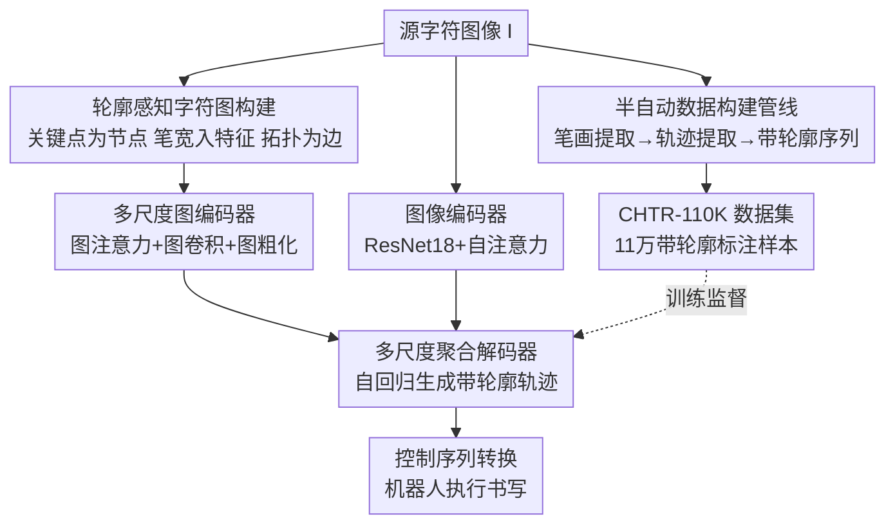

# Towards Human-Like Robot Handwriting via Contour-Aware Generation

**会议**: CVPR 2026  
**论文**: [CVF Open Access](https://openaccess.thecvf.com/content/CVPR2026/html/Qin_Towards_Human-Like_Robot_Handwriting_via_Contour-Aware_Generation_CVPR_2026_paper.html)  
**代码**: https://github.com/RittoQin/CHTR  
**领域**: 机器人 / 具身智能  
**关键词**: 机器人书写, 轨迹重建, 笔画轮廓, 图神经网络, 书法机器人

## 一句话总结
为了让书写机器人写出像人一样有笔锋粗细变化的字，本文提出"轮廓感知手写轨迹重建（CHTR）"新任务，配套构建了 11 万样本的 CHTR-110K 数据集，并用基于多尺度字符图的 G-HTR 方法把字符图像重建成"带笔宽的轨迹序列"，在多项指标上大幅超越 TrajFormer 等 SOTA，并成功部署到真实书法机器人上。

## 研究背景与动机

**领域现状**：让机器写字这件事，现有方法分两条路。一条是**离线生成**（把字符当静态图像生成），能保住字的整体结构，但产出的是图片、没有动态的"先写哪一笔、笔尖怎么走"的信息，机器人没法照着写；另一条是**在线生成**（直接输出书写轨迹），能给机器人提供笔顺和轨迹点，于是机器人能动起来写。

**现有痛点**：在线方法只重建了轨迹的"骨架"——一串坐标点和笔顺，却完全忽略了**笔画轮廓（stroke contour）**，也就是每一笔在不同位置的粗细变化。结果机器人只能用一个固定的笔宽去描这条骨架，写出来的字横平竖直、像印刷体，丢掉了书法那种起笔重、收笔轻、提按顿挫的美感（论文 Figure 1(c) 的红框就在指这个问题）。

**核心矛盾**：人写字时同时维护两样东西——① 由多笔画拓扑连接构成的**整体字形结构**；② 每一笔**带粗细变化的精细轮廓**。已有方法要么只保结构（离线图像）、要么只给骨架轨迹（在线），从来没有人能从单张静态图像里**同时**把这两样恢复出来。更底层的原因是：现有方法都用像素级图像编码器抽特征，它天生只擅长建模相邻像素的局部关系，抓不住字符内在的拓扑结构，也会丢掉浅层网络里那些反映笔画曲率、连接处细节的低层特征。

**本文目标**：定义并解决一个新任务 CHTR——给定一张字符图像，重建出一条既遵循自然笔顺、又保住整体字形、还逐点带笔宽的轨迹序列 $P=\{p_i\}_{i=1}^n$，让机器人能照着写出有笔锋的人类风格字。这又拆成两个现实障碍：**数据缺口**（没有任何数据集同时标了轨迹点+笔顺+轮廓）和**技术难点**（从单图联合恢复结构与轮廓很难）。

**核心 idea**：把字符显式表示成一张**轮廓感知字符图**（节点=带笔宽的轨迹关键点，边=拓扑连接），用图神经网络替代纯像素编码器来建模拓扑结构，再用**多尺度图学习**同时抓住"粗的字形结构"和"细的笔画细节"，最后自回归解码出带轮廓的轨迹序列。

## 方法详解

### 整体框架

本文有两个相对独立的产出：一是**数据构建管线**（半自动地把字符图像标注成带轮廓的轨迹序列，造出 CHTR-110K），二是**重建模型 G-HTR**（推理时只吃一张字符图像、吐出带轮廓的轨迹序列）。两者共享同一套"带轮廓轨迹序列"的表示——每个轨迹点是六维向量 $p=(x,y,w,s_1,s_2,s_3)$：2D 坐标 $(x,y)$、笔宽 $w$、以及三个互斥的 one-hot 笔状态 $s_1$（落笔）、$s_2$（抬笔）、$s_3$（结束）。

推理侧的 G-HTR 由三块串成：**图像编码器** → **多尺度图编码器** → **多尺度聚合解码器**。从源字符图像 $I$ 出发，先构造轮廓感知字符图 $G$ 送进多尺度图编码器抽出多尺度图特征 $F_g$；同时图像编码器抽出全局图像特征 $f_i$；最后解码器把每个尺度的图特征 $f_g$ 和图像特征 $f_i$ 融合，自回归地逐点生成带轮廓的轨迹序列。生成的轨迹再用 CalliRewrite [27] 的笔刷模型+强化学习管线转成机器人控制序列（补上压力、各向异性、停留时间等执行细节），交给书法机器人执行。

### 关键设计

**1. CHTR-110K 与半自动标注管线：用"笔画提取器+轨迹提取器"把图像翻译成带轮廓轨迹**

CHTR 任务卡在没数据上——IAM/ICDAR/CASIA 这些主流字符集要么只有静态图像（无笔顺无轨迹点），要么只有"无视轮廓"的轨迹序列，没有一个同时标了轨迹点、笔顺和轮廓。作者用一条半自动管线从字体库和手写图像里造标注：先用基于 UNet 的笔画检测器 SDNet 当**笔画提取器** $F_{\text{stroke}}$，从图像 $I$ 检测出每一笔的前景区域、笔画类型和笔顺，$\{S_i,t_i,o_i\}_{i=1}^M=F_{\text{stroke}}(I)$，其中笔画类型从 25 个类别里推断、笔顺则通过把空间位置和预测类型跟目标字的标准笔画组成做匹配来确定；再用一个 CNN-LSTM 的**轨迹提取器** $F_{\text{traj}}$ 把每个笔画区域 $S_i$ 逐步解成带轮廓的轨迹 $P_i=F_{\text{traj}}(S_i)$，按笔顺拼接成整字轨迹 $P=[P_1,\dots,P_M]$。最后招 5 名本科志愿者人工纠错、过滤掉没还原好轮廓的序列，约 1500 人时。质量上用渲染轨迹 $\hat S_i$ 和真值 $S_i$ 的 IOU 度量，整库平均 IOU 达 0.972。最终 CHTR-110K 含 110,540 个样本、1,080 种风格、9,837 个字符类，是唯一同时带轮廓+笔顺标注的字符集（见下表 2）。

**2. 轮廓感知字符图：把"笔宽"塞进节点特征，让拓扑结构变成可学的图**

纯像素编码器只看相邻像素的局部关系，抓不住字符的拓扑骨架，也学不到笔宽这种几何量。本文改用一张图来显式表达字符结构。构图时先对输入图像 $I$ 做细化（thinning）抽出骨架 $I_s$，再对密集骨架点聚类得到精简关键点集 $\{p_i\}_{i=1}^N$；每个关键点的笔宽 $w_i$ 取它到字符轮廓的最短距离来估计——这一步正是"轮廓感知"的来源，把粗细信息直接编码进了图。由此构造无向图 $G=(V,E)$：节点 $v_i$ 是关键点，特征向量 $f_g(v_i)=[x_i,y_i,w_i]$ 同时含 2D 坐标和笔宽；边集 $E$ 建模相邻关键点之间的拓扑连接；并给所有节点加自环。这样字形的拓扑连接和笔画粗细就被统一进一个结构化对象，供后续图网络去学。

**3. 多尺度图编码器：图注意力管全局结构、图卷积管局部细节，再粗化出多尺度特征**

字形重建既要全局的字形整体性、又要局部的笔画细节，单一尺度顾此失彼。编码器由若干堆叠的 graph block 组成，每个 block 含一个多头**图注意力层**和一个**图卷积层**：图注意力让所有节点互相交互、抓全局结构关系，对输入图特征做线性投影得 $Q,K,V$ 后按 $Y=\text{Softmax}(QK^\top/\sqrt{D})V$ 计算；图卷积则聚合邻居、抓局部拓扑，更新规则为

$$\tilde f(v_i)=f(v_i)+\frac{1}{|\mathcal N(v_i)|}\sum_{v_j\in\mathcal N(v_i)}w_{ij}f(v_j)$$

每个 block 之后做**图粗化**得到更小尺度的图。**多尺度图学习策略（MGL）**就是从多个 block 输出不同尺度的图特征 $f_g\in\mathbb R^{N\times D}$——浅层 block 给细粒度笔画细节、深层 block 给粗粒度字形结构（论文 Figure 2 直观展示了三个尺度的图）。消融显示这一策略是涨点主力（见下文）。

**4. 多尺度聚合解码器：用交叉注意力自适应融合各尺度图特征，自回归吐带笔宽轨迹**

有了多尺度图特征还得把它们"按需"用起来生成轨迹。解码器自回归生成轨迹 $\hat P=\{\hat p_j\}_{j=1}^L$：在第 $t$ 步，把图像特征 $f_i$ 和之前已生成的点 $\{p_j\}_{j=1}^{t-1}$ 拼成查询向量 $Q_t$，让它通过一连串聚合模块、用交叉注意力去 attend 多尺度图特征 $F_g$，自适应地聚合不同尺度的结构信息，最终输出 6 维 $O_t$——即笔画参数 $(\hat x_t,\hat y_t,\hat w_t)$ 和笔状态 $(\hat s^1_t,\hat s^2_t,\hat s^3_t)$。这种"查询逐尺度聚合"的设计让模型在画细节时多看细尺度图、在维持结构时多看粗尺度图，正好对上手写"边写边兼顾整体与局部"的过程。

### 损失函数 / 训练策略

总损失由笔画预测损失 $L_{\text{pre}}$ 和笔状态分类损失 $L_{\text{cls}}$ 组成，$L=\lambda L_{\text{pre}}+L_{\text{cls}}$，$\lambda$ 是 trade-off 系数、经验设为 0.5。其中坐标和笔宽用 L1 回归

$$L_{\text{pre}}=L_1(\hat x_t-x_t)+L_1(\hat y_t-y_t)+L_1(\hat w_t-w_t)$$

笔状态用交叉熵 $L_{\text{cls}}=-\sum_{i=1}^3 s_i\log\hat s_i$。实现上图像统一缩放到 $256\times256$（CASIA-OLHWDB 为 $64\times64$），图像编码器是 ResNet18 + 3 层自注意力，多尺度图编码器含 4 个 graph block（每个 2 层图注意力、$c=512$、8 头），后三个 block 输出多尺度特征；在单张 RTX 4090 上用 Adam 训练 30 万步（batch 48、学习率 $10^{-4}$、梯度裁剪 2.0），变长轨迹按 $p_i=(0,0,0,0,0,1)$ 补到最大长度。

## 实验关键数据

### 主实验

CHTR-110K 测试集上 G-HTR 在 Font / Handwriting / All 三种场景的全部指标都领先第二名（TrajFormer），下表取 All（完整测试集）的代表性指标。mIOU 衡量笔画轮廓保真度（越高越好），DTW 衡量轨迹距离、LPIPS/FID/HWD 衡量字形与视觉质量（越低越好）。

| 数据集 | 指标 | 本文 G-HTR | 之前 SOTA (TrajFormer) | 提升 |
|--------|------|------|----------|------|
| CHTR-110K (All) | mIOU ↑ | 0.641 | 0.552 | +16.1% |
| CHTR-110K (All) | DTW ↓ | 12.765 | 18.277 | −27.7% |
| CHTR-110K (All) | LPIPS ↓ | 0.066 | 0.092 | −22.8% |
| CHTR-110K (All) | FID ↓ | 1.228 | 1.475 | −16.8% |
| CHTR-110K (All) | HWD ↓ | 1.218 | 1.525 | −20.1% |
| CASIA-OLHWDB | mIOU ↑ | 0.530 | 0.445 | +19.1% |
| CASIA-OLHWDB | DTW ↓ | 16.264 | 23.892 | −31.9% |

在传统（不带轮廓）的 CASIA-OLHWDB 上，即便不靠轮廓优势，G-HTR 的 mIOU / DTW / FID 也全面优于 Cross-VAE、DED-Net、PEN-Net、TrajFormer，说明图建模本身对常规轨迹恢复也有效。

### 消融实验

在 CHTR-110K (All) 上逐步加入图编码器（$\varepsilon_G$）和多尺度图学习（MGL）：

| 配置 | mIOU ↑ | DTW ↓ | FID ↓ | 说明 |
|------|---------|------|------|------|
| Base | 0.532 | 19.228 | 1.642 | 纯图像编码 baseline |
| Base + $\varepsilon_G$ | 0.596 | 15.512 | 1.346 | 加图编码器 |
| Base + $\varepsilon_G$ + MGL | 0.641 | 12.765 | 1.228 | 完整 G-HTR |

### 关键发现

- **图编码器是第一涨点功臣**：加上 $\varepsilon_G$ 后 mIOU +12.03%（0.532→0.596）、DTW −19.33%、FID −18.02%，证明把字符显式建成图、用 GNN 学拓扑，比纯像素编码强很多。
- **多尺度图学习再上一层**：在图编码器基础上加 MGL，mIOU 再 +7.55%（0.596→0.641）、DTW −17.70%、FID −8.76%，说明同时抓粗结构和细笔画的多尺度策略确实补上了单尺度的短板。
- **baseline 改造很关键**：作者把对比方法都改造成支持笔宽建模（调整输入嵌入和输出投影），改造后 TrajFormer 的 mIOU 从 0.104 飙到 0.552、PEN-Net 从 0.048 到 0.144，否则对比不公平；G-HTR 是在这些"已增强 baseline"之上仍领先。
- **失败案例集中在生僻字**：G-HTR 偶尔会把 GB2312-80 集外的生僻字笔顺预测错，根因是训练数据里这类复杂拓扑结构太少；作者计划用 GB18030 等含更多生僻字的集来扩库。
- **真机有效**：部署到书法机器人后，相比 CalliRewrite 因不遵循自然笔顺导致写崩，G-HTR 的轨迹既守笔顺又保结构与笔锋，机器人能写出接近人类的字。

## 亮点与洞察

- **"笔宽=到轮廓的最短距离"这步特别巧**：它把抽象的"笔画粗细"用一个纯几何量算出来，直接塞进图节点特征，让"轮廓感知"不靠额外网络、不靠额外标注网络就内生于图表示里——这是整篇论文把轮廓和结构统一进单一对象的关键支点。
- **图注意力+图卷积分工明确**：一个管全局（所有节点互相 attend）、一个管局部（聚合邻居），再叠多尺度，正好对上"写字要同时顾整体和细节"的直觉，思路清爽且消融可验证。
- **数据集本身就是大贡献**：CHTR-110K 是第一个同时带轮廓+笔顺标注的字符集，0.972 的平均 IOU 标注质量很高；这套"笔画提取器+轨迹提取器+人工纠错"的半自动管线可迁移到其他书写系统（日文、阿拉伯文）造同类数据。
- **把生成轨迹接 CalliRewrite 落地真机**这一步，展示了从"重建"到"具身执行"的完整闭环，对具身 AI / 书法教育有直接应用价值。

## 局限与展望

- **生僻字笔顺易错**：训练数据对复杂拓扑结构覆盖不足，导致 GB2312-80 集外字笔顺预测出错（作者已承认，拟扩库到 GB18030）。
- **依赖较重的数据构建管线**：标注靠 SDNet 笔画检测 + CNN-LSTM 轨迹提取 + 1500 人时人工纠错，迁移到新字符系统时这条管线和人工成本都要重走一遍，自动化程度仍有限。
- **执行细节外包给第三方管线**：压力、各向异性、停留时间等机器人执行要素是借 CalliRewrite 的笔刷模型+RL 完成的，本文模型本身只负责到"带笔宽轨迹"为止，端到端的"图像→真机笔触"还未联合优化。
- **只验证了中文/字体字符**：实验集中在中文手写与字体，对英文连笔、阿拉伯文等连续书写体系是否同样有效未做评估。

## 相关工作与启发

- **vs TrajFormer [24]**：TrajFormer 用 Transformer 建模笔画轨迹的长程依赖，但只输出无轮廓的骨架轨迹、且仍是像素/序列视角，难以同时守住字形结构和笔画细节；本文改用显式字符图 + 多尺度图学习，把笔宽和拓扑一起建模，在 mIOU/DTW/LPIPS 等指标上全面领先。
- **vs PEN-Net / DED-Net / Cross-VAE [6,3,38]**：这些方法是端到端的轨迹恢复网络，缺乏对笔画轮廓的显式建模，定性结果里常保不住整体结构；本文用图结构显式编码拓扑，结构完整性和细节都更好。
- **vs 离线/在线字符生成方法**：离线生成给静态图（无动态笔顺，机器人没法照写）、在线生成给无轮廓骨架（机器人只能用固定笔宽）；CHTR 第一次把"轨迹点+笔顺+轮廓"三者一并产出，填上了两条路各自的缺口。
- **vs 手写生成（风格-内容解耦）方法 [7-9,32]**：那类方法要同时输入内容和参考风格才能生成；本文任务只需单张字符图就能重建轨迹，输入更轻、更贴近"照着一张字写出来"的实际场景。

## 评分
- 新颖性: ⭐⭐⭐⭐⭐ 首次提出 CHTR 任务，把"笔画轮廓"引入轨迹重建，并用字符图+多尺度图学习这一新视角解决，立意和方法都有原创性。
- 实验充分度: ⭐⭐⭐⭐ 自建集+公开集双重验证、消融清晰、还有真机部署，较充分；但对比 SOTA 数量偏少、且部分靠自己改造 baseline。
- 写作质量: ⭐⭐⭐⭐ 问题动机讲得透、图示丰富、公式完整；个别符号（如 $\varepsilon_G$/$\varepsilon_{\text{graph}}$ 混用）略有不统一。
- 价值: ⭐⭐⭐⭐⭐ 数据集+方法+真机闭环俱全，对书法机器人、书写教育和具身 AI 有直接落地价值，CHTR-110K 也利好后续研究。

<!-- RELATED:START -->

## 相关论文

- [\[AAAI 2026\] Towards Affordance-Aware Robotic Dexterous Grasping with Human-like Priors](../../AAAI2026/robotics/towards_affordance-aware_robotic_dexterous_grasping_with_human-like_priors.md)
- [\[CVPR 2026\] IGen: Scalable Data Generation for Robot Learning from Open-World Images](igen_scalable_data_generation_for_robot_learning_from_open-world_images.md)
- [\[CVPR 2026\] Spatial-Aware VLA Pretraining through Visual-Physical Alignment from Human Videos](spatial-aware_vla_pretraining_through_visual-physical_alignment_from_human_video.md)
- [\[CVPR 2026\] GeoDexGrasp: Geometry-aware Generation for Data-efficient and Physics-plausible Dexterous Grasping](geodexgrasp_geometry-aware_generation_for_data-efficient_and_physics-plausible_d.md)
- [\[CVPR 2026\] Beyond Mimicry: Learning Whole-Body Human-Humanoid Interaction from Human-Human Demonstrations](beyond_mimicry_learning_whole-body_human-humanoid_interaction_from_human-human_d.md)

<!-- RELATED:END -->
