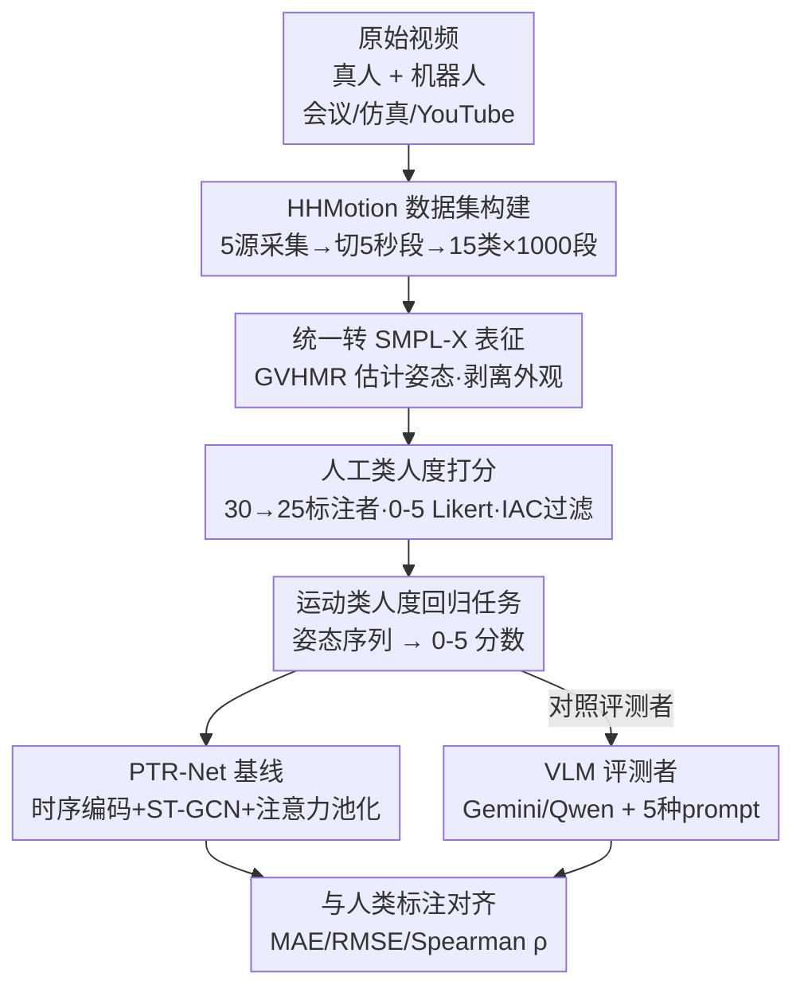

# Towards Motion Turing Test: Evaluating Human-Likeness in Humanoid Robots

**会议**: CVPR 2026  
**论文**: [CVF Open Access](https://openaccess.thecvf.com/content/CVPR2026/html/Li_Towards_Motion_Turing_Test_Evaluating_Human-Likeness_in_Humanoid_Robots_CVPR_2026_paper.html)  
**代码**: http://www.lidarhumanmotion.net/mtt/ （承诺开源数据集+代码+benchmark）  
**领域**: 机器人 / 具身智能（人形机器人运动评测）  
**关键词**: 人形机器人, 类人性评估, 运动图灵测试, SMPL-X, 评测基准

## 一句话总结
作者借鉴图灵测试提出「运动图灵测试」（Motion Turing Test）——只看运动（剥离外观）让人判断一段姿态序列是人还是人形机器人，并发布含 1000 段、15 类动作、11 款机器人 + 真人的 HHMotion 数据集（每段由人工打 0–5 类人度分），同时给出一个简单回归基线 PTR-Net，结果显示当前机器人运动离真人仍有明显差距、连 SOTA 多模态大模型都打不准这个分。

## 研究背景与动机
**领域现状**：人形机器人在运动生成（imitation learning、扩散模型、retargeting）和运动控制（强化学习 + 物理仿真）上进步飞快，在 WRC、WAIC、WHRG 等大会上已能走、跑、跳舞甚至做体操，看起来越来越「自然、像人」。

**现有痛点**：但「像不像人」一直没有统一、可量化的衡量标准。现有运动数据集（AMASS、Human3.6M、Motion-X 等）几乎只收录真人动作，不含机器人；现有机器人运动的评测又集中在任务导向指标——完成率、效率、鲁棒性、末端轨迹精度，而「完成任务」并不等于「运动看起来像人」。人机交互里真正重要的自然度、流畅度、拟人感（anthropomorphism）反而被忽略了。

**核心矛盾**：机器人外观（金属外壳、裸露关节）本身就是强烈的「非人」线索，如果直接给人看机器人原始视频，人靠外观一眼就能分辨，根本测不出「运动」本身像不像人。要公平评测类人度，必须把外观信息彻底剥掉，只留下运动学（kinematic）信息。

**本文目标**：(1) 造一个剥离外观、只比运动的人–机器人对照数据集并给每段动作打类人度分；(2) 把「类人度评估」定义成一个可训练的回归任务，看现有模型（尤其是多模态大模型）能不能逼近人类判断。

**切入角度**：作者把所有视频——无论真人还是机器人——统一用 HPE 方法转成 SMPL-X 无纹理人体模型，让评测者只能看到骨架/姿态、看不到外壳，于是判断只能依赖运动。

**核心 idea**：用「运动图灵测试」框定问题——若人类评测者仅凭身体运动无法可靠区分一段姿态来自真人还是机器人，则该机器人运动「通过」测试；并用人工大规模标注 + 一个回归基线把这个直觉变成可量化、可训练的 benchmark。

## 方法详解
这篇是 benchmark/数据集论文，所以「方法」= 整套评测设计：怎么采数据、怎么统一表征剥外观、怎么让人打分、怎么把打分变成一个模型能学的任务，以及一个简单基线 PTR-Net。

### 整体框架
整条管线分三段：**数据采集与切段** → **统一转 SMPL-X + 人工 0–5 打分**（得到带类人度标签的 HHMotion）→ **把评估定义成回归任务并训一个基线 PTR-Net**（同时拿 VLM 当对照评测者）。输入是各种来源的真人/机器人视频，最终产物是一个能从纯运动序列预测类人度分的基准。

### 关键设计

**1. Motion Turing Test：用「剥离外观、只比运动」把类人度评测做成可判定的图灵测试**

直接给人看机器人视频会被外观「剧透」，所以作者把图灵测试的「不可区分」原则搬到运动上：一段姿态序列若人类仅凭身体运动（无脸、无文字、无颜色）无法可靠判断来自人还是机器人，就算「通过」。落地手段是把**所有**视频统一转成 SMPL-X——一个无纹理的全身参数化人体模型，金属外壳、关节这些视觉线索全被抹掉，评测者面对的真人和机器人长得一模一样，只能盯运动看。这一步是整个 benchmark 公平性的根基：它把「像不像人」从一个被外观污染的混合判断，收敛成纯运动学判断。

**2. HHMotion 数据集：五源采集 + 真人–机器人同类别对照，专门制造"人机难分"的样本**

为支撑评测，作者采了 21.7 小时原始视频，来自 5 个来源：WRC/WAIC/WHRG 等大会的真实机器人（257 段）、仿真环境机器人（基于 LAFAN1 Retargeting 录制，243 段）、10 名志愿者表演同类别动作（365 段）、志愿者**刻意模仿机器人**的动作、以及 YouTube 真人视频（135 段）。每段标准化成 5 秒、含一个完整动作，最终 1000 段、覆盖 15 类动作、11 款机器人（如 Unitree G1、ENGINEAI PM01）。关键巧思是两条对照线：一是真人和机器人按**相同动作类别**采集，能直接做同类别人机对比；二是专门收了「真人模仿机器人」的子集，故意制造介于人与机之间的模糊样本，让 Motion Turing Test 更难、更贴近其本质。表 1 显示 HHMotion 是唯一同时覆盖真人+机器人、MoCap+视频+仿真+真实、且**带类人度评分**的数据集。

**3. 大规模人工 0–5 打分 + IAC 一致性过滤：把"像不像人"变成可信的连续标签**

评估的金标准来自人。作者招 30 名标注者，对全部 SMPL-X 序列在 0–5 Likert 量表上打分（0=「完全机械」，5=「与真人无法区分」），从姿态、节奏、协调三方面评判。为防偏见，500 段真人 + 500 段机器人随机打乱、隐藏来源混在一起，每名标注者评 1000 段、平均花约 16.7 小时，总计 500+ 小时标注。质量控制上做了两层：SMPL-X 序列经人工交叉验证剔除遮挡/反光导致的失败重建；标注侧做 Inter-Annotator Consistency（IAC）检查，剔除 5 名与整体分布不一致的标注者，保留 25 名高一致性标注者的均分作为最终类人度标签。这套流程让「类人度」从主观印象变成一个统计上可靠的连续监督信号。

**4. PTR-Net 基线：把类人度评估定义成回归任务，并用时空建模逼近人类打分**

有了标签，作者把评估正式定义成回归任务：输入一段归一化到局部根坐标系（去掉全局平移/旋转）的 SMPL-X 姿态序列 $X$，输出一个标量类人度分 $s = f_\theta(X)$，$s \in [0,5]$。基线 Pose-Temporal Regression Network（PTR-Net）由三部分串成：**时序编码器**用两层双向 LSTM 捕获长程时间依赖，输出 $H_t \in \mathbb{R}^{2h}$；**时空图卷积（ST-GCN）**把序列重排成人体图，交替做空间图卷积和时间卷积提取关节–帧间协调模式，且采用**无参数邻接矩阵**设计、让特征聚合更自适应（区别于传统骨架 GCN 的固定邻接）；**注意力池化 + 回归头**用时间注意力高亮关键运动片段，再用轻量 MLP 回归出分数。训练目标是 L2 回归损失加一个平滑正则：

$$L = \lVert \hat{s} - s^* \rVert_2^2 + \lambda\, L_{reg}$$

其中 $s^*$ 是人工类人度分，$\hat{s}$ 是预测分，$L_{reg}$ 惩罚预测分在时间上的剧烈波动，鼓励平滑稳定。设计意图很明确——类人度依赖时序连贯性与关节协调，所以基线刻意把时间建模（BiLSTM）和空间协调建模（ST-GCN）都显式拉进来，而不是只看单帧姿态。

**5. VLM 评测者对照 + 五种 prompt 策略：检验大模型能不能替代人打分**

作者另设一条对照线：直接让 SOTA 多模态大模型（Gemini 2.5 Pro、Qwen3-VL-Plus）看渲染出的 SMPL-X 运动视频、按 0–5 打类人度分，并设计了五种递进的 prompt 策略——Direct Evaluation（DE，纯指令直评）、Context-Guided Evaluation（CGE，给一个带参考分的示例）、Prototype-Driven Evaluation（PDE，给覆盖 0–5 全分档的 6 个标注示例做校准）、DE-CoT（链式推理逐步评）、以及作者自己提的 Posture-Aware CoT（PA-CoT，模仿人类评测者：先判动作类型=上肢/下肢/全身，再沿姿态流畅度、动作协调性、核心稳定性三维分析后综合给分）。这条线的目的不是为了提分，而是用来回答「现成大模型能不能当类人度评测器」——答案是否定的，从而凸显这个新任务的难度和 benchmark 的价值。

### 评估指标
用三个互补指标衡量模型预测与人类判断的对齐：平均绝对误差 MAE↓、均方根误差 RMSE↓、Spearman 秩相关 ρ↑（衡量排序一致性）。

## 实验关键数据

### 主实验

不同模型在 Motion Turing Test 基准上的表现（`*` 表示无训练的 VLM 直评）：

| 模型 | MAE ↓ | RMSE ↓ | Spearman ρ ↑ |
|------|-------|--------|--------------|
| Gemini 2.5 Pro (DE)* | 1.3105 | 1.5873 | 0.1609 |
| Gemini 2.5 Pro (PDE)* | 1.2616 | 1.5397 | 0.2188 |
| Gemini 2.5 Pro (PA-CoT)* | 1.2682 | 1.5214 | 0.2303 |
| Qwen3-VL-Plus (shot)* | 1.7714 | 2.1018 | –（输出近似常数） |
| MotionBERT (Frozen) | 0.6846 | 0.9025 | 0.5315 |
| MotionBERT (Fine-tuned) | 0.6252 | 0.8465 | 0.6142 |
| Transformer (Lightweight) | 0.6387 | 0.8259 | 0.5728 |
| **PTR-Net (Ours)** | **0.5813** | **0.7926** | **0.6841** |

人–机器人类人度差距最大/最小的动作类别（仅对真实机器人统计，IAC 过滤后 25 名标注者均分）：

| 类别 | 真人 | 机器人 | 差距 |
|------|------|--------|------|
| stand（最小差距） | 3.80 | 1.97 | 1.83 |
| walk | 3.92 | 2.61 | 1.31 |
| dance | 3.47 | 2.26 | 1.21 |
| jump（最大差距） | 4.43 | 1.20 | 3.23 |
| boxing | 3.76 | 1.23 | 2.53 |
| run | 3.73 | 1.47 | 2.26 |

### 消融实验

PTR-Net 各组件消融（表 4）：

| 配置 | MAE ↓ | RMSE ↓ | ρ ↑ | 说明 |
|------|-------|--------|-----|------|
| w/o 时序编码器 | 0.7631 | 0.9691 | 0.3610 | 去掉 BiLSTM，ρ 暴跌、误差大增 |
| w/o 注意力池化 | 0.6185 | 0.8203 | 0.6255 | 排序相关性下降 |
| w/o $L_{reg}$ | 0.5983 | 0.7958 | 0.6215 | 训练稳定性/一致性变差 |
| Full Model | 0.5813 | 0.7926 | 0.6841 | 完整模型最优 |

### 关键发现
- **时序编码器贡献最大**：去掉它后 ρ 从 0.6841 跌到 0.3610（几乎腰斩），说明类人度判断高度依赖长程时间动态而非单帧姿态——这也呼应了「机器人最不像人的恰恰是动态动作」。
- **机器人离真人差距集中在动态、对抗、反应类动作**：jump（差 3.23）、boxing（差 2.53）、run（差 2.26）、pingpong（差 2.24）分差最大；而 walk、stand、dance 这类平滑/周期性动作人机分差最小。结论是当前机器人能较好复现结构化、节律重复的动作，但缺乏精细流畅度、自适应与平衡控制。
- **仿真比真实更"像人"**：仿真环境里的机器人运动评分高于真实机器人，暴露 sim-to-real 在类人度上的差距。
- **大模型打不准这个分**：即便用 PA-CoT，Gemini 2.5 Pro 的 ρ 也只有 0.23、MAE 高达 1.27；Qwen3-VL-Plus 在五种 prompt 下输出几乎不变（ρ 无效），说明现成 VLM 对细粒度运动差异极不敏感，远不能替代人类评测。
- **OOD 泛化与"人模仿机器人"的模糊性**：在训练分布外的新机器人 XPeng IRON（2025.11 发布）上，PTR-Net 预测 4.25、人工均分 4.36，高度吻合；而在「真人刻意模仿机器人」子集上，真人与机器人评分高度重叠——当人故意模仿机械僵硬时，运动学线索已不足以可靠区分，提示真正的类人性还涉及意图性与适应性，而非只有平滑与协调。

## 亮点与洞察
- **「剥离外观、只比运动」是这套 benchmark 最聪明的一招**：用 SMPL-X 把所有主体抹成同一副无纹理骨架，从根上堵死了「靠外观作弊」，让类人度评测第一次真正聚焦运动本身——这个思路可直接迁移到任何「想排除外观干扰、只评运动质量」的任务（如动作生成质量评估、舞蹈/体育动作打分）。
- **「真人模仿机器人」子集是点睛之笔**：它故意制造人机难分的模糊样本，把 benchmark 推到判别边界，也意外揭示了一个深刻结论——类人性不只是平滑协调，还包含意图与适应性，这是当前生成与评测都没解决的维度。
- **"用大模型当裁判"被实证证伪**：在运动细粒度判断上，再强的 VLM + 再精心的 prompt 也敌不过一个简单的时序回归网络，提醒大家别把「LLM-as-judge」无脑套到所有评测任务上。
- **PTR-Net 可当奖励模型反哺生成**：作者指出这个类人度预测器能作为机器人运动生成的评测指标、甚至强化学习里的 reward model，形成「评测→改进生成」的闭环，潜在应用价值高。

## 局限与展望
- **基线仍有明显提升空间**：PTR-Net 的 RMSE≈0.79，作者自己承认这个任务远未解决，回归精度还不够。
- **类人度标签本质主观**：0–5 Likert 是人的主观印象聚合，尽管做了 IAC 过滤，不同文化/人群对「像人」的判断可能有系统性偏差，跨标注群体的泛化性未充分验证。
- **依赖 HPE 重建质量**：所有评测建立在 GVHMR 把视频转成 SMPL-X 的前提上，遮挡、反光、快速运动下的重建误差会直接污染下游评分，机器人形态与人体差异大时尤甚。
- **动作类别与机器人型号有限**：15 类动作、11 款机器人虽已是首个此类数据集，但相对真实世界动作空间仍偏窄；许多关键细节（PTR-Net 网络细节、IAC 流程、指标公式）放在 Supplementary，正文不完整。
- **改进思路**：可引入物理一致性/接触建模显式刻画动态接触类动作（jump/boxing 正是最难的）、用更强的运动表征替代纯 SMPL-X 关节、或把「意图/适应性」维度显式建模进评分。

## 相关工作与启发
- **vs 真人运动数据集（AMASS / Human3.6M / Motion-X）**：它们只收真人动作、用于运动生成，本文是首个同时含真人+机器人、且**带类人度评分**的数据集，目标从「生成」转向「评测像不像人」。
- **vs LAFAN1 Retargeting / AMASS Retarget**：这些把真人动作 retarget 到机器人以让其更自然，但只产出机器人运动、不评测类人度，且有明显 sim-to-real 差距；本文恰恰用 benchmark 量化出了这个差距。
- **vs 任务导向机器人评测（完成率/效率/末端轨迹）**：传统评测只看「事情有没有做成」，本文论证「任务成功 ≠ 运动像人」，补上感知层面的自然度/流畅度/拟人感评测。
- **vs LLM-as-judge / VLM 评测范式**：本文用实验说明现成 VLM 在细粒度运动类人度判断上严重不足，一个简单的专用回归网络反而更准，给「该不该用大模型当裁判」提供了一个反例数据点。

## 评分
- 新颖性: ⭐⭐⭐⭐⭐ 首个「运动图灵测试」框架 + 首个带类人度评分的人–机器人对照数据集，问题定义本身就新。
- 实验充分度: ⭐⭐⭐⭐ 数据规模大（1000 段、500+ 标注小时）、对照充分（VLM/MotionBERT/Transformer + 消融 + OOD），但基线网络细节多在 Supplementary、正文略单薄。
- 写作质量: ⭐⭐⭐⭐ 动机清晰、图表丰富、结论有洞察；个别表述（IAC、指标公式）外放补充材料。
- 价值: ⭐⭐⭐⭐⭐ 为人形机器人运动「像不像人」立了可量化标准，能直接当生成评测与 RL 奖励模型，对具身智能社区实用价值高。

<!-- RELATED:START -->

## 相关论文

- [\[CVPR 2026\] Beyond Mimicry: Learning Whole-Body Human-Humanoid Interaction from Human-Human Demonstrations](beyond_mimicry_learning_whole-body_human-humanoid_interaction_from_human-human_d.md)
- [\[CVPR 2026\] Iterative Closed-Loop Motion Synthesis for Scaling the Capabilities of Humanoid Control](iterative_closed-loop_motion_synthesis_for_scaling_the_capabilities_of_humanoid_.md)
- [\[NeurIPS 2025\] Adversarial Locomotion and Motion Imitation for Humanoid Policy Learning](../../NeurIPS2025/robotics/adversarial_locomotion_and_motion_imitation_for_humanoid_policy_learning.md)
- [\[CVPR 2026\] Do You Have Freestyle? Expressive Humanoid Locomotion via Audio Control](do_you_have_freestyle_expressive_humanoid_locomotion_via_audio_control.md)
- [\[CVPR 2026\] Gallant: Voxel Grid-based Humanoid Locomotion and Local-navigation across 3D Constrained Terrains](gallant_voxel_grid-based_humanoid_locomotion_and_local-navigation_across_3-d_con.md)

<!-- RELATED:END -->
