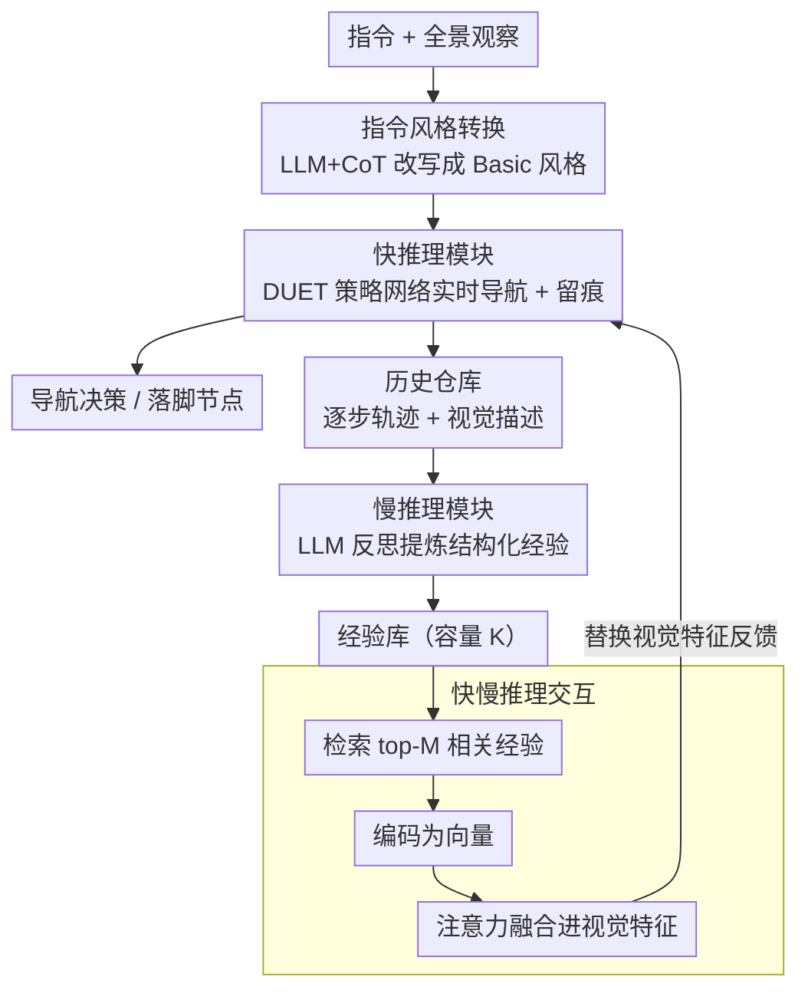

# Towards Open Environments and Instructions: General Vision-Language Navigation via Fast-Slow Interactive Reasoning

**会议**: CVPR 2026  
**arXiv**: [2601.09111](https://arxiv.org/abs/2601.09111)  
**代码**: 无  
**领域**: 机器人 / 具身智能 / 视觉语言导航  
**关键词**: 视觉语言导航, 快慢推理, 经验库, 场景泛化, 指令风格转换

## 一句话总结

针对开放环境下视觉语言导航（GSA-VLN）任务，受人类快慢认知双系统启发，提出 slow4fast-VLN 框架：快推理模块基于端到端策略网络实时导航并积累历史记忆，慢推理模块借助 LLM 反思生成结构化泛化经验，经验通过注意力融合反馈增强快推理网络，实现在未见环境和多样指令下的持续适应，在 GSA-R2R 数据集上全面超越前 SOTA（GR-DUET）。

## 研究背景与动机

1. **领域现状**：VLN（Vision-Language Navigation）是具身 AI 的基础任务。传统方法如 DUET 遵循封闭集假设——训练与测试数据共享相同的环境风格和指令形式。近期 GR-DUET 提出 GSA-VLN 任务，引入 150 个场景、20 种建筑类型，区分同分布/异分布场景，并设计三类指令风格（Basic、Scene、User），初步解决了视觉层面的场景适应问题。

2. **现有痛点**：(a) 从熟悉测试环境转到 OOD 场景时，智能体产生虚假推理路径（类似幻觉），难以识别自身的局限性；(b) 现有快慢双系统方法将两者设计为独立并行系统——慢推理的经验无法融入快推理的策略网络，导致快推理永远停留在初始水平，面对类似场景仍需重复调用慢推理；(c) GR-DUET 仅关注视觉层面的场景适应，忽略了指令风格多样性的适应问题。

3. **核心矛盾**：在开放世界中，泛化经验无法被压缩为低延迟的直觉响应模式。快慢系统缺乏信息交互意味着智能体在 OOD 场景中始终表现为"新手司机"——泛化与适应能力被削弱。

4. **本文目标**：(1) 如何实现快慢推理的动态交互，让慢思考的经验持续增强快思考？(2) 如何适应异构指令风格？

5. **切入角度**：受 Kahneman《思考，快与慢》中 System 1/System 2 理论启发，慢思考的真正价值不在于一次性解决复杂问题，而在于产生泛化策略来增强快思考系统。

6. **核心 idea**：构建快慢推理动态交互框架——慢推理反思导航历史提炼结构化经验存入经验库，经验通过注意力机制融合到快推理网络的视觉特征中，实现经验驱动的导航决策。

## 方法详解

### 整体框架

这篇论文要解决的核心问题是：当导航智能体走进训练时从没见过的环境、又听到陌生风格的指令时，怎么让它一边干活一边学习、越走越熟练。作者把人类「快思考（直觉）/慢思考（反思）」的双系统搬进 VLN，但关键改动在于让两者形成闭环而非各干各的。整个框架形式化为 $\mathcal{F}=\langle\pi,R,M,A\rangle$：$\pi$ 是负责实时导航的快推理策略网络（基于 DUET），$R$ 是慢推理的反思函数，$M$ 把反思结果提炼成结构化经验并存库，$A$ 再把这些经验喂回快推理网络。

一次完整的回合是这样转的：策略网络先正常导航并把整条轨迹（看到什么、走了哪、成功与否）记进历史仓库；回合结束后慢推理回看这段历史，反思出「在这类场景该怎么走」的泛化规则存进经验库；下一回合遇到相似场景时，快推理网络从库里检索相关经验、把它融进自己的视觉特征再做决策。这样快推理不再停在出厂水平，而是随导航次数累积而进化。指令侧则额外挂一个风格转换模块，把陌生风格的指令先翻译成模型熟悉的形式。

### 关键设计

**1. 快推理模块：让端到端策略网络一边导航一边留痕**

快推理沿用 DUET 作为策略网络 $\pi$，吃进指令、全景观察（全景图像、GPS、邻居节点）和历史导航数据：拓扑映射模块动态维护已访问/可导航/当前节点的地图，全局动作规划做双尺度编码（粗尺度给全局导航分、细尺度生成局部动作），动态融合模块算权重选最高分节点落脚。这套设计本身处理速度快、适合大多数熟悉场景，但它对 OOD 场景没有任何显式的慢认知建模——这正是后面三个模块要补的。它在这里的额外职责是「留痕」：每个节点用 Llama3.2-Vision 生成一段视觉文本描述，整条轨迹 $\mathcal{L}(t_j)$ 连同时间戳、步序号、视点、局部拓扑、指令、所选动作和步指标一起写进历史仓库，作为慢推理反思的原料。

**2. 慢推理模块：把零散历史压成可复用的结构化经验**

如果直接把原始轨迹当记忆塞回去，信息太碎、没法检索——论文也用实验证明了这一点（TourHAMT、OVER-NAV 这类朴素记忆增强方法在该任务上 SR<25%）。所以慢推理的关键不是「记住」而是「提炼」。作者定义了一个固定结构的经验条目 $\mathcal{E}=[S_t, C_s, R_s, T_n, \eta_s, f]^{\top}$，六个字段分别是场景类型、空间上下文、空间规则、导航策略、历史成功率和出现频率；再设计一套结构化 CoT 反思提示模板 $\mathcal{P}$（含角色定义、上下文填充、任务分解、输出格式约束四块），驱动 LLM 把一段导航历史 $\mathcal{X}$ 分析成这样一条经验：

$$\mathcal{E} = \mathcal{F}_{LLM}(\mathcal{P}(\mathcal{X}))$$

经验存进容量为 $K$ 的经验库。这一步的价值在于把 LLM 的自由文本约束成定长、可检索、可向量化的知识——既保住了空间规则的丰富性，又让下游能工程化地用起来。

**3. 快慢推理交互：用注意力把经验「焊」进视觉特征**

这是全文最关键的一环，也是它区别于传统快慢系统的地方——别的方法让慢推理独立处理难题、快慢并行分工，慢思考的成果永远进不了快思考的网络；这里则让经验真正改造快推理的决策。机制分三步走。检索时，从当前上下文 $\mathcal{X}_{cur}$ 抽出检索键 $\mathcal{K}=[S_t^{cur}, C_s^{cur}, T_n^{cur}]$，与库中每条经验算特征相似度，取超过阈值 $\tau_{retrieve}$ 的 $M$ 条最相关经验。编码时，用编码器 $G_{enc}$ 把这些离散字段经嵌入层和线性层转成向量 $F_e(k) \in \mathbb{R}^d$。融合时，把当前视觉特征 $F_v$ 当 Query、经验特征 $F_e^{exp}$ 当 Key/Value 走一遍多头注意力得到 $F_{att}$，再把 $F_v$ 与 $F_{att}$ 拼接、经线性层映射回原维度得到 $F_{fused}$，用它替换策略网络原本的视觉特征输出。如此一来快推理网络做决策时，看到的不只是眼前画面，还叠加了「这类场景以前怎么走才对」的先验，OOD 场景下的鲁棒性随之提升。

**4. 指令风格转换：把陌生指令翻译成模型的母语**

前作 GR-DUET 只管视觉层面的场景适应，却忽略了指令本身也有风格差异——同一条路，儿童、特定角色用户的说法天差地别。作者用 LLM 配 CoT 提示，在训练和导航过程中实时把 Scene、User 风格的指令识别并改写成模型熟悉的 Basic 风格，同时保留核心导航语义；改写时算一个置信度，超过阈值才采用转换结果、否则保留原指令以防翻车。整个模块零额外预训练，是一个轻量、可迁移到任何指令遵循任务的预处理技巧。

### 一个完整示例：经验库如何让导航越走越熟

以论文案例分析里的一次餐厅导航为例，能直观看到快慢闭环怎么随回合收紧。第 1 次进入这个未见场景时，快推理网络的经验库里没有相关条目，智能体在走廊的多分支处走错路、又在餐厅误把别的物体认成目标，整趟耗时约 15 秒、终点误差约 1.5m。回合结束后慢推理回看这段历史，反思出一条经验——比如「餐厅类场景：靠近多桌区域时优先沿主通道前进、目标多在尽头」——连同成功率写进库。此后每一回合都重复「导航→反思→入库→下次检索增强」，经验逐渐积累。到第 5 次再走相似场景时，快推理在做决策前已能检索到这条经验并融进视觉特征，于是在同一个分支口直接选对方向，耗时降到约 8 秒（减少 46.7%）、误差降到约 0.3m（减少 80%）。整个过程没有重新训练策略网络，纯靠经验库的检索-融合让「新手」长成「熟手」。

### 损失函数 / 训练策略

快推理模块沿用 DUET 的训练目标（全局 + 局部动作预测损失）。慢推理是纯 LLM 推理管道，不涉及梯度。需要训练的只有交互环节的融合层参数（$W_{fusion}$、$b_{fusion}$）和经验编码器参数。

## 实验关键数据

### 主实验

**GSA-R2R Basic 指令（环境适应）**：

| 方法 | Test-R-Basic SR↑ | SPL↑ | Test-N-Basic SR↑ | SPL↑ |
|------|-------------------|------|-------------------|------|
| DUET (基线) | 57.7 | 47.0 | 48.1 | 37.3 |
| GR-DUET | 69.3 | 64.3 | 56.6 | 51.5 |
| **slow4fast-VLN** | **70.8** | **65.0** | **58.4** | **52.9** |

**GSA-R2R Scene 指令**：

| 方法 | Test-N-Scene SR↑ | SPL↑ | nDTW↑ |
|------|-------------------|------|-------|
| GR-DUET | 48.1 | 42.8 | 53.7 |
| **slow4fast-VLN** | **50.7** | **46.6** | **57.8** |

**GSA-R2R User 指令**（5 种角色风格下均优于 GR-DUET）

### 消融实验

| FSR | ISC | Test-R-Basic SR | Test-N-Basic SR | Test-N-Scene SR |
|-----|-----|-----------------|-----------------|-----------------|
| × | × | 64.0 | 53.7 | 42.4 |
| × | ✓ | 64.0 | 53.7 | 46.1 |
| ✓ | × | 69.1 | 58.4 | 47.9 |
| ✓ | ✓ | **69.1** | **58.4** | **50.4** |

**经验库容量 $K$ 分析**：$K<50$ 经验不足，$K>100$ 产生冗余干扰，最优范围 50-100。

### 关键发现

- **FSR（快慢推理框架）贡献最大**：加入 FSR 后 Basic 指令的 SR 从 64.0 提升到 69.1（+5.1%），对所有类型指令均有效。
- **ISC（指令风格转换）对 Scene 指令效果显著**：仅对非 Basic 风格指令起作用（Test-N-Scene SR 从 42.4→46.1），符合预期。
- **两个模块协同作用**：在 Test-N-Scene 上达到最佳 50.4，比仅用 FSR 的 47.9 进一步提升。
- **案例分析**：初次导航因缺乏经验在走廊多分支处走错路、在餐厅误识别目标，消耗 15 秒/误差 1.5m；经过 4 次迭代积累经验后，第 5 次导航时间降至 8 秒（减少 46.7%）、误差降至 0.3m（减少 80%）。

## 亮点与洞察

- **快慢推理的"闭环"设计**：不是简单地将快慢系统并行处理不同难度任务，而是让慢推理的经验通过注意力融合真正"改造"快推理的决策过程。这使得系统能随时间进化——导航越多，快推理越强，减少对慢推理的依赖。
- **结构化经验设计**（场景类型+空间上下文+空间规则+导航策略+成功率+频率）非常实用，将 LLM 的自由文本输出约束为可检索、可编码的向量化知识，既保留了地理知识的丰富性又保证了工程可用性。
- **指令风格转换**作为轻量级预处理，用 CoT 提示将多样化指令归一化为模型熟悉的基础风格，是一个简单有效的实用技巧，可迁移到任何指令遵循任务。

## 局限与展望

- 经验库容量有限（$K=50\sim100$），面对极端多样的大规模场景可能不够。可考虑层次化或可扩展的经验组织方式。
- 慢推理依赖 LLM（Llama3.2-vision），实时导航中的推理延迟可能成为瓶颈。论文未详细讨论推理效率。
- 经验检索基于简单的特征相似度匹配，面对语义相似但空间结构不同的场景可能检索错误。更高级的检索策略（如对比学习、图神经网络）值得探索。
- 实验仅在 GSA-R2R 数据集上验证，其他 VLN 基准（如 RxR、REVERIE）上的泛化效果未知。
- 视觉描述依赖 Llama3.2-Vision，其描述质量直接影响经验提取效果。

## 相关工作与启发

- **vs GR-DUET**: GR-DUET 从视觉角度做场景适应，但忽略了指令风格适应。slow4fast-VLN 既通过快慢交互增强场景适应，又通过指令风格转换增强指令适应。
- **vs TourHAMT / OVER-NAV**: 这些记忆增强方法在 GSA-VLN 任务上效果很差（SR<25%），说明简单的记忆机制不足以应对 OOD 泛化。关键在于记忆需要经过反思提炼为结构化经验。
- **vs 传统快慢系统**: 现有方法（如将 LLM 作为慢推理独立处理复杂任务）是"并行分工"模式，slow4fast-VLN 是"反馈增强"模式——慢推理的价值在于持续提升快推理的能力。

## 评分

- 新颖性: ⭐⭐⭐⭐ 快慢推理交互框架有新意，经验库的检索-编码-融合管道设计系统
- 实验充分度: ⭐⭐⭐⭐ 覆盖三类指令风格、消融充分、案例分析详细，但仅一个数据集
- 写作质量: ⭐⭐⭐⭐ 结构清晰，动机充分，案例分析生动直观
- 价值: ⭐⭐⭐⭐ 快慢认知的工程化实现有实际参考价值，适用于需要在线适应的具身智能场景

<!-- RELATED:START -->

## 相关论文

- [\[CVPR 2026\] Fast-ThinkAct: Efficient Vision-Language-Action Reasoning via Verbalizable Latent Planning](fast-thinkact_efficient_vision-language-action_reasoning_via_verbalizable_latent.md)
- [\[CVPR 2026\] ProFocus: Proactive Perception and Focused Reasoning in Vision-and-Language Navigation](profocus_proactive_perception_and_focused_reasoning_in_vision-and-language_navig.md)
- [\[ACL 2026\] VLN-NF: Feasibility-Aware Vision-and-Language Navigation with False-Premise Instructions](../../ACL2026/robotics/vln-nf_feasibility-aware_vision-and-language_navigation_with_false-premise_instr.md)
- [\[CVPR 2026\] DecoVLN: Decoupling Observation, Reasoning, and Correction for Vision-and-Language Navigation](decovln_decoupling_observation_reasoning_and_correction_for_vision-and-language_.md)
- [\[CVPR 2026\] Semantic Audio-Visual Navigation in Continuous Environments](semantic_audio-visual_navigation_in_continuous_environments.md)

<!-- RELATED:END -->
