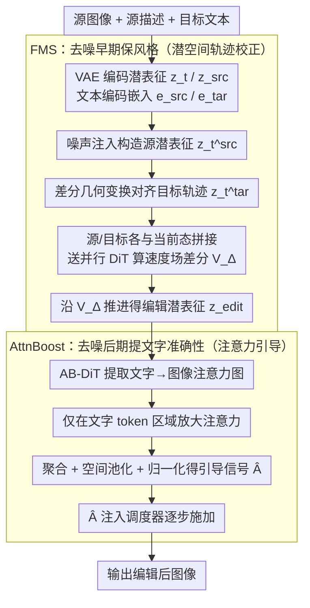

# Towards Training-Free Scene Text Editing

**会议**: CVPR 2026  
**arXiv**: [2603.24571](https://arxiv.org/abs/2603.24571)  
**代码**: [https://github.com/lyb18758/TextFlow](https://github.com/lyb18758/TextFlow)  
**领域**: 机器人  
**关键词**: 场景文字编辑, 免训练, 扩散模型, 注意力增强, 流匹配

## 一句话总结

提出TextFlow，一个免训练的场景文字编辑框架，通过在去噪早期阶段使用Flow Manifold Steering（FMS）保持风格一致性、后期阶段使用Attention Boost（AttnBoost）增强文字渲染准确性，在不需要任务特定训练的情况下达到与训练方法可比甚至更优的编辑质量。

## 研究背景与动机

1. **领域现状**：场景文字编辑（STE）旨在修改/替换自然图像中的文字内容，同时保留背景和原始文字的视觉属性（字体、颜色、大小、几何布局）。生成模型从GAN演进到UNet扩散模型再到Diffusion Transformer（DiT），推动了STE的发展，方法如DiffSTE、AnyText、textFlux等展示了较好的文字渲染性能。

2. **现有痛点**：存在适应性/编辑质量的根本权衡。训练方法需要大规模高质量配对数据（实际中稀缺），合成数据可补充但限制了对多样真实场景的泛化，且计算资源需求大。免训练方法利用预训练模型无需微调，但多数基于注意力操控的方法主要为通用物体编辑设计，在保持精确排版和结构细节方面面临挑战——字符重复、缺失或变形等问题频发。

3. **核心矛盾**：免训练方法的核心困难在于阶段依赖的可控性差异——扩散不同时间步的信噪比不均匀。去噪早期阶段如果不能保持结构和风格基础，编辑轨迹将不稳定；后期阶段如果缺乏足够的语义和空间引导，会导致文字渲染不准确。

4. **本文目标** 如何在不需要训练的情况下同时解决场景文字编辑中的风格保持和文字准确性两个核心问题？

5. **切入角度**：将复杂的STE任务解耦为两个互补阶段，每个阶段由专门的机制处理——早期保持风格，后期提升文字准确性。

6. **核心 idea**：将STE分为两阶段处理——早期用FMS在潜在空间通过轨迹校正保持风格一致性，后期用AttnBoost通过注意力图引导提升文字渲染准确性，实现免训练的端到端编辑。

## 方法详解

### 整体框架

TextFlow 建立在 FLUX-Kontext 的流匹配架构之上，输入是源图像加上源/目标两段文本描述，整个编辑只用 50 步去噪、不动任何权重。它的核心判断是：扩散过程不同时间步的信噪比天差地别，早期扰动大、决定全局结构与风格，后期细节渐显、决定字符长什么样——所以与其全程用一套机制硬扛，不如把去噪轨迹切成两半分而治之。前半段交给 FMS，它把源图像编码进潜空间，靠噪声注入与差分几何变换把源的结构约束"焊"进目标的生成轨迹里，守住风格；后半段交给 AttnBoost，它从 DiT 双流 transformer 块里抽出文字到图像的注意力图并放大，给后期的字符渲染补上精确的空间引导。两段的分界正是落在这条 50 步去噪轨迹的中段，而步数本身也是质量与效率的平衡点——实验里 24 步质量不足、70 步收益递减还更慢，50 步最稳。

### 关键设计

**1. Flow Manifold Steering（FMS）：早期阶段把源的结构焊进编辑轨迹**

免训练方法最容易翻车的地方在去噪早期——如果这一段没把源图像的结构和风格基础锚住，后面的编辑轨迹就会越跑越歪，背景和字体都保不住。FMS 的做法是在潜空间里做一次轨迹校正：先对源潜表征做噪声注入 $\mathbf{z}_t^{src} = (1-t_i)\cdot\mathbf{z}_{src} + t_i\cdot\epsilon$，再用差分几何变换把目标拉回与源对齐的位置 $\mathbf{z}_t^{tar} = \mathbf{z}_t + (\mathbf{z}_t^{src} - \mathbf{z}_{src})$。这里的关键是差分项 $(\mathbf{z}_t^{src} - \mathbf{z}_{src})$，它恰好捕获了噪声注入引入的几何偏移，相当于把"源该有的结构"作为一个硬约束塞进目标轨迹。随后把源、目标各自与当前状态拼接送进并行 DiT 块，算两条轨迹的速度场差分

$$\mathbf{V}_\Delta = \Phi(z_t^{tar,cat}, e_p^{tar}) - \Phi(z_t^{src,cat}, e_p^{src})$$

再沿这个差分把状态推进一步 $\mathbf{z}_{edit} = \mathbf{z}_t + \mathbf{V}_\Delta\cdot(t_{i-1} - t_i)$。之所以有效，是因为它没有去拟合一条全新的目标轨迹，而是只学源到目标的"差量"，结构信息被原样继承下来——消融里去掉 FMS，PSNR 掉 1.95、MSE 涨 39.2%，结构保持立刻崩。

**2. Attention Boost（AttnBoost）：后期阶段把注意力压向字符区域**

风格守住了，字还可能写错——通用编辑方法在文字上常见字符重复、缺失、变形，根子在于后期去噪缺乏对"字该长在哪、长成什么样"的语义和空间引导。AttnBoost 专治这一段：它从双流 transformer 块的自注意力里提取文字-图像的注意力模式，先只在文字 token 的索引范围内对注意力做目标放大 $A_{enhanced}(b,h,q,k) = \mathcal{T}(A(b,h,q,k))$，再取出文字到图像的映射 $A_{t2i}$，沿 query 维聚合、空间池化并归一化，得到一张细粒度引导信号 $\hat{A}$，最后把它整合进调度器一步步施加 $z_{t-1} = \mathcal{S}(z_t, \hat{A}, t)$。本质上是在后期人为加重模型对字符所在区域的关注，逼它把算力花在字形的准确生成上。这一步的作用近乎决定性——去掉 AttnBoost，文字准确率从 79.80% 直接塌到 20.35%。

### 损失函数 / 训练策略

TextFlow 完全免训练，没有任何微调或损失函数，所有能力都来自预训练模型的固有行为。具体配置上，它以 FLUX-Kontext 作核心编辑生成器，用 T5 和 CLIP 提取文本嵌入，采用 Overshoot + Euler 调度器跑 50 步去噪，生成分辨率 384×256（与 ScenePair 数据集对齐）。

## 实验关键数据

### 主实验

| 方法 | SSIM↑ | PSNR↑ | MSE↓ | FID↓ | ACC(%)↑ | NED↑ |
|--------|------|------|----------|------|------|------|
| DiffSTE (训练) | 22.76 | 12.26 | 7.34 | 180.15 | 71.11 | 0.907 |
| AnyText (训练) | 30.73 | 13.66 | 6.05 | 51.44 | 51.12 | 0.734 |
| TextFlux (训练) | 86.57 | 17.96 | 1.83 | 54.64 | 80.40 | 0.911 |
| Flux-Kontext | 87.08 | 20.53 | 1.58 | 15.41 | 78.72 | 0.920 |
| FlowEdit (免训练) | 87.60 | 20.89 | 1.16 | 25.41 | 45.51 | 0.590 |
| **TextFlow (Ours)** | **89.03** | **22.47** | **0.91** | **13.53** | **79.98** | **0.914** |

### 消融实验

| 配置 | SSIM↑ | PSNR↑ | MSE↓ | FID↓ | ACC(%)↑ |
|------|---------|------|------|------|------|
| FlowEdit | 87.60 | 20.89 | 1.16 | 25.41 | 45.51 |
| Ours w/o FMS | 87.09 | 20.47 | 1.35 | 16.69 | - |
| Ours w FMS | 89.04 | 22.42 | 0.97 | 13.52 | - |
| Ours w/o AttnBoost | - | - | - | - | 20.35 |
| Ours w AttnBoost | - | - | - | - | 79.80 |
| Euler调度器 | - | - | - | - | 78.73 |
| Overshoot调度器 | - | - | - | - | 79.90 |

### 关键发现

- TextFlow在图像质量（SSIM、PSNR、FID）上全面最优，MSE（0.91）比第二名Flux-Kontext（1.58）低约42%
- 文字准确率79.98%与训练方法TextFlux（80.40%）接近，但图像质量指标远超——FID 13.53 vs 54.64
- AttnBoost是文字准确性的关键：去掉后ACC从79.80%骤降至20.35%，下降约75%
- FMS对结构保持至关重要：去掉后PSNR下降1.95，MSE增加39.2%
- 50步去噪是最佳平衡点：24步质量不足，70步收益递减且计算开销增大
- Overshoot调度器一致优于Euler：ACC 79.90% vs 78.73%

## 亮点与洞察

- 两阶段解耦策略将"保风格"和"提准确"分而治之，利用扩散过程不同阶段的信噪比特性进行阶段感知引导，是一个通用且优雅的设计哲学
- 作为免训练方法，在图像质量指标上全面超越训练方法极为难得——FID 13.53大幅低于TextFlux的54.64，说明预训练模型的固有能力被有效释放
- 速度场差分的思路（$\mathbf{V}_\Delta$）巧妙利用了流匹配模型的可微轨迹特性，在潜在空间做几何操作保持结构一致性
- AttnBoost的文字区域选择性放大策略可迁移到其他需要精细控制生成内容准确性的任务

## 局限与展望

- 作者承认的局限：扩散模型的计算开销限制了高分辨率实时应用
- 对多行文本和复杂布局处理困难，难以保持空间和排版一致性
- 在ScenePair Random数据集上，文字准确率（74.52%）低于Flux-Kontext（76.63%），说明对随机目标文本的适应性略弱
- 目前仅在裁剪的文字区域上评估，全图编辑的性能和实用性有待验证
- 两阶段的分界点似乎是固定的，自适应的阶段切换策略可能进一步提升性能

## 相关工作与启发

- **vs TextFlux**: TextFlux是训练方法，文字准确性略高（80.40% vs 79.98%），但图像质量指标显著不如TextFlow（FID 54.64 vs 13.53）——说明训练可能过拟合合成数据而损害视觉自然度
- **vs Flux-Kontext**: Flux-Kontext在风格保持上表现不错但文字准确性不足；TextFlow在此基础上额外引入FMS和AttnBoost的双重增强
- **vs FlowEdit**: FlowEdit作为通用免训练编辑方法，在文字场景下准确率仅45.51%；TextFlow通过阶段感知引导专门解决STE挑战
- **启发**: 阶段感知的免训练引导策略可迁移到其他精细控制类编辑任务（如logo编辑、handwriting generation）

## 评分

- 新颖性: ⭐⭐⭐⭐ 两阶段解耦+流形转向+注意力增强的组合在STE免训练方向有创新性
- 实验充分度: ⭐⭐⭐⭐ ScenePair数据集上全面评估，消融覆盖每个模块和超参数
- 写作质量: ⭐⭐⭐⭐ 方法描述数学化且清晰，框架图直观
- 价值: ⭐⭐⭐⭐ 免训练方法达到训练方法水平的里程碑，实用性强

<!-- RELATED:START -->

## 相关论文

- [\[CVPR 2026\] QuantVLA: Scale-Calibrated Post-Training Quantization for Vision-Language-Action Models](quantvla_scale-calibrated_post-training_quantization_for_vision-language-action_.md)
- [\[ACL 2025\] Vulnerability of LLMs to Vertically Aligned Text Manipulations](../../ACL2025/robotics/vulnerability_of_llms_to_vertically_aligned_text_manipulations.md)
- [\[CVPR 2026\] Pixel-level Scene Understanding in One Token: Visual States Need What-is-Where Composition](pixel-level_scene_understanding_in_one_token_visual_states_need_what-is-where_co.md)
- [\[ICLR 2026\] MolLangBench: A Comprehensive Benchmark for Language-Prompted Molecular Structure Recognition, Editing, and Generation](../../ICLR2026/robotics/mollangbench_a_comprehensive_benchmark_for_language-prompted_molecular_structure.md)
- [\[ACL 2026\] GROKE: Vision-Free Navigation Instruction Evaluation via Graph Reasoning on OpenStreetMap](../../ACL2026/robotics/groke_vision-free_navigation_instruction_evaluation_via_graph_reasoning_on_opens.md)

<!-- RELATED:END -->
