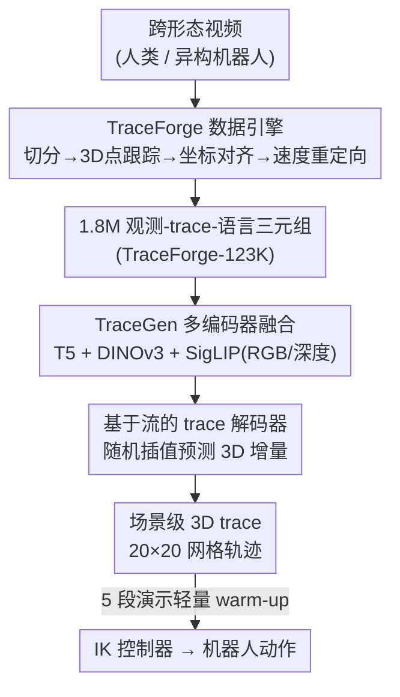

# TraceGen: World Modeling in 3D Trace Space Enables Learning from Cross-Embodiment Videos

**会议**: CVPR 2026  
**论文**: [CVF Open Access](https://openaccess.thecvf.com/content/CVPR2026/html/Lee_TraceGen_World_Modeling_in_3D_Trace_Space_Enables_Learning_from_CVPR_2026_paper.html)  
**领域**: 机器人 / 具身智能  
**关键词**: 世界模型, 跨形态学习, 3D 轨迹, 流匹配, 少样本操作

## 一句话总结
TraceGen 把"世界模型"从像素空间搬到一个紧凑的场景级 3D 轨迹（trace）空间，配套用 TraceForge 数据引擎把 12.3 万段人类与机器人视频统一成一致的 3D trace，预训练出一个跨形态的运动先验，从而只用 5 段目标演示就能在新机器人/新任务上达到 80% 成功率，推理还比基于视频生成的世界模型快 50–600 倍。

## 研究背景与动机
**领域现状**：让机器人在新平台、新场景下学会操作，主流靠收集大量该机器人本体的演示数据，再训 vision-language-action 大模型或多任务策略。但目标本体的演示又慢又贵，而互联网上海量的人类视频、其它机器人数据集明明很丰富。

**现有痛点**：跨形态视频"看着多、用不上"——本体、相机、场景三重差异让它们无法直接复用。已有的"用预训练世界模型"路线也各有硬伤：① 视频生成模型在像素空间预测未来帧，大量算力浪费在和控制无关的背景/纹理上，还会幻觉出错误的几何或抓取（gripper），推理极慢；② VLM 类规划器输出离散 token，空间/时间分辨率太粗，刻画不了精细的物体运动；③ 已有的 trace 预测模型虽然高效、和控制对齐得更好，但大多只在实验室静态演示上训练、且局限于 2D trace，少数 3D 变体（如 3DFlowAction）只盯被操作物体、还得靠目标检测和启发式过滤，引入级联误差又抓不到机器人本体的运动。

**核心矛盾**：像素空间表达能力强但和控制无关的信息太多、算力浪费且不变性差；trace 空间紧凑高效但过去要么是 2D、要么依赖检测器做物体过滤，scale 不上去、也覆盖不了跨形态视频。

**本文目标**：找一个既能抹掉外观/相机差异、又保留操作所需几何结构的统一表示，让模型能从跨本体、跨环境、跨任务的视频里学，并在小数据下快速适配新机器人。

**切入角度**：作者的关键观察是——尽管不同本体在运动学和尺度上千差万别，被操作物体和末端执行器的运动却共享一个以场景为中心的 3D 结构。把这个结构抽出来作为符号化表示，就能对相机和环境天然不变。

**核心 idea**：提出 **trace-space**——一串场景级 3D 轨迹，只记录运动"在哪、怎么动"，丢掉外观与背景；让世界模型 TraceGen 直接在这个空间里预测未来运动，而非在像素空间生成。

## 方法详解

### 整体框架
TraceForge 与 TraceGen 共同构成一个统一的世界建模框架：**TraceForge 是数据引擎**，把异构的人类/机器人视频转成一致的 3D trace 标注，配上多模态观测与语言，产出 {观测, trace, 语言} 三元组；**TraceGen 是世界模型**，在这些大规模三元组上训练，学会一个场景级的运动先验，直接在 3D trace 空间预测未来轨迹。预测出的 3D trace 再交给一个轻量的低层控制器（实验中用逆运动学 IK）翻译成机器人动作。

TraceForge 内部是一条四步流水线：先做事件切分并生成任务指令，再用带相机位姿/深度估计的 3D 点跟踪得到原始 trace，接着做世界→相机坐标变换统一视角，最后做速度重定向把不同时长/速度的演示对齐。TraceGen 内部则是"多编码器特征提取 + 基于流的 trace 解码器"：冻结的 T5、DINOv3、SigLIP 分别编码语言/RGB/深度，融合成条件 token，喂给一个改自 CogVideoX 的流模型，预测速度型的 3D 关键点增量，最后反 patch 成 20×20 网格的 3D 轨迹。

### 关键设计

**1. 3D trace-space 表示：用一串场景级 3D 轨迹代替像素，抹掉外观只留几何**

针对"像素空间浪费算力、token 空间精度不够、已有 trace 只有 2D 或只盯物体"这三重痛点，TraceGen 把世界模型的输出空间定义为 trace-space：在参考帧上铺一个 $20\times20$ 的均匀关键点网格 $K$，跟踪它们在未来 $L$ 步的运动。每个 trace 点表示为 $(x, y, z)$，其中 $(x, y)$ 是图像平面坐标、$z$ 是对应深度。这个"屏幕对齐"的设计很关键——它让 3D trace 和 2D trace 共享同一套屏幕对齐方式，从而可以联合训练、共享监督（语料里约 20% 是纯 2D trace，用来扩大数据量）。

与已有 3D trace 工作（如 3DFlowAction 只盯被操作物体、需要检测器+启发式过滤）不同，这里跟踪的是**整个场景的网格点**——机器人本体和物体一起被建模，不需要 bounding box 或分割掩码，也就不会有检测器的级联误差，得到的是一个完整的物理运动表示。正是这种"丢外观、留几何、覆盖全场景"的紧凑表示，让它对相机和环境天然不变，成为跨本体复用 in-the-wild 视频的桥梁。

**2. TraceForge 数据引擎：把异构视频压成口径一致的 3D trace，才能 scale 到百万级**

光有 trace 表示还不够，问题是怎么从"带运动相机、不同时长、不同本体"的杂乱视频里批量、自动地抽出一致的 3D trace。TraceForge 用四步解决：① **事件切分与指令生成**——有起止索引就按段切，没有就用点跟踪结果剔除几乎不动的帧来定位任务相关片段；再用 VLM 为每段生成三种互补指令（短命令式、多步分解、自然口语式），降低对单一措辞的敏感性。② **3D 点跟踪**——在参考帧铺 $20\times20$ 网格，用 TAPIP3D + CoTracker3 跟踪，并把原本的 MegaSAM 换成 SpatialTrackerV2 微调过的 VGGT 深度/位姿预测器，在精度相当的前提下省掉 3D 优化、大幅提速。③ **世界→相机变换**——用估计的外参把世界坐标下的 trace 变到参考相机帧 $\mathrm{cam}_{\mathrm{ref}}$，再用内参投影得到像素坐标，组合成屏幕对齐的 3D trace $T_{\mathrm{ref}}^{t:t+L} = [x_i, y_i, z_i]_{i=t}^{t+L}$，从而抵消数据采集中的相机运动。④ **速度重定向**——同一任务的人类和机器人演示时长/速度差异很大，若直接用会让模型看到"同一行为却不同长度"。TraceForge 沿 3D 路径计算累积弧长，按归一化弧长参数重采样到固定长度 $L$，在不扭曲局部速度模式的前提下让所有 trace 在长度上对齐。最终汇集 8 个来源、12.3 万段视频、约 180 万三元组，是先前工作的 15 倍以上。

**3. 基于流的 trace 解码器：预测速度型 3D 增量而非绝对坐标，多编码器条件融合**

有了数据，怎么把"多模态观测→未来 3D 运动"建成一个生成模型？TraceGen 建在 CogVideoX 架构上，并借 Prismatic-VLM 的多编码器融合策略：RGB 图过冻结的 DINOv3（几何感知特征）和 SigLIP（语义对齐特征），深度图过带可学习 stem adapter（$1\times1$ 卷积把单通道深度投到 SigLIP 期望的 3 通道）的 SigLIP，语言过冻结 T5-base。视觉流沿特征维拼接 $F_{\text{vis}} = \text{Concat}(F_{\text{dino}}, F_{\text{siglip}}, F_{\text{depth}})$ 再线性投到统一维度 $D$，和文本 token 一起构成条件 $F_{\text{cond}}$。

解码器的巧思在于**不直接预测绝对网格坐标，而预测速度型增量**。作者观察到完整 3D trace 可由时间差分等价重建：$\Delta T_{\mathrm{ref}}^{t} = T_{\mathrm{ref}}^{t+1} - T_{\mathrm{ref}}^{t}$，于是把网络目标设为预测这些关键点增量 $X \in \mathbb{R}^{K\times L\times 3}$。生成采用 Stochastic Interpolant 框架，定义数据与噪声间的插值路径：

$$I_\tau = \alpha_\tau X^1 + \sigma_\tau \varepsilon, \quad \tau \in [0, 1],$$

其中 $X^1$ 是真值 trace 增量、$\varepsilon \sim \mathcal{N}(0, I)$。取线性调度 $\alpha_\tau = \tau,\ \sigma_\tau = 1-\tau$ 时，速度场简化为常数 $\dot{X}^\tau = X^1 - X^0$，训练目标就是回归这个速度：

$$\mathcal{L}_{\text{SI}} = \mathbb{E}_{\tau, X^0, X^1}\left[\|v_\theta(X^\tau, \tau, F_{\text{cond}}) - (X^1 - X^0)\|^2\right].$$

测试时用 100 步 ODE 积分采样轨迹。架构上对 $K=20\times20$ 关键点 × $L=32$ 未来步做 $2\times2$ 空间 patch（每 patch 一个 token，得 $10\times10$ 空间 token），条件经 Adaptive LayerNorm 注入。训练只更新融合层和解码器，所有编码器冻结。在 trace 空间预测增量+只跑轻量解码，正是它比像素视频生成快 50–600× 的根源。

**4. 轻量 warm-up：5 段演示把 embodiment-agnostic 的 trace 翻译到具体机器人**

预训练得到的是一个**与本体无关**的场景级运动先验，但要在某台具体机器人上执行，还需把 trace"翻译"到该机器人的动作空间。作者用极轻量的 warm-up 做这件事：只用 5 段演示微调。两种设定——Robot→Robot（5 段目标机器人 in-domain 演示）和 Human→Robot（5 段手机随手拍、无标定的人类演示，每段仅 3–4 秒，4 个任务共 20 段采集不到 4 分钟）。消融显示性能主要来自预训练而非 warm-up（预训练模型 5 段达 80%，从零训练只有 25%；加到 15 段预训练模型仅升到 82.5%），说明 warm-up 的作用是把已有运动先验对齐到具体任务配置，而非从头学运动——这也解释了为何如此少的数据就够。

## 实验关键数据

### 主实验
在 Franka Research 3 机器人上评测四个真实操作任务：叠衣物（Clothes）、把网球放进盒子（Ball）、用刷子扫垃圾进簸箕（Brush）、把方块放到紫色区域（Block）。给定单帧 RGB-D 和语言指令，TraceGen 预测 3D trace 再经 IK 转关节命令。

| 设定 | 方法 | 参数量 | 4 任务成功率 | 推理效率 |
|------|------|--------|-------------|----------|
| Zero-shot | <10B 的各基线 | <10B | 0%（无可执行轨迹） | — |
| Zero-shot | NovaFlow (Wan2.2/Veo3.1) | >10B | 非零但极低 | 极慢（>600× 时延） |
| 5 段 warm-up | TraceGen | 0.67B | **80%** | 比 trace 基线快 3.8×、比视频生成快 50× 以上 |

关键对比是：除 TraceGen（仅 0.67B）外，所有 <10B 的方法在 zero-shot 下都产生不出可执行轨迹（0% 成功）；大视频生成模型虽有非零 zero-shot 成功率，但推理极慢、且因专有 API 或巨大算力需求几乎无法做 few-shot warm-up。

### 消融实验

预训练 vs 从零训练（不同 warm-up 量）：

| Warm-up | 预训练 | Clothes | Ball | Brush | Block | 总成功率 |
|---------|--------|---------|------|-------|-------|---------|
| 5 robot videos | 从零 | 10/10 | 0/10 | 0/10 | 0/10 | 25.0% |
| 5 robot videos | TraceGen | 10/10 | 6/10 | 8/10 | 8/10 | **80%** |
| 15 robot videos | 从零 | 10/10 | 0/10 | 0/10 | 0/10 | 25.0% |
| 15 robot videos | TraceGen | 10/10 | 9/10 | 8/10 | 6/10 | **82.5%** |

预训练数据来源消融（同样 5 段 warm-up）：

| 任务 | 从零 | 仅 SSV2 | 仅 Agibot | TraceForge-123K |
|------|------|---------|-----------|-----------------|
| Ball | 0/10 | 3/10 | 4/10 | 6/10 |
| Block | 0/10 | 2/10 | 5/10 | 8/10 |
| 总成功率 | 0% | 25% | 45% | **70%** |

Human→Robot：仅用 5 段手机拍摄的人类演示微调，4 任务总成功率 **67.5%**，而 From Scratch 全 0%。

### 关键发现
- **性能主要来自预训练**：5 段演示下预训练 80% vs 从零 25%；warm-up 从 5 加到 15 段，预训练模型仅从 80% 升到 82.5%，说明 warm-up 只是"对齐"而非"学运动"。
- **跨形态数据缺一不可**：单源预训练（仅人类 SSV2 25% / 仅机器人 Agibot 45%）都明显低于跨形态全量（70%），说明本体对齐（机器人数据）和异构运动覆盖（人类+机器人）都重要，二者结合迁移最好。
- **效率压倒性**：trace 空间预测让 TraceGen 比 trace 基线快 3.8×、比大视频生成模型快 50× 以上，NovaFlow(Wan2.2) 时延更是 600× 以上——把像素级视频预测 scale 到实时机器人非常困难。
- **Human→Robot 可行性**：尽管本体、相机内参、场景外观差异巨大，预训练模型仅靠 5 段无标定人类视频就达 67.5%，而从零训练 0%，证明跨形态预训练是 human→robot 迁移的必要条件。

## 亮点与洞察
- **"换表示而非换模型"的世界模型路线**：把世界模型的战场从像素/token 搬到场景级 3D trace，一举同时解决不变性（抹外观/相机）、精度（保几何）、效率（轻量解码）三个问题——这个表示选择本身就是最大的创新，比堆大模型聪明。
- **屏幕对齐的 $(x,y,z)$ 表示让 2D/3D 联合训练**：把深度当作屏幕坐标的第三维，使 3D trace 复用 2D trace 的对齐方式，从而能把大量纯 2D 跟踪数据（约 20%）也纳入训练扩大规模——这是个很实用、可迁移到其它 3D 感知任务的 trick。
- **预测增量而非绝对坐标 + 流匹配**：把目标设成速度型关键点增量，配线性插值使速度场恒定，训练成回归一个常数速度，既稳又快，100 步 ODE 即可采样。
- **跟踪全场景网格而非物体**：彻底甩掉检测器/分割掩码，避免级联误差，还顺带把机器人本体运动也建进来，得到比"只盯物体"更完整的物理表示。

## 局限与展望
- **执行端只用最简 IK 控制器**：作者自己说只用一个基础 tracking 控制器做最小演示，更复杂的策略（用 trace 做规划/跟踪/策略学习的监督）留作未来工作——意味着当前 trace→action 的翻译可能是瓶颈，遇到接触丰富/力控任务时 IK 可能不够。
- **依赖一整套现成的 3D 感知栈**：TraceForge 的 trace 质量取决于 TAPIP3D、CoTracker3、VGGT 深度/位姿估计的准确度，在反光、无纹理、遮挡严重的场景下点跟踪与深度可能失效，进而污染监督信号。
- **评测规模偏小**：真实实验只有 4 个相对桌面级的操作任务、Franka 单臂，每任务 10 次试验；对长程、双臂协同、可变形物体（叠衣物虽涉及但有限）等更难场景的泛化还需验证。
- **trace 表示的固有上限**：纯几何轨迹丢掉了外观/语义/接触力信息，对于需要精细视觉反馈或力觉的任务（如插拔、拧螺丝）可能力不从心；且 $20\times20$ 网格 + $L=32$ 步的分辨率对极精细运动是否够也待考。

## 相关工作与启发
- **vs 视频生成世界模型（NovaFlow / AVDC）**: 它们在像素空间预测未来帧再后处理出 3D 运动，表达力强但算力浪费在背景纹理、会幻觉几何/抓取、推理极慢（600× 时延），且因专有 API/算力几乎无法 few-shot warm-up；TraceGen 直接在 trace 空间预测，快 50–600× 且能轻量适配。
- **vs VLM token 规划器（Gemini Robotics-ER 等）**: 它们输出离散 token，空间/时间分辨率不足以刻画精细物体运动；TraceGen 的连续 3D trace 精度更高、更贴近控制。
- **vs 2D/物体级 trace 方法（Im2Flow2Act / 3DFlowAction）**: 前者多为 2D 且训练于静态实验室演示；后者虽 3D 但只盯被操作物体、需检测/分割掩码（论文 Fig.3 显示其 bounding box 漏掉工具或过宽），引入级联误差且抓不到机器人运动。TraceGen 跟踪全场景网格、无需检测器，并能吃 in-the-wild 跨形态视频，训练数据规模达其 15×。

## 评分
- 新颖性: ⭐⭐⭐⭐⭐ 把世界模型搬到场景级 3D trace 空间是一个干净有力、同时解决不变性/精度/效率的表示创新。
- 实验充分度: ⭐⭐⭐⭐ 真实机器人 + 多设定 + 充分消融（预训练量/数据来源/human→robot），但任务数与本体多样性偏少。
- 写作质量: ⭐⭐⭐⭐⭐ 动机—痛点—方法—证据链条清晰，图（失败案例、pipeline、效率-成功率）很有说服力。
- 价值: ⭐⭐⭐⭐⭐ 给"从跨形态/in-the-wild 视频学操作"提供了实用且高效的范式，少样本与推理速度优势对真实部署意义大。

<!-- RELATED:START -->

## 相关论文

- [\[CVPR 2026\] RoboWheel: A Data Engine from Real-World Human Demonstrations for Cross-Embodiment Robotic Learning](robowheel_a_data_engine_from_real-world_human_demonstrations_for_cross-embodimen.md)
- [\[CVPR 2026\] VideoWorld 2: Learning Transferable Knowledge from Real-world Videos](videoworld_2_learning_transferable_knowledge_from_real-world_videos.md)
- [\[CVPR 2026\] Learning a Unified Latent Action Space from Videos with Action-centric Cycle Consistency](learning_a_unified_latent_action_space_from_videos_with_action-centric_cycle_con.md)
- [\[CVPR 2026\] GraspGen-X: Cross-Embodiment 6-DOF Diffusion-based Grasping](graspgen-x_cross-embodiment_6-dof_diffusion-based_grasping.md)
- [\[CVPR 2026\] SemanticVLA: Towards Semantic Reasoning over Action Memorization via Synergistic Explicit Trace and Latent Action Planning](semanticvla_towards_semantic_reasoning_over_action_memorization_via_synergistic_.md)

<!-- RELATED:END -->
