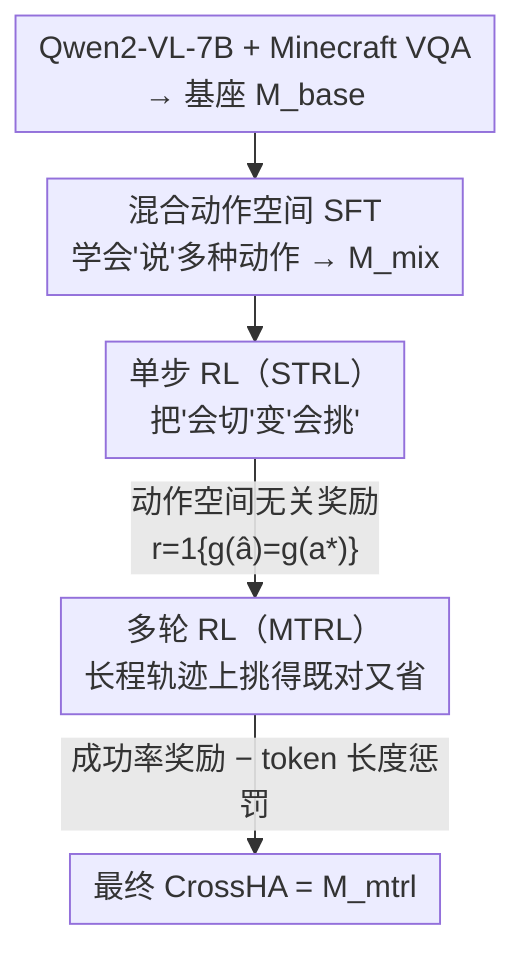

# Training One Model to Master Cross-Level Agentic Actions via Reinforcement Learning

**会议**: CVPR 2026  
**arXiv**: [2512.09706](https://arxiv.org/abs/2512.09706)  
**代码**: https://github.com/CraftJarvis/OpenHA (有)  
**领域**: 具身智能 / Agent / 强化学习  
**关键词**: 异构动作空间, 动作空间选择, 多轮GRPO, 具身游戏智能体, Minecraft

## 一句话总结
CrossHA 把"语言/grounding/motion/原子/latent"等异构动作空间统一进一个 VLM 智能体，用"混合 SFT → 单步 RL → 多轮 RL"的三阶段 GRPO 管线训练它**在轨迹每一步自主挑选最合适的动作空间**，仅用 30 个 Minecraft 任务训练就泛化到 800+ 任务并刷到 SOTA（全任务 ASR 54.6%）。

## 研究背景与动机

**领域现状**：原生智能体（native agentic model）正从"围绕预训练 LLM/VLM 手工搭工作流"转向"用 post-training 直接训出会动作的模型"。但当下的原生智能体几乎都被它所掌握的**单一动作空间**定义死了：GUI 智能体只发鼠标键盘事件，Deep Research 智能体只调 API，Tool-Calling 智能体只走 MCP，VLA 模型只输出机器人指令。

**现有痛点**：把动作空间静态写死带来两个硬伤。其一，特定动作策略或翻译层很脆——API 版 `read_url` 会被 CAPTCHA 挡住、机器人策略可能执行不到位，单一接口的失败率直接给智能体的成功率封顶。其二，人工给任务指派动作空间限制了灵活性，碰到需要多模态交互的复杂场景就抓瞎。

**核心矛盾**：作者的关键观察是——**最优动作空间不仅因任务而异，更在同一个任务内部逐步（step-level）变化**。一个 Deep Research 智能体大部分信息收集用搜索 API 最高效，但遇到 CAPTCHA 防护的网页那一步又必须切到 GUI 级精细操作。高层接口图省事但不够精确，低层原语精确但啰嗦低效，二者存在 efficiency↔precision 的权衡，而这个权衡的最优解是逐步漂移的。

**本文目标**：训出一个**单一**通用智能体，让它在轨迹每一步自主决定"用哪个动作空间 + 具体动作内容"，无需任何人写死的规则，同时兼顾成功率与执行效率。

**切入角度**：既然"该用哪个空间"本质是一个依赖上下文的决策，那就别用启发式规则去拍，而是把"动作空间选择"本身**当作一个可学习的策略变量**，交给强化学习去优化——让模型从经验里学会什么时候切到哪个粒度。

**核心 idea**：用 RL（多轮 GRPO）训练一个掌握异构动作空间的原生智能体 CrossHA，把"逐步选动作空间"建模成策略学习问题，在成功率奖励里额外加一个 token 长度惩罚，逼模型在"能成功"的前提下自发偏好更精简（高层）的动作空间。

## 方法详解

### 整体框架
CrossHA 把任务建模成一个 MDP，但动作空间是**复合的** $\mathcal{A}=\bigcup_{x=1}^{N}\mathcal{A}_x$：每个子空间 $\mathcal{A}_x$ 对应一类动作（从低层电机控制到高层运动原语），并各自配一个接口/控制器 $C_x$ 把抽象动作落地到环境。智能体每一步要同时定"用哪个子空间"和"具体动作内容"，优化目标在即时奖励之外扣掉动作的执行代价：

$$J=\mathbb{E}\Big[\sum_t\big(r_t-\lambda_x\,\text{cost}(a_t)\big)\Big]$$

其中 $\lambda_x\,\text{cost}(a_t)$ 惩罚不同粒度动作的计算/操作开销（如 token 长度或执行时间）。难点在于：在统一空间上"裸训"很难长出可靠的、随上下文走的选择行为。作者因此设计了一条**三阶段递进课程**：先用混合 SFT 让模型学会"说"多种动作的语法语义（但还不会选），再用单步 RL（STRL）把"会切"变成"会挑"，最后用多轮 RL（MTRL）在长程轨迹上把"挑得对"打磨成"挑得既对又省"。整条管线的中间模型依次为 $M_{base}\to M_{mix}\to M_{cs1}\to M_{strl}\to M_{cs2}\to M_{mtrl}$（最后即 CrossHA）。

### 关键设计

**1. 异构动作空间统一进单一策略：把"接口选择"变成可学的动作变量**

针对"动作空间被写死、接口一脆全盘崩"的痛点，CrossHA 不再为不同任务设计不同动作空间，而是把多种**字符串级**动作空间 $\{\mathcal{A}_k\}_{k=1}^{K}$ 全塞进同一个 VLM 的输出里。论文实际覆盖了一个从高层到低层的谱系：LanguageHA（语言指令）、GroundingHA（视觉 grounding，基于 SAM 标注）、MotionHA（运动原语，基于 MineCLIP）、RawHA（原始鼠标键盘原子动作）、LatentHA（latent code）。关键之处在于，每个抽象动作字符串都能被一个**确定性解析器** $g:\mathcal{A}\to\mathcal{R}$ 映回它在原始表示空间 $\mathcal{R}$ 里的规范动作——这把"不同接口生成的同一个真实动作"对齐到了同一个判定标准上，使得后面 RL 可以"不管你用哪个空间表达，只看落地的真实动作对不对"。这正是单一模型能跨空间统一优化的地基。

**2. 混合空间 SFT（Stage-1）：先学会"说"多种动作，不急着学"选"**

针对"直接在统一空间裸训长不出选择行为"的问题，第一阶段刻意把目标降为"语法对齐"而非"决策"。作者用 SAM grounding 管线 + 微调过的 MineCLIP 运动生成模块，为 VPT 数据和部分承包商轨迹自动标注 grounding/motion 真值，拼成混合动作空间数据集 $D_{mix}$，在上面做 SFT 得到 $M_{mix}$。这一步只让模型学会"解码并生成各类动作的语法与语义、且不互相干扰"——$M_{mix}$ 此时**还不会自主选最优空间**，它的选择是被动的。把"会说"和"会选"解耦，是为了给后续决策训练一个干净的起点，避免一上来就让模型在"既要学动作格式又要学策略选择"的双重任务里互相打架。

**3. 单步 RL（STRL）：用动作空间无关的奖励把随机选择拧成策略选择**

$M_{mix}$ 的问题是选择**随机而非有策略**。STRL 先做一个 Diversity-Enhanced SFT 热身：构造提示让模型对同一情境在**所有**可用空间里各生成候选动作，再用拒绝采样过滤——只保留能被环境/解析器验证为成功执行的动作当真值，重平衡后微调得到 $M_{cs1}$（能跨空间产出有效动作，但选哪个仍是随机的）。随后把每个样本看成**单步决策**问题，用 GRPO 优化。GRPO 不像 PPO 那样要单独训一个价值网络，而是对每个 query 采样一组输出 $\{o_1,\dots,o_G\}$，用组内统计量估计 baseline，让优于同组均值的输出获得正优势 $\hat{A}_{i,t}$：

$$J_{\text{GRPO}}(\theta)=\mathbb{E}\Big[\tfrac{1}{G}\sum_{i}\tfrac{1}{|o_i|}\sum_t \min\big(\rho_{i,t}\hat{A}_{i,t},\,\text{clip}(\rho_{i,t},1-\epsilon,1+\epsilon)\hat{A}_{i,t}\big)-\beta D_{\text{KL}}[\pi_\theta\|\pi_{\text{ref}}]\Big]$$

奖励是**动作空间无关**的——$r(\hat a,a^\star)=\mathbb{1}\{g(\hat a)=g(a^\star)\}$：不管用哪个 surface form 生成，只要解析出的原始动作和真值一致就给分。于是模型学会**抛开先验偏好，自主挑那个最可靠产出正确原始动作的空间**，得到 $M_{strl}$。

**4. 多轮 RL（MTRL）：从"单步挑得对"升级到"长程挑得既对又省"**

$M_{strl}$ 单步精度高，但概率分布过度集中在某些空间，限制探索、拖累长程任务。MTRL 用 episodic 成功率作信号。先做 Self-Training 初始化：用 $M_{strl}$ 在原数据集上推理，按规则重标注——若预测动作与真值语义一致（$g(\hat a)=g(a^\star)$）就**采纳 $M_{strl}$ 选的空间**，否则保留原标签：

$$a'(x)=\begin{cases}\hat a(x),&\text{if }g(\hat a(x))=g(a^\star(x))\\ a^\star(x),&\text{otherwise}\end{cases}$$

在重标注数据集 $D_{strl}$ 上 SFT 得到 $M_{cs2}$，让 MTRL 带着"已对齐的空间偏好"这个强先验起步。随后在 30 个任务上做多轮 GRPO，用二元 episodic 奖励 $r(\tau)=\mathbb{1}\{\text{success}(\tau)\}$，并在目标里减去整条轨迹的 token 总数 $l_\theta(\tau)$：

$$J(\theta)=\mathbb{E}_{x\sim\mathcal{T}}\,\mathbb{E}_{\tau\sim\pi_\theta(\cdot|x)}\big[r(\tau)-\lambda\,l_\theta(\tau)\big]$$

这个 token 惩罚正是前面 $\lambda_x\text{cost}(a_t)$ 的落地形式——当高层 API 和原始原语都能成功时，它逼模型**偏好更精简的高层动作空间**，从而自发涌现出"效率优化"行为。最终模型 $M_{mtrl}$ 即 CrossHA。

### 损失函数 / 训练策略
基座 Qwen2-VL-7B-Instruct 先在 Minecraft 专用 VQA/captioning 数据上微调成 $M_{base}$。STRL/MTRL 均用 GRPO；MTRL 阶段从 craft_item / kill_entity / mine_block 三类各取 10 个、共 **30 个**训练任务，在线 RL 训练 **80+ 轮迭代**，每轮 **6400+ 次环境交互**直到收敛。MTRL 目标里的 $\lambda l_\theta(\tau)$ 是核心训练 trick：把"省 token = 偏好高层动作"写进奖励。

## 实验关键数据

环境为 Minecraft 1.16.5，观测仅 360×640×3 第一人称 RGB（20Hz，无特权状态），动作为人类式鼠标键盘接口。评测用 OpenHA benchmark 的 800+ 人工设计任务，分三类：Mine Blocks（导航+物理交互）、Kill Entities（生存+战斗）、Craft Items（GUI 复杂交互）。两个指标定义：

- **FT（Finished Tasks）**：某类任务中至少成功 1 次的不同任务占比，衡量任务覆盖/泛化广度。
- **ASR（Average Success Rate）**：该类所有任务上的平均成功率，衡量可靠性/稳定性。

### 主实验（800+ 任务，All Tasks）

| 方法 | All FT ↑ | All ASR ↑ | Mine FT | Craft FT |
|------|---------|-----------|---------|----------|
| JARVIS-VLA | 63.8 | 24.5 | 55.3 | 74.3 |
| GroundingHA | 59.5 | 23.4 | 61.0 | 27.5 |
| OpenHA | 62.8 | 31.5 | 67.3 | 58.8 |
| Game-TARS | - | 42.2 | - | - |
| CrossHA (w/o STRL) | 44.9 | 41.6 | 35.1 | 55.7 |
| **CrossHA** | 58.7 | **54.6** | **94.7** | **83.3** |

CrossHA 在 ASR 上大幅领先（54.6 vs OpenHA 31.5、Game-TARS 42.2），且在 Mine Blocks（FT 94.7）和 Craft Items（FT 83.3）拿到峰值。单一空间专才各有所长但都偏科：GroundingHA 擅长 Kill Entity（FT 90.1），MotionHA 擅长 Mine Block，RawHA 因精细控制擅长 Craft Item——没有任何单空间 baseline 能全类均衡，凸显动态选择的价值。

### 消融实验（ID vs OOD，全任务 ASR）

| 方法 | ID-All | OOD-All | OOD-Craft |
|------|--------|---------|-----------|
| RawHA-RL | 70.1 | 42.4 | 69.8 |
| GroundingHA-RL | 52.6 | 39.4 | 57.2 |
| MotionHA-RL | 61.9 | 39.1 | 49.0 |
| CrossHA (w/o STRL) | 54.5 | 39.7 | 58.0 |
| **CrossHA** | **68.8** | **49.1** | **78.8** |

### 关键发现
- **STRL 阶段不可省**：去掉 STRL（直接用平衡数据集 $D_{bal}$ 初始化 MTRL）后，OOD All Tasks 从 49.1 掉到 39.7、OOD Craft 从 78.8 掉到 58.0；STRL 既提采样效率又提最终性能、还改善泛化，而其计算开销很低。
- **混合动作空间提升 RL 数据效率**：相比只用 grounding 或 motion 子集初始化的单空间 baseline，CrossHA 收敛更快、渐近性能更高（Figure 3）。
- **动态选择缓解过拟合**：RawHA-RL 的 ID-Craft 高达 96.2 但 OOD 大幅下滑；CrossHA 的 ID↔OOD 落差更小，说明逐步选空间能把学到的环境知识更好地迁移到未见任务。
- **极致泛化**：仅 30 个任务 RL 微调即泛化到 800+ 任务，且在细粒度控制域（Craft Item）增益最明显。

## 亮点与洞察
- **把"接口选择"提升为一等公民的可学策略变量**：以往工作要么写死动作空间、要么手搭脆弱的切换工作流（OpenHA 能切但不把切换当可学决策优化）。CrossHA 第一次用 RL 显式优化"逐步选哪个空间"，这是从"工程拼接"到"学习决策"的范式升级。
- **动作空间无关奖励 + 确定性解析器 $g$**：把"不同 surface form 表达的同一真实动作"对齐到同一判定，让 RL 信号专注于"选得对不对"而非"格式像不像"，是统一异构空间能 work 的关键机制，思路可迁移到任何多接口（API/GUI/工具）的通用智能体。
- **token 惩罚 = 效率涌现的引擎**：仅靠在成功率奖励里减 token 长度，就让模型自发学会"能用高层就别用啰嗦的原语"，把 efficiency↔precision 权衡交给数据自己找平衡，无需人写规则。
- **三阶段"说→挑→省"课程**：先解耦"会说动作"与"会选空间"，再单步拧策略、多轮抓长程效率，递进式课程值得借鉴到其他难以一步到位的复合决策训练。

## 局限性 / 可改进方向
- **仅在 Minecraft 单一环境验证**：尽管 800+ 任务很丰富，但全部在游戏环境内，论文承认未来要扩展到真实机器人场景（届时还有 safety、latency 等新挑战）；当前结论能否迁移到 GUI/Deep Research 等数字域尚待验证。
- **多轮 RL 成本高**：80+ 迭代 × 6400+ 交互/迭代，开销不小，作者把"提升多轮 RL 效率"列为未来工作。
- **动作空间集合人工预设**：5 类动作空间及其标注管线（SAM grounding、MineCLIP motion）仍需人工搭建，模型只在给定集合内选；如何让智能体自己发现/构造新动作空间未涉及。
- **奖励里 cost 仅用 token 长度近似执行代价**：真实"执行时间/失败风险"未必与 token 数线性相关，这个代理可能在某些场景失真（⚠️ 论文以 token 长度作为 cost 的具体实现）。

## 相关工作与启发
- **vs OpenHA / 计算机使用智能体（Operator、CoAct）**：它们也整合多动作空间并支持执行时切换，但切换**不作为可学决策变量**被优化，靠的是 in-context 编排或人搭的脆弱 pipeline；CrossHA 把空间选择形式化为策略学习并用 RL 优化，因而能从经验里学出更稳健的切换。
- **vs 单空间专才（VPT / ROCKET-1 / STEVE-1 / JARVIS-VLA / GroundingHA / MotionHA / RawHA）**：这些模型在各自擅长的类别强但偏科，OOD 迁移弱、方差大；CrossHA 通过动态选空间实现全类均衡且泛化落差更小。
- **vs UI-TARS2 等统一动作空间工作**：它们在训练时合并异构轨迹以增强泛化，但多止步于 SFT 式融合；CrossHA 在融合之上再叠 RL，把"在每一步选最优接口"这件事真正学出来。

## 评分
- 新颖性: ⭐⭐⭐⭐⭐ 首次把"逐步动作空间选择"建模为 RL 可学策略，动作空间无关奖励的设计干净有力。
- 实验充分度: ⭐⭐⭐⭐ 800+ 任务、ID/OOD、STRL 与混合空间消融齐全；但仅限 Minecraft 单环境。
- 写作质量: ⭐⭐⭐⭐ 三阶段管线与模型记号（$M_{mix}/M_{cs1}/M_{strl}/M_{cs2}/M_{mtrl}$）交代清晰，动机层层递进。
- 价值: ⭐⭐⭐⭐⭐ "把接口选择当可学变量 + token 惩罚催生效率"的范式对通用 agent（API/GUI/工具/具身）普适性强，开源代码模型。

<!-- RELATED:START -->

## 相关论文

- [\[CVPR 2026\] Learning to Act Robustly with View-Invariant Latent Actions](learning_to_act_robustly_with_view-invariant_latent_actions.md)
- [\[CVPR 2026\] From Manuals to Actions: A Unified VLA Model for Chain-of-Thought Manual Generation and Robotic Manipulation](from_manuals_to_actions_a_unified_vla_model_for_chain-of-thought_manual_generati.md)
- [\[CVPR 2026\] MergeVLA: Cross-Skill Model Merging Toward a Generalist Vision-Language-Action Agent](mergevla_cross-skill_model_merging_toward_a_generalist_vision-language-action_ag.md)
- [\[ICLR 2026\] Cross-Embodiment Offline Reinforcement Learning for Heterogeneous Robot Datasets](../../ICLR2026/robotics/cross-embodiment_offline_reinforcement_learning_for_heterogeneous_robot_datasets.md)
- [\[CVPR 2026\] Video2Robo: 3DGS-based Synthetic Data from One Video Enables Scalable Robot Learning](video2robo_3dgs-based_synthetic_data_from_one_video_enables_scalable_robot_learn.md)

<!-- RELATED:END -->
