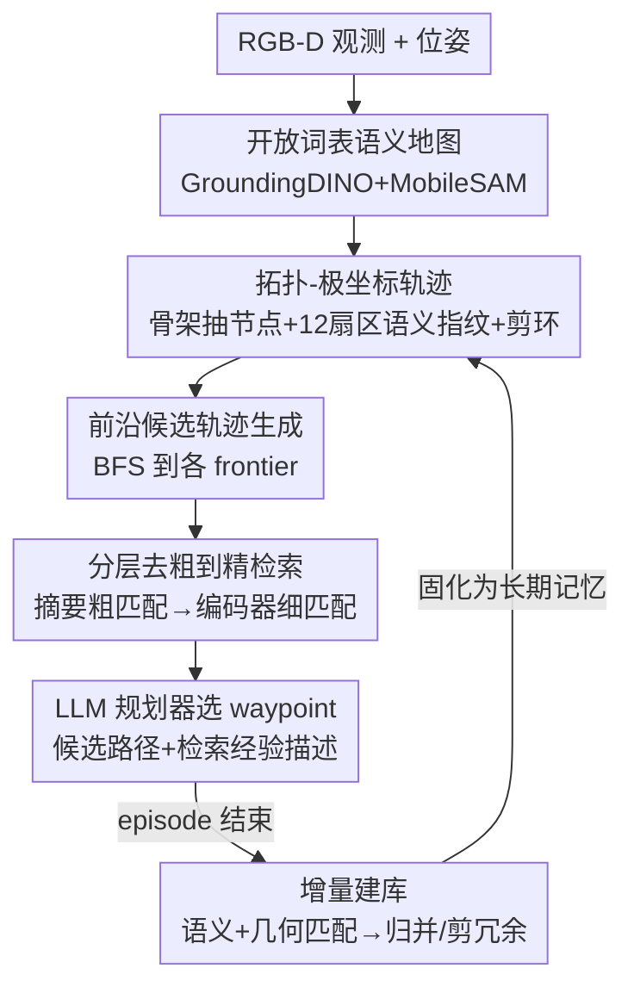

# TrajRAG: Retrieving Geometric-Semantic Experience for Zero-Shot Object Navigation

**会议**: CVPR 2026  
**arXiv**: [2605.01700](https://arxiv.org/abs/2605.01700)  
**代码**: 待确认  
**领域**: 机器人 / 具身导航  
**关键词**: 零样本物体导航, 检索增强生成, 拓扑-极坐标轨迹, 终身记忆, 大模型规划

## 一句话总结
TrajRAG 把历史导航轨迹压缩成"拓扑-极坐标"结构存进一个可终身累积的 RAG 知识库，导航时让每个候选前沿生成一条假想轨迹去粗到精地检索相似历史经验，再把检索到的经验喂给 LLM 规划器选下一个 waypoint，在 MP3D / HM3D-v1 / HM3D-v2 三个零样本 ObjectNav 基准上都刷到了新 SOTA。

## 研究背景与动机
**领域现状**：零样本物体目标导航（ObjectNav）要求 agent 在没见过的环境里、仅凭第一视角 RGB-D 找到指定类别的物体。近期主流做法是借助大模型的常识推理：要么每步把当前观测喂给 LLM/VLM 直接出动作（单步上下文），要么把一段 episode 的观测结构化成相似度图 / 场景图 / 地标图 / 3D 语言特征场作为"情景记忆"再交给大模型推理。

**现有痛点**：这些方法有两个根子上的脱节。其一，大模型的知识来自互联网规模的文本，是"场景无关"的通用常识，而真正能告诉你"卧室里床通常在哪、客厅过去往往是厨房"的，是**具身的 3D 空间经验**——大模型恰恰没有这种经验。其二，情景记忆是"场景特定"的，但**用完即弃**：每跑完一个 episode，辛辛苦苦积累的观测就被丢掉，无法形成跨场景、可迁移的终身经验。结果是 agent 反复在相似布局里重新踩坑、冗余探索、回访已看过的区域。

**核心矛盾**：场景无关的常识推理（大模型）与场景特定的空间经验（情景记忆）之间存在断层，而且现有情景记忆缺乏一个能跨 episode 持续累积的载体。人类导航恰恰同时依赖短期记忆（当下环境细节）和长期记忆（调取相关经验辅助决策），且短期记忆会逐渐固化进长期记忆形成持续学习——具身 agent 缺的正是这套"系统性内部表征"。

**本文目标**：构建一个"长期记忆"，既能（1）持续累积情景记忆，又能（2）检索几何-语义经验去增强大模型推理。

**切入角度**：把检索增强生成（RAG）从文本世界搬到具身世界。但原始轨迹（RGB-D 观测序列）在轨迹内（回访、局部环路）和轨迹间（同场景多次运行的空间重叠）都高度冗余，直接存会爆炸且检索低效，所以关键在于设计一种**紧凑又能精确做空间匹配**的轨迹表征。

**核心 idea**：用"拓扑-极坐标轨迹"把原始观测压成结构化骨架+极坐标语义指纹，组成分层 chunk 的 RAG 库；导航时让候选前沿生成假想轨迹去粗到精检索相似历史经验，注入 LLM 规划，episode 结束再把新轨迹固化回库，实现终身经验累积。

## 方法详解

### 整体框架
TrajRAG 解决的是"如何让大模型规划器用上过去的具身导航经验"。整条管线分两条线：一条是**离线/增量建库**——把历史轨迹转成拓扑-极坐标表征、按几何-语义相似度分组归并、训练一个轨迹编码器做细粒度检索索引；一条是**在线导航**——agent 边走边建语义地图，从前沿生成候选轨迹，去库里粗到精检索相似经验，把经验的自然语言描述连同候选路径一起喂给 LLM 选最优 waypoint，episode 结束把整条轨迹并回库。

具体地，输入是第一视角 RGB-D 观测和位姿，输出是每个决策时刻选定的下一个 waypoint。中间经过：① 用 GroundingDINO + MobileSAM 增量构建开放词表语义地图；② 把可行区域骨架化、抽拓扑节点、给每个节点打 12 维极坐标扇区语义向量，得到拓扑-极坐标轨迹；③ 从前沿生成多条候选轨迹假设；④ 在分层 chunk 库里先用拓扑-极坐标摘要做粗匹配锁定相似布局组，再用训练好的轨迹编码器在组内做细匹配取 top-K 相似轨迹；⑤ 检索到的经验描述 + 候选路径 → LLM 规划器选 $\Pi^*$，局部策略用 A* 走过去。

### 关键设计

**1. 拓扑-极坐标轨迹：把冗余的 RGB-D 序列压成可精确匹配的结构化指纹**

这是全文地基，针对的是"原始轨迹又冗余又难匹配"的痛点。做法分两步。先做**拓扑骨架化**：在语义地图的已探索自由区域 $m_t^{free}$ 上做形态学细化得到一像素宽骨架 $\mathcal{G}_{\text{skel}}=\mathcal{S}(m_t^{free})$，再选 8 邻域内连通分量 $\ge 3$ 的像素作为候选拓扑节点 $\mathcal{V}_{\text{cand}}=\{v\in\mathcal{G}_{\text{skel}}\mid|\mathcal{N}_8(v)|\ge 3\}$（即骨架的交叉/分叉点），并用非极大距离抑制把近邻节点合并。再做**极坐标语义编码**：以每个节点 $v_k$ 为中心向外打极坐标射线，每 $\Delta\theta=30^\circ$ 一个扇区共 12 个，每条射线记录在半径 $R$ 内打到的第一个非自由像素的语义——

$$\phi_k(\theta)=\begin{cases}c,&\text{打到物体 }c\\\text{obstacle},&\text{打到障碍}\\\text{unknown},&\text{打到未知区}\\\text{free},&R \text{ 内无命中}\end{cases}$$

节点的扇区向量 $\mathbf{s}_k=[\phi_k(\theta_1),\dots,\phi_k(\theta_{12})]$ 就是它的几何-语义指纹。为什么用极坐标而非绝对坐标？因为不同 episode 的初始位姿不同，物体绝对位置在跨运行时对不上，而极坐标编码的是**相对**空间关系，天然跨运行可比；扇区划分还让节点特征更可区分，便于后续匹配。最后把每个原始观测段按位姿就近归到最近节点 $v_t^*=\arg\min_{v_k}\|\mathbf{p}_t-\mathbf{p}_k\|_2$，合并连续相同节点消短期回访，再用 $f_{\text{PL}}$ 剪环（节点重现时只保留最后一次出现、丢掉中间所有节点）消长期环路，得到 loop-free 的拓扑-极坐标轨迹 $\mathcal{T}_{\text{tp}}=(\mathcal{V},\mathcal{E})$。相比场景图它空间匹配更准，相比基于地图/点云的匹配它更灵活、算力更省。

**2. 分层 chunk 库 + 去粗到精检索：用拓扑摘要先筛布局组，再用专训编码器精排轨迹**

针对的是"轨迹一多、逐条比对又慢又容易被无关场景干扰"的痛点。库的组织是分层的：每个 **chunk** $\chi_i$ 对应一条拓扑-极坐标轨迹，含轨迹本身 $\mathcal{T}_{\text{tp}}^i$、自然语言描述 $L(\mathcal{T}_{\text{tp}}^i)$、轨迹嵌入 $\mathbf{z}_i=f_E(\mathcal{T}_{\text{tp}}^i)$。几何-语义高度相似的 chunk 被归并成统一的**拓扑-极坐标摘要** $\mathcal{G}_{\text{sum}}=(\mathcal{V}_{\text{uni}},\mathcal{E}_{\text{mrg}})$，作为该组整体布局的**粗索引**。检索时去粗到精：先拿 query 和各摘要比对（同样用扇区语义+几何匹配）锁定相关布局组，把搜索范围收窄到相关组、滤掉无关场景；再在组内做细粒度检索。

因为 chunk 数量远多于摘要，细检索要快，于是专门训了个**轨迹编码器** $f_E$ 当**细索引**：每个节点的 12 维扇区向量 $\mathbf{s}_k$ 先过一个 encoder-only transformer（如 DistilBERT，双向注意力 + 位置不敏感，适合编码极坐标这种环形表征）得节点嵌入 $\mathbf{h}_k$；再把有序节点嵌入序列过 decoder-only transformer（如 DistilGPT2）$\mathcal{D}_{\text{traj}}$ 捕捉遍历顺序的时序相关；最后把末 token 表征和目标语义嵌入 $\mathbf{h}_g$ 拼起来成轨迹嵌入 $\mathbf{z}=f_E(\mathcal{T}_{\text{tp}})=\mathbf{h}_L'\oplus\mathbf{h}_g$。检索就在这个嵌入空间取 top-K 余弦最近邻。后面消融会看到，这个专训编码器比通用文本嵌入显著更强。

**3. 增量建库：语义匹配 + 几何匹配 + 冗余剔除，把新轨迹安全固化进长期记忆**

这是"终身累积"的执行机制，针对"情景记忆用完即弃"的痛点。来一条新轨迹，先和已有摘要做**语义匹配**：算节点扇区向量的相似度矩阵 $S_{ij}=\max_{\Delta\theta}\text{sim}(\text{Rot}(\mathbf{s}_i,\Delta\theta),\mathbf{s}_j)$，其中 $\text{Rot}$ 把 12 维扇区向量循环旋转以补偿不同轨迹的朝向偏差（agent 面朝方向不同也能匹配上语义相似的节点），再用双向 KNN（互为 top-K 才保留）筛出高置信对应。再做**几何匹配**：用匹配节点存的世界坐标跑 RANSAC 估一个 $SE(2)$ 刚体变换 $\mathbf{T}=\arg\min_{\mathbf{T}}\sum\rho(\|\mathbf{T}\mathbf{p}_i-\mathbf{p}_j\|)$ 把新轨迹对齐到摘要，几何相似分取 RANSAC 内点比 $|\mathcal{C}_{\text{in}}|/|\mathcal{C}|$。若找到有效 $\mathbf{T}$ 就并入对应组、扩展 $\mathcal{V}_{\text{uni}}$ 和 $\mathcal{E}_{\text{mrg}}$。最后做**冗余剔除**：若两条轨迹目标相同且节点序列存在严格包含（一条是另一条的同序子序列），短的那条判为冗余丢弃；否则新轨迹给组贡献额外几何-语义上下文。匹配不上任何组的新轨迹则自立门户，作为新组的初始摘要注册进库。这套机制保证库**紧凑而信息丰富**，且能随导航持续扩张。

### 损失函数 / 训练策略
轨迹编码器 $f_E$（含 encoder-only 和 decoder-only 两部分）用对比学习训练：

$$\mathcal{L}_{\text{contrast}}=-\log\frac{\exp(\text{sim}(\mathbf{z}_i,\mathbf{z}_j^+)/\tau)}{\sum_k\exp(\text{sim}(\mathbf{z}_i,\mathbf{z}_k)/\tau)}$$

其中 $\text{sim}$ 为余弦相似度、$\tau$ 为温度。正样本对 $(\mathbf{z}_i,\mathbf{z}_j^+)$ 从同一拓扑组或共享同一导航目标的轨迹采，负样本随机从不同组采；目标是让"同组同目标"的轨迹在嵌入空间靠近、无关的远离。训练时 encoder-only transformer 用预训练权重初始化并**冻结**不更新。建库数据：从 HM3D-v1 ObjectNav 训练集（3.9M episodes，6 类，80 场景）均匀采 20 万+ 条轨迹，从 MP3D 训练集（2.6M episodes，21 类，56 场景）采 15 万+ 条，覆盖各场景的所有楼层和类别。导航规划器用 Qwen3-32B，节点去重距离阈值 $d_{\min}=0.5$m，扇区采样半径 1.5m。为防测试集泄露，TrajRAG 仅在训练数据上预建并在测试时冻结（尽管它原生支持测试时动态更新）。

## 实验关键数据

### 主实验
在 Habitat 仿真器下评测 MP3D / HM3D-v1 / HM3D-v2 三个零样本 ObjectNav 基准，指标为成功率 SR 和按归一化逆路径长度加权的 SPL。"OV"列表示是否支持开放词表目标。

| 数据集 | 指标 | TrajRAG | 之前最好(OV) | 提升 |
|--------|------|---------|--------------|------|
| MP3D | SR / SPL | **42.6 / 18.0** | 41.0 / 17.8 (UniGoal / ApexNAV) | +1.6 / +0.2 |
| HM3D-v1 | SR / SPL | **62.5 / 33.9** | 61.4 / 33.0 (BeliefMapNav / ApexNAV) | +1.1 / +0.9 |
| HM3D-v2 | SR / SPL | **78.1 / 40.2** | 76.2 / 38.0 (ApexNAV) | +1.9 / +2.2 |

TrajRAG 在三个基准上 SR 和 SPL 全部刷新 SOTA。作者把优势归因于核心创新——利用历史导航经验：从一个同时考虑场景上下文和导航相关性的外部知识库里检索最相关轨迹，让 agent 决策更有信息支撑，避免近视行为、在复杂未见环境里更高效地朝开放词表目标前进。

### 消融实验

**节点表征消融（HM3D-v1，Tab.1）**：TNA = 文本邻居聚合；TPS-G = 拓扑-极坐标扇区几何；TPS-S = 扇区语义。

| 配置 | SR(%) | SPL(%) | 说明 |
|------|-------|--------|------|
| TNA | 53.9 | 25.7 | 仅聚合无空间序的文本描述 |
| TPS-G | 48.1 | 22.3 | 仅几何，缺语义线索，最弱 |
| TPS-S | 57.3 | 30.6 | 仅语义，已超 TNA 和 TPS-G |
| TPS-G + TPS-S | **61.7** | **33.2** | 几何+语义互补，最优 |

**检索策略消融（HM3D-v1，Tab.2）**：TE = 文本嵌入；SE = 本文序列嵌入。

| Coarse | Fine | SR(%) | SPL(%) | 说明 |
|--------|------|-------|--------|------|
| ✗ | SE | 54.3 | 25.6 | 去掉粗匹配，直接序列嵌入检索 |
| ✓ | TE | 57.8 | 29.7 | 保留粗匹配但细检索换通用文本模型 |
| ✓ | SE | **61.7** | **33.2** | 完整去粗到精，最优 |

**与其他 RAG 形态对比（HM3D-v1，Tab.3）**：

| 方法 | 检索 / 内容 | SR(%) | SPL(%) |
|------|-------------|-------|--------|
| TrajTextRAG | 文本嵌入 / 文本描述 | 53.3 | 25.6 |
| GraphRAG | 图嵌入 / 文本场景图 | 55.2 | 30.7 |
| TrajRAG (Ours) | 分层检索 / 拓扑-极坐标轨迹 | **61.7** | **33.2** |

**跨数据集泛化（Tab.4）**：用 HM3D-v1 训练集建库在 MP3D val 上测 SR/SPL = 41.7/17.6，反过来 MP3D 库测 HM3D-v1 val = 59.8/31.6，都只比同域略降；两库合并后两个 val 集都达最优（HM3D-v1 62.5/33.9，MP3D 42.6/18.0）。

### 关键发现
- **几何与语义互补、缺一不可**：只用几何（TPS-G）最弱（SR 48.1），加上语义（TPS-S）单独就跳到 57.3，两者合并才到 61.7——几何提供布局骨架、语义提供"这是什么"，少一个都掉点。
- **场景级粗预检索是必需的**：去掉 coarse 直接细检索，SR 从 61.7 掉到 54.3（-7.4），说明先按场景布局筛掉无关上下文对检索质量至关重要。
- **专训序列编码器 > 通用文本嵌入**：细检索换成预训练文本模型，SR 掉到 57.8（-3.9），通用文本空间抓不住轨迹的时序/顺序关系。
- **经验可跨场景迁移**：跨数据集建库只小幅掉点，且合并双库一致提升，证明拓扑-极坐标表征捕捉的是跨环境通用的导航线索，而非记死了某个场景。

## 亮点与洞察
- **把 RAG 从文本世界搬进具身导航，且解决了"用什么当 chunk"这个真问题**：文本 RAG 的 chunk 是文档片段，具身 RAG 的难点是原始轨迹冗余且跨运行不可比；拓扑-极坐标轨迹用骨架做结构、极坐标做相对编码，一举解决了"压缩"和"跨运行匹配"两件事，这是整篇最值得借鉴的设计哲学。
- **极坐标扇区 + 循环旋转匹配很巧**：把绝对坐标换成 12 维环形扇区向量，匹配时用 $\text{Rot}(\mathbf{s}_i,\Delta\theta)$ 循环移位补偿朝向差，等于做了旋转不变的局部布局匹配——这是从绝对到相对、再到旋转不变的层层抽象，让"同一种房间布局"在不同朝向下都能对上。
- **桥接"场景无关常识"与"场景特定经验"**：大模型负责通用推理、RAG 库负责具身经验，两者在 LLM 规划那一步汇合，明确点出了零样本导航长期的断层并给了可操作的弥合方案；这个"通用模型 + 可累积外部经验库"的范式可迁移到任何需要终身学习的具身任务（操作、探索、长程规划）。
- **终身记忆有真正的固化机制**：不是简单往库里堆，而是语义→几何→冗余三级匹配后才决定归并/新建/丢弃，类比了人类短期记忆固化进长期记忆的过程，库才不会随导航爆炸。

## 局限性 / 可改进方向
- **检索质量依赖语义地图与检测器**：整条管线建立在 GroundingDINO + MobileSAM 的开放词表语义地图上，检测/分割错误会直接污染极坐标语义指纹，进而带偏匹配和检索；作者未充分分析感知误差的传播。
- **提升幅度偏小**：相对此前 SOTA，三个基准 SR 提升多在 1-2 个点（MP3D SPL 仅 +0.2），主结果优势不如消融内部的差距显著，绝对收益是否值得这套较重的建库+检索流程值得斟酌。
- **测试时冻结、未验证在线终身累积的真实收益**：为防泄露，库在测试时冻结，而"终身累积""测试时动态更新"是论文卖点之一却没在主实验里开启，这个能力的实际增益缺乏直接证据。
- **依赖大规模训练轨迹建库**：需从 HM3D-v1/MP3D 训练集采 15-20 万条轨迹建库，迁移到全新机器人平台或真实世界时，这套语料的获取成本和 sim-to-real 差距未讨论。
- **改进思路**：把感知不确定性引入扇区编码（软标签/置信度加权）、在测试时真正打开在线累积并量化随 episode 增长的曲线、用更轻量的检索器降低实时导航开销。

## 相关工作与启发
- **vs VoroNav / CogNav（LLM-based 零样本导航）**：它们把可行路径或场景信息转成自然语言喂 LLM 推理，但知识不落地于真实场景经验、且情景记忆不累积；TrajRAG 给 LLM 注入的是从历史轨迹检索来的具身几何-语义经验，且能跨场景终身累积。
- **vs VLFM / BeliefMapNav（VLM-based 前沿打分）**：它们用 VLM 把前沿观测和目标文本的相似度转成前沿价值；TrajRAG 不只看当前观测，而是为每个前沿生成假想轨迹去检索"这条路接下来通常通向哪"，提供了前瞻性的轨迹级经验。
- **vs Embodied-RAG / NavRAG（具身 RAG）**：现有具身 RAG 只在当前场景内检索、无法跨场景迁移知识，NavRAG 还假设场景信息已完备可用；TrajRAG 沿全新轨迹持续建索引，用去粗到精检索把跨场景历史经验注入 LLM，实现真正的跨场景决策。
- **vs GraphRAG（场景图检索）**：本文消融直接对比，GraphRAG 检索场景图给 LLM 打前沿分（SR 55.2）落后于 TrajRAG（61.7），因为场景图信息通用、缺轨迹连续性，提供给 LLM 的可执行知识有限。

## 评分
- 新颖性: ⭐⭐⭐⭐⭐ 首个把 RAG 范式系统落到零样本物体导航、并用拓扑-极坐标轨迹解决具身 chunk 表征问题，切入点和表征设计都很扎实。
- 实验充分度: ⭐⭐⭐⭐ 三基准 SOTA + 三组消融 + 跨数据集泛化覆盖到位，但测试时冻结、终身累积卖点未在主实验验证。
- 写作质量: ⭐⭐⭐⭐ 动机层层递进、方法公式完整，个别公式/记号有笔误（如 $\mathcal{C}_{\text{in}}$ 记法），整体清晰。
- 价值: ⭐⭐⭐⭐ "通用大模型 + 可累积具身经验库"范式对具身智能的终身学习有启发，但绝对提升幅度偏小。

<!-- RELATED:START -->

## 相关论文

- [\[CVPR 2026\] History to Future: Evolving Agent with Experience and Thought for Zero-shot Vision-and-Language Navigation](history_to_future_evolving_agent_with_experience_and_thought_for_zero-shot_visio.md)
- [\[CVPR 2026\] Bridging the 2D-3D Gap: A Hierarchical Semantic-Geometric Map for Vision Language Navigation](bridging_the_2d-3d_gap_a_hierarchical_semantic-geometric_map_for_vision_language.md)
- [\[ECCV 2024\] Prioritized Semantic Learning for Zero-shot Instance Navigation](../../ECCV2024/robotics/prioritized_semantic_learning_for_zero-shot_instance_navigation.md)
- [\[AAAI 2026\] PanoNav: Mapless Zero-Shot Object Navigation with Panoramic Scene Parsing and Dynamic Memory](../../AAAI2026/robotics/panonav_mapless_zero-shot_object_navigation_with_panoramic_scene_parsing_and_dyn.md)
- [\[CVPR 2026\] Semantic Audio-Visual Navigation in Continuous Environments](semantic_audio-visual_navigation_in_continuous_environments.md)

<!-- RELATED:END -->
