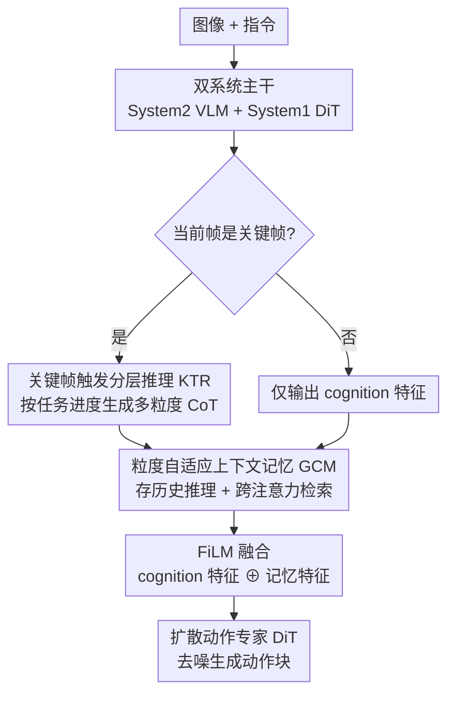

# TRM-VLA: Temporal-Aware Chain-of-Thought Reasoning and Memorization for Vision-Language-Action Models

**会议**: CVPR 2026  
**论文**: [CVF Open Access](https://openaccess.thecvf.com/content/CVPR2026/html/Li_TRM-VLA_Temporal-Aware_Chain-of-Thought_Reasoning_and_Memorization_for_Vision-Language-Action_Models_CVPR_2026_paper.html)  
**代码**: 待确认  
**领域**: 机器人 / VLA / 具身智能  
**关键词**: VLA, 思维链推理, 关键帧触发, 上下文记忆, 时序一致性

## 一句话总结
TRM-VLA 让 VLA 模型只在「关键帧」上做分层思维链推理、并用一个粒度自适应的记忆缓冲把历史推理结果跨帧检索回来，从而在 SIMPLER、LIBERO-90 和四个真实机器人任务上既刷新成功率（SIMPLER 72.9%）又把每步 CoT token 数砍掉约 4×。

## 研究背景与动机
**领域现状**：VLA（Vision-Language-Action）模型把预训练 VLM 的多模态理解迁移到机器人控制，是当前通用操作策略的主流范式。近期工作开始往 VLA 里塞思维链（CoT）推理，希望像 LLM 那样把复杂任务拆成中间步骤，提升长程、组合型任务上的可解释性和成功率。

**现有痛点**：把 CoT 直接搬进 VLA 并不好用，作者点出两个具体毛病。其一是**冗余推理**——现有方法在**每一帧**（或固定间隔）都生成一条完整的 CoT 轨迹，但相邻帧的视觉和语言上下文几乎一样，等于反复推理同样的东西，token 暴涨、推理变慢、决策收益却递减，难以实时部署。其二是**帧间推理相互独立**——每帧的 CoT 都是孤立产生的，没有时序依赖也没有记忆，导致前后动作计划互相矛盾。举个例子，「先按红、再按绿、再按蓝」这种顺序按钮任务，静态画面下模型根本不知道哪几步已经完成，于是重复按、任务失败。

**核心矛盾**：机器人操作本质是**非马尔可夫**的——当前该做什么取决于历史完成了多少，而逐帧式推理只看当前观测，天生丢掉了任务的时序结构。所以「在哪些时刻推理」和「如何把历史推理带到现在」这两件事被现有方法忽略了。

**本文目标**：(1) 让推理稀疏化——只在真正需要决策的时刻才推理；(2) 让推理有记忆——把过去关键帧的推理结果保留并按需检索，保证跨帧计划一致。

**核心 idea**：把显式的时序建模注入 VLA 推理过程——用「关键帧触发的分层推理（KTR）」实现稀疏的、按任务进度分层级的 CoT；用「粒度自适应上下文记忆（GCM）」动态存取历史推理，把记忆融进策略状态，从而打破逐帧推理隐含的马尔可夫假设。

## 方法详解

### 整体框架
TRM-VLA 建立在 CogACT 这一「VLM + 扩散动作策略」的双系统基线之上，沿用认知科学启发的 System 2 / System 1 分工：**System 2** 是 VLM 主干（DINOv2 + SigLIP 视觉编码、LLaMA-2 语言编码、外加一个可学习的 cognition token），负责慢速、深思熟虑的 CoT 生成；**System 1** 是扩散 Transformer（DiT）动作专家，负责快速、反射式的动作预测。

推理的形式化是关键。标准 VLA 直接 $a_t \sim P_\theta(a_t \mid o_t, l_t)$；推理增强 VLA 加一条中间推理 $r_t$，但每帧独立生成。TRM-VLA 则把动作条件在一个**记忆增强的推理状态** $m_t$ 上：

$$a_t \sim P_\theta(a_t \mid m_t, o_t, l_t), \quad m_t \sim P_\phi(m_t \mid r^h_1, \dots, r^h_t)$$

其中 $r^h_t \sim P_\theta(r^h_t \mid o_t, l_t)$ 是 KTR 在关键帧产出的分层 CoT，$P_\phi$（即 GCM）把历史推理轨迹 $\{r^h_1, \dots, r^h_t\}$ 聚合成紧凑、时序一致的 $m_t$。运行时每个时间步：若 $t$ 是关键帧则 KTR 输出一条分层推理 $r^h_t$（否则不推理），同时 VLM 永远输出一个 cognition 特征 $f_t$ 编码当前场景；GCM 用一个可学习的 thinking query 从记忆缓冲里 cross-attention 检索相关历史推理，再用 FiLM 把检索特征和 cognition 特征融合，最终把融合特征作为条件喂给 DiT 迭代去噪生成动作块。

### 关键设计

**1. 关键帧触发的分层推理 KTR：只在该想的时候想，且按任务阶段想对粒度**

针对「每帧都做完整 CoT」的冗余痛点，KTR 的核心思想是「适时地想」——只在关键决策点（如机器人刚抓到物体）才生成推理，并且按任务进度选择推理的抽象层级。它靠三件事落地。其一是**具身推理标注**：沿用 ECoT 协议把每条推理轨迹拆成语义不同的标签 $tag \in \{\text{task, plan, perception, subtask reasoning, subtask, move reasoning, move, gripper position}\}$，覆盖从高层任务分解到底层动作执行；标注时还引入时序跟踪模型（CoTracker3）对齐 gripper/物体轨迹、用统一 VLM（Qwen3-VL）联合做检测+描述+推理保证语义连贯。

其二是**关键帧标注（KBA）**，解决标注层面的冗余：高层标签（如 plan）整段几乎不变，底层标签（如 gripper position）却快速变化，逐帧标注会引入大量重复。于是对三个推理粒度定义二值关键帧标志，只在推理内容真正变化时置 1：

$$b^\tau_t = \begin{cases} 1, & r^\tau_t \neq r^\tau_{t-1} \\ 0, & \text{otherwise} \end{cases}, \quad \tau \in \{per, s, m\}$$

其中 $per$（perception）标记场景/物体状态显著变化、$s$（subtask）标记子目标切换、$m$（move）标记细粒度运动调整——这些关键帧就是「何时该更新推理」的监督信号。其三是**阶段化时序结构（STS）**：把一个 episode 切成早/中/晚三段，早段做高层规划（task/plan/perception/reasoning），中段只在 perception 关键帧触发感知锚定的子任务分解，晚段只在 subtask/move 关键帧触发底层执行命令，由此定义时序感知的分层推理集 $T_t$（公式 6），只有对应关键帧激活时才生成相应粒度的推理，保证稀疏。训练目标是带因果注意力的标准 next-token 预测 $L_{KTR} = -\sum_{S \in D}\sum_t \log p(T_t \mid o_t, l_t; \theta)$，让模型同时学会「何时推理」和「推理什么」，实现从抽象规划到具体执行的平滑过渡。

**2. 粒度自适应上下文记忆 GCM：把过去关键帧的推理按寿命存起来，按需检索回当前决策**

只用当前帧的推理是不够的——当模型在 subtask 关键帧只生成了底层推理时，会丢掉整段任务都仍然有效的高层规划信息。GCM 针对这个「帧间独立、缺记忆」痛点，维护一个**字典式记忆缓冲** $C_{k_c}$，存放此前所有关键帧产生的分层推理 token；新推理 $r^{tag}_{k_c}$ 插入时会**按 tag 覆盖**同名旧条目：$C_{k_c} = C_{k_c-1} \cup \{r^{tag}_{k_c}\}$。关键之处是**按推理层级分配不同寿命**——高层推理（task/plan）早段生成后一直保留到任务结束；中层推理（perception/subtask/move reasoning）保留中等时长、同 tag 新推理出现才替换；底层推理（subtask/move/gripper）寿命最短、频繁更新以反映实时控制变化。这样既保住长程任务一致性，又避免逐帧 CoT 的冗余计算。

检索端是**时序推理整合（TRI）**：用一个可学习的 thinking query $q$ 对记忆里所有条目（经 VLM 编码成上下文嵌入 $f_{rc}$，同时作为 K 和 V）做交叉注意力 $f_{att} = \text{CrossAttn}(q, K=f_{rc}, V=f_{rc})$，且 $C_t$ 与 $f_{rc}$ 联合维护更新——避免每次都重新跑一遍 VLM 前向，省推理成本。检索到的 $f_{att}$ 再通过 FiLM 与当前 cognition 特征 $f_c$ 融合：$f_t = \text{FiLM}(f_c, f_{att})$，得到同时编码当下感知与历史推理的条件特征。正是这个跨帧记忆聚合让模型在感知扰动（光照/背景/视角变化）下仍盯住语义和过程不变量，因而泛化更稳。

**3. 双系统执行与扩散动作专家：把时序一致的推理特征落成平滑动作**

融合特征 $f_t$ 作为条件喂给基于扩散的 System 1 动作专家（DiT），从高斯噪声迭代去噪出一段动作块 $A = (a_1, \dots, a_{N_a})$，训练用标准扩散策略的噪声 MSE：$L_{MSE} = \mathbb{E}_{\epsilon \sim \mathcal{N}(0,1), i}\lVert \hat{\epsilon}_i - \epsilon \rVert^2$。动作是 7-DoF 向量 $[\Delta x, \Delta \beta, gripper]$。把推理（慢、稀疏、有记忆）和执行（快、连续、扩散解码）解耦，既让 System 2 的深思不拖慢控制频率，又让 System 1 生成平滑、时序连贯的动作序列——这对真实世界稳定执行很关键。

## 实验关键数据

### 主实验
在 SIMPLER-Bridge（real-to-sim 评测，WidowX）上，TRM-VLA 平均成功率 72.9%，比基线 CogACT-Base 提升 +21.6%：

| 任务/数据集 | 指标 | TRM-VLA | 之前最好 | 提升 |
|--------|------|------|----------|------|
| SIMPLER-Bridge | Avg SR | 72.9% | π0 69.2% / CogACT 51.3% | +21.6 vs 基线 |
| - Stack Cube | SR | 41.7% | π0 52.5% | 该子任务略逊 π0 |
| - Put Eggplant | SR | 91.7% | π0 87.9% | +3.8 |
| LIBERO-90 | SR | 94.8% | CogACT-ECoT 92.1% / CogACT 88.4% | +6.4 vs 基线 |

真实机器人四任务上同时刷成功率与效率（每步 CoT token 数）：

| 模型 | Place Bear | Push Buttons | Clean Table | Scoop | Avg SR | Avg Tokens↓ |
|------|-----------|--------------|-------------|-------|--------|-------------|
| OpenVLA | 6/20 | 3/20 | 2/20 | 6/20 | 21.0% | 7.0 |
| CogACT-Base | 10/20 | 9/20 | 7/20 | 14/20 | 50.0% | 1.0 |
| ECoT | 7/20 | 5/20 | 3/20 | 7/20 | 28.0% | 26.8 |
| CogACT-ECoT | 8/20 | 8/20 | 6/20 | 12/20 | 44.0% | 26.3 |
| **TRM-VLA** | **15/20** | **12/20** | **11/20** | **17/20** | **69.0%** | **4.3** |

最能说明问题的是 Push Buttons（需记住按钮顺序）TRM-VLA 67% vs CogACT-ECoT 45%，以及 Clean Table（长程）72% vs 41%——分别验证 GCM 的记忆与 KTR 的分层规划；同时每步只用 4.3 token，相比 ECoT 的 26.8 token 砍掉约 4×。

### 消融实验
SIMPLER 上拆解 KTR（含 KBA、STS）与 GCM（含 DRC、TRI）：

| ID | KTR(KBA/STS) | GCM(DRC/TRI) | Avg SR | 说明 |
|------|------|------|------|------|
| (a) | ✗/✗ | ✗/✗ | 0.54 | 全去掉 |
| (b) | ✗/✓ | ✗/✗ | 0.60 | 仅 STS，+6% |
| (c) | ✓/✓ | ✗/✗ | 0.65 | 完整 KTR，再 +5%（KBA） |
| (d) | ✓/✓ | ✗/✓ | 0.69 | 加 TRI，+4% |
| (e) | ✓/✓ | ✓/✗ | 0.70 | 加 DRC |
| (f) | ✓/✓ | ✓/✓ | **0.73** | 完整模型，再 +5%（TRI） |

真实评测上去掉 GCM（仅 KTR）从 0.69 掉到 0.59、再去掉 KTR 掉到 0.50，确认两模块都不可或缺。

### 关键发现
- **两模块缺一不可**：SIMPLER 上去掉 GCM SR 从 0.73→0.65、去掉 KTR→0.54，时序推理与记忆都是长程任务必需。
- **效率提升来自稀疏触发**：所有对比方法同主干，token/step 直接代表算力开销；只在关键帧推理使 TRM-VLA 在拿到更高成功率的同时把 token 压到 4.3，反而比每帧全 CoT 的 ECoT（26.8）省得多，并减轻上下文污染。
- **记忆带来鲁棒性**：在光照/背景/干扰物/视角等分布漂移下，Push Buttons 任务相机视角变化时 CogACT 掉 7 次成功而 TRM-VLA 只掉 4 次——记忆聚合让模型盯住语义/过程不变量而非瞬时视觉特征。
- **个别子任务未必最优**：SIMPLER 的 Stack Cube 上 TRM-VLA 41.7% 略低于 π0 的 52.5%，说明精细堆叠这类纯几何任务上，时序记忆的收益不如在长程/记忆型任务上明显。

## 亮点与洞察
- **「关键帧 + 分层粒度」双重稀疏化很巧**：既在时间维度（只在关键帧推理）又在抽象维度（早/中/晚段对应不同粒度）做稀疏，把「何时想」和「想多细」解耦，是降 token 的根本来源，可迁移到任何需要实时性的逐帧推理场景。
- **按推理层级分配记忆寿命**是个干净的设计：高层 plan 长寿、底层 gripper 短寿，天然契合「计划稳定、动作多变」的物理直觉，比无差别记忆缓冲更省也更一致。
- **记忆检索复用 VLM 编码**：$C_t$ 与上下文嵌入 $f_{rc}$ 联合维护，cross-attention 直接复用历史推理特征而不重跑 VLM 前向，是把「记忆」做得便宜的关键工程点。
- 最「啊哈」的是把非马尔可夫的机器人任务显式建模成「记忆增强推理状态 $m_t$」，从公式层面跳出逐帧 CoT 的马尔可夫假设。

## 局限与展望
- **依赖关键帧标注质量**：KBA/STS 的监督来自对现有数据集的多级时序标注（ECoT/ECoT-Lite/Qwen3-VL 自动生成），标注噪声或关键帧误判会直接影响「何时推理」的学习，论文把标注细节放在附录，可复现性存疑。
- **记忆寿命是手工分层规则**：高/中/低层寿命的划分是预设的启发式，未学习；不同任务结构下最优寿命可能不同。
- **个别精细几何任务收益有限**：如 Stack Cube 不如 π0，说明该框架的优势集中在长程/记忆型任务，对纯空间精度任务帮助不大。
- **基线绑定 CogACT**：方法搭在特定双系统基线上，迁移到非扩散动作头或单系统 VLA 上的效果未验证。

## 相关工作与启发
- **vs ECoT / CogACT-ECoT（每帧全 CoT）**：它们逐帧或固定间隔生成完整独立 CoT，token 暴涨（26+）且无记忆；TRM-VLA 只在关键帧分层推理 + 记忆检索，token 砍到 4.3 同时成功率更高，本质区别是引入了时序稀疏与跨帧记忆。
- **vs CogACT-Base（直接回归动作的基线）**：基线无显式推理，token 极少（1.0）但长程/记忆任务弱（Push Buttons 9/20）；TRM-VLA 在仅增加少量 token 的前提下把这类任务大幅拉高（12/20），说明「便宜的结构化推理」确实补足了基线缺的可解释规划。
- **vs 基于世界模型/视频生成的推理 VLA**：那类方法用目标图像/视觉计划引导执行，TRM-VLA 走的是「文本分层 CoT + 记忆」路线，更贴合任务的记忆依赖本质，且不需额外的视觉生成开销。

## 评分
- 新颖性: ⭐⭐⭐⭐ 「关键帧触发 + 粒度自适应记忆」把时序稀疏与跨帧记忆引入 VLA 推理，角度清晰且少见。
- 实验充分度: ⭐⭐⭐⭐ 覆盖 SIMPLER/LIBERO-90/四真实任务 + OOD + 逐子模块消融，主结论扎实；个别子任务逊于 π0 也如实报告。
- 写作质量: ⭐⭐⭐⭐ 形式化清楚、动机与设计对得上；部分标注细节与表号略乱、推到附录。
- 价值: ⭐⭐⭐⭐ 同时解决推理 VLA 的「贵」与「不一致」两大痛点，4× 降 token 对实时部署很实用。

<!-- RELATED:START -->

## 相关论文

- [\[CVPR 2026\] ACoT-VLA: Action Chain-of-Thought for Vision-Language-Action Models](acot-vla_action_chain-of-thought_for_vision-language-action_models.md)
- [\[CVPR 2025\] CoT-VLA: Visual Chain-of-Thought Reasoning for Vision-Language-Action Models](../../CVPR2025/robotics/cot-vla_visual_chain-of-thought_reasoning_for_vision-language-action_models.md)
- [\[CVPR 2026\] FantasyVLN: Unified Multimodal Chain-of-Thought Reasoning for Vision-and-Language Navigation](fantasyvln_unified_multimodal_chain-of-thought_reasoning_for_vision-and-language.md)
- [\[CVPR 2026\] From Manuals to Actions: A Unified VLA Model for Chain-of-Thought Manual Generation and Robotic Manipulation](from_manuals_to_actions_a_unified_vla_model_for_chain-of-thought_manual_generati.md)
- [\[CVPR 2026\] Counterfactual VLA: Self-Reflective Vision-Language-Action Model with Adaptive Reasoning](counterfactual_vla_self-reflective_vision-language-action_model_with_adaptive_re.md)

<!-- RELATED:END -->
