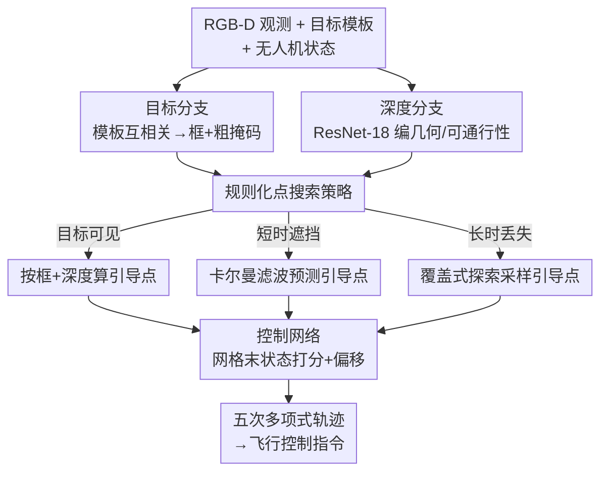

# UAST: Unified Active Search and Tracking for Arbitrary Targets with UAVs

**会议**: CVPR 2026  
**论文**: [CVF Open Access](https://openaccess.thecvf.com/content/CVPR2026/html/Qin_UAST_Unified_Active_Search_and_Tracking_for_Arbitrary_Targets_with_CVPR_2026_paper.html)  
**代码**: https://github.com/qinliangql/UAST  
**领域**: 机器人 / 具身智能（无人机主动跟踪与搜索）  
**关键词**: 无人机, 主动跟踪, 主动搜索, 无地图导航, 端到端控制

## 一句话总结
UAST 用一套只吃 RGB-D 的无地图框架，把"主动搜索任意目标"和"持续跟踪"统一进同一条感知-控制管线：双分支感知 + 规则化点搜索策略在「可见追踪 / 短时遮挡补偿 / 丢失探索」三种状态间自适应切换，轻量控制网络直接吐出动力学可行轨迹，在仿真和真机上把长程高速跟踪成功率较 SOTA 提升 50%+、搜索速度快约 3 倍。

## 研究背景与动机

**领域现状**：让无人机仅靠机载传感器在杂乱环境里自主搜索并持续跟踪任意目标，是巡检、监控、搜救的核心能力。现有路线分两派：一派是经典模块化管线（感知→建图→前端路径搜索→后端轨迹优化），在结构化场景里稳，但维护体素地图带来显著内存和算力开销，高速或资源受限时跟不上；另一派是端到端学习控制器，软件栈简单、能敏捷飞行，但泛化差、对没见过的目标/场景容易失效，且丢失目标后缺乏可靠的恢复机制。

**现有痛点**：更要命的是，几乎所有工作都把"搜索"和"跟踪"当成两个独立任务来做——搜索方法（FALCON、RACER 等基于 frontier 的探索）专注覆盖未知空间，跟踪方法（可见性约束轨迹规划、弹性走廊）专注把目标框在视野里，两者各管一段。但真实长程任务里，目标会被遮挡、会突然急转丢失，这时候需要的恰恰是"无缝从跟踪切回主动搜索、再切回跟踪"，割裂的两套系统做不到平滑过渡。

**核心矛盾**：跟踪与搜索本是同一件事的两个相位——置信度高就该追、置信度低就该探，但模块化管线把它们硬拆开、各自优化，端到端控制器又没有显式的搜索/恢复行为先验。如何用一个统一目标把这条"追-探"连续谱表达出来，是关键。

**本文目标**：(1) 用一套无地图、仅 RGB-D 的框架同时完成主动搜索和持续跟踪；(2) 在目标遮挡/丢失时能快速、平滑地恢复；(3) 对任意类别目标 class-agnostic 泛化，并能真机实时部署。

**切入角度**：作者把搜索与跟踪统一成一个"由引导点条件化的轨迹优化"问题——引导点来自一个规则化策略，目标可信时引导点指向目标（追），不确定时引导点指向未探索区域（探），于是同一个优化框架自然产生从跟踪到探索的连续行为。

**核心 idea**：用一个"规则化点搜索策略"产出统一的引导点，把搜索/跟踪折叠成单一轨迹优化，再用轻量控制网络从融合感知直接预测可行轨迹——不建图、不分阶段规划。

## 方法详解

### 整体框架
UAST 的输入是每帧 RGB-D 观测 $I_t=\{I^{rgb}_t, I^d_t\}$、无人机运动状态 $s_t=\{v_t,a_t\}$ 和一个目标模板 $M^{target}$；输出是短时程的末状态 $S^{end}_{t+T}=\{p_{t+T},v_{t+T},a_{t+T}\}$，由它解出一条动力学可行轨迹，再导出当前控制指令。整条管线由四个组件串成：**目标分支**和**深度分支**分别抽取目标外观特征与几何/可通行性特征；二者连同历史状态喂给**规则化点搜索策略**，由它根据目标可见性产出一个引导点（追踪时指向目标、丢失时指向探索点）；引导点与无人机速度/加速度拼成状态表征、再与感知特征融合，交给**控制网络**预测末状态偏移并拟合平滑轨迹。

理论上，UAST 把搜索-跟踪写成统一的轨迹优化 $f^*(t)=\arg\min_{f(t)} L_{traj}(f(t); g_t(m_t))$，其中引导点 $g_t$ 由信念状态 $m_t$ 决定：$m_t$ 置信度高就把 $g_t$ 拉向跟踪、不确定就拉向探索，于是一个优化框架就生成了从追到探的连续行为谱。

### 关键设计

**1. 双分支 class-agnostic 感知：目标定位与环境几何解耦**

痛点是端到端控制器把"目标长啥样"和"环境长啥样"揉在一起学，换个目标/场景就失效。UAST 把感知拆成互补两路。**目标分支**用共享权重 AlexNet 编码当前 RGB 帧 $F^{rgb}_t$ 和目标模板 $F^{temp}$（模板只在初始化时抽一次、全程复用），两者做互相关得到响应图，轻量头预测边界框和粗掩码，再把掩码编码成紧凑表征 $F^{target}_t$。关键在于它只用"掩码级"的定位线索、不依赖完整外观特征，因此对任意类别目标都能泛化（class-agnostic），目标分支本身按 SiamFC++ 协议独立训练后冻结。**深度分支**用 ResNet-18 把深度图编成 $F^{depth}_t$，捕捉表面几何、深度不连续和粗略自由空间布局，提供"哪里能飞、哪里有障碍"的环境感知。两路特征 $\{F^{target}_t, F^{depth}_t\}$ 与运动状态、引导点融合后才进控制网络——这样"追谁"和"怎么避障"由不同分支负责，泛化和避障互不拖累。

**2. 规则化点搜索策略：用三态切换把跟踪与搜索缝成一条连续行为**

这是统一搜索与跟踪的核心。它不建图、不做路径规划，只根据感知+状态线索产一个粗引导点，按目标状态分三种情形处理：

- **可见（reliable）**：当预测框响应分 $m_t$ 超过阈值 $\tau_{det}$，从框中心 1/4 区域内的有效深度取中位数 $\bar z$，反投影出相机系 3D 点 $g^{cam}_t=\big((u_c-c_x)\bar z/f_x,\ (v_c-c_y)\bar z/f_y,\ \bar z\big)^\top$，转到世界系作为当前引导点。
- **短时不可见（temporarily invisible）**：用常速模型卡尔曼滤波平滑引导点，状态 $x_t=[g^{world}_t, \dot g^{world}_t]^\top$ 按 $x_{t+1}=Ax_t+w_t$ 演化。若新息残差 $\eta_t=\lVert y_t-H\hat x_{t|t-1}\rVert_{R^{-1}}$ 超过阈值 $\tau_{innov}$，说明当前检测不可信，改用预测先验 $\hat g^{world}_t=H\hat x_{t|t-1}$ 兜底——把噪声深度/部分遮挡下的抖动滤平。
- **长时丢失（lost）**：连续 $T_{lost}$ 帧看不到目标（或搜索任务一开始就没目标），切到探索模式。在当前位置 $p_t$ 周围初始化半径 $r_{max}$ 的未探索圆形区域，相机视场内可见区记为已探索，然后在未探索区随机采点、取最远有效点作引导点 $g^{world}_t=\arg\max_{c_k}\lVert c_k-p_t\rVert$；若无未探索点则走螺旋探索 $r(\theta)=r_0+\epsilon\theta$；若区域饱和就把搜索半径按 1.5 倍自适应扩张，逐步外推搜索边界。

为什么有效：三态共享同一个"产引导点"的接口，控制网络对引导点一视同仁，于是"丢了就探、探到就追、追丢再探"在同一框架里自然衔接，省掉了模块化管线里搜索/跟踪两套系统切换的接缝。

**3. 控制网络：网格化末状态打分 + 五次多项式，直接出可行轨迹**

痛点是经典管线要前端搜索+后端优化迭代解轨迹，算力重、延迟高。UAST 把它换成一次前向。融合后的感知张量被组织成 $V\times H$ 网格，每个 cell 对应一个默认初始末状态 $S^{init}_{v,h}=\{p_{v,h},v_{v,h},a_{v,h}\}$（按几何位置、朝向、默认预测半径给一个合理先验）。轻量 CNN 为每个 cell 预测末状态偏移 $\Delta S^{off}_{v,h}=\{\Delta p,\Delta v,\Delta a\}$ 和一个标量轨迹代价分 $s_{v,h}$，预测末状态为 $S^{pred}_{v,h}=S^{init}_{v,h}+\Delta S^{off}_{v,h}$。选代价最低的 cell 作最优末状态 $S^{end}_{t+T}=\arg\min_{v,h}(s_{v,h})$。有了起始态 $S^{start}_t$ 和末态，对 x/y/z 各轴拟合五次多项式 $f_x(t)=a_5t^5+\dots+a_0$（六约束：两端点的位置/速度/加速度），保证高阶平滑连续，控制指令直接由轨迹及其导数 $u_t=\{f(t),\dot f(t),\ddot f(t)\}$ 得到。网络预测的是相机系偏移、不需要当前位置 $p_t$，因此对绝对定位不敏感，单步只需约 8.6 ms，可真机实时。

**4. 跟踪感知可见性损失 + 自动数据构造：把"持续看得见"训进轨迹**

端到端控制最难的是让轨迹本身倾向"目标一直在视野内、且别被挡住"。作者设计 **tracking-aware visibility loss** $L_{track}=\lambda_a L_{occ}+\lambda_f L_{fov}$，只评估轨迹中段（horizon 的 1/3~2/3，反映短期行为）。遮挡项 $L_{occ}=\sum_i\sum_j \text{ReLU}(d_{voxel}-d_{ij})$ 沿"无人机→目标"视线可微地采样 SDF 距离 $d_{ij}$，一旦小于体素阈值 $d_{voxel}$ 就说明视线被障碍挡住、施加惩罚；FOV 项 $L_{fov}=\sum_i \text{ReLU}(|\psi_i-\psi_g|-\psi_{fov})\,\text{ReLU}(|\varphi_i-\varphi_g|-\varphi_{fov})$ 用无人机速度方向与目标方向的偏航/俯仰角差，惩罚超出相机水平/垂直视场的偏离。它和目标对齐 $L_{goal}$、平滑 $L_{smooth}$、安全 $L_{safe}$（沿轨迹 SDF 的可微避碰）共同组成轨迹损失，再加一个分数回归 $L_{score}=\text{SmoothL1}(l_{v,h}, L_{traj})$ 让打分头学到可解释的代价。配套的**自动数据构造**解决"人工无人机跟踪数据轨迹/目标配置单一"：先建无目标的静态点云场景，随机采可飞位姿录 RGB-D，再用相机内参把合成目标（四旋翼/球/人/动物）投影进画面、改写颜色与深度通道；目标距离按 40% 大于 10 m、50% 在 5–10 m、10% 在 5 m 内分布，保证 90% 可见、其余轻度遮挡，并加米级引导点噪声增强鲁棒性。

### 损失函数 / 训练策略
目标分支按 SiamFC++ 协议独立训练后冻结输出；深度分支、目标分支里的掩码编码器、控制网络联合端到端训练。总目标 $L=\lambda_t L_{traj}+\lambda_s L_{score}$，其中 $L_{traj}=\lambda_1 L_{track}+\lambda_2 L_{goal}+\lambda_3 L_{smooth}+\lambda_4 L_{safe}$。数据规模 10 万+ 样本，batch 1024，训 50 epoch 约 8 小时（i9-13980HX + RTX 4090）。

## 实验关键数据

### 主实验

短程不同速度跟踪率（开阔环境，100–150 m 飞行，40 条随机轨迹）：

| 方法 | 3 m/s | 4 m/s | 5 m/s | 6 m/s |
|------|-------|-------|-------|-------|
| Vis.（建图）[30] | 0.85 | 0.60 | 0.15 | 0.15 |
| Elas.（弹性走廊）[15] | 0.90 | 0.60 | 0.10 | 0.00 |
| Yopov2（端到端）[25] | 1.00 | 0.90 | 0.90 | 0.80 |
| Yopov2(multi) | 0.90 | 0.75 | 0.63 | 0.60 |
| **UAST（本文）** | **1.00** | **1.00** | **0.93** | **0.88** |

长程跟踪成功率与单步延迟（杂乱环境，1–1.5 km，急转/急停/反向）：

| 方法 | 3 m/s SR | 5 m/s SR | 单步周期 (ms) |
|------|----------|----------|---------------|
| Vis. [30] | 0.44 | 0.05 | 60.5 |
| Elas. [15] | 0.51 | 0.03 | 26.4 |
| Yopov2 [25] | 0.67 | 0.36 | 7.0 |
| **UAST** | **0.99** | **0.89** | 8.6 |

主动搜索对比（目标初始 >100 m 外，需自主搜索）：

| 方法 | 搜索时间 ST(s)↓ | 路径 Dis(m)↓ | 速度 Vel(m/s)↑ | 周期 CT(ms)↓ |
|------|------|------|------|------|
| RACER [46] | 176.62 | 293.19 | 1.66 | 43.1 |
| FALCON [41] | 146.67 | 265.48 | 1.81 | 37.2 |
| **UAST** | **54.49** | 268.67 | **4.93** | **8.6** |

长程高速场景下，UAST 把跟踪成功率较 SOTA 提升 50%+（如 5 m/s 从 Yopov2 的 0.36 提到 0.89），搜索时间约为 RACER/FALCON 的 1/3，且单步延迟最低、路径长度相当。

### 消融实验

5 m/s 速度下逐模块消融：

| 配置 | 短程 SR↑ | 长程 SR↑ | 视场中心距 (m)↓ | 说明 |
|------|---------|---------|------|------|
| W/O search | 0.88 | 0.52 | 0.57 | 去掉探索机制，长程重定位崩 |
| W/O track loss | 0.85 | 0.82 | 0.82 | 去掉可见性损失，目标偏离视场中心 |
| W/O data build | 0.80 | 0.76 | 0.63 | 去掉自动数据构造，泛化变差 |
| W/O guid point | 0.70 | 0.33 | 0.69 | 去掉点搜索策略，全面崩盘 |
| **Ours** | **0.93** | **0.89** | **0.57** | 完整模型 |

安全性（有效跟踪时无人机-障碍距离，m）：

| 方法 | 3 m/s 均值/最小 | 5 m/s 均值/最小 |
|------|------|------|
| Yopov2 [25] | 1.87 / 0.38 | 1.75 / 0.11 |
| **UAST** | 2.00 / **0.63** | 2.02 / **0.13** |

### 关键发现
- **去掉规则化点搜索策略（W/O guid point）跌得最狠**，长程 SR 从 0.89 崩到 0.33，证明协调的搜索-跟踪行为是整个系统的命门——没有统一引导点，感知和控制就脱节。
- **去掉探索机制（W/O search）对长程伤害最大**（长程 SR 0.89→0.52，短程只掉 0.05），印证"主动重获取"在长程丢失场景里不可或缺，短程因为很少丢目标所以影响小。
- **跟踪感知可见性损失主要管"稳"**：去掉它视场中心距从 0.57 恶化到 0.82，说明这个损失专门把目标拉回画面中心、维持稳定对齐，而非单纯提成功率。
- 高速段优势最明显：5 m/s 长程 SR 上，建图类方法（Vis./Elas.）几乎归零，Yopov2 丢失后恢复不了，只有 UAST 借统一搜索-跟踪快速重定位。

## 亮点与洞察
- **把"搜索 vs 跟踪"重述成"引导点置信度高低"的连续谱**——这是最漂亮的一刀：原本要两套系统+切换逻辑的事，被收进同一个轨迹优化目标里，靠规则化策略产一个统一引导点就实现了"追-探"无缝过渡，工程上极简。
- **三态规则策略 + 卡尔曼兜底**是很实用的鲁棒性配方：可见时几何反投影、短时遮挡用常速 KF 平滑并用新息阈值判检测可不可信、长时丢失走"最远未探索点 + 螺旋 + 半径自适应扩张"，每一态都对应一个真实失效模式，可直接迁到其它单目标主动感知任务。
- **网格化末状态打分**把轨迹规划变成一次"在 $V\times H$ 个候选末状态里选代价最低"的前向，避开了后端迭代优化，8.6 ms 单步延迟 + Jetson NX 真机部署证明它真的轻。
- **可微 SDF 视线采样 + FOV 角度惩罚**把"别被挡、别飞出画面"直接写进可微损失训进轨迹，而不是靠运行时硬约束，这种"把感知约束训进控制"的思路可迁到任何视觉伺服/主动跟踪。
- **合成目标投影的数据构造**绕开了真机采数据的稀缺：无目标场景录 RGB-D + 按内参投影任意合成目标 + 控制距离分布，廉价造出多样化 class-agnostic 训练数据。

## 局限与展望
- **依赖外部定位**：真机用 Fast-LIO 做定位、引导点要转世界系，纯视觉里程计漂移或定位失效时的鲁棒性未评估。
- **单目标、模板预设**：目标模板初始化时抽一次后全程冻结，外观剧烈变化（换装/形变/光照突变）或多目标场景下能否稳健未讨论；"任意目标"仍需先给一帧模板。
- **规则策略的阈值依赖**：$\tau_{det}$、$\tau_{innov}$、$T_{lost}$、半径扩张因子 1.5 等都是手调超参，跨平台/相机迁移时可能要重调；论文未给敏感性分析。
- **探索是启发式而非信息论最优**："最远未探索点 + 螺旋"是贪心覆盖，在大尺度/强遮挡环境里未必比 frontier/信息增益方法找得快，搜索路径长度其实和 FALCON 接近（只是更快），说明赢在反应式速度而非路径效率。
- **可改进方向**：把目标模板做成在线更新、引入轻量重识别应对长时遮挡后的身份混淆；把规则化策略换成可学习的策略网络、让阈值自适应。

## 相关工作与启发
- **vs 经典模块化跟踪（Vis. [30] / Elas. [15] / Gao [11]）**：他们维护体素地图 + 可见性约束轨迹优化/弹性走廊，结构化场景稳但建图开销大、高速跟不上（单步 26–60 ms，5 m/s 长程 SR≈0.03–0.05）；UAST 无地图、单步 8.6 ms、5 m/s 长程 SR 0.89，优势在效率和高速鲁棒，代价是依赖外部定位。
- **vs 端到端控制器 Yopov2 [25]**：同属端到端范式直接从视觉出控制，但 Yopov2 缺显式搜索/恢复机制，丢失后回不来（5 m/s 长程 0.36）；UAST 在端到端基础上注入结构先验（显式目标感知 + 几何推理 + 规则化搜索），把恢复能力补上（0.89）。
- **vs 主动搜索 RACER [46] / FALCON [41]**：他们靠 frontier 探索 + 分阶段优化做覆盖，搜索时间 147–177 s；UAST 用规则化点搜索把感知和运动直接耦合、反应式飞向有希望区域，约 1/3 时间完成搜索且延迟最低——核心区别是它把"搜索"和"跟踪"统一了，而前者只做搜索。

## 评分
- 新颖性: ⭐⭐⭐⭐ 把搜索与跟踪统一成"引导点置信度连续谱 + 单一轨迹优化"是干净且少见的表述，规则化三态策略实用但偏工程组合。
- 实验充分度: ⭐⭐⭐⭐ 短/长程跟踪 + 主动搜索 + 消融 + 安全性 + 真机部署都覆盖，但缺超参敏感性分析、多目标与外观变化场景。
- 写作质量: ⭐⭐⭐⭐ 框架与公式交代清楚，图文对应；部分符号（如 $L_{goal}$ 里 $o_g$/$\hat o_g$）排版稍乱。
- 价值: ⭐⭐⭐⭐ 无地图、实时、可真机部署的统一主动搜索-跟踪框架，对 UAV 搜救/跟拍有直接落地价值，代码开源。

<!-- RELATED:START -->

## 相关论文

- [\[CVPR 2026\] Instance-level Visual Active Tracking with Occlusion-Aware Planning](instance-level_visual_active_tracking_with_occlusion-aware_planning.md)
- [\[CVPR 2026\] AdaDexTrack: Dynamic Modulation for Adaptive and Generalizable Dexterous Manipulation Tracking](adadextrack_dynamic_modulation_for_adaptive_and_generalizable_dexterous_manipula.md)
- [\[CVPR 2026\] Parse, Search, and Confirmation: Training-Free Aerial Vision-and-Dialog Navigation with Chain-of-Thought Reasoning and Structured Spatial Memory](parse_search_and_confirmation_training-free_aerial_vision-and-dialog_navigation_.md)
- [\[CVPR 2026\] Motus: A Unified Latent Action World Model](motus_a_unified_latent_action_world_model.md)
- [\[CVPR 2026\] CUBic: Coordinated Unified Bimanual Perception and Control Framework](cubic_coordinated_unified_bimanual_perception_and_control_framework.md)

<!-- RELATED:END -->
