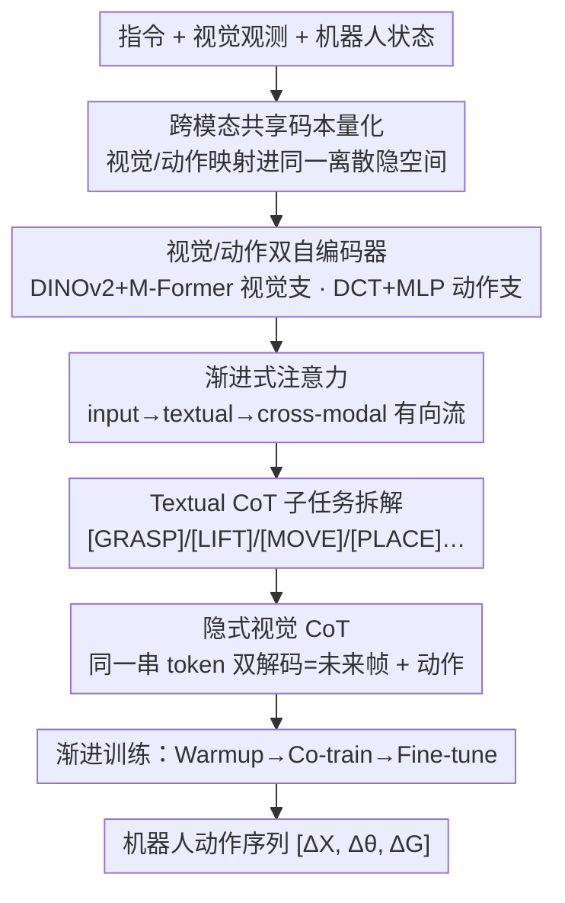

# Unifying Perception and Action: A Hybrid-Modality Pipeline with Implicit Visual Chain-of-Thought for Robotic Action Generation (VITA)

**会议**: CVPR 2026  
**论文**: [CVF Open Access](https://openaccess.thecvf.com/content/CVPR2026/html/Ma_Unifying_Perception_and_Action_A_Hybrid-Modality_Pipeline_with_Implicit_Visual_CVPR_2026_paper.html)  
**代码**: https://vita-cvpr26.github.io/ （项目页）  
**领域**: 机器人 / 具身智能 / Vision-Language-Action  
**关键词**: VLA、视觉链式思维、共享码本、前向/逆向动力学、机器人操作

## 一句话总结
VITA 提出用一个"视觉-动作共享的离散隐空间"统一感知与控制：VLM 主干自回归生成的同一串 token 被同时解码成"未来视频帧"和"机器人动作"，从而把视觉预测当作动作生成的归纳偏置（隐式视觉 CoT），既弥合视觉观测与低维动作之间的模态鸿沟、又避免"先预测图再动作"范式的训练不稳和高延迟，在 CALVIN/LIBERO/SimplerEnv 上分别提升 14.5%/9.6%/12.1%、真实世界 6 任务平均成功率 80.5%。

## 研究背景与动机

**领域现状**：基于 VLM 的 Vision-Language-Action（VLA）模型通过策略头或离散动作解码器，把 VLM 的视觉-语义先验接到可执行的电机指令上。为增强长程任务推理与可解释性，早期工作把高层指令拆成子任务序列，当作纯文本的 chain-of-thought（T-CoT）。

**现有痛点**：纯文本 CoT 在复杂空间场景里"接地"不足、语义模糊，难以充分理解细粒度视觉上下文。于是一类很有前景的做法是用视觉动力学当先验来引导动作生成——给初始帧 + 指令、让模型预测未来帧，再把这些视觉先验通过微调迁移到操作。但这条"predict-then-act"路线有两个固有难题：(i) **模态鸿沟**——高维视觉观测与低维动作之间差距大，生成的未来图里大量像素级细节与动作执行无关，直接从观测精确产出动作很难；(ii) **目标竞争导致训练不稳**——视觉预测代理任务与动作生成任务的优化目标互相打架，使动作策略无法充分利用 VLM 学到的视觉动力学；而且"先预测整张图再动作"延迟高，不适合高频操作。

**核心矛盾**：视觉预测与动作生成被切成两条独立的流，优化目标不同会导致预训练知识被快速遗忘；同时高维视觉与低维动作的模态错配让"直接对齐输入图像与输出指令"本身就很难。

**本文目标**：(1) 在表示层弥合视觉-动作模态鸿沟；(2) 让视觉预测真正成为动作生成的归纳偏置而非互相竞争的独立解码目标；(3) 去掉"先生成整图再动作"的串行延迟。

**切入角度**：人脑执行动作前并不会先在脑海里完整模拟一遍未来视觉状态，而是基于任务需求和视觉感知形成"运动直觉"直接驱动小脑产出精确指令。作者据此想把"感知预测"与"动作执行"两个过程统一成学习运动直觉。

**核心 idea**：构造一个视觉与动作**共享的离散码本/隐空间**，让 VLM 生成的同一串隐 token 被两个解码器同时还原成未来帧与动作——视觉子目标负责从预测的未来场景里抽运动直觉、动作子目标负责从运动状态的空间演化里逆推动作指令，在表示层和优化目标上双重对齐，这就是"隐式视觉 CoT"。

## 方法详解

### 整体框架
VITA（Vision-Integrated Trajectory Alignment）是一个统一感知与动作的 VLA 框架，核心是"一个共享离散码本 + 双自编码器 + VLM 主干 + 双解码器"。整体分三阶段渐进训练：① **Warmup（跨模态对齐）**——在独立的视频数据与动作数据上自监督训练视觉自编码器、动作自编码器和**共享量化器/码本**，让视觉和动作被映射进同一套离散隐词表（此阶段**不需要**视频-动作配对）；② **Co-train（视觉先验对齐动作）**——冻结码本，把视觉解码器和动作解码器接到 VLM 主干输出端，用"纯视频"与"视频-动作同步对"混合数据联合训练 VLM 主干和两个解码器，VLM 生成的同一串 token 经共享码本查表后同时解码成未来帧和动作（隐式视觉 CoT）；③ **Fine-tune**——只在具体仿真/真实数据集上微调动作解码器，冻结 VLM 主干以降低部署延迟。推理时只保留 VLM 主干 + 动作解码器这个轻量架构。

VLM 主干内部还实现两段式推理：先用 **Textual CoT** 把高层指令拆成符号子任务（[GRASP]/[LIFT]/[MOVE]/[PLACE]…），再用 **Internal CoT** 在子任务先验引导下自回归生成视觉-动作混合隐 token；两段由**渐进式注意力机制**（双向 + 因果混合）协调，形成 input → textual → cross-modal 的有向信息流。

### 关键设计

**1. 跨模态共享码本量化：把视觉与动作钉进同一离散隐空间**

针对"高维视觉 ↔ 低维动作"的模态鸿沟，VITA 让两种模态共用一个码本 $C=\{c_k\}_{k=1}^{K}\subset\mathbb{R}^d$ 和同一个量化算子 $Q(z)=c_k,\ k=\arg\min_j\|z-c_j\|_2$。Warmup 时视觉编码模块 $(E_v)$ 与动作编码模块 $(E_a)$ 各自独立训练，只需在各自解码器下最小化重建损失、**无需任何跨模态配对监督**；但因为两支共享同一量化器与码本，重建过程的部分梯度会联合优化量化组件。关键洞察是：共享码本让视觉与动作在隐空间里取得**结构一致性**，这种隐式对齐使下游联合优化不再需要显式的跨模态标注，是后面"同一串 token 双解码"能成立的地基。

**2. 双自编码器：视觉支抽运动感知特征、动作支做频域压缩**

视觉支：给一对相邻帧 $(I_t, I_{t+1})$，先用冻结 DINOv2 抽稠密时空特征，再用带记忆的 M-Former 压成紧凑的时空运动嵌入 $z_v$，量化后经视觉解码器重建未来帧 $\hat I_{t+1}=D_v(f_t,\hat z_v)$，损失是 L1 + SSIM：$L_v=\lambda_{L1}\|I_{t+1}-\hat I_{t+1}\|_1+\lambda_{SSIM}(1-\mathrm{SSIM}(I_{t+1},\hat I_{t+1}))$。由于量化器只在视觉数据上训、不带动作监督，它能从海量互联网人类演示与机器人视频里学到丰富的运动先验。动作支：对动作段 $a_{t:t+H}$（每步含位置 $\Delta x$、旋转 $\Delta\theta$、夹爪力 $\Delta F$），先归一化、再用**离散余弦变换 DCT** 把时序动力学压成频域系数、过轻量 MLP 编码成 $z_a$，量化后经逆 DCT + MLP 解回连续动作轨迹，用 MSE 监督 $L_a=\|a_{t:t+H}-\hat a_{t:t+H}\|_2^2$（频域编码思路借鉴 FAST）。两支共享码本保证语义对齐，这就是 VITA 的核心设计点。

**3. 渐进式注意力 + 两段 CoT：把动作预测拆成"协作但解耦"的两条推理流**

为协调文本与跨模态两路推理，作者设计渐进式注意力（Figure 2 第④部分）。把 token 分为 input（输入文本+视觉观测）、textual、cross-modal 三组：推理时先在 input 内部做双向注意力捕获全局上下文并**并行**生成 textual token；生成 cross-modal token 时，分别在 input 内、textual 内做双向注意力以充分链内交互，再对三组之间施加**因果注意力**形成有向流 $\text{input}\to\text{textual}\to\text{cross-modal}$（式 9）。由此 VITA 把动作预测结构化成两个协作又解耦的过程：(1) **Textual CoT 做感知理解**——从指令+观测里抽结构化任务语义，产出把高层意图映射到符号动作的可解释子任务（固定子任务词表 $Z_{sub}$）；(2) **Internal CoT 做运动规划**——在子任务先验引导下，连贯生成与未来视觉场景演化对齐的低维动作指令。值得注意的是，VITA 通过多模态联合优化**间接**训练 textual CoT 的生成、不依赖显式子任务标签监督，兼顾可扩展性、稳定性与可解释性。

**4. 隐式视觉 CoT：同一串 token 双解码，把"预测未来帧"内化成动作的归纳偏置**

这是 VITA 区别于"predict-then-act"的关键。第二阶段 VLM 主干自回归生成隐 token 序列 $\{\tau_i\}_{i=1}^{L}$（每个 $\tau_i$ 索引共享码本），然后**同时**路由到两个并行解码器：$\hat I_{1:T}=D_v(\{c_{\tau_i}\})$ 还原未来帧、$\hat a_{1:H}=D_a(\{c_{\tau_i}\})$ 还原动作（式 15），从单一隐流里统一产出未来场景与机器人动作。因为视觉与动作解码器共享同一离散 token 流，视觉预测任务就成了**正则化动作生成的归纳偏置**，而动作监督又只蒸馏出与任务相关的视觉动力学、把运动无关的像素细节过滤掉——这同时解决了模态鸿沟与目标竞争，且推理时无需先生成整图再动作，去掉了串行延迟。

### 损失函数 / 训练策略
渐进三阶段：**Warmup** 分别最小化视觉支 $L_v$（式 4，帧预测）与动作支 $L_a$（式 8，动作重建），建立模态无关的离散隐词表，无需同步视频-动作对。**Co-train** 冻结码本，按样本类型给损失：纯视频样本只算视觉损失 $L_{co}=\sum_t[\lambda_{L1}\|I_t-\hat I_t\|_1+\lambda_{SSIM}(1-\mathrm{SSIM})]$（式 18）；视频-动作配对样本同时解码并联合 $L_{co}=\lambda_v\|I_{1:T}-\hat I_{1:T}\|_1+\lambda_a\|a_{1:H}-\hat a_{1:H}\|_2^2$（式 19，前项=视觉 CoT、后项=动作生成）。**Fine-tune** 只调动作解码器、冻结 VLM 主干。实现上 follow Pi0：SigLIP(400M) 视觉 tokenizer + Gemma(2B) 主干，12 层 ViT 视觉解码器(96M) + transformer 动作解码器(228M，因需精确重建高维时序轨迹故容量更大)；16×A100 训 300K 步、约 5 天、2.8B 可训参数。⚠️ 个别符号（如 ΔG/ΔF 命名、horizon 设定）以原文为准。

## 实验关键数据

### 主实验

| 基准 | 指标 | VITA | 最强 baseline | 说明 |
|------|------|------|--------------|------|
| CALVIN ABC-D | Avg. Len（连续 5 指令完成数）| 4.73 | DeFI 4.51 / UniVLA 4.41 | 长程任务尤其领先 |
| LIBERO | 平均成功率/% | 96.7 | UniVLA 95.5 | LIBERO-Long 较 CoT-VLA 提升 36.2% |
| SimplerEnv-GoogleRobot | 平均成功率/% | 57.4 | DeFI 51.2 | 视觉匹配设定 |
| SimplerEnv-WidowX | 平均成功率/% | 71.5 | UniVLA 69.8 | PutCarrot 从 OpenVLA 20.8→68.8 |
| 真实世界（UR-5e，6 任务）| 平均成功率/% | 80.5 | Pi0 53.5 | OOD 任务上仍稳健 |

VITA 在 CALVIN ABC-D 上 1→5 连续完成率为 99.1/94.9/91.2/87.8/84.5，长程（连完 3-5 任务）优势最明显；论文称在 CALVIN/LIBERO/SimplerEnv 上分别较已有基线提升 14.5%/9.6%/12.1%。真实世界 6 任务中前四为 ID、后两为 OOD（Inverse Execution 66、Conditional Decision 71），baseline 在 OOD 上大幅掉点（如 Octo 掉 48%）而 VITA 保持稳健。

### 消融实验

| 消融维度 | 配置 | LIBERO | LIBERO-Long | CALVIN(Avg.Num) | 结论 |
|---------|------|--------|-------------|-----------------|------|
| CoT 范式 | Without CoT | 53.7 | 29.8 | 1.83 | 无 CoT 最差 |
| | Textual-only CoT | 56.2 | 31.5 | 2.01 | 纯文本接地不足 |
| | Visual-only CoT | 68.9 | 42.3 | 3.25 | 视觉先验有用 |
| | Textual-Visual CoT | 72.4 | 45.8 | 3.89 | 显式双流仍受限 |
| | Internal CoT | 94.1 | 92.7 | 4.52 | 内化为偏置大涨 |
| | **Textual-Internal CoT (VITA)** | **96.7** | **96.8** | **4.73** | 完整模型最佳 |
| 训练策略 | w/o quantization | 57.4 | 29.3 | 2.04 | 去掉量化最差 |
| | only action decoder (FAST) | 60.7 | 34.0 | 2.23 | 无法捕获细粒度空间关系 |
| | + codebook (VQ+Patch) | 71.2 | 42.4 | 2.74 | 加码本提升明显 |
| | + visual decoder | 82.9 | 71.8 | 3.69 | 引入视频监督再涨 |
| | **+ human video (Ours)** | **96.7** | **96.8** | **4.73** | 人类视频补足跨域先验 |

### 关键发现
- **Internal CoT 是涨点主力**：从 Textual-Visual CoT(LIBERO-Long 45.8) 跳到 Internal CoT(92.7)，说明"把视觉预测内化成归纳偏置"远胜"显式解码未来帧再动作"，这是 VITA 的核心增益来源。
- **量化/共享码本不可或缺**：w/o quantization 在 LIBERO-Long 仅 29.3、加码本后 42.4、再加视觉解码器 71.8，逐步验证"共享离散隐空间"对长程精确控制的关键作用；only-FAST 变体在 WidowX 高精度任务上明显吃亏。
- **数据/训练效率高**：VITA 仅用 10% 数据微调即超过 OpenVLA 全量微调；去掉 warmup 后 10% 数据上退化 47.3%（远高于完整版 17.9%），说明 warmup 学到的跨模态先验对少样本至关重要。
- **OOD 泛化强**：真实世界 OOD 任务上 baseline 普遍崩盘而 VITA 仍达 66.9%/71.3%，体现统一感知-动作带来的跨域稳定性。

## 亮点与洞察
- **"同一串 token 双解码"非常巧妙**：用共享码本让 VLM 的隐 token 同时还原未来帧与动作，把"视觉预测"从一个**竞争性解码目标**变成**正则化动作的归纳偏置**，一举化解模态鸿沟 + 目标竞争 + 串行延迟三个问题。
- **Warmup 不需配对数据是大优势**：视觉支和动作支各自自监督训练即可对齐进同一码本，意味着能直接吃海量无标注人类视频和机器人视频，扩展性好。
- **动作走频域(DCT)很务实**：把动作时序压成频域系数再量化，既降维又保时序结构，和视觉 token 在同一码本里语义对齐，是个可迁移到其他时序控制任务的 trick。
- **推理时只留主干+动作解码器**：训练用双解码器学偏置、部署丢掉视觉解码器，兼顾"学得好"与"跑得快"，对高频操作友好。

## 局限与展望
- **训练成本高**：16×A100、300K 步、~5 天、2.8B 可训参数，复现门槛不低；码本大小 $K$、horizon $H$ 等超参的敏感性正文未充分展开。⚠️ 部分超参以原文附录为准。
- **依赖 DINOv2/SigLIP/Gemma 等冻结骨干**：性能与这些预训练视觉/语言骨干强耦合，换骨干的可迁移性未验证。
- **真实评测规模有限**：真实世界仅 UR-5e 单平台 6 任务、每任务 100 rollout，跨本体（不同机械臂/灵巧手）泛化仍待检验。
- **可改进方向**：把共享码本扩展到力/触觉等更多模态、探索更大规模 human video 预训练、以及在线交互式微调以进一步缩小 sim-to-real gap。

## 相关工作与启发
- **vs CoT-VLA**：CoT-VLA 建立**显式**视觉 CoT、走"predict-then-act"先预测图再动作；VITA 把视觉预测**内化**成隐式偏置、同一 token 双解码，规避了串行延迟与目标竞争，LIBERO-Long 上较 CoT-VLA 提升 36.2%。
- **vs UniVLA / DeFI**：二者用大规模无标注人类演示学动作表示，但仍把视觉与动作生成切成两条流、优化目标不同易遗忘预训练知识；VITA 用共享码本把两者统一进一条隐流，CALVIN/SimplerEnv 上均超过它们。
- **vs Pi0 / OpenVLA**：直接图到动作映射或扩散/流匹配策略，缺少把视觉动力学当归纳偏置的机制；VITA 在真实世界 6 任务平均 80.5% vs Pi0 53.5%、OpenVLA 43.4%。
- **vs GR 系列 / Moto / Seer / LAPA**：这些靠预测未来图像形成视觉 CoT 增强推理，本质仍是显式视觉链；VITA 的隐式视觉 CoT 把"想象未来"压进隐 token，免去显式图像解码的开销。

## 评分
- 新颖性: ⭐⭐⭐⭐⭐ 共享码本 + 同一 token 双解码的隐式视觉 CoT，是对"predict-then-act"范式的有力重构。
- 实验充分度: ⭐⭐⭐⭐⭐ 三仿真基准 + 真实 UR-5e + CoT/训练策略/数据效率多组消融，证据链完整。
- 写作质量: ⭐⭐⭐⭐ 动机与方法清晰，但符号密集、部分超参与数据细节散在附录。
- 价值: ⭐⭐⭐⭐⭐ 统一感知与动作、可吃无标注视频、部署轻量，对通用机器人操作有较强落地潜力。

<!-- RELATED:START -->

## 相关论文

- [\[CVPR 2026\] ACoT-VLA: Action Chain-of-Thought for Vision-Language-Action Models](acot-vla_action_chain-of-thought_for_vision-language-action_models.md)
- [\[CVPR 2026\] From Manuals to Actions: A Unified VLA Model for Chain-of-Thought Manual Generation and Robotic Manipulation](from_manuals_to_actions_a_unified_vla_model_for_chain-of-thought_manual_generati.md)
- [\[CVPR 2026\] Action-Sketcher: From Reasoning to Action via Visual Sketches for Robotic Manipulation](action-sketcher_from_reasoning_to_action_via_visual_sketches_for_robotic_manipul.md)
- [\[CVPR 2026\] TRM-VLA: Temporal-Aware Chain-of-Thought Reasoning and Memorization for Vision-Language-Action Models](trm-vla_temporal-aware_chain-of-thought_reasoning_and_memorization_for_vision-la.md)
- [\[CVPR 2025\] CoT-VLA: Visual Chain-of-Thought Reasoning for Vision-Language-Action Models](../../CVPR2025/robotics/cot-vla_visual_chain-of-thought_reasoning_for_vision-language-action_models.md)

<!-- RELATED:END -->
