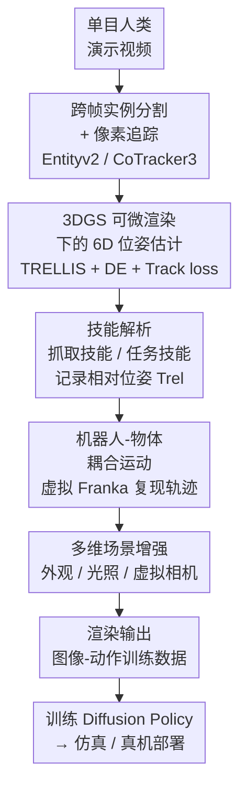

# Video2Robo: 3DGS-based Synthetic Data from One Video Enables Scalable Robot Learning

**会议**: CVPR 2026  
**论文**: [CVF Open Access](https://openaccess.thecvf.com/content/CVPR2026/html/Deng_Video2Robo_3DGS-based_Synthetic_Data_from_One_Video_Enables_Scalable_Robot_CVPR_2026_paper.html)  
**代码**: 项目页 Video2Robo（论文未给出明确仓库链接）  
**领域**: 机器人 / 具身智能  
**关键词**: 机器人数据生成, 3D高斯泼溅, 单目视频, 模仿学习, Real2Sim2Real

## 一句话总结
Video2Robo 只用一段手机拍的单目人类演示视频，靠 3DGS 把任务相关物体重建出来、跟踪它们的 6D 运动轨迹、解析出操作技能，再用一只虚拟 Franka 机械臂"接管"这些轨迹并叠加多维度场景增强，批量合成出既照片级真实又运动学合理的机器人训练数据，训练出的策略能零标定迁移到真实机械臂上。

## 研究背景与动机
**领域现状**：机器人模仿学习的上限被"高质量、多样化的具身数据有多贵"卡死。和训练 LLM/VLM 用的海量数据相比，机器人数据集小得可怜，根源在遥操作采集太费人力时间。于是"用数据生成来扩规模"成了刚需，已有四类做法：物体中心的轨迹变换（MimicGen 系）、仿真数据增强（CyberDemo、RoboSplat）、人替换成机器人（Phantom、RwoR）、人类视频动作模仿（R2R2R、YOTO）。

**现有痛点**：这些方法几乎都要么依赖难获取的硬件（真机、遥操作设备、深度相机），要么依赖仿真器（需要大量调参、还会穿模/打滑出物理错误），要么需要大量人工。更要命的是生成数据的**多样性有限**——大多只增强物体位姿，外观、光照、视角都不变，迁到真实世界的各种场景变化就崩。

**核心矛盾**：想要"低门槛输入"（普通人用手机就能拍）和"高质量+高多样性输出"（照片级真实、运动学合理、能覆盖各种场景），这两者在已有范式里是对立的——靠仿真能拿到位姿多样性但视觉假，靠真机能拿到真实感但采集贵且场景固定。

**本文目标**：拆成两个子问题——(I) 怎么从只有 2D RGB 的单目视频里把操作信息抽出来？(II) 怎么生成既照片级真实、动作又运动学合理的数据？

**切入角度**：作者抓住一个关键观察——**大部分操作任务的核心技能，都可以表示成任务相关物体之间的相对运动**（倒水 = 杯子相对碗的运动，扫地 = 刷子相对桌面的运动）。所以不必去恢复人手的精细动作，只要重建并跟踪这些物体的 6D 轨迹就够了。而 3DGS 恰好同时给了"照片级渲染"和"显式 3D 编辑"两种能力，正好能解决子问题 II。

**核心 idea**：用 3DGS 把"重建物体 → 跟踪 6D 轨迹 → 解析技能 → 虚拟机器人复现轨迹 → 编辑高斯做多维增强 → 渲染成训练数据"串成一条只吃单目视频的全自动流水线，绕开真机、仿真器和深度相机。

## 方法详解

### 整体框架
Video2Robo 输入是**一段单目人类演示视频**，输出是**一批可直接训练视觉运动策略的图像-动作数据**，整条流水线分三个模块串行：

1. **场景与技能解析（Scene and Skill Parsing，做 Real2Sim）**：从视频里抽出任务相关物体的 3D 模型，跟踪它们逐帧的 6D 位姿，再把轨迹切成"抓取技能"和"任务技能"两类片段，记录关键的相对位姿。
2. **可扩展数据生成（Scalable Data Generation）**：把上一步的相对位姿轨迹"交给"一只虚拟 3DGS Franka 机械臂去复现，通过机器人-物体耦合运动生成运动学一致的动态高斯场，同时叠加物体重排、外观/背景/光照随机化、虚拟相机扰动等多维增强，渲染出海量多样化数据。
3. **机器人学习与部署（Robot Learning and Deployment，做 Sim2Real）**：用生成的图像-动作数据训练 Diffusion Policy，在自建仿真 benchmark 和真实 Franka 机械臂上评测。

下面这张图展示从单段视频到合成数据的主干（前两个模块，是本文真正贡献所在）：

### 关键设计

**1. 跨帧一致的实例分割 + 像素追踪：从只有 2D RGB 的视频里锁定"哪些物体在动"**

子问题 I 的第一关：单目视频没有深度、没有具身标注，连"哪几个物体是任务相关的、它们逐帧在哪"都不知道。Video2Robo 的做法是先在 2D 层面把物体身份和轨迹钉死。具体流程：对每帧用实例分割模型 Entityv2 拿到实例掩码，再用 TAP 模型给每个掩码生成文字描述、用 SBERT 编码成特征，靠开放词表查询识别出任务相关物体 $\{obj_i\}$ 及其首帧掩码 $m^0_{obj_i}$；然后用像素追踪模型 CoTracker3 把首帧掩码内均匀采样的像素 $\{p^t_{obj_i}\}$ 在整段序列里追踪，逐帧把落在同一物体内的追踪像素聚合，建立跨帧关联掩码 $\{m^t_{obj_i}\}$。针对分割不一致，还会把"同一物体被过度切碎"的掩码按追踪像素分布合并、把"一个掩码盖了多个物体"的拆开。这一步的价值在于它不靠任何 3D 传感器，纯用现成的 2D 基础模型就把"任务相关物体的逐帧 2D 轨迹"准备好，为下一步抬升到 6D 打底。

**2. 3DGS 可微渲染下的 6D 物体位姿估计：把 2D 掩码轨迹抬升成时序一致的 6D 模型轨迹**

光有 2D 掩码还原不出真实的三维操作。这一步要把 2D 追踪抬到 6D。先用 AIGC 模型 TRELLIS 从单视角分割结果 $C^0[m^t_{obj_i}]$ 生成物体的 3DGS 模型 $\{G_{obj_i}\}$，但这些模型没有绝对尺度，所以额外用 VGGT 估计逐帧深度 $D=\{D_t\}$ 来对齐尺度。位姿估计分两段：**初始帧**把每个物体的 3DGS 初始化在深度点云质心，优化参数同时包含 6D 位姿和对齐深度的尺度因子，因为可能存在大平移大旋转，用 Differential Evolution（差分进化）逐个物体优化，目标是渲染图与观测的 RGB / 深度 / 掩码三项差异最小：

$$\mathcal{L}_{RGB,obj_i}=\left|\mathbf{\hat{C}}^0_{obj_i}-\mathbf{C}^0_{obj_i}\right|\cdot\left(\hat{m}_{obj_i}\cup m_{obj_i}\right)$$

深度损失 $\mathcal{L}_{depth}$、掩码损失 $\mathcal{L}_{mask}$ 形式类似。**后续帧**固定尺度因子、用上一帧结果初始化，利用 3DGS 渲染可微把 6D 位姿当作可学习参数、所有物体联合优化以捕捉物体间交互。但仅靠 RGB/深度/掩码三项对**对称物体**很容易丢时序一致性，于是引入 Track loss：把首帧追踪像素投到物体 3D 模型上，后续帧测量这些 3D 点的 2D 投影 $\hat{p}^t_{obj_i}$ 与 CoTracker3 追踪像素 $p^t_{obj_i}$ 的差异

$$\mathcal{L}^t_{track}=\sum_i\left|\hat{p}^t_{obj_i}-p^t_{obj_i}\right|$$

正是这个 Track loss 把"渲染对齐"和"像素追踪"两套信号绑在一起，才让对称物体也能拿到时序一致的轨迹——这是它在 6D 定位上能超过 MegaPose、F.P.-O 的关键。

**3. 技能解析：把连续轨迹切成可复用的抓取/任务技能片段**

有了完整 6D 轨迹后，还要回答"这段视频到底在做什么动作"。Video2Robo 把任务建模成物体间的相对运动，从轨迹里切出两类技能片段：**抓取相关技能**主要是夹爪开合，从物体的运动与停止模式识别；**任务相关技能**则看物体间距离——当两个物体的距离低于预设阈值（实验里 3 cm）时，该片段就被判为任务动作，并记录段内物体间的相对位姿 $T_{rel}$ 作为后续数据生成的依据。这一步的意义是把"人怎么操作"压缩成机器人能直接复用的相对位姿序列，从而和人手的具体形态彻底解耦。

**4. 机器人-物体耦合运动 + 多维数据增强：让虚拟机械臂运动学合理地复现轨迹，并把多样性拉满**

子问题 II：怎么让生成数据既动作合理又足够多样。机器人侧用 [62] 重建并按关节分割的 Franka 3DGS 模型，桌面用 xy 平面的矩形 3DGS 表示。新场景下物体随机重排（位置+旋转，类似 MimicGen 的 D1 设置），任务物体分 source/target，初始位姿记为 $T_s$、$T_t$；考虑到人手和夹爪抓法不同，用视觉引导的手动设置拿到相对 source 物体的抓取位姿 $T_{grasp}$、按几何算出闭合距离 $D_{grasp}$。然后用一套**机器人-物体耦合运动**走完整任务：①Transit——末端从默认位姿规划到预抓取位姿 $T_sT_{grasp}$，物体静止；②Grasp——夹爪闭合到 $D_{grasp}$；③Transfer——末端移到技能段初始位姿 $T_tT_{rel}[0]T_{grasp}$，source 物体刚性跟随、保持相对位姿 $T^{-1}_{grasp}$；④Task Execution——把技能段离散成 $\Delta t$ 间隔（按任务连续性取 5~20），迭代把末端移到目标位姿 $T_tT_{rel}[n\Delta t]T_{grasp}$；单技能任务终止，多阶段任务则开夹爪重复①~④。整个过程生成运动学一致的动态 3DGS 场，同时记录关节位置和末端位姿——这正是它对比仿真器不穿模、不打滑、数据生成成功率 100% 的原因。在此之上叠三种增强：**外观随机化**（桌面贴随机纹理图、背景用 2D 纹理图或预建 3D 高斯场景）、**光照增强**（对所有高斯椭球的漫反射颜色做缩放/平移/加噪）、**虚拟相机扰动**（自由设相机内外参、加位置/角度/焦距随机扰动）。这些增强逐帧施加以最大化多样性——靠的就是 3DGS 显式可编辑这一特性，传统采集范式根本做不到逐帧改外观光照视角。

### 损失函数 / 训练策略
位姿估计阶段的优化目标即上面的 $\mathcal{L}_{RGB}+\mathcal{L}_{depth}+\mathcal{L}_{mask}$（初始帧用 Differential Evolution）加 $\mathcal{L}_{track}$（后续帧用 Adam 可微优化）。下游策略训练采用 Diffusion Policy，动作表示为绝对关节位置，输入用前视和侧视两路相机图像。仿真环境基于 Robosuite 搭建以保证可复现，支持物体摆放/桌面背景纹理/光照/视角的随机重置与自动成功判定；真机在 Franka 机械臂上做，相机和桌面大致对齐合成数据布局，**不做任何标定或微调**。整条流水线在单张 NVIDIA L40 上自动顺序执行。

## 实验关键数据

### 主实验
六个自采任务（Attach / Drum / Place / Pour / Stack / Sweep），用 Azure Kinect DK 录制第一人称视频（仅用 RGB，深度只用来取 GT 定位）。

6D 单目物体定位（BOP Average Recall，越高越好）：

| 方法 | Mean AR | 说明 |
|------|---------|------|
| F.P.-O（单目深度版 FoundationPose） | 55.36 | 缺 GT 深度时明显退化 |
| MegaPose | 68.13 | 对复杂非对称物体跟踪难、对称物体时序不一致 |
| **Video2Robo** | **78.41** | 渲染对齐 + CoTracker3 像素追踪，定位与时序一致性最佳 |

数据生成效率与成功率（生成 100 条新演示）：

| 方法 | 平均生成耗时 (s)↓ | 生成成功率 (%)↑ |
|------|------------------|----------------|
| MimicGen | 17.23 | 97.40 |
| SkillGen | 8.88 | 96.98 |
| **Video2Robo** | **5.23** | **100.00** |

MimicGen 因为要重建完整遥操作轨迹最慢，SkillGen 分段处理省了点，但两者都会偶发物理仿真错误（穿模、滑动）导致失败；Video2Robo 靠耦合运动天然运动学一致，六个任务全部 100% 成功。

### 消融实验
策略在仿真中的成功率（%），分"只改物体位姿"和"多种变化（纹理+视角等）"两档：

| 配置 | 只改位姿 Mean | 多种变化 Mean | 说明 |
|------|--------------|--------------|------|
| MimicGen | 93.00 | 11.67 | 位姿单变化好，多变化崩 |
| SkillGen | 91.67 | 19.67 | 同上 |
| MimicGen-O（加场景变化采集） | 25.67 | 29.67 | 加了变化但绝对水平低 |
| SkillGen-O | 38.67 | 44.67 | 轨迹连续性更好 |
| **Video2Robo** | 66.67 | **63.83** | 多变化场景下断层领先且性能最稳 |

真实机械臂成功率（%），额外加了"20 条真机遥操作采集"作 baseline：

| 配置 | 只改位姿 Mean | 多种变化 Mean |
|------|--------------|--------------|
| MimicGen-O | 18.33 | 02.50 |
| SkillGen-O | 32.50 | 05.83 |
| Real Collected（真机采集） | 46.67 | 27.50 |
| **Video2Robo** | **62.50** | **58.33** |

### 关键发现
- **多样性才是真迁移的胜负手**：MimicGen/SkillGen 在"只改位姿"时和别人打平甚至更好，但一进多变化场景就从 ~90% 暴跌到 ~10~20%，暴露了"只增强位姿"的范式天花板；Video2Robo 在多变化档几乎不掉（仿真 66.67→63.83、真机 62.50→58.33），逐帧外观/光照/视角增强是它泛化的根。
- **域差也能扛**：训练用的是 3DGS 渲染环境，评测却在仿真器里，存在明显域差，Video2Robo 仍能稳健迁移，说明帧级增强带来的多样性足以覆盖这种 gap。
- **真机零标定优于真机采集**：Video2Robo 合成数据（62.50/58.33）甚至超过直接用真机采集的数据（46.67/27.50），后者因训练集多样性不足在多变化场景明显欠拟合——这点最反直觉也最有说服力。
- **Track loss 是对称物体定位的关键**：仅靠 RGB/深度/掩码三项对对称物体会丢时序一致性，加 Track loss 后才稳，直接体现在 6D 定位 Mean AR 领先 MegaPose 约 10 个点。

## 亮点与洞察
- **"物体相对运动 = 任务技能"这个抽象很省力**：它绕开了"人手→机械臂"的高自由度映射难题，只需跟踪物体 6D 轨迹，从而能纯靠现成 2D/3D 基础模型（Entityv2、CoTracker3、TRELLIS、VGGT）拼出全自动流水线，这套"用相对位姿解耦形态"的思路可迁移到任何"物体中心"的操作任务。
- **3DGS 同时吃下"真实感"和"可编辑"两个需求**：传统范式里照片级真实（真机）和显式编辑（仿真）是对立的，3DGS 的显式椭球表示让"逐帧改漫反射颜色做光照、贴纹理改外观、改相机内外参换视角"都变成廉价操作，这是它能把数据多样性拉满的底层原因。
- **机器人-物体耦合运动把"物理合理"做成了确定性而非概率性**：靠刚性跟随 $T^{-1}_{grasp}$ + 离散插值复现 $T_{rel}$，直接保证运动学一致，从源头消灭了仿真器的穿模/打滑，所以数据生成成功率能做到 100%——这是一个"用几何约束替代物理仿真"的巧妙取舍。
- **零标定零微调迁真机还能反超真机采集数据**，是对"数据多样性 > 数据真实度"这一观点的有力实证。

## 局限与展望
- **只支持刚体**：作者承认目前不能处理可变形/柔性物体，因为那需要从视频里直接学准确的动态模型；耦合运动的刚性跟随假设也只对刚体成立。
- **抓取位姿仍需人工标注**：$T_{grasp}$ 靠视觉引导的手动设置拿到，缺乏从人手到机械臂的自动个性化映射，限制了"全自动"的成色。
- **依赖一长串现成模型**：整条流水线挂在 Entityv2 / TAP / SBERT / CoTracker3 / TRELLIS / VGGT / FoundationPose 等多个模型上，任一环（如 TRELLIS 单视角重建质量、VGGT 深度精度）出错都会向下游传播，论文未充分分析这种误差累积。
- **任务技能阈值（3 cm）等超参偏经验**：技能切分依赖预设距离阈值、离散间隔 $\Delta t$（5~20）按任务手调，跨任务的鲁棒性和自动化程度存疑。
- **改进方向**：作者提出未来支持铰接/可变形物体与双臂操作；可补的还有自动抓取映射、误差累积分析、以及更系统的各增强维度消融（正文消融多放在补充材料）。

## 相关工作与启发
- **vs MimicGen / SkillGen（轨迹变换 + 仿真增强）**：它们靠遥操作种子 + 仿真器做位姿增强，需要真机/仿真器，且只增强位姿、外观光照视角不变，多变化场景崩；Video2Robo 只吃单目视频、不要仿真器，逐帧做全维度增强，多变化迁移断层领先。
- **vs RoboSplat（同用 3DGS 重建做视觉增强）**：RoboSplat 仍依赖完整遥操作系统和真/仿机器人，门槛高；Video2Robo 把 3DGS 用在"从单目视频估时序一致 6D 轨迹 + 编辑椭球生成数据"上，输入门槛降到一部手机。
- **vs Phantom / RwoR（人替换成机器人）**：这类视觉替换每段人类视频只能产出一条机器人演示，多样性为零；Video2Robo 从一段视频能批量合成多样化数据。
- **vs R2R2R / YOTO（人类视频动作模仿）**：它们仍依赖深度传感器或仿真器、且主要增强物体位姿；Video2Robo 只用单目 RGB，自动生成带多维增强的高质量数据。
- **启发**：3DGS 的"显式可编辑 + 照片级渲染"双属性正在重塑机器人数据合成范式，"用几何约束的耦合运动替代物理仿真""逐帧编辑高斯做多维增强"两招都值得在更广的具身数据生成场景复用。

## 评分
- 新颖性: ⭐⭐⭐⭐⭐ 首个纯单目视频→真机部署的机器人数据生成框架，3DGS 可微渲染做时序一致 6D 跟踪 + 显式编辑做多维增强的组合很新。
- 实验充分度: ⭐⭐⭐⭐ 六任务覆盖 6D 定位/生成效率/仿真/真机四类评测，对比与 baseline 设计扎实；但消融多放补充材料、误差累积未分析、单一机械臂略显单薄。
- 写作质量: ⭐⭐⭐⭐ 动机清晰、Tab.1 能力对比一目了然、流程交代完整；公式与部分阈值的来由稍简。
- 价值: ⭐⭐⭐⭐⭐ 把具身数据采集门槛压到"一部手机一段视频"，且零标定迁真机反超真机采集，对低成本规模化机器人学习有很强实用价值。

<!-- RELATED:START -->

## 相关论文

- [\[CVPR 2026\] IGen: Scalable Data Generation for Robot Learning from Open-World Images](igen_scalable_data_generation_for_robot_learning_from_open-world_images.md)
- [\[CVPR 2026\] CoMo: Learning Continuous Latent Motion from Internet Videos for Scalable Robot Learning](como_learning_continuous_latent_motion_from_internet_videos_for_scalable_robot_l.md)
- [\[CVPR 2026\] InternData-A1: Pioneering High-Fidelity Synthetic Data for Pre-training Generalist Policy](interndata-a1_pioneering_high-fidelity_synthetic_data_for_pre-training_generalis.md)
- [\[CVPR 2026\] SIR: Structured Image Representations for Explainable Robot Learning](sir_structured_image_representations_for_explainable_robot_learning.md)
- [\[AAAI 2026\] Realistic Synthetic Household Data Generation at Scale](../../AAAI2026/robotics/realistic_synthetic_household_data_generation_at_scale.md)

<!-- RELATED:END -->
