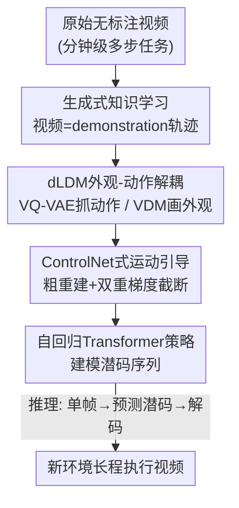

# VideoWorld 2: Learning Transferable Knowledge from Real-world Videos

**会议**: CVPR 2026  
**论文**: [CVF Open Access](https://openaccess.thecvf.com/content/CVPR2026/html/Ren_VideoWorld_2_Learning_Transferable_Knowledge_from_Real-world_Videos_CVPR_2026_paper.html)  
**代码**: https://VideoWorld2.github.io/ （开源，含数据/模型）  
**领域**: 世界模型 / 机器人具身 / 从无标注视频学习  
**关键词**: 世界模型, 潜在动态模型, 视频扩散先验, 外观-动作解耦, 长程操作

## 一句话总结
VideoWorld 2 提出"动态增强潜在动态模型 (dLDM)"，用预训练视频扩散模型 (VDM) 接管外观重建、把潜码逼着只编码与任务相关的动作动态，从而第一次从原始真实世界视频里学到可迁移、可执行的长程任务知识，在分钟级手工折纸任务上 7 步连续成功率从 baseline 的 0% 提升到 68.8%，并能把 Open-X 上学到的操作知识迁移到 CALVIN。

## 研究背景与动机

**领域现状**：当前 AI 主要从大规模文本里学知识，但文本无法刻画真实视觉世界的动态、空间关系与物理规律。动物/小孩却能直接从视觉信号里学技能——看一段折纸视频，换一张纸也能复现，无需任何语言指令。互联网上海量视频因此被视为可规模化获取"世界知识"的金矿。前作 VideoWorld 已证明：仅靠视觉信号、用自回归视频生成范式，模型能从围棋棋谱和仿真机器人环境里学到规则、推理和规划能力。

**现有痛点**：把 VideoWorld 直接搬到真实视频会崩。真实视频视觉多样性极高、动作动态复杂、且常是分钟级多步交互。当输入是分钟长、多步骤的真实任务视频时，VideoWorld 抽不出核心的任务求解知识，也无法靠观察泛化到新场景——连小孩都会的折纸都学不会，预测里全是扭曲的手势、错误的物体形状和不连贯的环境外观。另一方面，SOTA 视频生成模型 (Wan2.2、HunyuanVideo、Cosmos) 虽能生成高保真画面，却同样无法忠实表达任务执行。

**核心矛盾**：根因是**动作动态与视觉外观纠缠在一起**。在统一生成框架里联合建模两者时，模型会把背景运动、光照变化、纹理、相机位移这类与任务无关的视觉细节也吸进潜码，于是对环境变化极度敏感，长程一致性差、换环境就失效。本质上是"学任务该看的动作"被"好看的外观"淹没了。

**本文目标**：能不能让模型直接从无标注真实视频里，学到复杂、长程任务的可迁移知识？拆成两个子问题——(1) 如何把任务核心动作从视觉变化里干净地剥出来；(2) 如何用这些动作表示去做长程策略推理并迁移到新环境。

**切入角度**：人类天生会优先关注关键动作、过滤无关变化。受此启发，作者把"外观建模"显式从"动作学习"里剥离：既然有现成的强力视频扩散模型擅长画外观，就让它专职画画，把潜码解放出来专心抓动作。

**核心 idea**：用一个预训练 VDM 接管外观重建，逼迫潜在动态码只编码紧凑、语义化、可迁移的任务动作，再用自回归 Transformer 对这串动作码建模策略——即"appearance 交给 VDM，dynamics 留给 latent code"。

## 方法详解

### 整体框架

VideoWorld 2 把"一段视频"看作一条携带世界状态转移和潜在动作策略的 demonstration 轨迹，要解决的是"如何从这条轨迹里提炼出可执行、可迁移的任务知识"。形式上定义为元组 $G=\langle X, A, \omega\rangle$：$X$ 是观测空间、$A$ 是动作空间、$\omega$ 是视频生成器。给定历史帧 $x_{0:t}$，训练 $\omega$ 去建模下一帧条件分布 $p(x_{t+1}\mid x_{0:t})$；这个生成器同时充当策略模型 $\pi(\cdot\mid x_{0:t}):X\to A$，把视觉状态转移映射成动作，从而**不需要任何动作标签**就能学任务知识。

整体管线分两段：**训练时**，dLDM 把未来的视觉变化压缩成一小串紧凑、可泛化的潜在动态码 (latent dynamics codes)，外观重建交给预训练 VDM；同时一个自回归 Transformer 学着预测这串码。**推理时**，给一张新环境的初始帧，Transformer 自回归地预测未来潜码，再由 dLDM/VDM 解码成连贯的长程执行视频——这正是模型把学到的动作迁移到未见环境、执行超出训练分布动作序列的方式。

### 关键设计

**1. 生成式知识学习 + 潜在动态码：把无标注视频压成抓动作的紧凑潜码**

主流视频生成框架用 VQ-VAE 把视频编码成压缩表示，但要刻画完整视觉信息往往需要成千上万个离散 token，导致时空冗余、知识分布稀疏，关键决策/动作对应的视觉变化被淹没，框架学不到核心任务知识。VideoWorld 的对策是潜在动态模型 (LDM)：用 MAGVITv2 风格的因果编解码器，先把长度 $T$ 的片段 $x$ 编码成特征序列 $f_{0:K}$（$K=1+\lceil\frac{T-1}{s}\rceil$，$s$ 为时间下采样步长），再定义 $N$ 个可学习 query embedding $q=\{q_n\}_{n=1}^N$，让这些 query 用 cross-attention 去捕捉 $\{f_{0:k}\}$ 中的"变化信息"，得到连续表示 $z$。随后对 $z$ 做量化——量化是为了**防止模型走捷径**（否则会退化成把 $f_k$ 直接拷贝成 $z_k$）。最后解码器用 $f_0$ 和量化后的 $z$ 因果地重建后续帧，训练目标是原帧与重建帧的 $\ell_2$ 距离。这串嵌入就是"潜在动态码"，把多步动作的运动动态压成一小撮码字，是后续一切的载体。

**2. dLDM 外观-动作解耦：让 VDM 专职画外观，潜码专心抓动态**

LDM 在仿真环境里行，到真实世界就崩——学到的潜码混入了背景运动、光照、纹理、相机位移等无关细节，换桌面/换纸材/换机械臂就出现严重的场景漂移和错误动作。dLDM 的关键一招是**把原 LDM 解码器换成预训练 VDM**。VDM 本身不懂目标任务的动态，但一旦给它合适的动态引导，它极擅长生成逼真的视觉内容，所以非常适合承担这次分工。具体地，dLDM = 一个因果 VQ-VAE（把未来视觉变化编码成离散潜码）+ 一个预训练 VDM（条件于这些码做高保真重建）。潜码通过一个投影层和**因果 cross-attention** 注入 VDM；为保证时序正确，VDM 内部强制因果注意力，即时刻 $t$ 的特征只能注意到 $\le t$ 的信息。由于外观这件事被 VDM 全包，潜码就从"编码细粒度视觉细节"里被解放出来、转而专注捕捉与任务相关的动态。可视化 (UMAP) 显示：有 VDM 时，跨环境的同一动作潜码对齐得更紧、跨环境方差更小——这正是"鲁棒、可迁移的动态"的直接证据。

**3. ControlNet 式运动引导 + 双重梯度截断：既给粗运动线索又不让噪声回流**

直接训 VDM 从噪声生成未来帧会极慢、且容易动作错乱，因为它从没见过折纸这类长程任务。作者的做法是**复用 VQ-VAE 解码器**：在 warm-up 后，原解码器虽然画面模糊，却能把潜码重建成保留连贯物体运动（手的移动、物体位移）的低保真视频，提供粗粒度的时序线索。这个信号经一个 **gradient-stopped、ControlNet 式的分支**喂给 VDM，让 VDM 专注"精修外观"而不必从零推断运动，从而稳住训练。同时还**截断解码器到潜码的梯度流**，防止把无关噪声引回潜码。消融证实这两道 stop-grad 都很关键：单加截断梯度的解码器（不用重建视频）相比基线就 +~20% 成功率，说明原解码器确实会注入噪声拖累潜表示；再把重建视频作为条件 (ControlNet 分支) 又进一步稳住输出，成功率再 +~20%，且这种收益在长程折纸上比短程搭积木更明显。

**4. 自回归 Transformer 策略：把潜码序列当语言来建模长程依赖**

抽出潜码后，对每段视频 $x_{0:T}$，dLDM 给出 $\{z_k^n\}_{k=1,n=1}^{K,N}$，作者把它们展平成序列，训练一个自回归 Transformer 去预测，条件是初始帧 $x_0$ 和任务指令。这让模型学到复杂任务里的长程模式。推理时，给新环境的单帧，Transformer 基于学到的任务表示预测未来潜动态，dLDM 再解码成连贯长程视频。实现上复用 NVIDIA Cosmos AR 4B 的 next-token 预测能力来预测潜码，外观先验用 Cosmos DiT 2B（生成 93 帧 ≈5s@16fps、480px 视频）；dLDM 默认一次处理 93 帧，词表 1000（FSQ levels [8,5,5,5]）、query 长度 $N=4$。

### 损失函数 / 训练策略
dLDM 训练目标是原帧与重建帧的 $\ell_2$ 重建损失；训练分阶段——先用原 VQ-VAE 解码器 warm-up，之后丢弃 VQ-VAE 重建损失以避免噪声注入，并把 warm-up 后解码器产出的粗运动视频作为 ControlNet 式条件注入 VDM。两处 stop-grad（解码器→潜码、ControlNet 分支）是稳定训练的关键。AR Transformer 以 $x_0$ + 指令为条件、对展平潜码序列做 next-token 预测。

## 实验关键数据

### 主实验

Video-CraftBench 上的 7 步折纸连续成功率（仅 Video-Craft 训练 vs Open-X & Craft 联合预训练），强调"越往后步骤越难"：

| 方法 | 训练数据 | 折纸 Step1 | Step4 | Step7 | 积木Tower | SSIM↑ | LPIPS↓ |
|--------|---------|-----------|-------|-------|----------|-------|--------|
| Wan2.2 14B (VDM) | Craft-text | 81.2 | 10.6 | 0.0 | 42.6 | 0.719 | 0.237 |
| VideoWorld | Craft | 70.3 | 21.3 | 0.0 | 33.9 | 0.680 | 0.351 |
| **VideoWorld 2** | Craft | **97.2** | **83.3** | **68.8** | **81.5** | **0.770** | **0.205** |
| CoLA | OpenX & Craft | 83.5 | 64.8 | 40.2 | 52.4 | 0.668 | 0.289 |
| VideoWorld | OpenX & Craft | 91.7 | 63.1 | 31.9 | 52.7 | 0.601 | 0.389 |
| **VideoWorld 2** | OpenX & Craft | **98.2** | **86.7** | **72.3** | **83.0** | **0.774** | **0.193** |

CALVIN 长程序列评测（5 任务连续、Avg. Len. = 平均完成任务数，越高越好）：

| Idx | 方法 | 预训练 | 微调 | Task1 | Task5 | Avg. Len. |
|-----|------|--------|------|-------|-------|-----------|
| 2 | Transformer (Oracle) | - | 10% data | 50.5 | 0 | 1.11 |
| 3 | LAPA | 域内潜码 | 10% data | 74.4 | 2.30 | 1.49 |
| 4 | **VideoWorld 2** | 域内潜码 | 10% data | 75.8 | 9.70 | **1.87** |
| 1 | Transformer (Oracle) | - | 100% (22k) | 80.9 | 24.6 | 2.36 |
| 6 | LAPA | OpenX 跨域 | 22k | 84.0 | 27.0 | 2.51 |
| 7 | **VideoWorld 2** | OpenX 跨域 | 22k | 88.5 | 30.9 | **2.88** |

### 消融实验

dLDM 架构拆解（Table 3a，仅 Video-Craft 训练）：

| Pre-trained VDM | Decoder Stop-Grad | ControlNet | 折纸 | 积木 | LPIPS↓ |
|:---:|:---:|:---:|------|------|--------|
| ✗ | ✗ | ✗ | 0.0 | 28.5 | 0.312 |
| ✓ | ✗ | ✗ | 30.3 | 45.2 | 0.297 |
| ✓ | ✓ | ✗ | 47.3 | 54.7 | 0.275 |
| ✓ | ✓ | ✓ | **68.8** | **77.5** | **0.205** |

超参敏感性（Table 3b/c/d）：

| 配置 | 折纸成功率 | CALVIN Avg.Len. | 说明 |
|------|-----------|-----------------|------|
| Query 长度 N=1 / 2 / 4 / 8 | 41.9 / 55.1 / **68.8** / 65.0 | 1.53 / 1.64 / **1.87** / 1.88 | N=4 最佳，N=8 引入噪声反掉点 |
| 码表大小 8 / 1000 / 4096 / 64k | 20.1 / **68.8** / 50.4 / 29.4 | 1.65 / 1.87 / 1.90 / 1.89 | 太大码表编码无关噪声、阻碍收敛 |
| 压缩长度 T=2 / 9 / 49 / 93 / 177 | 19.1 / 55.4 / 65.3 / **68.8** / 69.0 | 1.55 / 1.61 / 1.80 / 1.87 / 1.79 | T=93 达 Cosmos VDM 上下文上限后饱和 |

### 关键发现
- **VDM 解耦是头号功臣**：去掉 VDM 先验，折纸成功率直接归零 (0.0)；加上后跳到 30.3，再叠两道 stop-grad 到 68.8。这验证了"外观-动作解耦"才是真实世界知识学习的关键。
- **原解码器既是噪声源也是运动金矿**：直接接它会注入噪声（所以要 stop-grad），但它 warm-up 后的粗重建恰好提供了 VDM 急需的运动线索（所以用 ControlNet 分支引回）——一截一引，把同一个模块的好处和坏处分开吃。
- **长程才是分水岭**：所有 baseline 在折纸 Step1 都能到 68%+，但到 Step4 普遍跌到 ≤10.6%、Step7 几乎全军覆没；VideoWorld 2 是唯一能把 7 步走完 (68.8%/72.3%) 的方法，且 ControlNet 引导的收益在长程折纸比短程积木更显著。
- **数据效率惊人**：CALVIN 域内潜码预训练后只用 10% 动作标签微调 (Avg.Len. 1.87)，逼近用满 22k 标签训练的 oracle (2.36)；跨域 OpenX 预训练后甚至超过 oracle 满标签 (2.88 vs 2.36)。

## 亮点与洞察
- **"让专家干专家的活"式解耦**：不是发明新模块，而是把视频生成里现成最强的 VDM 拉来当外观打工人，逼自家潜码只学动作——一个干净的职责切分，直接把跨环境迁移性从"学不会"拉到"SOTA"。这种"用强先验接管你不想学的维度"的思路可迁移到任何"信号 A 淹没信号 B"的解耦场景。
- **stop-grad 的双重用法很巧**：同一个 VQ-VAE 解码器，输出端当条件用、梯度端掐死，把"我要你的运动线索但不要你的噪声"表达得干干净净，是很实用的工程 trick。
- **新基准填了真空**：Video-CraftBench（~7 小时、~9.5k 片段、5 类分钟级手工任务）专攻"细粒度 + 长程 + 难语言描述"的真实任务，测试集用全新背景/纸材/积木布局，给"从原始视频学知识"提供了一个真会把现有方法考垮的硬测评。
- **潜码即可迁移动作字典**：UMAP 显示 Open-X 与 Video-Craft 里相似潜码对应跨智能体、跨环境的相似运动模式——说明学到的不是某台机械臂的动作，而是某种抽象"动作语义"。

## 局限与展望
- **依赖强 VDM 先验**：整套方法的上限被预训练 VDM（Cosmos DiT 2B）的保真度与上下文长度 (93 帧) 卡住——T=93 后性能饱和正是 VDM 上下文到顶的体现，换更短上下文的 VDM 会直接限制可学的时序跨度。
- **任务面仍偏窄**：手工 (折纸/搭积木) + CALVIN 机械臂，离"互联网海量开放视频"还很远；作者自己也把"持续 scaling"留作 future work。
- **量化超参敏感**：码表大小、query 长度都有明显甜点区（1000 / N=4），过大反而掉点，意味着换任务可能要重新调，泛化到更复杂动作空间时码表设计是个隐患。
- **可改进方向**：用更长上下文/分层潜码突破 93 帧瓶颈；把 AR Transformer 换成更强的世界模型做闭环规划；探索潜码作为通用"动作 token"在跨形态机器人间共享。

## 相关工作与启发
- **vs VideoWorld（前作 LDM）**：两者都把视觉变化压成潜码做自回归建模，但 VideoWorld 的解码器自己背外观，潜码因此混入背景/光照/相机等无关细节，换环境就漂移；VideoWorld 2 用 VDM 接管外观、潜码专注动作，把真实世界长程任务从"0% 成功"做到"68.8%"。
- **vs SOTA 视频生成 (Wan2.2 / HunyuanVideo / Cosmos)**：它们能生成高保真画面（SSIM 更靠前是因为像素好看），但无法 disentangle 任务核心动作，过拟合无关视觉细节，长程策略学习失败（Step7 全是 0.0）；本文要的是"会做事"而非"画得像"。
- **vs LAM / CoLA（并发潜动作工作）**：CoLA 同样用 VDM 优化潜动作码，但局限于 2 帧短转移、忽略 VAE 粗输出里的结构化时序线索，最终步成功率只有 40.2%；LAPA 等针对抓取/2D 游戏等简单任务，本文则啃分钟级多阶段、外观剧变的手工任务。
- **vs JEPA 系世界模型**：JEPA 在抽象空间预测、避开像素重建；本文反其道走"生成式知识学习"，靠 VDM 高保真重建反而拿到可解释、可执行的动作潜码，并直接当策略用。

## 评分
- 新颖性: ⭐⭐⭐⭐⭐ 首个从原始真实视频学复杂长程可迁移知识的工作，"VDM 接管外观逼潜码学动作"的解耦干净且有效。
- 实验充分度: ⭐⭐⭐⭐⭐ 双基准 (Video-CraftBench + CALVIN)、多类强 baseline、架构/超参四组消融齐全，长程逐步成功率把差距说得很透。
- 写作质量: ⭐⭐⭐⭐ 动机递进清晰、图表对照到位；部分实现细节 (因果注意力、warm-up 时序) 需配补充材料才能完全复现。
- 价值: ⭐⭐⭐⭐⭐ 给"从无标注视频规模化学世界知识"提供了可落地范式 + 开源数据/模型，对具身智能与世界模型方向有明确推动。

<!-- RELATED:START -->

## 相关论文

- [\[CVPR 2026\] TraceGen: World Modeling in 3D Trace Space Enables Learning from Cross-Embodiment Videos](tracegen_world_modeling_in_3d_trace_space_enables_learning_from_cross-embodiment.md)
- [\[CVPR 2026\] RoboWheel: A Data Engine from Real-World Human Demonstrations for Cross-Embodiment Robotic Learning](robowheel_a_data_engine_from_real-world_human_demonstrations_for_cross-embodimen.md)
- [\[CVPR 2026\] Dexterous World Models](dexterous_world_models.md)
- [\[CVPR 2026\] CoMo: Learning Continuous Latent Motion from Internet Videos for Scalable Robot Learning](como_learning_continuous_latent_motion_from_internet_videos_for_scalable_robot_l.md)
- [\[CVPR 2026\] Chain of World: World Model Thinking in Latent Motion (CoWVLA)](chain_of_world_world_model_thinking_in_latent_motion.md)

<!-- RELATED:END -->
