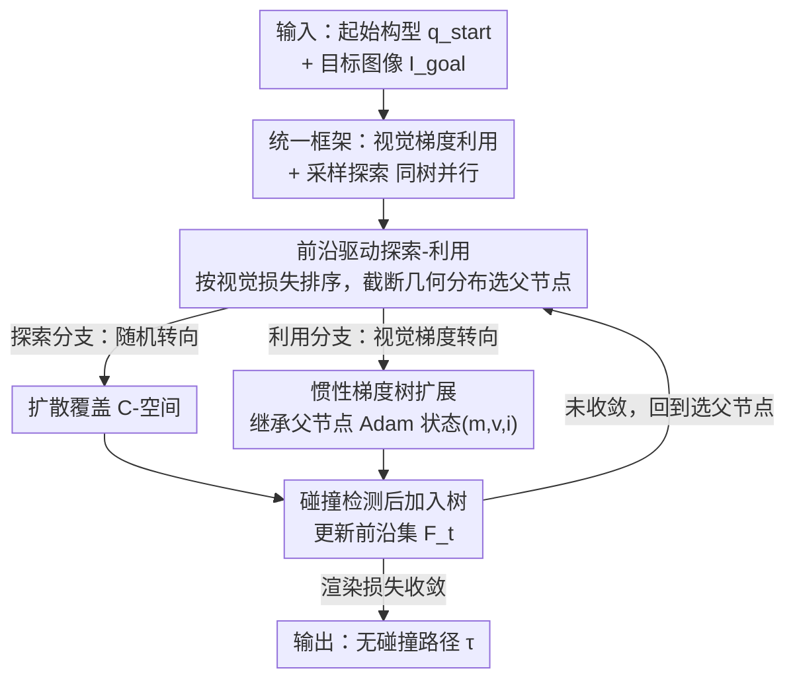

# Visual-RRT: Finding Paths toward Visual-Goals via Differentiable Rendering

**会议**: CVPR 2026  
**论文**: [CVF Open Access](https://openaccess.thecvf.com/content/CVPR2026/html/Lee_Visual-RRT_Finding_Paths_toward_Visual-Goals_via_Differentiable_Rendering_CVPR_2026_paper.html)  
**代码**: https://sgvr.kaist.ac.kr/Visual-RRT （项目页）

**领域**: 机器人 / 运动规划  
**关键词**: 运动规划, RRT, 可微渲染, 视觉目标, 采样规划

## 一句话总结
把基于可微机器人渲染的"视觉梯度利用"塞进 RRT 的"采样探索"框架里，让机械臂在**只给一张目标图像、没有目标关节角**的情况下也能规划出无碰撞运动路径，在 Franka / UR5e / Fetch 上的成功率从 ~20% 量级提到 ~75%。

## 研究背景与动机
**领域现状**：RRT（快速扩展随机树）是机械臂运动规划的基石方法——它从起始构型 $q_{\text{start}}$ 出发，朝随机采样的构型增量扩展一棵搜索树，靠采样探索 C-空间（构型空间），既能绕开局部极小，又有概率完备性 / 渐近最优性等理论保证。后续工作在路径质量、收敛速度、采样效率上不断改进它。

**现有痛点**：所有 RRT 变体都默认**目标构型是已知的**，通常以数值关节角 $q_{\text{goal}}$ 的形式给定。但越来越多的实际场景里，目标是通过**视觉观测**指定的——一张图像、一段示教视频——此时精确的目标关节角根本拿不到。RRT 的"利用"环节（goal biasing、双向搜索、势场引导）全都依赖 $q_{\text{goal}}$，没有它就退化成纯随机探索，效率极低。

**核心矛盾**：另一条技术线"可微机器人渲染"（如 Dr.Robot、Prof.Robot）能解决"视觉目标"问题：它把机器人自身建成一个可微的自模型（高斯泼溅 + 正向运动学 + 隐式线性混合蒙皮），于是渲染损失能反传到关节角，直接用视觉梯度优化构型。但它是**单路径优化**，沿着一条梯度轨迹走，遇到自遮挡 / 场景遮挡造成的局部极小就卡死。一边（RRT）有多分支抗局部极小但缺视觉引导，一边（可微渲染）有视觉引导但单路径易卡死。

**本文目标**：把两者的长处合一——让树扩展朝视觉梯度指向的"有希望"构型生长（利用），同时保留随机采样的全局覆盖（探索），从而在只有目标图像时也能规划出高质量无碰撞路径。

**核心 idea**：用**渲染损失当作隐式的"目标接近度"**来引导 RRT 的树生长，把可微渲染的视觉梯度直接注入采样式规划器（作者称这是首个这样做的工作），再配两个机制——前沿驱动的探索/利用调度、惯性梯度树扩展——让梯度优化能在树的多分支结构里持续累积动量。

## 方法详解

### 整体框架
vRRT 在 C-空间里从起始构型 $q_{\text{start}}$ 增量生长一棵搜索树，目标是让某个叶节点 $q_T$ 渲染出来的机器人姿态视觉上匹配目标图像 $I_{\text{goal}}$。每轮迭代树以两种互补方式扩展：**探索**靠随机转向（random steering）维持全局 C-空间覆盖，**利用**靠视觉梯度转向（visual-gradient steering）把有希望的节点朝 $I_{\text{goal}}$ 推。两者在一批父节点上并行执行（每轮扩展一批 32 个节点）。

但若对所有节点无差别地做这两件事会很低效，于是作者加了两层调度：(1) **前沿驱动的探索-利用策略**——按视觉损失给节点排序，用一个截断几何分布优先选"低损失=离目标近"的前沿节点当父节点，把经典 RRT 的 goal biasing 搬到视觉域；(2) **惯性梯度树扩展**——让每个节点继承父节点的 Adam 优化状态（一阶矩、二阶矩、迭代步），使梯度利用能跨树分支累积动量，而不是每步都从零开始。

### 关键设计

**1. 视觉梯度转向：把渲染损失的梯度当成 RRT 的"利用信号"**

经典 RRT 的利用靠朝已知 $q_{\text{goal}}$ 偏置，可视觉目标下根本没有 $q_{\text{goal}}$。作者的做法是借可微机器人渲染：给定父节点 $q_p$，先经正向运动学和可微渲染器 $\pi$ 渲出机器人图像 $I(q_p)=\pi(\text{FK}(q_p))$，再对目标图像算渲染损失 $\mathcal{L}_{\text{render}}(q_p)=\|I(q_p)-I_{\text{goal}}\|$，于是能反传得到 $\nabla_q \mathcal{L}_{\text{render}}(q_p)$，沿负梯度生成子节点：

$$q_{\text{new}} = q_p - \alpha \cdot \nabla_q \mathcal{L}_{\text{render}}(q_p)$$

其中 $\alpha$ 是梯度步长。与之并列的"探索"分支则是标准 RRT 的随机转向 $q_{\text{new}} = q_p + \epsilon \cdot \frac{q_{\text{rand}}-q_p}{\|q_{\text{rand}}-q_p\|}$。两条分支生成的子节点都要先过无碰撞检测才挂上树。这样树就同时在"广撒网"（探索）和"有方向"（利用）地长，把单路径可微渲染的视觉引导嫁接到了多分支结构上。

**2. 前沿驱动的探索-利用：用截断几何分布把 goal biasing 搬到视觉域**

如果对树里每个节点都无脑做扩展，算力会被浪费在没希望的区域。经典 RRT 靠 goal biasing 解决——优先朝已知目标长；但视觉目标下没有显式目标可偏置。作者的关键观察是：**渲染损失本身就是隐式的目标接近度**，损失越低的节点越接近视觉目标。于是每轮维护一个前沿集 $F_t$，把节点按视觉损失升序排到前 $M$ 名 $\{q_0,\dots,q_{M-1}\}$（$\mathcal{L}_{\text{render}}(q_i)\le \mathcal{L}_{\text{render}}(q_{i+1})$），再用截断几何分布按"排名 $k$"采样父节点：

$$p_{\text{frontier}}(k) = \frac{(1-\kappa)\kappa^{k}}{1-\kappa^{M}}, \quad k\in\{0,1,\dots,M-1\}$$

$\kappa\in[0,1)$ 控制对低损失节点的偏置强度（论文用 $\kappa=0.9$）。低排名（低损失）节点被选中的概率更高，但高排名节点仍分到概率质量以保留探索。妙处在于：分布形状 $\kappa$ 全程固定不变，但 $F_t$ 随树发现更低损失节点而演化，于是同一个分布会**自动**把算力越来越多地导向目标相关区域，不需要显式改采样策略。对每个被选中的父节点，再分别做前沿驱动探索（在该节点半径 $\rho$ 的球内采局部目标 $q_{\text{target}}=q_f+u$ 后随机转向，相当于"软 goal bias"）和梯度利用。消融显示去掉前沿采样（$\eta=0$）成功率几乎归零，$\eta=0.6$–$0.8$ 最佳。

**3. 惯性梯度树扩展：让 Adam 的动量沿树分支继承下去**

视觉梯度转向虽能利用，但在树结构里直接做梯度下降有个隐患：传统梯度下降是**单条轨迹带累积动量**地走，而树规划同时铺开多条路径，常规 RRT 的状态（路径代价、动力学约束）压根没设计来保存优化历史。结果每个梯度步都在"重置优化"，收敛慢、对局部极小敏感。作者让**每个节点维护自己的优化轨迹**：子节点从父节点继承并更新 Adam 状态——一阶矩 $m_p$、二阶矩 $v_p$、迭代步 $i_p$。子节点创建时迭代步 $i_{\text{new}}=i_p+1$，矩按 Adam 更新：

$$m_{\text{new}} = \beta_1 m_p + (1-\beta_1)\nabla_q \mathcal{L}_{\text{render}}(q_p), \quad v_{\text{new}} = \beta_2 v_p + (1-\beta_2)(\nabla_q \mathcal{L}_{\text{render}}(q_p))^2$$

再用偏置校正后的矩做这一步利用：

$$q_{\text{new}} = q_p - \alpha\cdot \frac{\hat{m}_{\text{new}}}{\sqrt{\hat{v}_{\text{new}}}+\delta}$$

其中 $\hat{m}_{\text{new}}=m_{\text{new}}/(1-\beta_1^{i_{\text{new}}})$、$\hat{v}_{\text{new}}=v_{\text{new}}/(1-\beta_2^{i_{\text{new}}})$，$\delta$ 是数值稳定小常数。关键在于这个继承既给了"有希望节点的后代"现成的动量加速收敛，又**不破坏探索**：随机转向生成的子节点**不继承**优化状态，所以不同分支保持各自独立的优化轨迹，整棵树仍能探索多样区域。消融里 $\beta_1=0.5$ 只有 29.6%、$\beta_1=0.9$ 升到 79.8%，证明动量累积对梯度利用至关重要。

### 损失函数 / 训练策略
方法本身无需训练（可微渲染的机器人自模型预先用 MuJoCo 渲染图像训好，每个机器人 5k–10k 个高斯基元，480×480 分辨率，L2 损失）。规划期超参：随机步 $\epsilon=0.04$、梯度步 $\alpha=0.04$、几何参数 $\kappa=0.9$、探索半径 $\rho=0.7$、动量 $\beta_1=\beta_2=0.9$，每轮扩展 32 个节点，损失连续 100 轮变化 <0.0001 时终止；并复用 RRT* 的树重连、标准路径捷径化、MuJoCo 碰撞检测；全部实验在单张 RTX4090 上跑。

## 实验关键数据

### 主实验：视觉目标运动规划
在 Franka / UR5e / Fetch 三种机械臂、模拟 + 真机上评测。每个机器人构造 6 个随机放 5–10 个障碍物的场景，按 C-空间距离 $\|q_s-q_g\|_2$ 分成 5 个难度档（0.5–2.5 rad），每档 100 个任务。指标：成功率 SR（终态平均关节误差 <0.05 rad 且无碰撞）、路径长度 PL、规划时间。下表为各机器人的平均 SR：

| 机器人 | Dr.Robot | Prof.Robot | Dr.Robot+RRT* | vRRT（本文）|
|--------|----------|------------|---------------|------------|
| Franka | 19.3% | 23.6% | 23.8% | **75.2%** |
| UR5e | 25.9% | 28.0% | 28.1% | **79.8%** |
| Fetch | 18.7% | 21.9% | 22.4% | **73.4%** |

难度越大优势越明显——以 Franka 为例，2.5 rad 档单路径基线 SR 仅 1.5–2.0%，而 vRRT 仍有 44.7%。两阶段的 Dr.Robot+RRT* 虽比 Dr.Robot 单独强，但仍远不及 vRRT，原因是误差传播：第一阶段估错目标构型，第二阶段 RRT* 就朝错误目标优化。路径质量上 vRRT 的轨迹几何结构接近 RRT* 参考解，而单路径基线常因遮挡导致局部极小、绕远路甚至失败。

### 视觉目标姿态重建 + 真机基准
姿态重建任务隔离出"恢复匹配目标图的构型"这一难点。vRRT 在所有距离档的 SR、关节误差、PSNR 全面优于 Dr.Robot（Franka 平均 SR 78.8% vs 35.8%，关节误差 0.142 vs 0.588 rad）。尤其 PSNR——视觉相似度，正是视觉目标规划的主目标——在远距离仍保持高位（Franka 远档 27.82 vs 21.29）。真机 Panda-3CAM-Azure 基准上直接 sim-to-real，对比前馈位姿回归器 RoboPEPP / HoRoPose：

| 方法 | 平均每关节误差 (rad) | 被遮挡 J7 误差 |
|------|---------------------|---------------|
| RoboPEPP | 0.184 | 0.579 |
| HoRoPose | 0.154 | 0.355 |
| Dr.Robot | 0.164 | 0.617 |
| vRRT（本文）| **0.083** | **0.094** |

vRRT 在被严重遮挡的末端关节 J7 上误差大幅领先——靠探索消解了遮挡造成的视觉歧义。

### 消融实验
| 配置 | 关键现象 | 结论 |
|------|---------|------|
| 探索比 $r=0.9$ | 各档 SR 严重下降 | 纯随机采样无法利用视觉引导 |
| 探索比 $r=0.1$ | 近距尚可、远距明显掉点 | 太少探索，远距困于局部极小 |
| 探索比 $r=0.3$ | 各距离档最优 | 探索/利用需平衡 |
| 前沿采样 $\eta=0.0$ | SR 近乎为 0 | 均匀选点白白分散算力 |
| 前沿采样 $\eta=0.6$–$0.8$ | 最佳 | 自适应优先 + 保留多样性 |
| $\beta_1=0.5$ | 29.6% | 低动量利用无力 |
| $\beta_1=0.9$ | 79.8% | 标准动量最优 |

### 关键发现
- **前沿采样是命门**：去掉它（$\eta=0$）成功率几乎归零，说明"用渲染损失当隐式目标接近度去优先选点"是整个方法能 work 的关键，而非锦上添花。
- **动量必须累积**：$\beta_1$ 从 0.5 到 0.9 带来 50 个百分点的跳变，证明惯性梯度扩展的"跨分支继承优化状态"确有实效；过高（0.99）反而因过度平滑梯度掉到 65.2%。$\beta_2$ 则对取值不敏感。
- **难度越大越能拉开差距**：单路径基线在远距离档（2.5 rad）几乎全军覆没（<2%），vRRT 仍有 44–62%，正面印证"多分支树搜索抗局部极小"的核心论点。
- **对噪声目标鲁棒**：即使额外喂入带噪的目标构型估计（$\sigma$ 到 0.20），视觉反馈能补偿构型空间误差，SR 仍维持 89% 左右。

## 亮点与洞察
- **"渲染损失=隐式目标接近度"这层映射很漂亮**：它一句话就把"视觉目标下没有 $q_{\text{goal}}$ 因而做不了 goal biasing"这个核心障碍化解了——既然算不出目标构型，那就用"渲染得有多像目标图"来排序节点，等价地实现了视觉域的 goal biasing。
- **截断几何分布的"形状固定、集合演化"设计很省心**：不用随规划进度去调采样策略，靠前沿集 $F_t$ 自己更新就能让算力自动聚焦，工程上简洁又自适应。
- **把 Adam 状态挂到树节点上**是个可迁移的 trick：任何"在树/图结构上做逐节点梯度优化"的场景（不止 RRT），都能借"随贡献边继承动量、随探索边重置"的思路，既加速收敛又不牺牲多样性。
- **首次把可微渲染的视觉梯度直接接进采样式规划器**，给"可微渲染"开辟了机器人规划这一新应用面，思路上把视觉中心机器人学和经典运动规划这两条线缝起来了。

## 局限与展望
- **作者承认**：探索虽能扛遮挡，但**视觉歧义仍难处理**——被遮挡或对称的机器人部件可能渲染出几乎一样的图像，却对应不同关节构型，此时纯视觉目标无法区分。
- **依赖高质量可微机器人自模型**：每个机器人都要先用 5k–10k 高斯基元在 MuJoCo 渲染图上训好渲染器，换新机器人 / 新形态需重新建模，且 sim-to-real 的渲染域差异可能进一步放大视觉歧义。
- **规划时间偏长**：vRRT 的规划时间普遍高于单路径基线（如 Franka 21.64s vs Dr.Robot 10.25s），是用算力换成功率，实时性场景需权衡。
- **可改进方向**：引入多视角 / 时序观测来打破对称歧义，或把语义先验（如关节可达性约束）融进前沿排序，应能缓解视觉歧义这一主要短板。

## 相关工作与启发
- **vs Dr.Robot / Prof.Robot（可微机器人渲染）**：它们直接在构型空间沿渲染损失梯度做**单路径**优化，遮挡导致局部极小就卡死、轨迹绕远。vRRT 复用它们的可微渲染管线提供视觉梯度，但把梯度嵌进 RRT 的多分支树里，靠探索绕开局部极小——本质是"给单路径优化器配了一棵抗局部极小的树"。
- **vs Dr.Robot + RRT*（两阶段基线）**：先用 Dr.Robot 估目标构型、再用 RRT* 朝它规划。问题是两段串行有误差传播——第一段估歪，第二段就朝错目标走。vRRT 把"估目标"和"规划"融成一个过程，视觉梯度全程在线引导，避免了中间硬估计。
- **vs 经典 / 学习引导 RRT**：传统 RRT 及在隐空间规划 / 神经采样器替换启发式组件的学习版，都仍依赖显式目标构型做有效树扩展。vRRT 重定义了规划目标——把"已知目标构型"换成"视觉梯度引导"，是首个不需要显式目标构型的视觉目标 RRT。
- **vs 前馈位姿回归器（RoboPEPP / HoRoPose）**：它们一步前馈预测关节角，但在遮挡关节上误差大；vRRT 靠优化 + 探索在被遮挡的 J7 上误差远更低，代价是更高的计算开销。

## 评分
- 新颖性: ⭐⭐⭐⭐⭐ 首次把可微渲染视觉梯度直接缝进采样式规划器，"渲染损失当隐式 goal biasing" + "Adam 状态沿树继承"两个机制都很巧。
- 实验充分度: ⭐⭐⭐⭐⭐ 三机器人 × 两任务 × 五难度档，模拟 + 真机 + 真实基准，消融覆盖探索比 / 前沿比 / 动量参数，证据链完整。
- 写作质量: ⭐⭐⭐⭐ 动机和方法讲得清楚、图示到位；公式排版（CVF 抽取版）偶有错位，但逻辑链顺畅。
- 价值: ⭐⭐⭐⭐ 给"只有目标图像"的视觉中心机器人操作提供了实用规划器，思路对树/图上的逐节点优化有迁移价值；实时性和视觉歧义是落地前要解决的现实门槛。

<!-- RELATED:START -->

## 相关论文

- [\[CVPR 2026\] CLiViS: Unleashing Cognitive Map through Linguistic-Visual Synergy for Embodied Visual Reasoning](clivis_unleashing_cognitive_map_through_linguistic-visual_synergy_for_embodied_v.md)
- [\[CVPR 2026\] Rethinking Visual Rearrangement from A Diffusion Perspective](rethinking_visual_rearrangement_from_a_diffusion_perspective.md)
- [\[CVPR 2026\] Semantic Audio-Visual Navigation in Continuous Environments](semantic_audio-visual_navigation_in_continuous_environments.md)
- [\[CVPR 2026\] Diagnose, Correct, and Learn from Manipulation Failures via Visual Symbols](diagnose_correct_and_learn_from_manipulation_failures_via_visual_symbols.md)
- [\[CVPR 2026\] EgoRoC: Towards Egocentric Robotic Control via Task-Agnostic Visual Alignment](egoroc_towards_egocentric_robotic_control_via_task-agnostic_visual_alignment.md)

<!-- RELATED:END -->
