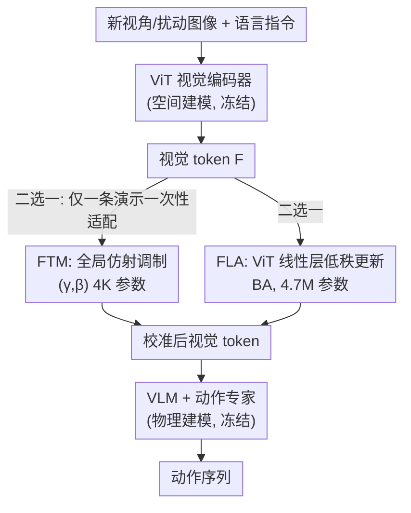

# VLA Models Are More Generalizable Than You Think: Revisiting Physical and Spatial Modeling

**会议**: CVPR 2026  
**论文**: [CVF Open Access](https://openaccess.thecvf.com/content/CVPR2026/html/Li_VLA_Models_Are_More_Generalizable_Than_You_Think_Revisiting_Physical_CVPR_2026_paper.html)  
**代码**: 无  
**领域**: 机器人 / 具身智能（VLA 鲁棒性分析）  
**关键词**: VLA、视角鲁棒性、参数高效适配、空间建模、one-shot 适配

## 一句话总结
本文把预训练 VLA 拆成「空间建模（视觉编码器）」与「物理建模（VLM + 动作专家）」两块，论证 VLA 在新视角/视觉扰动下崩盘的元凶是空间建模的表征漂移而非物理建模失能，并用两个极轻量的一次性适配（4K 参数的特征 token 仿射调制 FTM、4.7M 参数的 ViT 低秩适配 FLA）把 LIBERO 新视角成功率从 48.5% 拉到 90.8%，以 1% 的参数追平甚至超过 LoRA 全量微调。

## 研究背景与动机
**领域现状**：VLA（视觉-语言-动作）模型把预训练视觉-语言基座扩展到机器人控制，在大规模机器人数据上预训练后能在「分布内」的操作任务上表现很强，是当下具身智能的主流路线（RT-2、π0、OpenVLA、Octo 等）。

**现有痛点**：这些模型一旦遇到训练时没见过的相机视角、光照变化、背景纹理或传感器噪声，成功率会断崖式下跌——本文实测 π0.5 在 LIBERO 新视角下零样本只有 48.5%。即便在数百万条演示上训练过，这种脆弱性依然存在，严重限制了真实部署。

**核心矛盾**：以往提升鲁棒性的两条路都很贵且没切中要害。数据派（如 Libero-Plus）靠堆多视角数据扩大视觉多样性，但真实场景下采集成本极高、无法持续适配；表征派靠几何一致性/3D 感知架构换更鲁棒的视觉骨干，但仍对背景杂乱、光照这类与任务无关的视觉因素敏感。两派都**默认**鲁棒性必须靠「更多数据」或「换 3D 架构」，却几乎没人去追问：失败到底是不是出在空间表征本身？

**本文目标**：把「VLA 为什么在视角变化下崩」这个笼统问题，拆成可定位的子问题——崩的是「看不懂空间」还是「不会推理/控制」？如果只是前者，能不能用极小的代价把它「校准」回来，而不动整个策略？

**切入角度**：作者提出一个概念框架，把 VLA 拆成两个功能模块——空间建模（visual encoder，从图像构建物体位置/朝向/接触/遮挡等空间关系）与物理建模（VLM + 动作专家，融合语言、空间表征、动作历史做高层推理并生成动作）。关键观察是：视角变化主要改变的是「观测场景的空间配置」，而**不改变任务语义和动作动力学**。所以退化大概率源于空间建模的表征错位，物理建模其实还好端端地工作着——高层策略依然会推理、会控制，只是收到了被空间扭曲的视觉嵌入。

**核心 idea**：既然瓶颈在空间建模，那就**只**对视觉侧做一次性、轻量、可学习的「校准」（token 级仿射调制或 ViT 内部低秩更新），把漂移的视觉嵌入重新对齐回物理建模能用的分布，而不去全量微调整个 VLA。

## 方法详解

### 整体框架
本文不是要发明一个新模型，而是要验证并利用一个论断：**VLA 在视觉扰动下的脆弱性，本质是空间建模产出的视觉 token 相对于物理建模发生了系统性嵌入漂移，而非物理建模缺乏视觉运动能力**。因此整体做法是「冻住整个 VLA 主干，只在视觉侧插一个极小的可学习变换 $A_\phi$ 去校准视觉 token」。

形式化地，基座是 π0.5：视觉编码器 $f_v(\cdot)$ 把图像映成 token 嵌入 $z=f_v(v)$，语言编码器 $f_\ell(\cdot)$ 给出 $\ell=f_\ell(l)$，多模态解码器 $g(\cdot)$ 在拼接序列 $[z;\ell]$ 上自回归预测动作 token。本文把预训练参数 $\theta$ 和适配参数 $\phi$ 分开，适配只作用在视觉侧、解码器 $g$ 与语言编码器 $f_\ell$ 全程冻结，适配后预测分布变成：

$$P_{\theta,\phi}(a_t\mid a_{<t}, o_{\le t}) = g\big(a_{<t};\,[A_\phi(f_v(v));\,\ell]\big)$$

其中 $A_\phi(\cdot)$ 就是下面两个轻量变换之一。整套适配是 **one-shot** 的——每个任务只需一条人类演示就能适配到新视觉域。作者把已有/潜在方案归为三类（LoRA 全量/PEFT 微调整个主干、换更鲁棒的视觉骨干并重训策略、prompt learning 拼可学习 token），它们要么参数开销大、要么需要重训；本文与之对照，主张「只动视觉通路就够」。

### 关键设计

**1. 空间建模 vs 物理建模的解耦诊断：把「VLA 崩了」精确定位到视觉表征**

这是全文的立论基石，也直接决定了后面只改视觉侧的合理性。痛点是以往工作把视角脆弱性当成「整个 VLA 不够鲁棒」，于是动辄全量微调或换骨干。作者反过来做了一个受控诊断：把 VLA 拆成空间建模（$f_v$）和物理建模（$g$）；视角变化只改变场景的空间配置，不改变任务语义与动作动力学，所以若崩溃源自空间建模，那么**只校准视觉 token、不碰 $g$ 和 $f_\ell$，就应当足以恢复鲁棒性**。FTM 被刻意设计成一个「探针」——如果只调一对全局 $(\gamma,\beta)$ 就能把 48.5% 拉回 87%，就反证了脆弱性确实出在嵌入错位、而非模型容量不足。实验结果（FLA 仅用 LoRA 1% 参数还略胜 LoRA）正是这一论断最有力的证据。

**2. Feature Token Modulation（FTM）：用一对全局仿射参数把漂移的视觉分布拉回来**

FTM 针对「视角变化把视觉 token 的特征分布整体平移/缩放偏了」这个痛点，给视觉编码器输出的 token 嵌入 $F\in\mathbb{R}^{N\times D_{ViT}}$ 加一个全局仿射校正，引入两个可学习向量 $\gamma,\beta\in\mathbb{R}^{D_{ViT}}$：

$$\hat F = (1+\gamma)\odot F + \beta$$

它本质是对视觉嵌入空间做「重新缩放 + 重新居中」，把被视角扭曲的各特征维度校准回来，而 VLA 主干全程冻结。与那些「按输入动态生成调制参数」的条件调制不同，这里的 $\gamma,\beta$ 是**全局共享但可学习**的，适配时联合优化。参数量只有 $2D_{ViT}$——π0.5 的 $D_{ViT}=2048$，所以总共仅约 4K 个可训练参数。如此极简的干预却能把新视角成功率从 48.5% 抬到 87.1%，说明预训练 VLA 里本就潜藏着鲁棒性，只是被嵌入错位「锁住」了，轻轻一调就能激活。

**3. Feature Linear Adaptation（FLA）：在 ViT 内部做低秩更新，做更深一层的特征重对齐**

FTM 只动输出 token，FLA 则更进一步，问「能不能直接在视觉骨干内部修」。它对 ViT（具体是 π0.5 的 SigLIP 骨干）的线性层做 LoRA 式低秩更新：对一个冻结的线性变换 $h=Wx$，引入低秩分解

$$W' = W + \Delta W,\quad \Delta W = BA$$

其中 $A\in\mathbb{R}^{r\times d_{in}}$、$B\in\mathbb{R}^{d_{out}\times r}$，$r\ll\min(d_{in},d_{out})$，只训练 $(A,B)$。这让 ViT 能以很小的参数开销调整自己的特征抽取，是对空间建模的「第二种最小干预」——用来检验「修内部层」是否比「调输出 token」效果相当或略好。FLA 总共 4.7M 参数，把平均成功率推到 90.8%，超过用了 467M 参数的 π0.5 One-Shot LoRA（90.3%），却只用了不到 1% 的参数。「只对空间建模做轻量更新就能压过全模型 LoRA」这件事，构成了「脆弱性主要源于空间表征而非视觉运动策略」的强力证据。

### 损失函数 / 训练策略
适配是 one-shot 的：每个任务仅用一条人类演示。所有实验在单张 A100（80GB）上跑。FLA 与 LoRA 基线为公平比较都训练 2000 步、用 Adam、batch size 32；策略接收腕部相机 + 第三人称相机两路观测以提供互补视觉信息。FTM 的 $\gamma,\beta$ 对应视觉编码器隐维 $D_{ViT}=2048$，故仅 4K 参数；FLA 只微调 SigLIP 骨干内的线性层。

## 实验关键数据

### 主实验
评测基准是作者构建的 **Libero-V (Visual)**：在原 LIBERO 四个任务套件（Spatial/Object/Goal/Long，每套件 10 任务、每任务 50 次试验）基础上，叠加来自 Libero-Plus 的四类视觉扰动——相机视角、光照、背景/桌面纹理、传感器噪声，统一评估分布偏移下的鲁棒性。

**LIBERO 新视角下的成功率（Table 1）**：

| 模型 | 参数量 | 平均 SR(%) |
|------|--------|-----------|
| OpenVLA-OFT（零样本） | — | 50.3 |
| OpenVLA-OFT-m（Libero-Plus 微调） | — | 65.2 |
| GeoAware-VLA（BAKU） | — | 82.6 |
| π0（One-Shot LoRA） | 468M | 83.6 |
| π0.5（One-Shot LoRA） | 467M | 90.3 |
| **π0.5 + FTM（本文）** | **4K** | **87.2** |
| **π0.5 + FLA（本文）** | **4.7M** | **90.8** |

仅 4K 参数的 FTM 就超过了 468M 参数的 π0 LoRA 基线；4.7M 的 FLA 反超 467M 的 π0.5 LoRA，参数减少约 99×。

**Libero-V 四类视觉扰动（Table 3）**：

| 模型 | 相机 | 光照 | 纹理 | 噪声 | 平均 |
|------|------|------|------|------|------|
| π0.5（零样本） | 48.5 | 96.2 | 96.0 | 93.5 | 83.6 |
| π0.5（One-Shot LoRA） | 90.3 | 96.5 | 97.2 | 94.5 | 94.6 |
| **π0.5 + FTM（本文）** | 87.1 | 96.0 | 96.0 | 93.6 | 90.5 |
| **π0.5 + FLA（本文）** | 90.8 | 96.8 | 97.1 | 94.6 | **94.8** |

零样本的崩盘几乎全发生在「相机视角」这一维（48.5），光照/纹理/噪声本就 93+，印证了「视角变化才是主要病灶」。FLA 把相机维拉到 90.8 后，整体平均追平甚至略超 LoRA。

### 消融实验

**参数效率对比（Table 4）** 与 **适配秩 / 基座消融（Table 5）**：

| 配置 | 参数量 | SR(%) | 说明 |
|------|--------|-------|------|
| Prompt Learning | 0.13M | 75.1 | 浅层条件化不足以做完整特征重对齐 |
| FTM | 0.004M | 90.5 | 直接调制视觉 token，比 prompt 有效得多 |
| FLA (rank=16) | 4.7M | 90.8 | 追平 LoRA，参数省 99× |
| FLA (rank=32) | 9.4M | 91.2 | 提秩带来小幅提升 |
| π0 + FLA (rank=16) | 4.7M | 84.0 | 换基座 π0 仍约等于其 LoRA(83.6) |
| LoRA (π0.5) | 467M | 90.3 | 全量微调基线 |

### 关键发现
- **崩溃高度集中在视角维**：零样本 π0.5 在光照/纹理/噪声上本就 93+，唯独相机视角掉到 48.5——这从数据上坐实了「空间建模错位」假说，也解释了为何只校准视觉侧就够。
- **token 级调制 ≫ prompt learning**：FTM（4K 参数，90.5%）大幅超过 Prompt Learning（0.13M 参数，75.1%），说明直接在视觉 token 上做仿射校正，比在多模态序列里拼可学习 token 这种浅层条件化有效得多。
- **轻量适配反超全量 LoRA**：FLA 用 1% 参数超过 LoRA，最有信息量的不是「省参数」，而是它**反证了物理建模本身没坏**——否则只动视觉侧不可能恢复到全量微调水平。
- **对视角扰动幅度稳定**：随视角偏移从 Small→Large（Table 2），FLA 保持 94.6/90.0/87.9 的稳态，验证了「潜在鲁棒性可被高效激活、无需重训或大规模数据增强」。
- **可跨基座**：在 π0 和 π0.5 上 FLA 都约等于各自的 LoRA，提秩（16→32）带来可预期的小幅提升（90.8→91.2）。

## 亮点与洞察
- **「诊断先于修复」的研究范式很漂亮**：先把 VLA 拆成空间/物理两块并提出可证伪假设，再把 FTM 当探针去验证，最后用 FLA 兑现性能。整篇论文的说服力来自「极小干预竟能恢复」这个反直觉结果，而非堆 trick。
- **4K 参数把 48.5%→87.1% 是真正的「啊哈」点**：它直观说明预训练 VLA 里潜藏着大量未被激活的鲁棒性，瓶颈不在模型容量或数据量，而在视觉嵌入与下游策略的「对齐」。
- **可迁移思路**：把「OOD 退化 = 某个子模块的表征漂移」这一诊断框架，配合「冻主干 + 在漂移处插一个全局仿射/低秩校正」的修法，可迁移到任何「预训练强基座 + 分布偏移」的场景（如多模态检索、跨域分割）——先定位漂移模块，再用最小干预校准，而非无脑全量微调。

## 局限与展望
- **只在 LIBERO 仿真上验证**：全部实验都在 LIBERO/Libero-V 仿真套件、单基座家族（π0/π0.5）上完成，没有真机实验，真实世界更复杂的视觉条件下能否同样靠 one-shot 仿射/低秩校正恢复，仍是开放问题。
- **光照/纹理/噪声维提升空间有限**：方法的增益几乎全来自相机视角这一维（其余三维零样本本就 93+），所以「对四类视觉扰动都鲁棒」的表述要打个折——它主要解决的是视角问题。
- **全局仿射的天花板**：FTM 的 $(\gamma,\beta)$ 是全局共享的，对「空间结构发生非线性/局部畸变」的扰动可能不够；这也解释了为何更深的 FLA 才能完全追平 LoRA。能否设计「介于全局仿射与低秩之间」、按区域/token 自适应又仍极轻量的校正，值得探索。
- **one-shot 依赖一条「对的」演示**：每任务需一条新域演示来适配，若演示本身不具代表性或新域无法采集演示，适配质量如何退化，文中未充分讨论。

## 相关工作与启发
- **vs 数据派（Libero-Plus 等多视角增强）**：他们靠扩大视觉多样性硬扛分布偏移，需要昂贵的多视角数据采集；本文只用一条演示做 one-shot 校正，主张「无需更多数据」。结果上 FLA(94.8) 也优于在 Libero-Plus 上微调的 OpenVLA-OFT-m(86.0)。
- **vs 表征派 / GeoAware-VLA**：GeoAware-VLA 换上几何感知（VGGT）骨干并从头重训策略，本文不换架构、不重训，仅在原 SigLIP 骨干上插低秩更新，平均 SR（90.8 vs 82.6）和参数效率都更优，且不必为新骨干重建视觉-动作头的一致性。
- **vs LoRA 全量微调**：同为 LoRA 思想，但 LoRA 微调整个 VLA 主干（467M 参数），本文把低秩更新**只限定在视觉编码器**（4.7M），既验证了「病灶在视觉侧」的假说，又拿到 99× 的参数效率，精度还略胜。
- **vs Prompt Learning**：prompt 把可学习 token 拼进多模态序列做浅层条件化（75.1%），本文论证直接在视觉 token 上做仿射/低秩校正才是更有效的适配通路（90.5%/94.8%）。

## 评分
- 新颖性: ⭐⭐⭐⭐ 方法本身（仿射调制 + ViT-LoRA）都不新，但「把 VLA 脆弱性精确归因到空间建模并用最小干预证伪容量假说」这个视角和结论很有洞见。
- 实验充分度: ⭐⭐⭐⭐ 在 LIBERO/Libero-V 上对比了 GeoAware、OpenVLA-OFT、LoRA、Prompt 等强基线，含秩/基座/参数效率多组消融；但缺真机与更多基座家族验证。
- 写作质量: ⭐⭐⭐⭐ 立论清晰、图表（参数-性能、四扰动）有说服力，假设-探针-验证的叙事流畅。
- 价值: ⭐⭐⭐⭐⭐ 给具身领域一个反直觉但可操作的结论——鲁棒性往往不需要更多数据或更大模型，定位漂移模块 + 最小校正即可激活预训练模型的潜在泛化能力。

<!-- RELATED:START -->

## 相关论文

- [\[CVPR 2026\] Spatial-Aware VLA Pretraining through Visual-Physical Alignment from Human Videos](spatial-aware_vla_pretraining_through_visual-physical_alignment_from_human_video.md)
- [\[CVPR 2026\] SwiftVLA: Unlocking Spatiotemporal Dynamics for Lightweight VLA Models at Minimal Overhead](swiftvla_unlocking_spatiotemporal_dynamics_for_lightweight_vla_models_at_minimal.md)
- [\[CVPR 2026\] ACoT-VLA: Action Chain-of-Thought for Vision-Language-Action Models](acot-vla_action_chain-of-thought_for_vision-language-action_models.md)
- [\[CVPR 2026\] AT-VLA: Adaptive Tactile Injection for Enhanced Feedback Reaction in Vision-Language-Action Models](at-vla_adaptive_tactile_injection_for_enhanced_feedback_reaction_in_vision-langu.md)
- [\[CVPR 2026\] Progress-Think: Semantic Progress Reasoning for Vision-Language Navigation](progress-think_semantic_progress_reasoning_for_vision-language_navigation.md)

<!-- RELATED:END -->
