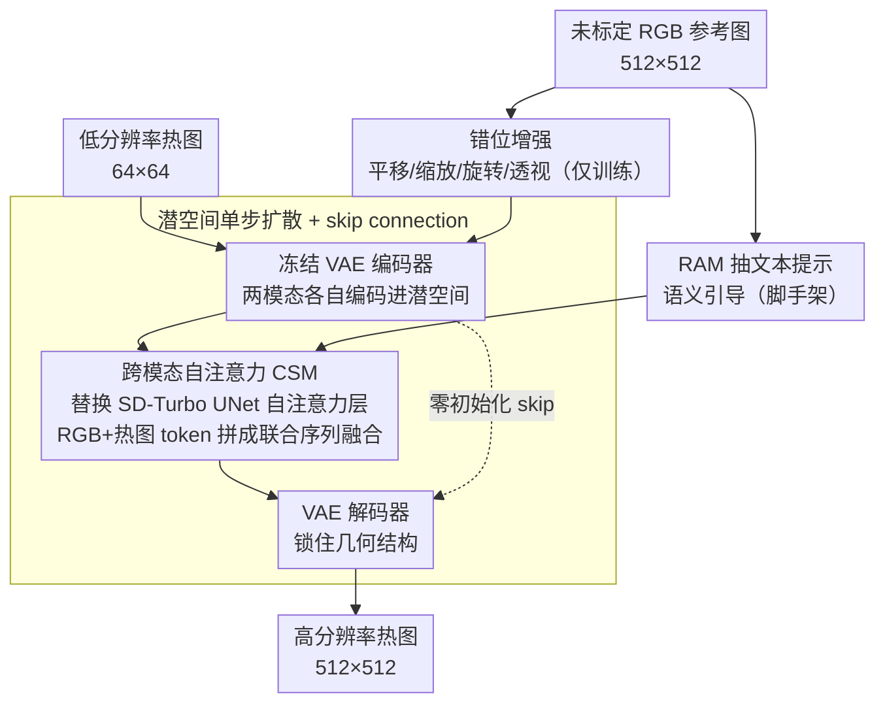

# 3M-TI: High-Quality Mobile Thermal Imaging via Calibration-free Multi-Camera Cross-Modal Diffusion

**会议**: CVPR 2026  
**arXiv**: [2511.19117](https://arxiv.org/abs/2511.19117)  
**代码**: [GitHub](https://github.com/work-submit/3MTI)  
**领域**: 图像分割  
**关键词**: 热成像超分辨率, 跨模态扩散, 无标定融合, RGB引导, 移动端热成像

## 一句话总结

提出 3M-TI，一个**无需标定**的多相机跨模态扩散框架，通过在 VAE 潜空间中用跨模态自注意力（CSM）自动对齐并融合未标定的 RGB-热红外图像对，结合错位增强策略，在移动端热成像超分辨率任务上达到 SOTA，并显著提升下游目标检测与语义分割性能。

## 研究背景与动机

**移动热成像的硬件瓶颈**：移动平台热传感器因小型化导致孔径缩小、像素尺寸受限，输出图像模糊且信息不足（典型分辨率仅 96×96）。

**单图超分的信息不足**：单幅热图像缺少足够的高频信息来恢复精细结构，尤其在大放大倍数下效果欠佳。

**RGB 引导方法依赖标定**：现有 RGB 引导的热图像 SR 方法需要精确的像素级跨相机标定，实际部署中标定过程繁琐且缺乏鲁棒性。

**跨模态域差异大**：RGB 与热红外成像原理根本不同，直接合并特征容易引入不真实的纹理细节。

**热红外数据集规模有限**：相比 RGB 领域，热红外数据集规模小、场景多样性不足，限制了网络训练和泛化。

**实际场景中的时空错位**：多相机系统在实际使用中不可避免地存在视差和时间不同步问题，现有方法对此缺乏鲁棒性。

## 方法详解

### 整体框架

3M-TI 想解决的是一个很实际的问题：移动端热相机拍出来的图模糊（典型只有 96×96），单张图又没有足够高频信息能恢复细节，而拉一张高清 RGB 来引导又躲不开像素级标定这个工程麻烦。它的做法是把"对齐"这件事甩给网络自己学——整条流程都跑在潜空间里。输入是低分辨率热图（64×64）和一张**未标定**的高分辨率 RGB 参考图（512×512），先用冻结的 VAE 编码器把两者各自压进潜空间；接着在 SD-Turbo 的 UNet 里，把原本的自注意力层换成跨模态自注意力（CSM），让 RGB 和热图的 token 在同一个序列里互相对齐、融合；训练阶段对 RGB 故意施加错位增强，逼模型适应真实多相机的视差与不同步；同时加一条零初始化的 skip connection 把编码器结构信息直送解码器，再用 RAM 从 RGB 抽出文本提示给一点语义引导。最后只用 LoRA 微调 UNet（rank=16）和 VAE 解码器（rank=4），单步扩散一次出图。

### 关键设计

**1. 跨模态自注意力 CSM：不靠标定，让两个模态在潜空间里自己找对应**

RGB 引导热成像 SR 的老路子都得先做精确的像素级跨相机标定，部署时既繁琐又脆。3M-TI 的关键转念是把对齐做成注意力里的隐式操作：把 RGB 和热图的潜变量 token 拼成一条联合序列 $\{z_{RGB}, z_{th}\} \in \mathbb{R}^{B \times (M \times H \times W) \times C}$，再让自注意力在这条序列上一次性算两种依赖——模态内的 thermal-thermal（保住热图自身的空间上下文）和模态间的 RGB-thermal（从 RGB 借结构）。和只看模态间、丢掉模态内空间上下文的标准 Cross-Attention 比，CSM 两种关系一起建模；和"特征拼接 + FC"那种静态投影比，它是内容自适应的，对哪块该借、借多少由注意力权重动态决定，而且整套不引入额外参数。这个把多帧塞进同一序列做联合自注意力的思路，直接借自视频/多视角扩散模型。

**2. 错位增强：用人工几何扰动，逼模型学会无标定下的对齐**

现有 RGB-热红外数据集几乎都是严格像素对齐的，直接训出来的模型会过拟合某一种标定配置，一换真实设备就垮。3M-TI 不去做复杂物理仿真，而是在训练时直接对 RGB 参考图施加可控的平移、缩放、旋转和透视畸变，人工制造出实际多相机里因视差和时间不同步带来的几何偏移。这样一来 CSM 被迫在"两张图本来就对不齐"的前提下学跨模态对应，训练分布和真实部署环境的 gap 就被这层增强补上了——消融里去掉它，MUSIQ 从 36.66 掉到 34.94，高频细节明显退化。

**3. 潜空间单步扩散 + skip connection：既补出高频，又不把几何拧坏**

热红外数据本来就少，纯 CNN/Transformer 在严重退化下只会输出过度平滑的结果；而扩散模型的生成先验能凭空合成逼真的高频细节，恰好补这个缺口，所以 3M-TI 用 SD-Turbo 在潜空间做单步扩散来出图。但扩散在补细节的同时也可能把几何结构带偏（圆形车轮被生成歪），于是再加一条零初始化的 skip connection，把 VAE 编码器的特征图直接传给解码器锁住结构一致性。两者互补：扩散负责"长出"细节，skip connection 负责"框住"形状。消融显示去掉 skip connection 后 PSNR 从 30.09 降到 29.86，车轮等几何形状确实开始失真。

### 损失函数与训练策略

训练目标是像素级 L2 损失加感知损失 LPIPS：$\mathcal{L} = \mathcal{L}_2 + \lambda \cdot \mathcal{L}_{\text{LPIPS}}$，其中 $\lambda = 1$。优化器用 Adam，学习率 $2 \times 10^{-5}$，batch size = 4，单卡 A800（80GB）跑 8000 iterations 约 4 小时。微调只动 LoRA（UNet rank=16、VAE decoder rank=4）。训练数据为 10,922 对 RGB-热红外图像，汇自 IRVI、LLVIP、M3FD、PBVS 2025 四个数据集。

## 实验关键数据

**表1：公开数据集定量对比**

| 方法 | PSNR↑ | SSIM↑ | LPIPS↓ | MANIQA↑ | MUSIQ↑ |
|------|-------|-------|--------|---------|--------|
| CoReFusion | 30.11 | 0.8588 | 0.3214 | 0.2771 | 28.35 |
| CoRPLE | 30.47 | 0.8642 | 0.3206 | 0.2833 | 30.46 |
| SwinFuSR | 29.85 | 0.8549 | 0.3085 | 0.2740 | 29.86 |
| SeeSR | 29.41 | 0.8495 | 0.1828 | 0.4278 | 35.22 |
| OSEDiff | 28.05 | 0.8422 | 0.2113 | 0.4014 | 36.30 |
| DifIISR | 27.48 | 0.7905 | 0.3484 | 0.4214 | 36.74 |
| **3M-TI (Ours)** | **30.09** | **0.8610** | **0.1787** | **0.4443** | **36.66** |

3M-TI 在感知指标（LPIPS、MANIQA、MUSIQ）上全面最优，同时在保真度指标（PSNR、SSIM）上优于其他扩散方法。

**表2：下游目标检测性能对比**

| 方法 | Precision↑ | Recall↑ | F1↑ | IoU↑ |
|------|-----------|---------|-----|------|
| SwinPaste | 0.1800 | 0.2109 | 0.1765 | 0.1941 |
| SeeSR | 0.3832 | 0.4637 | 0.3849 | 0.3022 |
| **3M-TI** | **0.4565** | **0.5455** | **0.4724** | **0.3427** |
| Reference RGB | 0.4322 | 0.5708 | 0.4643 | 0.3359 |
| GT Thermal | 0.4582 | 0.5793 | 0.4887 | 0.3494 |

3M-TI 的检测性能甚至略超 RGB 参考图，接近 GT 热图像水平。

**消融实验关键结论**

- 去掉 RGB 参考：重建模糊，LPIPS 从 0.1787 恶化到 0.2106。
- 去掉错位增强：MUSIQ 从 36.66 降至 34.94，高频细节退化明显。
- 去掉 Skip Connection：结构保真度下降（PSNR 从 30.09 降至 29.86），圆形车轮等几何形状失真。
- CSM 优于标准 Cross-Attn（LPIPS 0.1787 vs 0.1953）和特征拼接（0.1787 vs 0.2164）。

## 亮点与洞察

1. **无需标定的跨模态融合**是本文最核心的实用价值——在 VAE 潜空间中通过注意力机制实现隐式对齐，彻底规避了实际部署中的标定难题。
2. **CSM 的设计简洁有效**：不引入额外参数，仅通过 token 拼接+自注意力就同时捕获模态内外依赖，是对视频扩散模型多帧处理思路的巧妙迁移。
3. **错位增强策略**思路新颖，用简单的几何变换代替复杂的物理仿真，有效提升泛化能力。
4. **下游任务验证充分**：不仅做感知质量评估，还验证了对目标检测和语义分割的实质性提升，证明超分的实用价值。
5. **实际硬件验证**：使用不到 100 美元的 HIKVISION P09 热相机模块 + 小米 15 手机搭建真实系统，工程可行性强。

## 局限性

1. **单步扩散的质量上限**：基于 SD-Turbo 的单步推理虽然高效，但生成质量可能不及多步扩散方法。
2. **语义引导依赖 RAM**：对 RGB 输入质量有要求，低光、运动模糊等退化的 RGB 参考图可能导致错误语义提示。
3. **FOV 差异处理不充分**：RGB 和热相机的视场角不同（74°×59° vs 50°×50°），当 FOV 差异更大时鲁棒性待验证。
4. **仅验证 8× 超分（64→512）**：对于不同放大倍数的适用性缺少讨论。
5. **测试时的推理开销未充分讨论**：UNet 中的跨模态自注意力序列长度为 $2HW$，在高分辨率场景下的计算复杂度需要关注。

## 相关工作与启发

- **CoReFusion / SwinFuSR / SwinPaste**：传统 RGB 引导热图像 SR 方法，依赖标定且保真度优先，缺少高频细节。
- **SeeSR / OSEDiff**：基于扩散的图像 SR，能生成高频内容但缺乏跨模态引导，容易引入 artifact。
- **DifIISR**：红外专用扩散 SR，但依赖严格对齐数据。
- **Stable Video Diffusion**：多帧联合自注意力的思路是 CSM 的直接灵感来源。
- **启发**：无标定跨模态融合的思路可推广到其他模态对（如深度-RGB、SAR-光学），错位增强策略具有通用性。

## 评分

- **新颖性**: ⭐⭐⭐⭐ — CSM 和错位增强策略新颖，无标定设定有实际意义
- **实验充分度**: ⭐⭐⭐⭐ — 公开数据集+真实手机系统+下游任务+消融，覆盖面广
- **写作质量**: ⭐⭐⭐⭐ — 结构清晰，动机阐述充分，图表丰富
- **实用价值**: ⭐⭐⭐⭐⭐ — 无标定+低成本硬件+移动端部署，工程实用性极强

<!-- RELATED:START -->

## 相关论文

- [\[CVPR 2026\] Towards High-Quality Image Segmentation: Improving Topology Accuracy by Penalizing Neighbor Pixels](towards_high-quality_image_segmentation_improving_topology_accuracy_by_penalizin.md)
- [\[CVPR 2026\] Making Training-Free Diffusion Segmentors Scale with the Generative Power](making_training-free_diffusion_segmentors_scale_with_the_generative_power.md)
- [\[CVPR 2025\] The Devil is in Temporal Token: High Quality Video Reasoning Segmentation](../../CVPR2025/segmentation/the_devil_is_in_temporal_token_high_quality_video_reasoning_segmentation.md)
- [\[ICLR 2026\] Universal Multi-Domain Translation via Diffusion Routers](../../ICLR2026/segmentation/universal_multi-domain_translation_via_diffusion_routers.md)
- [\[CVPR 2026\] From 2D Alignment to 3D Plausibility: Unifying Heterogeneous 2D Priors and Penetration-Free Diffusion for Occlusion-Robust Two-Hand Reconstruction](from_2d_alignment_to_3d_plausibility_unifying_heterogeneous_2d_priors_and_penetr.md)

<!-- RELATED:END -->
