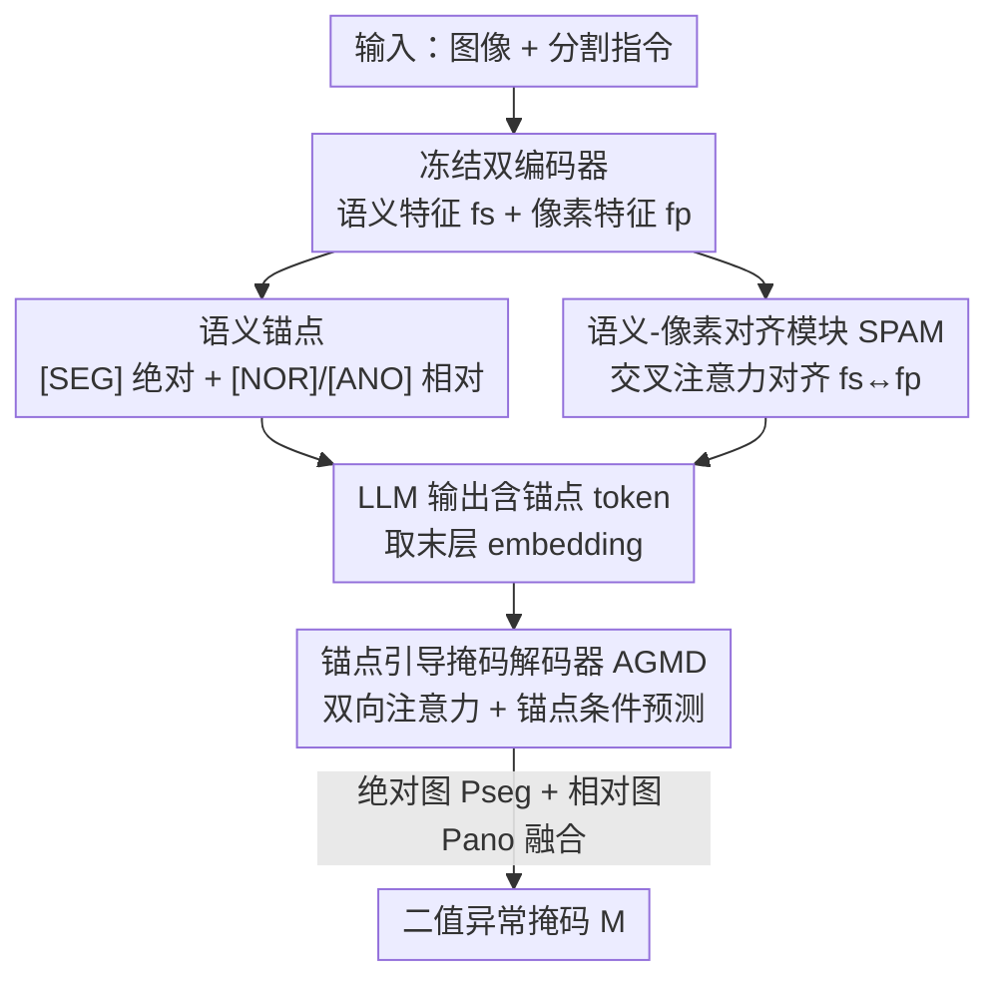

# AG-VAS: Anchor-Guided Zero-Shot Visual Anomaly Segmentation with Large Multimodal Models

**会议**: CVPR 2026  
**论文**: [CVF Open Access](https://openaccess.thecvf.com/content/CVPR2026/html/Qu_AG-VAS_Anchor-Guided_Zero-Shot_Visual_Anomaly_Segmentation_with_Large_Multimodal_Models_CVPR_2026_paper.html)  
**代码**: https://github.com/xiaozhen228/AG-VAS  
**领域**: 多模态VLM / 异常分割  
**关键词**: 零样本异常分割, 大多模态模型, 语义锚点, 指令分割, 工业/医学缺陷

## 一句话总结
AG-VAS 给大多模态模型（LMM）的词表里塞进三个可学习的"语义锚点"token——绝对锚点 `[SEG]` 把抽象的"异常"翻译成"洞/划痕"这样的具体视觉实体，相对锚点 `[NOR]`/`[ANO]` 建模正常 vs 异常的上下文对比——再配合语义-像素对齐模块（SPAM）和锚点引导掩码解码器（AGMD），让模型在未见类别上直接吐出二值异常掩码，在 6 个工业/医学基准上零样本刷到 SOTA。

## 研究背景与动机

**领域现状**：零样本视觉异常分割（ZSAS）要在没见过的类别上、不重训的情况下直接圈出缺陷区域，这在数据稀缺、隐私敏感的工业质检和医学影像里特别有用。主流做法基本都建在 CLIP 上（AnomalyCLIP、Bayes-PFL 等），构造"正常态/异常态"文本提示，和 patch 级图像 embedding 做对齐来定位异常。

**现有痛点**：CLIP 路线碰到了两堵墙。一是 CLIP 本身的表征和理解能力有限，ZSAS 性能已经见顶；二是它天然不产生二值掩码，得靠启发式阈值或经验调参才能二值化，部署起来很别扭。最近也有人上 LMM（如 Anomaly-OV），但它们大多停留在图像级的文字描述/异常分类，像素级的二值掩码输出几乎没人碰。

**核心矛盾**：把 LMM 直接拿来做分割（如 LISA 的 embedding-as-mask 范式）在工业/医学异常上经常翻车，甚至把前景背景搞反。作者归因于两点：① "异常/缺陷"是高度抽象的概念，没有像"苹果"那样稳定的视觉原型——它可能是洞、可能是划痕，很难从文字描述映射到具体视觉实体；② 分割器的像素级特征和 LMM 的视觉-文本 embedding 空间没对齐好，导致定位不准。

**本文目标**：做一个端到端、建在预训练 LMM 上的 ZSAS 框架，能听懂复杂的分割指令，并直接输出二值掩码。

**切入角度**：作者借鉴人类质检员的两条互补推理路径——一是靠先验世界知识知道"缺陷长啥样、通常出现在哪"（洞、裂纹、划痕），二是把候选区域和周围正常区域做对比找不一致。把这两条路径分别落到两类可学习锚点上。

**核心 idea**：扩展 LMM 词表，引入绝对语义锚点 `[SEG]`（注入缺陷外观/结构/位置的世界知识）和相对语义锚点 `[NOR]`/`[ANO]`（建模正常-异常的跨类别上下文对比），用这三个 token 当 LMM 与分割器之间的语义桥梁，实现指令驱动的异常分割。

## 方法详解

### 整体框架

AG-VAS 是一个锚点引导的端到端管线：输入一张图 $x_{img}$ 和一条文本指令 $x_{txt}$，输出二值异常掩码 $M$。整条链路由四块拼成——冻结的语义图像编码器 $\mathcal{F}_s$（siglip）和像素图像编码器 $\mathcal{F}_p$（SAM-ViT-H）、一个 LLM（默认 LLaVA-OneVision-7B，LoRA 微调）、语义-像素对齐模块 SPAM、轻量的锚点引导掩码解码器 AGMD。

流程是这样转的：两个冻结编码器分别抽语义特征 $f_s$ 和像素特征 $f_p$；SPAM 用交叉注意力把二者对齐成 $f_{align}$，连同文本 embedding 一起喂进 LLM；LLM 的回答里会带上 `[NOR][ANO][SEG]` 三个锚点 token，取它们最后一层的 embedding 过一个 Token Refiner 投到解码器空间；AGMD 拿这些锚点 embedding 加可学习 query，与像素特征 $f_p$ 做双向交叉注意力，最后由绝对锚点产前景概率图、相对锚点产正常-异常对比图，融合后阈值化得到掩码。推理时支持隐式模式（直接分割）和显式模式（先描述后分割 / 先分割后解释），两者用同一套锚点表征，只差要不要把推理过程显式说出来。

### 关键设计

**1. 语义锚点：把抽象的"异常"锚成可分割的视觉实体**

这一招直接打在"异常没有稳定视觉原型"这个痛点上。作者在 LMM 词表里新增三个特殊 token，让它们在训练中学到 task-specific 的 embedding（区别于普通 prompt tuning）。绝对锚点 `[SEG]` 是"绝对语义参照"，把"异常"这种抽象语义翻译成显式、空间落地的视觉实体——它编码了缺陷外观、结构、位置的世界知识与上下文线索（比如"上方一个小洞"）。相对锚点 `[NOR]`/`[ANO]` 是"相对参照"，不直接说异常长啥样，而是建模跨类别下"正常 pattern vs 异常 pattern"的对比关系，对应质检员"和周围正常区域比"的那条推理。三个 token 被插进文本序列里，LLM 回答时按 `[NOR][ANO][SEG]` 的顺序吐出来。这种"用锚点 token 当语义桥梁"的设计，比 CLIP 那种固定文本提示更灵活，也让模型能在隐式（直接 `Sure, it is [NOR][ANO][SEG].`）和显式（先描述缺陷再 `[NOR][ANO][SEG]`）两种模式间切换。

**2. 语义-像素对齐模块 SPAM：跨模态把高层语义贴回像素**

锚点解决了"异常是什么"，但 LMM 的高层语义 embedding 空间和像素编码器的低层视觉特征之间隔着一道沟，锚点没法直接对上空间上连贯的视觉线索——这正是 LISA 类方法定位不准的第二个原因。SPAM 的做法是先把两路特征线性映射到同维：$f_s = \mathrm{Linear}_s(\mathcal{F}_s(x_{img}))$，$f_p = \mathrm{Linear}_p(\mathcal{F}_p(x_{img}))$，再用多头交叉注意力（MHCA）让语义特征当 query 去 attend 像素特征：

$$f_{align} = \mathrm{MHCA}(\mathbf{Q}=f_s,\ \mathbf{K}=f_p,\ \mathbf{V}=f_p)$$

得到的对齐 embedding $f_{align}$ 和语义图像 embedding $f_s$、文本 embedding $f_{txt}$ 拼在一起送进 LLM：$\hat{y}_{txt} = \mathcal{F}_{LLM}(\mathrm{Concat}(f_s, f_{align}, f_{txt}))$。这样锚点 token 在 LLM 输出空间里学到的表征，已经携带了像素级的空间信息，为后面精确分割打底。

**3. 锚点引导掩码解码器 AGMD：绝对图 + 相对图融合出掩码**

光有对齐还不够，得把锚点语义真正解码成像素级掩码。AGMD 先把 LLM 末层取出的锚点 embedding 经 Token Refiner（两层线性）精炼成 $h_{nor}, h_{ano}, h_{seg}$，再拼上三个可学习 query token 组成解码器输入 $\mathbf{Z}_0 = [t_{nor}, t_{ano}, t_{seg}, h_{nor}, h_{ano}, h_{seg}]$。$\mathbf{Z}_0$ 和像素 embedding $f_p$ 过 $L$ 层双向交叉注意力（沿用 SAM 的设计），互相迭代更新得到 $\mathbf{Z}_L, f_p'$。然后兵分两路：绝对锚点 `[SEG]` 经 sigmoid 产前景概率图 $P_{seg} = \sigma(t'_{seg} f_p'^{\top})$；相对锚点 `[NOR]/[ANO]` 用对比 softmax 产正常-异常概率图 $[P_{nor}, P_{ano}] = \mathrm{Softmax}([t'_{nor}, t'_{ano}] f_p'^{\top})$。最后把绝对图和相对图等权融合：

$$P = \alpha \cdot P_{seg} + (1-\alpha) \cdot P_{ano},\quad \alpha = 0.5$$

在 0.5 阈值二值化得到 $M$。绝对锚点给"异常实体在哪"的直接定位，相对锚点给"和正常比哪里不对"的对比判据，两者互补降低了误分割风险——这也是为什么模型在正常图上能输出空掩码（拒识）。

**4. Anomaly-Instruct20K：给锚点喂结构化的缺陷世界知识**

锚点要学到精确语义，得有对应监督。作者用科学多模态大模型 Inter-S1-241B 自动构建了 Anomaly-Instruct20K，数据源自 Real-IAD、GoodsAD、DTD-Synthetic。和 Anomaly-Instruct-125K 这类只给 QA 标注的数据集不同，它把缺陷知识组织成五个结构化字段：**Expectation**（物体理想正常态）、**Observation**（具体视觉偏差：位置/形状/尺寸/纹理）、**Diagnosis**（为什么这些偏差破坏了正常一致性）、**Summary**（转成简洁分割指令，显式编码空间与外观属性、落到 `[NOR][ANO][SEG]`）、**Explanation**（综合成连贯推理段落）。生成时给模型三种视觉输入：带 bbox 的原图、叠 GT 掩码的原图、一张正常参考图。训练时从模板库采样，动态融合出四类指令：Direct Segmentation、Describe-then-Segment、Describe-then-Segment-Plus、Segment-then-Explain。这套结构化描述正是把"洞/划痕长啥样、在哪"的世界知识注入锚点的关键。

### 损失函数 / 训练策略

训练有两个互补目标。① **文本自回归损失**：对包括锚点在内的所有 target token 用标准交叉熵 $\mathcal{L}_{txt} = -\frac{1}{T_y}\sum_{t=1}^{T_y}\log P(y_t \mid y_{<t}, x_{img}, x_{txt})$。② **分割损失**：对 AGMD 预测的掩码统一用 BCE + Dice，$\mathcal{L}_{seg} = \sum_{c}\big(\lambda_{bce}\mathrm{BCE}(P_c, M_c) + \lambda_{dic}\mathrm{Dice}(P_c, M_c)\big)$，其中 $c \in \{SEG, NOR, ANO\}$；相对正常锚点 `[NOR]` 的 GT 是异常掩码的补集，$\lambda_{bce}=0.5$、$\lambda_{dic}=2.0$。总目标 $\mathcal{L} = \mathcal{L}_{txt} + \mathcal{L}_{seg}$。训练采用多任务联合学习：通用物体分割（ADE20K 等，沿用 LISA）+ 异常分割（Anomaly-Instruct20K + 从已有工业数据集随机取 20k 的 Anomaly-Seg20K）+ VQA（LLaVA-150K、WebAD）保留对话能力。LLM 用 LoRA（rank 16）微调，AdamW lr 0.0003，全局 batch 80，7B 模型在 4×A100(40G) 上约 30 小时。

## 实验关键数据

### 主实验

6 个基准（工业：MVTec-AD、KSDD2、RSDD；医学：ISIC、ColonDB、ClinicDB），指标为像素级 (AP, F1-Max, IoU_ano)。默认 backbone 为 LLaVA-OneVision-7B。下表节选关键对比（`*` 表示在 AG-VAS 同款异常数据上重训）：

| 方法 | Base | MVTec-AD (AP/F1/IoU) | ColonDB (AP/F1/IoU) | ClinicDB (AP/F1/IoU) |
|------|------|------|------|------|
| Bayes-PFL* (CLIP路线) | ViT-L-14 | 50.3 / 50.4 / 29.9 | 30.5 / 38.1 / 27.7 | 47.6 / 50.7 / 34.4 |
| LISA* | LLaVA-OneVision-7B | 41.0 / 44.1 / 32.3 | 67.2 / 62.9 / 43.8 | 81.0 / 74.1 / 59.8 |
| **AG-VAS** | LLaVA-OneVision-7B | **51.0 / 52.7 / 44.8** | **70.7 / 66.2 / 58.2** | **86.6 / 79.2 / 69.5** |

AG-VAS 在每个数据集每个指标上都领先。值得注意的是 CLIP 路线（Bayes-PFL）的 AP/F1 还过得去，但 **IoU_ano 明显偏低**——说明它二值化后定位很模糊；AG-VAS 在真正衡量分割精度的 IoU_ano 上拉开差距（MVTec 44.8 vs 32.3）。训练里没放任何医学图，AG-VAS 仍在医学集上零样本领先，说明 LMM 的世界知识确实能跨域泛化。

**正常样本拒识能力**（MVTec-AD，IoU_nor = 预测空掩码记 1 否则 0）：

| 方法 | Base | IoU_ano | IoU_nor | Average |
|------|------|---------|---------|---------|
| LISA | LLaVA-OneVision-7B | 32.2 | 4.0 | 18.1 |
| LISA* | LLaVA-OneVision-7B | 32.3 | 80.9 | 56.6 |
| **AG-VAS** | LLaVA-OneVision-7B | **44.8** | **87.7** | **66.3** |

即便用户明确指令"分割异常"，AG-VAS 在正常图上仍能拒识（IoU_nor 87.7%），大幅降低过分割风险——这正是相对锚点 `[NOR]/[ANO]` 的功劳。

### 消融实验

模块与训练数据消融（MVTec-AD）：

| 配置 | AP | F1-Max | IoU_nor | IoU_ano | 说明 |
|------|----|--------|---------|---------|------|
| 完整 AG-VAS | 51.0 | 52.7 | 87.7 | 44.8 | — |
| w/o `[SEG]` | 49.1 | 50.9 | 85.6 | 42.1 | 去绝对锚点，全指标下滑 |
| w/o `[NOR][ANO]` | 47.2 | 49.7 | **52.1** | 39.5 | 去相对锚点，IoU_nor 暴跌 35.6 |
| w/o SPAM | 46.5 | 48.0 | 70.6 | 41.4 | 去对齐，AP 掉 4.5 |
| w/o Anomaly-Instruct20K | 48.4 | 50.0 | 85.2 | 39.9 | 缺世界知识注入 |
| w/o Anomaly-Seg20K | 49.3 | 51.5 | **53.5** | 42.4 | IoU_nor 大跌，正常-异常对比变弱 |
| w/o General Segmentation | **36.1** | **36.5** | 70.2 | **34.9** | 掉最多，多域联合训练最关键 |

推理模式消融：Describe-then-Segment-Plus（在指令前补一句物体正常态描述、当专家先验）拿到描述类模式里最好结果（AP 51.9 / IoU_nor 90.2 / IoU_ano 45.1）；Describe-then-Segment、Segment-then-Explain 因中间文本引入噪声会略降分割精度，但换来更好的指令跟随和交互推理能力。

### 关键发现
- **通用分割数据贡献最大**：去掉它 AP 从 51.0 暴跌到 36.1，证明多域联合训练对"把绝对锚点对齐到视觉特征"是必需的，而不只是异常数据多就够。
- **相对锚点 = 拒识能力的命门**：去 `[NOR][ANO]` 或去 Anomaly-Seg20K，IoU_nor 都直接腰斩到 52~53，说明正常-异常对比是模型敢在正常图上输出空掩码的根本。
- **CLIP vs LMM 路线**：CLIP 法 AP 不差但 IoU_ano 弱，AG-VAS 强在二值化后的真实定位精度；LMM 路线在医学未见域上零样本泛化更好。

## 亮点与洞察
- **把"异常"token 化是很妙的抽象**：异常没有像"苹果"那样的稳定原型，作者干脆造三个可学习 token 当语义锚，让模型自己学出"洞/划痕"的视觉锚定——这个"绝对+相对"双锚设计可迁移到任何"目标概念抽象、缺乏固定视觉原型"的分割任务（如医学病灶、遥感变化检测）。
- **拒识被当成一等公民**：定义 IoU_nor 把"在正常图上输出空掩码"纳入评测，并用相对锚点专门优化它——这是实际部署里最容易被忽略却最致命的能力（过分割等于误报）。
- **结构化指令数据（Expectation→Observation→Diagnosis→Summary→Explanation）**：用强 MM 模型 + 三视觉输入（bbox/GT/正常参考）自动生成的五字段标注，本质是把质检推理链显式化喂给锚点，这套数据构造思路本身可复用。

## 局限与展望
- 强依赖一个 241B 的科学多模态模型（Inter-S1）自动标注 Anomaly-Instruct20K，标注质量和可复现性受该闭源/大模型制约 ⚠️。
- 描述类推理模式（Describe-then-Segment 等）会因中间文本噪声略降分割精度，"可解释/交互" 与 "纯精度" 之间存在 trade-off，未在所有模式下都比直接分割更好。
- 评测仍在 6 个基准、像素级指标上，对多缺陷共存、极小缺陷、跨域分布偏移更极端的场景鲁棒性未充分验证；融合权重 $\alpha=0.5$ 固定，是否对所有域最优存疑 ⚠️。

## 相关工作与启发
- **vs LISA**：同样走 embedding-as-mask（LLM + SAM 分割器），但 LISA 用单一 `[SEG]` token 做通用物体分割，搬到异常上常误定位甚至前景背景颠倒；AG-VAS 用绝对+相对三锚点 + SPAM 对齐 + AGMD 融合，专门补上"异常抽象"和"语义-像素不对齐"两个坑，IoU_ano/IoU_nor 全面反超。
- **vs AnomalyCLIP / Bayes-PFL（CLIP 提示学习）**：它们靠学正常/异常文本提示对齐 patch 特征，受 CLIP 表征上限制约且不直接产二值掩码；AG-VAS 用 LMM 的世界知识 + 直接输出掩码，AP 相近但真实定位 IoU_ano 明显更高，且能跨工业→医学零样本泛化。
- **vs Anomaly-OV（LMM 异常理解）**：Anomaly-OV 等聚焦图像级异常描述/分类，停在文字层；AG-VAS 把 LMM 推到像素级二值分割，并保留对话/指令跟随，更贴近真实质检部署。

## 评分
- 新颖性: ⭐⭐⭐⭐⭐ 把抽象异常 token 化为"绝对+相对"双锚点、首个直接输出二值掩码的 LMM-based ZSAS 框架，切入角度新。
- 实验充分度: ⭐⭐⭐⭐ 6 个工业/医学基准 + 拒识 + 模块/数据/推理模式三类消融，扎实；但 backbone 与超参敏感性、极端场景覆盖有限。
- 写作质量: ⭐⭐⭐⭐ 动机-方法-消融逻辑清晰，锚点设计讲得透；部分实现细节甩到 Appendix。
- 价值: ⭐⭐⭐⭐⭐ 直接产二值掩码 + 强拒识 + 跨域泛化，工业/医学零样本异常分割的实用方案。

<!-- RELATED:START -->

## 相关论文

- [\[CVPR 2026\] Metric-Guided Feature Fusion of Visual Foundation Models for Segmentation Tasks](metric-guided_feature_fusion_of_visual_foundation_models_for_segmentation_tasks.md)
- [\[CVPR 2026\] DSS: Discover, Segment, and Select for Zero-shot Camouflaged Object Segmentation](discover_segment_and_select_a_progressive_mechanism_for_zero-shot_camouflaged_ob.md)
- [\[NeurIPS 2025\] PARTONOMY: Large Multimodal Models with Part-Level Visual Understanding](../../NeurIPS2025/segmentation/partonomy_large_multimodal_models_with_part-level_visual_understanding.md)
- [\[CVPR 2026\] SGMA: Semantic-Guided Modality-Aware Segmentation for Remote Sensing with Incomplete Multimodal Data](sgma_semantic-guided_modality-aware_segmentation_for_remote_sensing_with_incompl.md)
- [\[CVPR 2026\] MV3DIS: Multi-View Mask Matching via 3D Guides for Zero-Shot 3D Instance Segmentation](mv3dis_multi-view_mask_matching_via_3d_guides_for_zero-shot_3d_instance_segmenta.md)

<!-- RELATED:END -->
