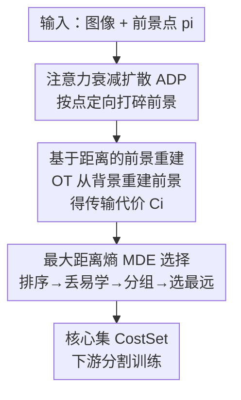

# Annotation-Efficient Coreset Selection for Context-dependent Segmentation

**会议**: CVPR 2026  
**论文**: [CVF Open Access](https://openaccess.thecvf.com/content/CVPR2026/html/Zhang_Annotation-Efficient_Coreset_Selection_for_Context-dependent_Segmentation_CVPR_2026_paper.html)  
**代码**: 无  
**领域**: 语义分割 / 数据剪枝  
**关键词**: 核心集选择, 上下文相关分割, 最优传输, 弱标注, 数据剪枝

## 一句话总结
针对伪装目标、医学病灶等"上下文相关"分割任务标注极贵的问题，本文用基于点标注的最优传输给每张图打"重要性分"，再用最大距离熵策略挑出兼顾覆盖与多样的核心集（CostSet），在 40% 剪枝率下相对全量训练仅掉约 1% IoU。

## 研究背景与动机
**领域现状**：上下文相关（Context-Dependent, CD）任务——伪装目标检测、医学病灶分割、遥感分析、阴影/透明物检测等——的前景边界没有固定语义，必须靠周围环境动态判定。这类任务目前主流靠 Spider、EVF 等强模型在**像素级标注**的大数据集上训练。

**现有痛点**：弱监督在 CD 场景效果差，于是方法被迫依赖像素级标签，而 CD 图像（如伪装、医学）单张标注耗时约 10 分钟，成本极高。更糟的是数据集里样本贡献严重不均：前景背景一眼可分的"低垂果实"在训练早期就被快速拟合，对模型识别复杂目标几乎没帮助，却照样占用标注与训练资源。

**核心矛盾**：标注成本高 × 样本冗余——既要少标，又要把宝贵的标注预算花在真正有用的样本上。而"有用与否"在 CD 任务里恰恰由前景-背景关系决定，无法用现有基于分类 logits 的剪枝准则（Entropy / Forgetting / EL2N / CCS）很好刻画。

**切入角度**：作者用 Spider 在多个 CD 数据集上观察到一条规律（图 1）：前景背景差异大的样本拟合快但泛化增益小，差异微妙的样本拟合慢却能持续提升判别力。于是把"前景-背景分布差异"直接当作样本重要性的度量信号。

**核心 idea**：用一套"破坏前景—从背景重建前景"的最优传输流程量化前背景差异，差异越大（传输代价越高）说明样本越简单越没价值；再用最大距离熵在保证多样性的前提下挑核心集——全程只需**点标注**而非像素掩码。

## 方法详解

### 整体框架
方法把"CD 数据集核心集选择"拆成两步：**样本评估**和**核心集选择**。输入是图像 $x_i$ 及其前景点标注 $p_i$，输出是一个小而精的子集 CostSet。流程是：先用注意力衰减扩散过程（ADP）按点把每张图的前景"打碎"成噪声图；再用一个重建网络在最优传输框架下"从背景把前景重建回来"，重建越费劲说明前背景差异越小、样本越难越有价值，由此算出每个样本的传输代价 $C_i$ 作为重要性分；最后用最大距离熵（MDE）策略，把样本按代价排序、丢掉最易学的、分成 $k$ 组后在每组内挑空间距离最大的样本，得到兼顾覆盖与多样的核心集。

### 关键设计

**1. 注意力衰减扩散过程（ADP）：只用一个点就定向破坏前景**

要量化前背景差异，第一步得先把前景"扰动掉"看模型能否从背景恢复。难点是只有点标注、没有掩码，怎么精准只扰前景、不毁背景。ADP 借鉴扩散模型的加噪思路，但**仅围绕给定点做衰减式加噪**：对点 $p=(m,n)$，先算每个像素到点的 $\ell_2$ 距离矩阵 $M_d(x,y)=\lVert(x,y)-(m,n)\rVert_2$，再构造衰减矩阵

$$M_a(x,y)=\exp\!\left(-\frac{\alpha\cdot M_d(x,y)^2}{r(t)}\right),\qquad x_t(x,y)=x_{t-1}(x,y)+M_a(x,y)\cdot\epsilon_t(x,y),$$

其中噪声方差 $\gamma(t)$ 随时间衰减、影响半径 $r(t)$ 随时间收缩，$\alpha$ 控制衰减速率。复杂目标用更密的点覆盖前景。为了"扰够前景又不毁背景"，ADP 设了自适应停止：动态阈值 $\Delta=1$，每步用 Wasserstein 距离 $D_W$ 衡量当前噪声前景与首步前景的分布差异，按 $\Delta\leftarrow\Delta-(1-\exp(-D_W))$ 衰减，$\Delta<0$ 时停；同时设最大步数上限 $T=9$ 防止背景被过度污染。相比对整图无差别加噪，ADP 把"破坏"精确锁在前景，这正是后面用重建难度反推前背景差异的前提。

**2. 基于距离的前景重建：用最优传输把"重建难度"变成重要性分**

有了噪声图，按最优传输理论可以"从背景分布把前景重建回来"，重建后图与原图差多少就反映前背景差异多大。但标准 Wasserstein 距离计算量随图像尺寸指数膨胀，训练吃不消。本文改用**平均投影 1D Wasserstein 距离**做近似：把高维分布随机投影到若干一维子空间再平均。具体地，采样 $Q$ 个满足 $z_i\sim\mathcal N(0,I),\ \lVert z_i\rVert=1$ 的随机投影向量，把重建分布 $\mu$ 与真值分布 $\nu$ 投到一维得 $\tilde\mu_i=\mu_i\cdot z_i,\ \tilde\nu_i=\nu_i\cdot z_i$，排序后逐点求差：

$$L_{\text{avgW1}}(\tilde\mu_i,\tilde\nu_i)=\frac1P\sum_{n=1}^{P}\bigl|\tilde\mu_i^{\text{sorted}}(n)-\tilde\nu_i^{\text{sorted}}(n)\bigr|.$$

重建网络（UNet）以此为目标训练后，每个样本的传输代价 $C_i=W_\tau(x_r^i,x^i)$ 就是它的重要性分，由此得到的核心集即 CostSet。关键直觉是：**代价高 ⇒ 前背景差异大 ⇒ 样本简单 ⇒ 贡献低**；代价低 ⇒ 前背景纠缠、难学、信息量大。这把"标注成本"问题转成了"无标注前提下用重建难度自动评估样本"的问题。

**3. 最大距离熵（MDE）选择：在丢掉低垂果实后保多样性**

光按代价分挑样本不够好：如果高贡献样本恰好是一段序列里的多张相似帧，核心集就会丧失多样性。MDE（算法 1）先把样本按传输代价 $C_i$ 排序，用丢弃比 $b$ 去掉一批最易学（最该被剔除）的样本以免污染模型，再把剩余样本切成 $k$ 组以覆盖整个样本空间；每组内做"最大距离熵"选择：维护一个默认距离向量 $v_d$，反复计算候选样本与 $v_d$ 的 Wasserstein 距离 $W_\tau(v_d,R_{i,j})$，每次把**距离最大**的样本加入候选集 $R_c$ 并更新 $v_d=\frac{1}{|R_c|}\sum_m r_m$，直到取够 $\lceil\hat r\cdot n/k\rceil$ 个。这里 Wasserstein 距离的大小反映样本间空间差异，即所选核心集的信息熵水平——既在每组内拉开多样性，又靠分组保证全局覆盖。⚠️ 丢弃方向（升序丢首段还是丢易学高代价样本）以原文算法 1 为准，作者表述的意图是剔除"最易学"的样本。

### 损失函数 / 训练策略
重建阶段用 UNet + Adam，学习率 $1\times10^{-4}$ 线性衰减到 $1\times10^{-6}$，训 100 epoch；ADP 中 $T=9$，投影维度 $P=384$，分组数 $k=5$。下游验证用 UNet（ResNet50 ImageNet 预训练 backbone）训 64 epoch，损失为交叉熵 + IoU 之和；为公平评估剪枝策略**不做数据增强**。

## 实验关键数据

在 6 个 CD 任务上验证：SOD、COD、MIS、RSIS、TOD、SD，统一用 UNet 做分割、IoU 为指标，剪枝率从 80% 到 10%。

### 主实验

下表取 40% 剪枝率，对比本文（仅点标注 P）与次优方法、以及全量训练（p=0）：

| 任务（全量 IoU） | 本文 Ours (P) | TFDP (F, 次优) | 与全量差距 |
|------------------|--------------|----------------|-----------|
| SOD (74.8) | **73.4** | 70.9 | −1.4 |
| COD (55.1) | **52.0** | 50.6 | −3.1 |
| MIS (54.8) | **53.8** | 52.3 | −1.0 |
| RSIS (58.9) | **57.7** | 54.2 | −1.2 |
| TOD (84.0) | **82.0** | 78.7 | −2.0 |
| SD (72.5) | **71.8** | 70.3 | −0.7 |

关键趋势：剪枝率越高优势越大，以 SOD 为例，与对手的差距从 10% 剪枝时约 0.5% 扩大到 80% 剪枝时约 4%；且本文只用点标注（F=像素标注、P=点标注），却全面超过需要像素标注的对手。

### 消融实验

**ADP 框架下不同选择策略 vs GT 上界（SOD，IoU%）：**

| 策略 | 80% | 60% | 40% | 20% | 10% |
|------|-----|-----|-----|-----|-----|
| ADP(C) + TopK | 64.4 | 70.0 | 73.1 | 74.1 | 74.9 |
| ADP(C) + TailK | 63.1 | 68.3 | 72.6 | 73.6 | 74.4 |
| **ADP(C) + MDE** | 66.2 | 71.3 | 73.4 | 74.0 | 74.8 |
| GT(C_gt) + Random | 66.4 | 71.6 | 73.2 | 74.2 | 74.4 |
| GT(C_gt) + MDE（上界） | 66.9 | 71.9 | 74.1 | 74.3 | 75.0 |

**同一传输代价 C 排序下 MDE vs 其他选择策略（SOD，IoU%）：**

| 策略 | 80% | 60% | 40% | 20% | 10% |
|------|-----|-----|-----|-----|-----|
| Entropy | 61.7 | 68.0 | 71.1 | 72.4 | 73.5 |
| EL2N | 63.9 | 67.3 | 71.7 | 72.8 | 73.8 |
| CCS | 64.3 | 65.8 | 72.0 | 72.8 | 73.5 |
| TFDP | 62.9 | 68.0 | 71.6 | 73.5 | 74.2 |
| **MDE** | **66.2** | **71.3** | **73.4** | **74.0** | **74.8** |

**标注效率（SOD）：** 点标注约 2s/张，远低于框（≈6s）和涂鸦（≈7s）；前景覆盖 $F_c$=75.7%、背景误扰 $B_c$=8.3%，背景污染最低。

### 关键发现
- **仅点标注就逼近 GT 上界**：ADP+MDE 用点标注得到的 66.2%–74.8% 紧贴 GT+MDE 上界 66.9%–75.0%，证明传输代价能在无掩码下有效评估样本。
- **多样性机制不可省**：MDE 比只取尾部的 TailK 在 80% 剪枝时高出 3.1%，说明分组 + 最大距离选择带来的多样性是关键。
- **噪声样本会拖累泛化**：GT+MDE 在 10% 剪枝时（75.0%）反超全量训练（74.8%），印证"剔除低垂果实"与课程学习直觉一致。
- **丢弃比按任务调**：简单任务（SOD）适合更高丢弃比（0.15），含大量相似图的 MIS 也偏好高丢弃比，COD/RSIS/TOD 等较难任务 0.1 更优。
- **失效场景**：透明物（TOD，镜面反射外物）和遥感（RSIS）前背景纠缠极强，ADP 难以覆盖，提升相对最小。

## 亮点与洞察
- **把"标注贵"转译成"重建难度"**：用最优传输的传输代价当样本重要性分，绕开了 CD 任务弱监督效果差、又必须看前背景关系的死结，是很巧的问题转化。
- **ADP 只需点标注还能定向扰前景**：衰减矩阵 + 自适应停止把噪声精确锁在前景，2s/张的标注成本对动辄 10 分钟/张的 CD 任务是数量级的节省。
- **平均投影 1D Wasserstein 是可复用 trick**：把指数复杂度的 Wasserstein 用随机一维投影 + 排序求差近似，任何需要在图像分布上算 OT 代价的任务都能借用。
- **代价-贡献的反直觉关系**：传输代价高=样本简单=贡献低，这条经验规律本身就是一个可迁移到其他数据剪枝场景的洞察。

## 局限与展望
- 作者承认：在前背景高度纠缠/杂乱的场景（TOD、RSIS）ADP 难以很好破坏前景，提升有限。
- 选择流程看似复杂（ADP + 重建网络 + MDE 三段串行），训练重建网络本身也有额外开销，论文未充分讨论这部分时间成本与端到端简化空间。
- ⚠️ 算法 1 中丢弃比 $b$ 的丢弃方向与"丢最易学样本"的文字表述需对照原文核实；且丢弃比需按任务人工调，缺乏自适应选取机制。
- 仅在 UNet+ResNet50 上验证，是否在更强分割骨干/SAM 类模型上同样有效未知。

## 相关工作与启发
- **vs 分类型剪枝（Entropy / Forgetting / EL2N / CCS）**：它们靠模型 logits 打分，本文为适配 CD 任务把每图分数定义为预测像素的平均 logit；而本文直接从前背景分布差异打分，更贴合 CD 概念的本质，且只需点标注。
- **vs TFDP**：TFDP 在实例分割剪枝上高效，被本文改造来做 CD 分割并作为最强对手；本文在多数剪枝率上超过它，差距主要来自 TFDP 未充分考虑样本多样性覆盖（表 4 中 60%/80% 高剪枝率下 TFDP 提升最小）。
- **vs 主动学习**：本文属"弱标注下的核心集选择"，但用点标注少标、又一次性选出训练子集，兼具两个范式的价值，搭起了核心集选择与主动学习之间的桥梁。

## 评分
- 新颖性: ⭐⭐⭐⭐⭐ 首个针对上下文相关任务的核心集选择，且把 OT 重建难度作为重要性分的思路新颖。
- 实验充分度: ⭐⭐⭐⭐ 覆盖 6 个 CD 任务 + 多剪枝率 + 标注方式/丢弃比/选择策略多组消融，但仅单一分割骨干。
- 写作质量: ⭐⭐⭐⭐ 动机观察（图 1）讲得清楚，方法符号略多但公式完整；丢弃方向表述稍有歧义。
- 价值: ⭐⭐⭐⭐ 对标注极贵的 CD 任务有实打实的降本意义，40% 剪枝仅掉 1% IoU。

<!-- RELATED:START -->

## 相关论文

- [\[ICML 2026\] Refining Context-Entangled Content Segmentation via Curriculum Selection and Anti-Curriculum Promotion](../../ICML2026/segmentation/refining_context-entangled_content_segmentation_via_curriculum_selection_and_ant.md)
- [\[CVPR 2026\] INSID3: Training-Free In-Context Segmentation with DINOv3](insid3_training-free_in-context_segmentation_with_dinov3.md)
- [\[CVPR 2026\] LEMMA: Laplacian Pyramids for Efficient Marine Semantic Segmentation](lemma_laplacian_pyramids_for_efficient_marine_semantic_segmentation.md)
- [\[CVPR 2026\] Towards Context-Aware Image Anonymization with Multi-Agent Reasoning](towards_context-aware_image_anonymization_with_multi-agent_reasoning.md)
- [\[CVPR 2026\] Efficient Video Object Segmentation and Tracking with Recurrent Dynamic Submodel](efficient_video_object_segmentation_and_tracking_with_recurrent_dynamic_submodel.md)

<!-- RELATED:END -->
