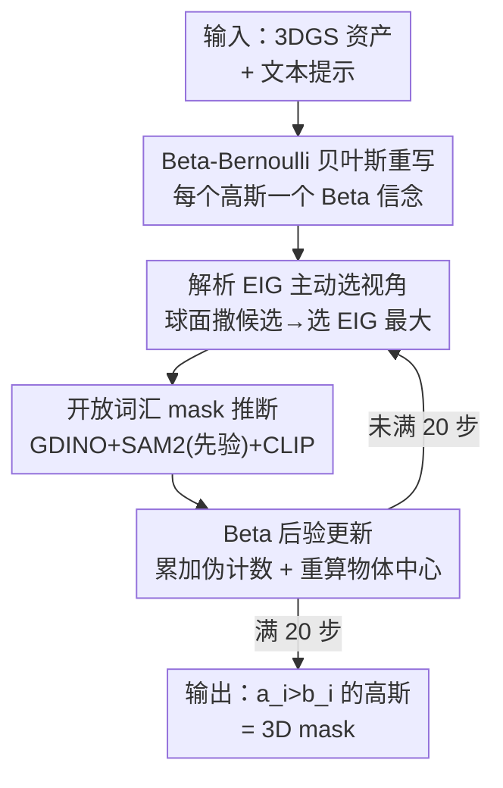

# B³-Seg: Camera-Free, Training-Free 3DGS Segmentation via Analytic EIG and Beta-Bernoulli Bayesian Updates

**会议**: CVPR 2026  
**论文**: [CVF Open Access](https://openaccess.thecvf.com/content/CVPR2026/html/Kamata_B3-Seg_Camera-Free_Training-Free_3DGS_Segmentation_via_Analytic_EIG_and_Beta-Bernoulli_CVPR_2026_paper.html)  
**代码**: 未公开（论文未给出仓库链接）  
**领域**: 3D视觉 / 语义分割  
**关键词**: 3DGS分割, 贝叶斯更新, 主动视角选择, 期望信息增益, 开放词汇  

## 一句话总结
B³-Seg 把"在一份现成 3DGS 资产上分割指定物体"这件事重写成一串 Beta-Bernoulli 贝叶斯更新，并用解析形式的期望信息增益（EIG）主动挑下一个最有信息量的相机视角，做到无相机轨迹、无训练、开放词汇、几秒出结果，精度可逼近耗时几十分钟的监督方法。

## 研究背景与动机

**领域现状**：影视和游戏生产里越来越常见的场景是——团队之间只共享一份已经重建好的 3DGS 资产（一堆高斯球），然后要在它上面做交互式编辑：选中、删除、替换某个物体。这需要 3DGS 语义分割能力。当前主流开放词汇 3DGS 分割（LERF、Gaussian Grouping、OpenGaussian、ObjectGS 等）精度很高。

**现有痛点**：这些高精度方法几乎都假设你能拿到**预定义的相机视角 / 重建图像、真值语义 mask、或要 per-scene 重新优化**。LERF 要 45 分钟、ObjectGS 要约 50 分钟，迭代动辄 3 万步。即便是号称"几秒级"的 FlashSplat、COB-GS，也仍然假设有重建视角和语义 mask，而且没有任何理论保证。可现实里你手上只有一份孤零零的 3DGS 文件，没有相机轨迹也没有标注，还要求低延迟。

**核心矛盾**：精度依赖"大量视角 + 标注 + 长时间优化"，而交互编辑要求"无相机、无训练、几秒返回"——两者直接冲突。要么慢而准，要么快但仍要外部条件。

**本文目标**：在 camera-free（不给相机轨迹）、training-free（不重训）、open-vocabulary（文本指定物体）三重约束下，几秒内得到一个准确的 3D mask。

**切入角度**：作者发现 FlashSplat 那套"比较 mask 内外可见响应、谁大归谁"的硬判决，其实正好是一个对称 Beta 先验下的贝叶斯 MAP 决策。既然分割本质是在估计每个高斯属于目标的概率，那就该用概率框架来做——而概率框架天然能回答"下一个看哪个视角最划算"。

**核心 idea**：把 3DGS 分割重写为逐视角的 Beta-Bernoulli 贝叶斯后验更新，并用**解析 EIG**（不必真跑分割就能估出每个候选视角的信息增益）来贪心选视角，从而在固定 20 视角预算内高效收敛，且有 $(1-1/e)$ 近似最优的理论保证。

## 方法详解

### 整体框架

B³-Seg 的输入是一份现成 3DGS 场景 $G=\{g_i\}$（每个高斯有均值 $\mu_i$、协方差、不透明度 $\omega_i$、颜色 $c_i$）外加一句用户文本（如 "stuffed bear"），输出是属于该物体的高斯子集（即 3D mask）。整条流程是一个"主动选视角 → 看一眼 → 更新信念"的闭环，迭代固定 $T=20$ 步。

具体地，先给每个高斯放一个 Beta 先验 $\text{Beta}(a_{\text{init}},b_{\text{init}})$，从场景自带的一个 canonical 视角（数据集里第一个相机位姿，不算额外监督）拿到初始 mask 并做一次更新，由此估出物体中心 $c_{\text{obj}}$ 与半径 $r_{\text{obj}}$。之后每一轮：在以 $c_{\text{obj}}$ 为心的球面上均匀撒 $N_{\text{cand}}=20$ 个候选相机，对每个候选只渲染一次、用**解析 EIG** 算它能带来多少信息增益，挑 EIG 最大的视角 $v^*$；在 $v^*$ 上跑开放词汇分割模块得到 2D mask，把 mask 转成每个高斯的成功/失败伪计数，做 Beta 后验更新；再用更新后的前景高斯重算 $c_{\text{obj}},r_{\text{obj}}$。20 步后，所有满足 $a_i>b_i$ 的高斯即为最终 3D mask。

### 关键设计

**1. Beta-Bernoulli 贝叶斯重写：把硬判决换成可累积的概率信念**

痛点是 FlashSplat 那类方法把"高斯 $g_i$ 是否属于目标"当成一次性线性规划/硬判决，既不支持增量地一视角一视角累积证据，也无法量化"我现在对哪些高斯还不确定"。作者给每个高斯的归属变量 $y_i\in\{0,1\}$ 放一个 Beta-Bernoulli 共轭模型：$y_i\mid p_i\sim\text{Bernoulli}(p_i),\ p_i\sim\text{Beta}(a_i,b_i)$。给定某视角渲染图 $I(v)$ 与物体 mask $M(v)$，把每个像素的"可见责任"$\omega_i T_i$（其中透射率 $T_i=\prod_{j<i}(1-\omega_j)$）按落在 mask 内/外累加成成功/失败伪计数：

$$e_{i,1}(v)=\sum_{(j,k)\in I(v)}\omega_i T_i\,\mathbb{1}[M_{j,k}(v)=1],\quad e_{i,0}(v)=\sum_{(j,k)\in I(v)}\omega_i T_i\,\mathbb{1}[M_{j,k}(v)=0]$$

由共轭性，后验更新就是简单加法 $\text{Beta}(a_i,b_i)\to\text{Beta}(a_i+e_{i,1},b_i+e_{i,0})$，多视角后 $p_i\sim\text{Beta}(a_{\text{init}}+\sum_v e_{i,1},\,b_{\text{init}}+\sum_v e_{i,0})$。妙处在于：当 $a_{\text{init}}=b_{\text{init}}$ 时后验均值是 $a_i/(a_i+b_i)$，此对称情形下的 MAP 判决 $y_i=\arg\max_n\sum_v e_{i,n}(v)$ **恰好等价于 FlashSplat 的判决规则**——也就是说本文不是另起炉灶，而是把已被验证有效的硬判决纳为自己框架的一个特例，同时额外获得了"不确定性可度量、证据可增量累加"的能力，为后面主动选视角铺路。

**2. 解析 EIG 主动选视角：不跑分割就估出"下一眼看哪最值"**

有了概率框架，"该看哪个候选视角"就能用信息增益来回答：视角 $v$ 的信息增益是更新前后总熵的下降，$IG(v)=\sum_i\{H(\text{Beta}(a_i,b_i))-H(\text{Beta}(a_i+e_{i,1},b_i+e_{i,0}))\}$（Beta 熵有解析式）。但痛点是算 $IG(v)$ 需要真实 mask $M(v)$，意味着每个候选都得跑一遍昂贵的 SAM2，$N_{\text{cand}}$ 个候选就是 $N_{\text{cand}}$ 次分割，完全不可接受。

作者的关键技巧是用**期望信息增益 EIG** 绕开 mask：候选视角只渲染一次拿到每个高斯的可见责任 $\varepsilon_i=\sum_{(j,k)\in I(v)}\omega_i T_i$，再用当前 Beta 均值 $m_i=a_i/(a_i+b_i)$ 当作"该高斯落在 mask 内的概率"，把伪计数近似为 $\tilde e_{i,1}=m_i\varepsilon_i,\ \tilde e_{i,0}=(1-m_i)\varepsilon_i$，于是

$$\text{EIG}(v)=\sum_i\{H(\text{Beta}(a_i,b_i))-H(\text{Beta}(a_i+\tilde e_{i,1},\,b_i+\tilde e_{i,0}))\},\quad v^*=\arg\max_v \text{EIG}(v)$$

这样评估候选视角只需轻量渲染 + 熵计算，把每候选一次 SAM2 推断省掉了——运行时拆解里 mask 推断占 9.76s/12.1s，正是被 EIG 避开的大头。作者还实测 EIG 与真实 IG 强相关（$r=0.964$），说明这个解析代理是可靠的排序依据。直觉上，物体更大、遮挡更少的视角 EIG 更高，正是该优先去看的"高信息"视角。

**3. 开放词汇 mask 推断：带后验先验引导的 GDINO+SAM2+CLIP 三段式**

被选中的视角 $v^*$ 需要一张可靠的 2D mask 来更新信念，痛点是裸跑分割容易在杂乱场景里漂移到干扰物。作者用一个三阶段轻量模块：① **Grounding DINO** 按文本提示生成候选框 $\{B_k\}$；② **SAM2** 对每个框出 mask，且把当前 Beta 均值渲染成的软先验图 $R_{\text{soft}}(v^*)=\sum_i m_i\omega_i T_i$ 经 logit 变换 $R=\log\frac{R_{\text{soft}}}{1-R_{\text{soft}}}$ 作为 SAM2 的 mask 输入，用"上一轮积累的后验"提示 SAM2 该往哪聚焦，保证跨视角一致、抑制漂移；③ **CLIP 重排**：每个候选 mask 抠图后用 CLIP 对用户文本打分，取最高分的作为该视角最终 mask。三段配合保证 mask 干净，再回灌给设计 1 做 Beta 更新。

**4. 理论保证：贪心选视角的 $(1-1/e)$ 近似**

这不是工程模块而是把上面流程"为什么 work"讲透的关键。作者证明 EIG 满足两条性质：**自适应单调性**（Beta 熵在 $\alpha_i=a_i+b_i\ge 2$ 时不增，每个视角加的伪计数非负，故期望 EIG $\ge 0$，多看一眼总不会增加不确定性）与**自适应子模性**（看得越多，同一视角的边际熵下降越小，即收益递减）。由这两条加上 Golovin & Krause 的自适应子模优化定理，贪心地每步选 $\arg\max_v \text{EIG}(v\mid S)$ 得到的总信息增益满足 $\mathbb{E}[\text{EIG}(S_k^{\text{greedy}})]\ge(1-1/e)\max_\pi \mathbb{E}[\text{EIG}(S_k^\pi)]$，即逼近最优视角选择策略的 $(1-1/e)\approx 63\%$。这把"贪心选视角"从启发式升级成有保证的近似算法。

### 损失函数 / 训练策略

本方法 training-free，没有任何可训练参数与损失。超参固定为 $T=20$ 次迭代、$N_{\text{cand}}=20$ 候选、$a_{\text{init}}=b_{\text{init}}=1$（保证 $\alpha_i\ge 2$ 使单调性成立）；候选球半径 $r_{\text{sphere}}=1.5\,r_{\text{obj}}/\tan(\text{fov}/2)$。全部在单张 RTX A6000 上端到端几秒完成。

## 实验关键数据

数据集：LERF-Mask（按 Gaussian Grouping 协议）与 3D-OVS（按 ObjectGS 协议）。基线分两类：需重建视角/标注的高精监督法（不可直接比），以及同为采样式免训练的 FlashSplat 两个变体——Uniform-Sphere（球面随机选，无相机先验无 EIG）和 Recon-Cam（从重建相机里随机选），两者都套同一分割管线以隔离"选视角策略"的影响。

### 主实验

LERF-Mask（mIoU/mBIoU，越高越好；time 为端到端延迟）：

| 方法 | figurines | ramen | teatime | mean | 视角/标注 | 时间 |
|------|-----------|-------|---------|------|-----------|------|
| Gaussian Grouping | 69.7/67.9 | 77.0/68.8 | 71.7/66.1 | 72.8/67.6 | GT | 37 min |
| ObjectGS | 88.2/89.0 | 88.0/79.9 | 88.9/88.6 | 88.4/85.8 | GT | ~50 min |
| FlashSplat (Uniform-Sphere) | 60.2/57.5 | 68.4/61.5 | 80.4/76.3 | 69.6/65.1 | 采样 | 10.2 s |
| FlashSplat (Recon-Cam) | 71.6/69.1 | 71.4/66.3 | 86.6/83.9 | 76.5/73.1 | 采样 | 10.1 s |
| **B³-Seg (本文)** | **88.3/85.4** | 75.3/69.7 | 89.8/88.0 | **84.5/81.0** | 采样 | 12.1 s |

在同为采样式的对比块里，B³-Seg 的 mean mIoU 84.5 明显高于 Uniform-Sphere 的 69.6 和 Recon-Cam 的 76.5，且在 12 秒内完成；与耗时约 50 分钟的监督 SOTA ObjectGS（88.4）已相当接近。

3D-OVS（mIoU%，4 个场景）：

| 方法 | Bed | Bench | Sofa | Lawn | 约束 |
|------|-----|-------|------|------|------|
| ObjectGS | 98.0 | 96.4 | 97.2 | 95.4 | 需视角/标注 |
| FlashSplat (Uniform-Sphere) | 91.7 | 86.9 | 90.2 | 91.9 | camera-free |
| FlashSplat (Recon-Cam) | 94.3 | 90.3 | 85.7 | 96.3 | camera-free |
| **B³-Seg (本文)** | **97.1** | **92.2** | **94.1** | **96.8** | camera-free |

在免训练对比块里 B³-Seg 全面领先两个 FlashSplat 变体，且逼近需标注的监督方法。

### 消融实验

LERF-Mask 上验证 CLIP 重排与 SAM2 先验输入：

| CLIP 重排 | SAM2 mask 输入 | mIoU | mBIoU | Δ vs Base |
|-----------|----------------|------|-------|-----------|
| ✗ | ✗ | 74.9 | 70.2 | – |
| ✓ | ✗ | 81.5 | 76.6 | +6.6/+6.4 |
| ✓ | ✓ | 84.5 | 81.0 | +9.6/+10.8 |

两者叠加共提升 +9.6 mIoU：CLIP 滤掉不一致候选、SAM2 先验稳住跨视角 mask，二者与 EIG 选视角互补。

运行时拆解（20 视角端到端 12.1s）：mask 推断 9.76s（大头）、视角选择 2.11s、Beta 更新 0.12s、其他 0.12s——印证 EIG 把"每候选一次分割"省掉的价值。

### 关键发现
- **EIG 是可靠代理**：解析 EIG 与真实 IG 相关系数 $r=0.964$，证明用它排序候选视角不会带偏。
- **参数早饱和**：$N_{\text{cand}}$ 从 5→20 时 mIoU 76.2→84.5，30 时仅 84.6；$T$ 从 5→20 时 79.8→84.5，30 时 84.8。说明 20/20 的轻量设置已够，不必加预算。
- **对初始条件鲁棒**：把初始物体中心 $c_{\text{obj}}$ 沿随机方向偏移 50% $r_{\text{obj}}$，mIoU 仅掉 1.6%（84.5→82.9）；偏 100% 也只掉 3.8%。EIG 主动选视角能很快补偿糟糕的初始猜测。

## 亮点与洞察
- **把已验证的硬判决"收编"为概率特例**：先证明 FlashSplat 的判决等于对称 Beta 下的 MAP，再以此为地基扩出不确定性度量和主动采样——既不冒险推翻已知有效的东西，又自然长出新能力，是很聪明的"站在巨人肩上"。
- **EIG 用后验均值近似伪计数，绕开最贵的一步**：把"算信息增益要先有 mask"的鸡生蛋问题，用 $m_i\varepsilon_i$ 的期望近似化解，使评估候选只需一次轻量渲染，这是几秒级延迟的真正来源。
- **理论不是装饰**：自适应单调+子模 → $(1-1/e)$ 保证，让贪心选视角有了最优性下界；且作者把单调性所需的 $\alpha_i\ge2$ 直接落到 $a_{\text{init}}=b_{\text{init}}=1$ 的初始化上，理论与实现自洽。
- **可迁移点**：这套"Beta 伪计数 + 解析 EIG 主动采样"范式可直接搬到任何"渲染一次能拿到可见性、但拿标签很贵"的 3D 主动感知任务（主动重建、NBV 规划）。

## 局限与展望
- 作者承认：实验集中在物体中心化场景；扩到大型室内/室外扫描可能需要更广的视角探索（如 RRT 采样、多尺度候选），不过这些都兼容现有解析 EIG。
- 当前概率模型只处理二值前景/背景；真实应用常涉及多物体多类别，作者指出可自然推广到 Dirichlet-Categorical 模型，但本文未实现。
- ⚠️ 我的观察：mask 推断占了 80% 运行时且强依赖 Grounding DINO+SAM2+CLIP 的现成质量，若开放词汇定位失败（罕见类、模糊提示），整条贝叶斯累积都会被带偏，论文未讨论这类失败模式。
- ⚠️ EIG 近似把"高斯落在 mask 内的概率"等同于后验均值 $m_i$，在信念尚未收敛的早期迭代可能偏差较大，论文用强相关性整体验证但未拆早期/晚期。

## 相关工作与启发
- **vs FlashSplat / COB-GS**：同为几秒级采样法，但它们仍假设有重建视角和语义 mask、且无理论保证；本文 camera-free + training-free，并把 FlashSplat 判决证明为自己的 MAP 特例，额外给出 $(1-1/e)$ 保证。
- **vs Gaussian Grouping / OpenGaussian / ObjectGS**：这些靠多视角监督 + per-scene 优化拿到高精度，但要几十分钟、要相机轨迹/标注；本文以约 4 点 mIoU 的差距换来从约 50 分钟到 12 秒、且无需任何外部条件。
- **vs FisherRF / ActiveGS / ActiveSGM 等主动视角法**：它们多面向重建或需反传训练、固定类别；本文是解析 EIG 驱动、免训练、开放词汇，把主动视角选择与贝叶斯分割统一在一个有保证的框架里。

## 评分
- 新颖性: ⭐⭐⭐⭐⭐ 把 3DGS 分割重写为 Beta-Bernoulli 贝叶斯并用解析 EIG 主动选视角，且证明等价收编了 FlashSplat，框架优雅。
- 实验充分度: ⭐⭐⭐⭐ 两数据集 + 消融 + 敏感性 + 鲁棒性 + EIG 代理验证齐全，但仅二值物体中心化场景，缺多物体/大场景验证。
- 写作质量: ⭐⭐⭐⭐⭐ 动机—方法—理论—实验逻辑紧凑，公式与算法清晰，图示直观。
- 价值: ⭐⭐⭐⭐⭐ 直击"只有一份 3DGS 资产、要交互编辑"的真实生产痛点，几秒级且有理论保证，落地性强。

<!-- RELATED:START -->

## 相关论文

- [\[CVPR 2026\] INSID3: Training-Free In-Context Segmentation with DINOv3](insid3_training-free_in-context_segmentation_with_dinov3.md)
- [\[CVPR 2026\] The Power of Prior: Training-Free Open-Vocabulary Semantic Segmentation with LLaVA](the_power_of_prior_training-free_open-vocabulary_semantic_segmentation_with_llav.md)
- [\[CVPR 2026\] Making Training-Free Diffusion Segmentors Scale with the Generative Power](making_training-free_diffusion_segmentors_scale_with_the_generative_power.md)
- [\[CVPR 2026\] PEARL: Geometry Aligns Semantics for Training-Free Open-Vocabulary Semantic Segmentation](pearl_geometry_aligns_semantics_for_training-free_open-vocabulary_semantic_segme.md)
- [\[CVPR 2026\] Direct Segmentation without Logits Optimization for Training-Free Open-Vocabulary Semantic Segmentation](direct_segmentation_without_logits_optimization_for_training-free_open-vocabular.md)

<!-- RELATED:END -->
