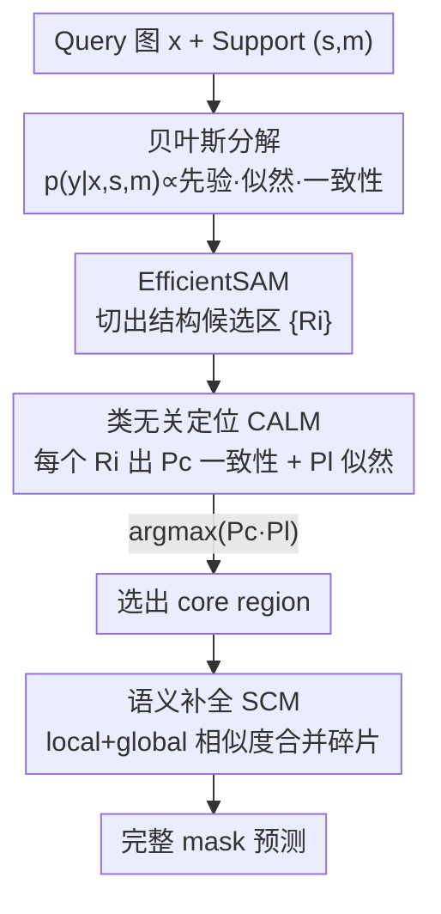

# Bayesian Decomposition and Semantic Completion for Few-shot Semantic Segmentation

**会议**: CVPR 2026  
**论文**: [CVF Open Access](https://openaccess.thecvf.com/content/CVPR2026/html/Shi_Bayesian_Decomposition_and_Semantic_Completion_for_Few-shot_Semantic_Segmentation_CVPR_2026_paper.html)  
**代码**: 无  
**领域**: 小样本语义分割  
**关键词**: 小样本语义分割, 贝叶斯分解, SAM, 类别无关定位, 语义补全

## 一句话总结
把小样本语义分割（FSS）按贝叶斯公式拆成「先验 + 似然 + 类一致性」三个轻量概率项，用 SAM 出结构化候选区、用一个二分类小网络（CALM）同时估似然与一致性、再用注意力补全模块（SCM）把碎片候选拼成完整 mask，在 PASCAL-5$^i$ / COCO-20$^i$ 上做到 SOTA 且高效。

## 研究背景与动机
**领域现状**：FSS 要在只有几张标注样本（support）的情况下分割 query 图里的新类。主流做法分两派：一派是 metric-based，从 support 抽类原型（class prototype），再和 query 特征算相似度来分割；另一派近年借助预训练大模型（扩散模型、MLLM），用它们的丰富先验生成类感知提示或增强特征。

**现有痛点**：metric-based 方法严重依赖「把类原型建准」，但在几张样本的低数据条件下，原型本身就估不准，appearance 变化一大就崩。大模型派虽然先验更丰富，却带来巨大的计算开销，且最终效果仍被「类表示质量」卡住。

**核心矛盾**：两派都绕不开「显式地、精确地建模某个新类的语义表示」这件事——而这恰恰是低数据下最难保证的。一旦类原型/类表示不准，下游分割直接受拖累。

**本文目标**：能不能不直接建类原型、也不做精确的逐像素分割，就把 FSS 干好？

**切入角度**：作者注意到 FSS 的目标其实是条件概率 $p(y|x,s,m)$，而它可以用贝叶斯定理因式分解成几个「语义上更轻」的子项；每个子项都不需要精确分割或显式类原型，只需要判断「结构区域」和「语义是否一致」这种弱信号。

**核心 idea**：用贝叶斯分解把 FSS 重写成「结构先验 × 似然 × 类一致性」三项，从而把一个困难的密集分割问题，转化成一个简单的二分类问题（query 候选区和 support 是不是同一类），再补全成完整 mask。

## 方法详解

### 整体框架
BPNet 的核心是「先按结构切碎，再按语义挑出+补全」。给定 query 图 $x$ 和带掩码的 support $(s,m)$，流程分三步：① 用轻量 EfficientSAM 把 query 切成一堆类无关的候选区 $\{R_i\}$（提供结构先验 $p(y|x)$，边界精准但不带类语义）；② 每个候选区连同 support 一起喂进类无关定位模块 CALM，同时得到「类一致性概率」$P^c_i$ 和「似然概率」$P^l_i$，按联合概率挑出得分最高的那块作为 core region；③ 因为 SAM 切出来的区域往往语义不完整（一辆车被切成车窗、轮胎好几块），再用语义补全模块 SCM 把和 core region 语义一致的碎片合并进来，输出完整 mask。

整套方法不需要建类原型、也不要精确分割标注，训练只用二分类标签，所以又快又稳。

### 关键设计

**1. 贝叶斯分解：把密集分割改写成三个轻量概率项**

针对「必须精确建类原型」这个根本痛点，作者直接从概率定义动手。FSS 目标是 $p(y|x,s,m)$，假设 support $(s,m)$ 与 query $(x,y)$ 独立，按贝叶斯定理展开并对分子因式分解：

$$p(y|x,s,m) = \frac{p(y|x)\cdot p(m|s,x,y)\cdot p(s|x,y)}{p(s,m|x)}$$

略去与 $y$ 无关的归一化常数 $p(s|x)$，得到可优化的正比形式：

$$p(y|x,s,m) \propto p(y|x)\cdot p(m|s,x,y)\cdot p(s|x,y)$$

三项各司其职：**先验** $p(y|x)$ 是只看结构、不看类语义的 query 分区（正好契合「训练前不知道新类」的设定，由 SAM 实现）；**似然** $p(m|s,x,y)$ 是「在 query 假设下能否解释 support 掩码 $m$」，只需粗略定位、不要精确分割；**类一致性** $p(s|x,y)$ 是判断 query 区域和 support 语义是否对齐，不需要预测具体类别 ID。这样每一项都不依赖精确分割或显式类原型，从源头上缓解了低数据过拟合——这是全文的理论地基。

**2. CALM 类无关定位模块：一个二分类网络同时估似然与一致性**

似然项和一致性项如果各建一套网络，开销大；作者用一个轻量二分类网络 CALM 把两者一并搞定。给定 query 区域 $R_i$ 和 support $s$，先用预训练 ResNet-18 抽特征图 $F_q, F_s$。对 $R_i$，把它的 mask 与 $F_q$ 逐元素相乘得到区域特征，全局平均池化后与 support 特征向量拼接，过 MLP+sigmoid 输出「是否同类」的概率，这就是**类一致性** $P^c_i$：

$$P^c_i = \sigma\big(\mathrm{MLP}(\mathrm{Vec}(R_i\otimes F_q)\oplus \mathrm{Vec}(F_s))\big)$$

巧妙之处在似然项的估计：把 $P^c_i$ 当监督信号反传，拿到对 support 特征图 $F_s$ 的梯度，按 LayerCAM 生成类激活图 CAM——它高亮 support 里与当前 query 区域语义最相关的部位。把 CAM 二值化后与 support 真值掩码 $m$ 算 IoU，就近似出**似然** $P^l_i$：

$$P^l_i = \mathrm{IoU}\big(\mathrm{Binarize}(\mathrm{CAM}(F_s, P^c_i)),\, m\big)$$

最后按联合概率选 core region：$R_{core} = \arg\max_{R_i}(P^l_i\cdot P^c_i)$。整个 CALM 只用二分类标签训练，省掉了精确分割标注，既降训练成本又提升泛化。$k$-shot 时只需对每个候选区在 $k$ 张 support 上分别算 $P^l_{(i,j)}\cdot P^c_{(i,j)}$ 再求平均即可扩展。

**3. SCM 语义补全模块：用局部+全局相似度把碎片拼成完整目标**

SAM 切出的候选区结构准但语义碎（同一物体被切成多块），只挑一块 core region 会漏。SCM 通过比较每个候选区和 core region 的语义关系，把同属一个物体的碎片召回来。它算两种相似度：**局部相似度**直接用余弦相似度衡量候选区特征 $V_i$ 与 core 特征 $V_{core}$ 的接近程度，$sim^{local}_i = \cos(V_i, V_{core})$；但局部相似度看不到「车窗和轮胎纹理差很大却同属一辆车」这种远距离语义关联。

为此引入**全局相似度**：先用 cross-attention 让候选区特征 $V_i$ 与 query 全局特征 $V_q$ 交互，得到上下文特征 $V^{context}_i = \mathrm{softmax}\big(\frac{(W_q V_i)(W_k V_q)^\top}{\sqrt{d_k}}\big)(W_v V_q)$，再算它与 core 的相似度，并用该区域自身的一致性、似然概率加权：$sim^{global}_i = \cos(V^{context}_i, V_{core})\cdot P^c_i\cdot P^l_i$。两者用可学习参数 $\alpha$ 融合：$sim_i = \alpha\, sim^{global}_i + (1-\alpha)\, sim^{local}_i$。当 $sim_i > 0.5$ 时该区域被并入最终 mask。局部抓直接对应、全局抓长程语义，二者互补才能把碎片补成语义完整的目标。

### 损失函数 / 训练策略
训练只需二分类标签，无精确分割监督。判定 SAM 区域是否正样本的准则：与真值掩码重叠率 > 0.7 视为目标。BPNet 用 PyTorch 实现，RTX 3090 上训练 200 epoch；由于 SAM 对 query 的分割结果训练中几乎不变，作者预先把所有 query 的 SAM 结果缓存下来，显著省显存并加速训练。

## 实验关键数据

### 主实验
在 PASCAL-5$^i$ 与 COCO-20$^i$ 上对比，mIoU 为指标（每实验换不同 support 重复 10 次取均值），1-shot / 5-shot 下 mean mIoU：

| 数据集 | 方法 | Backbone | 1-shot mean | 5-shot mean |
|--------|------|----------|-------------|-------------|
| PASCAL-5$^i$ | ABCB | ResNet | 70.6 | 73.6 |
| PASCAL-5$^i$ | LLaFS | LLM | 73.5 | 75.6 |
| PASCAL-5$^i$ | VRP-SAM | SAM | 71.9 | - |
| PASCAL-5$^i$ | **BPNet (ours)** | SAM | **75.7** | **77.1** |
| COCO-20$^i$ | LLaFS | LLM | 53.9 | 60.0 |
| COCO-20$^i$ | VRP-SAM | SAM | 53.9 | - |
| COCO-20$^i$ | **BPNet (ours)** | SAM | **54.2** | **61.6** |

BPNet 在两个 benchmark 的 1-shot/5-shot 均取得最佳：PASCAL-5$^i$ 1-shot 比基于 LLM 的 LLaFS 还高 2.2 个点，说明轻量贝叶斯分解能反超重型预训练大模型；COCO-20$^i$ 场景更复杂、测试类更多，各方法普遍掉点，BPNet 仍保持最优，体现泛化与鲁棒。

### 消融实验
模块消融（PASCAL-5$^i$ mIoU）：

| 配置 | 1-shot | 5-shot | 说明 |
|------|--------|--------|------|
| Full (Pl+Pc+SCM) | 75.7 | 77.1 | 完整模型 |
| w/o Pl（去似然） | 61.3 | 63.8 | 掉 14.4 点 |
| w/o Pc（去一致性） | 62.9 | 64.0 | 掉 12.8 点 |
| w/o SCM（>0.5 直接选区） | 69.0 | 71.3 | 掉 6.7 点 |
| Clustering 替 SAM | 52.8 | 55.3 | 候选质量崩，掉 22.9 点 |

SCM 内部相似度/融合消融（PASCAL-5$^i$ mIoU）：

| Local | Global | 全局向量构造 | 1-shot | 5-shot |
|-------|--------|--------------|--------|--------|
| ✓ | ✗ | - | 69.4 | 71.9 |
| ✗ | ✓ | Cross-attn | 72.7 | 73.5 |
| ✓ | ✓ | Weighted 平均 | 70.8 | 72.6 |
| ✓ | ✓ | Cross-attn | **75.7** | **77.1** |

### 关键发现
- **似然与一致性缺一不可**：去掉任一项分别掉 14.4 / 12.8 点，说明两个概率项联合建模才撑得起类一致性判断。
- **候选区质量是天花板**：把 SAM 换成简单聚类生成候选，直接从 75.7 暴跌到 52.8（−22.9），SAM 边界精准、目标完整性好是 BPNet 高分的前提。
- **local + global 互补**：SCM 里只用 local 或只用 global 都掉 3~6 点；且全局向量用 cross-attention 比简单加权平均高出近 5 点（70.8 → 75.7），说明注意力能动态强调类相关特征、对齐全局语义。
- **对 backbone/任务头不敏感**：把分类头换成分割头、把 ResNet-18 换成 ResNet-101 或 DenseNet-121，mIoU 仅微小波动（1-shot 75.6~75.8），但分类头 FPS 5.5 远快于分割头 1.2——简单二分类目标就够，且更快。

## 亮点与洞察
- **把分割问题"概率化"绕开类原型**：最"啊哈"的一点是它不直接建任何新类的表示，而是把目标条件概率因式分解后逐项用弱信号近似——似然居然用 CAM 与 support mask 的 IoU 来估，一致性用二分类概率来估，思路非常省。
- **CALM 一网两用**：用同一个二分类网络的前传输出当一致性、用它的反传梯度（CAM）当似然，等于免费多榨一个概率项，是很可复用的 trick。
- **SAM 当结构先验、网络只管语义**：把"切准边界"外包给 SAM，自己只聚焦高层语义匹配，既绕开低数据下的精分割难题，又天然契合"训练前不知道新类"的 FSS 设定。
- 这种"基础模型出候选 + 轻量网络做语义筛选/补全"的范式可迁移到 few-shot 检测、开放词汇分割等任务。

## 局限与展望
- **混合区域无法拆分**（作者承认）：当 SAM 把前景与背景切进同一块候选区时，SCM 只能合并、不能分离，会导致错分；作者称这种情况罕见、影响有限，但本质上是流程的硬伤。
- **强依赖 SAM 候选质量**：消融已显示换差的候选生成器会崩盘，意味着在 SAM 表现不佳的域（医学、遥感等细碎结构）上风险较大。⚠️ 论文未在这类域验证，泛化性待考。
- **似然估计较粗**：用 CAM 二值化后与 mask 算 IoU 来近似似然，依赖 CAM 定位质量与二值化阈值，鲁棒性边界值得进一步分析。
- 改进方向：给 SCM 加一个前景/背景分离子步以处理混合区域；或把候选生成也纳入端到端学习，减少对外部 SAM 的依赖。

## 相关工作与启发
- **vs metric-based（HDMNet / SCCAN / ABCB）**：它们靠精确建类原型再算相似度，本文完全不建原型而走贝叶斯分解，PASCAL-5$^i$ 1-shot 上 BPNet 75.7 显著超过 ABCB 的 70.6，且避免了原型在低数据下估不准的问题。
- **vs 大模型派（DiffSeg / AlignDiff / LLaFS）**：它们靠扩散/LLM 的丰富先验提分但开销大，本文用轻量 SAM + ResNet-18 + 二分类就反超基于 LLM 的 LLaFS（1-shot 75.7 vs 73.5），证明"轻量概率分解"能打过"重型预训练"。
- **vs VRP-SAM**：同样用 SAM，但 VRP-SAM 走视觉参考提示，本文把 SAM 仅当结构先验、再用贝叶斯三项做语义筛选，PASCAL-5$^i$ 1-shot 75.7 vs 71.9 更高。

## 评分
- 新颖性: ⭐⭐⭐⭐⭐ 把 FSS 用贝叶斯定理拆成三个轻量概率项、CALM 一网估似然+一致性，视角新颖且自洽。
- 实验充分度: ⭐⭐⭐⭐ 两 benchmark + 三组消融 + 定性失败案例齐全，但缺跨域（医学/遥感）与对 SAM 依赖的鲁棒性测试。
- 写作质量: ⭐⭐⭐⭐⭐ 理论推导清晰、图文对应、消融解释到位。
- 价值: ⭐⭐⭐⭐ SOTA 且高效，"基础模型出候选 + 轻量语义筛选"范式可迁移，混合区域硬伤略限实用边界。

<!-- RELATED:START -->

## 相关论文

- [\[CVPR 2026\] Selective, Regularized, and Calibrated: Harnessing Vision Foundation Models for Cross-Domain Few-Shot Semantic Segmentation](selective_regularized_and_calibrated_harnessing_vision_foundation_models_for_cro.md)
- [\[CVPR 2026\] PrAda: Few-Shot Visual Adaptation for Text-Prompted Segmentation](prada_few-shot_visual_adaptation_for_text-prompted_segmentation.md)
- [\[CVPR 2026\] Cross-Domain Few-Shot Segmentation via Multi-view Progressive Adaptation](cross-domain_few-shot_segmentation_via_multi-view_progressive_adaptation.md)
- [\[ICML 2025\] Adapter Naturally Serves as Decoupler for Cross-Domain Few-Shot Semantic Segmentation](../../ICML2025/segmentation/adapter_naturally_serves_as_decoupler_for_cross-domain_few-shot_semantic_segment.md)
- [\[AAAI 2026\] Bridging Granularity Gaps: Hierarchical Semantic Learning for Cross-Domain Few-Shot Segmentation](../../AAAI2026/segmentation/bridging_granularity_gaps_hierarchical_semantic_learning_for_cross-domain_few-sh.md)

<!-- RELATED:END -->
