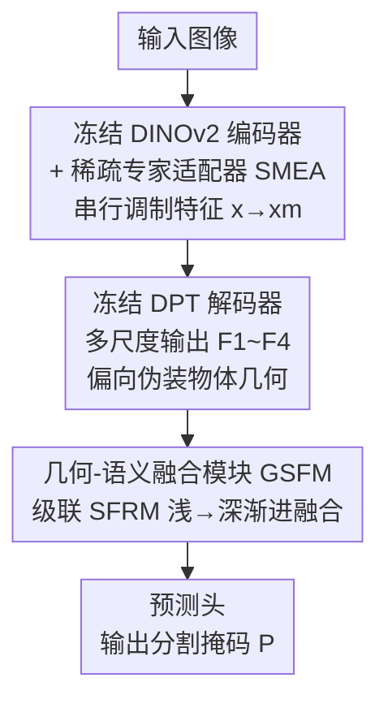

# Beyond Appearance: Camouflaged Object Detection via Geometric Structure

**会议**: CVPR 2026  
**论文**: [CVF Open Access](https://openaccess.thecvf.com/content/CVPR2026/html/Han_Beyond_Appearance_Camouflaged_Object_Detection_via_Geometric_Structure_CVPR_2026_paper.html)  
**代码**: https://depthsam.github.io/ （项目页）  
**领域**: 语义分割 / 伪装目标检测  
**关键词**: 伪装目标检测, 单目深度估计, 几何先验, 稀疏专家适配器, 频域融合

## 一句话总结
DepthSAM 把单目深度估计基础模型 Depth Anything v2 适配到伪装目标检测：冻结主干，用稀疏 MoE 适配器（SMEA）把"重建整个场景的几何"扭转成"只突出伪装目标的几何"，再用空间-频域双流融合模块（GSFM）把几何线索和语义对齐，在 COD10K/CAMO/NC4K 三个基准上刷新 SOTA（COD10K 的 $S_\alpha$、$F^\omega_\beta$ 比次优分别高 3.0%、4.3%）。

## 研究背景与动机
**领域现状**：伪装目标检测（Camouflaged Object Detection, COD）要把"和背景融为一体"的物体抠出来，传统做法从定制 CNN 进化到 Transformer，再到微调 SAM 这类大基础模型。但无论哪一代，本质上都在 **RGB 图像里挖颜色/纹理这类外观线索**。

**现有痛点**：当伪装到极致时，外观线索本身就是失真甚至骗人的——物体的颜色纹理和背景几乎一样，SAM 的通用先验对这种高混淆场景帮不上忙，性能直接崩。

**核心矛盾**：作者提出换一个更鲁棒的信息源——**几何**。单目深度估计（MDE）基础模型（如 Depth Anything）经过大规模预训练，能从 2D 外观推断出丰富的 3D 几何，而几何比颜色纹理更能区分物体边界。但直接把 MDE 套到 COD 上会撞上一个**任务错配（task misalignment）**：MDE 的目标是重建场景里**所有**几何形状，COD 的目标是**只**隔离出特定物体。当物体几何和背景几何"交缠"在一起时，MDE 会不加区分地把两者都重建出来，物体结构反而被背景淹没（论文图 1 称为 "Depth Intertwine" 场景）。

**本文目标**：把 MDE 的几何先验"扭"向伪装目标——既要突出物体几何、抑制背景几何，又要把深度先验和高层语义有效融合。

**核心 idea**：不重新训练 MDE，而是**在冻结的 MDE 内部插入稀疏专家适配器去"操舵"特征**，让解码器输出偏向伪装物体；再用一个空间-频域双流模块把几何与语义对齐，最终生成分割掩码。

## 方法详解

### 整体框架
DepthSAM 以预训练的 Depth Anything v2（DAv2）为底座，DAv2 由一个 DINOv2 编码器（提视觉特征）和一个 DPT 解码器（多尺度上采样）组成，两者**全程冻结**。方法在此之上加两件事：① 把 **SMEA** 串行注入冻结的 DINOv2 编码器，调制其内部特征，迫使冻结的 DPT 解码器输出的多尺度特征 $\{F_1,F_2,F_3,F_4\}$ 偏向伪装物体的几何；② 用 **GSFM** 把这四路互补特征渐进式融合成一张高质量表示 $F_o$，最后一个轻量卷积预测头把 $F_o$ 映射成分割掩码 $P$。训练用混合损失 $L = L_{BCE} + L_{IOU}$，外加一个保证 SMEA 稀疏性的辅助损失。

### 关键设计

**1. SMEA：用稀疏专家适配器把"场景几何"操舵成"物体几何"**

这一步针对的痛点就是任务错配：冻结的 DINOv2 特征是为"通用、全场景几何理解"优化的，缺少 COD 需要的物体级任务感知。SMEA（Sparse Mixture-of-Experts Adapter）以**串行**方式注入——在每个指定的编码器 Transformer Block 之前插入，输入特征 $x$ 先被适配器调制成 $x_m$，再喂给后续冻结的自注意力和 FFN。这点很关键：**所有信息都被强制过一遍 SMEA**，才能形成强力的任务专属调制。

SMEA 内部由 $N$ 个轻量专家 $E_i$ 和一个门控网络 $G$（充当路由器）组成。门控为所有专家算权重 $g_i$，但只有 Top-K（默认 $K=2$）最高权重的专家被激活、其余置零，保证稀疏与高效。调制特征为专家输出的稀疏加权和，并通过内部残差连接加回原输入以稳定训练：
$$x_m = x + \Big(\sum_{i=1}^{N} g_i E_i(x)\Big)\Big/\sum_{i=1}^{N} g_i, \quad g_i \in \text{Top-K}(G(x))$$
门控会学着为不同输入挑选最相关的专家组合，把表示从"depth-centric（以深度为中心）"动态扭向"object-centric（以物体为中心）"。这个被预调制的信号 $x_m$ 顺着传到 DPT 解码器，让多尺度深度输出 $\{F_i\}$ 高亮伪装物体的几何先验——注意 SMEA 的目标**不是**根本改变特征，而是去"影响 DPT 解码器、让它把伪装物体几何当成最显著的信息"。论文图 6 可视化了专家分工：专家 1/7 对沙地等平坦颗粒纹理上的物体激活，专家 4/6 专门处理藏在复杂植被里的物体。

**2. GSFM：渐进式融合把浅层几何细节和深层语义对齐**

SMEA 调制后，DPT 解码器虽然被引导偏向物体几何，但它毕竟是冻结的、输出本质上仍是"几何理解表示"而非"分割表示"；而且四路特征互补——浅层 $F_1$ 富含调制后的几何细节，深层 $F_4$ 持有强语义。GSFM（Geometric-Semantic Fusion Module）采用**渐进式融合架构（Progressive Fusion）**，从深到浅级联核心组件 SFRM，让浅层细粒度几何细节逐级引导、精修深层语义表示：
$$F_o = \text{SFRM}(\text{SFRM}(\text{SFRM}(F_4, F_3), F_2), F_1)$$
这种多阶段设计的好处是：不是一次性把四路硬拼，而是让"细几何"和"粗语义"在每一级两两对齐后再往上传，最终汇聚成一张既语义鲁棒又结构精确的特征 $F_o$。

**3. SFRM：空间-频域双流 + 四路交叉注意力做跨域强化**

SFRM（Spatial-Frequency Refinement Module）是 GSFM 每一级的核心，负责融合两张输入特征 $x_1, x_2$，核心是**双域设计**。先经初始交互（拼接+卷积）合并输入，再分两条并行流处理：**空间流 S**（富含局部几何细节）和**频域流 F**（经 FFT，高效捕获全局语义上下文）。然后用四路并行多头自注意力（MHSA）做全面信息交换：

$$
\begin{cases}
F_F = \mathcal{F}^{-1}\big(\text{Softmax}(\tfrac{QK^T}{\sqrt{d}})\cdot V\big) & \text{频域自注意力：流内全局上下文} \\
F_S = \text{Softmax}(\tfrac{qk^T}{\sqrt{d}})\cdot v & \text{空间自注意力：流内局部结构} \\
F_{S\to F} = \mathcal{F}^{-1}\big(\mathcal{F}(\text{Softmax}(\tfrac{qk^T}{\sqrt{d}}))\cdot V\big) & \text{几何引导语义：用空间结构锚定全局语义} \\
F_{F\to S} = \mathcal{F}^{-1}\big(\text{Softmax}(\tfrac{QK^T}{\sqrt{d}})\big)\cdot v & \text{语义引导几何：用语义抑制背景噪声、增强真边界}
\end{cases}
$$
其中 $\mathcal{F}$/$\mathcal{F}^{-1}$ 是傅里叶正/逆变换，大写 $Q,K,V$ 来自频域流、小写 $q,k,v$ 来自空间流。前两路是各自流内自注意力，后两路是跨域引导：几何引导语义用局部几何"锚定并校准"全局语义表示，语义引导几何用高层语义"抑制背景噪声、增强真实物体边界"。聚合这四路结果实现跨域互强化，产出既语义鲁棒又结构精确的融合特征。⚠️ 公式 (3) 中大小写 $Q/q$ 等的具体来源（哪条流出 $Q$、哪条出 $q$）以原文为准。

### 损失函数 / 训练策略
监督用 BCE + IoU 混合损失 $L = L_{BCE} + L_{IOU}$，另加辅助损失保证 SMEA 路由稀疏性。实现细节：DAv2 全架构作底座，SMEA 专家总数 8、激活 Top-K=2；输入与 GT 统一缩放到 512×512，随机水平翻转 + 随机裁剪；Adam，初始学习率 5e-5，每 150 epoch 乘 0.1 阶梯衰减，训练 300 epoch，4×RTX 4090，总 batch size 8。DepthSAM-B/L 两个规模可训练参数分别仅 9.09M / 27.45M。

## 实验关键数据

### 主实验
在 CAMO/COD10K/NC4K 三个 COD 基准上对比 18 个 SOTA。DepthSAM-L（512×512）全面领先，可训练参数仅 27.45M（远低于多数对手）：

| 数据集 | 指标 | DepthSAM-L | 次优(CG-COD) | 提升 |
|--------|------|-----------|-------------|------|
| CAMO | $S_\alpha$ ↑ / $F^\omega_\beta$ ↑ | 0.919 / 0.906 | 0.896 / 0.864 | +2.3% / +4.2% |
| COD10K | $S_\alpha$ ↑ / $F^\omega_\beta$ ↑ | 0.920 / 0.867 | 0.890 / 0.824 | +3.0% / +4.3% |
| NC4K | $S_\alpha$ ↑ / $F^\omega_\beta$ ↑ | 0.929 / 0.909 | 0.904 / 0.869 | +2.5% / +4.0% |
| COD10K | $M$ ↓ / $E_\xi$ ↑ | 0.014 / 0.964 | 0.018 / 0.948 | — |

轻量的 DepthSAM-B（9.09M 参数）在 512×512 下也已超过所有对手（如 COD10K $S_\alpha$=0.907）。

### 零样本泛化（VCOD）
直接把只在静态图训练的 DepthSAM-L 拿到视频伪装检测基准 MoCA-Mask 上做零样本，超过专为视频设计的 SOTA：

| 方法 | $S_\alpha$ ↑ | $F^\omega_\beta$ ↑ | mIoU ↑ |
|------|------|------|------|
| ZoomNeXt (TPAMI24) | 73.4 | 47.6 | 42.2 |
| SAM-PM (CVPR24) | 72.8 | 56.7 | 50.2 |
| **DepthSAM-L (零样本)** | **78.4** | **60.9** | **54.9** |

$S_\alpha$ 比次优 ZoomNeXt 高 5.0%，作者认为这正源于"解决任务错配后模型学会了聚焦伪装物体几何"的能力。

### 消融实验

| 配置 | $S_\alpha$ | $F^\omega_\beta$ | 说明 |
|------|------|------|------|
| w/o SMEA | 0.845 | 0.719 | 去掉 SMEA，GSFM 直接吃原始 DAv2 先验 → 最差 |
| SMEA→普通非稀疏 Adapter | 0.914 | 0.840 | 多专家比单一适配器好 +2.7% $F^\omega_\beta$ |
| SMEA Top-K=4 | 0.920 | 0.869 | 仅微涨 +0.15M 参数，K=2 性价比最优 |
| w/o GSFM（简单拼接） | 0.875 | 0.766 | 简单拼接不够，掉 10 个点 $F^\omega_\beta$ |
| GSFM→FFN | 0.909 | 0.829 | FFN 融合异构多尺度特征仍次优 |
| GSFM 核心 SFRM→普通 MHSA | 0.899 | 0.809 | MHSA 缺频域视角 → 退化 |
| **完整 DepthSAM-L** | **0.920** | **0.867** | — |

另有基础模型消融（表 3）：把 DepthSAM 的组件搬到通用大模型 SAM（记 SAM*），COD10K 上 $S_\alpha$ 仍落后 4.0%（0.880 vs 0.920），证明**关键是几何先验本身，而非单纯的海量预训练**。

### 关键发现
- **SMEA 是性价比最高的组件**：去掉它 $F^\omega_\beta$ 暴跌 14.8%（0.719 vs 0.867），而它把通用深度特征扭向物体级是整个方法的成败关键。
- **稀疏专家 > 单一适配器**：多专家能按场景（沙地/植被）动态分工，比一个通用 adapter 高 2.7% $F^\omega_\beta$；K=2 已够，K=4 提升微乎其微。
- **频域视角不可省**：GSFM 的核心 SFRM 用普通 MHSA 替换就掉到 0.809，说明用 FFT 捕获全局语义、再和空间几何交叉引导，是融合伪装特征的关键。
- **几何 > 通用语义**：同样组件下 DAv2 底座远胜 SAM 底座，伪装场景里 SAM 的原始特征被背景纹理干扰得很乱。

## 亮点与洞察
- **换信息源而非堆模块**：当外观线索失效时，绝大多数 COD 工作还在卷"如何放大微弱外观线索"，本文直接换成 MDE 的几何先验，是个干净利落的视角转换。
- **"操舵"而非"改造"基础模型**：SMEA 不微调主干、只插稀疏适配器去影响冻结解码器的输出朝向，可训练参数压到 9~27M 却拿下 SOTA，这种"冻结 + 轻量调制"范式很值得迁移到其他"基础模型任务错配"场景。
- **任务错配是个可复用的诊断框架**：把"基础模型预训练目标 ≠ 下游目标"明确成 task misalignment，并对症下药（调制特征朝向 + 跨域融合），这个思路对所有"借用基础模型先验"的工作都有启发。
- **零样本迁到视频是最强证据**：纯静态图训练却在 VCOD 上超过视频专用方法，说明学到的是几何聚焦的本质能力而非数据集过拟合。

## 局限性 / 可改进方向
- **依赖 MDE 质量**：方法吃 DAv2 的深度先验，当深度估计本身在某些极端场景（透明物体、深度无差异的真·同平面伪装）失效时，几何先验也会失效，论文未深入分析这类失败边界。⚠️ 论文未给 MDE 失败时的兜底方案。
- **任务错配只缓解未根除**：SMEA 是"引导"冻结解码器而非真正重训几何，对"物体几何与背景几何在深度上完全交缠"的极端 Depth Intertwine 场景能缓解到什么程度，缺少定量边界刻画。
- **频域融合的可解释性有限**：SFRM 四路 MHSA 的跨域引导设计有效，但为何频域=全局语义、空间=局部几何这一假设成立，论文偏经验性，公式 (3) 的符号定义也略含糊。
- **改进思路**：可探索把 SMEA 的专家路由和深度置信度耦合（深度不可靠区域降低几何权重），或引入可学习的深度-语义对齐损失替代纯结构监督。

## 相关工作与启发
- **vs DSAM / RISNet（用深度做 COD 的前作）**：RISNet 用深度输出做边界精修、DSAM 用双流架构融合 RGB 与深度特征，它们都把深度当**外部输入**，因而受深度估计的累积误差困扰；本文直接**微调 MDE 模型内部**、调制其特征，从源头减少累积误差，更彻底地榨取几何潜力。
- **vs SAM-Adapter / CG-COD（基础模型微调路线）**：它们微调 SAM 这类**语义/分割**基础模型，仍困在外观线索；本文换用 **MDE 几何**基础模型，并用消融证明同样组件下几何先验显著优于 SAM 的通用语义先验。
- **vs CamoFormer / FEDER / ZoomNeXt（外观线索路线）**：这些方法设计复杂模块去放大微弱外观线索，外观一旦模糊就受限；DepthSAM 用几何这条更鲁棒的线索绕过了外观瓶颈，在背景匹配、透明物体等极端场景视觉上明显更干净。

## 评分
- 新颖性: ⭐⭐⭐⭐⭐ 首个把单目深度估计基础模型适配到 COD，并用"任务错配"框架对症下药
- 实验充分度: ⭐⭐⭐⭐⭐ 三基准 18 对手 + VCOD 零样本 + SOD/ORSI 泛化 + 多组消融，证据链完整
- 写作质量: ⭐⭐⭐⭐ 动机和方法叙事清晰，但公式 (3) 符号定义略含糊
- 价值: ⭐⭐⭐⭐⭐ 轻量参数刷新 SOTA，"冻结基础模型 + 稀疏调制 + 跨域融合"范式可迁移性强

<!-- RELATED:START -->

## 相关论文

- [\[CVPR 2026\] SDDF: Specificity-Driven Dynamic Focusing for Open-Vocabulary Camouflaged Object Detection](sddf_specificity-driven_dynamic_focusing_for_open-vocabulary_camouflaged_object.md)
- [\[ICML 2026\] Beyond Detection: A Structure-Aware Framework for Scene Text Tracking](../../ICML2026/segmentation/beyond_detection_a_structure-aware_framework_for_scene_text_tracking.md)
- [\[CVPR 2026\] DSS: Discover, Segment, and Select for Zero-shot Camouflaged Object Segmentation](discover_segment_and_select_a_progressive_mechanism_for_zero-shot_camouflaged_ob.md)
- [\[CVPR 2026\] Structure-Aware Representation Distillation for Tiny-Dense Object Segmentation](structure-aware_representation_distillation_for_tiny-dense_object_segmentation.md)
- [\[CVPR 2026\] GeoGuide: Hierarchical Geometric Guidance for Open-Vocabulary 3D Semantic Segmentation](geoguide_hierarchical_geometric_guidance_for_open-vocabulary_3d_semantic_segment.md)

<!-- RELATED:END -->
