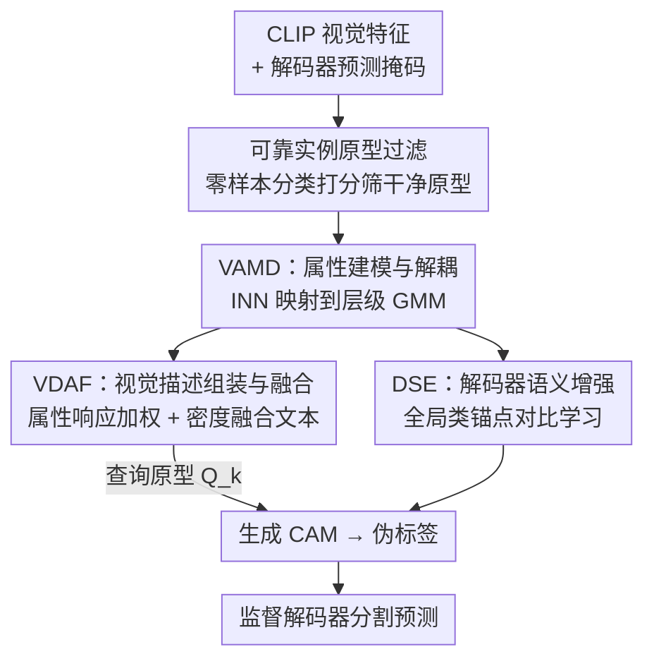

# Beyond Text: Visual Description Assembly by Probabilistic Model for CLIP-based Weakly Supervised Semantic Segmentation

**会议**: CVPR 2026  
**论文**: [CVF Open Access](https://openaccess.thecvf.com/content/CVPR2026/html/Qiu_Beyond_Text_Visual_Description_Assembly_by_Probabilistic_Model_for_CLIP-based_CVPR_2026_paper.html)  
**代码**: 论文称 "Code is available"，未给出明确仓库链接（⚠️ 以原文为准）  
**领域**: 弱监督语义分割  
**关键词**: 弱监督语义分割, CLIP, 概率模型/GMM, 视觉原型, 模态鸿沟

## 一句话总结
针对 CLIP-based 弱监督分割中"文本原型与视觉特征存在模态鸿沟、且静态文本无法适配多样实例"的问题，本文用可逆神经网络把 CLIP 视觉特征建模成层级高斯混合模型，从视觉空间里显式解耦出类内属性、按实例响应动态组装成视觉描述原型替代文本查询，并用密度权重自适应回退到文本锚点，在 VOC/COCO 上把单阶段 WSSS 刷到 79.9%/51.4% mIoU 的新 SOTA。

## 研究背景与动机
**领域现状**：弱监督语义分割（WSSS）只用图像级标签训练，主流做法是用分类网络生成类激活图（CAM）当伪标签。CLIP 出现后，CLIP-based WSSS 用文本编码器产出的类别文本原型去和视觉 patch 特征算余弦相似度生成 CAM——即 $M_k = \mathrm{Norm}(\cos\langle V, T_k^\top\rangle)$，视觉特征 $V$ 固定时，CAM 质量完全取决于文本嵌入 $T$。

**现有痛点**：早期方法（CLIP-ES、WeCLIP）用手工模板（如 "a clean origami of [CLASS]"），只能确认物体存在、缺细粒度属性；ExCEL 进一步用 LLM 生成丰富属性描述再聚类成一个更具描述性的文本原型。但它们都只在"文本侧"做文章，绕不开两个更根本的缺陷。

**核心矛盾**：① **模态鸿沟**——CLIP 的文本嵌入是为全局语义对齐优化的，和视觉特征处在不同流形上，再丰富的文本原型也常常落在视觉特征簇之外，导致 CAM 不完整；② **静态查询**——同一个属性（如"火车头部"）在不同图像里的视觉特征在 CLIP 空间里是散落的多个簇，而静态文本原型是一个固定点，夹在这些簇中间，对各簇的远近不一，激活强度时强时弱。

**本文目标**：不再优化"次优的静态文本描述"，而是直接从视觉空间里构造**实例特定**的视觉描述原型当查询，从源头绕过模态鸿沟。

**切入角度**：好的查询应当直接来自视觉空间、带目标特有的属性。难点在于：CLIP 原始空间里属性相关的视觉特征既散落又纠缠（同一属性散在多个簇、单个簇里又混着别的属性）。作者的观察是——可以把复杂的视觉特征分布映射到一个**结构化隐空间**（高斯混合模型 GMM），让类内属性被显式解耦成可数的成分，再按实例响应重新组装。

**核心 idea**：用可逆网络把 CLIP 视觉特征建成层级 GMM 解耦出"视觉属性词表"，按目标对各属性的响应强度动态组装出实例视觉原型，再用密度权重自适应融合稳定的文本锚点，替代静态文本查询。

## 方法详解

### 整体框架
VDA（Visual Description Assembly）的输入是一张图的冻结 CLIP 视觉特征，输出是更完整准确的 CAM（再细化成伪标签监督解码器）。整条管线分四步串起来：先从解码器预测里抽实例原型，用 CLIP 零样本分类能力做**可靠原型过滤**，攒出一批干净原型；再用 **VAMD** 把这批原型经可逆网络（INN）映射到层级 GMM——先建类间 GMM 稳住类中心、再在其上长出类内 GMM 解耦细粒度属性；然后 **VDAF** 把这些属性原型映回 CLIP 视觉空间，按目标实例对每个属性的响应强度加权组装成视觉描述原型，再用一个密度权重把它和文本原型线性插值成最终查询原型，生成 CAM；此外 **DSE** 从类间 GMM 取全局类锚点，对解码器特征做对比学习增强语义一致性。值得注意的是：INN 的训练和分割网络训练完全独立（梯度互不回传），推理时 INN 相关组件全部移除。

### 关键设计

**1. 可靠实例原型过滤：先攒一批干净原型再建模**

直接拿解码器预测算出来的实例原型来训概率模型会出问题——WSSS 里解码器预测本身带噪，脏原型会严重污染 GMM 的学习。对一张图 $I$，类 $k$ 的实例原型用掩码平均池化得到 $P_k = \frac{\sum_{x,y} P_k(x,y)\cdot V(x,y)}{\sum_{x,y} P_k(x,y)}$，其中 $P_k(x,y)=\mathbb{I}[P(x,y)=k]$ 是解码器预测掩码。为筛掉噪声原型，作者借 CLIP 的零样本分类能力：把前景 $K$ 类与背景 $N$ 类的文本提示编码成 $T_{zs}$，算 $s = \mathrm{Softmax}(P_k T_{zs}^\top / \tau)$，只保留分数超过阈值 $\eta$（取 0.95）的原型组成可靠批次 $B=\{P_k \mid s_k > \eta\}$。这步看似简单，却是整个方法的基石——消融里去掉它，mIoU 从 78.7% 灾难性塌到 75.3%，因为 VAMD 和 DSE 都依赖一个干净的隐空间。

**2. VAMD — 用 INN + 层级 GMM 把视觉属性显式解耦**

这一步针对"CLIP 原始空间里属性散落且纠缠"的痛点。作者用可逆神经网络（INN，结构 follow RealNVP）学一个双射映射 $f_\theta: X\to Z$，把原型映到隐空间，隐分布建成 GMM：$p_Z(z)=\sum_{k=1}^K \pi_k\, \mathcal{N}(z\mid\mu_k,\Sigma_k)$。选 INN 是看中它的双射性——既能精确估计概率密度，又能把隐空间属性原型**映回** CLIP 视觉空间当查询。训练用负对数似然 $L_{nll}=\mathbb{E}_{x\sim X}[-\log p_Z(f_\theta(x)) - \log|\det J|]$，并把协方差全设为单位阵 $\Sigma_k=I$、混合权重 $\pi_k=\mathrm{Softmax}(\psi)_k$ 设成可学习参数以稳定优化。

关键是**层级、渐进式**地建：直接对所有类、所有细粒度属性同时优化一个 GMM 极不稳定。于是先建**类间 GMM** 稳住 $K$ 个类中心，用类间似然损失

$$L_{inter}=\mathbb{E}_{x\sim B}\big[-\mathrm{LSE}_k(c_k - E_k(f_\theta(x),\mu_k)) - \log|\det J|\big],$$

配一个判别损失 $L_{dis}$ 把样本拉向对应成分、推离其它成分。类中心稳了之后，再把每个类间成分扩成 $M$ 成分的**类内 GMM** $p(Z\mid k)=\sum_{i=1}^M \pi_i(k)\mathcal{N}(\mu_i^k, I)$，每个 $\mu_i^k$ 是类 $k$ 的一个隐视觉属性。为防止学属性时把已稳的类中心带偏，把其余 $M-1$ 个属性中心参数化成相对主中心的偏移 $\mu_i^k = \mu_1^k + \Delta\mu_i^k$（$\Delta\mu_1^k=0$），只优化偏移、用 $L_{intra}$ 约束。训练上先只用 $L_{inter}+L_{dis}$ 预热，再加入 $L_{intra}$ 联合优化 $L_{inn}=L_{inter}+L_{dis}+L_{intra}$，最终得到一个显式结构化的层级 GMM（H-GMM）。

**3. VDAF — 按实例响应组装视觉原型并密度自适应融合文本**

INN 训好后，类内 GMM 的各成分就是一份"视觉属性词表"，但同一类的不同实例只会表现出其中一部分属性，所以要**动态组装**。分三步：① **属性原型回取**——把隐空间属性中心用 INN 逆映射 $a_i^k = g_\theta(\mu_i^k)$ 映回 CLIP 视觉空间（$g_\theta=f_\theta^{-1}$），这些 $a_i^k$ 对应颜色、形状、动作等抽象属性；② **响应强度计算**——把实例原型映到隐空间 $z_k=f_\theta(P_k)$，算它属于每个类内成分的后验概率当权重 $\omega_i^k(z_k)=\mathrm{Softmax}_i(-\frac{1}{2}\|z_k-\mu_i^k\|_2^2 + c_i^k)$；③ **组装**——视觉描述原型 $A_k^{vis}(P_k)=\sum_{i=1}^M \omega_i^k(z_k)\cdot a_i^k$，即只把该实例实际具备的属性按响应加权拼起来。

但 $A_k^{vis}$ 的质量完全取决于输入原型 $P_k$，而 $P_k$ 来自可能带噪的预测掩码；若 $P_k$ 不完整或错误，组装出的描述也会失真。文本原型"a clean origami [CLASS]"虽然只给泛泛语义，却**语义稳定**，可当锚点。于是作者定义一个密度自适应权重，衡量 $z_k$ 在其类间成分 $\mathcal{N}(\mu_k,I)$ 下有多"典型"：

$$\alpha_k(P_k)=\exp\!\Big(-\tfrac{1}{2}\|z_k-\mu_k\|_2^2\Big).$$

$\alpha_k$ 高说明实例典型、更信视觉原型；$\alpha_k$ 低说明是非典型/低质样本、回退到稳定文本锚点。最终查询原型是二者的线性插值 $Q_k=(1-\alpha_k(P_k))T_k + \alpha_k(P_k)A_k^{vis}(P_k)$，用 $Q_k$ 替换式(1)里的静态 $T_k$ 生成 CAM。消融证明这种密度动态融合优于任何固定权重的静态融合。

**4. DSE — 用 GMM 全局类锚点增强解码器语义一致性**

为进一步让解码器嵌入语义更一致，作者用可学习 adapter 把冻结 CLIP 特征 $V$ 转成 $V_{dec}$，并引入对比学习。全局语义锚点 $G_k$ 直接取类间 GMM 的成分中心 $\mu_k$ 逆映射回视觉空间 $V_k^g=g_\theta(\mu_k)$，用 InfoNCE 把 adapter 实例原型 $P_{dec,k}$ 拉向对应全局锚点、推离其它类锚点：$L_{con}=-\log\frac{\exp(\mathrm{sim}(P_{dec,k},G_k)/\tau)}{\sum_j \exp(\mathrm{sim}(P_{dec,k},G_j)/\tau)}$。这让 adapter 表示和类间 GMM 学到的全局类关系对齐，增强后的 $V_{dec}$ 再送入解码器出最终分割。

### 损失函数 / 训练策略
框架有两个**完全独立**的训练目标：① 分割网络用交叉熵 $L_{ce}=\mathrm{CE}(\hat{P},P)$ 加对比损失，总 $L_{seg}=L_{ce}+\lambda L_{con}$（$\lambda=0.2$）；② INN 概率模型用 $L_{inn}$（式9）单独训。两者梯度互不回传，推理时移除所有 INN 相关组件。超参：过滤阈值 $\eta=0.95$，每类属性数 $M=8$，VOC batch=4 / COCO batch=8、可靠原型批 $B$=16；adapter/decoder 用 AdamW（lr 1e-4），INN 用 Adam（lr 2e-4）；VOC 训 3 万步、COCO 训 10 万步，单张 RTX 3090。

## 实验关键数据

### 主实验
VOC/COCO 上与单阶段、多阶段 WSSS 方法对比（mIoU%）。VDA 单阶段就超过所有多阶段方法，比单阶段 SOTA ExCEL 在 VOC val +1.5%、COCO val +1.1%：

| 方法 | 类型 | 骨干 | VOC val | VOC test | COCO val |
|------|------|------|---------|----------|----------|
| WeCLIP (CVPR'24) | 单阶段 | ViT-B | 76.4 | 77.2 | 47.1 |
| ExCEL (CVPR'25) | 单阶段 | ViT-B | 78.4 | 78.5 | 50.3 |
| VPL (AAAI'25) | 多阶段 | ViT-B | 79.3 | 79.0 | 49.8 |
| **VDA (本文)** | 单阶段 | ViT-B | **79.9** | **79.8** | **51.4** |

CAM seed 质量（VOC train，mIoU%）同样领先：VDA 79.1，对比 ExCEL 78.0、WeCLIP 75.4，证明视觉查询比纯文本查询能产出更完整准确的 CAM。

### 消融实验
主组件消融（VOC val，mIoU%）：

| 配置 | VDAF | DSE | Filter | mIoU |
|------|------|-----|--------|------|
| I 仅文本模板 | | | | 75.8 |
| II +VDAF | ✓ | | ✓ | 78.4 |
| III +DSE | | ✓ | ✓ | 76.5 |
| IV 全模型去 Filter | ✓ | ✓ | | 75.3 |
| V 全模型 | ✓ | ✓ | ✓ | **78.7** |

属性数 $M$ 敏感性（VOC val）：

| M | 3 | 5 | 8 | 10 | 15 |
|---|---|---|---|----|----|
| mIoU(%) | 77.9 | 78.2 | **78.7** | 78.6 | 78.4 |

### 关键发现
- **Filter 是基石**：去掉零样本过滤，全模型从 78.7% 塌到 75.3%（-3.4%），因为 VDAF 和 DSE 都靠干净的隐空间，脏原型直接污染 GMM。
- **VDAF 贡献最大**：单加 VDAF（+2.6% 到 78.4%）远大于单加 DSE（76.5%），说明动态视觉知识对生成更好 CAM 监督最关键。
- **属性数取中等最好**：$M$=8 最优；太小（3/5）覆盖不全类内属性、仍纠缠，太大（10/15）学到过细不鲁棒的属性且增加 INN 优化复杂度。
- **动态融合优于任何静态权重**：把 $\alpha$ 固定从 0（纯文本 76.5%）扫到 1（纯视觉 77.6%），静态最优在 $\alpha$=0.6，而密度动态融合达 78.7%，且纯视觉始终优于纯文本，印证视觉查询信息的价值。

## 亮点与洞察
- **把"模态鸿沟"转成"换查询源"问题**：与其在文本侧反复优化（终究跨不过流形差异），不如直接从视觉空间组装查询——这个视角切换是全文最"啊哈"的地方，绕开问题而非硬解。
- **INN 双射性用得巧**：既能在隐空间做精确密度估计/解耦，又能把属性原型逆映射回视觉空间当查询，一个可逆网络同时承担"建模"和"取回"两职。
- **密度权重当质量自评**：$\alpha_k$ 用实例原型在类分布下的典型程度，自动决定信视觉还是回退文本，等价于一个无监督的样本质量打分器，可迁移到任何"高质量动态原型 + 稳定锚点"需要自适应混合的场景。
- **层级+渐进建模稳住优化**：先类间稳中心、再类内学偏移（而非从头同时学 $M\times K$ 个中心），是把不稳定联合优化拆成可控子问题的实用工程范式。

## 局限与展望
- **强依赖解码器预测质量**：实例原型来自解码器掩码，虽有 Filter 兜底，但若整体预测在某类上系统性差，可靠原型批可能本身偏，组装出的视觉原型也会受限。
- **两套独立训练 + INN 额外开销**：INN 与分割网络分开训、梯度不互通，虽然推理时移除，但训练管线更复杂，且层级 GMM 与渐进策略引入多个超参（$\eta$、$M$、预热步数）。
- **属性的"可解释性"是声称而非验证**：论文说属性对应颜色/形状/动作等，但未给定量的属性解耦度量，⚠️ 这一可解释性偏定性描述。
- **改进思路**：可探索让 INN 与分割网络联合优化（带停梯度的软耦合）、或对 $M$ 做类自适应（不同类属性丰富度不同），以及把视觉描述组装扩展到开放词表分割。

## 相关工作与启发
- **vs ExCEL（CVPR'25）**：ExCEL 用 LLM 丰富文本描述、聚类成单个更具描述性的文本原型，但仍是静态文本、跨不过模态鸿沟；本文直接从视觉空间组装动态实例原型替代文本，VOC val +1.5%。
- **vs CLIP-ES / WeCLIP**：它们用手工模板文本当查询，只能确认物体存在、缺细粒度属性且静态；本文用视觉属性词表按实例响应组装，CAM 更完整。
- **vs BRNF（用归一化流建模像素特征）**：同样借概率/可逆建模，但 BRNF 在传统分类 CAM 框架里建像素特征辅助分类器，本文是在 CLIP 框架里建实例原型、目标是解耦视觉属性并逆映射成查询，落点不同。

## 评分
- 新颖性: ⭐⭐⭐⭐⭐ "从视觉空间组装查询替代文本"切中模态鸿沟根因，INN+层级GMM 的解耦-组装-逆映射设计完整而新颖
- 实验充分度: ⭐⭐⭐⭐ VOC/COCO 双数据集 + CAM seed + 组件/属性数/融合方式多维消融，但缺属性可解释性的定量验证
- 写作质量: ⭐⭐⭐⭐⭐ 动机推导清晰、公式完整、三模块串联讲得明白，图文对照到位
- 价值: ⭐⭐⭐⭐ 单阶段刷新 WSSS SOTA，密度自适应融合与层级建模思路可迁移；依赖解码器预测与额外 INN 训练略增门槛

<!-- RELATED:START -->

## 相关论文

- [\[CVPR 2026\] Leveraging Class Distributions in CLIP for Weakly Supervised Semantic Segmentation](leveraging_class_distributions_in_clip_for_weakly_supervised_semantic_segmentati.md)
- [\[CVPR 2026\] Frequency-Aware Affinity for Weakly Supervised Semantic Segmentation](frequency-aware_affinity_for_weakly_supervised_semantic_segmentation.md)
- [\[AAAI 2026\] SSR: Semantic and Spatial Rectification for CLIP-based Weakly Supervised Segmentation](../../AAAI2026/segmentation/ssr_semantic_and_spatial_rectification_for_clip-based_weakly_supervised_segmenta.md)
- [\[CVPR 2025\] Exploring CLIP's Dense Knowledge for Weakly Supervised Semantic Segmentation](../../CVPR2025/segmentation/exploring_clips_dense_knowledge_for_weakly_supervised_semantic_segmentation.md)
- [\[CVPR 2026\] DeBias-CLIP: CLIP Is Shortsighted — Paying Attention Beyond the First Sentence](clip_shortsighted_beyond_first_sentence.md)

<!-- RELATED:END -->
