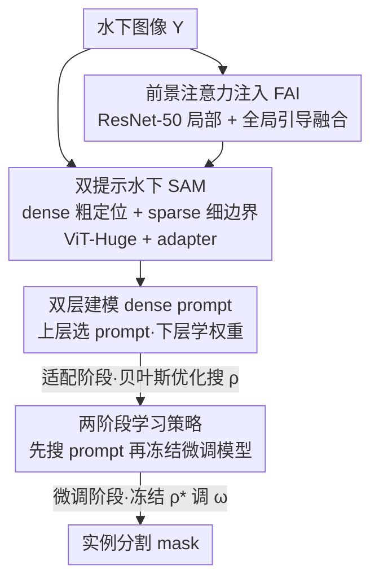

# BiPA: Bilevel Prompt Adaptation for Underwater Instance Segmentation

**会议**: CVPR 2026  
**论文**: [CVF Open Access](https://openaccess.thecvf.com/content/CVPR2026/html/Ma_BiPA_Bilevel_Prompt_Adaptation_for_Underwater_Instance_Segmentation_CVPR_2026_paper.html)  
**代码**: https://github.com/ZeAstra/BiPA  
**领域**: 水下实例分割 / 分割  
**关键词**: 水下实例分割, SAM 适配, 双层优化, 提示学习, 贝叶斯优化  

## 一句话总结
BiPA 把 SAM 的 dense prompt 学习重新表述为一个「prompt 在上层、模型参数在下层」的双层优化问题，再用贝叶斯优化 + 两阶段训练策略把它做成可解，配上一个前景注意力注入模块补局部细节，从而把通用 SAM 高效迁移到严重退化的水下场景，在 UIIS / USIS10K 上 mAP 全面超过此前 SOTA。

## 研究背景与动机

**领域现状**：水下实例分割要在浑浊、散射、波长相关吸收的非空气介质里把每个目标实例分出来并预测精确 mask，支撑生态监测、资源勘探等任务。SAM 凭十亿级 mask 预训练有很强的通用分割与 zero-shot 能力，于是近期工作（UWSAM、USIS-SAM）纷纷想把 SAM 的视觉先验迁到水下。

**现有痛点**：水下与空气域存在巨大 domain gap——散射和偏色把数据分布整体搬走，SAM 在空气里学到的「prompt→mask」泛化被侵蚀，直接套用会急剧掉点。已有的 SAM 适配方法（如 USIS-SAM）通常把 dense prompt 冻结、只调别的部分，缺少一个显式机制去跨这道域间鸿沟、也没把 SAM 的知识真正挖出来。

**核心矛盾**：dense prompt 和模型参数是相互耦合的——更强的 dense prompt 会重塑 loss landscape 和下降轨迹，而模型权重又反过来约束 prompt 的可行空间。但 vanilla 端到端联合训练把这两个变量混在一起同时更新，抹掉了这层潜在的主从对应关系，导致 prompt 学不好、收敛到次优点（论文 Fig.4 的蓝色路径）。

**本文目标**：在把 SAM 适配到水下时，显式建模 prompt 与参数的相互依赖，学出一个真正面向水下的 domain-specific dense prompt，把跨域适配做对、做高效。

**切入角度**：作者借鉴超参学习视角——既然 dense prompt 本质上是调制模型行为的「超参数」，那就该用上层选 prompt、下层学权重的层级结构来优化，而不是把它当普通可学习参数一起梯度下降。

**核心 idea**：把 dense prompt 学习写成双层优化（上层用验证集选 prompt、下层用训练集学权重），并用「贝叶斯优化搜 prompt + 冻结 prompt 微调模型」的两阶段策略把这个原本昂贵的双层问题做成可解。

## 方法详解

### 整体框架

BiPA 由两大件组成：一个带**双提示**的水下 SAM 主干，和一个**前景注意力注入（FAI）模块**；外面再套一层把 dense prompt 当超参数学的**双层优化 + 两阶段训练**流程。

输入是一张水下图像 $Y$。主干用 adapter 增强的 ViT-Huge 作 image encoder 抽全局特征，SAM 的 mask decoder 在 dense prompt 与 sparse prompt 双重条件下预测实例 mask。和 USIS-SAM「冻结 dense prompt」不同，BiPA 让 dense（粗区域先验、定位目标）与 sparse（细化边界）两路提示端到端联合学习。与此并行，一个冻结的 ResNet-50 抽多尺度局部特征，经 FAI 模块在全局上下文引导下注入回 ViT 特征，补 ViT 全局自注意力容易丢的水下局部细节。训练时只微调双提示、adapter 和 FAI 模块，其余冻结。

关键在于 dense prompt 不和模型参数一起裸奔更新，而是被放到上层用贝叶斯优化来搜：先在「适配阶段」反复迭代——下层在训练集上跑 $K_a$ 步学权重，上层用 Optuna 跑 $K_b$ 步搜 prompt，warm-start 进下一轮；拿到最优 prompt $\rho^*$ 后再进「微调阶段」，冻结 $\rho^*$ 单独把模型参数在训练集上 fine-tune 到收敛。

### 关键设计

**1. 双提示水下 SAM + 前景注意力注入：补回 ViT 丢掉的局部前景**

ViT encoder 靠全局自注意力建模，在低质量水下图像里常常丢失细小局部结构、在浑浊低对比区域力不从心。BiPA 一方面把 SAM 的提示拆成双提示协同：dense prompt 给一个粗区域先验来大致定位目标，sparse prompt（由一个 sparse prompt generator 产生）负责把边界细化成精确 mask，二者联合学习而非像 USIS-SAM 那样冻结 dense。另一方面用 FAI 模块把局部前景线索注回主干：冻结的 ResNet-50 抽多尺度特征 $\{G_v\}_{v\in\{1,2,3,4\}}$，ViT 在第 8/16/24/32 层抽 $\{F_u\}$，两路在空间分辨率上对齐。

注入时先各自净化——ResNet 流过 Efficient Multi-scale Attention 得 $\bar G_v=\mathrm{EMA}(G_v)$，ViT 流过一个尺度感知采样算子 $\bar F_u=\mathrm{SS}(F_u)$，它按分辨率大小决定上采样 / 不变 / 下采样：当 $S(G_v)>S(F_u)$ 时上采样、相等时只过 multi-conv、更小时下采样。最后用一个权重生成器 $\varphi$ 做全局引导融合：

$$H_o = (1-\alpha)\odot \bar G_v + \alpha\odot \bar F_u,\quad \alpha=\varphi(\bar F_u,\bar G_v),$$

其中 $\varphi$ 分析两路异构主干的特征、输出逐位置的相关性权重 $\alpha$。这样融合是以 ViT 的全局上下文为条件来决定「该信局部还是信全局」，比简单相加更稳——消融里相加式融合只有 43.5 mAP，FAI 拿到 45.2。

**2. dense prompt 的双层建模：把 prompt 当超参数，显式刻画与参数的主从依赖**

vanilla 联合训练把 dense prompt $\rho$ 和模型参数 $\omega$ 同时梯度更新，混淆了二者的潜在对应关系。BiPA 借鉴超参学习视角，把 dense prompt 学习写成一个双层问题——上层在验证集上选 prompt，下层在训练集上学权重：

$$\min_{\rho} f\big(\rho,\omega(\rho);\mathcal{D}_{val}\big),\quad \text{s.t. }\ \omega(\rho)\in\arg\min_{\omega} g\big(\omega,\rho;\mathcal{D}_{tr}\big).$$

这里把 dense prompt $\rho$ 当成模型参数 $\omega$ 的超参数，划出一条清晰的优化边界：$\mathcal{D}_{val}$ 只用来选 prompt，所有权重 $\omega$ 只从 $\mathcal{D}_{tr}$ 学、绝不参与上层目标的梯度更新。于是下层 $g$ 在给定 $\rho$ 下优化 $\omega$，上层 $f$ 在给定 $\omega$ 下优化 $\rho$，形成显式层级关系：下层解 $\omega(\rho)$ 引导上层 prompt 学习、增强跨域适配能力，上层 prompt $\rho$ 又塑造下层的 loss landscape 与下降轨迹。损失上取 $f:=\ell_m$（mask 像素 BCE）、$g:=\ell_s=\ell_c+\ell_b+\ell_m$（标准 Mask R-CNN 损失），上层只盯 mask 质量。

**3. 两阶段学习策略：用贝叶斯优化替代昂贵的 hypergradient**

双层问题常规解法是 hypergradient——展开内层若干训练步或用隐式微分回传。但代表性的 BLO-SAM 是在 few-shot（仅 2–8 张图）上做的，而这里内层是 USIS10K 的 7,442 张图，规模大近三个数量级；每次上层更新都要回传穿过大数据集上的多步内层梯度，显存和时间随内层迭代数、训练集规模、外层循环三重放大，根本跑不动。

BiPA 因此把上层当黑盒、用**贝叶斯优化（BO）**在现实算力预算下搜超参，绕开 hypergradient。**适配阶段**先从零学一个 256 维 dense prompt embedding；BO 时把它分成 $N_g=16$ 组、每组配一个标量权重，把上层搜索空间从 256 维压到 16 维，只更新组权重来最小化验证目标：

$$\rho_{k+1}=\mathrm{Optuna}\big(\rho_k,\omega_{K_a},s_0,N,B,f,\mathcal{D}_{val}\big),$$

其中 $\rho_k$ 是调制 256 维 prompt 的当前组权重，$\omega_{K_a}$ 是在 $\rho_k$ 下内层跑 $K_a$ 步后的参数，$s_0$ 是 BO 初始搜索空间（边界与先验），$N$ 是 BO 试验数，$B$ 是优化区间，黑盒 Optuna 返回让 $f$ 最小的下一个候选。外层每轮 $t\le T$：给定 $\rho_t$ 先在训练目标 $g$ 上跑 $K_a$ 步，固定 $\omega_{K_a}$ 后把 $f$ 当黑盒在 $\rho$ 上搜 $K_b$ 步，再用 $\omega_0\leftarrow\omega_{K_a}$ warm-start 下一轮，循环得到适配后的 $\rho^*$。**微调阶段**冻结 $\rho^*$，单独把网络参数在 $\mathcal{D}_{tr}$ 上更新至多 $K_c$ 步或收敛：

$$\omega_{k+1}=\omega_k-\bar\eta_\omega\frac{\partial g(\omega_k,\rho^*;\mathcal{D}_{tr})}{\partial\omega}.$$

直觉（Fig.4）：同样 $T$ 步，naive 路径在 landscape 里走到次优区，BiPA 因为先把 prompt 搜对、轨迹更短更直，能逼近最优点。

### 损失函数 / 训练策略
沿用水下实例分割惯用的标准 Mask R-CNN 损失 $\ell_s=\ell_c+\ell_b+\ell_m$（分类交叉熵 + smooth-$\ell_1$ 回归 + 逐像素 BCE）。双层里上层目标 $f:=\ell_m$、下层目标 $g:=\ell_s$。ViT-Huge 与 ResNet-50（ImageNet 预训练）冻结，输入 resize 到 $1024\times1024$，batch size 2，AdamW，初始学习率 $1\times10^{-4}$、weight decay $1\times10^{-3}$。迭代超参 $K_a=30,\ K_b=21,\ K_c=7,\ T=3$，单张 RTX 4090，基于 MMDetection 实现，按验证最优选最终模型。

## 实验关键数据

### 主实验
UIIS 上的水下实例分割（mAP / AP 越高越好）：BiPA 五项指标全面最优，mAP 较 USIS-SAM 相对提升 8%+。

| 方法 | mAP | AP50 | AP75 | APs | APm | APl |
|------|-----|------|------|-----|-----|-----|
| Mask2Former | 28.1 | 42.9 | 30.5 | 5.3 | 22.5 | 43.5 |
| WaterMask（水下专用） | 26.4 | 43.6 | 28.8 | 9.1 | 21.1 | 38.1 |
| USIS-SAM（前 SOTA） | 29.5 | 45.9 | 31.9 | 8.1 | 23.8 | 41.0 |
| **BiPA（本文）** | **32.1** | **48.7** | **35.2** | 7.2 | **25.6** | **45.6** |

USIS10K 上的水下显著实例分割（multi-class / class-agnostic），每个 mAP 都比次优至少高 5%：

| 方法 | MC mAP | MC AP50 | MC AP75 | CA mAP | CA AP50 | CA AP75 |
|------|--------|---------|---------|--------|---------|---------|
| ConvNeXt-V2 | 39.5 | 55.4 | 44.5 | 62.3 | 85.0 | 72.5 |
| WaterMask | 37.7 | 54.0 | 42.5 | 58.3 | 80.2 | 66.5 |
| USIS-SAM | 43.1 | 59.0 | 48.5 | 59.7 | 81.6 | 67.7 |
| **BiPA（本文）** | **45.2** | **60.5** | **52.5** | **64.2** | **85.1** | **74.0** |

### 消融实验

学习策略对比（frozen / naive / BiPA，Table 3）+ 两阶段中间结果（Table 4）+ FAI 必要性（Fig.9）：

| 配置 | UIIS mAP | USIS10K mAP | 说明 |
|------|----------|-------------|------|
| Frozen（冻结 prompt） | 30.9 | 44.4 | 保留 SAM 先验但只抓粗形状 |
| Naive（联合裸更新） | 31.3 | 43.6 | 较 frozen 几乎没改进，印证 Fig.4 收敛到次优 |
| **BiPA** | **32.1** | **45.2** | 双层 + 两阶段，全指标最高 |
| 仅适配阶段 | 29.8 | — | 已能做出可用分割 |
| + 微调阶段 | 32.1 | — | 冻结 $\rho^*$ 再调，UIIS mAP +2.3 |
| FAI 相加式融合 | — | 43.5 | 简单相加不如 FAI 的 45.2，证明 FAI 必要 |

参数分析（Table 5，UIIS）：优化区间 $B$ 越大越稳，$B=[1,3]$ 最优（mAP 32.1）；分组数 $N_g=16$ 最佳（8→31.5、16→32.1、32→30.8），组数过大反而掉点。

### 关键发现
- **两阶段是核心增益来源**：仅适配阶段就有可用的 29.8 mAP，说明先学一个面向水下的 dense prompt 本身就立得住；冻结它再微调模型把 UIIS mAP 推到 32.1（+2.3），证明「先把 prompt 搜对、再独立调权重」比同时更新更有效。
- **naive 联合训练几乎无效**：直接联合更新只比冻结好一点（31.3 vs 30.9），边界与覆盖都没本质改善，正面印证了「混淆 prompt 与参数依赖会收敛到次优」的动机。
- **代价小、收益大**：相比 USIS-SAM，BiPA 多用 5.59% 参数、仅多 0.42% FLOPs（737M / 3314G vs 698M / 3300G），却把两数据集平均 mAP 提了 6.95%，accuracy-to-cost 更划算。
- **保住了 SAM 的泛化**：直接把 UIIS 上训练的模型用到 UIIS10K 的未见类别（Artiodactyla / Mollusk / Garbage），BiPA 在 zero-shot 下仍能给出比 WaterMask、USIS-SAM 更完整准确的 mask，而 USIS-SAM 在未见类上的优势并不稳定。

## 亮点与洞察
- **把 prompt 当超参数、用双层优化建模 prompt↔参数依赖**，是这篇最「啊哈」的点：它给出了一条清晰的优化边界（验证集只选 prompt、训练集只学权重），从理论上解释了为什么 naive 联合训练学不好 dense prompt。
- **用贝叶斯优化绕开 hypergradient** 是务实的工程取舍：内层 7,442 张图让展开式双层求解不现实，把上层当黑盒搜、再把 256 维压成 16 组，直接把双层优化从「跑不动」变成单卡 4090 可训。这个「大数据集上做双层优化」的思路可迁移到别的 SAM/大模型适配任务。
- **FAI 的全局引导融合** 不是简单拼接，而是用 $\varphi$ 输出逐位置权重 $\alpha$、以 ViT 全局上下文决定信局部还是信全局，给「ViT 缺局部细节」提供了一个轻量但有效的补丁。

## 局限与展望
- 作者承认**实时性受限**：双提示 + FAI + ViT-Huge 的组合算力不小，未来想用知识蒸馏做硬件感知的轻量化，并把双层框架扩到严格效率约束下。
- **未见类别的泛化只给了定性证据**：因 UIIS 与 UIIS10K 类别无可靠一一映射，作者放弃了定量评测、只展示可视化对比，跨域泛化的量化优势缺少硬指标支撑。
- 贝叶斯优化引入 $K_a/K_b/K_c/T/N_g/B$ 等多个需调的超参，论文给了默认值但**搜索成本与可复现性**对算力较敏感；$N_g$、$B$ 的甜点也提示该方法对这些设置不算鲁棒。

## 相关工作与启发
- **vs USIS-SAM**：同样基于带双提示的 SAM 主干，但 USIS-SAM 冻结 dense prompt、只调别处；BiPA 把 dense prompt 端到端联合学并用双层优化显式建模其与参数的依赖，再加 FAI 注入局部前景——以 +5.59% 参数 / +0.42% FLOPs 换 +6.95% 平均 mAP。
- **vs BLO-SAM**：都用双层优化适配 SAM，但 BLO-SAM 面向 few-shot 语义分割（2–8 张图）、用 hypergradient 展开求解；BiPA 面向上万张图的实例分割，hypergradient 不可行，改用贝叶斯优化把上层当黑盒搜，是把双层 prompt 学习搬到大规模数据上的关键区别。
- **vs WaterMask**：WaterMask 是水下适配的 Mask R-CNN、从头为水下设计；BiPA 走「迁移 SAM 大规模先验 + 高效跨域适配」路线，在浑浊、低对比、未见类别场景下边界更清、碎片更少、泛化更稳。

## 评分
- 新颖性: ⭐⭐⭐⭐⭐ 首次把双层优化引入水下实例分割，并把 dense prompt 当超参数建模其与参数的主从依赖。
- 实验充分度: ⭐⭐⭐⭐ 两数据集主结果 + 学习策略/两阶段/FAI/参数多组消融充分，但跨域泛化只有定性证据。
- 写作质量: ⭐⭐⭐⭐ 动机—公式—算法—消融链条清晰，Fig.4 优化路径示意把核心直觉讲得直观。
- 价值: ⭐⭐⭐⭐ 给出一条「大数据集上低成本做双层 prompt 适配」的可迁移范式，对 SAM 域适配有借鉴意义。

<!-- RELATED:START -->

## 相关论文

- [\[CVPR 2026\] Test-Time Multi-Prompt Adaptation for Open-Vocabulary Remote Sensing Image Segmentation](test-time_multi-prompt_adaptation_for_open-vocabulary_remote_sensing_image_segme.md)
- [\[AAAI 2026\] Empowering DINO Representations for Underwater Instance Segmentation via Aligner and Prompter](../../AAAI2026/segmentation/empowering_dino_representations_for_underwater_instance_segmentation_via_aligner.md)
- [\[CVPR 2026\] Exploring the Underwater World Segmentation without Extra Training](exploring_the_underwater_world_segmentation_without_extra_training.md)
- [\[CVPR 2026\] Prompt-Driven Lightweight Foundation Model for Instance Segmentation-Based Fault Detection in Freight Trains](promptdriven_lightweight_foundation_model_for_inst.md)
- [\[CVPR 2026\] MARIS: Marine Open-Vocabulary Instance Segmentation](maris_marine_open-vocabulary_instance_segmentation.md)

<!-- RELATED:END -->
