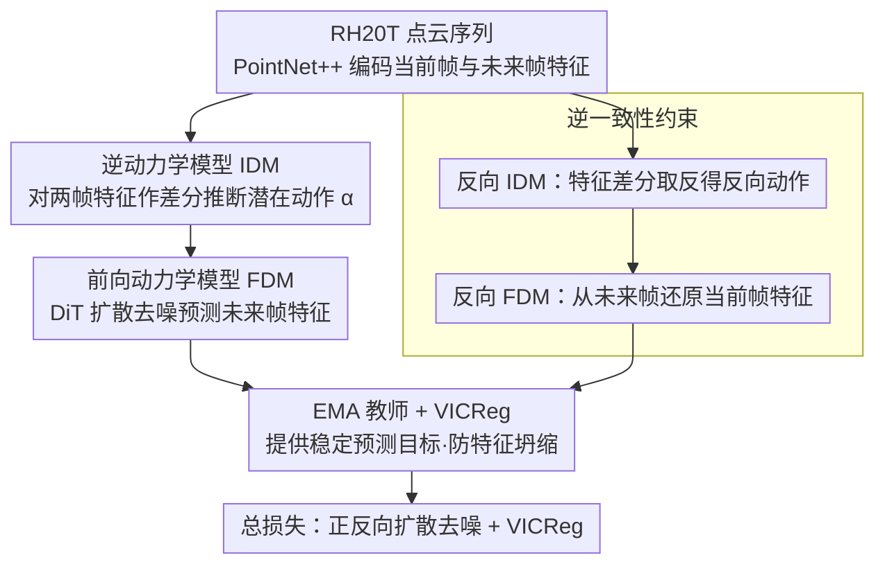

# AFRO: Bootstrap Dynamic-Aware 3D Visual Representation for Scalable Robot Learning

**会议**: CVPR 2026  
**arXiv**: [2512.00074](https://arxiv.org/abs/2512.00074)  
**代码**: [项目主页](https://kolakivy.github.io/AFRO/)  
**领域**: 图像分割  
**关键词**: 3D表征学习, 动态感知, 逆动力学模型, 前向动力学模型, 扩散Transformer, 机器人操控  

## 一句话总结
提出AFRO自监督3D视觉预训练框架，通过逆动力学模型（IDM）推断潜在动作、扩散Transformer前向动力学模型（FDM）预测未来特征、逆一致性约束保证时序对称性，在RH20T大规模数据上预训练后，MetaWorld 14任务平均成功率76.0%（vs DynaMo-3D 64.9%、PointMAE 63.9%），4个real-world任务也取得最优。

## 背景与动机
3D视觉表征在机器人操控中具有天然优势——提供精确的空间几何信息。然而现有3D预训练方法在下游机器人任务上表现不佳，主要有两个根本问题：

1. **缺乏动态感知**: 现有方法（PointMAE、Point-BERT等）使用单帧重建目标（mask-and-reconstruct），只能学到静态几何特征。机器人操控本质上是时序动态任务，需要理解场景随动作演变的动力学。

2. **背景冗余重建**: 点云重建目标对整个场景一视同仁，大量计算花在重建桌面、墙壁等与操控无关的静态背景上，而真正有用的信息集中在物体交互区域。

已有探索动态感知的方法（如DynaMo）仅处理2D图像，直接将其扩展到3D点云面临feature leakage和多模态不确定性等新挑战。

## 核心问题
如何让3D视觉预训练编码器自动学到与机器人操控相关的动态信息，而非仅学静态几何？如何在无需标注动作标签的条件下（野外视频）实现动态感知的自监督学习？

## 方法详解

### 整体框架

AFRO 是一个自监督的 3D 视觉预训练框架，目标是让点云编码器学到"与机器人操控相关的动态信息"，而不是只学单帧静态几何。它把"理解动作"拆成一对互逆的模型：逆动力学模型（IDM）从前后两帧推断"做了什么"（潜在动作），前向动力学模型（FDM）再根据当前帧和这个潜在动作预测"将会怎样"（未来特征）；逆一致性约束保证正反向时序对称、防止退化；外加 EMA 教师 + VICReg 提供稳定的预测目标并防特征坍缩。整套用 RH20T 大规模真实数据预训练，PointNet++ 当 backbone，全程无需任何动作标注。

### 关键设计

**1. 逆动力学模型 IDM——用特征差分推断"做了什么"，顺手堵住信息泄漏**

给定当前帧特征 $z_t$ 和未来帧特征 $z_{t+k}$，IDM 推断隐式潜在动作 $\alpha = f_{\text{IDM}}(z_{t+k} - z_t)$。关键是用差分 $z_{t+k}-z_t$ 而非拼接 $[z_t, z_{t+k}]$：差分天然把两帧都不变的静态背景减掉，强制 IDM 只盯发生变化的交互区域；更重要的是，若直接喂拼接，FDM 能从输入里"看到"目标帧、走捷径绕过动作推理（feature leakage），差分把这条捷径堵死。

**2. 前向动力学模型 FDM——用扩散 Transformer 建模未来的多模态不确定性**

给定当前帧 $z_t$ 和潜在动作 $\alpha$，FDM 预测未来特征 $\hat{z}_{t+k} = f_{\text{FDM}}(z_t, \alpha)$。难点在于同一状态加同一动作可能有多种合理结局，确定性回归器只会输出一个模糊均值。FDM 因此走扩散路线：基于 DiT（Diffusion Transformer）架构，用 AdaLN-Zero 把潜在动作 $\alpha$ 通过自适应 LayerNorm 注入，从噪声 $\hat{z}_{t+k}^{(T)}$ 逐步去噪到 $\hat{z}_{t+k}^{(0)}$，预测目标是 EMA 教师编码器产生的 target feature（而非原始点云），从而把"多种可能的未来"建模成一个分布而不是一个点。

**3. 逆一致性约束——用时序对称性提供双倍监督、防止退化**

直觉是：若 $z_t \xrightarrow{\alpha} z_{t+k}$ 成立，反向也应成立。于是再算一遍反向动作 $\alpha_{t+k \to t} = f_{\text{IDM}}(z_t - z_{t+k})$，并要求用它能还原回去 $\hat{z}_t = f_{\text{FDM}}(z_{t+k}, \alpha_{t+k \to t})$。这个约束逼 IDM/FDM 不能退化到 trivial solution，让潜在动作空间有结构（正反向互为逆操作），而且不需要任何标注就白拿一份监督信号。

**4. EMA 教师 + VICReg——给预测一个稳定目标并防特征坍缩**

预测目标如果跟着学生一起抖，训练会发散。AFRO 用慢速更新（$\tau \to 1$）的 EMA 教师编码器产生稳定的 target feature，再用 VICReg 损失把学生和教师的特征空间对齐：Variance 项防特征坍缩、Invariance 项做学生-教师对齐、Covariance 项减少特征维度间冗余。

### 预训练数据与损失

- **预训练数据**: RH20T（Robot Hands from 20 Tasks）——大规模真实机器人操控数据集，从 RGB-D 图像通过相机内参反投影得到点云
- **时间跳步 $k$**: 训练中随机采样，增强时间多尺度的动态学习
- **编码器**: PointNet++ 作为 3D backbone

总损失由正反向扩散去噪损失加 VICReg 构成：

$$\mathcal{L} = \mathcal{L}_{\text{FDM}}^{\text{fwd}} + \mathcal{L}_{\text{FDM}}^{\text{bwd}} + \lambda_{\text{VIC}} \mathcal{L}_{\text{VICReg}}$$

其中 $\mathcal{L}_{\text{FDM}}$ 为扩散去噪损失（预测噪声与真实噪声的 MSE）。

## 实验关键数据

### MetaWorld 14任务 平均成功率

| 方法 | 预训练方式 | 平均成功率 |
|------|-----------|-----------|
| PointMAE | 单帧重建 | 63.9% |
| Point-BERT | 单帧重建 | 60.2% |
| DynaMo-3D | 动态感知(确定性) | 64.9% |
| **AFRO** | **动态感知(扩散)** | **76.0%** |

AFRO相比DynaMo-3D提升+11.1%，相比PointMAE提升+12.1%。

### Adroit 2任务

| 方法 | Pen | Door | 平均 |
|------|-----|------|------|
| PointMAE | — | — | 较低 |
| DynaMo-3D | — | — | 中等 |
| **AFRO** | — | — | **最优** |

### Real-world 4任务
在4个真实机器人操控任务上，AFRO也取得最高成功率，验证sim-to-real迁移能力。

### 消融实验要点

| 消融项 | 效果变化 |
|--------|---------|
| 去掉IDM（无动态感知） | 显著下降 |
| FDM用MLP替代DiT | 下降（无法建模多模态不确定性） |
| 去掉逆一致性约束 | 下降（模型易退化） |
| 用拼接替代特征差分 | 下降（feature leakage） |
| 去掉VICReg | 下降（特征坍缩） |

## 亮点
- **特征差分解决feature leakage**: 用 $z_{t+k} - z_t$ 代替拼接是一个简洁但关键的设计，自然过滤静态背景并防止信息泄漏
- **扩散Transformer建模多模态未来**: 认识到机器人操控的多模态不确定性，用扩散过程比确定性回归更合理
- **逆一致性约束**: 无需额外标注就能获得双倍监督信号，同时增强潜在动作空间的结构性
- **大规模预训练 + 全面评估**: RH20T预训练 → MetaWorld + Adroit + real-world的完整验证链路
- **纯自监督**: 不需要任何人工标注的动作标签，可利用大量野外机器人视频

## 局限与展望
- **PointNet++编码器较老**: 未探索更现代的3D backbone（如PointTransformerV3、Mamba3D等）
- **扩散推理速度**: FDM的扩散去噪过程在推理时需要多步迭代，可能影响实时性
- **单一预训练数据集**: 仅用RH20T，未探索多数据集联合预训练或Internet-scale数据
- **任务范围**: 主要验证桌面操控任务，对导航、全身运动等复杂任务未验证
- **点云质量依赖**: 性能受RGB-D传感器质量和点云预处理的影响

## 与相关工作的对比
- **DynaMo (NeurIPS 2024)**: 2D图像上的动态感知预训练，用确定性MLP做FDM → AFRO扩展到3D并用扩散处理多模态性，MetaWorld +11.1%
- **PointMAE / Point-BERT**: 经典3D自监督方法，单帧mask-reconstruct → AFRO引入时序动态信息，本质上是从"什么样"升级到"怎么动"
- **R3M / VIP**: 2D视觉预训练用于机器人，基于时间对比学习 → AFRO在3D空间中通过物理一致的动力学模型学特征
- **SPA (Robotic Pretraining)**: 语义-几何联合预训练但无动态建模 → AFRO专注动态感知维度

## 启发与关联
- IDM + FDM的"做了什么"+"将会怎样"框架是一个通用的动态表征学习范式，可推广到自动驾驶、视频理解等领域
- 特征差分过滤静态背景的思路在video understanding中也有价值——光流的特征空间版本
- 扩散模型从生成领域进入表征学习领域，这是一个值得关注的趋势
- 逆一致性约束的思想与CycleGAN中的cycle consistency异曲同工，在自监督学习中是有力的正则化工具

## 评分
- 新颖性: ⭐⭐⭐⭐⭐ — IDM特征差分 + 扩散FDM + 逆一致性三个设计互相支撑，整体框架原创性强
- 实验充分度: ⭐⭐⭐⭐ — MetaWorld + Adroit + real-world + 消融完整，但缺少更多3D backbone的对比
- 写作质量: ⭐⭐⭐⭐ — 动机清晰，方法推导逻辑链完整，图示清楚
- 价值: ⭐⭐⭐⭐⭐ — 为3D机器人视觉预训练指明了动态感知方向，提升幅度显著

<!-- RELATED:START -->

## 相关论文

- [\[CVPR 2026\] SARMAE: Masked Autoencoder for SAR Representation Learning](sarmae_masked_autoencoder_for_sar_representation_learning.md)
- [\[ICCV 2025\] Region-based Cluster Discrimination for Visual Representation Learning](../../ICCV2025/segmentation/region-based_cluster_discrimination_for_visual_representation_learning.md)
- [\[CVPR 2026\] RDNet: Region Proportion-Aware Dynamic Adaptive Salient Object Detection Network in Optical Remote Sensing Images](rdnet_region_proportion-aware_dynamic_adaptive_salient_object_detection_network_.md)
- [\[CVPR 2026\] Masked Representation Modeling for Domain-Adaptive Segmentation](mrm_masked_representation_modeling_domain_adaptive.md)
- [\[AAAI 2026\] EAGLE: Episodic Appearance- and Geometry-Aware Memory for Unified 2D-3D Visual Query Localization](../../AAAI2026/segmentation/eagle_episodic_appearance-_and_geometry-aware_memory_for_unified_2d-3d_visual_qu.md)

<!-- RELATED:END -->
