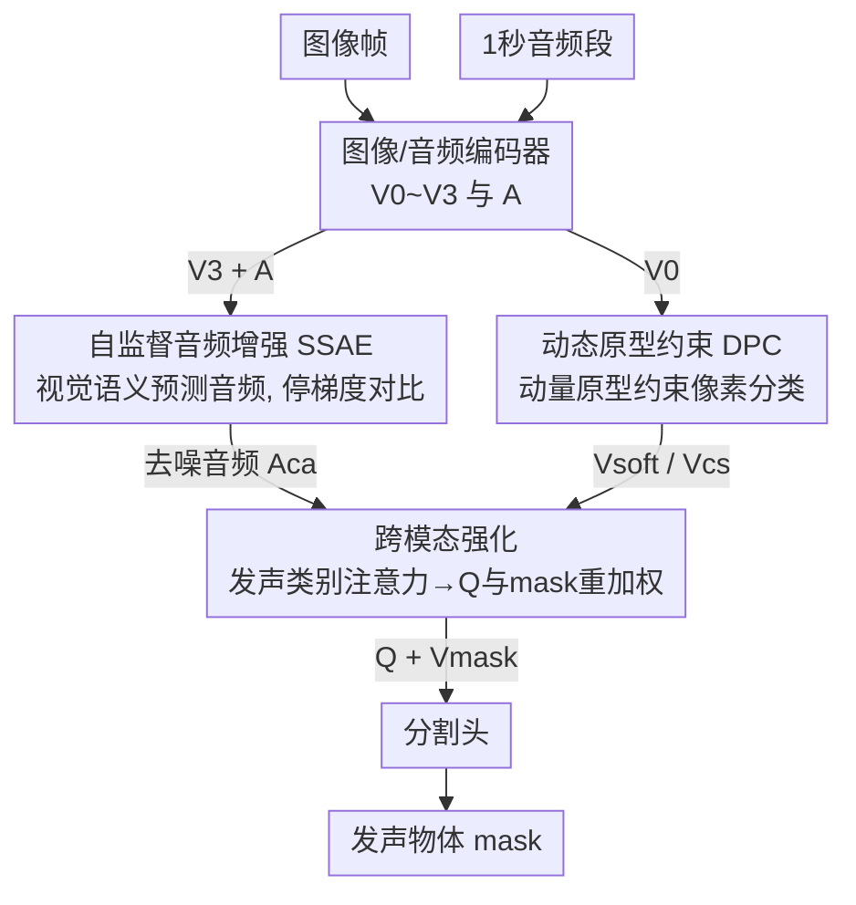

# Bootstrap Your Own AV-Proxies: Adaptive Contrastive and Prototype Learning for Audio-Visual Segmentation

**会议**: CVPR 2026  
**论文**: [CVF Open Access](https://openaccess.thecvf.com/content/CVPR2026/html/Zhang_Bootstrap_Your_Own_AV-Proxies_Adaptive_Contrastive_and_Prototype_Learning_for_CVPR_2026_paper.html)  
**代码**: 无  
**领域**: 视听分割 / 多模态  
**关键词**: 音视分割, 自监督对比学习, 原型学习, 跨模态对齐, 模态内去噪

## 一句话总结
针对音视分割（AVS）里"单模态内部噪声 + 音视语义鸿沟"两大顽疾，本文提出 BYOAVP：用 BYOL 式无负样本对比学习（SSAE）让视觉语义去监督音频、抑制画外音/背景音，再用动量更新的动态原型（DPC）做像素级分类并跨模态强化发声区域；无需 SAM/离线原型等任何先验，在 AVSBench + VPO 两个数据集六个子任务上全面刷到 SOTA。

## 研究背景与动机
**领域现状**：音视分割要在视频帧里把"正在发声的物体"逐像素抠出来。早期工作（AVSBench、CATR、AVSegFormer 等）主要做跨模态交互与时空关联，把音频当 query 去查询视觉特征做密集预测。近期一批方法转向引入先验来压噪：要么用 SAM / Semantic-SAM 生成的 mask 当视觉先验，要么用离线聚类出的原型中心引导像素聚类（COMBO、VCT、RAVS、DDESEG 都是这条路）。

**现有痛点**：两条主流路线各有硬伤。传统特征融合解码很难抑制"融合噪声"——视觉里目标和背景语义相近、音频里多个声源频率重叠，这些**模态内部的噪声**在跨模态融合时被一起放大，导致边界模糊、抠不全（如只抠到吉他身、丢了吉他头）。而依赖数据相关先验（SAM mask、离线原型）的方法虽然有效，却把音视相关性建模搞得很复杂，带来额外算力开销，且跨域泛化差——离线先验在 in-the-wild 数据上不灵。

**核心矛盾**：要压住模态内噪声、做到细粒度像素判别，现有手段要么压不干净（纯融合），要么靠外挂先验换来"复杂度↑、泛化↓"。本质是缺一个**全自适应、不依赖外部先验**的去噪与对齐机制。

**本文目标**：拆成两个子问题——(1) 怎么在不靠人工正负样本对、不靠固定阈值的前提下缩小音视语义鸿沟、给音频去噪；(2) 怎么不靠离线原型、在线地学出类别原型来约束像素分类并强化发声区。

**切入角度**：作者借鉴自监督对比学习里 BYOL / SimSiam 的"无负样本 + 停梯度"思路——既然这类方法能在没有显式负样本、对 batch size 不那么敏感的情况下学到稳定判别特征，那就把它从单模态搬到跨模态：把音频和视觉当成同一实例的两个"视图"，让高层视觉语义来预测、监督音频分支。

**核心 idea**：**用视觉语义去 bootstrap 音频（SSAE）+ 用在线动量原型约束像素（DPC）**，全程自适应、零先验，在抑制模态内噪声的同时实现细粒度音视像素对齐。

## 方法详解

### 整体框架
BYOAVP 输入一帧图像 + 对应 1 秒音频段，输出该帧发声物体的分割 mask（S4/MS3 二值、AVSS 语义级）。图像经分层编码器得到四级特征 $V_0\!\sim\!V_3$，音频经 CLAP 的 HTSAT 编码成 $A$。主干上挂两个核心模块：**SSAE** 拿最高层视觉特征 $V_3$ 去对齐、增强音频，产出去噪后的音频嵌入 $A_{ca}$；**DPC** 拿最底层视觉特征 $V_0$ 在动态原型约束下做像素分类，再让 $A_{ca}$ 与分类后的视觉特征跨模态交互，生成"目标增强"的 mask 特征 $V_{mask}$ 和语义对齐的 query $Q$，二者送进分割头出最终 mask。

整体是"编码 → 双路去噪（音频走 SSAE、视觉走 DPC）→ 跨模态强化 → 分割头"的串行 pipeline：

### 关键设计

**1. SSAE 自监督音频增强：把 BYOL 搬到跨模态，让视觉去监督音频**

针对"音频里画外音/背景音噪声重、且与视觉存在语义鸿沟"。做法是把音频、视觉当作同一实例的两个视图做 BYOL 式对比学习，但做了三处跨模态改造。第一，**投影前先跨模态对齐**：直接对齐 $V_{pool}$（$V_3$ 经注意力池化得到的全局视觉语义）和音频 $A$ 不现实，语义鸿沟太大，于是先过一层多头跨模态注意力，**以视觉 $V_{pool}$ 为 query、音频 $A$ 为 key/value**（强调此阶段音频主导），得到早对齐的音频 $A_{ca} = A + \mathrm{Softmax}\!\big((V_{pool}W_2^q)(AW_2^k)^\top/\sqrt{D}\big)(AW_2^v)$。第二，**双分支不共享权重**：即便对齐过，$V_{pool}$ 与 $A_{ca}$ 也不可能完全一致，所以两个投影头独立（区别于常规单模态对比学习的共享分支）。第三，**梯度只回传音频分支**：predictor 放在音频侧，把音频嵌入映射进视觉语义空间，损失用停梯度的负余弦相似度

$$\mathcal{L}_{ssc} = -\,\frac{\mathrm{sg}(V_{pool})\odot A_{pred}}{\|V_{pool}\|_2\,\|A_{pred}\|_2}$$

让"预测出的音频嵌入"去逼近视觉表示——视觉当作稳定教师（停梯度），反向传播只约束音频，从而压掉画外/背景声、放大发声物体语义。为什么有效：去掉人工正负样本对和预设阈值（CAVP/CPM/RAVS 都得手工构造），既提升 in-the-wild 泛化又降算力；针对 AVS 单卡训练 batch<8 的现实，把投影头最后一层 BatchNorm 换成对 batch 统计不敏感的 GroupNorm（$F = \mathrm{GN}(\mathrm{ReLU}(\mathrm{BN}(FW_1^p))W_2^p)$），缓解小 batch 下的优化不稳定。

**2. DPC 动态原型约束：在线动量原型约束像素分类，告别离线先验**

针对"视觉模态内噪声导致边界模糊、抠不准"。和靠 SAM mask / 离线原型中心的方法根本不同——DPC 不用任何离线先验，而是**随机初始化一个原型库** $P_{bank}\in\mathbb{R}^{K\times C_0}$（$K$ 为类别数），在训练中根据每个 batch 的类别分布在线更新。最底层视觉 $V_0$（展平成 $N\times C_0$）进入 Proto Tessellation：原型库与 $V_0$ 矩阵相乘得相似度 logits $P_l=V_0 P_{bank}^\top$，与投影到类空间的 $V_l$ 相加后过 Gumbel-Softmax 得可微软分配 $V_{soft}=\mathrm{Softmax}\big((V_0W_5^p+P_l+G_{noise})/\tau\big)$；对 $V_{soft}$ 沿空间维求和得每原型像素数 $P_{count}$，再 $V_{cs}=V_{soft}V_0/P_{count}$ 得到类别级语义嵌入。原型更新用动量 + 自适应权重：$w_{ada}=(1-w_m)(1+P_{count}/N)$，即某类在当帧像素占比越大、更新强度越大，兼顾稳定与自适应。为约束这套软分配，作者设计自适应原型损失 $\mathcal{L}_{ap}$：把 $P_l$ 放大 $\lambda_s=10$ 倍过 Log-Softmax 得 $P_{log}$，再用伪标签 $V_{soft}$ 加权、沿原型维求和取负均值

$$\mathcal{L}_{ap} = -\frac{1}{N}\sum_{n=1}^{N}\sum_{k=1}^{K} V_{soft}^{(n,k)}\odot P_{log}^{(n,k)}$$

让原型分布更可解释、更可分。为什么有效：在线动量原型随数据演化，跨域时不像离线原型那样失配，泛化更强。

**3. 跨模态强化：用去噪音频点亮发声区，同时喂给 query 和 mask**

针对"分出像素类别后，还得知道当前帧到底哪些类在发声、并把这些区域增强"。DPC 末端再插一层跨模态注意力：以去噪音频 $A_{ca}$ 为 query、类别嵌入 $V_{cs}$ 为 key/value，算出注意力分数 $w_s=\mathrm{Softmax}\big((A_{ca}W_3^q)(V_{cs}W_3^k)^\top\big)$——$w_s$ 表示当前帧存在的发声类别。一路把 $w_s$ 聚合成 query $Q=A_{ca}\odot\big(w_s(V_{cs}W_3^v)\big)$ 当作分割头的 query 输入；另一路把 $w_s$ 与软分配 $V_{soft}$ 相乘 reshape 成像素级类别权重图 $M=\mathrm{Reshape}(w_s V_{soft})$，再残差式增强 $V_{mask}=\mathrm{Reshape}(V_0+V_0\odot M)$ 喂进分割头。这样既在 query 层面注入"哪些类在响"，又在像素层面强化发声区、抑制无关区域，把音频信息从"全局有/无声"细化到"逐像素该不该亮"，显著提升细粒度判别。

### 损失函数 / 训练策略
总损失三部分：分割损失 $\mathcal{L}_{seg}=\mathcal{L}_{bce}+\mathcal{L}_{dice}+\lambda_f\mathcal{L}_{focal}$、自监督对比损失 $\mathcal{L}_{ssc}$、自适应原型损失 $\mathcal{L}_{ap}$，加权合成 $\mathcal{L}=\lambda_{seg}\mathcal{L}_{seg}+\lambda_{ssc}\mathcal{L}_{ssc}+\lambda_{ap}\mathcal{L}_{ap}$，系数取 $\lambda_{seg}{=}5,\lambda_{ssc}{=}0.1,\lambda_{ap}{=}1$。视觉编码器 Swin-B（ImageNet-21K 预训练），音频用 CLAP 的 HTSAT 官方权重，像素解码器用 Deformable DETR。batch size 4、AdamW、lr 1e-4、weight decay 0.05。

## 实验关键数据

### 主实验

AVSBench 三子任务（Transformer backbone，指标 J&F / J / F，越高越好）。BYOAVP 不用任何先验仍全面超过依赖 SAM/离线原型的方法（带 * 者用先验）：

| 数据集 | 指标 | BYOAVP | 第二名 | 提升 |
|--------|------|--------|--------|------|
| AVS-Object-S4 | J&F | **95.0** | 94.2 (DDESEG*) | +0.8 |
| AVS-Object-MS3 | J&F | **80.5** | 79.9 (AuralSAM2*) | +0.6 |
| AVS-Semantic | J&F | **69.6** | 67.9 (DDESEG*) | +1.7 |

> AuralSAM2 用 SAM2 + 1024×1024 高分辨率（本文仅 224×224），DDESEG 靠离线原型 + 边界框，BYOAVP 零先验仍领先。

VPO 合成数据集三子任务（更考验多目标 / 同类前景背景区分）：

| 子任务 | 指标 | BYOAVP | 第二名 | 提升 |
|--------|------|--------|--------|------|
| VPO-SS | J&F | **75.5** | 75.0 (RAVS*) | +0.5 |
| VPO-MS | J&F | **77.2** | 74.3 (DDESEG*) | +2.9 |
| VPO-MSMI | J&F | **71.5** | 69.3 (RAVS*) | +2.2 |

MS / MSMI 上的大涨幅说明在"多物体 + 同类多实例"场景的感知优势明显。代价是可训练参数 137.15M，比部分 Transformer 方法多约 33M，但作者认为相对视觉编码器 88M 可接受，总量仍低于 AVSegFormer。

### 消融实验

组件级（AVS-Object-MS3 / AVS-Semantic，J&F）：

| 配置 | MS3 J&F | AVSS J&F | 说明 |
|------|---------|----------|------|
| Baseline | 72.48 | 61.89 | 仅编码器+像素解码+分割头 |
| + SSAE | 76.22 | 65.08 | 单加音频去噪即涨 |
| + DPC | 77.98 | 67.40 | 单加原型约束即涨 |
| SSAE + DPC | **80.50** | **69.61** | 双模块，MS3 +8.02 / AVSS +7.72 |

SSAE 内部设计消融（CA=投影前跨模态注意力，BN/GN=投影末归一化，MS3 J&F）：

| CA | BN | GN | MS3 J&F | 说明 |
|----|----|----|---------|------|
| × | × | × | 77.98 | 关掉 SSAE（基线含 DPC） |
| ✓ | × | × | 77.54 | 只有 CA → 反而掉，引入模态偏置但没稳住嵌入空间 |
| × | ✓ | × | 76.95 | 只有 BN → 归一化补不了语义鸿沟 |
| × | × | ✓ | 77.77 | 只有 GN → 同上 |
| ✓ | ✓ | × | 78.85 | CA+BN |
| ✓ | × | ✓ | **80.50** | CA+GN，最佳 |

### 关键发现
- **SSAE 必须"投影前跨模态对齐 + 投影后归一化"联用**：单独开 CA / BN / GN 任一项都比不开 SSAE 还差（77.54/76.95/77.77 < 77.98）——CA 只引入模态偏置、归一化只稳数值，都补不了语义鸿沟，二者合体才生效。
- **小 batch 下 GN 显著优于 BN**：CA+GN 比 CA+BN 在 MS3/AVSS 上 J&F +1.65 / +0.85，因为 AVS 单卡 batch<8，GN 不依赖 batch 统计、优化更稳；t-SNE 显示 CA+GN 让音频特征更紧致可分，尤其在同超类/声学相近的"hard"类别上。
- **两模块互补且各自有效**：单独加 SSAE 或 DPC 都涨，合起来 MS3 涨 8.02、AVSS 涨 7.72，热力图显示噪声抑制和定位逐步改善。
- **多目标场景增益最大**：VPO-MS/MSMI 上分别 +2.9/+2.2，远超 SS 的 +0.5，说明跨模态强化对"同类多实例、前景背景混淆"特别管用。

## 亮点与洞察
- **把 BYOL/SimSiam 的"无负样本 + 停梯度"首次系统迁到跨模态去噪**：让视觉当稳定教师、梯度只回传音频，巧妙绕开了 AVS 里"手工正负样本对 + 阈值"的脆弱设定，泛化和算力双赢；这个"用强模态 bootstrap 弱模态"的范式可迁到任意音视/图文等不对称多模态任务。
- **投影前跨模态注意力是让跨模态对比学习成立的关键开关**：消融证明不先对齐就直接对比反而掉点——这点对所有想把单模态自监督搬到多模态的人都是重要警示。
- **GN 替 BN 这个工程细节被实证为决定性**：在 batch<8 的视频任务里，归一化选择直接左右自监督稳定性，是个高复用的 trick。
- **在线动量原型替代离线先验**：原型库随 batch 类别分布自适应更新（$w_{ada}$ 按像素占比缩放更新强度），既稳又能跨域，省掉 SAM/离线聚类的外挂。

## 局限与展望
- 作者层面：方法在两个 benchmark 六子任务上验证，但未深究失败案例与极端噪声边界。
- 自己发现的：① 参数量 137M 偏大（+33M），论文用"可接受"带过，但对部署/移动端不友好；② 原型库大小 $K$ 设为类别数，对开放词表 / 未知类别的扩展性存疑——固定 $K$ 假设了封闭类别集；③ SSAE 把音频段切成 1 秒硬对齐视频帧，对快速变化或多声源密集切换的音频，1 秒粒度是否够细未讨论；④ $\lambda_s{=}10$、各损失系数靠经验设定，敏感性只在补充材料，正文未给。
- 改进思路：把固定原型库换成可增长的（支持新类）、或让 $K$ 自适应；探索 SSAE 在更小/更大 batch 的稳定边界；把跨模态强化的 query 注入推广到 video query 级别处理时序。

## 相关工作与启发
- **vs RAVS / DDESEG（先验驱动）**：它们靠离线原型中心 + 边界框 / SAM mask 引导定位，BYOAVP 完全在线、零先验，跨域泛化更好且无需外部大模型；同等 backbone 下指标还全面反超。
- **vs CAVP / CPM（人工正负样本对比）**：它们跨视频样本手工构造正负对或设相似度阈值，BYOAVP 走 BYOL 式无负样本 + 停梯度，去掉人工对和阈值，in-the-wild 更鲁棒、算力更低。
- **vs SACL（SSL 任务里的对比学习）**：SACL 在声源定位里把单模态特征当双分支，BYOAVP 是真·跨模态——把音频和视觉当两个视图、用视觉预测音频，作者强调这是对自监督对比学习向跨模态表示对齐的新扩展。
- **vs AVSegFormer/CATR 等融合派**：它们用音频 query 查询视觉做融合解码，忽略模态内噪声；BYOAVP 先各自去噪再交互，从源头压住融合噪声。

## 评分
- 新颖性: ⭐⭐⭐⭐ 把 BYOL 式自监督对比首次系统迁到跨模态音频去噪 + 在线动量原型替代离线先验，组合扎实但单点均有出处。
- 实验充分度: ⭐⭐⭐⭐⭐ 两数据集六子任务全 SOTA，组件 + SSAE 内部双重消融 + t-SNE/热力图可视化齐全。
- 写作质量: ⭐⭐⭐⭐ 动机与模块讲得清楚，公式完整；个别符号（如 predictor 结构、$w_m$ 设定）细节散在文中略需拼读。
- 价值: ⭐⭐⭐⭐ 零先验、在线、低算力的 AVS 新范式，多目标场景增益明显，工程 trick（GN/投影前对齐）可复用性强。

<!-- RELATED:START -->

## 相关论文

- [\[CVPR 2026\] AFRO: Bootstrap Dynamic-Aware 3D Visual Representation for Scalable Robot Learning](bootstrap_dynamic-aware_3d_visual_representation_for_scalable_robot_learning.md)
- [\[ICCV 2025\] Implicit Counterfactual Learning for Audio-Visual Segmentation](../../ICCV2025/segmentation/implicit_counterfactual_learning_for_audio-visual_segmentation.md)
- [\[CVPR 2026\] SouPLe: Enhancing Audio-Visual Localization and Segmentation with Learnable Prompt Contexts](souple_enhancing_audio-visual_localization_and_segmentation_with_learnable_promp.md)
- [\[CVPR 2026\] Heuristic Self-Paced Learning for Domain Adaptive Semantic Segmentation under Adverse Conditions](heuristic_self-paced_learning_for_domain_adaptive_semantic_segmentation_under_ad.md)
- [\[ICML 2026\] LightAVSeg: Lightweight Audio-Visual Segmentation](../../ICML2026/segmentation/lightavseg_lightweight_audio-visual_segmentation.md)

<!-- RELATED:END -->
