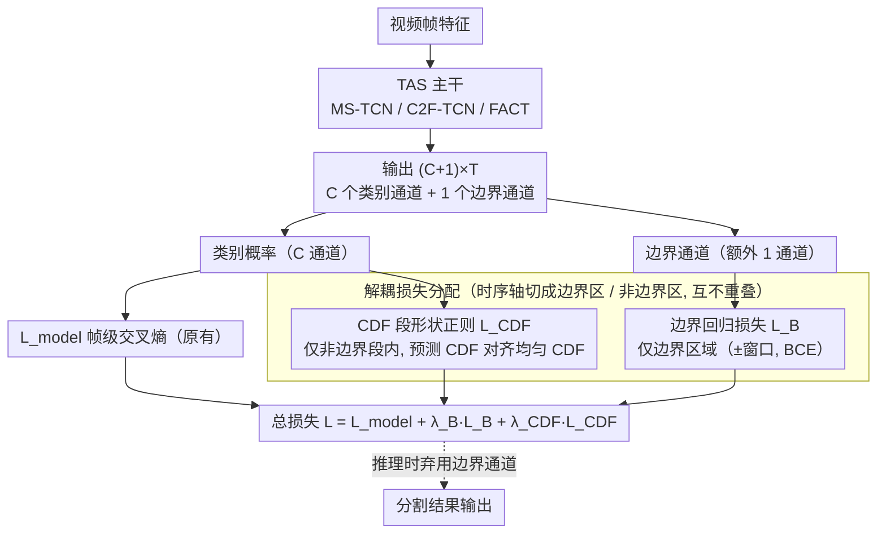

# Combining Boundary Supervision and Segment-Level Regularization for Fine-Grained Action Segmentation

**会议**: CVPR 2026  
**arXiv**: [2604.01859](https://arxiv.org/abs/2604.01859)  
**代码**: 无  
**领域**: 语义分割  
**关键词**: 时序动作分割, 边界监督, 段级正则化, CDF损失, 即插即用

## 一句话总结

提出一种轻量级双损失训练框架用于时序动作分割（TAS），仅增加一个边界输出通道和两个辅助损失（边界回归损失 + CDF 段形状正则化损失），在 MS-TCN、C2F-TCN、FACT 三种架构上一致提升 F1 和 Edit 分数，证明精确分割可以通过简单的损失设计而非更重的架构实现。

## 研究背景与动机

**领域现状**：时序动作分割（TAS）从 MS-TCN 等单路径模型逐步演进到 ASRF 和 FACT 等多路径框架，后者使用辅助模块进行边界精炼。虽然效果提升但增加了计算复杂度和参数量。帧级交叉熵损失仍是核心，但常导致过分割和边界错位。

**现有痛点**：(1) 帧级分类损失缺乏段级结构约束，在动作转换处预测不稳定导致过分割；(2) 现有边界建模方法（如 ASRF 的双分支设计、BCN 的级联框架）需要专门的辅助分支，增加了架构复杂度和推理成本；(3) 后处理精炼方法（如 ASOT）在训练目标之外操作，不直接影响模型的表示学习。

**核心矛盾**：如何在不增加显著架构复杂度的前提下，为 TAS 模型注入边界感知和段级结构约束？

**本文目标**：设计一种架构无关的训练时增强方案，用最小的修改（1 个额外输出通道 + 2 个辅助损失）在多种 TAS 架构上提升分割质量。

**切入角度**：边界监督和段级正则化可以作为纯粹的训练目标注入，不需要专门的架构分支。关键洞察是将边界和非边界区域的损失解耦分配，减少优化冲突。

**核心 idea**：(1) 用单通道边界回归直接从模型输出预测动作边界位置；(2) 用 CDF 段形状正则化在段级别约束预测的累积分布与 GT 一致，而非仅在帧级别对齐。

## 方法详解

### 整体框架

这篇论文想解决时序动作分割（TAS）里一个老问题：帧级交叉熵把每一帧当作独立的分类样本来训练，模型并不知道「一个动作段应该是连续的一整块」，于是在动作切换处反复横跳，产生过分割和边界错位。以往的解法（ASRF 的双分支、BCN 的级联模块）都靠往架构里塞专用分支或后处理来补救，代价是推理变重。

本文不动架构，只动损失。具体做法：给现有 TAS 模型（MS-TCN、C2F-TCN、FACT 都行）的输出端把输出张量从 $C\times T$ 扩到 $(C{+}1)\times T$，多出来的**一个**通道是类别无关的边界通道；然后在原有分类损失之外挂两个辅助损失——边界回归损失 $\mathcal{L}_B$ 管「边界对不对齐」，CDF 段形状正则化 $\mathcal{L}_{CDF}$ 管「段内连不连贯」。关键是这两个损失被**按时序区域分开**：边界损失只在转换点附近算，段正则只在段内部算，互不打架。推理时这个边界通道直接弃用，只取原始分类输出，所以零额外开销。

### 关键设计

**1. 边界回归损失 $\mathcal{L}_B$：用一个额外通道把「边界在哪」直接学进表示里**

过分割的一半原因是模型对「动作什么时候换」没有任何显式监督——它只被要求每帧分类正确，从没被告知哪些时刻是转换点。本文让模型多输出一条类别无关的边界概率曲线，监督信号是一张二值边界 mask：GT 里发生类别转换的时刻标 1，其余标 0。$\mathcal{L}_B$ 只在边界附近的一个时序窗口内对这条曲线做回归，逼模型在转换点附近给出尖锐的响应。和 ASRF 那种另起双分支再做后处理的路子不同，这里只是给输出层多接一个通道，边界感知是在训练阶段学进主干表示的；一旦训练完，这个通道在推理时根本不用，所以不带来任何额外计算。

**2. CDF 段形状正则化 $\mathcal{L}_{CDF}$：在段这一级约束预测的形状，而不是只盯着单帧**

帧级交叉熵的盲区在于它对「段内连贯性」毫无要求——只要每帧各自分对就给满分，哪怕段内预测概率忽高忽低、碎成几块也无所谓，这正是过分割的温床。本文换一个视角：对每个 GT 段，把预测概率沿时间累加成累积分布函数（CDF），再让它去对齐 GT 段那条均匀上升的理想 CDF，惩罚两者之间的差距。

$$\mathcal{L}_{CDF} = \sum_{\text{segments}} \big\| \mathrm{CDF}_{\text{pred}} - \mathrm{CDF}_{\text{GT}} \big\|$$

这个形式的灵感来自一维 Wasserstein 距离正好等于两个 CDF 之差的积分，但这里没有真去算最优传输，而是把它当成一个简单的段级形状约束直接监督。效果上，它逼着预测在每个段内呈现平滑、单调递增的累积曲线，相当于告诉模型「这一整段应该是同一个动作、别在中间断开」，从形状层面压住碎片化。一个工程细节是这个损失带 warm-up：要等帧级预测大致稳定后（如 MS-TCN 上第 20 epoch 起）才启用，否则早期预测还很乱时去对齐 CDF 反而干扰收敛；此外计算每段 CDF 时还会剔除靠近边界的 $\delta$ 帧，避免转换处的歧义标签污染段内监督。

**3. 解耦损失分配：把两个损失放到互不重叠的区域，避免梯度对冲**

边界处和段内部其实是两种相反的诉求：转换点需要预测**快速切换**类别，段内部需要预测**保持稳定**。如果把 $\mathcal{L}_B$ 和 $\mathcal{L}_{CDF}$ 不加区分地铺满整条时间轴，它们会在交界地带给出方向相反的梯度，互相抵消。本文的处理很直接——把时间轴切成边界区域和非边界区域，$\mathcal{L}_B$ 只在边界区域生效，$\mathcal{L}_{CDF}$ 只在非边界区域生效，让「切换」和「稳定」各管各的地盘。消融里「不解耦」版本明显弱于「解耦」版本，说明这步空间划分不是锦上添花，而是两个损失能共存的前提。

### 损失函数 / 训练策略

总损失就是在模型原有损失上线性叠加两个辅助项：

$$\mathcal{L} = \mathcal{L}_{\text{base}} + \lambda_B \cdot \mathcal{L}_B + \lambda_{CDF} \cdot \mathcal{L}_{CDF}$$

其中 $\lambda_B$、$\lambda_{CDF}$ 是权重超参，边界窗口大小也是手工设定的超参 ⚠️ 以原文为准。整套方案是纯训练时增强，推理阶段不引入任何额外通道、计算或后处理。

## 实验关键数据

### 主实验

| 模型 | 数据集 | F1@10 提升 | Edit 提升 | Acc 变化 |
|------|--------|-----------|----------|---------|
| MS-TCN | GTEA | +5.4% | +4.6% | 基本不变 |
| MS-TCN | 50Salads | 提升 | 提升 | 基本不变 |
| MS-TCN | Breakfast | 提升 | 提升 | 基本不变 |
| C2F-TCN | 全部数据集 | 一致提升 | 一致提升 | 基本不变 |
| FACT | 全部数据集 | 一致提升 | 一致提升 | 基本不变 |

### 消融实验

| 配置 | F1 | Edit | 说明 |
|------|-----|------|------|
| 基线 (无辅助损失) | 基线 | 基线 | 原始模型 |
| + $\mathcal{L}_B$ only | 提升 | 提升 | 边界感知有帮助 |
| + $\mathcal{L}_{CDF}$ only | 提升 | 提升 | 段结构约束有帮助 |
| + 两者(解耦分配) | 最优 | 最优 | 解耦组合效果最佳 |
| + 两者(不解耦) | 低于解耦版 | 低于解耦版 | 验证解耦的必要性 |

### 关键发现

- 帧级精度（Acc）基本不变但 F1 和 Edit 显著提升，说明改善来自段级连贯性和边界精度而非帧分类能力
- 在 MS-TCN 这种相对简单的架构上改善最大（+5.4% F1@10），说明简单模型从结构约束中受益最多
- 方法与后处理精炼（如 ASOT）互补——训练时优化表示，推理时可选择性叠加后处理
- 解耦损失分配是关键——不解耦时两个损失会互相冲突降低效果

## 亮点与洞察

- "用损失设计替代架构设计"的思路非常务实。一个额外通道 + 两个辅助损失就能在三种不同架构上一致提升，体现了良好的通用性
- CDF 段形状正则化是有趣的设计——将段级结构约束表达为 CDF 匹配问题，既简洁又有效。与 Wasserstein 距离的联系提供了理论支撑
- 解耦损失分配的设计虽然简单但关键——边界和段内是两种性质不同的优化目标，分区域处理避免了方向相反的梯度信号

## 局限与展望

- 实验仅在三个标准 TAS 数据集上验证，对更大规模或更复杂的数据集（如 Assembly101）的效果未知
- 边界窗口的大小是手工设定的超参数，对结果有一定影响
- 方法对帧级精度几乎无贡献，如果任务更关注帧级指标则价值有限
- 改进方向：可探索自适应的边界/非边界区域划分，或将 CDF 约束扩展到多粒度时序窗口

## 相关工作与启发

- **vs ASRF**: 同样引入边界监督但需要双分支架构和后处理，本文仅用单通道 + 损失函数
- **vs BCN**: 需要级联框架和 Barrier Generation Module，复杂度高得多
- **vs ASOT**: 后处理方法，与本文互补——本文优化训练目标，ASOT 优化推理输出

## 评分

- 新颖性: ⭐⭐⭐ CDF 正则化有新意，但整体是已有思路的组合
- 实验充分度: ⭐⭐⭐⭐ 三种架构、三个数据集、消融完整
- 写作质量: ⭐⭐⭐⭐ 动机清晰，方法简洁，图表直观
- 价值: ⭐⭐⭐⭐ 轻量即插即用方案对 TAS 社区有实用价值

<!-- RELATED:START -->

## 相关论文

- [\[NeurIPS 2025\] GTPBD: A Fine-Grained Global Terraced Parcel and Boundary Dataset](../../NeurIPS2025/segmentation/gtpbd_a_fine-grained_global_terraced_parcel_and_boundary_dataset.md)
- [\[CVPR 2026\] Weakly-Supervised Referring Video Object Segmentation through Text Supervision](wsrvos_weakly_supervised_rvos.md)
- [\[CVPR 2026\] PRUE: A Practical Recipe for Field Boundary Segmentation at Scale](prue_a_practical_recipe_for_field_boundary_segmentation_at_scale.md)
- [\[CVPR 2026\] SAP: Segment Any 4K Panorama](sap_segment_any_4k_panorama.md)
- [\[CVPR 2026\] Universal 3D Shape Matching via Coarse-to-Fine Language Guidance](universal_3d_shape_matching_via_coarse-to-fine_language_guidance.md)

<!-- RELATED:END -->
