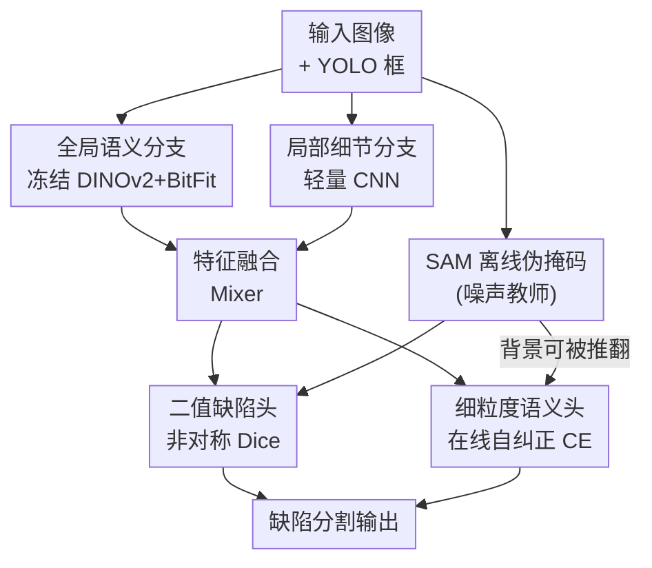

# Boxes2Pixels: Learning Defect Segmentation from Noisy SAM Masks

**会议**: CVPR 2026  
**arXiv**: [2604.11162](https://arxiv.org/abs/2604.11162)  
**代码**: https://github.com/CLendering/Boxes2Pixels (有)  
**领域**: 语义分割 / 弱监督 / 工业缺陷检测  
**关键词**: 框到像素蒸馏、噪声伪标签、SAM、DINOv2、自纠正

## 一句话总结
针对工业缺陷分割缺少像素级标注的痛点，本文把 SAM 当成"会出错的噪声教师"而非真值，用现成边界框离线生成伪掩码，再训练一个基于冻结 DINOv2 的轻量学生网络，配合二值定位头与"单向在线自纠正"损失抵抗伪标签噪声，在风电叶片缺陷数据集上以仅 5.6M 可训练参数（少 80%）把异常 mIoU 提升 +6.97、二值 IoU 提升 +9.71。

## 研究背景与动机
**领域现状**：工业巡检（如风电叶片）要做缺陷分割，但像素级标注昂贵且稀缺。常见的省钱做法是：先用边界框（YOLO 格式，已大量存在于现有巡检流水线）做弱监督，再用 Segment Anything Model (SAM) 把框 prompt 成伪掩码，当作密集监督来训学生网络。

**现有痛点**：SAM 在工业表面上生成的伪掩码**系统性地有噪声**——一方面对阴影、污渍、纹理过度分割产生假阳性；另一方面会漏掉细裂纹、低对比度缺陷产生假阴性。直接把这种伪掩码当真值监督，U-Net、SegFormer 这类常规分割网络会**过拟合教师的错误模式**，把教师的失败一并继承下来。

**核心矛盾**：缺陷在框内往往**稀疏、细长、占比极小**（数据集里缺陷像素常 <5% 图像面积），而 BoxInst/DiscoBox 这类框监督方法隐含假设"目标占框内大部分区域且空间紧凑"，在工业场景下这个假设被打破，模型容易塌缩成"把整个框填满"。同时真值标注本身就不完整：细微缺陷连框都没框上。

**本文目标**：在只有边界框的弱监督下，学一个推理时不依赖 SAM、能直接从图像密集分割缺陷的可靠学生模型，并且对教师伪标签的系统性噪声鲁棒。

**切入角度**：作者引用近期 WSSS 分析——"伪掩码质量的提升与最终分割精度的提升存在错配"，说明**怎么用伪标签**比**怎么生成伪标签**更关键。于是把重心从"造更好的掩码"转向"训练时如何对待噪声掩码"。

**核心 idea**：把 SAM 当噪声教师，用"语义稳定的表征 + 解耦的二值定位 + 单向自纠正"三件套，让学生在信任可靠监督的同时，敢于在自己高置信时推翻教师漏标的背景，专门抢救教师的假阴性。

## 方法详解

### 整体框架
输入是一张工业 RGB 图（训练时缩放到 $518\times518$），输出是两张全分辨率预测：一张二值缺陷图（前景/背景）和一张 $(K{+}1)$ 类细粒度语义图。训练前先离线用 SAM 把每个标注框 prompt 成单张二值伪掩码并栅格化成多类标签图 $\tilde{y}$（两类设定下 Dirt/Damage 映射为像素标签 1/2，背景为 0），存盘备用；推理时**完全不需要 SAM**。

学生是一个双分支层次结构：**全局语义分支**用冻结的 DINOv2 ViT-S/14 抽多层特征做自顶向下融合，提供抗高频伪影的语义稳定性；**局部细节分支**用轻量 CNN 直接从 RGB 抽高分辨率特征，保住细长缺陷的局部结构。两分支特征拼接后经特征混合器融合，再分别送进**二值缺陷头**和**细粒度语义头**。训练侧两个头各配一个针对噪声设计的损失：二值头用偏向召回的非对称 Dice，语义头用带"单向在线自纠正"的交叉熵。

### 关键设计

**1. 把 SAM 当噪声教师的离线框到像素蒸馏：解耦"造标签"和"用标签"**

痛点是直接拿 SAM 伪掩码当真值会让学生继承教师错误。作者反其道而行：每张图每个框 $b_{i,m}$ 单独喂给 SAM（只给框 prompt，不给点/掩码引导）得到单张二值掩码 $\tilde{y}_i^{(m)} = \mathrm{SAM}(x_i, b_{i,m})$，把类别 $k_{i,m}$ 赋给掩码内所有像素，栅格化成多类标签图。整个过程**离线**完成并存盘，既省掉训练时反复跑大 SAM 编码器的算力，也把"伪标签是噪声"这件事显式摆到训练目标里去处理。学生学的是 $S_\theta: x \mapsto \hat{y}\in[0,1]^{H\times W\times(K+1)}$，目标函数被设计成对教师的系统性错误鲁棒，而不是盲目对齐——这是后面所有设计的前提。

**2. 冻结 DINOv2 + BitFit 的层次学生架构：用语义稳定性压住伪影**

常规分割网络（U-Net/SegFormer）端到端可训，容量大反而更容易记住 SAM 伪掩码里的高频伪影和虚假边界。本文用冻结的 DINOv2 ViT-S/14 当语义骨干，**只用 BitFit 风格只更新 bias 和归一化层参数**做轻量域适应——自监督 Transformer 表征对高频噪声不敏感，冻结骨干又限制了暴露给噪声伪标签的有效容量，天然抗过拟合。具体地，从层 $L=\{1,2,4,7\}$ 抽中间激活，各自经 $1\times1$ 卷积投影到统一宽度，再自顶向下融合：最深的 $F^{(7)}$ 初始化 $F_{\text{deep}}$，每个残差融合块把它与更浅的横向特征 $F_{\text{skip}}$ 相加后过一个 Conv–BN–ReLU–Conv–BN 模块 $\phi$，再加残差走 ReLU：

$$F_{\text{out}} = \sigma\!\left(\phi(F_{\text{deep}} + F_{\text{skip}}) + (F_{\text{deep}} + F_{\text{skip}})\right)$$

融合后用 PixelShuffle 逐级上采样到 $H/4\times W/4$。并行的局部细节分支用两个 stride-2 的 Conv–BN–ReLU 把图降到同样 $H/4\times W/4$，补回 ViT patch 分辨率丢掉的细长高频结构。两分支拼接后过 $3\times3$ Conv–BN–ReLU 特征混合器得到 $F_{\text{fusion}}$，在语义一致性与空间细节之间取舍。

**3. 辅助二值定位头：把"找稀疏前景"和"判类别"解耦**

缺陷占比极小，如果只用一个多类语义头，区域损失会被背景像素主导，模型倾向于不分割或塌缩到框。作者额外加一个二值缺陷头，专门预测前景/背景，与细粒度语义头共享 $F_{\text{fusion}}$ 但优化不同目标（结构定位 vs 语义判别）。二值头用**非对称 Dice 损失**，故意下调假阳性权重 $\beta\in(0,1)$（默认 0.4）把优化偏向召回：

$$\mathcal{L}_{\text{bin}} = 1 - \frac{\langle p, g\rangle + \epsilon}{\langle p, g\rangle + \beta\langle p, 1-g\rangle + \langle 1-p, g\rangle + \epsilon}$$

其中 $g_i = \mathbb{1}[\tilde{y}_i>0]$ 是从伪掩码导出的二值目标，$\beta<1$ 意味着漏检比轻微过分割代价更高——这正符合工业巡检"宁可多框一点也别漏缺陷"的诉求。消融显示去掉这个头掉点最猛（异常 mIoU 从 0.5093 暴跌到 0.3851），说明显式结构监督是把稀疏缺陷从背景主导的伪标签里捞出来的关键。

**4. 单向在线自纠正损失：只放宽背景，专门抢救教师漏标的缺陷**

最妙的一笔。教师和框标注都会把细微缺陷当成背景（假阴性），直接拿伪标签监督会把这些漏标传播下去。作者让语义头敢于"造反"：当某像素伪标签是背景（$\tilde{y}_i=0$）、但学生以高于阈值 $\tau$ 的置信度认定它是某个缺陷类时，就把该像素的训练目标改成学生预测的类：

$$\tilde{y}_i^{\text{corr}} = \begin{cases} \arg\max_{c>0} p_{i,c}, & \text{if } \tilde{y}_i=0 \ \land\ \max_{c>0}p_{i,c} > \tau \\ \tilde{y}_i, & \text{otherwise} \end{cases}$$

关键在于**单向**：只有背景标签有资格被推翻，已标注的缺陷区域绝不改动。这避免了双向纠正常见的语义漂移。纠正在每个 mini-batch 在线计算、不改原数据集，且有 warm-up 阶段先用 $\tilde{y}^{\text{corr}}=\tilde{y}$ 稳住早期训练。阈值取得很保守（$\tau=0.9$），确保只有极高置信的预测才能覆盖监督。语义头用类加权交叉熵 $\mathcal{L}_{\text{fine}}=\mathrm{CE}(\hat{y}_{\text{fine}}, \tilde{y}^{\text{corr}})$ 缓解前景背景极度不平衡。和主流"噪声拒绝/降权"思路相反，它做的是**受控的纠正**，专打假阴性

### 损失函数 / 训练策略
总损失为二值定位与语义判别的等权组合：$\mathcal{L}_{\text{total}} = \lambda_{\text{bin}}\mathcal{L}_{\text{bin}} + \lambda_{\text{fine}}\mathcal{L}_{\text{fine}}$，其中 $\lambda_{\text{bin}}=\lambda_{\text{fine}}=0.5$（两者归一化后量级相当，等权收敛稳定）。用 AdamW + 余弦学习率，初始 lr $5\times10^{-4}$、weight decay $1\times10^{-2}$，梯度 $\ell_2$ 裁剪到 1.0 稳住噪声监督下的训练。维护衰减 0.999 的 EMA 权重用于验证和推理。非对称 Dice 的 $\beta=0.4$，自纠正阈值 $\tau=0.9$ 且 warm-up 期内关闭。

## 实验关键数据

数据集：DTU 风电叶片无人机巡检数据集（约 13,000 张 $586\times371$ RGB，仅有 YOLO 框标注，两类 damage/dirt）。训练只用框→SAM 伪掩码；为可靠评测，单独手工像素级标注了一个测试集做真值。验证集对 SAM 伪标签算指标（仅用于选模型/早停），测试集对人工真值算指标。

### 主实验
所有模型在相同框监督（SAM 伪掩码）下训练，测试集对人工像素真值评测：

| 模型 | mIoU | mIoU$_{\text{anom}}$ | F1$_{\text{anom}}$ | IoU$_{\text{bin}}$ |
|------|------|------|------|------|
| U-Net | 0.7057 | 0.5629 | 0.7036 | 0.5427 |
| DeepLabV3-B2 | 0.6867 | 0.5342 | 0.6955 | 0.5331 |
| SegFormer-B2 | 0.7231 | 0.5881 | 0.6939 | 0.5312 |
| **Boxes2Pixels (ours)** | **0.7661** | **0.6523** | **0.7674** | **0.6226** |

相比最强基线 SegFormer-B2，异常 mIoU +0.0642、二值 IoU 从 0.5312 提到 0.6226（+0.0914），说明前景定位显著改善。

### 消融实验
验证集对 SAM 伪标签评测（反映与噪声教师的一致性，用于相对比较）：

| 配置 | mIoU | mIoU$_{\text{anom}}$ | F1$_{\text{anom}}$ | IoU$_{\text{bin}}$ | 说明 |
|------|------|------|------|------|------|
| Boxes2Pixels (Full) | 0.6709 | 0.5093 | 0.6761 | 0.5107 | 完整模型 |
| w/o 局部细节分支 | 0.6655 | 0.5013 | 0.6631 | 0.4960 | 小幅但稳定下降 |
| w/o 二值头 | 0.5868 | **0.3851** | 0.5693 | 0.3979 | 掉点最猛 |
| w/o 自纠正 | 0.6679 | 0.5049 | 0.6622 | 0.4949 | 验证集上变化很小 |

自纠正单独在**测试集**（人工真值）上验证其价值（两模型仅差是否开启纠正）：

| 方法 | mIoU$_{\text{anom}}$ | F1$_{\text{anom}}$ | IoU$_{\text{bin}}$ | Recall$_{\text{bin}}$ |
|------|------|------|------|------|
| w/o 自纠正 | 0.5826 | 0.6889 | 0.5255 | 0.6195 |
| w/ 自纠正 (Ours) | **0.6523** | **0.7674** | **0.6226** | **0.8051** |
| 提升 | +0.0697 | +0.0785 | +0.0971 | **+0.1856** |

### 关键发现
- **二值头贡献最大**：去掉后异常 mIoU 从 0.5093 跌到 0.3851，证实"解耦稀疏前景发现与细粒度分类"是抵抗背景主导伪标签的核心。
- **自纠正的价值要在真值集才看得出**：验证集对 SAM 伪标签评测时几乎无变化（伪标签本就缺失它要抢救的缺陷），但在人工真值测试集上二值召回从 0.6195 飙到 0.8051（+0.1856），直接解决"漏检"这个工业最致命的风险，且未明显增加假阳性、无语义漂移。
- **分类型分析**：Boxes2Pixels 在 Damage 上持平最强基线（71.65 vs SegFormer 71.48），却把易混淆的 Dirt 从 46.13 大幅拉到 58.81，说明不是用结构缺陷换污渍线索，而是两类齐升。
- **效率**：仅 5.6M 可训练参数（比全可训基线少 80%），却拿到最低延迟 6.20ms、最高 161.4 FPS（H100），可实时部署。

## 亮点与洞察
- **"单向自纠正"是点睛之笔**：只允许"背景→缺陷"的纠正、不允许反向，既抢救了教师漏检又用单向性 + 高阈值 + warm-up 三重保险防止语义漂移。这种"非对称信任教师"的思路可迁移到任何"教师召回不足、宁可错杀不可放过"的噪声蒸馏场景。
- **把验证集和测试集分别承担不同评测语义**：验证集对噪声伪标签算指标只用来选模型，测试集对人工真值算指标才下结论——并由此解释了"为什么自纠正在验证集上看不出效果却在测试集大涨"，方法论上诚实且有说服力。
- **冻结骨干 + BitFit 既省参数又抗噪声**：限制暴露给噪声标签的有效容量，把"参数效率"和"鲁棒性"统一到同一个设计动机里，而非两件独立的事。
- **辅助二值头解耦定位与分类**：当目标稀疏、类别不平衡极端时，单独拉一个"只管有没有前景"的头去扛 recall，比让多类头一肩挑更稳——这个 trick 对小目标/稀有类分割普遍有用。

## 局限与展望
- **数据集单一**：只在一个风电叶片数据集、两类缺陷（damage/dirt）上验证，是否泛化到其他工业表面（金属、PCB、纺织等）和更多类别未知。
- **测试真值规模有限**：人工像素标注只覆盖一个 held-out test split，绝对指标的统计稳健性受限于这个集合大小。
- **自纠正依赖单一阈值 $\tau=0.9$**：高阈值保守、安全，但可能仍漏掉一些置信度没到 0.9 的真实缺陷；阈值如何自适应、是否随训练动态调整未探讨。
- **教师质量上限**：方法专攻教师假阴性（漏标），对教师假阳性（把阴影/污渍当缺陷）主要靠 DINOv2 语义稳定性与 $\beta<1$ 间接压制，没有像处理假阴性那样设计显式机制——若教师假阳性更严重，效果可能打折。
- **可改进**：把单向纠正扩展成置信度感知的软标签、或引入教师-学生不一致区域的不确定性加权，可能在抑制假阳性上更进一步。

## 相关工作与启发
- **vs BoxInst / DiscoBox（框监督分割）**：它们用投影约束 + 像素亲和度，隐含假设目标占框内大部分且空间紧凑；本文指出工业稀疏细长缺陷违反该假设会导致"填满整个框"，改用 SAM 提供与框内填充率无关的显式像素先验。
- **vs MobileSAM / FastSAM / EfficientViT-SAM（SAM 蒸馏）**：那些是训轻量学生去逼近 SAM 输出（把 SAM 当真值）；本文恰恰相反，把 SAM 当**噪声教师**，重点不在复刻 SAM 而在抵抗它的系统性错误。
- **vs PatchCore / WinCLIP（无监督异常定位）**：它们检测偏离正常流形的异常但不给缺陷类型分割，无法支撑下游报告/维修规划；本文做的是带类别的细粒度缺陷分割。
- **vs 主流噪声标签学习（Sel-CL、不确定性降权、cross-teaching）**：主流是"噪声拒绝"——降权或忽略教师可能错的区域；本文强调"受控自纠正"，在学生高置信时主动覆盖背景监督去抢救假阴性，是方向相反的一招。

## 评分
- 新颖性: ⭐⭐⭐⭐ 单向在线自纠正 + 把 SAM 当噪声教师的视角组合清新，虽各组件均有出处但针对工业稀疏缺陷的痛点拼得很对症。
- 实验充分度: ⭐⭐⭐⭐ 主实验/消融/自纠正专项/分类型/效率五张表齐全，且诚实地区分验证集与真值测试集；但仅单数据集两类，泛化性待补。
- 写作质量: ⭐⭐⭐⭐ 动机推导清晰，把"为什么自纠正只在真值集见效"讲得透；公式与设计动机对应明确。
- 价值: ⭐⭐⭐⭐ 直击工业巡检"无像素标注 + 漏检致命"的真实痛点，5.6M 参数实时可部署，落地性强。

<!-- RELATED:START -->

## 相关论文

- [\[CVPR 2026\] Spatial-SAM: Spatially Consistent 3D Electron Microscopy Segmentation with SDF Memory and Semi-Supervised Learning](spatial-sam_spatially_consistent_3d_electron_microscopy_segmentation_with_sdf_me.md)
- [\[NeurIPS 2025\] SAM-R1: Leveraging SAM for Reward Feedback in Multimodal Segmentation via Reinforcement Learning](../../NeurIPS2025/segmentation/sam-r1_leveraging_sam_for_reward_feedback_in_multimodal_segmentation_via_reinfor.md)
- [\[ECCV 2024\] Learning Camouflaged Object Detection from Noisy Pseudo Label](../../ECCV2024/segmentation/learning_camouflaged_object_detection_from_noisy_pseudo_label.md)
- [\[CVPR 2026\] M4-SAM: Multi-Modal Mixture-of-Experts with Memory-Augmented SAM for RGB-D Video Salient Object Detection](m4-sam_multi-modal_mixture-of-experts_with_memory-augmented_sam_for_rgb-d_video_.md)
- [\[CVPR 2025\] Mask-Adapter: The Devil is in the Masks for Open-Vocabulary Segmentation](../../CVPR2025/segmentation/mask-adapter_the_devil_is_in_the_masks_for_open-vocabulary_segmentation.md)

<!-- RELATED:END -->
