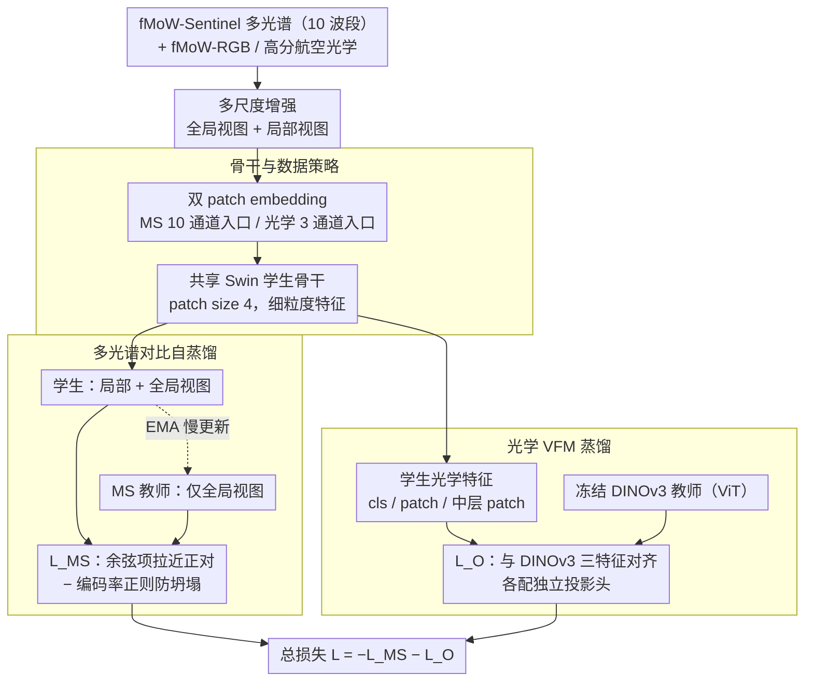

# Brewing Stronger Features: Dual-Teacher Distillation for Multispectral Earth Observation

**会议**: CVPR 2026  
**arXiv**: [2602.19863](https://arxiv.org/abs/2602.19863)  
**代码**: [项目页](https://wolfilip.github.io/DEO/)  
**领域**: 图像分割  
**关键词**: 遥感基础模型, 多光谱, 知识蒸馏, 对比学习, 双教师训练  

## 一句话总结

提出**DEO(Distillation for Earth Observation)**，一种双教师对比蒸馏框架——用多光谱自蒸馏教师学习光谱表示、用光学VFM教师（DINOv3）注入高级语义先验，使单一学生网络同时擅长光学和多光谱遥感任务，在语义分割、变化检测和分类上全面达到SOTA。

## 研究背景与动机

**领域现状**：基础模型正在改变遥感(EO)领域，大量无标注数据+灵活的任务适配使其在标注稀缺的EO中特别有价值。但EO传感器和模态多样，训练单一通用模型**不现实**，多个专用基础模型将共存。

**现有痛点**：
   - 大多数EO预训练使用**掩码图像建模(MIM)**，强调局部重建但对全局语义结构**控制有限**
   - 通用VFM（如DINOv2/DINOv3）拥有强大的光学语义先验，但缺乏多光谱(MS)能力
   - 从头训练MS基础模型**计算昂贵**

**核心矛盾**：如何高效地将VFM的强大光学语义先验迁移到多光谱学生，同时**不损害MS特有信息的学习**？现有方法（如Copernicus-FM）将MIM与VFM蒸馏结合，但MIM目标与VFM的对比自蒸馏目标**不兼容**，导致全局语义结构较弱。

**本文目标**：提出一种预训练策略，使模型在多光谱数据可用时表现出色，同时在仅光学任务上不牺牲性能。

**切入角度**：**匹配学生与VFM教师的预训练目标**——如果VFM是用对比自蒸馏训练的，那学生也应该用对比自蒸馏，这样潜在特征空间更容易对齐。

**核心idea**：双教师 = 多光谱对比自蒸馏教师（结构化MS特征空间）+ 光学VFM冻结教师（提供全局语义先验），统一在对比蒸馏框架下。

## 方法详解

### 整体框架

DEO 想要的是一个**单一学生网络**，既能吃多光谱（MS）输入又能吃光学（RGB）输入，且两边都强。它用一张共享骨干、两套教师把这件事串起来：从一张 Sentinel-2 多光谱图像出发，先做多尺度增强生成全局/局部视图，然后兵分两路喂给同一个学生。一路是**多光谱分支**，学生和一个 EMA 更新的 MS 教师做对比自蒸馏，逼学生学出结构化的光谱特征；另一路是**光学分支**，学生和一个冻结的 DINOv3 教师做特征蒸馏，把现成的光学语义先验灌进来。学生本体是 Swin Transformer 骨干，前面挂一个双 patch embedding（MS 走 10 通道、光学走 3 通道），之后所有 Transformer 层共享——这样两种模态最终落到同一个特征空间里。

### 关键设计

**1. 多光谱对比自蒸馏：用对比目标而非 MIM 来撑起全局语义**

遥感预训练长期靠掩码图像建模（MIM），它擅长局部重建却管不住全局语义结构，这正是现有 MS 基础模型语义偏弱的根因。DEO 改走 DINO 那套对比自蒸馏：MS 教师的权重由学生的 EMA 缓慢更新，学生看局部+全局视图、教师只看全局视图，逼学生把不同视图映射到一致的特征上。损失同时压缩和膨胀特征空间——余弦项把正对拉近，编码率正则项把整体表示撑开防止坍塌：

$$\mathcal{L}_{MS} = \mathcal{L}_\text{cos}(p_M(\mathbf{z}_g^M), p_s^{MS}(\mathbf{z}_{g \cup l}^M)) - \gamma \mathcal{L}_{CR}(\cdot)$$

其中编码率正则项 $\mathcal{L}_{CR} = -\log\det(\mathbf{I} + \text{Cov}[\mathbf{z}])$ 度量特征协方差的体积，越大说明特征越铺得开。它替代了传统对比学习里靠负样本/温度缩放来防坍塌的做法，更直接地约束表示不退化到一个点。这样学出来的光谱表示对分布偏移不变、语义更结构化。

**2. 光学 VFM 蒸馏：匹配教师目标，把 DINOv3 的语义灌进多光谱学生**

VFM（如 DINOv3）有极强的光学语义先验，但完全不懂多光谱；从头训一个 MS 基础模型又太贵。DEO 的关键洞察是：**学生的预训练目标要和教师的训练目标对上**——DINOv3 本身就是对比自蒸馏训出来的，所以让学生也用对比自蒸馏，两边的潜在特征空间才容易对齐，蒸馏才不别扭（这恰是 MIM+VFM 那条路走不通的原因）。具体蒸馏三类特征、各配独立投影头：

$$\mathcal{L}_O = \alpha_1 \mathcal{L}_\text{cos}(\text{[cls]}_F) + \alpha_2 \mathcal{L}_\text{cos}(\text{[p]}_F) + \alpha_3 \mathcal{L}_\text{cos}(\text{[p]}_\text{mid})$$

三项分别对应最终层 class token $\text{[cls]}_F$（全局语义）、最终层 patch token $\text{[p]}_F$（像素级特征）、中间层 patch token $\text{[p]}_\text{mid}$（中层语义）。只蒸馏 class token 对分割这类 dense prediction 任务远不够，必须把 patch-level 特征也传过去；而中间层 patch token 又补上了一层互补的中层信息。值得注意的是教师是 ViT、学生是 Swin，跨架构蒸馏照样成立。

**3. 骨干与数据策略：用 Swin 换更细的分辨率，用高分光学补低分波段**

dense prediction 吃特征分辨率，而 ViT 的 patch size 16 太粗。DEO 把学生换成 Swin Transformer（patch size 4），直接拿到更精细的特征图。数据上混用 fMoW-Sentinel（多光谱）和 fMoW-RGB（光学）联合预训练；由于 Sentinel-2 的光学波段本身分辨率低（10–60m），作者用约 15 万张高分辨率航空图替换掉低分辨率光学波段，给光学分支喂更清晰的监督。前端的双 patch embedding 让 10 通道 MS 和 3 通道光学各走各的入口，之后共享 Transformer——既隔开了模态差异，又让语义在共享层里融合。

### 损失函数

两条分支的目标联合优化，总损失为：

$$\mathcal{L} = -\mathcal{L}_{MS} - \mathcal{L}_O$$

权重系数取 $\alpha_1=1,\ \alpha_2=0.5,\ \alpha_3=0.5,\ \gamma=1$。

## 实验关键数据

### 主实验：语义分割（mIoU）

**光学分割：**

| 方法 | SpaceNet | GB-cattle | GB-pv | GB-chesa. | 平均 |
|------|----------|-----------|-------|-----------|------|
| DINOv3-B (RGB) | 79.06 | 73.01 | 94.34 | 64.04 | 77.61 |
| Copernicus-FM (MS) | 75.45 | 68.88 | 93.56 | 55.81 | 73.43 |
| **DEO** | **82.22** | 76.22 | **95.36** | **75.08** | **82.22** |

**多光谱分割：**

| 方法 | GB-SA-crop | GB-cashew | S1F11 | PASTIS | 平均 |
|------|-----------|-----------|-------|--------|------|
| TerraFM (MS) | 30.95 | 59.49 | 92.72 | 19.65 | 50.70 |
| Copernicus-FM (MS) | - | 55.71 | 92.58 | 21.49 | 51.11 |
| **DEO** | **36.59** | **65.60** | **93.30** | **23.06** | **63.51** |

- MS分割平均**+4.20 pp**超越SOTA（63.51 vs 51.11）

### 变化检测（F1）

| 方法 | LEVIR (光学) | OSCD (MS) | 平均 |
|------|-------------|-----------|------|
| DINOv3-LS | 91.8 | 57.2 | 74.5 |
| TerraFM | 89.5 | 57.5 | 73.5 |
| **DEO** | **91.3** | **59.2** | **75.3** |

### 分类（线性探测）

| 方法 | m-bigearthnet F1 | m-so2sat Top1 | m-eurosat Top1 | 平均 |
|------|-----------------|---------------|----------------|------|
| DINOv3-B | 55.48 | - | 93.3 | - |
| TerraFM | - | 47.57 | 93.1 | 67.61 |
| **DEO** | **58.43** | **53.09** | **93.8** | **68.44** |

### 消融实验

| 组件 | 光学平均 | MS平均 | 总平均 |
|------|----------|--------|--------|
| 基础(仅MS自蒸馏) | 77.87 | 60.44 | 69.16 |
| +DINOv3 [cls] | 79.07 (+1.20) | 62.81 (+2.37) | 70.94 |
| +独立光学路径 | 81.20 (+2.13) | 62.69 (-0.12) | 71.95 |
| +DINOv3 [p] | 81.74 (+0.53) | 62.46 | 72.10 |
| +光学增强 | 81.95 | 63.02 (+0.55) | 72.48 |
| +高分辨率光学 | 82.22 (+0.27) | 63.51 (+0.50) | 72.87 |

### 关键发现

1. **光学VFM蒸馏不仅提升光学性能，也显著提升MS性能**：加入DINOv3 [cls]蒸馏后MS平均+2.37pp
2. **目标兼容性关键**：对比自蒸馏目标与DINOv3的训练目标匹配，使特征空间自然对齐（图3中PCA可视化证实）
3. **所有组件累加有效**：从基础69.16到完整72.87，每个组件都有正贡献
4. **DEO综合排名第一**：在11个评测中平均排名最高（表4），且模型仅87M参数、预训练数据仅50万张

## 亮点与洞察

1. **目标兼容性洞察深刻**：学生的预训练目标应与教师模型的训练目标匹配——这解释了为什么MIM+VFM蒸馏（如Copernicus-FM）效果不如对比蒸馏+VFM蒸馏
2. **效率优秀**：仅50万张图训练（TerraFM用1800万张），87M参数（DINOv3-LS 303M），16×A100训练100epoch，就达到全面SOTA
3. **"不损害"的多模态**：增加MS能力不牺牲光学性能——这在多模态基础模型中难能可贵
4. **Swin替代ViT**：patch size 4产生的精细特征对dense prediction很关键，即使教师是ViT也可以跨架构蒸馏

## 局限与展望

1. **仅覆盖Sentinel-2的10个波段**：未处理SAR、热红外等更多模态
2. **空间分辨率受限**：Sentinel-2原生10-60m分辨率，虽部分替换了高分光学数据但MS波段仍为低分辨率
3. **fMoW数据集的地理偏差**：主要覆盖特定区域，对极地、海洋等区域泛化未知
4. 未探索更大规模的学生模型是否能进一步受益

## 相关工作与启发

- **DINOv3**：最新的视觉基础模型，特别关注遥感领域——DEO证明了高效利用其知识而非从头竞争的正确性
- **编码率正则化**：来自MCR²（Ma et al.），替代传统对比学习中的负样本/温度缩放，更优雅地防止表示坍塌
- **对遥感社区的启发**：与其投入巨大算力从头训练MS基础模型，不如通过蒸馏高效地吸收现有VFM的知识——这为可持续的EO基础模型生态指明方向

## 评分

⭐⭐⭐⭐⭐ — 洞察深刻（目标兼容性）、效率出色（50万张就达到SOTA）、实验全面（11个数据集3个任务），是遥感基础模型领域的优秀工作

<!-- RELATED:START -->

## 相关论文

- [\[ICCV 2025\] On the Generalization of Representation Uncertainty in Earth Observation](../../ICCV2025/segmentation/on_the_generalization_of_representation_uncertainty_in_earth_observation.md)
- [\[CVPR 2026\] GKD: Generalizable Knowledge Distillation from Vision Foundation Models for Semantic Segmentation](gkd_generalizable_knowledge_distillation_vfm.md)
- [\[CVPR 2026\] CTFS: Collaborative Teacher Framework for Forward-Looking Sonar Image Semantic Segmentation with Extremely Limited Labels](ctfs_collaborative_teacher_framework_for_forward-looking_sonar_image_semantic_se.md)
- [\[CVPR 2026\] PixDLM: A Dual-Path Multimodal Language Model for UAV Reasoning Segmentation](pixdlm_uav_reasoning_segmentation.md)
- [\[CVPR 2026\] RecycleLoRA: Rank-Revealing QR-Based Dual-LoRA Subspace Adaptation for Domain Generalized Semantic Segmentation](recyclelora_rank-revealing_qr-based_dual-lora_subspace_adaptation_for_domain_gen.md)

<!-- RELATED:END -->
