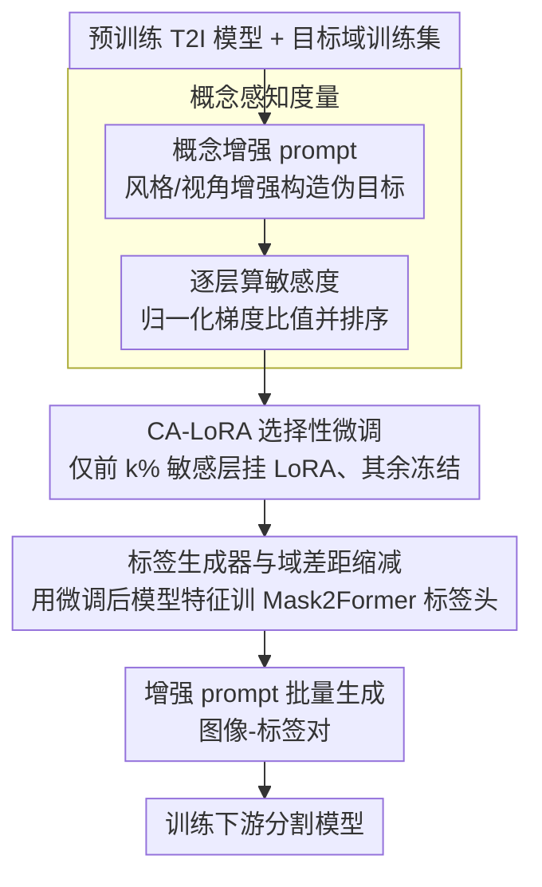

# CA-LoRA: Concept-Aware LoRA for Domain-Aligned Segmentation Dataset Generation

**会议**: CVPR 2026  
**arXiv**: [2503.22172](https://arxiv.org/abs/2503.22172)  
**代码**: 无（Qualcomm AI Research内部）  
**领域**: 分割 / 数据生成  
**关键词**: LoRA微调, T2I生成模型, 语义分割, 概念解耦, 域泛化

## 一句话总结
提出Concept-Aware LoRA (CA-LoRA)，通过自动识别T2I模型中与特定概念（如视角、风格）相关的权重层，仅对这些层施加LoRA微调，实现对目标域的选择性对齐，同时保留预训练模型的多样化生成能力，用于生成高质量的城市场景分割数据集。

## 研究背景与动机

**领域现状**：语义分割需要大量像素级标注数据，成本高昂。近年来利用T2I生成模型合成训练数据成为缓解数据稀缺的有效策略。

**现有痛点**：分割数据集生成面临两个关键挑战——(1) 生成的样本需与目标域对齐（如驾驶视角、城市风格）；(2) 生成的样本需超越训练数据，具有信息量和多样性。早期方法（仅在目标数据上训练生成模型）能域对齐但缺乏多样性；近期方法（直接用预训练T2I模型）多样但域不对齐。

**核心矛盾**：对T2I模型做LoRA微调可以实现域对齐，但会导致过拟合和记忆训练数据——因为LoRA同时学习了视角、风格、物体形状、布局等所有概念，限制了多样性。

**切入角度**：域对齐通常只需要学习某个特定概念（如视角或风格），不需要学全部概念。

**核心idea**：自动度量每层权重对特定概念的敏感性（concept awareness），仅对最敏感的前k%层施加LoRA，其余冻结保留预训练知识。

## 方法详解

### 整体框架

这篇论文要解决的是「合成分割数据既要对齐目标域、又要保持多样性」这对矛盾：直接拿预训练 T2I 模型生成的图够多样但不像驾驶场景，对它做完整 LoRA 微调能对齐却又把视角、风格、物体形状、布局全学进去，过拟合到训练集失去多样性。CA-LoRA 的破局点是把微调从「全学」收窄成「只学某一个概念」。整条流程是：先给每一层权重打一个「对目标概念有多敏感」的分数，只挑最敏感的前 k% 层挂上 LoRA、其余冻结保留预训练知识；微调完再用这个对齐后的模型训练一个标签生成器，最后用增强 prompt 批量产出图像-标签对喂给分割模型。

### 关键设计

**1. 概念感知度量（Concept Awareness）：用归一化的梯度比值，公平地量出每层对某个概念有多敏感**

要「只学某个概念」，前提是先知道哪些层真正负责这个概念。难点在于扩散模型每层权重的梯度量级天差地别（浅层和深层、不同投影层都不在一个尺度上），直接比谁的梯度大根本不公平。CA-LoRA 先构造一个概念损失：把原 prompt 做概念增强当伪目标，比如原 prompt 是 "Photorealistic first-person urban street view"，做风格增强得到 "Sketch of first-person urban street view"，做视角增强得到 "Photorealistic urban street in top-down view"，让模型在原 prompt 和增强 prompt 下的去噪预测靠拢，

$$\mathcal{L}_{Concept} = \|\epsilon_\theta(x_t, c, t) - \text{sg}[\epsilon_\theta(x_t, c_{Aug}, t)]\|_2^2$$

其中 $\text{sg}[\cdot]$ 是 stop-gradient。关键一步是不直接拿这个损失的梯度范数当分数，而是用扩散损失自身的梯度范数把它归一化，

$$\text{Concept-Awareness}(\theta) = \mathbb{E}_{x_0, \epsilon, c_{Aug}}\left[\frac{\|\nabla_\theta \mathcal{L}_{Concept}\|}{\|\nabla_\theta \mathcal{L}_{Diff}\|}\right]$$

分母把各层固有的梯度量级差异（位置偏差）抵消掉，剩下的比值才真正反映「这一层相对而言对概念扰动有多在意」。这样得到的排序可以扩展到任意自定义概念，只要换一个概念增强 prompt 即可。

**2. CA-LoRA 选择性微调：按概念敏感度排序，只给前 k% 层挂 LoRA，其余冻结**

标准 LoRA 对所有层一视同仁地更新，等于强迫模型把视角、风格、形状、布局所有概念一起学，这正是过拟合和记忆训练数据的根源。CA-LoRA 拿上一步算出的概念敏感度对所有 attention 投影层（Q/K/V/OUT）排序，只对最敏感的前 k% 层施加低秩更新 $W_0 + \Delta W = W_0 + BA$，其余层保持冻结。被冻结的层留着预训练模型对「其他概念」的可控性，于是模型只往指定概念上对齐、不动其余。这一点在域泛化里尤其值钱——根据要学的概念，方法分成两种用法：**Style CA-LoRA** 用于域内设置，学训练集的风格（如晴天城市）；**Viewpoint CA-LoRA** 用于域泛化，只学驾驶视角、把风格（天气、光照）这一维留给 text prompt 自由控制，于是同一个模型就能按 prompt 生成各种天气下的街景。

**3. 标签生成器与域差距缩减：用微调后的模型而非预训练模型来训练标签头**

光生成图还不够，要做分割数据集得连像素标签一起产出。CA-LoRA 在去噪过程中抽取多尺度生成特征和交叉注意力图，训练一个 Mask2Former 形状的标签生成器把这些特征翻译成语义标签。这里有个容易被忽略却很关键的选择：DatasetDM 是用**预训练** T2I 模型的特征来训练标签头的，而 CA-LoRA 改用**微调后**的模型。原因是预训练模型的生成特征分布和目标域图像的特征分布对不上，标签头在训练-推理之间存在域差距；换成对齐后的模型，特征统计量和实际生成时一致，标签质量随之明显提升。

### 损失函数 / 训练策略

CA-LoRA 层用标准扩散损失微调，标签生成器用 Mask2Former 的分割损失训练。生成时 prompt 取 "Photorealistic first-person urban street view with [class names] in [weather]" 这种模板，把类别名和天气填进去即可批量产出多样化的图像-标签对。

## 实验关键数据

### 主实验（Cityscapes域内分割mIoU）

| 方法 | 0.3% | 1% | 10% | 100% |
|------|------|------|------|------|
| Baseline（仅真实数据） | 41.83 | 49.15 | 69.02 | 79.40 |
| DatasetDM | 42.82 (+0.99) | 49.71 (+0.56) | 69.04 (+0.02) | 80.45 (+1.05) |
| LoRA | 42.97 (+1.14) | 51.80 (+2.65) | 69.21 (+0.19) | 79.75 (+0.35) |
| AdaLoRA | 43.67 (+1.84) | 48.21 (-0.94) | 68.32 (-0.70) | 78.62 (-0.78) |
| **CA-LoRA (Ours)** | **44.13 (+2.30)** | **51.90 (+2.75)** | **70.29 (+1.27)** | **80.74 (+1.34)** |

### 域泛化实验（DAFormer, mIoU）

| 方法 | ACDC | DZ | BDD | MV | Average |
|------|------|------|------|------|---------|
| Baseline | 53.98 | 27.82 | 54.29 | 62.69 | 49.70 |
| DatasetDM | 55.24 (+0.62) | 28.44 | 54.40 | 63.18 | 50.32 |
| LoRA | 54.64 (+1.22) | 30.22 | 55.44 | 63.39 | 50.92 |
| **CA-LoRA (Ours)** | **55.83 (+1.63)** | **31.68** | **54.68** | **63.09** | **51.32** |

### 关键发现
- CA-LoRA在**所有数据比例**下都优于标准LoRA和AdaLoRA，说明选择性微调有效避免了过拟合
- AdaLoRA在10%和100%设置下甚至**低于基线**（负提升），证明自动化rank调整不能替代概念选择的问题
- 域泛化设置下CA-LoRA的优势更明显（DZ数据集上+3.86 vs LoRA），因为Viewpoint CA-LoRA保留了风格可控性
- few-shot（0.3%）设置下提升最大（+2.30 mIoU），说明在数据极度稀缺时，多样化生成的价值最高

## 亮点与洞察
- **概念解耦的思想**：将微调的问题从"学还是不学"精细化为"学哪些概念"，这个视角对所有LoRA类微调都有启发。不同任务需要从训练数据中学习不同的概念子集
- **概念感知度量的巧妙设计**：用概念增强caption生成的去噪预测作为伪目标，再用扩散损失梯度归一化消除位置偏差。这个流程可以扩展到识别任意自定义概念的敏感层
- **域差距缩减的关键insight**：用微调后T2I模型训练标签生成器比用预训练模型训练效果好得多，因为缩小了训练-推理的泛化特征域差距

## 局限与展望
- 目前仅在城市场景分割上验证，其他场景（如医学图像、遥感）有待探索
- top-k%的选择需要手动调整，能否自动确定最优选择比例？
- 概念增强prompt的设计依赖人工（如知道需要修改哪些词），能否自动发现需要对齐的概念？
- 仅在Stable Diffusion上验证，扩展到更新的T2I模型（如FLUX、SD3）的效果待确认

## 相关工作与启发
- **vs DatasetDM**: DatasetDM直接用预训练T2I模型不做微调，域对齐差。CA-LoRA选择性微调实现了对齐和多样性的平衡
- **vs 标准LoRA**: 标准LoRA学所有概念导致过拟合。CA-LoRA选择性学习避免了这一问题
- **vs DGInStyle**: DGInStyle通过InstructPix2Pix做风格转换生成恶劣天气数据，CA-LoRA直接从生成模型控制风格，更灵活

## 评分
- 新颖性: ⭐⭐⭐⭐ 概念感知的微调选择机制新颖且实用
- 实验充分度: ⭐⭐⭐⭐ 覆盖域内(多比例)和域泛化(多方法)，但消融可更深入
- 写作质量: ⭐⭐⭐⭐⭐ motivation清晰、图示直观、方法描述完整
- 价值: ⭐⭐⭐⭐ 对数据稀缺场景有实际价值，概念解耦思想可广泛迁移

<!-- RELATED:START -->

## 相关论文

- [\[CVPR 2026\] RecycleLoRA: Rank-Revealing QR-Based Dual-LoRA Subspace Adaptation for Domain Generalized Semantic Segmentation](recyclelora_rank-revealing_qr-based_dual-lora_subspace_adaptation_for_domain_gen.md)
- [\[CVPR 2026\] CrossEarth-SAR: A SAR-Centric and Billion-Scale Geospatial Foundation Model for Domain Generalizable Semantic Segmentation](crossearthsar_a_sarcentric_and_billionscale_geospa.md)
- [\[CVPR 2025\] Semantic Library Adaptation: LoRA Retrieval and Fusion for Open-Vocabulary Semantic Segmentation](../../CVPR2025/segmentation/semantic_library_adaptation_lora_retrieval_and_fusion_for_open-vocabulary_semant.md)
- [\[CVPR 2026\] GenMask: Adapting DiT for Segmentation via Direct Mask Generation](genmask_adapting_dit_for_segmentation_via_direct_mask_generation.md)
- [\[CVPR 2026\] Looking Beyond the Window: Global-Local Aligned CLIP for Training-free Open-Vocabulary Semantic Segmentation](looking_beyond_the_window_global-local_aligned_clip_for_training-free_open-vocab.md)

<!-- RELATED:END -->
