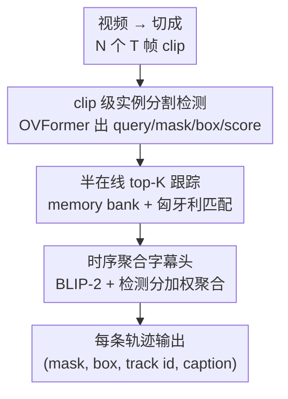

# CaptionFormer: Unified Segmentation, Tracking, and Captioning for Spatio-Temporal Objects

**会议**: CVPR 2026  
**论文**: [CVF Open Access](https://openaccess.thecvf.com/content/CVPR2026/html/Fiastre_CaptionFormer_Unified_Segmentation_Tracking_and_Captioning_for_Spatio-Temporal_Objects_CVPR_2026_paper.html)  
**代码**: https://www.gabriel.fiastre.fr/captionformer/  
**领域**: 视频理解  
**关键词**: 密集视频物体描述, 视频实例分割, 多目标跟踪, VLM合成数据, 端到端  

## 一句话总结
针对密集视频物体描述（DVOC）缺少 object 级标注数据的痛点，本文用 VLM（Gemini 2.0 Flash）在画了 bounding box 的视频上自动生成 object 级字幕，把 LVIS/LV-VIS 扩成首个带 (mask, box, category, caption) 四元组的 DVOC 训练集（LVISCap / LV-VISCap），并训练 CaptionFormer——首个端到端联合「分割+检测+跟踪+描述」每条物体轨迹的模型，在 VidSTG/VLN/BenSMOT 三个 benchmark 上刷新 SOTA。

## 研究背景与动机
**领域现状**：密集视频物体描述（Dense Video Object Captioning, DVOC）要求模型对视频里**所有**物体同时做检测、跟踪、并用自然语言描述它们的轨迹，是连接「时空定位」和「视觉-语言理解」的关键 benchmark。它比指代分割、grounded VQA 更难——后者只定位一两个实体，DVOC 要管全场景所有物体的轨迹和描述。

**现有痛点**：这种细粒度标注极其昂贵，现有训练集（如被改造来评测 DVOC 的 VidSTG）只标了每个视频里少数物体的少数帧。为了绕开标注成本，前人走了两条弯路：DVOC-DS 把任务**拆成子任务**（检测、图像描述、视频描述、跟踪），在各自数据集上**分阶段顺序训练**；OW-VISCaptor 则拼接多个**专用预训练模型**。两者都因为缺少「端到端、object 级、密集监督」而性能受限——尤其 OW-VISCaptor 想把 DVOC 扩到分割，却因为没有配对的 (mask, caption) 标注，只能把分割和描述用两个独立模型分开做。

**核心矛盾**：DVOC 想要端到端联合优化，但端到端训练需要 object 级的 (轨迹, 字幕) 密集标注，而这种标注根本不存在、且人工标注成本高到不可行。

**本文目标**：（1）造出第一个带 object 级字幕的 DVOC 训练集；（2）训练第一个真正端到端、还能输出分割 mask 的 DVOC 模型。

**切入角度**：作者押注 VLM 已经强到可以自己造 object 级标注——只要给 VLM 一个**被显式标出**的目标物体（在视频上画 box）+ 一段携带定位/语义线索的文本 prompt，它就能生成准确的 object-focused 字幕。

**核心 idea**：用 VLM「画框 + 多通道 prompt」自动合成 object 级字幕，把现成的视频分割数据集（LV-VIS）升级成 DVOC 训练集，再用一个统一的 query-based 架构端到端学「mask + box + track + caption」。

## 方法详解

### 整体框架
方法分两大块。**数据侧**：从 LV-VIS（已有 mask + category）出发，对每个物体 $j$ 把它的轨迹 box 画到视频上得到视觉 prompt，配上携带坐标/面积/类别的文本 prompt，喂给 Gemini 2.0 Flash 生成 object 级字幕，得到含 (mask, box, category, caption) 的 LV-VISCap（视频）和 LVISCap（图像，用于预训练）。**模型侧**：CaptionFormer 把视频切成 $N_{clip}$ 个长度 $T$ 的 clip，clip 级用 OVFormer（Mask2Former + 分类头）出 object query、mask、box、score；video 级用 top-K query matching 做半在线跟踪把 clip query 串成轨迹，再用 BLIP-2 captioning head + 时序聚合为每条轨迹产出**一句** video 级字幕。

下面这张图是**模型侧**（CaptionFormer 推理）的 pipeline：

数据侧的「VLM 合成字幕」是离线的一次性步骤，作为设计 1 单独讲。

### 关键设计

**1. VLM「画框 + 多通道 prompt」合成 object 级字幕：把分割数据集白嫖成 DVOC 训练集**

DVOC 的死结是没有 object 级 (轨迹, 字幕) 标注。本文的破法是：既然 LV-VIS 已经有每个物体的 mask 和 category，就只缺「字幕」这一项，那就让 VLM 来补。对视频 $x\in\mathbb{R}^{N\times H\times W\times 3}$ 里的每个物体 $j$，先从它的 mask 抽出 box $B_j$，把这些框画到视频的一个副本上得到视觉 prompt：

$$\hat{x}^i_j = x^i \uparrow B_j,\quad i=1,\dots,N$$

其中 $\uparrow$ 表示「在帧上画框」。实践中只均匀采 4 帧就够代表性了。光画框还不够——作者发现关键是**多通道**喂线索：除了视觉 prompt，还配一个静态 system prompt $p_s$（通用指令、规则如「字幕里别提框」、格式、示例）和一个**为每个物体动态构造**的 user prompt $p_u(j)$，里面塞进该物体的**文本化 box 坐标、面积、类别名，以及画面中其他物体的类别名**。让信息从视觉和文本两个通道同时进，既帮模型锁定目标物体，又能让它做推理（比如「elephant 类别但面积很小」→ 大概率是背景里的小物体）。消融（Table 1）显示这些文本线索是巨大增益来源：从「单帧 + 详细指令」的 29.5 分，加上**类别标签**后直接跳到 80.7 分，再加 box 坐标/面积/few-shot 微调到 85.1 分。有意思的是用 mask 边界当视觉 prompt 反而更差（77.1 vs 84.3），作者推测是 mask 和文本里的 box 定位线索对不齐。最终在 LV-VIS 上生成 1.95 万条字幕、覆盖 3.9k 视频 1020 个类，平均 13.9 词；在 LVIS 上把每张图当作 $N=1$ 的视频同法处理，得到图像端的 LVISCap。

**2. clip 级实例分割检测：OVFormer 加检测头 + 类别无关置信度，为后续跟踪做干净的 per-clip 预测**

要端到端吃下带 mask 的 DVOC 数据，clip 级骨架直接复用 OV-VIS 的 SOTA——OVFormer（在 Mask2Former 上加分类头）。每个 clip $x^i_{clip}\in\mathbb{R}^{T\times 3\times H\times W}$ 经 OVFormer 出 clip 级 object query $q^i_{obj}\in\mathbb{R}^{N_{obj}\times D}$、mask $M^i$、分类分 $S^i_{cls}$、objectness 分 $S^i_{obj}$。在此之上作者加了两件事。其一，用 4 层 MLP 在 query 上接一个**检测头**出 box：$B^i = \text{BoxHead}(q^i_{obj})$，让模型同时支持 box 和 mask 两种 DVOC 评测。其二，OVFormer 原本只算「整段视频、class-aware」的 query 置信度，这对只在少数帧出现的物体不准，而且 DVOC 要避免两个 query 描述同一条轨迹（冗余预测）。于是作者补了一个**类别无关、per-clip** 的置信度，对每个 query/clip 取所有类别上的最大分：

$$S^i_{cls\uparrow} = \max_{c} S^i_{cls}(c)$$

再用 $S^i = \sqrt{S^i_{cls\uparrow}\cdot S^i_{obj}}$（⚠️ 原文为 $S^i_{cls\uparrow}$ 与 $S^i_{obj}$ 的几何均值形式，具体写法以原文为准）作为每个 clip 的过滤分数，推理时按阈值 $t_{thresh}$ 逐时间步剔除低分预测。这一步让后续跟踪拿到的是「干净、不冗余、对短时物体也靠谱」的 clip 级候选。

**3. 半在线 top-K query 跟踪：让消失再出现的物体不丢轨迹**

clip 级预测要串成 video 级轨迹，就得把第 $i$ 个 clip 的 query 和第 $i{+}1$ 个的 query 匹配上。本文用 Zhu et al. 的 top-K 增强 query 匹配模块：为每条轨迹维护一个 memory bank，存最近 $T_{match}$ 个 clip 的 query，从中挑出 $K_{match}$ 个**最匹配**的 clip，再用匈牙利二分匹配求最优指派。相比 OVFormer 原来「直接把 $i{+}1$ 映射到 $i$」的相邻帧跟踪，用「最匹配的若干历史 clip」能**抑制误差传播**，更关键的是能跟住那些**中途消失又重新出现**的物体（OVFormer 的跟踪会把它们自动丢掉）。作者称之为「半在线（semi-online）」——物体在 clip 级表示、clip 间在线关联：当 $T=1$ 时退化为全在线，clip 越长越能在「利用多帧信息」和「长视频内存约束」之间灵活权衡。

**4. BLIP-2 字幕头 + 时序聚合：把整条轨迹融成一句 video 级描述**

跟踪出轨迹后要给每条轨迹生成字幕。作者沿用 Choudhuri et al. 基于 BLIP-2 的 captioning head：BLIP-2 decoder 用预测 mask 条件下的 masked-attention 逐个处理 object query，再把 query 投到 LLM（OPT-2.7B）空间生成字幕。但与前人「逐 clip 出字幕」不同，本文为**一致性和效率**给每条轨迹只出**一句** video 级字幕。做法是给 BLIP-2 加**时序聚合**：在视频上均匀采 $T_{agg}$ 个 clip 组成集合 $I_{agg}$，把这些 clip 的 query 经 BLIP-2 query transformer 处理后、用**检测分加权**求和得到一个 video query：

$$q^*_{obj}(j) = \sum_{i\in I_{agg}} S^i(j)\cdot \mathcal{QT}_{\text{BLIP2}}\!\left(q^i_{obj}(j),\, M^i_j\right)$$

再由 LLM decoder 从聚合 query 出字幕：$Cap(j) = \mathcal{LLM}_{\text{BLIP2}}(q^*_{obj}(j))$。用检测分加权（而非简单算术平均）是关键——置信度高的 clip 贡献更大，能更稳地融合一条轨迹跨多个 clip 的信息，从而描述「时间上展开的动作」。消融（Table 7）显示聚合 clip 数从 1 加到 32，CapA 单调从 51.0 升到 55.4。

### 损失函数 / 训练策略
clip 级训练目标是分割、检测、分类/objectness、字幕四项之和：

$$\mathcal{L}_{\text{clip-level}} = \mathcal{L}_{seg} + \mathcal{L}_{det} + \mathcal{L}_{s} + \mathcal{L}_{cap}$$

其中 $\mathcal{L}_{seg}=\lambda_{dice}\mathcal{L}_{dice}+\lambda_{ce}\mathcal{L}_{ce}$（VIS 的 mask 损失），$\mathcal{L}_s=\lambda_{cls}\mathcal{L}_{cls}+\lambda_{obj}\mathcal{L}_{obj}$（分类+objectness），$\mathcal{L}_{det}=\lambda_{l1}\mathcal{L}_{l1}+\lambda_{giou}\mathcal{L}_{giou}$（box 回归），$\mathcal{L}_{cap}=\lambda_{\text{clip-lm}}\mathcal{L}_{lm}$（语言建模交叉熵）。开启时序聚合时，字幕在 video 级训练：$\mathcal{L}_{\text{video-level}}=\lambda_{\text{vid-lm}}\mathcal{L}_{lm}$。模型**可以完全端到端训练**，但实践中为缓解显存大多用**两阶段**：先训分割/检测/分类，冻结后再调字幕头（clip 级或开聚合时 video 级，靠 $\lambda_{\text{clip-lm}}=0$ 或 $\lambda_{\text{vid-lm}}=0$ 切换）。权重设 $\lambda_{dice,ce,l1}=5$，$\lambda_{giou,cls,obj}=2$，$\lambda_{lm}=1$。

评测指标 CHOTA 把 DVOC 拆成检测准确率 DetA、关联准确率 AssA、描述准确率 CapA 三项的几何均值：$\text{CHOTA}=\sqrt[3]{\text{DetA}\cdot\text{AssA}\cdot\text{CapA}}$；扩到分割时把 box-IoU 换成 mask-IoU。

## 实验关键数据

### 主实验
VidSTG DVOC 验证集对比（Table 3）。CaptionFormer 在相同预训练数据下全面超过前人，换上自家 LVISCap/LV-VISCap 后再涨一截，且训练快近 10 倍（208 vs 2032 GPU 小时）：

| 方法 | 预训练集 | CapA | DetA | AssA | CHOTA |
|------|----------|------|------|------|-------|
| Gemini-2.5-flash | - | 6.4 | 0.9 | 47.2 | 6.6 |
| OVFormer | LVIS+LV-VIS | 12.8 | 64.3 | 50.1 | 34.6 |
| OW-VISCaptor | COCO | 43.9 | 60.1 | 54.0 | 53.0 |
| **CaptionFormer** | COCO | 44.3 | 65.1 | 70.2 | 58.7 |
| DVOC-DS | COCO+VG+SMIT+AugCOCO | 39.7 | 65.8 | 70.4 | 56.9 |
| **CaptionFormer** | 同上 | 50.1 | 65.0 | 69.2 | 60.9 |
| **CaptionFormer** | COCO+LVISCap+LV-VISCap | 51.0 | 66.8 | 71.0 | 62.3 |
| **+ temp agg** | COCO+LVISCap+LV-VISCap | **55.4** | 66.8 | 71.0 | **64.0** |

在 VLN 上 +5.2 CapA，在 BenSMOT 上 +14.7 CIDEr（39.9 vs DVOC-DS 25.4），且只有本文能同时输出分割 mask。两个失败 baseline 很说明问题：直接 prompt Gemini-2.5-flash 在 13.6% 视频上输出格式都对不上、box 近乎静止，DetA/CapA 接近 0；OVFormer 能定位但用类别名当字幕，丢了动作和上下文——印证了「理解」和「定位」之间的鸿沟，正是统一 DVOC 要补的。

### 消融实验

| 实验 | 配置 | 关键指标 | 说明 |
|------|------|---------|------|
| 合成数据（Table 2） | 仅 LV-VISCap | CHOTA 45.8 | 单数据集已可用 |
| | 仅 LVISCap | CHOTA 54.7 | 图像预训练单独也强 |
| | LVISCap + LV-VISCap | **CHOTA 59.5 / CapA 43.6** | 两者结合最佳 |
| 时序聚合（Table 7） | 1 clip (best score) | CapA 51.0 | 不聚合 |
| | 4 clip 算术平均 | CapA 49.1 | 简单平均反而更差 |
| | 32 clip 检测分加权 | **CapA 55.4** | 加权聚合最优 |
| 字幕损失（Table 8） | 关闭 caption loss | mAP 31.7 | — |
| | 开启 caption loss | **mAP 34.2** | 字幕监督反哺分割 +2.5 mAP |

### 关键发现
- **合成数据是核心增益**：去掉 LVISCap 或 LV-VISCap 任一都掉点，两者叠加最好；且 CapA 随训练字幕量呈**对数增长**（Fig. 4），暗示继续多造数据还能涨。
- **加权聚合 > 算术平均**：4 clip 算术平均（49.1）甚至不如 1 clip best-score（51.0），但用检测分加权后 4 clip 升到 51.6、32 clip 到 55.4——说明「让高置信 clip 多说话」才是聚合有效的关键。
- **字幕监督反哺分割**：开启 caption loss 让 VIS 的 mAP 从 31.7 涨到 34.2，说明描述监督给 object query 注入了更丰富的训练信号，DVOC 任务本身对大词表分割也有益。
- **合成评测偏差很小**：在 100 视频/476 轨迹的人工标注子集上（Table 6），用 LVISCap 训练带来的 CapA/CHOTA 增益在「合成评测」和「人工评测」上趋势一致，说明在合成 caption 上评测引入的 bias 可忽略。

## 亮点与洞察
- **「画框 + 多通道 prompt」是简单却好用的 trick**：把目标物体直接画在画面上（视觉通道）+ 把坐标/面积/类别塞进文本（文本通道），让 VLM 锁定该物体——消融里加类别标签一项就把评分从 29.5 拉到 80.7，是整条数据管线的命门，可迁移到任何「让 VLM 关注特定区域」的任务。
- **用「字幕」反哺「分割」的发现很启发**：通常以为字幕只是下游输出，本文却证明 caption loss 能提升 VIS mAP，意味着语言监督是给视觉 query 的一种「免费」正则。
- **统一训练换来 10× 提速**：相比 DVOC-DS 把任务拆成 4 个子任务分阶段训（2032 GPU 小时），端到端统一训只要 208 小时还更准——「拆解子任务规避标注」这条老路在有了合成数据后反而成了负担。
- **半在线跟踪的 $T$ 可调**：clip 长度 $T=1$ 退化为全在线、$T$ 增大换取多帧信息，给长视频的「精度 vs 内存」一个旋钮。

## 局限与展望
- **依赖单一闭源 VLM 造数据**：字幕质量绑定 Gemini 2.0 Flash，其偏见/幻觉会被继承进训练集，作者只在小子集上人工核验了 bias。
- **benchmark 动作太简单**：作者自己指出「单 clip best-score」就能取得不错结果，说明 VidSTG 等数据集里可观测的动作复杂度有限，时序聚合的威力没被充分压榨；VLN 视频太短，聚合几乎无提升。
- **两阶段训练是妥协**：虽号称可端到端，但因显存约束多数实验仍冻结主干分阶段训，端到端联合优化的上限未被完全验证。
- **改进思路**：换开源/多 VLM 投票降偏见；造更长、动作更复杂的 DVOC benchmark 来真正考验时序聚合；探索分割与字幕的真·端到端联合训练。

## 相关工作与启发
- **vs DVOC-DS**：它把 DVOC 拆成检测/图像描述/视频描述/跟踪四个子任务、在各自数据集上**分阶段顺序训练**绕开标注；本文直接**造出** object 级密集标注，端到端统一训，既更准（VidSTG CHOTA 64.0 vs 56.9）又快 10×，还能输出 mask（DVOC-DS 只有 box）。
- **vs OW-VISCaptor**：它想把 DVOC 扩到分割，但因缺配对的 (mask, caption) 标注，只能用两个独立模型把分割和描述**分开做**；本文的 LV-VISCap 提供了 (mask, box, category, caption) 四元组，让单模型真正联合产出 (mask, caption)。
- **vs OVFormer（OV-VIS）**：本文的 clip 级骨架就建在 OVFormer 上，但 OVFormer 靠 CLIP 特征匹配做**分类**、用类别名当「描述」会丢动作和上下文；本文加了检测头、类别无关置信度、半在线跟踪和 BLIP-2 字幕头，把「分类」升级成「自然语言描述」。
- **vs GROVE / GLaMM 等 VLM 数据生成**：它们多在 scene 级生成 grounded 描述、不产 object 级视频描述；本文是首个为 DVOC 生成 object 级、跨时间一致的轨迹字幕，且无需文本 prompt（不同于 referring 分割）。

## 评分
- 新颖性: ⭐⭐⭐⭐ 首个为 DVOC 合成 object 级字幕数据集 + 首个端到端「分割+跟踪+描述」模型，思路清晰但骨架多为成熟组件拼装。
- 实验充分度: ⭐⭐⭐⭐ 三个 benchmark + 数据/聚合/字幕损失/标注 bias 多角度消融，且有人工核验合成评测偏差。
- 写作质量: ⭐⭐⭐⭐ 任务定义、数据管线、架构、损失层层递进，图 2/图 3 把两条 pipeline 讲得很清楚。
- 价值: ⭐⭐⭐⭐ 合成 object 级监督 + 字幕反哺分割的发现有迁移价值，10× 提速也实用，benchmark 动作过简限制了上限。

<!-- RELATED:START -->

## 相关论文

- [\[CVPR 2026\] Efficient Video Object Segmentation and Tracking with Recurrent Dynamic Submodel](efficient_video_object_segmentation_and_tracking_with_recurrent_dynamic_submodel.md)
- [\[CVPR 2026\] Follow the Saliency: Supervised Saliency for Retrieval-augmented Dense Video Captioning](follow_the_saliency_supervised_saliency_for_retrieval-augmented_dense_video_capt.md)
- [\[ECCV 2024\] VP-SAM: Taming Segment Anything Model for Video Polyp Segmentation via Disentanglement and Spatio-Temporal Side Network](../../ECCV2024/segmentation/vp-sam_taming_segment_anything_model_for_video_polyp_segmentation_via_disentangl.md)
- [\[CVPR 2026\] LaDy: Lagrangian-Dynamic Informed Network for Skeleton-based Action Segmentation via Spatial-Temporal Modulation](lady_lagrangian-dynamic_informed_network_for_skeleton-based_action_segmentation_.md)
- [\[AAAI 2026\] Tracking and Segmenting Anything in Any Modality](../../AAAI2026/segmentation/tracking_and_segmenting_anything_in_any_modality.md)

<!-- RELATED:END -->
