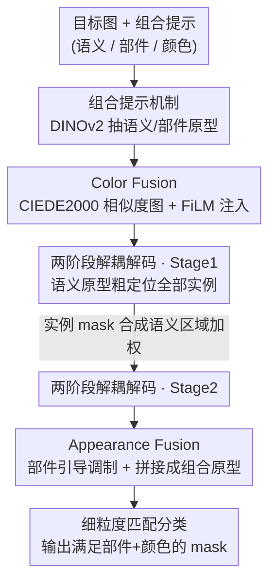

# CDICS: Delving Into Fine-Grained Attribute for In-Context Segmentation via Compositional Prompts and Phased Decoupling

**会议**: CVPR 2026  
**论文**: [CVF Open Access](https://openaccess.thecvf.com/content/CVPR2026/html/Li_CDICS_Delving_Into_Fine-Grained_Attribute_for_In-Context_Segmentation_via_Compositional_CVPR_2026_paper.html)  
**代码**: 无  
**领域**: in-context 分割 / 语义分割  
**关键词**: in-context 分割, 组合提示, 细粒度属性, 两阶段解耦, 颜色提示  

## 一句话总结
CDICS 把传统 in-context segmentation 从"一张参考图定义一个目标"升级为"语义+部件+颜色三类参考图组合定义目标"，并用一个解耦的两阶段解码器（先粗粒度语义定位、再用外观约束精修）把"是什么"和"长什么样"两个子问题拆开学，在组合提示分割任务上把 IoU 从 42.9% 提到 57.6%、误分率（FPR）从 8.3% 砍到 3.9%。

## 研究背景与动机
**领域现状**：In-Context Learning（ICL）已经是图像分割的一个主流范式——给模型一张（或几张）"参考图+mask"作为示例，模型不用更新权重就能去 query 图上分割同类目标。相比纯文本描述，参考图能直接传达复杂的视觉外观细节，这是 ICL 在分割上最大的优势。代表方法有 SegGPT、Matcher、SINE 等。

**现有痛点**：现有 ICL 分割方法只能在**语义级 / 实例级**理解参考图——它擅长回答"目标是什么类别"，却没法灵活调节分割的粒度。现实里用户的需求是多样的，有时要"分割椅子"，有时要"分割带某种特定款式和颜色项链的人"。要做到后者，用户得去找一张**外观属性完美匹配**的参考图，这在稀有、复杂概念上几乎不可行。

**核心矛盾**：问题的根本在于，把"语义身份"和"细粒度外观约束（部件、颜色）"全压进单张参考图里去匹配，会导致**特征耦合**——模型既要判断"这是不是椅子"，又要判断"这块颜色对不对"，两个目标互相干扰，结果就是要么外观约束被语义信息淹没，要么背景里同色物体被误激活。文本路线（RES，指代分割）也救不了颜色这一维：自然语言的颜色词汇是离散、有限且歧义的（"红"到底是哪种红，每个人理解不一样），在电商、工业质检这类场景里根本不够用。

**本文目标**：让 in-context 分割支持**组合式、可控、细粒度**的目标描述，同时不破坏它原本的常规分割能力。

**切入角度**：作者的观察是——既然单张"完美参考图"不可得，那就把目标描述**拆成可组合的视觉基元**：语义参考图（决定类别）、部件参考图（决定要哪个部位）、颜色参考图（决定要什么颜色）。这三者可以从不同图里独立采样再自由组合，从而绕开"找完美样本"的难题；而要让这三类信号互不干扰地协同，就把任务在**架构层面**解耦成两个阶段分别处理。

**核心 idea**：用"组合提示（semantic-part-color）+ 阶段化任务解耦（粗语义定位 → 细外观精修）"代替"单张参考图一步到位匹配"，从任务定义层面解决细粒度属性控制。

## 方法详解

### 整体框架
CDICS 是一个 encoder-decoder 架构。输入是一张目标图 $I_{tar}\in\mathbb{R}^{3\times H\times W}$ 和一组作用在它上面的**组合提示**：语义参考（图+mask）、部件参考（图+mask）、颜色参考 $I_{col}\in\mathbb{R}^{3\times1\times1}$（一个 RGB 值）。输出是一张严格满足"指定部件 + 指定颜色"的细粒度分割 mask。

整条 pipeline 的关键在于把复杂任务**正交分解**成两个独立子问题，交给两个专门的解码阶段：

- **编码阶段**用 DINOv2 提取语义原型 $F_{sem}$、部件原型 $F_{part}$ 和目标特征 $F_{tar}$；同时用 Color Fusion 模块把颜色参考转成一张"相似度强度图"并注入目标特征，得到颜色增强特征 $F^{col}_{tar}$。
- **Stage 1 解码**只看语义原型，回答"目标是什么"——粗粒度定位出该语义类别的所有实例，产出一组实例 mask。
- **Stage 2 解码**在 Stage 1 圈定的区域里，回答"这个具体目标长什么样"——用 Appearance Fusion 模块把部件、颜色约束融进特征，精修出满足外观约束的最终 mask。

### 关键设计

**1. 组合提示机制：把"找完美样本"拆成可自由组合的视觉基元**

传统 ICL 分割只能吃一张参考图，目标的语义、部件、颜色全揉在一起，导致用户必须找到一张外观完全匹配的样本，且模型无法分别控制各个属性。CDICS 把提示拆成三路独立的视觉参考：语义参考 $(I_{sem}, M_{sem})$ 用 DINOv2 + MaskPooling 抽出语义原型 $F_{sem}\in\mathbb{R}^{1\times C}$，部件参考 $(I_{part}, M_{part})$ 同法抽出部件原型 $F_{part}\in\mathbb{R}^{1\times C}$，颜色参考则是一个 RGB 值 $I_{col}$。三者可以从不同图里独立采样后任意组合，于是同一套框架能支持"分割椅子"（纯语义）、"分割带靠背的椅子"（语义+部件）、"分割靠背是那个颜色的椅子"（语义+部件+颜色）三个层级的指令。这是论文声称的首个把"物体语义 + 部件形态 + 颜色属性"统一进分割网络的组合提示方案，它从根上消除了对"完美参考样本"的依赖。

**2. Color Fusion 模块：把模糊的颜色变成可量化的空间强度图**

一个 RGB 值无法直接告诉网络"图里哪块区域颜色对"。Color Fusion 的思路是生成一张**位置指示强度图**：目标图里越接近参考色的像素，强度越高。具体做法是把目标图 $I_{tar}$ 和参考色 $I_{col}$ 都转到感知均匀的 CIELAB 色彩空间，逐像素算 CIEDE2000 色差 $\Delta E_{00}$，再翻转归一化成相似度图：

$$M_{sim}(I_{tar}, I_{col}) = 1 - \mathrm{Norm}(\Delta E_{00}(I_{tar}, I_{col})).$$

色差越小相似度越高。然后这张相似度图通过 FiLM（Feature-wise Linear Modulation）层去调制目标特征——FiLM 从 $M_{sim}$ 生成逐通道的仿射参数 $\gamma, \beta$，对特征做缩放平移：

$$\gamma, \beta = \mathrm{FiLM}(M_{sim}), \qquad F^{col}_{tar} = F_{tar}\cdot(1+\gamma) + \beta.$$

这样匹配参考色的区域特征被针对性增强，得到"颜色敏感"的增强特征 $F^{col}_{tar}$。用 CIEDE2000 而非简单的 RGB 距离，是因为它建模的是人眼感知的颜色差异，对工业/电商这类对色彩精度敏感的场景更稳。

**3. 两阶段解耦解码：先回答"是什么"再回答"长什么样"，避免特征耦合**

把语义识别和外观匹配塞进一个解码器，会让不同约束的特征互相缠绕、谁都学不好。CDICS 把它拆成串行两阶段。**Stage 1（粗语义定位）**彻底无视部件和颜色，只用语义原型 $F_{sem}$，让一组可学习的实例 query $Q_{ins}\in\mathbb{R}^{N\times C}$ 通过 transformer decoder 与目标特征交互，定位该类别的所有实例，输出粗 mask 和语义标签——这一步和传统 ICL 分割几乎一样，提供了全局定位能力。**Stage 2（外观约束精修）**接力：先把 Stage 1 的 $N$ 张实例 mask（$Score_{ins}\in\mathbb{R}^{N\times n\times m}$）合并成一张综合语义区域得分图 $Score_{sem}\in\mathbb{R}^{1\times n\times m}$，用它对特征做加权得到 Stage 2 输入特征：

$$F^{S2}_{tar} = (Score_{sem} + 1)\cdot F^{S1}_{tar}.$$

这个点积让模型把注意力压到前景目标上、滤掉背景噪声。两阶段各自用相同的损失监督，互不干扰地专注于各自目标——这种"粗语义 → 细精修"的解耦既保住了语义引导带来的全局定位，又给细粒度外观留出了独立学习空间，是绕开特征耦合的核心手段。

**4. Appearance Fusion 模块：用部件原型给颜色"加语义锁"，再融成组合原型**

只靠 $F^{col}_{tar}$ 会出问题——它能高亮所有"颜色对"的区域，却分不清语义身份，会把背景里"红色邮筒"和目标"红色车门"一视同仁地增强。Appearance Fusion 的破法是用部件原型 $F_{part}$ 去引导、调制颜色增强特征。先算 $F_{part}$ 与 $F^{col}_{tar}$ 每个空间位置的余弦相似度，得到部件注意力图，再做空间选择性调制：

$$F^{cp}_{tar} = (\mathrm{sim}(F_{part}, F^{col}_{tar}) + 1)\cdot F^{col}_{tar}.$$

这一步最大化增强那些**部件和颜色同时匹配**的区域，化解了单靠颜色的歧义。接着反向操作：用这个更精准的 $F^{cp}_{tar}$ 去增强原始部件原型 $F_{part}$，得到"外观感知"的部件特征 $F_{cp}$（让它学到图里该部件的具体外观）。最后把 $F_{cp}$ 与语义原型 $F^{s1}_{sem}$ 融合成组合原型 $F_{scp}\in\mathbb{R}^{1\times C}$，再与原始 $F^{s1}_{sem}$ 拼接成最终组合特征 $F^{s2}_{sem}\in\mathbb{R}^{2\times C}$。这个拼接特征同时携带"语义身份"和"外观约束"两份信息，让分类时能区分同一语义类内部的属性级差异。

### 损失函数 / 训练策略
模型在每个阶段对实例分割输出用相同损失监督。由于网络对可变数量的 GT 物体输出一组实例预测，用匈牙利算法（Hungarian）做预测与 GT 的一对一最优匹配。第 $i\in\{1,2\}$ 阶段每对匹配的损失含分类项和 mask 项：

$$L^i_H = \sum_{j=1}^{N_i}\left[-\log p_{\sigma(j)}(c_j) + \mathbb{1}_{c_j\neq\varnothing}L_{mask}\right],$$

其中分类项是预测类别的负对数似然，mask 损失是 BCE 与 Dice 之和：$L_{mask}(\hat{M}, M) = L_{BCE} + L_{Dice}$。总损失是两阶段匈牙利损失之和 $L_{total} = \sum_{i=1}^{2} L^i_H$。模型基于 SINE 架构搭建并用其预训练权重初始化，在 ColorPACO + COCO-Ins 上以 1:1 采样比联合训练，AdamW、初始学习率 $1\times10^{-4}$，8 张 A6000、batch 160、60 epoch。

## 实验关键数据

### 主实验
评测用四个数据集：作者重建的 **ColorPACO**（在 PACO 上做细粒度 RGB 颜色标注，75 物体 / 456 物体-部件类）、**ColorPartImageNet**（在 PartImageNet 上做同类标注，测域外泛化）、以及标准的 **COCO-20i**（小样本分割）和 COCO-Ins（训练用）。数据集划分正样本（物体/部件/颜色全匹配）和负样本（类别在但部件或颜色不匹配，GT 为全零 mask），按约 3:1 独立采样。指标：正样本用 IoU，负样本用**误分率 FPR**（$FPR = FP/(FP+TN)$，越低代表越能正确拒绝不匹配指令而非乱分）。

| 方法 | 类别 | COCO-20i IoU↑ | ColorPACO IoU↑ | ColorPACO FPR↓ | ColorPartImageNet IoU↑ | ColorPartImageNet FPR↓ |
|------|------|------|------|------|------|------|
| SegGPT | in-context | 56.1 | 23.9 | 4.9 | **85.2** | 23.8 |
| Matcher | in-context | 52.7 | 42.6 | 8.3 | 81.9 | 20.9 |
| SINE | in-context | 64.5 | 44.1 | 17.1 | 84.1 | 23.4 |
| LDIS | in-context | 60.3 | 31.0 | 12.4 | 71.3 | 26.4 |
| PSALM | referring | / | 40.8 | 12.5 | / | / |
| HyperSeg | referring | / | 42.9 | 8.3 | / | / |
| **CDICS** | ours | **65.2** | **57.6** | **3.9** | 84.4 | **12.5** |

- ColorPACO 上 IoU 比最强的指代分割模型 HyperSeg（42.9）高 14.7 个点，FPR（3.9 vs 8.3）砍掉一半多。
- ColorPartImageNet 上 SegGPT 虽然 IoU 最高（85.2），但 FPR 高达 23.8（倾向"过分割"）；CDICS IoU 持平（84.4）而 FPR 仅 12.5，精度与保真度更平衡。
- COCO-20i 上 IoU 65.2 略高于 SINE 的 64.5，说明加的组合理解模块没有损害常规分割能力。

实例分割对比（ColorPACO，AP/AP50）也全面领先：

| 方法 | AP↑ | AP50↑ |
|------|------|------|
| HyperSeg | 12.9 | 16.3 |
| PSALM | 10.7 | 13.9 |
| SINE | 14.3 | 27.3 |
| **CDICS** | **20.8** | **34.9** |

### 消融实验
在 ColorPACO 上逐步叠加两个核心模块（Baseline 只用基础 encoder 融合三类特征）：

| 配置 | IoU↑ | FPR↓ | AP↑ | AP50↑ | 说明 |
|------|------|------|------|------|------|
| Baseline | 50.3 | 12.0 | 16.9 | 27.7 | 基础特征融合 |
| + Appearance Fusion | 51.4 | 9.3 | 18.9 | 30.8 | FPR 降 2.7 个点 |
| + Two-Stage | **58.9** | **5.7** | **23.8** | **42.4** | 完整模型 |

### 关键发现
- **两阶段解耦是涨点主力**：加上 Two-Stage 后 IoU 从 51.4 跳到 58.9（+7.5）、FPR 从 9.3 降到 5.7、AP50 从 30.8 升到 42.4，提升幅度远超只加 Appearance Fusion。作者归因于任务解耦让每个阶段能专注于各自目标。
- **Appearance Fusion 主要管"拒绝错误指令"**：单加它 IoU 只涨 1.1，但 FPR 直接降 2.7 个点——说明它的价值更多在于用部件引导消除颜色歧义、压低误激活，而非提升正样本重叠。
- ⚠️ 消融表里完整模型 IoU 是 58.9，而主表 CDICS 的 ColorPACO IoU 是 57.6，两个数字不完全一致（可能是消融与主实验的训练/评测设置略有差异），以原文为准。

## 亮点与洞察
- **把"颜色"从语言维度换到视觉维度**：用一个 RGB + CIEDE2000 相似度图 + FiLM 注入，绕开了自然语言颜色词汇离散、歧义的死结，这个思路在电商配色、工业质检这类"说不清颜色但能给个色卡"的场景里很实用。
- **"任务在架构层面正交分解"的范式很可迁移**：先粗定位 anchor 出区域、再在区域内做细粒度属性匹配，这种 coarse-to-fine 解耦对任何"先判类、再判属性"的细粒度任务（细粒度检索、属性识别）都能套用，关键是它用 Stage 1 的得分图给 Stage 2 做空间加权、把搜索空间收窄。
- **用 FPR 作为核心指标抓住了真问题**：细粒度可控分割的难点不只是"分得准"，更是"该不分时要拒绝"。负样本 + FPR 的评测设计逼出了模型的指令辨别能力，比单看 IoU 更能反映组合提示是否真被理解。
- **部件原型反向增强颜色特征**这一步（$F^{cp}_{tar}$ 给颜色"加语义锁"）很巧——单路颜色信号会误激活背景同色物，用部件相似度做空间选择性调制，等于让"颜色"和"部件"互为约束才一起被增强。

## 局限与展望
- **依赖重建的数据集**：组合提示能力的监督来自作者自己标注的 ColorPACO（细粒度 RGB 标注），训练强依赖这个特定的"semantic-part-color"结构，论文也承认要靠混入 COCO-Ins 防止过拟合到这种结构；换到没有部件标注的领域，泛化和落地成本未知。
- **颜色提示是单一 RGB 值**：$I_{col}\in\mathbb{R}^{3\times1\times1}$ 只能表达一个纯色，对渐变、纹理、多色目标（如花纹布料）可能力不从心，CIEDE2000 单点匹配也假设目标区域颜色相对均匀。
- **三类提示需要分别准备**：虽然不用"完美样本"，但用户得给齐语义图、部件图、颜色值三路输入，交互成本相比一句话指令仍偏高；论文未讨论缺某一路提示时的退化行为。
- ⚠️ 消融与主表 IoU 数字不一致（58.9 vs 57.6）未在正文解释，复现时需留意训练配置差异。

## 相关工作与启发
- **vs SINE / Matcher / SegGPT（in-context 分割）**：它们只做语义/实例级理解，靠单张参考图，无法控制属性粒度，给完美匹配 patch 时 ColorPACO IoU 也只有 23.9~44.1、FPR 普遍偏高。CDICS 在 SINE 架构和权重基础上扩展出组合提示 + 两阶段解耦，IoU/FPR 全面反超，本质区别是把"匹配"问题升级成"分解+组合"问题。
- **vs HyperSeg / PSALM / OMG-LLaVA（指代分割 RES）**：它们用 MLLM 解析自由文本，但颜色词汇离散歧义，ColorPACO 上 IoU≤42.9、FPR≥8.3。CDICS 用颜色图作视觉线索替代文本颜色描述，提供跨语言一致、用户友好的颜色语义，IoU/FPR 都更好。
- **vs 组合范式（CZSL / 组合图像检索 CIR）**：这些工作在识别/检索里解耦视觉基元做组合泛化。CDICS 首次把组合范式引入 in-context 分割，把"视觉样本当组合输入"来增强对分割目标的细粒度控制。

## 评分
- 新颖性: ⭐⭐⭐⭐⭐ 首个把语义+部件+颜色组合提示引入 in-context 分割，"任务正交分解"的两阶段设计切中特征耦合痛点。
- 实验充分度: ⭐⭐⭐⭐ 四数据集 + 域外泛化 + FPR 指令辨别 + 逐模块消融，扎实；但 IoU 数字小有不一致、颜色单点假设未做敏感性分析。
- 写作质量: ⭐⭐⭐⭐ 动机清晰、公式完整、图文对应好；个别符号（$F^{S1}_{tar}$ 来源）交代略简。
- 价值: ⭐⭐⭐⭐ 细粒度可控分割对电商/工业有现实价值，coarse-to-fine 解耦范式可迁移；但依赖重建数据集和三路提示，落地有门槛。

<!-- RELATED:START -->

## 相关论文

- [\[CVPR 2026\] High-Precision Dichotomous Image Segmentation via Depth Integrity-Prior and Fine-Grained Patch Strategy](high-precision_dichotomous_image_segmentation_via_depth_integrity-prior_and_fine.md)
- [\[CVPR 2026\] Training-Free Open-Vocabulary Camouflaged Object Segmentation via Fine-Grained Object Binding and Adaptive Hybrid Prompt](training-free_open-vocabulary_camouflaged_object_segmentation_via_fine-grained_o.md)
- [\[CVPR 2026\] Training-Free Fine-Grained Semantic Segmentations in Low Data Regimes: A FungiTastic Baseline](training-free_fine-grained_semantic_segmentations_in_low_data_regimes_a_fungitas.md)
- [\[CVPR 2026\] INSID3: Training-Free In-Context Segmentation with DINOv3](insid3_training-free_in-context_segmentation_with_dinov3.md)
- [\[CVPR 2026\] DeRVOS: Decoupling Consistent Trajectory Generation and Multimodal Understanding for Referring Video Object Segmentation](dervos_decoupling_consistent_trajectory_generation_and_multimodal_understanding_.md)

<!-- RELATED:END -->
