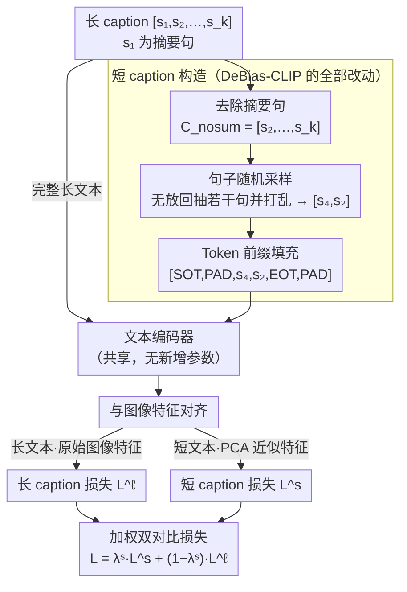

# DeBias-CLIP: CLIP Is Shortsighted — Paying Attention Beyond the First Sentence

**会议**: CVPR 2026  
**arXiv**: [2602.22419](https://arxiv.org/abs/2602.22419)  
**代码**: [https://github.com/TRAILab/DeBias-CLIP.git](https://github.com/TRAILab/DeBias-CLIP.git)  
**领域**: 语义分割  
**关键词**: CLIP, 长文本检索, 注意力偏向, 首句偏差, 数据增强

## 一句话总结
发现 CLIP 模型在长文本场景中严重偏向于编码首句摘要和早期 token（"近视"行为），通过三种零参数增量的训练增强策略——去除摘要句、句子随机采样、token 前缀填充——实现了全方位 SOTA 的长文本检索性能，同时改善了短文本检索。

## 研究背景与动机

**领域现状**：CLIP 模型通过图文对比学习获得强大的跨模态表征，广泛用于零样本分类、多模态检索和文生图扩散模型。但原始 CLIP 主要在短 caption 数据上训练，token 限制仅 77 个（约 3-4 句话），限制了对长文本的理解。Long-CLIP 通过拉伸位置编码到 248 token 并微调来缓解这一问题。

**现有痛点**：作者发现了一个关键但被忽视的偏差——无论是人类还是 LLM 生成的长 caption，都遵循"首句为摘要 + 后续为细节"的结构。这一结构在训练时充当捷径（shortcut），模型的注意力集中在首句和早期 token 上，后续内容几乎被忽略。

**核心矛盾**：Long-CLIP 等方法虽然扩展了 context 长度，但由于预训练 CLIP 本身的早期 token 偏向（early-token bias），扩展后的模型仍然只"看"前几个 token。实验证实：移除首句后 Long-CLIP 的 DOCCI 检索下降 17.1%，交换首句和第四句下降 9.7%。

**本文目标** 消除 CLIP 文本编码器的首句/早期 token 偏向，让模型真正利用长 caption 中的全部信息。

**切入角度**：既然偏差来自数据结构（首句摘要的捷径），那么通过训练时的数据增强就能消除，无需新架构或额外参数。

**核心 idea**：去掉训练 caption 的首句摘要，用句子采样和 token 填充把监督信号均匀分布到所有 token 位置。

## 方法详解

### 整体框架
DeBias-CLIP 想解决的是 CLIP 文本编码器只"看"首句、对长 caption 后半段几乎视而不见的近视毛病。它不动架构、不加参数，整套改动都落在训练时短 caption 的构造方式上。具体来说，它沿用 Long-CLIP 的双对比损失：长 caption 损失 $\mathcal{L}^\ell$ 把完整长文本和图像对齐，短 caption 损失 $\mathcal{L}^s$ 把一个文本子集和图像对齐。Long-CLIP 的做法是直接拿首句摘要当短 caption——而这正是首句偏向的源头。DeBias-CLIP 把短 caption 的来源换成"去掉首句、随机采样、再前移 padding"三步加工出来的片段，逼模型把注意力摊到整段文本上。

### 关键设计

**1. 去除摘要句：把短 caption 的"标准答案"从首句换成细节句**

长 caption 几乎都遵循"首句摘要 + 后续细节"的写法，Long-CLIP 又恰好用首句 $s_1$ 当短 caption，于是首句成了对比损失里最省力的捷径——模型只要对齐首句就能拿到大部分相似度。作者用一个对照实验戳穿了这一点：Long-CLIP 在 DOCCI 上，首句与图像的相似度 $\overline{\text{sim}}(u^s, v) = 0.320$，反而比完整 caption 的 $0.308$ 还高，说明后续句子非但没贡献，还在稀释相似度。DeBias-CLIP 的对策很直接：训练时把短 caption 定义为去掉首句后的剩余内容 $C^{\mathrm{no\_sum}} = [s_2, \ldots, s_k]$。摘要句一旦从监督信号里消失，模型想拿到对比损失就只能去读细节句，捷径被堵死。消融里这一步单独就带来 +5.4% 的提升，是三个设计中贡献最大的。

**2. 句子随机采样：让每次迭代看到的短 caption 都不一样**

光去掉首句还不够——剩下的句子如果每次都按原顺序整段喂进去，短 caption 和长 caption 的差异仍然太小，模型不必真正区分细节。这里的做法是从 $C^{\mathrm{no\_sum}}$ 里无放回地随机抽 $n_{\mathrm{sampled}} = \mathcal{U}\{1, 2, \ldots, n_{\mathrm{sents}}-1\}$ 个句子，而且不保留原始顺序，拼成一个长度和内容都在变的子 caption（如 $C^{\mathrm{samp}} = [s_4, s_2]$）。每个训练步看到的句子组合都不同，相当于零成本地把短/长 caption 的差异拉大，逼模型对文本和图像里的细节都更敏感，而不是记住某个固定模板。

**3. Token 前缀填充：把信息推到后面，强制训练晚位置的位置编码**

前两步解决了"看哪些句子"，但还剩一个隐患：采样出来的短 caption 普遍很短，token 都挤在序列前段，靠后位置的位置编码几乎得不到梯度，早期 token 偏向因此很难被真正纠正。前缀填充就是冲这个去的——它把原本堆在序列末尾的 padding token 随机移一部分到 SOT 之后，前移数量 $n_{\mathrm{pre}} = \mathcal{U}\{0, 1, \ldots, n_{\mathrm{post}}\}$ 随机采样，于是有信息的 token 被整体往后推，最终序列形如

$$T^s_{\mathrm{ours}} = [\mathtt{SOT}, \mathtt{PAD}_{\mathrm{pre}}, \mathtt{s}_4, \mathtt{s}_2, \mathtt{EOT}, \mathtt{PAD}_{\mathrm{post}}]$$

这样后段的位置编码也被频繁激活、拿到训练，同时整段文本仍然完整保留，短文本检索性能不受损。消融里把它叠加上去再带来 +2.5%，把总增益推到 +8.6%。

### 一个完整示例：一条 caption 怎样被加工成短 caption
取一条 5 句的长 caption $[s_1, s_2, s_3, s_4, s_5]$，其中 $s_1$ 是摘要句。第一步去除摘要句，得到 $C^{\mathrm{no\_sum}} = [s_2, s_3, s_4, s_5]$；第二步随机采样，比如抽中 2 句并打乱顺序，得到 $C^{\mathrm{samp}} = [s_4, s_2]$；第三步 token 化后做前缀填充，把若干 padding 前移，得到 $[\mathtt{SOT}, \mathtt{PAD}, \mathtt{PAD}, \mathtt{s}_4, \mathtt{s}_2, \mathtt{EOT}, \mathtt{PAD}, \ldots]$。这个被反复改头换面的短片段去算 $\mathcal{L}^s$，而完整的 $[s_1, \ldots, s_5]$ 去算 $\mathcal{L}^\ell$——同一张图像，短 caption 这边再也找不到"对齐首句就完事"的捷径，只能老老实实利用全文细节。

### 损失函数 / 训练策略
最终是加权双对比损失 $\mathcal{L} = \lambda^s \mathcal{L}^s + (1 - \lambda^s) \mathcal{L}^\ell$。短 caption 损失沿用 Long-CLIP 的 PCA 近似图像特征，长 caption 损失用原始图像特征。在 ShareGPT4V 上训练 3 个 epoch，batch size 256，4× A100。

## 实验关键数据

### 主实验（长文本检索 Top-1）

| 方法 | Urban1k T2I/I2T | DCI T2I/I2T | Long-DCI T2I/I2T | DOCCI T2I/I2T |
|------|----------------|-------------|-------------------|---------------|
| CLIP (ViT-B) | 53.4/67.5 | 42.9/44.1 | 32.7/35.9 | 57.1/60.6 |
| Long-CLIP | 79.5/78.9 | 57.1/51.6 | 47.0/41.1 | 71.4/63.1 |
| SmartCLIP | 87.4/90.0 | 64.0/64.9 | 52.8/53.4 | 78.0/77.4 |
| **DeBias-CLIP** | **93.0/93.1** | **67.6/68.5** | **57.4/57.8** | **80.0/79.7** |

### 消融实验（ViT-B/16, DOCCI T2I）

| 配置 | DOCCI T2I | Δ vs Long-CLIP |
|------|-----------|----------------|
| Long-CLIP baseline | 71.4 | — |
| + 去除首句 | 76.8 | +5.4 |
| + 去除首句 + 句子采样 | 77.5 | +6.1 |
| + 去除首句 + 句子采样 + 填充 | **80.0** | **+8.6** |

### 关键发现
- 去除首句摘要是最关键的改进（+5.4%），证实了首句偏向是核心瓶颈
- 三种增强策略累加效果显著，最终在几乎所有长/短文本检索数据集上达到 SOTA
- 模型对句子排列变换的鲁棒性大幅提升：交换句子后的性能下降从 Long-CLIP 的 -9.7% 缩小到 -3.5%
- 方法可推广到不同预训练 CLIP 变体（OpenAI CLIP、OpenCLIP、SigLIP、SigLIP2），均有一致改进

## 亮点与洞察
- 诊断问题比解决问题更精彩——系统性地揭示了 CLIP 的"近视"行为（early-token bias + summary sentence shortcut），这一发现本身就很有价值。方法论值得借鉴：通过 padding 实验、句子交换实验和注意力权重分析来定量刻画偏差
- 零额外参数的解决方案极其优雅——仅靠训练时的数据采样策略就实现了 SOTA，体现了"数据比模型更重要"的洞察。这一思路可迁移到任何存在数据结构化偏差的对比学习场景
- 注意力权重分析显示 DeBias-CLIP 的注意力分布更加平坦，说明模型真正学会了利用长文本中的深层信息

## 局限与展望
- SigLIP/SigLIP2 预训练变体在句子排列后仍有较大性能下降（-6.1%/-6.5%），说明残留的位置敏感性来自预训练，微调难以完全消除
- 假设了句子之间语义独立，实际长 caption 中句子之间存在指代和因果关系，打乱顺序可能丢失这些信息
- 训练数据仅限 ShareGPT4V（1.2M 图像），在更大规模或不同领域的数据上效果待验证
- 未探索对下游生成任务（如文生图）的影响

## 相关工作与启发
- **vs Long-CLIP**: Long-CLIP 通过位置编码拉伸扩展 context 长度但未解决首句偏向；DeBias-CLIP 在此基础上解决了核心偏差问题，是其增量改进但效果显著
- **vs SmartCLIP**: SmartCLIP 学习文本条件的图像特征掩码（增加参数）；DeBias-CLIP 无额外参数但性能更优
- **vs FineLIP**: FineLIP 增加跨模态精炼模块（推理时需要已知正例对）；DeBias-CLIP 更简洁，不依赖推理时的额外信息

## 评分
- 新颖性: ⭐⭐⭐⭐ 问题诊断非常精彩，解决方案虽简单但切中要害
- 实验充分度: ⭐⭐⭐⭐⭐ 多数据集、多模型、多维度分析极为充分
- 写作质量: ⭐⭐⭐⭐⭐ 逻辑清晰，从诊断到解决层层递进
- 价值: ⭐⭐⭐⭐ 对 CLIP 生态的理解和改进有实际影响

<!-- RELATED:START -->

## 相关论文

- [\[CVPR 2026\] Looking Beyond the Window: Global-Local Aligned CLIP for Training-free Open-Vocabulary Semantic Segmentation](looking_beyond_the_window_global-local_aligned_clip_for_training-free_open-vocab.md)
- [\[NeurIPS 2025\] Interpreting ResNet-based CLIP via Neuron-Attention Decomposition](../../NeurIPS2025/segmentation/interpreting_resnet-based_clip_via_neuron-attention_decomposition.md)
- [\[AAAI 2026\] SSR: Semantic and Spatial Rectification for CLIP-based Weakly Supervised Segmentation](../../AAAI2026/segmentation/ssr_semantic_and_spatial_rectification_for_clip-based_weakly_supervised_segmenta.md)
- [\[CVPR 2025\] Exploring CLIP's Dense Knowledge for Weakly Supervised Semantic Segmentation](../../CVPR2025/segmentation/exploring_clips_dense_knowledge_for_weakly_supervised_semantic_segmentation.md)
- [\[CVPR 2026\] Seeing Beyond: Extrapolative Domain Adaptive Panoramic Segmentation](seeing_beyond_extrapolative_domain_adaptive_panoramic_segmentation.md)

<!-- RELATED:END -->
