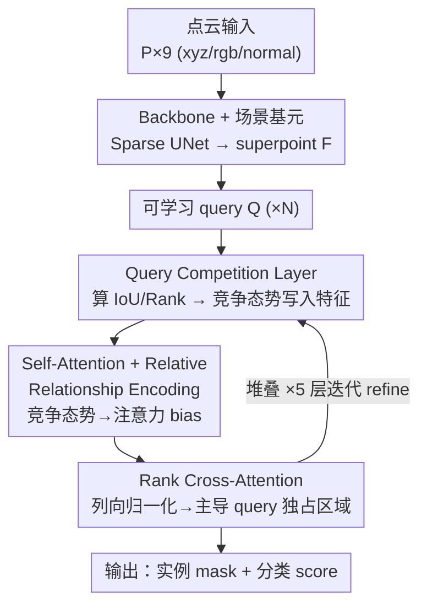

# CompetitorFormer: Mitigating Query Conflicts for 3D Instance Segmentation via Competitive Strategy

**会议**: CVPR 2026  
**论文**: [CVF Open Access](https://openaccess.thecvf.com/content/CVPR2026/html/Wang_CompetitorFormer_Mitigating_Query_Conflicts_for_3D_Instance_Segmentation_via_Competitive_CVPR_2026_paper.html)  
**代码**: https://github.com/DuanchuWang/CompetitorFormer  
**领域**: 3D视觉 / 3D实例分割  
**关键词**: 3D实例分割, Transformer解码器, query冲突, 竞争建模, ScanNet  

## 一句话总结
针对 Transformer 式 3D 实例分割中"多个 query 抢同一个物体导致 mask 碎片化"的痼疾，本文用一个 Query Competition Layer 在每层解码前显式计算每个 query 的"竞争态势"（谁和我空间重叠最大、我比它强还是弱），再配合改造的 self-attention 与 cross-attention 让强者通吃，在 ScanNetV2/200、S3DIS、ScanNet++V2 四个基准上既收敛更快又刷到 SOTA。

## 研究背景与动机
**领域现状**：3D 实例分割（3DIS）近年被 Transformer 范式统治。以 SPFormer、Mask3D 为代表的方法把每个实例表示成一个可学习的 query，丢进多层解码器里反复 refine，每层都做 self-attention（query 之间通信）+ cross-attention（从场景特征里抓上下文）+ FFN，最后由 refine 后的 query 直接预测 mask 和类别，端到端、不需要手工 group 规则。

**现有痛点**：作者观察到一个被忽视的结构性缺陷——**多个 query 经常同时盯上同一个实例**，于是一个物体被切成好几块、mask 互相重叠又互相残缺（图 1 里桌子、柜子被切碎）。作者把这个现象命名为 **inter-query competition（query 间竞争）**，它既拖慢收敛又压低精度。

**核心矛盾**：query 竞争来自两个一直没被解决的关系——(1) **空间冲突**：多个 query 的覆盖区域重叠；(2) **层级歧义**：没有一个 query 能脱颖而出成为该实例的"主导者"。解码器里的 self-attention 虽然能隐式建模 query 关系，但它是 all-to-all 的分布式弱交互，**既识别不出"谁是我最直接的竞争对手"，也判断不了"我和它谁更该负责这个物体"**。而且以往方法（如 Relation3D 加几何 bias）都只是去调 attention 权重，间接影响 query，却忽略了一个事实：**mask 是由 query 特征直接决定的**，不把竞争信息写进特征本身就治标不治本。

**本文目标**：让每个 query 显式感知自己的"竞争态势（competitive landscape）"——即两件事：最直接的竞争者是谁、自己相对它是主导（dominant）还是从属（subordinate）——并把这份感知**直接嵌进 query 的特征表示**。

**核心 idea**：与其在 mask 碎了之后再去聚合修补（IKNE 那类事后补救），不如在解码过程中就显式建模并化解 query 竞争，用"竞争策略"逼出每个实例的唯一主导 query。

## 方法详解

### 整体框架
CompetitorFormer 不改 backbone 和整体的"提特征 → query 迭代 refine"两段式结构，而是把标准解码器换成一个 **Competitor-Decoder**（堆叠 ×5），核心是三个协同模块：

- **Query Competition Layer (QCL)**：插在每个解码 stage 之前，用上一层的预测算出每个 query 的竞争态势（IoU 关系 + 排名关系），融进 query 特征。
- **Relative Relationship Encoding (RRE)**：把竞争态势翻译成 self-attention 的动态 bias，让 query 间通信带上"谁强谁弱、在哪重叠"的先验。
- **Rank Cross-Attention (RCA)**：在 cross-attention 聚合场景特征（superpoint）时引入"列方向竞争归一化"，让主导 query 独占相关区域、压制从属 query。

输入点云先经 Sparse UNet backbone 抽点级特征，再聚合成 $M$ 个场景基元（superpoint 或 voxel）$F \in \mathbb{R}^{M \times D}$；$N$ 个可学习 query $Q \in \mathbb{R}^{N \times D}$ 在 Competitor-Decoder 里迭代 5 次，每次都先过 QCL 注入竞争态势，再走 RRE 增强的 self-attention 和 RCA，最后由 query 输出 mask + score。

### 关键设计

**1. Query Competition Layer：把"谁是对手、我强还是弱"写进 query 特征**

这是全文的地基，直接针对"query 互相不知道彼此竞争关系"的痛点。QCL 用**上一层解码器的预测**（mask + score）构造两个关系矩阵。第一个是空间冲突矩阵 $R_{\text{IoU}}$，逐对计算预测 mask 的 IoU；对每个 query $Q_i$，把和它 IoU 最大的那个认定为最强竞争者：

$$j = \mathop{\arg\max}_{j' \neq i} R_{\text{IoU}}[i, j'].$$

第二个是主导关系矩阵 $R_{\text{Rank}}$，每个 query 先算一个置信分 $S^{(k-1)}$（= 最大类概率 × 预测 IoU 的乘积），再两两比较定主从：

$$R_{\text{Rank}}[i,j] = \begin{cases} 1 & \text{if } S^{(k-1)}_i \geq S^{(k-1)}_j \;(Q_i \text{ 主导}) \\ -1 & \text{otherwise} \;(Q_i \text{ 从属}). \end{cases}$$

接着用两套可学习 embedding——主导 embedding $E_1$ 和从属 embedding $E_2$——按 $R_{\text{Rank}}$ 决定的顺序排列（$Q_i$ 主导就用 $(E_1[j], E_2[j])$，否则反过来），拼接过 MLP 得到竞争态势特征 $F_{\text{landscape}}$，最后再和原 query 拼接融合：

$$Q^{(k)} = \text{MLP}(\text{Concat}(Q^{(k-1)}, F_{\text{landscape}})).$$

关键在于它**只锁定最强对手做聚焦交互**，取代标准解码器里 all-to-all 的稀释式建模，而且把竞争意识直接刻进特征（而非只调 attention 权重），让每个 query 一上来就知道自己该当主角还是配角，从而稳定优化、逼出清晰边界。

**2. Relative Relationship Encoding：把竞争态势翻译成 self-attention 的动态 bias**

QCL 给了竞争结构，RRE 负责把它喂进 query 间通信。它不让 self-attention 去隐式学依赖关系，而是把 IoU 和 Rank 矩阵**逐元素相乘**成一个统一的关系状态：

$$R_{\text{state}} = R_{\text{Rank}} \odot R_{\text{IoU}}.$$

这个乘法很巧：$R_{\text{Rank}}$ 给"谁更强"的方向（带正负号），$R_{\text{IoU}}$ 给"在哪重叠、多重"的强度，乘起来同时回答了"谁强 + 在哪争"，比相加或分开建模更能突出"既自信又空间相关"的对手。为抗噪声抖动，再把 $R_{\text{state}}$ 离散成 $L$ 个桶：

$$\hat{R}_{\text{state}} = \left\lfloor \frac{R_{\text{state}}}{v} \right\rfloor + \frac{L}{2},$$

取 $L=70$、$v=0.02$，刚好覆盖 IoU 区间 $[-0.7, 0.7]$。然后用量化索引去两张可学习表 $T_q, T_k$ 里查 query/key 各自的语义 bias，最终 bias 为 $B_{ij} = T_Q[i, \hat{R}_{\text{state}}[i,j]] + T_K[j, \hat{R}_{\text{state}}[i,j]]$，加到缩放点积注意力分上。相比传统只编码静态几何距离的相对位置编码，RRE 是**随解码层动态演化的任务驱动 bias**，把竞争建模和注意力计算解耦，既稳训练又让特征分离更锐利。

**3. Rank Cross-Attention：列方向竞争归一化，让主导 query 独占场景区域**

前两个模块管 query 之间，RCA 管 query 怎么从场景特征里抓料。常规 cross-attention 对每个 query 做**行方向** softmax，各 query 独立归一化，于是多个 query 可以同时给同一个 superpoint 打高分——这正是 mask 重叠碎片的根源。RCA 反过来在**列方向**（对每个 superpoint，跨所有 query）先做 min-max 归一化：

$$Sim'_{ij} = \frac{Sim_{ij} - \min_k(Sim_{kj})}{\max_k(Sim_{kj}) - \min_k(Sim_{kj}) + \epsilon}, \quad Sim = \frac{QK^{\top}}{\sqrt{d_k}}.$$

$Sim'$ 衡量的是"对这个区域，哪个 query 最有竞争力"。再把它和原相似度逐元素相乘后沿 query 维做 softmax：

$$A = \text{softmax}_{\text{row}}(Sim \odot Sim').$$

效果是强者更强、弱者被抑——主导 query 更果断地把整块区域的特征聚过来，从属 query 被劝退不去抢同一区域，从而在特征聚合层面强制"互斥"，减少冗余重叠、产出空间连贯的 mask。

### 损失函数 / 训练策略
方法不改训练目标，沿用 Transformer 3DIS 标准的二分匹配 + mask/分类监督；Competitor-Decoder 堆 5 层，置信分 $S$（类概率 × 预测 IoU）既用于 QCL 排名也是常规的实例打分。RRE 桶数 $L=70$、桶宽 $v=0.02$ 为最优配置。

## 实验关键数据

### 主实验
四个基准全面 SOTA（mAP，越高越好）；ScanNet++V2 提升尤为夸张（+5.6 mAP）：

| 数据集 / 协议 | 指标 | CompetitorFormer | 之前最好 | 提升 |
|--------------|------|------|----------|------|
| ScanNetV2 Val | mAP | 63.4 | 62.9 (IKNE) | +0.5 |
| ScanNetV2 Test | mAP | 62.9 | 62.2 (Relation3D) | +0.7 |
| ScanNet200 Val | mAP | 34.1 | 31.6 (Relation3D) | +2.5 |
| S3DIS Area5 | mAP50 | 73.8 | 73.0 (IKNE) | +0.8 |
| S3DIS Fold6 | mAP50 | 77.7 | 76.9 (IKNE) | +0.8 |
| ScanNet++V2 Val | mAP | 34.1 | 28.5 (DCD) | +5.6 |
| ScanNet++V2 Test | mAP | 33.5 | 30.6 (DCD) | +2.9 |

作者解读：ScanNet200 长尾类上冗余 query 最容易把小/稀有实例切碎，显式化解冲突带来 +2.5；ScanNet++V2 点云密、布局乱、物体重叠频繁，query 冲突最严重，所以提升最大。

### 消融实验
ScanNetV2 验证集，三模块逐个加（基线 62.2 mAP）：

| 配置 | QCL | RRE | RCA | mAP | mAP50 |
|------|-----|-----|-----|-----|-------|
| [A] 基线 | ✗ | ✗ | ✗ | 62.2 | 80.2 |
| [B] | ✓ | ✗ | ✗ | 62.8 | 81.0 |
| [C] | ✗ | ✓ | ✗ | 62.7 | 80.9 |
| [D] | ✗ | ✗ | ✓ | 62.6 | 80.7 |
| [E] | ✓ | ✓ | ✗ | 63.1 | 81.2 |
| [G] | ✓ | ✗ | ✓ | 63.1 | 80.8 |
| [I] Full | ✓ | ✓ | ✓ | 63.4 | 81.6 |

单加 QCL 贡献最大（+0.6），RRE/RCA 各 +0.5/+0.4；QCL 与任意一个搭配都能到 63.1，三者全开 63.4（比基线 +1.2）。值得注意 [F]（RRE+RCA 无 QCL）增益偏小，说明 QCL 提供的竞争结构是地基，RRE/RCA 是在它之上"用结构"。

### 关键发现
- **QCL 是核心机制**：单模块增益最大，且去掉它后另两个模块发挥不出来——印证"先建立竞争结构、再利用结构"的设计逻辑。
- **QCL 真的拉开了主从分差**：图 3 显示加 QCL 后，同一 GT 实例的竞争 query 之间置信分差距明显变宽，从"分数胶着的混乱竞争"变成"清晰层级"，主导 query 高度自信、对手被压低。
- **收敛更快**：本文在 epoch 300 就达到基线要 epoch 450 才到的精度——显式竞争先验把优化地形简化了，省去基线靠 trial-and-error 慢慢消解冲突的过程。
- **RRE 超参敏感**：$L=70, v=0.02$ 最优；桶数加到 80 虽略升 mAP50 但 mAP 反降，说明桶太多会打散关系信号、伤高 IoU 阈值下的边界精修。
- **RRE bias 学到了正确逻辑**：可视化显示从属状态（索引 1–35）普遍拿到负向抑制 bias、主导状态（35–70）拿正向促进 bias，且随层自适应变化而非简单二值开关。

## 亮点与洞察
- **把"碎片化"从结果问题重新定义成过程问题**：以往（IKNE 等）都是 mask 碎了之后再聚合修补，本文直指根因——解码过程中的 query 竞争，从源头治理，思路转变本身就值得借鉴。
- **列方向 cross-attention 归一化**是个很轻、可迁移的 trick：常规 attention 行归一化让 query 各自为政，改成对每个 key（superpoint）跨 query 归一化，就天然制造了"区域归属的竞争"，可推广到任何"多 query 抢同一组 token"的检测/分割场景。
- **IoU × Rank 的乘法融合**：用一个乘法同时编码"谁更强（带符号）"和"在哪争（强度）"，比加法/分开建模信息更密，是把两种异质关系压成单一关系状态的优雅做法。
- **竞争 vs 协作的范式对照**：把以往方法归为"协作派"（共享信息、易模糊边界）和"竞争派"，本文站在竞争派并把它做到显式化，框架视角清晰。

## 局限与展望
- 作者承认这是面向"固定 query 架构"的设计，未来想扩展到更广的感知任务和多模态场景——也即当前仅在室内点云 3DIS 上验证。
- **依赖上一层预测质量**：QCL 的 IoU/Rank 矩阵都建立在上一层 mask/score 之上，早期层预测很糙时竞争态势可能不准 ⚠️（论文未单独分析早期层的鲁棒性，以原文为准）。
- **额外开销未量化**：每层都要算逐对 mask IoU + 两次 MLP 融合 + 查表 bias，论文正文未给推理速度/显存对比，实际部署成本待评估。
- 改进方向：把"竞争 query 数"从只锁单一最强对手扩到 top-k 多对手，或把竞争建模做成可学习的动态稀疏图，可能在密集重叠场景进一步获益。

## 相关工作与启发
- **vs Relation3D**：Relation3D 引入几何先验做"协作式"inter-query 关系建模、调 self-attention 权重；本文是"竞争式"，显式构造竞争态势并写进特征，在 ScanNet200 上领先 +2.5 mAP，说明竞争比协作更能避免冗余 query。
- **vs IKNE**：IKNE 聚合属于同一实例的分散特征，是 mask 碎了之后的事后补救；本文在解码过程中预防冲突，治本而非治标。
- **vs EASE-DETR**：EASE-DETR 也走竞争路线，用 self-attention 里的可学习 bias 抑制重复预测，但没有显式建模 query 间竞争关系；本文显式算 IoU/Rank 并融入特征，竞争信号更可解释、更直接。
- **vs SPFormer / Mask3D**：奠定了 query-based 3DIS 范式（self/cross-attention 迭代 refine），本文是在其解码器上做即插式增强，可视作该范式的"竞争化"升级。

## 评分
- 新颖性: ⭐⭐⭐⭐ 把 query 碎片化重新归因为"过程中的竞争"并显式建模，视角新；但竞争/排名建模在检测领域已有先例。
- 实验充分度: ⭐⭐⭐⭐ 四基准全面 SOTA + 完整模块消融 + 超参/收敛/可视化分析，扎实；缺推理开销对比。
- 写作质量: ⭐⭐⭐⭐ 痛点—根因—设计逻辑链清晰，三模块分工明确，图文对照好读。
- 价值: ⭐⭐⭐⭐ 即插式、四基准稳涨且收敛更快，代码开源，对 query-based 分割/检测有迁移价值。

<!-- RELATED:START -->

## 相关论文

- [\[CVPR 2026\] SAQN: Semantic-based Adaptive Query Network for 3D Referring Expression Segmentation](saqn_semantic-based_adaptive_query_network_for_3d_referring_expression_segmentat.md)
- [\[CVPR 2026\] MV3DIS: Multi-View Mask Matching via 3D Guides for Zero-Shot 3D Instance Segmentation](mv3dis_multi-view_mask_matching_via_3d_guides_for_zero-shot_3d_instance_segmenta.md)
- [\[CVPR 2026\] Mitigating Objectness Bias and Region-to-Text Misalignment for Open-Vocabulary Panoptic Segmentation](mitigating_objectness_bias_and_region-to-text_misalignment_for_open-vocabulary_p.md)
- [\[CVPR 2026\] High-Precision Dichotomous Image Segmentation via Depth Integrity-Prior and Fine-Grained Patch Strategy](high-precision_dichotomous_image_segmentation_via_depth_integrity-prior_and_fine.md)
- [\[ECCV 2024\] Part2Object: Hierarchical Unsupervised 3D Instance Segmentation](../../ECCV2024/segmentation/part2object_hierarchical_unsupervised_3d_instance_segmentation.md)

<!-- RELATED:END -->
