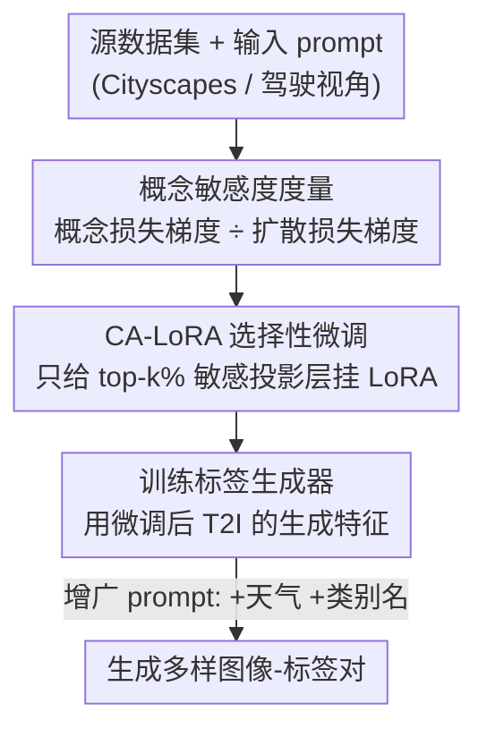

# Concept-Aware LoRA for Domain-Aligned Segmentation Dataset Generation

**会议**: CVPR 2026  
**论文**: [CVF Open Access](https://openaccess.thecvf.com/content/CVPR2026/html/Park_Concept-Aware_LoRA_for_Domain-Aligned_Segmentation_Dataset_Generation_CVPR_2026_paper.html)  
**代码**: 无  
**领域**: 分割数据集生成 / 扩散模型 / 语义分割  
**关键词**: 数据集生成, LoRA选择性微调, 文生图扩散, 域对齐, 城市场景分割  

## 一句话总结
针对"用文生图模型合成分割训练数据"时"微调会过拟合、不微调又域不对齐"的两难，本文提出 Concept-Aware LoRA（CA-LoRA）：先用一个"概念损失"度量出 T2I 模型里对某个目标概念（视角 / 风格）最敏感的投影层，再只对这 top-k% 层做 LoRA 微调，从而只学想要的概念、保留预训练知识，生成既对齐目标域又多样的图像-标签对，在 Cityscapes few-shot 上 +2.30% mIoU、域泛化平均 +1.53% mIoU。

## 研究背景与动机
**领域现状**：语义分割极度依赖像素级标注，而采集+标注成本高昂。近年的做法是用文生图（T2I）扩散模型（如 Stable Diffusion）合成"图像-标签对"来扩充训练集，借助模型在 LAION-5B 等大规模数据上学到的生成能力，去合成稀有/欠采样分布（如恶劣天气、夜间）的样本。

**现有痛点**：生成分割数据集有两个相互拉扯的目标——(1) **域对齐**：合成图要落在目标域里（如 Cityscapes 的"第一人称驾驶视角"）；(2) **信息量**：要能生成超出训练集分布的多样样本。早期不用预训练 T2I、只在目标数据上从头训的方法，天然域对齐但缺外部知识、生不出新东西；而直接拿预训练 T2I 不做任务微调的方法，多样性够但视角/风格跟目标域对不上。

**核心矛盾**：一个自然的折中是对预训练 T2I 做 LoRA 微调来对齐域——但 LoRA 会**过拟合并记住训练数据**。根因在于：微调时模型把训练集里出现的**所有**概念（视角、风格、物体形状、布局……）一股脑都学了，不管它对"域对齐"是否必要，于是连 Cityscapes 的晴天风格、固定布局都背了下来，文本控制力（如改成"foggy / night"）随之失效。

**本文目标**：让微调**只学对齐所必需的那个概念**（如视角或风格），其余预训练知识原封不动保留下来。更进一步，不同设定需要的概念还不一样：in-domain（源=目标，晴天）下学**风格**最有效；域泛化（目标未见，如雨天）下风格没法对齐，学**驾驶视角**更管用。

**切入角度**：既然不同的概念由模型里不同的权重负责，那么"只学某个概念"就等价于"只更新和这个概念相关的那批权重"。问题转化为——**怎么自动定位出哪些权重对目标概念敏感？**

**核心 idea**：用一个可按概念定制的"概念损失"探测每层权重对该概念的响应强度（concept awareness），只给最敏感的 top-k% 投影层挂 LoRA、冻住其余全部，做到"概念级"的选择性微调。

## 方法详解

### 整体框架
方法要解决的是"如何微调 T2I 才能只对齐域、不丢多样性"，整条流水线把它拆成四个阶段：先**定位**对目标概念敏感的权重，再**只微调**这些权重，然后基于微调后模型的生成特征**训练一个标签生成器**，最后用增广 prompt **批量生成**多样的图像-标签对。其中阶段 1-2 是本文真正的创新（CA-LoRA），阶段 3-4 沿用 DatasetDM 的标签生成范式，但喂进去的是 CA-LoRA 微调过的 T2I 特征。

### 关键设计

**1. 概念敏感度（Concept Awareness）：用一个可定制的概念损失探测"哪层负责哪个概念"**

要"只学视角/风格"，第一步得知道模型里哪些层在管视角、哪些在管风格——这是过拟合的根源所在（LoRA 不分青红皂白地动了所有层）。本文设计了一个**概念损失** $L_{\text{Concept}}$ 来逼模型去"改动某个概念"，然后看哪些层的梯度反应最大。具体地：先用 T2I 模型 $\Phi_{T2I}$ 和原始 prompt $c$（如 "Photorealistic first-person urban street view"）生成干净图 $x_0$，加噪得到 $x_t = \sqrt{\bar\alpha_t}x_0 + \sqrt{1-\bar\alpha_t}\,\epsilon$；再把 prompt 按目标概念增广，例如风格增广 $c_{\text{Aug(Style)}}$="Sketch of…"、视角增广 $c_{\text{Aug(Viewpoint)}}$="…in top-down view"。把用增广 caption 算出的去噪预测当作"伪 ground truth"（stop-gradient），概念损失定义为

$$L_{\text{Concept}} := \big\| \epsilon_\theta(x_t, c, t) - \text{sg}[\epsilon_\theta(x_t, c_{\text{Aug}}, t)] \big\|_2^2$$

它的梯度 $\nabla_\theta L_{\text{Concept}}$ 越大的层，越是"听到换风格/换视角就要动"的层，即对该概念越敏感。

直接用梯度的 RMS 范数比较各层会有问题：不同层的梯度幅度存在显著的**位置偏置**（浅层/深层量级天差地别）。本文的关键修正是用**扩散损失梯度做归一化**——同时算原始扩散损失 $L_{\text{Diff}} := \|\epsilon_\theta(x_t,c,t)-\epsilon\|_2^2$，把概念敏感度定义为两者梯度范数之比并对图像、噪声、增广 prompt 取期望：

$$\text{Concept-Awareness}(\theta) := \mathbb{E}_{x_0,\epsilon,c_{\text{Aug}}}\!\left[\frac{\|\nabla_\theta L_{\text{Concept}}\|}{\|\nabla_\theta L_{\text{Diff}}\|}\right]$$

这一步至关重要：消融显示去掉归一化（concept-awareness w/o norm）会退化成跟"全层微调"几乎一样（选出的层被扩散梯度主导，丧失概念特异性，CMMD 0.730 但 mIoU 仅 +0.19）。最后把权重级的敏感度按注意力的 Q/K/V/OUT 投影层分组平均，得到每个投影层对目标概念的敏感度排序。

**2. Concept-Aware LoRA：只给 top-k% 敏感投影层挂 LoRA、冻住其余**

定位出敏感层后，CA-LoRA 不再像标准 LoRA 那样把低秩更新加到每个注意力块的全部 Q/K/V/OUT 投影上，而是**只对概念敏感度排名前 k% 的投影层**做 LoRA 更新（$W_0 + \Delta W = W_0 + BA$，$B\in\mathbb{R}^{d\times r}$，$A\in\mathbb{R}^{r\times k}$，秩 $r\ll\min(d,k)$，文中固定 rank=64），其余权重全部冻结。这样模型只在"管目标概念的那批层"上发生变化，于是只学到目标概念、其它概念的预训练知识被保住——这正是它既能域对齐又不丢多样性的机制来源。

被选比例 $k$ 是用户可调的旋钮（实验扫 1%/2%/3%/5%/10%），用来控制微调强度。按目标概念不同，分 **Style CA-LoRA**（学风格，用于 in-domain）和 **Viewpoint CA-LoRA**（学视角，用于域泛化）两种实例。一个有意思的现象：风格相关层更"高效"——只微调 1% 的风格敏感层，其域对齐效果就追平微调 5–10% 的视角敏感层。

**3. 标签生成器 + 多样数据集生成：用微调后特征缩小域差、靠增广 prompt 造多样性**

有了对齐的图像生成器还不够，得给每张图配标签。本文沿用 DatasetDM 的轻量标签生成器（Mask2Former 形状）：给真实图加噪得 $x_t$，从 $\epsilon_\theta(x_t,c,t)$ 抽多尺度生成特征（特征图 $\mathcal{F}$、交叉注意力图 $\mathcal{A}$），喂给标签生成器预测分割图，整体记作"文本到(图像+标签)"生成器 $\Phi_{T2(I,L)}$。

与 DatasetDM 的**关键区别**在于：DatasetDM 用未微调的预训练 T2I，训练时（真实图特征）和推理时（生成图特征）之间存在显著**域差**，导致生成特征统计分布不一致、标签质量下降；本文改用 CA-LoRA 微调后的 T2I，训练-推理特征统计一致，图像-标签对齐随之大幅提升。生成阶段，靠两类 prompt 增广造多样性：追加天气/光照条件（cGen = "Photorealistic first-person urban street view with [class names] in [weather]"，覆盖 clear/foggy/night/rainy/snowy），以及变换类别名。这里 Viewpoint CA-LoRA 的优势体现得最充分——它只学了视角、没把晴天风格背下来，所以"…in foggy/night"这类文本增广仍然有效；而标准 LoRA 把晴天风格也学了，文本控制力被破坏，造不出恶劣天气。

### 损失函数 / 训练策略
- 度量概念敏感度：概念损失 $L_{\text{Concept}}$（Eq.5）+ 扩散损失 $L_{\text{Diff}}$（Eq.6），按 Eq.7 取比值并对 $x_0,\epsilon,c_{\text{Aug}}$ 求期望。
- 微调 T2I：在选中的 top-k% 层上以扩散损失做 LoRA 训练。
- 标签生成器：交叉熵监督，按 DatasetDM 训练。
- 关键超参：SDXL 为底座；LoRA/CA-LoRA rank=64，训练 10k 步；识别概念用的扩散 timestep 在 [1,81,201,481] 中搜得 81；CA-LoRA 微调单卡 V100 约 1 小时，相比标签生成器 20 小时开销可忽略。in-domain 用 Style CA-LoRA，DG 用 Viewpoint CA-LoRA。

## 实验关键数据

### 主实验
**In-Domain（Cityscapes 各数据比例，mIoU）**：生成 500（few-shot）/3000（全监督）对样本与真实样本 1:1 混批微调。

| 方法 | 0.3% | 1% | 3% | 10% | 100% |
|------|------|------|------|------|------|
| Baseline（仅真实数据） | 41.83 | 49.15 | 59.07 | 69.02 | 79.40 |
| InstructPix2Pix | 41.94 | 48.17 | 60.43 | 66.21 | 78.06 |
| DatasetDM | 42.82 | 49.71 | 60.31 | 69.04 | 80.45 |
| LoRA | 42.97 | 51.80 | 60.22 | 69.21 | 79.75 |
| AdaLoRA | 43.67 | 48.21 | 60.93 | 68.32 | 78.62 |
| **CA-LoRA（本文）** | **44.13 (+2.30)** | **51.90 (+2.75)** | **61.29 (+2.22)** | **70.29 (+1.27)** | **80.74 (+1.34)** |

CA-LoRA 在所有数据比例上都领先；LoRA/AdaLoRA 在低数据比例尚可，但在 10%/100% 掉队（记忆训练集、生不出新样本）。

**Domain Generalization（Cityscapes→ACDC/DZ/BDD/MV，mIoU 平均）**：每个 DG 方法下各取最后一行对比。

| DG 方法 | Baseline | DatasetDM | LoRA | AdaLoRA | CA-LoRA（本文） |
|---------|----------|-----------|------|---------|----------------|
| ColorAug | 47.91 | 48.95 | 49.61 | 49.65 | **50.39 (+2.49)** |
| DAFormer | 49.70 | 50.32 | 50.92 | 50.88 | **51.32 (+1.63)** |
| HRDA | 52.08 | 52.46 | 52.58 | 52.90 | **53.61 (+1.53)** |

在 ACDC、Dark Zurich 这类"恶劣天气/光照驱动域偏移"的数据集上提升最显著（Viewpoint CA-LoRA 只学视角、保住了风格多样性）。

### 消融实验
**微调参数组选择（Cityscapes 0.3%；CMMD↓ 衡量域对齐，mIoU↑ 衡量分割）**：

| 微调组 | 参数占比 | CMMD ↓ | mIoU |
|--------|---------|--------|------|
| 不微调（DatasetDM） | 0% | 5.063 | 42.82 |
| 仅 Q 投影 | 25% | 4.305 | 40.50 (-2.32) |
| 仅 K 投影 | 25% | 3.990 | 43.50 (+0.68) |
| 仅 V 投影 | 25% | 3.003 | 42.77 (-0.05) |
| 仅 OUT 投影 | 25% | 3.005 | 42.82 (+0.00) |
| 全部投影（LoRA） | 100% | **0.644** | 42.97 (+0.15) |
| 随机选层 | 2% | 0.783 | 43.24 (+0.42) |
| 概念敏感度 w/o 归一化 | 2% | 0.730 | 43.01 (+0.19) |
| **概念敏感度（本文）** | 2% | 1.420 | **44.13 (+1.31)** |

### 关键发现
- **归一化是命门**：去掉扩散梯度归一化后，选出的层被扩散梯度主导、退化成"近似全层微调"，CMMD 虽低（0.730）但 mIoU 只 +0.19；加了归一化后只用 2% 参数就拿到最大分割增益 +1.31。
- **CMMD 最低 ≠ 分割最好**：全层 LoRA 的 CMMD（0.644）最优，但因严重记忆训练集、缺乏有用多样性，分割只 +0.15——说明"域对齐"和"信息量"确实是两个需要同时满足的目标。
- **手工选层不靠谱**：Q/V/OUT 单独微调几乎无收益甚至掉点，只有 K 投影有点起色，但都不如自动的概念敏感度选择。
- **风格层 vs 视角层分工明确**：风格敏感层在域对齐和图像-标签对齐上更高效（1% 即可对齐）；视角敏感层在保持天气文本控制力上更强（微调 3–5% 仍保住 CLIP-Score），所以 in-domain 选风格、DG 选视角。

## 亮点与洞察
- **把"只学某个概念"转化为"只更新某批权重"**，并给出一个可操作的探测器（概念损失 + 扩散梯度归一化），这是全文最巧的一步：概念是抽象的，但权重敏感度是可测的。
- **概念损失可按需定制**：换一组增广 caption（sketch→风格、top-down→视角）就能探测不同概念，框架天然可扩展到风格/视角以外的概念（作者也把这列为 future work）。
- **"少即是多"的反直觉**：微调越多层域对齐越好（CMMD 越低），但分割反而变差——选择性微调比全量微调更优，这个结论可迁移到任何"想用预训练模型做域适配又怕过拟合"的生成式数据增强场景。
- **几乎零额外成本**：CA-LoRA 微调单卡 1 小时，相对 20 小时标签生成器训练可忽略，落地友好。

## 局限与展望
- 作者承认：尽管达到了数据集生成方法里的 SOTA，某些设定下的增益仍**偏 marginal**（如全监督 100% 只 +1.34）。
- 概念目前只覆盖**风格和视角**两类——这是为城市场景分割手工挑的；扩展到其它概念（物体形状、布局、光照等）需要重新设计增广 caption，自动化程度有限。⚠️ 增广 prompt（如 "Sketch of…"、"top-down view"）是人工写的，能否对任意概念都构造出有效的对照 prompt 没有讨论。
- 概念敏感度只在 Q/K/V/OUT 投影层粒度上分组，没探讨更细（单个权重）或更粗（整个 block）粒度的影响；timestep（81）是搜出来的超参，对不同概念是否稳定未充分展开。
- 评测集中在城市场景驾驶分割（Cityscapes + ACDC/DZ/BDD/MV），PASCAL VOC 仅在附录补充，跨任务普适性证据偏弱。

## 相关工作与启发
- **vs DatasetDM**：DatasetDM 直接用未微调的预训练 T2I 抽特征训标签生成器，存在训练-推理特征域差、且生成图视角/风格不对齐；本文用 CA-LoRA 微调后的 T2I，缩小域差、提升图像-标签对齐，是直接的上游改进（标签生成器范式照搬）。
- **vs 标准 LoRA / AdaLoRA**：它们对所有层做低秩适配（或自适应分配秩），目标是参数效率，但无法**解耦概念**，微调会把不必要的概念也学进去导致过拟合；CA-LoRA 的差异是"先选层再 LoRA"，实现概念级的选择性更新。
- **vs 手工选层 / ablate-block 类方法**：已有工作靠人工挑层或逐块消融来定位控制特定视觉属性的 block；本文把这个过程**自动化**为可量化的概念敏感度，免去手工试错。
- **vs InstructPix2Pix / DGInStyle 等"标签到图像"增广**：它们主要改纹理、难以改结构内容（InstructPix2Pix）或难复现语义多样性；CA-LoRA 走"图像-标签联合生成"，能产出结构多样且对齐的样本。

## 评分
- 新颖性: ⭐⭐⭐⭐ 把"学某概念"重述为"更新某批权重"并给出可测的概念敏感度探测器，归一化设计是点睛之笔
- 实验充分度: ⭐⭐⭐⭐ in-domain 5 个比例 + 3 个 DG 方法 ×4 数据集 + 参数组消融齐全，但跨任务（非城市场景）证据偏弱
- 写作质量: ⭐⭐⭐⭐ 动机推导清晰、图 1/图 4 直观，公式与消融自洽
- 价值: ⭐⭐⭐⭐ 为"生成式数据增强中如何选择性微调"提供了可复用的范式，落地成本低

<!-- RELATED:START -->

## 相关论文

- [\[CVPR 2026\] CA-LoRA: Concept-Aware LoRA for Domain-Aligned Segmentation Dataset Generation](ca-lora_concept-aware_lora_for_domain-aligned_segmentation_dataset_generation.md)
- [\[CVPR 2026\] Masked Representation Modeling for Domain-Adaptive Segmentation](mrm_masked_representation_modeling_domain_adaptive.md)
- [\[CVPR 2026\] GenMask: Adapting DiT for Segmentation via Direct Mask Generation](genmask_adapting_dit_for_segmentation_via_direct_mask_generation.md)
- [\[CVPR 2026\] RobotSeg: A Model and Dataset for Segmenting Robots in Image and Video](robotseg_a_model_and_dataset_for_segmenting_robots_in_image_and_video.md)
- [\[CVPR 2026\] Looking Beyond the Window: Global-Local Aligned CLIP for Training-free Open-Vocabulary Semantic Segmentation](looking_beyond_the_window_global-local_aligned_clip_for_training-free_open-vocab.md)

<!-- RELATED:END -->
