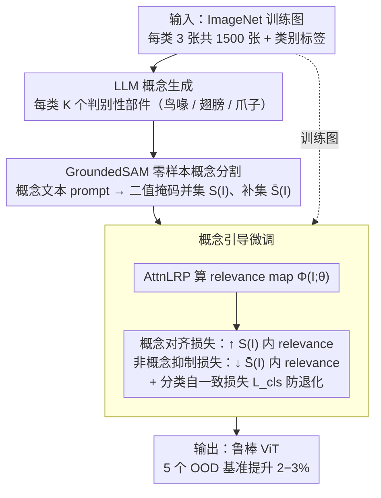

<!-- 由 src/gen_stubs.py 自动生成 -->
# Concept-Guided Fine-Tuning: Steering ViTs away from Spurious Correlations to Improve Robustness

**会议**: CVPR2026  
**arXiv**: [2603.08309](https://arxiv.org/abs/2603.08309)  
**代码**: [GitHub](https://github.com/yonisGit/cft)  
**领域**: 图像分割  
**关键词**: 虚假相关, ViT鲁棒性, 概念引导微调, AttnLRP, 零样本分割, OOD泛化

## 一句话总结

提出 CFT（Concept-Guided Fine-Tuning），利用 LLM 生成类别级语义概念并通过 GroundedSAM 零样本分割获取概念掩码，再以 AttnLRP 的 relevance map 与概念区域对齐为目标微调 ViT，仅用 1500 张图即可显著提升 5 个 OOD 基准上的鲁棒性。

## 背景与动机

1. **ViT 依赖虚假相关**：大规模预训练的 ViT 在 in-distribution 上表现优异，但实际依赖背景纹理、共现物体等虚假特征（spurious correlations）而非真正的语义部件，导致 OOD 场景下性能崩溃
2. **前景-背景二分法太粗糙**：现有解决方案（如 LANCE、RBF）通过前景/背景分割来正则化注意力，但"前景"包含大量非判别区域（如鸟的腹部 vs 鸟喙），无法引导模型聚焦于真正的类别判别特征
3. **人工标注概念不可扩展**：逐类别人工定义语义概念并标注分割掩码成本极高，ImageNet 有 1000 个类别，不可能逐一标注
4. **LLM + 零样本分割提供可扩展方案**：LLM 可自动生成每个类别的判别性概念描述，GroundedSAM 可对任意文本提示进行零样本分割，两者结合实现无需人工标注的概念级监督
5. **Relevance map 可解释注意力分配**：AttnLRP 提供像素级的 relevance 归因，可量化模型对每个区域的关注程度，为对齐优化提供可微分的监督信号

## 核心问题

如何在不依赖人工标注的前提下，引导 ViT 将注意力从虚假相关区域（背景、纹理）转向真正的类别语义概念区域，从而提升 OOD 鲁棒性？

## 方法详解

### 整体框架

CFT（Concept-Guided Fine-Tuning）要把 ViT 的注意力从背景纹理、共现物体这类虚假相关，掰回到真正的类别语义部件上，从而提升 OOD 鲁棒性。它分三个阶段、全程无需人工标注：先用 LLM 为每个类别生成判别性概念，再用 GroundedSAM 把这些概念零样本分割成掩码，最后以 AttnLRP 的 relevance map 与概念区域对齐为目标微调 ViT——每类只要 3 张图、共 1500 张就够。

### 关键设计

**1. LLM 概念生成：把"该看哪里"从粗粒度前景细化到具体语义部件**

现有方法只做前景/背景二分，但"前景"里塞着大量非判别区域（鸟的腹部和鸟喙都算前景），引导不到点子上；而逐类人工定义并标注概念，面对 ImageNet 上千类根本不可扩展。CFT 改用 LLM（如 GPT-4）为每个类别 $c$ 自动生成 $K$ 个判别性视觉概念，且 prompt 明确要求输出"视觉上可区分的部件或属性"而非抽象语义——比如 "bird" 会得到 "long beak"、"wings"、"talons"、"feathers"，覆盖该类的主要判别特征。

**2. GroundedSAM 零样本概念分割：把文本概念变成可监督的像素掩码**

有了概念词还得落到图像上的具体区域。CFT 把 LLM 生成的概念文本当 prompt 喂给 GroundedSAM，对每张训练图 $I$ 零样本输出每个概念的二值掩码 $S_k(I)$，再求并集得到概念区域掩码 $S(I) = \bigcup_{k=1}^K S_k(I)$；其补集 $\bar{S}(I) = 1 - S(I)$ 就是非概念区域，囊括背景和无判别力的前景。这一步把"语义概念"翻译成了可直接拿来监督注意力的像素级目标，整条链路依旧零人工标注。

**3. 概念引导微调：用 AttnLRP 的 relevance 把注意力对齐到概念区域**

最后用 AttnLRP 算出 relevance map $\Phi(I; \theta)$（$\Phi_{ij} \in [0, 1]$ 表示模型对像素 $(i,j)$ 的关注度），定义三个损失联合优化。概念对齐损失最大化概念区域内的 relevance：

$$\mathcal{L}_{concept} = -\frac{1}{|S(I)|} \sum_{(i,j) \in S(I)} \log \Phi_{ij}(I; \theta)$$

非概念抑制损失最小化非概念区域的 relevance：

$$\mathcal{L}_{non\text{-}concept} = -\frac{1}{|\bar{S}(I)|} \sum_{(i,j) \in \bar{S}(I)} \log(1 - \Phi_{ij}(I; \theta))$$

再加一个标准交叉熵自一致性损失 $\mathcal{L}_{cls}$ 防止微调中分类性能退化，合成总目标：

$$\mathcal{L}_{total} = \mathcal{L}_{cls} + \alpha \mathcal{L}_{concept} + \beta \mathcal{L}_{non\text{-}concept}$$

这样"看对地方"被直接写进可微目标，把 relevance 从背景拽到鸟喙、翅膀、爪子这些真正的部件上。

### 训练细节

- 训练数据：从 ImageNet 训练集每类随机采样 3 张，共 500 类 × 3 = 1500 张
- 微调 50 个 epoch，仅更新 ViT 的最后几层参数
- AttnLRP 的 relevance map 在每次前向传播时实时计算，提供像素级梯度信号
- 概念掩码预计算后缓存，不增加训练时额外开销

## 实验关键数据

### 数据集与设置

- **In-distribution**：ImageNet-1K 验证集
- **OOD 基准**（5 个）：ImageNet-A（自然对抗样本）、ObjectNet（新视角/背景）、ImageNet-R（艺术渲染风格）、ImageNet-Sketch（素描）、SI-Score（合成形状/纹理控制）
- **骨干网络**：DINOv2 ViT-B/14、ViT-B/16、DeiT-B/16、ConvNeXt-B
- **对比方法**：vanilla fine-tuning、LANCE、RBF、StylEx、foreground-only baseline

### 主实验结果

| 方法 | IN-1K↑ | IN-A↑ | ObjectNet↑ | IN-R↑ | IN-Sketch↑ | SI-Score↑ |
|------|--------|-------|------------|-------|------------|-----------|
| DINOv2 baseline | 84.5 | 70.3 | 53.8 | 72.1 | 52.4 | 61.2 |
| LANCE | 84.2 | 71.5 | 54.6 | 72.8 | 53.1 | 62.0 |
| RBF | 84.0 | 71.8 | 54.2 | 73.0 | 53.5 | 62.4 |
| **CFT (ours)** | **84.8** | **73.6** | **56.4** | **74.5** | **55.2** | **64.1** |

CFT 在所有 5 个 OOD 基准上均超越 baseline 和已有方法，同时保持甚至略微提升 in-distribution 精度。相比 LANCE/RBF，OOD 平均提升约 2-3 个百分点。

### 跨架构泛化

| 骨干网络 | IN-A Δ | ObjectNet Δ | IN-R Δ |
|----------|--------|-------------|--------|
| DINOv2 ViT-B | +3.3 | +2.6 | +2.4 |
| ViT-B/16 | +2.8 | +2.1 | +1.9 |
| DeiT-B/16 | +2.5 | +1.8 | +1.7 |
| ConvNeXt-B | +1.6 | +1.2 | +1.1 |

CFT 对 Transformer 架构效果最显著，ConvNeXt 也有改善但幅度较小（ConvNeXt 无全局注意力，relevance map 精度受限）。

### Relevance Map 对齐质量

- 微调后 relevance map 与 Ground-truth 语义部件掩码的 IoU 从 0.31 提升至 0.52
- 可视化显示：baseline 的热力图分散在背景纹理上，CFT 微调后高度集中于鸟喙、翅膀、爪子等语义部件
- SI-Score 上的分析表明：CFT 模型对 shape 特征的依赖增强，对 texture 特征的依赖减弱

### 消融实验

- **去掉 $\mathcal{L}_{concept}$**：OOD 平均下降 1.5%，模型无法被引导到正确区域
- **去掉 $\mathcal{L}_{non\text{-}concept}$**：OOD 平均下降 1.2%，虚假区域的 relevance 未被有效抑制
- **去掉 $\mathcal{L}_{cls}$**：in-distribution 下降 2.1%，微调偏离原始分类目标
- **前景-背景掩码替代概念掩码**：OOD 平均下降 0.8-1.5%，验证概念级粒度的优越性
- **每类图像数量**：1 张/类时 OOD 提升有限，3 张/类达到收益饱和，5 张/类无显著额外增益
- **LLM 概念数量**：3-5 个概念/类为最优，过多概念引入噪声掩码

## 亮点

- **概念级粒度创新**：跳出前景/背景二分法，用 LLM 自动生成的语义概念（如 "beak"、"wings"）作为监督粒度，更精确地定义了模型应关注的区域
- **全自动流水线**：LLM 概念生成 → GroundedSAM 分割 → AttnLRP 对齐，端到端无需人工标注，可扩展到任意类别数
- **极低数据需求**：仅 1500 张图（每类 3 张）微调 50 epoch，训练成本极低，适合实际部署
- **保持 in-distribution 性能**：通过 $\mathcal{L}_{cls}$ 自一致性约束，微调后 ImageNet 精度不降反升，解决了鲁棒性与精度的 trade-off
- **跨架构通用性**：DINOv2、ViT、DeiT、ConvNeXt 均有效，不依赖特定架构设计
- **可解释性增强**：relevance map 与语义部件的对齐可视化直接展示了模型"看对了地方"

## 局限与展望

- LLM 生成的概念质量依赖 prompt 设计和 LLM 能力，对细粒度类别（如昆虫亚种）可能生成不够判别的概念
- GroundedSAM 的零样本分割精度有限，对小物体或遮挡场景可能产生噪声掩码，会传播到微调过程
- 仅在分类任务上验证，未扩展到检测、分割等下游任务
- AttnLRP 仅适用于 Transformer 架构，ConvNeXt 上需用替代归因方法，限制了对 CNN 的效果
- 未探索概念的层级结构（如 "bird" → "head" → "beak"），当前是扁平概念列表
- 微调仅更新部分层参数，未讨论全量微调或 LoRA 等参数高效微调方案的效果差异

## 与相关工作的对比

- **vs LANCE**：LANCE 用前景掩码 + 语言引导对齐，但前景粒度太粗，包含大量非判别区域；CFT 用概念级掩码精确定位判别部件，OOD 提升更大
- **vs RBF（Right for the Better Features）**：RBF 通过增强前景/抑制背景的数据增强来减少虚假相关，是数据层面方案；CFT 是模型层面的 relevance 对齐方案，两者可互补
- **vs StylEx**：StylEx 通过 StyleGAN 发现和操控风格属性来分析虚假特征，主要是诊断工具；CFT 直接修复虚假依赖
- **vs Concept Bottleneck Models**：CBM 需要人工概念标注作为中间表示，不可扩展；CFT 用 LLM 自动生成 + GroundedSAM 零样本分割，无标注成本
- **vs 注意力正则化方法**：传统注意力正则化用人工定义区域或 CAM/GradCAM 等粗糙归因；CFT 用 AttnLRP 提供更精确的像素级 relevance 信号

## 评分

- 新颖性: ⭐⭐⭐⭐ — LLM+分割+relevance对齐的组合创新，概念级粒度是核心贡献
- 实验充分度: ⭐⭐⭐⭐ — 5个OOD基准+4种架构+完整消融，但缺少下游任务验证
- 写作质量: ⭐⭐⭐⭐ — 动机清晰，流水线图描述直观，公式简洁
- 价值: ⭐⭐⭐⭐ — 低成本提升鲁棒性的实用方案，对OOD部署有直接参考价值

<!-- RELATED:START -->

## 相关论文

- [\[ICCV 2025\] DDB: Diffusion Driven Balancing to Address Spurious Correlations](../../ICCV2025/segmentation/ddb_diffusion_driven_balancing_to_address_spurious_correlations.md)
- [\[CVPR 2026\] ConceptPrism: Concept Disentanglement in Personalized Diffusion Models via Residual Token Optimization](conceptprism_concept_disentanglement_in_personalized_diffusion_models_via_residu.md)
- [\[ECCV 2024\] Efficient and Versatile Robust Fine-Tuning of Zero-shot Models](../../ECCV2024/segmentation/efficient_and_versatile_robust_fine-tuning_of_zero-shot_models.md)
- [\[CVPR 2026\] Seeing Through the Tool: A Controlled Benchmark for Occlusion Robustness in Foundation Segmentation Models](occsam_bench_occlusion_robustness_segmentation.md)
- [\[ICML 2025\] InfoSAM: Fine-Tuning the Segment Anything Model from An Information-Theoretic Perspective](../../ICML2025/segmentation/infosam_fine-tuning_the_segment_anything_model_from_an_information-theoretic_per.md)

<!-- RELATED:END -->
