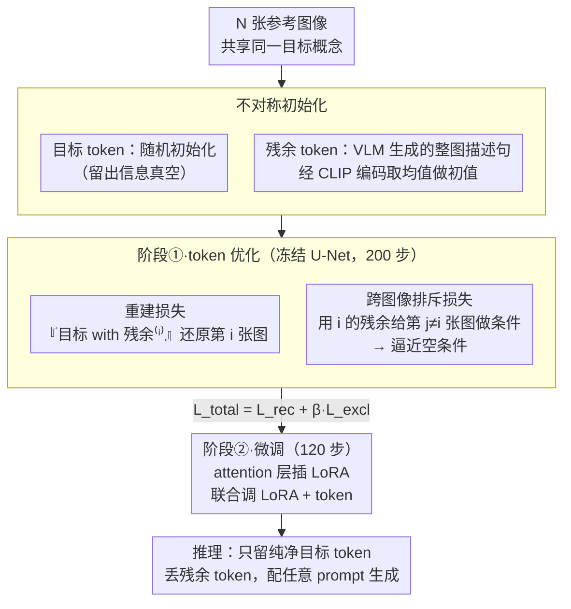

<!-- 由 src/gen_stubs.py 自动生成 -->
# ConceptPrism: Concept Disentanglement in Personalized Diffusion Models via Residual Token Optimization

**会议**: CVPR2026  
**arXiv**: [2602.19575](https://arxiv.org/abs/2602.19575)  
**代码**: 待确认  
**领域**: 图像分割  
**关键词**: 个性化扩散模型, 概念解耦, 残余token优化, Textual Inversion, LoRA, 对比学习

## 一句话总结

提出 ConceptPrism，通过引入图像级残余 token 和跨图像排斥损失，在个性化 T2I 扩散模型中自动将共享目标概念与图像特有的残余信息解耦，在 DreamBench 上 CLIP-T/DINO/CLIP-I 全面最优。

## 背景与动机

1. **个性化 T2I 的 concept entanglement 问题**：Textual Inversion、DreamBooth 等方法从少量图像学习概念 token，但学到的 token 不可避免地将目标概念（如特定狗的外观）与图像特有信息（如背景、姿态、光照）混在一起
2. **entanglement 的具体危害**：生成新场景时，残余信息会"泄漏"到输出中——例如在"沙滩上的 [V] 狗"中出现训练图像中的室内背景元素，导致文本对齐度下降和生成多样性降低
3. **现有解耦方法的局限**：Break-A-Scene 需要分割掩码标注，Custom Diffusion 仅通过限制微调参数来间接缓解，Cones 需要人工指定概念对应层——都依赖额外监督或先验
4. **图像间对比蕴含解耦信号**：同一概念的不同图像共享目标信息但各有独特残余信息，通过跨图像对比可以自然地分离共享 vs 特有成分，无需任何额外标注
5. **token 空间的信息分配**：学习多个 token 时，如果没有显式约束，所有 token 会冗余地编码相同信息；需要机制保证不同 token 各司其职

## 核心问题

如何在无额外标注的条件下，从少量参考图像中学习一个纯净的概念表示，使其仅包含共享目标概念而剥离图像特有的残余信息（背景、姿态、光照等）？

## 方法详解

### 整体框架

ConceptPrism 想解决个性化 T2I 里"概念和图像特有信息缠在一起"的问题。它给每个被学习的概念配两类可学习 token：一个所有参考图像共享的目标 token（target token）$t_{target}$，负责承接跨图像反复出现的目标概念；以及每张图像各自一个的残余 token（residual token）$t_{residual}^{(i)}$，负责吸走这张图独有的背景、姿态、光照。整个流程分两个阶段：先冻结 U-Net 只优化这两类 token（用重建损失保证"目标+残余"合起来能还原原图，再用一个跨图像的排斥损失把共享信息从残余 token 里挤出去），再给 attention 层插 LoRA 联合微调补上模型级保真度；推理时只留纯净的目标 token、丢掉全部残余 token，于是生成结果只带目标概念、不再泄漏训练图的杂质。

### 关键设计

**1. 不对称初始化：让两类 token 从一开始就分工**

缠绕的根源之一是多个 token 不加约束时会冗余地编码同样信息。ConceptPrism 用初始化制造分工：目标 token 随机初始化，形成一个"信息真空"，在重建损失驱动下自然去填那些跨图像反复出现的内容（即共享概念），且不需要像以往方法那样依赖一个类别名词（class noun）作先验；而每个残余 token 则用对应图像的整图描述句（8–32 词、由 VLM（论文用 Gemini 2.5 Flash）自动生成）送入 CLIP 编码器、取其均值嵌入作为初值，一上来就握着这张图的全部细节，训练中只需把共享部分让给目标 token、自己留下特有残余。这种"一个从零学、一个从满减"的不对称设计让信息流向天然互补，无需额外的优化技巧去强行分配。

**2. 重建损失：先把两类 token 合起来不丢信息这个锚立住**

在排斥之前必须先有一个"信息守恒"的锚，否则把共享概念从残余 token 里挤出去后、目标概念也可能跟着丢。重建损失要求条件 "[$t_{target}$] with [$t_{residual}^{(i)}$]" 能重建第 $i$ 张参考图 $x^{(i)}$：

$$\mathcal{L}_{recon} = \mathbb{E}_{i, t, \epsilon} \left[ \| \epsilon - \epsilon_\theta(z_t^{(i)}, c_{target+residual}^{(i)}) \|^2 \right]$$

其中 $z_t^{(i)}$ 是加噪后的第 $i$ 张图，$c_{target+residual}^{(i)}$ 是同时含两类 token 的文本条件。它保证目标 token 与残余 token 加起来覆盖整张图的信息，给后面的"分离"留出腾挪空间。

**3. 跨图像排斥损失：把共享概念从残余 token 里挤出去**

这是把概念真正解耦出来的核心。直觉是：如果某张图的残余 token 还残留着共享概念，那么拿它去给**另一张**图 $x^{(j)}$（$j \neq i$）做条件生成时，结果就会偏离无条件生成；反过来只要残余 token 里不含共享信息，它对别的图像就应该毫无贡献、等同于空条件。于是损失直接惩罚这种"跨图像的泄漏"：

$$\mathcal{L}_{excl} = \mathbb{E}_{i, j \neq i, t, \epsilon} \left[ \| \epsilon_\theta(z_t^{(j)}, c_{residual}^{(i)}) - \epsilon_\theta(z_t^{(j)}, \varnothing) \|^2 \right]$$

$c_{residual}^{(i)}$ 是只用第 $i$ 张图残余 token 的条件，$\varnothing$ 是空文本无条件。$j \neq i$ 的交叉是关键——若用 $j = i$，同一张图的噪声样本本就和自己的残余 token 相关，无法分辨"概念泄漏"还是"图像特定匹配"。最小化它等价于最小化 $\text{KL}(p(x) \| p(x|c_{residual}^{(i)}))$，把残余 token 的条件分布逼向无条件分布，于是共享概念被迫全部沉淀到目标 token 上。

### 损失函数 / 训练策略

总损失把重建与排斥加权合并，权重 $\beta = 0.05$ 时最优（过小排斥不充分，过大则把残余 token 逼成空条件、反而迫使目标 token 重新吸收残余信息、文本对齐变差）：

$$\mathcal{L}_{total} = \mathcal{L}_{recon} + \beta\, \mathcal{L}_{excl}$$

（目标 token 长度取 1、每个残余 token 长度取 8。）优化分两段：先冻结 U-Net、只优化 $t_{target}$ 和 $\{t_{residual}^{(i)}\}$ 的嵌入 200 步，快速学到概念的粗表示；再在 attention 层加 LoRA、联合微调 LoRA 与 token 嵌入约 120 步达到最优，补上模型级的细粒度保真度。推理时只保留解耦干净的 $t_{target}$、丢掉全部残余 token，配任意 prompt 生成，于是输出只含目标概念、不再泄漏训练图的背景与姿态。

## 实验关键数据

### 数据集与设置

- **DreamBench**：30 个主题，每主题 4-6 张参考图像，25 个文本 prompt
- **概念类型**：object（特定物体）、style（艺术风格）、pose（身体姿态）等
- **评价指标**：CLIP-T（文本对齐）、DINO（主题保真度）、CLIP-I（图像相似度）
- **对比方法**：Textual Inversion、DreamBooth、Custom Diffusion、Break-A-Scene、SVDiff、ELITE、Cones、P+

### 主实验结果

| 方法 | CLIP-T↑ | DINO↑ | CLIP-I↑ |
|------|---------|-------|---------|
| Textual Inversion | 0.321 | 0.154 | 0.305 |
| DreamBooth | 0.340 | 0.189 | 0.332 |
| Custom Diffusion | 0.338 | 0.183 | 0.328 |
| Break-A-Scene | 0.335 | 0.178 | 0.322 |
| SVDiff | 0.331 | 0.171 | 0.319 |
| P+ | 0.342 | 0.192 | 0.341 |
| **ConceptPrism** | **0.357** | **0.210** | **0.353** |

ConceptPrism 在三个指标上全面最优。CLIP-T 最高表明文本对齐最好（排斥损失有效减少了残余信息对文本遵循的干扰）；DINO 最高表明概念保真度最好（target token 精确编码了共享概念）。

### 多概念类型分析

| 概念类型 | CLIP-T↑ | DINO↑ |
|----------|---------|-------|
| Object | 0.361 | 0.223 |
| Style | 0.349 | 0.185 |
| Pose | 0.352 | 0.198 |

ConceptPrism 在 object/style/pose 三种概念类型上均有效，说明解耦机制是通用的，不局限于特定概念类型。

### 消融实验

- **去掉 $\mathcal{L}_{excl}$**：CLIP-T 下降 0.020，DINO 下降 0.018，退化为标准多 token 学习，target 和 residual token 信息冗余
- **$j = i$（非交叉排斥）**：效果大幅下降，因为同一图像的噪声与残余 token 自然相关，无法区分共享 vs 特有信息
- **去掉 residual token（仅 target）**：CLIP-T 下降 0.015，target token 被迫编码所有信息，概念不纯净
- **去掉描述性句子初始化**：DINO 下降 0.012，随机初始化的 residual token 学习更慢，部分残余信息未被充分吸收
- **去掉 LoRA 阶段**：DINO 下降 0.025，仅 token 优化无法捕捉细粒度概念细节
- **$\beta$ 敏感性**：$\beta = 0.05$ 为最优，过小则排斥不充分，过大则把残余 token 逼成空条件、迫使目标 token 重新吸收残余信息，反而拉低文本对齐

### 定性分析

- 可视化显示 ConceptPrism 生成的图像在新场景中保持了目标概念的精确特征（如狗的毛色、品种特征），同时完全服从文本 prompt 描述的新场景
- 对比 DreamBooth 和 Custom Diffusion，后两者在"沙滩"场景中会泄漏训练图像的室内背景元素
- Residual token 单独用于生成时，产生模糊的、与目标概念无关的图像，验证了排斥损失的有效性

## 亮点

- **排斥损失的巧妙设计**：通过跨图像对比（$j \neq i$）迫使 residual token 丢弃共享信息，理论上等价于最小化 KL 散度，动机清晰且实现简洁
- **无额外标注**：不需要分割掩码、概念标签或人工指定，完全从图像间的自然对比中学习解耦，比 Break-A-Scene 和 Cones 更实用
- **初始化策略精巧**：target 随机初始化 + residual 描述句子初始化的不对称设计，利用"信息真空"原理自然引导信息流向，无需复杂的优化策略
- **适用于多种概念类型**：object/style/pose 均有效，解耦机制是通用的而非领域特定的
- **轻量级高效**：200 步 token 优化 + 120 步 LoRA 微调，总共 320 步即可完成，远少于 DreamBooth 的数百步全量微调
- **理论支撑清晰**：排斥损失从 KL 散度推导而来，进一步简化为噪声预测匹配，推导过程完整

## 局限与展望

- 仅在 Stable Diffusion v1.5 上实验，未验证在 SDXL、SD3 等更新架构上的效果
- 排斥损失需要至少 2 张参考图像（$j \neq i$），单图场景退化为无排斥损失，解耦能力受限
- Residual token 的数量与参考图像数量绑定（一一对应），参考图像过多时 token 优化开销增大
- 描述性句子由 BLIP-2 自动生成，其质量影响 residual token 初始化；对复杂场景（如多物体重叠）的描述可能不准确
- 未探索 residual token 本身的价值——理论上残余信息（如背景风格）也可被单独利用，但论文仅在推理时丢弃
- 未与 IP-Adapter 等免训练个性化方法对比，这些方法在效率上有明显优势

## 与相关工作的对比

- **vs Textual Inversion**：Textual Inversion 用单个 token 编码所有信息，无法解耦概念与残余；ConceptPrism 的多 token + 排斥机制显式分离两者
- **vs DreamBooth**：DreamBooth 全量微调 U-Net 学习概念，生成保真度高但 entanglement 严重；ConceptPrism 用 LoRA + 排斥损失在保真度和解耦间取得更好平衡
- **vs Custom Diffusion**：Custom Diffusion 仅微调交叉注意力的 K/V 矩阵来间接减少 entanglement，是参数限制而非显式解耦；ConceptPrism 通过排斥损失直接优化解耦目标
- **vs Break-A-Scene**：Break-A-Scene 需要分割掩码标注来分离前景/背景概念，是有监督解耦；ConceptPrism 无需任何标注，通过跨图像对比自监督解耦
- **vs Cones**：Cones 需要人工指定概念对应的 U-Net 层（神经元级别），依赖人工先验；ConceptPrism 的 token 级解耦更自然且自动

## 评分

- 新颖性: ⭐⭐⭐⭐ — 残余token+排斥损失的解耦机制是核心贡献，交叉图像对比设计巧妙
- 实验充分度: ⭐⭐⭐⭐ — DreamBench全面对比+多概念类型+消融完整，但仅限SD1.5
- 写作质量: ⭐⭐⭐⭐ — 从KL散度到噪声匹配的推导清晰，图示直观
- 价值: ⭐⭐⭐⭐ — 解决个性化T2I的核心痛点，实用性强，轻量级方案易于集成

<!-- RELATED:START -->

## 相关论文

- [\[ICCV 2025\] Personalized OVSS: Understanding Personal Concept in Open-Vocabulary Semantic Segmentation](../../ICCV2025/segmentation/understanding_personal_concept_in_open-vocabulary_semantic_segmentation.md)
- [\[CVPR 2026\] CA-LoRA: Concept-Aware LoRA for Domain-Aligned Segmentation Dataset Generation](ca-lora_concept-aware_lora_for_domain-aligned_segmentation_dataset_generation.md)
- [\[CVPR 2026\] Concept-Guided Fine-Tuning: Steering ViTs away from Spurious Correlations to Improve Robustness](concept-guided_fine-tuning_steering_vits_away_from_spurious_correlations_to_impr.md)
- [\[CVPR 2026\] RSONet: Region-guided Selective Optimization Network for RGB-T Salient Object Detection](rsonet_region-guided_selective_optimization_network_for_rgb-t_salient_object_det.md)
- [\[ECCV 2024\] Diffusion Models for Open-Vocabulary Segmentation](../../ECCV2024/segmentation/diffusion_models_for_open-vocabulary_segmentation.md)

<!-- RELATED:END -->
