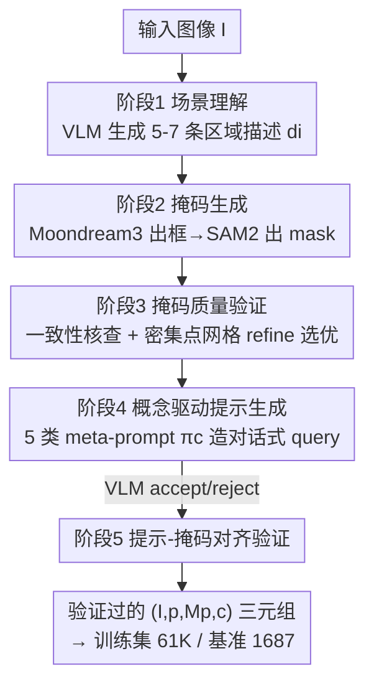

# Conversational Image Segmentation: Grounding Abstract Concepts with Scalable Supervision

**会议**: CVPR 2026  
**论文**: [CVF Open Access](https://openaccess.thecvf.com/content/CVPR2026/html/Sahoo_Conversational_Image_Segmentation_Grounding_Abstract_Concepts_with_Scalable_Supervision_CVPR_2026_paper.html)  
**代码**: https://glab-caltech.github.io/converseg （项目页）  
**领域**: 指代/对话式图像分割  
**关键词**: 对话式分割, 可供性推理, VLM数据引擎, 课程学习, SAM2  

## 一句话总结
本文提出"对话式图像分割（CIS）"任务——把可供性、物理稳定性、用户意图等抽象概念落到像素级 mask 上，配套构建了 CONVERSEG 基准、一套全自动 VLM 数据引擎（无需人工标注合成 61K prompt–mask 对）以及单遍模型 CONVERSEG-NET，在 CONVERSEG 上 gIoU 达 70.5%（3B）/73.3%（7B），同时在 RefCOCO/ReasonSeg 等传统基准保持竞争力。

## 研究背景与动机

**领域现状**：用自然语言把图像区域"指出来"最早由指代图像分割（RIS）研究，标准基准 RefCOCO/+/g 主导了这个方向。

**现有痛点**：RefCOCO 类基准里的 query 绝大多数是类别+空间关系（"白色的伞""最左边的苹果"），考察的是"认得出物体、分得清左右"。但人类真正问的是"哪个箱子能抽出来又不会让整摞塌掉？""刀放哪儿安全？"——这类问题需要联合推理几何、物理稳定性和用户意图，而一个只学了 `suitcase`/`cart` 类别的分割模型对支撑关系、遮挡顺序、物理稳定性毫无表征。现有 ReasonSeg 虽引入隐式推理，但 query 仍以实体/空间为主，对可供性、安全、物理约束覆盖极少。

**核心矛盾**：现有的多模态推理分割系统（LISA、GLaMM、PixelLM）确实能做多步推理出 mask，但依赖重型 backbone + 多阶段推理（思维链、工具调用），部署昂贵；而轻量的提示式分割模型（SAM/SAM2）有强分割先验却没有文本条件。两类能力——"会推理"和"分得准"——没被低成本地缝在一起。

**本文目标**：(1) 定义并量化"对话式概念"的 grounding 能力；(2) 绕过昂贵的人工标注，规模化造出推理丰富的 prompt–mask 监督；(3) 用单遍前馈模型把分割先验和语言理解融合，不靠多轮/工具调用。

**切入角度**：作者借鉴人类视觉科学与直觉物理学——人能直接从视觉输入推断功能属性与物理约束。于是把对话式概念组织成五大家族（实体 / 空间布局 / 关系事件 / 可供性功能 / 物理安全），让基准在这五类上接近均匀覆盖（图 3），而非像旧数据集 >50% 堆在实体+空间。

**核心 idea**：与其堆模型容量，不如**扩训练数据的多样性**——用 VLM 驱动的"生成—验证"闭环自动合成跨五类推理概念的 61K prompt–mask 对，再用一个轻量 3B VLM + SAM2 解码器单遍消化，把"会推理"和"分得准"低成本缝合。

## 方法详解

### 整体框架
本文有两条主线：一条是**数据侧**的全自动数据引擎（输入一张图，输出若干验证过的 `(prompt, mask, 概念类型)` 三元组），既用来造训练集也用来 curate 基准；另一条是**模型侧**的 CONVERSEG-NET（输入图像 I + 文本 prompt p，单遍输出二值 mask $M_p$）。数据引擎是五阶段串行 + 多处验证关卡的 pipeline，是论文工程量最大的部分；模型则刻意保持简单——冻结的 SAM2 图像编码器 + LoRA 微调的 Qwen2.5-VL 提示编码器 + 轻量 adapter + 全微调的 SAM2 mask 解码器，避免任何迭代工具调用或多轮 refine。最后用"从字面到对话"的两阶段课程把语言条件灌进本无语言先验的 SAM2。

数据引擎的五阶段流向如下：

### 关键设计

**1. 对话式数据引擎：五阶段"生成—验证"闭环把抽象概念监督做到无人工**

痛点很直接：要训练一个能 ground 可供性/物理约束的模型，得有大量既包含推理丰富 prompt、又像素精确 mask 的标注，而让人类既写"哪些表面能放热锅"这种 prompt 又画准 mask，成本高到不可行。本文用 VLM 把这条流水线全自动化，并在每个易错环节插验证关卡（pipeline 系统最怕误差逐级累积）。**阶段 1 场景理解**：VLM 对图像产出 5–7 条 ≤15 词的区域描述 $d_i$（含类别、属性、位置、关系），作为后续 mask 的目标。**阶段 2 掩码生成**：对每条 $d_i$，用 Moondream3 做开放词表检测出框 $b_i$，再用 SAM2 以框为条件分割出 $m_i$——分工是因为 Moondream3 擅长开放词表定位、SAM2 擅长框条件分割。**阶段 3 掩码质量验证**是关键防错：先做 mask–text 一致性核查（VLM 判断 $(b_i,m_i)$ 在身份/属性/位置上是否真对应 $d_i$，只放行 accept），再做 refine——因为噪声框常导致 mask 欠/过覆盖或有洞，于是用密集点网格采样 SAM2 得到候选 $m_i'$、取与 $m_i$ 的 IoU 最高者，再让 VLM 在两者间按覆盖度/边界精度/伪影挑更好的 $\hat m_i$。**阶段 4 概念驱动提示生成**：对每个概念 $c$ 用专门的 meta-prompt $\pi_c$，喂入带编号的区域描述 + set-of-marks 数字叠加图，让 VLM 生成至多 3 条 prompt 并指派对应区域，且主动剪掉平凡对（如全图只有一辆车却问"分割那辆车"）。**阶段 5 对齐验证**：VLM 再核查 $(I,p,M_p,c)$ 中 mask 是否命中 prompt 目标、是否排除无关内容、prompt 是否合理描述该 mask，只有 accept 才进数据集。所有 VLM 环节用 Gemini-2.5-Flash。这套"多阶段验证 + refine"正是它能产出基准级质量却不靠人工的原因；引擎还**双用**——跑 COCO val 造基准（再加一道人工 accept/reject），跑 COCO train 大规模造 61K 训练对。

**2. CONVERSEG-NET 单遍架构：把文本 token 当"软点提示"灌进 SAM2 解码器**

痛点是 SAM/SAM2 有强分割先验却无文本条件，而 VLM 有视觉-语言理解却不会分割，且现有融合方案常要多轮/工具调用。本文把两者用最轻的方式缝起来：**图像编码器**用 SAM2 的 MAE 预训练 ViT，全程冻结，对每张图只编码一次得到空间特征 $z_{img}$（与 prompt 无关，可复用）。**提示编码器**用 Qwen2.5-VL-3B，联合处理图像 I 和文本 p，取最后一层文本 token 的隐状态 $\{h_1,\dots,h_T,h_{EOS}\}$（这些 token 已通过 backbone attend 过图像 token，所以自带视觉上下文）。仿照 SAM 的稀疏/稠密提示设计：文本序列 $\{h_1,\dots,h_T\}$ 当**稀疏 embedding**（捕捉细粒度文本信息），EOS 位的隐状态当**稠密 embedding**（捕捉全局图文语境），两个轻量 adapter 投到解码器空间——$e_{sparse}=\mathrm{Linear}_{D_t\to D_{dec}}(\{h_1,\dots,h_T\})$，$e_{dense}=\mathrm{MLP}_{D_t\to D_{dec}}(h_{EOS})$（稠密路是 2 层 SiLU MLP）。Qwen backbone 用 LoRA（rank 16，$\alpha=32$）微调。**mask 解码器**直接用 SAM2 的解码器并全微调，经双向 cross-attention 后上采样 + MLP 出逐像素前景概率。为什么有效：作者观察到解码器里每个文本 token 的 cross-attention 是稀疏、点状而非弥散的（图 7），说明用语言 embedding 替换 SAM 原本的点提示后，**每个 token 实际表现得像一个软点提示**——这正好对上 SAM2 解码器原生的提示机制，无需改其结构就能接住语言条件。

**3. 从字面到对话的两阶段课程：先学"分得准"再学"会推理"，且不互相遗忘**

痛点是 SAM2 完全没语言先验，若一上来就喂高度抽象的对话式概念，模型既学不会语言 grounding 又会在基础分割上崩。本文用难度递增的课程解决。训练数据按复杂度分四组：(1) 字面概念——COCO train 用 COCONut 精修 mask 重组成"分割图中所有 [类别]"，117K 对；(2) 基础指代——RefCOCO/+/g 共 321K 对象级指代；(3) 开放词表区域——数据引擎阶段 3 产出的 27K 超出 COCO 闭词表的区域描述；(4) 对话式概念——引擎产出的 61K 跨五类概念对。**阶段 1 预训练**在 1–3 组混合上学到一个会基础指代分割的底座；**阶段 2 对话后训练**从阶段 1 初始化，在第 4 组里**混入等量从 1–3 组随机抽的样本**、用更低学习率（$\eta_2=10^{-5}$，阶段 1 为 $10^{-4}$）微调。这个 50-50 混合是关键：消融显示只用对话数据训会过拟合（RefCOCO/+/g 仅 68.0%），不用课程全混一起训又会掉对话性能（CONVERSEG 61.9%），而完整课程同时拿到 76.2%（RefCOCO/+/g）和 64.4%（CONVERSEG）。它让模型在适配抽象概念时不遗忘基础分割能力。

### 损失函数 / 训练策略
监督 mask 用 BCE + Dice 加权：$L = L_{BCE}(M, M^*) + \lambda L_{Dice}(M, M^*)$，$\lambda=0.25$。AdamW，batch size 6，cosine + warmup；阶段 1 与阶段 2 各 35K 步，单张 A100 80GB 约 48 小时。

## 实验关键数据

### 主实验
CONVERSEG 基准（gIoU %，SAM-seeded 与 human-annotated 两个 split，按五概念家族 + 总体 All 汇报）。

| 模型 | 提示编码器 | All (SAM-seeded) | 实体 | 可供性 | 物理安全 | All (human) |
|------|-----------|------|------|------|------|------|
| LISA⋆ | Llama2 13B | 55.2 | 60.0 | 50.1 | 46.6 | 53.8 |
| Seg-Zero | Qwen2.5-VL 7B | 69.2 | 74.1 | 65.1 | 60.9 | 61.1 |
| CONVERSEG-NET (Base) | Qwen2.5-VL 3B | 58.8 | 64.8 | 52.9 | 43.8 | 56.4 |
| **CONVERSEG-NET** | Qwen2.5-VL 3B | **70.5** | 73.9 | 65.6 | 60.7 | **64.4** |
| **CONVERSEG-NET** | Qwen2.5-VL 7B | **73.3** | 75.8 | 70.0 | 65.1 | **66.3** |

- 仅 Phase-1 的 Base 模型（3B、无对话训练）就拿 58.8%，超过最强 LISA 变体（Llama2-13B 的 55.2%）+3.6%，且 backbone 小 4×、未在 ReasonSeg 微调。
- 完整 3B 模型 70.5% 超最强 baseline Seg-Zero +1.3%；放大到 7B 达 73.3%，+4.1%。

传统指代基准（gIoU %）验证不偏科：

| 模型 | RefCOCO val | ReasonSeg val | ReasonSeg test | 备注 |
|------|------|------|------|------|
| LISA⋆ Llama2-13B | – | 60.0 | 51.5 | 在 ReasonSeg 上微调过、大 4× |
| EVF-SAM‡ | 82.4 | – | – | 用大得多的训练数据 |
| CONVERSEG-NET 3B | 79.9 | 59.5 | 55.1 | ReasonSeg **零样本** |
| CONVERSEG-NET 7B | 79.8 | 59.8 | 58.7 | ReasonSeg **零样本 SOTA** |

RefCOCO val 79.9% 与用更多数据的 GSVA(79.2)/EVF-SAM(82.4) 同档；ReasonSeg test 55.1%（3B）/58.7%（7B）是在**完全没训练 ReasonSeg 数据**下取得，7B 超过所有在其上微调的方法。

### 消融实验

课程学习（RefCOCO/+/g 9 split 均值 / CONVERSEG human split）：

| 训练策略 | RefCOCO/+/g | CONVERSEG | 说明 |
|------|------|------|------|
| 仅对话数据、无课程 | 68.0 | 63.0 | 过拟合，基础掉惨 |
| 全数据混训、无课程 | 75.9 | 61.9 | 基础好但对话掉 |
| Phase1+Phase2（仅对话） | 74.1 | 64.4 | 阶段2不混基础数据 |
| 仅 Phase1 | 75.6 | 56.4 | 没学对话概念 |
| **完整课程（Phase2 50-50 混）** | **76.2** | **64.4** | 两端都最高 |

架构消融（CONVERSEG，逐项移除）：

| 配置 | CONVERSEG | Δ | 说明 |
|------|------|------|------|
| 完整 CONVERSEG-NET | 64.4 | – | — |
| 冻结提示编码器（不 LoRA） | 49.4 | -15.0 | 适配提示编码器对语言 grounding 至关重要 |
| Qwen 只输入文本（无图像） | 47.4 | -17.0 | 视觉上下文是文本条件分割的命门 |
| 仅稀疏 embedding（去稠密） | 63.9 | -0.5 | 稠密路贡献小 |

### 关键发现
- **抽象概念是真短板**：所有 baseline 在实体/空间最高、在可供性/物理安全最低（LISA-13B 实体 60.0 vs 物理安全 46.6，差 13.4 个点）；Base 模型差距更大（64.8 vs 43.8，差 21.0）。Phase-2 对话训练对物理安全提升最猛（43.8→60.7），把与实体的差距收窄到 13.2。
- **视觉上下文 > 文本本身**：给 Qwen 只喂文本会掉 17.0 个点，远大于去掉稠密 embedding 的 0.5——说明提示编码器必须看到图像。
- **LoRA 不可省**：冻结提示编码器掉 15.0 个点，语言 grounding 必须让 backbone 自适应。
- **backbone 可替换**：换成 Perception-LM-3B 得 65.2 vs Qwen 的 64.4，说明方法不挑 VLM。

## 亮点与洞察
- **"每个文本 token = 一个软点提示"** 是最 aha 的洞察：把语言 embedding 塞进 SAM 原本吃点提示的接口，cross-attention 自然变成稀疏点状（图 7），既解释了为什么不改解码器结构就能接住语言条件，也是一个可迁移到其他"SAM + 文本"工作的思路。
- **用数据多样性换模型容量**：3B + SAM2 解码器靠 61K 自动合成数据，就压过 13B 重型推理分割模型——对算力受限场景很有启发。
- **"生成—验证"闭环 + refine 选优** 是把 VLM 噪声产物提纯到基准级质量的可复用范式：一致性核查防误差传播、密集点网格 refine 修 mask 边界，两道关卡缺一不可。
- **50-50 混合的反遗忘**：阶段 2 混等量旧数据这一招，普适于任何"在专精数据上后训练却怕掉通用能力"的场景。

## 局限与展望
- **mask 标准之争**：作者自己承认，对"提供舒适全身休息的表面"，LISA 分割整张床比 CONVERSEG-NET 只盯毯子更符合常识——抽象概念的 ground truth 边界本身有歧义，gIoU 未必抓得住"更合理"。
- **依赖闭源 VLM**：数据引擎全程用 Gemini-2.5-Flash，合成数据质量与成本受其约束，复现/规模化有外部依赖。
- **图像源单一**：基准与训练 mask 种子都来自 COCO，域外（医疗、机器人第一视角等）泛化未验证。
- **概念家族是人为划分**：五类源于人类视觉科学，但真实对话 query 可能跨类或更模糊，分类驱动的 meta-prompt 可能漏掉边缘情形。

## 相关工作与启发
- **vs LISA / GLaMM / PixelLM**：它们把 mask 解码器接到大 LLM 上做多步推理/多轮对话，靠重型 backbone + 多次前向；本文反其道，单遍 3B 模型 + 扩数据多样性，在 CONVERSEG 上反超且部署便宜。
- **vs ReasonSeg / Seg-Zero**：ReasonSeg 引入隐式推理但 query 仍偏实体/空间；Seg-Zero 用解耦的推理链 + 分割模块。本文把推理需求显式扩到可供性/物理/安全五类，并以单遍架构而非推理链取得更高 gIoU，且 ReasonSeg 零样本反超 Seg-Zero。
- **vs EVF-SAM / UniLSeg（SAM+文本）**：同样借 SAM 先验，但它们配文本检测器或早融合做字面指代；本文把 VLM 文本 token 当软点提示直灌 SAM2 解码器，专攻抽象概念 grounding。

## 评分
- 新颖性: ⭐⭐⭐⭐⭐ 首次把可供性/物理/安全等对话式概念系统地定义为分割任务并配齐基准+数据引擎+模型。
- 实验充分度: ⭐⭐⭐⭐ 三基准 + 五概念分解 + 课程/架构/backbone 多维消融，但训练 mask 源仅 COCO。
- 写作质量: ⭐⭐⭐⭐⭐ 任务动机、pipeline 与软点提示洞察讲得清晰可复述。
- 价值: ⭐⭐⭐⭐⭐ 任务定义+自动数据引擎对辅助机器人/HRI/AR 的抽象概念 grounding 有直接推动力。

<!-- RELATED:START -->

## 相关论文

- [\[CVPR 2026\] Synthetic Object Compositions for Scalable and Accurate Learning in Detection, Segmentation, and Grounding](synthetic_object_compositions_for_scalable_and_accurate_learning_in_detection_se.md)
- [\[CVPR 2026\] SemLayer: Semantic-aware Generative Segmentation and Layer Construction for Abstract Icons](semlayer_semantic-aware_generative_segmentation_and_layer_construction_for_abstr.md)
- [\[CVPR 2026\] Rethinking Box Supervision: Bias-Free Weakly Supervised Medical Segmentation](rethinking_box_supervision_bias-free_weakly_supervised_medical_segmentation.md)
- [\[CVPR 2026\] Retrieve and Segment: Are a Few Examples Enough to Bridge the Supervision Gap in Open-Vocabulary Segmentation?](retrieve_and_segment_are_a_few_examples_enough_to_bridge_the_supervision_gap_in_.md)
- [\[CVPR 2026\] AFRO: Bootstrap Dynamic-Aware 3D Visual Representation for Scalable Robot Learning](bootstrap_dynamic-aware_3d_visual_representation_for_scalable_robot_learning.md)

<!-- RELATED:END -->
