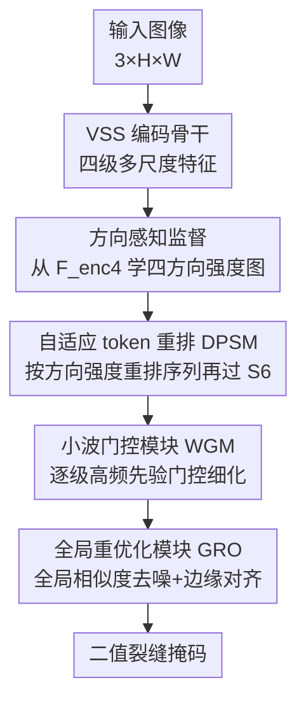

# CrackSSM: Reviving SSMs for Crack Segmentation via Dynamic Scanning

**会议**: CVPR 2026  
**论文**: [CVF Open Access](https://openaccess.thecvf.com/content/CVPR2026/html/Gu_CrackSSM_Reviving_SSMs_for_Crack_Segmentation_via_Dynamic_Scanning_CVPR_2026_paper.html)  
**代码**: https://github.com/hby123123/CrackSSM  
**领域**: 语义分割 / 状态空间模型  
**关键词**: 裂缝分割, 状态空间模型, 动态扫描, 自适应token重排, 小波先验

## 一句话总结
针对裂缝这种细长、断续、不规则的目标，CrackSSM 把 Mamba 视觉模型里"固定路径扫描"换成由裂缝方向强度驱动的**自适应 token 重排（动态扫描）**，让相邻裂缝像素在 1D 序列里也相邻，从而恢复 S6 的因果建模能力；再配合小波高频先验引导的解码，在三个裂缝数据集上以 **2.95M 参数 / 4.69G FLOPs** 取得超过 SCSegamba 等 SOTA 的精度。

## 研究背景与动机
**领域现状**：裂缝分割（crack segmentation, CS）要在结构巡检中同时做到高精度和高效率。CNN 感受野有限、难以建模裂缝的全局连续性；Transformer 靠自注意力补全长程上下文但带来二次复杂度。近期主流转向基于状态空间模型（SSM）的 Mamba 架构——其 S6（Selective State Space）机制能以线性复杂度建模长程依赖，VMamba 通过"多方向扫描"把 2D 特征图按若干固定空间轴展平成 1D 序列，SCSegamba 进一步引入对角蛇形扫描路径并把 SSM 塞进轻量编码器，成为 CS 当前 SOTA。

**现有痛点**：这些方法都依赖**静态、预定义、对所有图片一视同仁的扫描路径**。固定展平顺序会破坏空间连续性——2D 上相邻的像素在 1D 序列里可能被拉得很远，对弯曲、断裂的裂缝尤其严重。

**核心矛盾**：S6 的有效性建立在序列的时序/顺序连贯性上，要靠相邻 token 传播信息。一旦展平顺序把同一条裂缝打散，S6 的因果建模能力就被削弱，模型反而抓不住裂缝这种不规则结构——也就是说，**静态扫描和裂缝的不规则形态本质冲突**。

**本文目标**：在不改动 S6 结构、不牺牲线性效率的前提下，让扫描顺序去适配每张图里裂缝的真实走向；同时在解码阶段补回被上/下采样平滑掉的细边界。

**切入角度**：作者观察到裂缝在局部总有一个主导延伸方向。如果能从高层语义特征里读出"裂缝在水平/垂直/两条对角四个方向上各有多强的响应"，就能用这些方向强度去重排 token，把语义相关、空间连通的裂缝区域在序列里聚到一起。

**核心 idea**：用"方向响应强度驱动的自适应 token 重排"替换固定扫描路径，让 1D 序列顺着裂缝结构走，从而复活（revive）S6 在裂缝上的建模能力。

## 方法详解

### 整体框架
CrackSSM 是一个三阶段串行的编码-增强-解码框架。输入是一张 $3\times H\times W$ 的图，输出是二值裂缝掩码。**编码阶段**用一个原版 VSS（VMamba）骨干抽取四级多尺度特征 $\{F^{enc}_i\}_{i=1}^4$（第 $i$ 级通道 $2^{i-1}C$、分辨率逐级减半）。**特征增强阶段**是本文核心：在最高层特征 $F^{enc}_4$ 上算出四方向裂缝强度图，用它去重排低三级特征 $\{F^{enc}_i\}_{i=1}^3$ 的 token 序列，再过 S6，得到方向对齐的增强特征 $\{\hat F^{enc}_i\}$。**解码阶段**自顶向下融合多尺度特征，每级配一个小波门控模块（WGM）注入高频边界先验，最后一级用全局重优化模块（GRO）做一次全局去噪与边缘对齐，再上采样降通道输出。

### 关键设计

**1. 自适应 token 重排（DPSM/ATR）：让扫描顺序顺着裂缝走**

这是直接对"静态扫描打散裂缝"的回应。作者提出动态路径扫描 Mamba 模块（DPSM），其核心是自适应 token 重排（ATR），**完全不改 S6 结构**。对低三级特征的每一尺度，先沿四个预定义蛇形路径（对应水平、垂直、两条对角）扫出四条初始 1D 序列 $\{P_k\}_{k=1}^4$；再用上采样后的方向强度图 $F_{dir}$ 作为排序键，把每条序列里方向响应强的（即显著裂缝结构上的）token 排到一起：

$$\hat P_k = \mathrm{Sort}(P_k,\ \mathrm{key}=F_{dir}),\quad k=1,2,3,4.$$

每条重排后的序列独立过标准 S6：$\bar P_k = \mathrm{S6}(\hat P_k)$；再映射回 2D 位置重建特征图 $\{F_{p_k}\}$，沿通道拼接后用逐点卷积融合：

$$F^i_{merge} = \mathrm{PointConv}\big(\mathrm{Concat}(F_{p_1},F_{p_2},F_{p_3},F_{p_4})\big).$$

最后接 SE block 做通道自适应加权 + 残差，得到增强特征 $\hat F^{enc}_i$。和 SCSegamba 的固定对角路径相比，这里的顺序是**逐图内容自适应**的——序列连贯性恢复了，S6 才能沿真实裂缝传播信息。

**2. 方向感知辅助监督：逼出"方向"而不是"语义"**

光有重排还不够：用来当排序键的 $F_{dir}$ 必须真的编码方向，而不是泛泛的语义。作者在 $F^{enc}_4$ 上用一个轻量坐标卷积（coord conv）注入位置信息并压到 4 通道，对应四个方向，得到 $F_{dir}\in\mathbb{R}^{4\times \frac{H}{32}\times \frac{W}{32}}$。为了显式监督它，作者用四个类 Sobel 的方向核去卷积 GT 掩码得到方向标签 $G_{dir}$，按通道 softmax 得到目标分布：

$$G'_{dir}(i,j,c)=\frac{\exp(G_{dir}(i,j,c))}{\sum_{k=1}^{4}\exp(G_{dir}(i,j,k))},\quad c\in\{1,2,3,4\}.$$

$F_{dir}$ 同样按通道 softmax 归一化为 $F'_{dir}$，**背景像素的概率向量被强制置零 $[0,0,0,0]$**，使监督只聚焦前景裂缝。两者用交叉熵 $L_{dir}=L_{CE}(G'_{dir},F'_{dir})$ 对齐，逼模型在每个位置预测主导裂缝方向。消融显示（Table 4）这条辅助 loss 在三个数据集上稳定涨点，且四方向标签优于只用水平/垂直或只用两条对角（Table 5）。

**3. 小波门控模块 WGM：用高频先验把细边界门控回来**

解码阶段反复上采样/插值会把细裂缝边界抹平，尤其细、低对比的区域。WGM 不靠额外参数，而是借**原图的高频结构线索**。先对输入图做单级 Haar 小波变换：

$$\{\hat I^w_{LL},\hat I^w_{LH},\hat I^w_{HL},\hat I^w_{HH}\}=\mathrm{HaarTransform}(I_{in}),$$

三个高频子带 $\hat I^w_{LH},\hat I^w_{HL},\hat I^w_{HH}$ 捕捉水平、垂直、对角的边缘细节。每个高频图过两层 $1\times1$ 卷积（带 BN+ReLU）再 sigmoid，得到 $[0,1]$ 的空间门控权重 $W_*=\sigma(\mathrm{Conv}_{1\times1}(\mathrm{ReLU}(\mathrm{BN}(\mathrm{Conv}_{1\times1}(\hat I^w_*)))))$；缩放到当前分辨率后逐元素调制上采样特征 $F^*_G=\mathrm{Resize}(W_*)\odot F^{dec}_i$。这一步**选择性放大对齐强梯度（裂缝边界）的特征、抑制缺高频支撑的区域**，再把三方向调制结果和原始 $F^{dec}_i$ 拼接融合：

$$F_{out}=\mathrm{Conv}_{1\times1}\big(\mathrm{Concat}(F^{dec}_i,F^{LH}_G,F^{HL}_G,F^{HH}_G)\big).$$

**4. 全局重优化模块 GRO：一次全局一致性核对**

WGM 是逐级局部增强，复杂场景里仍残留噪声。GRO 在最后一级做全局校准。先把三个高频子带平均成统一结构图 $I_{hf}=\frac13(\hat I^w_{LH}+\hat I^w_{HL}+\hat I^w_{HH})$；把最终解码特征 $F^3_{out}$ 和 $I_{hf}$ 各自经 Linear+ReLU 投到共享隐空间得到 $X,Y$；逐元素相乘后过可学习投影 + sigmoid 算出逐像素相似度 $S=\sigma(\mathrm{Proj}(X\odot Y))$，它度量解码特征与真实图像边缘的吻合程度。最后用 $S$ 自适应融合：

$$F_{refined}=(1-S)\odot F^3_{out}+S\odot \mathrm{Proj}(I_{hf}).$$

真实裂缝处 $S\to1$，强化边缘细节；不一致区域 $S$ 低，抑制虚假响应——相当于一个全局一致性检查器，提升预测可靠性。

### 损失函数 / 训练策略
多任务学习。主分割任务用 BCE + Dice，方向任务用 CE：

$$L_{total}=L_{main}+\alpha\cdot L_{dir},\quad L_{main}=\beta\cdot L_{BCE}(PM,GT)+L_{Dice}(PM,GT),\quad L_{dir}=L_{CE}(G'_{dir},F'_{dir}).$$

$\alpha=0.5$、$\beta=3$。输入统一 resize 到 $448\times448$，AdamW、batch 16、初始学习率 $8\times10^{-4}$、渐进衰减，最多训 300 epoch 收敛即早停，实验在 NVIDIA 3090 上完成。

## 实验关键数据

### 主实验
三个裂缝数据集（Crack500 / TUT / DeepCrack）上对比近年 SOTA。CrackSSM 在各指标基本全面领先，TUT 上优势最明显。

| 数据集 | 指标 | CrackSSM | SCSegamba'25 | DefMamba'25 |
|--------|------|----------|--------------|-------------|
| Crack500 | F1 / mIoU | **0.764 / 0.780** | 0.746 / 0.771 | 0.752 / 0.772 |
| TUT | F1 / mIoU | **0.845 / 0.851** | 0.824 / 0.838 | 0.823 / 0.836 |
| DeepCrack | F1 / mIoU | **0.918 / 0.909** | 0.903 / 0.896 | 0.907 / 0.900 |

效率上更突出：以最低 FLOPs 和接近最小的参数量拿到最佳精度。

| 方法 | FLOPs↓ | Params↓ | Size↓ |
|------|--------|---------|-------|
| SimCrack'24 | 286.62G | 29.58M | 225MB |
| DefMamba'25 | 50.91G | 177.44M | 201MB |
| SCSegamba'25 | 18.16G | 2.80M | 37MB |
| **CrackSSM** | **4.69G** | 2.95M | **15MB** |

### 消融实验
在 TUT 上逐模块开关（baseline = VSSM 骨干 + 直接上采样融合）：

| 配置 | F1↑ | mIoU↑ | 说明 |
|------|------|-------|------|
| baseline | 0.811 | 0.827 | 三模块全关 |
| + DPSM | 0.824 | 0.836 | 仅动态重排 |
| + WGM | 0.827 | 0.837 | 仅小波门控 |
| + GRO | 0.825 | 0.835 | 仅全局重优化 |
| + DPSM + WGM | 0.830 | 0.839 | 两两组合互补 |
| **Full（三模块）** | **0.845** | **0.851** | 完整模型 |

方向感知 loss 的单独消融（Table 4）：去掉 $L_{dir}$ 后三数据集均掉点，如 DeepCrack 上 ODS 0.902→0.893；方向标签配置上，四方向（0.845 F1）优于只用水平/垂直（0.838）或只用两对角（0.839）。

### 关键发现
- 三个模块各自加到 baseline 上都能单独涨点，说明方向感知、细节增强、全局重优化分别补的是不同短板；三者齐开时协同把所有指标推到最优（F1 0.811→0.845），不是简单叠加。
- 显式方向监督确实有用：让 $F_{dir}$ 学"方向"而非"语义"是重排键有效的前提，去掉这条 loss 排序键质量下降、指标回落。
- 数据越少/场景越复杂越占便宜：Crack500、DeepCrack 训练数据较少时领先明显，更复杂的 TUT 上相对其他 SOTA 的差距更大。

## 亮点与洞察
- **"重排序列而非改 S6"的解耦很巧**：把"裂缝不规则"这个问题转化成"扫描顺序错了"，于是只在 S6 前面动 token 排序，不碰核心算子、不破坏线性复杂度——这让方法可以无痛嫁接到任何 Mamba 视觉骨干。
- **把方向当成可监督的显式信号**：用 Sobel 核滤 GT 造方向标签 + 背景置零，强迫高层特征吐出方向分布，这个"造辅助标签来逼出某种属性"的套路可迁移到任何"目标有主导走向/拓扑"的分割（血管、道路、纤维）。
- **小波高频先验零参注入**：WGM 直接从原图 Haar 子带取边界线索做门控，几乎不加参数就把被采样抹平的细边界找回来，是个性价比很高的解码 trick。
- **效率数字漂亮**：4.69G FLOPs / 15MB，比 SCSegamba 还省一半算力却更准，对真实巡检部署友好。

## 局限与展望
- 重排键 $F_{dir}$ 在最高层 $\frac{H}{32}$ 分辨率上算，再上采样去指导低层重排——⚠️ 极细或极密集的交叉裂缝在如此低分辨率上方向是否可分，论文未直接分析，可能是 TUT 多分叉场景仍有误检的来源。
- 方向被固定建模为四个主方向（水平/垂直/两对角），对介于其间的弯曲走向只能近似；连续角度或更多方向是否更好，作者只比了 2 vs 4 方向，没探更细粒度。
- 方法整体是为"细长结构 + 高频边界"量身定制，作者也把推广到其他结构分析/视觉任务列为未来工作；面向块状、纹理类目标时方向重排和高频门控的收益存疑。
- 排序操作（Sort by key）在序列上引入的实际推理开销、是否影响并行度，论文用 FLOPs 概括，⚠️ 没给重排本身的单独耗时。

## 相关工作与启发
- **vs SCSegamba（CS SOTA）**：两者都把 SSM 用于裂缝，但 SCSegamba 用**固定对角蛇形扫描**对所有图一视同仁；CrackSSM 改成**逐图自适应重排**，序列连贯性更好，精度更高且 FLOPs 更省（4.69G vs 18.16G）。
- **vs VMamba/PlainMamba 等通用视觉 Mamba**：它们的多方向扫描虽比单向好，但仍是静态预定义路径，没有针对目标形态自适应；本文证明在裂缝这类不规则目标上，内容自适应的扫描顺序对 S6 至关重要。
- **vs DefMamba（同为动态扫描）**：DefMamba 参数高达 177M，CrackSSM 只用 2.95M 就在三数据集全面反超，说明针对裂缝先验设计的方向重排 + 高频解码比通用可变形扫描更对症、更轻量。

## 评分
- 新颖性: ⭐⭐⭐⭐ 把静态扫描换成方向强度驱动的自适应 token 重排，且不改 S6，切入点清晰且少见
- 实验充分度: ⭐⭐⭐⭐ 三数据集 + 多 SOTA 对比 + 模块/方向标签双重消融，效率指标完整；缺重排开销与高分辨率方向可分性分析
- 写作质量: ⭐⭐⭐⭐ 动机与机制讲得清楚，公式完整；部分小节命名（如 Static Sequence Reordering）与正文略有出入
- 价值: ⭐⭐⭐⭐ 轻量高效、即插即用于 Mamba 骨干，对工业裂缝巡检和细长结构分割有直接实用价值

<!-- RELATED:START -->

## 相关论文

- [\[CVPR 2026\] MixerCSeg: An Efficient Mixer Architecture for Crack Segmentation via Decoupled Mamba Attention](mixercseg_an_efficient_mixer_architecture_for_crack_segmentation_via_decoupled_m.md)
- [\[CVPR 2026\] Efficient Video Object Segmentation and Tracking with Recurrent Dynamic Submodel](efficient_video_object_segmentation_and_tracking_with_recurrent_dynamic_submodel.md)
- [\[CVPR 2026\] LaDy: Lagrangian-Dynamic Informed Network for Skeleton-based Action Segmentation via Spatial-Temporal Modulation](lady_lagrangian-dynamic_informed_network_for_skeleton-based_action_segmentation_.md)
- [\[CVPR 2026\] SDDF: Specificity-Driven Dynamic Focusing for Open-Vocabulary Camouflaged Object Detection](sddf_specificity-driven_dynamic_focusing_for_open-vocabulary_camouflaged_object.md)
- [\[CVPR 2026\] AFRO: Bootstrap Dynamic-Aware 3D Visual Representation for Scalable Robot Learning](bootstrap_dynamic-aware_3d_visual_representation_for_scalable_robot_learning.md)

<!-- RELATED:END -->
