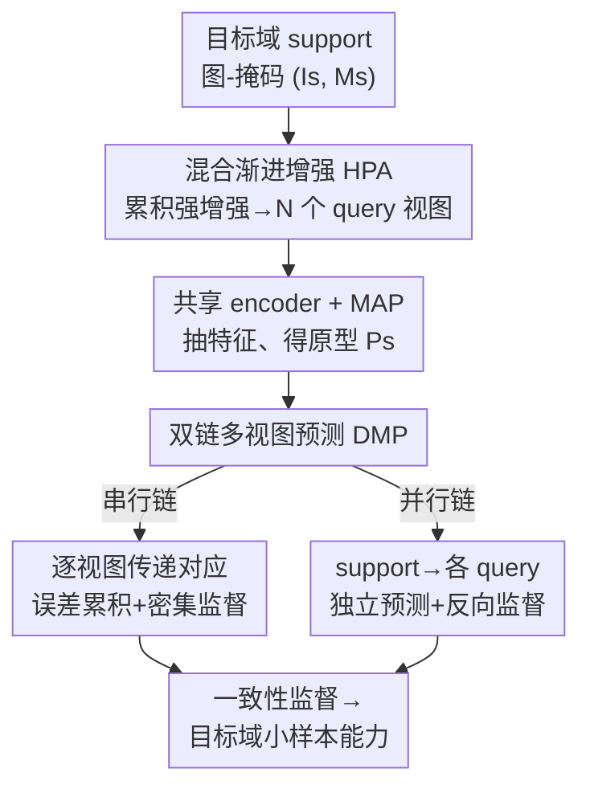

# Cross-Domain Few-Shot Segmentation via Multi-view Progressive Adaptation

**会议**: CVPR 2026  
**arXiv**: [2602.05217](https://arxiv.org/abs/2602.05217)  
**代码**: https://github.com/niejiahao1998/MPA (有)  
**领域**: 语义分割 / 跨域小样本  
**关键词**: 跨域小样本分割、渐进式自适应、多视图、累积数据增强、双链预测

## 一句话总结
针对跨域小样本分割（CD-FSS）中"目标域样本少 + 域差距大导致源模型在目标域的小样本能力弱"两难，本文提出 Multi-view Progressive Adaptation（MPA），从**数据**和**策略**两个视角"由易到难"渐进自适应——用累积式强增强生成越来越复杂的多视图（HPA），再用串行+并行双链预测充分压榨这些视图的监督信号（DMP），在四个数据稀缺域上比 SOTA 平均高 7.0%（1-shot），且去掉源域训练也几乎不掉点、训练时间省 80%。

## 研究背景与动机

**领域现状**：小样本分割（FSS）靠在 base 类别上 meta-learning，学会"用几张 support 图分割 query 图"的能力。但医学、卫星等数据稀缺域拿不到充足的 base 类样本。跨域小样本分割（CD-FSS）的标准做法是两阶段：先在大规模源域（如 Pascal VOC）meta-train 建立小样本能力，再用目标域里极少的几张样本把这份能力"搬"过去。

**现有痛点**：作者观察到一个反直觉现象——CD-FSS 在 multi-shot 下普遍比 1-shot 好，说明"多几张/多几个视图"是有价值的；但**简单地从可见样本做多视图增强，收益却很微弱**（Fig.1 Up）。原因在于：源训练模型刚迁到目标域时小样本能力本来就弱，再叠加大域差距，模型根本"消化不了"被强增强严重扰动的视图，这些视图的监督信号白白浪费。

**核心矛盾**：目标域样本"既少又缺多样性"，而源模型在目标域的初始小样本能力又弱——直接喂复杂增强视图等于让一个还没站稳的模型去做难题，反而学不动。问题不是"要不要多视图"，而是"什么时候、用什么策略喂多视图"。

**本文目标**：拆成两个子问题——(i) 数据侧：如何让增强视图的复杂度与模型当前能力匹配，而不是一上来就最难；(ii) 策略侧：如何把这些渐进变难的视图充分转化为有效监督。

**切入角度**：借鉴域泛化里"渐进式（progressive）"策略的成功——从简单任务开始，随模型变强逐步加难度，让源模型平滑过渡到目标域。

**核心 idea**：用"由易到难的累积增强 + 双链监督"代替"一次性强增强"，从数据和策略两侧渐进式地在目标域重建小样本能力。

## 方法详解

### 整体框架
MPA 是一个**只作用于自适应阶段**的框架：输入是目标域里仅有的 support 图-掩码对 $(I_s, M_s)$，输出是一个在该目标域具备小样本分割能力的适配模型。它把"喂多视图"这件事拆成两个协同模块。先由 **Hybrid Progressive Augmentation（HPA）** 从 support 图派生出 $N$ 个带标签的 query 视图 $\{(I_{q_i}, M_{q_i})\}_{i=1}^N$，且随训练推进让视图**越来越多、越来越复杂**；所有 support/query 图过一个权重共享 encoder 抽特征，support 特征经 masked average pooling 得到原型 $P_s$。然后由 **Dual-chain Multi-view Prediction（DMP）** 用串行链和并行链两条互补路径在这些视图上做"support↔query"预测并施加密集监督，靠跨视图的预测一致性把小样本能力一点点建起来。整套流程从易到难推进，每加一档难度都带来稳定增益。

### 关键设计

**1. 混合渐进增强 HPA：让视图难度跟着模型能力一起涨**

痛点是"一上来就喂最难的强增强视图，弱模型学不动"。HPA 用两条线把难度做成可控的"爬坡"。其一是**累积式增强生成更难视图**：第一个 query $I_{q_1}$ 只做翻转这类简单变换，$I_{q_2}$ 在此基础上叠亮度调整，……一直到 $I_{q_6}$ 把前面所有操作再加 grid shuffle 全叠上——每个新视图都"包含前面所有操作再加一个更复杂的"，作者用 Tab.1 实测验证了增强越复杂、该视图上的 mIoU 越低（即任务越难）。其二是**逐步增加视图数量** $N$：训练初期 $N=1$，只要求模型据 $I_s$ 预测 $I_{q_1}$；随自适应推进自适应地增大 $N$，要求模型在全部 $N$ 个视图上都准。具体触发用**自适应判据**——当性能连续三个 epoch 停滞（视为饱和）就引入一个新的、更复杂的 query 视图。这样"何时加难度"由模型自己的学习曲线决定，而非人工固定课程

**2. 双链多视图预测 DMP：串行制造难度、并行扩充数据，两条链各管一种误差**

光有多视图还不够，得有策略把它们榨干。DMP 同时跑两条互补的链。**串行链**把 $I_s$ 和所有 $\{I_{q_i}\}$ 串成一条预测链，借鉴 SSP 做自支持原型细化：先 $P_s = \mathrm{MAP}(F_s, M_s)$、$P_{q_1}^{seq} = \mathrm{SSP}(F_{q_1}, P_s)$，再用余弦相似度+softmax 出掩码 $\hat{M}_{q_1}^{seq} = \sigma(\cos(F_{q_1}, P_{q_1}^{seq}))$，并加双向预测（用 query 反过来分割 support）做正则。关键在于第 $j$ 个视图的 support 伪原型来自第 $j{-}1$ 个视图的预测结果（$P_s^{seq_0}=P_s$），**误差会沿链累积、传到后面视图**——Tab.2 验证后期视图 mIoU 确实更低。这种"故意制造的难"配合密集监督 $\mathcal{L}^{seq}=\sum_{i=2}^N(\mathcal{L}_{q_i}^{seq}+\mathcal{L}_s^{seq_i})$，逼模型学到对各种扰动鲁棒的表示。**并行链**则直接模仿推理时的"support→query"：用 $P_s$ 同时独立分割每个 $I_{q_i}$（$P_{q_i}^{par}=\mathrm{SSP}(F_{q_i}, P_s)$），并各自做反向预测，监督 $\mathcal{L}_s^{par}$、$\mathcal{L}_q^{par}$。并行链不传播误差、把每个视图当成独立学习路径，相当于**扩充了自适应数据量**；串行链负责制造梯度难度、并行链负责保证基础对齐——两者一个管"误差累积"、一个管"误差多样性"，互补地把小样本能力建起来

### 损失函数 / 训练策略
总损失把四项加权组合：support 基础损失、串行损失、并行 support 损失、并行 query 损失：

$$\mathcal{L} = \lambda_{bs}\mathcal{L}_{bs} + \lambda^{seq}\mathcal{L}^{seq} + \lambda_s^{par}\mathcal{L}_s^{par} + \lambda_q^{par}\mathcal{L}_q^{par}$$

权重 $\lambda_{bs}=0.2$、$\lambda^{seq}=0.1$、$\lambda_s^{par}=0.4$、$\lambda_q^{par}=1$（并行 query 损失权重最大，是主监督；串行损失权重最小，主要作正则）。注意串行链第 1 个视图的损失与并行链第 1 个等价，故串行损失从 $i=2$ 起算。Backbone 用 ImageNet 预训练 ResNet-50（弃掉最后 stage 和最后 ReLU 以增强泛化），图像 resize 到 $400\times400$，学习率 5e-4；$K$-shot 时用平均原型 $\bar{P}_s=\frac{1}{K}\sum_i P_s^i$ 做初始预测。

## 实验关键数据

### 主实验
四个常用数据稀缺域 mIoU(%)，1-shot/5-shot，ResNet-50 backbone：

| 方法 | Deepglobe (1s) | ISIC (1s) | Chest X-Ray (1s) | FSS-1000 (1s) | 平均 (1s) | 平均 (5s) |
|------|------|------|------|------|------|------|
| PATNet | 37.9 | 41.2 | 66.6 | 78.6 | 56.1 | 62.0 |
| SSP（baseline） | 41.3 | 48.6 | 72.6 | 77.0 | 60.0 | 68.0 |
| IFA（之前SOTA） | 50.6 | 66.3 | 74.0 | 80.1 | 67.8 | 71.4 |
| ABCDFSS | 42.6 | 45.7 | 79.8 | 74.6 | 60.7 | 65.0 |
| **MPA（w/ 源训练）** | **54.2** | **74.3** | **89.1** | **81.4** | **74.8** | **76.9** |
| **MPA（w/o 源训练）** | 53.1 | 71.1 | 89.0 | 80.2 | 73.4 | 75.5 |

MPA 比 IFA 平均高 **+7.0%（1-shot）/ +5.5%（5-shot）**。在水下场景 SUIM 上 1-shot 达 55.5（w/ 源训练）vs ABCDFSS 35.1。与 SAM-based 方法比（Deepglobe/ISIC/FSS-1000 平均），MPA(w/o 源) 68.1 vs TAVP 60.0、APSeg 53.7，且模型更小。

### 消融实验
技术设计消融（Tab.6，单位 mIoU%）：

| 配置 | Deepglobe | ISIC | 说明 |
|------|------|------|------|
| Baseline (SSP) | 42.1 | 42.2 | 起点 |
| + HPA | 47.8 | 61.2 | +5.7 / +19.0 |
| + HPA + DMP | 53.1 | 71.1 | 再 +5.3 / +9.9（完整模型） |

渐进策略消融（Tab.7，ISIC 上）：

| 配置 | mIoU | 说明 |
|------|------|------|
| always 1 视图 | 50.5 | 不增视图 |
| 隐式渐进（增视图数） | 52.0 | +1.4 |
| always 简单增强 | 51.3 | 不增难度 |
| 显式渐进（增增强难度） | 52.4 | +1.1 |
| 两者结合 | **53.1** | 完整 HPA |

增强方式消融（Tab.8）：简单增强 51.3/67.9 → 单次复杂替换 51.9/68.5 → **累积式 53.1/71.1**，验证"累积"优于"替换"。

### 关键发现
- **DMP 是框架基石**：HPA 单独已带来大幅提升（ISIC +19.0），但 DMP 才是把多视图"榨干"的关键，叠加后再 +9.9；两者互补——HPA 造数据、DMP 造监督。
- **大部分增益来自自适应阶段而非源训练**：去掉源域训练，MPA 1-shot 仅从 74.8 掉到 73.4，仍比 IFA(67.8) 高 5.6，比 source-free 的 ABCDFSS 高 12.7，**而训练时间省约 80%**（IFA 555min → MPA 98min on Deepglobe）。这直接挑战了 CD-FSS"必须先源域 meta-train"的传统假设。
- **累积 > 替换**：增强操作叠加（保留历史操作再加新操作）比每视图换单一复杂操作更好，说明"难度爬坡"的连续性重要。

## 亮点与洞察
- **把"课程学习"落到 CD-FSS 的两个正交轴上**：数据轴（增强难度/视图数）+ 策略轴（串/并双链），且难度由模型学习曲线自适应触发（连续 3 epoch 停滞才加难度），比固定课程更稳——这个"自适应加难度"思路可迁移到任何小样本/弱监督自适应。
- **故意制造误差当正则**：串行链明知误差会沿链累积，却用密集监督把它转成"对扰动鲁棒"的训练信号，是反直觉但有效的设计——把通常被视为缺陷的误差传播变成数据增强的隐式来源。
- **挑战源域训练必要性**：用一张 support 图直接在目标域单阶段自适应就逼近两阶段效果、还省 80% 时间，给"source-free CD-FSS"提供了强证据，对算力受限场景实用价值高。

## 局限与展望
- 论文主体实验在 source-free 默认设置下报告，但 HPA 的视图复杂度上限（如最多到 grid shuffle 第 6 视图）、增强操作集合是手工设计的，对不同目标域是否需要重调没有充分讨论。
- 自适应判据"连续 3 epoch 停滞加难度"是经验阈值，超参（$N$ 增长上限、各 $\lambda$）的敏感性主要放在补充材料，正文给的多为单/双数据集数字，跨域普适性需打折看。
- 串行链误差累积的"度"难把控——理论上累积过头会污染监督，论文靠密集监督缓解，但没给出误差累积失控的边界分析。
- 作者展望把渐进自适应扩展到更广的跨域任务和更复杂的真实域漂移。

## 相关工作与启发
- **vs IFA**：IFA 在 fine-tune 阶段建立 support-query 对应，但**只增强单一视图**、易过拟合；MPA 用渐进多视图 + 双链充分扩充并榨干监督，1-shot 平均高 7.0%。
- **vs ABCDFSS**：ABCDFSS 主张源域训练反而引入额外域差距、强调自适应阶段；MPA 认同这一观点并更进一步——给出"如何用极少样本有效自适应"的具体方案，source-free 设置下平均高 12.7%（1-shot）。
- **vs SAM-based（APSeg / TAVP / PerSAM）**：它们靠 SAM 的强泛化能力，但模型大、依赖大模型先验；MPA 用轻量 ResNet-50 + 渐进策略，效果和模型尺寸双赢（68.1 vs 60.0）。
- **vs DR-Adapter / 频率解耦类**：那些方法靠微调特定结构/解耦特征频率抗过拟合；MPA 从"数据多样性 + 监督密度"侧切入，思路正交、可结合。

## 评分
- 新颖性: ⭐⭐⭐⭐ "数据+策略双轴渐进 + 双链监督"组合新颖，且对源训练必要性提出有力反例
- 实验充分度: ⭐⭐⭐⭐⭐ 五个数据稀缺域 + SAM-based 对比 + 三组消融 + 效率分析，覆盖全面
- 写作质量: ⭐⭐⭐⭐ 动机由 preliminary study 实测驱动（Tab.1/2），逻辑清晰；公式较密
- 价值: ⭐⭐⭐⭐ source-free 单阶段省 80% 时间且不掉点，对数据/算力受限的真实场景实用

<!-- RELATED:START -->

## 相关论文

- [\[CVPR 2026\] Selective, Regularized, and Calibrated: Harnessing Vision Foundation Models for Cross-Domain Few-Shot Semantic Segmentation](selective_regularized_and_calibrated_harnessing_vision_foundation_models_for_cro.md)
- [\[CVPR 2026\] PrAda: Few-Shot Visual Adaptation for Text-Prompted Segmentation](prada_few-shot_visual_adaptation_for_text-prompted_segmentation.md)
- [\[CVPR 2026\] V²-SAM: Marrying SAM2 with Multi-Prompt Experts for Cross-View Object Correspondence](v2-sam_marrying_sam2_with_multi-prompt_experts_for_cross-view_object_corresponde.md)
- [\[CVPR 2025\] The Devil is in Low-Level Features for Cross-Domain Few-Shot Segmentation](../../CVPR2025/segmentation/the_devil_is_in_low-level_features_for_cross-domain_few-shot_segmentation.md)
- [\[CVPR 2025\] Dual-Agent Optimization framework for Cross-Domain Few-Shot Segmentation](../../CVPR2025/segmentation/dual-agent_optimization_framework_for_cross-domain_few-shot_segmentation.md)

<!-- RELATED:END -->
