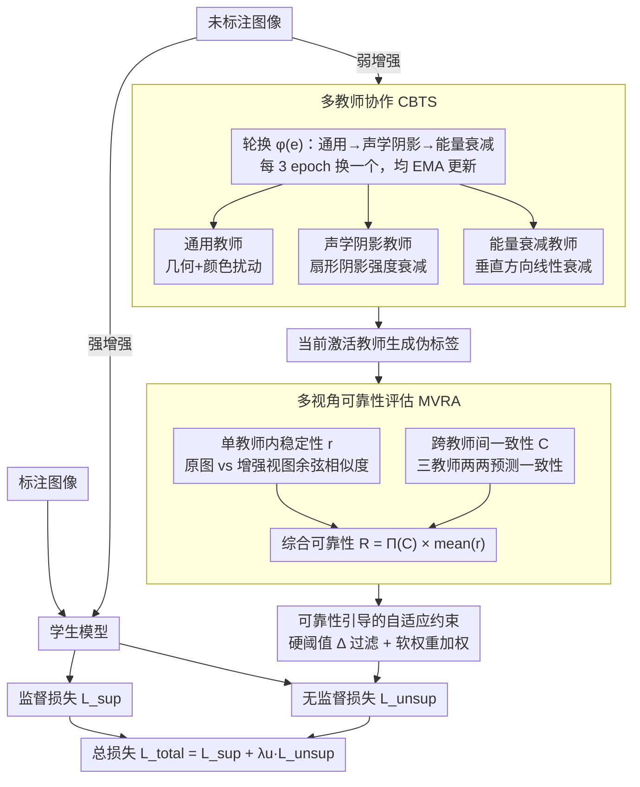

# CTFS: Collaborative Teacher Framework for Forward-Looking Sonar Image Semantic Segmentation with Extremely Limited Labels

**会议**: CVPR 2026  
**arXiv**: [2603.21071](https://arxiv.org/abs/2603.21071)  
**代码**: 有  
**领域**: 分割 / 水下成像  
**关键词**: 声呐图像分割, 半监督学习, 多教师协作, 伪标签可靠性, 极少标注

## 一句话总结
提出CTFS，首个专为前视声呐图像设计的半监督语义分割框架，引入多教师协作机制（1个通用教师+2个声呐特异教师，分别模拟声学阴影和能量衰减物理特性），配合多视角伪标签可靠性评估（单教师内稳定性+跨教师间一致性），在仅2%标注下达62.32% mIoU，超越SOTA 5.08个百分点。

## 研究背景与动机

**领域现状**：前视声呐是水下感知的关键技术（救援、检测、生物调查），声呐图像面临独特挑战——严重斑点噪声、低纹理对比度、声学阴影、几何畸变。声呐数据高度专业化且标注昂贵。

**现有痛点**：(1) 传统教师-学生半监督方法(Mean Teacher/FixMatch)不考虑声呐特性→教师在噪声声呐图像上生成大量低质伪标签；(2) 某些方法使用10%标注时甚至低于监督基线——半监督框架在声呐域适得其反；(3) 缺乏针对声呐成像特性的教师模型设计。

**核心矛盾**：标准半监督方法的弱/强增强策略是为自然图像设计的（颜色抖动等），对声呐图像无效甚至有害——声呐的"噪声"来自物理成像过程而非图像处理。

**切入角度**：需要从声呐成像物理出发设计教师的增强策略——声学阴影和能量衰减是声呐图像两大物理特性。

**核心idea**：(1) 三教师协作——通用教师+声学阴影教师+能量衰减教师，按固定顺序轮流指导学生；(2) 多视角伪标签可靠性评估——单教师稳定性×跨教师一致性→可靠伪标签。

## 方法详解

### 整体框架

CTFS 想解决的是一个很具体的困境：声呐图像标注极贵，半监督本该救场，但标准的师生半监督（Mean Teacher、FixMatch 那一套）在声呐上反而经常比纯监督还差——因为它们的弱/强增强是为自然图像设计的，对斑点噪声、声学阴影这种物理成因的"噪声"完全不对症，教师只会生成大量低质伪标签喂坏学生。

整篇 pipeline 因此分两条线走。标注数据走常规监督训练，给学生一个 $\mathcal{L}_{sup}$。未标注数据是重点：经过前 $E$ 个 epoch 的预热后，三个教师按"通用→声学阴影→能量衰减"的固定顺序每 3 个 epoch 轮流上岗（轮换函数 $\phi(e)$）。当前激活的教师对弱增强输入生成伪标签，学生则在强增强输入上学习；伪标签不是照单全收，而是先经过多视角可靠性评估打分，再以这个分数同时做硬过滤和软加权，得到无监督损失 $\mathcal{L}_{unsup}$。最终 $\mathcal{L}_{total} = \mathcal{L}_{sup} + \lambda_u \cdot \mathcal{L}_{unsup}$。

### 关键设计

**1. 多教师协作（CBTS）：把声呐成像物理写进教师的增强里**

前面说过，自然图像那套增强（颜色抖动等）在声呐上无效甚至有害。CTFS 的对策是让三个教师各管一种"扰动语义"，而不是共用一套通用增强。通用教师 $T_{general}$ 仍做标准几何变换加颜色扰动，负责把通用语义学到手；真正的关键是另外两个声呐特异教师，它们的增强直接来自声呐成像的两个物理过程。声学阴影教师 $T_{sonar\_a}$ 模拟声波被障碍物遮挡后扇形区域内的强度跌落，按到阴影起点的距离 $d$ 衰减：

$$I_o(x,y) = I_i(x,y) \times [1-\alpha(1-d/R)], \quad R = 0.2 \times \min(H,W)$$

能量衰减教师 $T_{sonar\_b}$ 则模拟声波在海水中传播时沿距离方向的能量损失，做垂直方向的线性衰减 $I_o(x,y) = I_i(x,y) \times (1-\gamma \cdot y/H)$。三个教师都用 EMA 更新，按固定顺序循环激活。这样设计之所以有效，是因为每个教师对应一种真实存在的物理扰动，逼学生学到声呐特有的不变性——哪怕目标落在声学阴影里、或处在远端能量衰减区，分割也要稳——而把扰动绑死到物理过程上，又保证了特征级语义不会被增强带偏。

**2. 多视角可靠性评估（MVRA）：用多维共识替代单一置信度阈值**

声呐的物理噪声会让教师对一片虚假区域也给出很高的置信度，所以传统那种"置信度大于阈值就采纳"的伪标签筛选在这里并不可靠。MVRA 改从两个互补的视角给每块区域的伪标签打分。为了省算力，先把图像切成 $m \times m$ 的网格块，块内像素的预测概率取平均，后续都在网格级算、最后复制回像素级。

第一个视角是单教师内稳定性：同一个教师对原图和它的多个增强视图给出的预测，特征上应当彼此接近，用余弦相似度衡量

$$r_{ij}^t = \frac{1}{N_{A_w^t}} \sum_k \cos(f_{ij}^{ot}, f_{ij}^{kt})$$

第二个视角是跨教师间一致性：三个教师对同一图像的预测两两相比，越一致说明这块越可信

$$C_{ij} = \frac{1}{N_\mathcal{D}} \sum_{(p,q)} \cos(f_{ij}^{op}, f_{ij}^{oq})$$

两者相乘得到综合可靠性 $R_{ij} = \Pi(C_{ij}) \times \frac{1}{N_T}\sum_t r_{ij}^t$，其中惩罚项 $\Pi(C_{ij}) = \delta + (1-\delta)C_{ij}$ 专门压低那些教师之间分歧大的区域。一块区域只有同时满足"单个教师自己看着稳"和"几个教师彼此还能对上"，才会拿到高分——这正好卡住了声呐噪声制造的那种"单教师高置信但其实站不住"的虚假伪标签。

**3. 可靠性引导的自适应约束：把可靠性分数同时当闸门和权重用**

有了 $R$ 之后，怎么把它用进无监督损失也有讲究。CTFS 让它身兼两职：一是硬阈值过滤，低于阈值的区域直接屏蔽 $\Delta = \mathbb{1}[R_b^n > \psi]$；二是软权重加权，留下来的区域再按 $R_b^n$ 的大小决定监督强度。这样既能把明显不可信的伪标签彻底丢掉，又能在可信区域内做细粒度区分——很可靠的地方强监督，将信将疑的地方弱监督——而不是过滤后对所有保留区域一视同仁。

**4. FSSG 新数据集：补上声呐语义分割的数据缺口**

声呐半监督做不起来，一部分原因是公开数据本就稀缺。作者用渤海湾 ROV 搭载的多波束前视声呐（Oculus M750d，750kHz/1.2MHz）采集了 FSSG：3761 张图像、11 类目标（含潜水员类）、长尾分布，并在 2–15 米的不同距离和角度下采集以增加多样性。它和已有的 FLSMD 一起，构成了文中半监督评测的两个基准。

### 一个完整示例：一块未标注区域怎么走完一轮

设当前是第 7 个 epoch、轮到声学阴影教师 $T_{sonar\_a}$ 激活。取一张未标注声呐图，先做弱增强喂给 $T_{sonar\_a}$ 生成伪标签，同一张图做强增强喂给学生。评估某个网格块时：$T_{sonar\_a}$ 对该块的原图与几个增强视图给出的预测彼此很接近，单教师稳定性 $r$ 偏高；但拿三个教师互相一比，通用教师把这块判成"目标"、两个声呐教师却判成"阴影背景"，跨教师一致性 $C$ 偏低，惩罚项 $\Pi(C)$ 随之把综合 $R$ 压下来。最终这块的 $R$ 没过硬阈值 $\psi$，$\Delta=0$，它就被排除出本轮无监督损失——避免了一处"单教师看着挺稳、实则是噪声"的伪标签污染学生。换到目标确实清晰的区域，三个教师一致、$R$ 高，则以接近满权的强度参与监督。

### 损失函数

总损失 $\mathcal{L}_{total} = \mathcal{L}_{sup} + \lambda_u \cdot \mathcal{L}_{unsup}$。无监督项把可靠性 $R$ 和硬过滤 $\Delta$ 都乘进逐块的交叉熵里：

$$\mathcal{L}_{unsup} = \frac{1}{N_u}\sum_n \frac{\sum_b \text{CE}(p_n^s[b], p_n^t[b]) \times R_b^n \times \Delta}{N_p}$$

## 实验关键数据

### 主实验（mIoU%）

| 方法 | 编码器 | FLSMD 2% | FLSMD 5% | FLSMD 10% | FSSG 2% | FSSG 5% |
|------|--------|:---:|:---:|:---:|:---:|:---:|
| Labeled Only | DINOv2-S | 51.08 | 61.02 | 68.48 | 35.61 | 41.67 |
| AEL | RN-101 | 52.70 | 64.89 | 70.73 | 53.51 | 57.84 |
| UniMatch V2 | DINOv2-S | 57.24 | 66.49 | 69.81 | 58.78 | 61.21 |
| SemiVL | RN-101 | 53.38 | 65.16 | 70.02 | 58.85 | 62.19 |
| **CTFS (Ours)** | DINOv2-S | **62.32** | **68.08** | **72.27** | **59.53** | **65.12** |

2%标注下比UniMatch V2高**5.08%** mIoU。

### 消融实验

| 配置 | FLSMD 2% mIoU |
|------|:---:|
| 仅通用教师 (baseline) | ~57 |
| +声学阴影教师 | ~59 |
| +能量衰减教师 | ~60 |
| +MVRA可靠性评估 | ~62 |
| **完整CTFS** | **62.32** |

### 尾类性能
在钩子(hook)、洗发水瓶(shampoo-bottle)、轮胎(tire)、水下机器人(ROV)等少样本类别上改进最显著→多教师协作增强了少见类别的表示学习。

### 关键发现
- **声呐特异教师每个都独立贡献**：声学阴影教师+~2%，能量衰减教师+~1%——物理增强确实帮助学生理解声呐成像
- **MVRA比单一置信度阈值更可靠**——多视角评估有效过滤了声呐噪声导致的虚假高置信伪标签
- **尾类改进最显著**——多教师提供的多角度监督信号对少样本类别尤为重要
- **CTFS在所有标注比例下一致SOTA**——2%/5%/10%都领先，证明框架的鲁棒性

## 亮点与洞察
- **声学物理模拟作为数据增强的范例**：将声学阴影和能量衰减这两个声呐成像的核心物理过程显式建模为教师的弱增强→这是将领域物理知识注入半监督学习的优秀范例。类似思路可迁移到SAR(散射)、红外(热传导)、超声(声阻抗)等成像模态
- **首个声呐半监督分割框架**：填补了水下声呐感知领域的半监督学习空白。声呐数据标注极其昂贵(需专业知识)，半监督方法对该领域有巨大实用价值
- **多教师轮换的"从通用到特异"课程**：general→sonar_a→sonar_b的循环让学生从通用能力逐步发展到域特异化理解——类似于从粗到精的学习过程
- **FSSG新数据集贡献**：3761图+11类+语义分割标注，缓解了声呐数据集的稀缺问题

## 局限与展望
- 三教师轮换的固定周期(每3 epoch)和固定顺序可能非最优——自适应调度(基于学生性能)或并行多教师可能更好
- 声学物理模拟是简化近似（扇形阴影、线性衰减）——更精确的声学仿真(考虑频率/反射面材质等)可进一步提升
- 仅室内水池/浅海场景验证——深海复杂环境(水流干扰/多路径反射/生物附着)的泛化有待评估
- FSSG数据集虽有价值但规模仍有限(3761图)——可通过声学仿真生成更多合成数据
- 可探索将多教师协作与Fundation Model(如DINOv2)的特性更深度结合

## 相关工作与启发
- **vs Mean Teacher/UniMatch V2**: 通用半监督方法不考虑声呐特殊性→在声呐域效果有限。CTFS的声呐特异教师直接提升了在声呐域的适应性
- **vs Dual Teacher**: 使用两个结构不同的教师但不针对声呐物理特性设计增强
- **vs FLSMD数据集**: CTFS在此基准上大幅超越所有现有方法
- **vs Beyond-Pixels/SemiVL**: 这些方法在声呐上性能甚至低于监督基线——验证了声呐域半监督的特殊困难
- **启发**：任何具有独特成像物理的领域(SAR/红外/超声)都可借鉴"物理增强教师"的思路设计域特异的半监督框架

## 评分
- 新颖性: ⭐⭐⭐⭐ 声呐物理教师+多视角可靠性评估有创新，首个声呐半监督分割框架
- 实验充分度: ⭐⭐⭐⭐ 两个数据集、多标注比例、尾类分析、充分消融
- 写作质量: ⭐⭐⭐⭐ 声呐物理背景和增强设计描述清晰
- 价值: ⭐⭐⭐⭐ 对水下感知领域有实际应用价值，物理增强教师思路有通用性

<!-- RELATED:START -->

## 相关论文

- [\[CVPR 2026\] Looking Beyond the Window: Global-Local Aligned CLIP for Training-free Open-Vocabulary Semantic Segmentation](looking_beyond_the_window_global-local_aligned_clip_for_training-free_open-vocab.md)
- [\[CVPR 2026\] Brewing Stronger Features: Dual-Teacher Distillation for Multispectral Earth Observation](brewing_stronger_features_dual-teacher_distillation_for_multispectral_earth_obse.md)
- [\[CVPR 2026\] Spatio-Semantic Expert Routing Architecture with Mixture-of-Experts for Referring Image Segmentation](spatio-semantic_expert_routing_architecture_with_mixture-of-experts_for_referrin.md)
- [\[NeurIPS 2025\] COS3D: Collaborative Open-Vocabulary 3D Segmentation](../../NeurIPS2025/segmentation/cos3d_collaborative_open-vocabulary_3d_segmentation.md)
- [\[CVPR 2026\] Love Me, Love My Label: Rethinking the Role of Labels in Prompt Retrieval for Visual In-Context Learning](love_me_love_my_label_rethinking_the_role_of_labels_in_prompt_retrieval_for_visu.md)

<!-- RELATED:END -->
