# DeDelayed: Deleting Remote Inference Delay via On-Device Correction

**会议**: CVPR 2026  
**arXiv**: [2510.13714](https://arxiv.org/abs/2510.13714)  
**代码**: [github.com/InterDigitalInc/dedelayed](https://github.com/InterDigitalInc/dedelayed)  
**领域**: 图像分割  
**关键词**: 协同推理, 实时视频分割, 延迟补偿, 时序预测, 端云协作

## 一句话总结
提出 DeDelayed 端云协同推理框架，将轻量本地图像模型与延迟感知的云端时序预测视频模型结合，通过时序预测训练补偿网络延迟，在 100ms 延迟下比纯本地推理提升 6.4 mIoU、比纯远程推理提升 9.8 mIoU。

## 研究背景与动机
**领域现状**: 最强大的视频理解模型计算量太大无法在资源受限的终端设备上运行；而将推理卸载到云端会引入通信延迟，导致预测过时。

**现有痛点**: (1) 现有分割计算方法将所有本地计算资源用于单一推理管线，一旦云端不可用则无法 fallback；(2) 未考虑延迟对预测准确性的影响；(3) 使用降低时空分辨率的方式控制计算成本。

**核心矛盾**: 云端模型精度高但有延迟，本地模型实时但精度低——如何取两者之长？

**本文目标**: 设计一个实时推理系统，结合延迟的高质量远程特征和实时的本地低分辨率特征。

**切入角度**: 训练远程模型预测**未来帧**的特征，让延迟的远程输出在到达时仍然有用。

**核心 idea**: $\hat{y}_t = f_{\text{local}}(x_t, z_{t-\tau})$，本地模型处理当前帧，远程模型预测未来帧特征，两者通过逐元素加法融合。

## 方法详解

### 整体框架
DeDelayed 要解决的是一个很现实的工程矛盾：云端大模型语义精度高但回传有网络延迟，等结果到达时画面已经变了；本地小模型实时但看不懂复杂场景。它的思路是让两条管线同时跑、最后融合——本地模型实时处理**当前帧**的低分辨率画面，云端模型则在高分辨率上提特征、并且被训练成去**预测未来帧**，这样它那份延迟了 $\tau$ 的输出在真正到达本地时刚好对得上当下的画面。

具体地，云端用一个 2D ViT（EfficientViT-L1）逐帧提特征，把最近 $K{=}4$ 帧时序拼接后加上一个"延迟嵌入"，送进 3D ViT 编码器，再经自适应空间池化 + 通道瓶颈（DR-AE）压缩后下行传输；本地端用 CNN2D + CoAt2D 处理 704×480 的当前帧，把对齐后的云端特征**逐元素加到** CNN2D 与 CoAt2D 之间的激活图上，再解码出分割。核心关系可以写成 $\hat{y}_t = f_{\text{local}}(x_t,\, z_{t-\tau})$：本地吃当前帧 $x_t$，融合的是 $\tau$ 帧之前发出、为预测当下而生的云端特征 $z_{t-\tau}$。

```mermaid
%%{init: {'flowchart': {'rankSpacing': 24, 'nodeSpacing': 28, 'padding': 6, 'wrappingWidth': 400, 'subGraphTitleMargin': {'top': 8, 'bottom': 16}}}}%%
flowchart TD
    V["输入视频流 720p 30fps"]
    V --> RH["高分辨率帧 + 最近 K=4 帧"]
    V --> LL["当前帧 x_t<br/>低分辨率 704×480"]

    subgraph REMOTE["云端高分辨率流（时序预测训练）"]
        direction TB
        RH --> R1["ViT2D 逐帧提特征<br/>EfficientViT-L1"]
        R1 --> R2["时序拼接 K 帧 + 延迟嵌入<br/>条件化于实际延迟 τ"]
        R2 --> R3["3D ViT 编码器<br/>监督取未来帧标签"]
        R3 --> R4["DR-AE 降维<br/>空间池化匹配本地分辨率 → 下行"]
    end

    subgraph LOCAL["本地低分辨率实时流"]
        direction TB
        LL --> L1["CNN2D 像素层"]
        L1 --> ADD["加法融合 + 本地 fallback<br/>远程特征逐元素加到激活图"]
        ADD --> L2["CoAt2D + L-MLP 解码"]
    end

    R4 -->|"延迟 τ 帧的特征 z_t−τ<br/>缺失时归零 → 纯本地推理"| ADD
    L2 --> OUT["分割输出 ŷ_t"]
```

### 关键设计

**1. 时序预测训练：让延迟的远程特征"提前量"刚好抵消网络延迟**

延迟是端云协同绕不开的痛点——常规远程推理在超过 67ms 后精度就掉到比纯本地还低，因为返回的特征描述的是过去的画面。DeDelayed 的做法是在训练时主动给云端模型的输入注入人工延迟 $D$ 帧（从 0–5 帧均匀采样），但监督信号取自**未来帧**的标签，逼模型学会"根据手上这几帧去预测 $D$ 帧之后的语义"。关键是再喂进一个可学习的**延迟嵌入**（作用类似位置编码，条件化于实际延迟量），让同一个模型能按当前真实延迟自适应调整预测的提前量。这样推理时无论网络抖到 33ms 还是 167ms，模型都能输出"对准当下"的特征，相当于把运动补偿内化进了网络，而不是事后去做帧对齐。

**2. 加法融合 + 本地 fallback：远程信号缺席时优雅退化为纯本地推理**

硬实时应用（如自动驾驶）不能假设云端永远在线，一旦丢包或断连就必须有完整的本地兜底。DeDelayed 把远程特征经空间池化对齐后**逐元素加**到本地中间层，而不是拼接或门控融合。这个看似简单的选择有个定义良好的性质：当远程信号为零（缺失）时，$f_{\text{local}}(x_t, \mathbf{0})$ 在数值上完全等价于纯本地推理，模型行为不会崩，只是退回到本地精度。于是远程被定位成"锦上添花的辅助信号"而非必需依赖，整个系统天然具备 fallback，而很多 split computing 方法把本地算力全押在上行管线上、一旦云端不可用就无路可退。

**3. 混合分辨率推理：用云端的高分辨率认物、本地的低分辨率定位**

在终端设备上以原始捕获分辨率跑任何模型都不现实，但云端 GPU 可以。DeDelayed 让本地只处理 704×480 的低分辨率帧负责精确的空间定位，云端则在 720p 高分辨率上提特征负责语义理解——可视化显示远程激活图能准确区分并分类远处的小目标（如远处行人），本地则提供精确的位置校准。两者分辨率不同、职责互补：远程那份高分辨率语义经 DR-AE 池化压到与本地匹配的尺寸后再相加，既省了下行带宽（匹配 5G 上行 1–10 Mbps），又把"看得清"和"实时"各自交给最合适的一端。

### 一个完整示例
设当前是第 $t$ 帧，网络往返导致延迟 $\tau{=}3$ 帧（≈100ms @30fps）。本地端在 $t$ 时刻拿到第 $t$ 帧的低分辨率画面，CNN2D + CoAt2D 立刻算出一份实时但偏粗的特征；与此同时到达本地的云端特征 $z_{t-3}$，其实是云端在第 $t{-}3$ 帧就发出、但被"时序预测训练 + 延迟嵌入（条件化于 $D{=}3$）"训练成**预测第 $t$ 帧语义**的那份高分辨率特征。两份特征经 DR-AE 对齐分辨率后逐元素相加，输出第 $t$ 帧的分割 $\hat{y}_t$——既有本地的精确空间边界，又有云端补上的远处小目标分类。若这一帧的 $z_{t-3}$ 因丢包没到，相加项变为零，本地照常输出粗一点的结果，不会卡死。对应到表格，这正是 DeDelayed 在 100ms 延迟下仍拿到 0.665 mIoU、几乎不随延迟掉点的来源。

### 损失函数 / 训练策略
- 多阶段训练：远程和本地模型先分别在 ImageNet→Cityscapes→BDD100K 上预训练，最后联合微调
- 联合训练时使用 per-pixel 交叉熵损失，Adan 优化器 + warmup-stable-decay 学习率调度
- 训练延迟 $\tau$ 从 0–5 帧均匀采样（0–167ms @30fps），配合延迟嵌入让单模型覆盖动态延迟范围

## 实验关键数据

### 主实验（BDD100K 语义分割 mIoU）

| 推理配置 | 0ms | 33ms | 67ms | 100ms | 167ms |
|---------|------|------|------|-------|-------|
| Local only | 0.601 | 0.601 | 0.601 | 0.601 | 0.601 |
| Remote image | 0.655 | 0.616 | 0.567 | 0.530 | 0.525 |
| Remote predictive | 0.655 | 0.649 | 0.644 | 0.637 | 0.624 |
| **DeDelayed** | **0.670** | **0.668** | **0.666** | **0.665** | **0.668** |

### 消融实验

| 配置 | mIoU @167ms | 说明 |
|------|------------|------|
| Local only | 0.601 | 不受延迟影响但精度低 |
| Remote image | 0.525 | 延迟严重损害精度 |
| Remote predictive | 0.624 | 时序预测大幅缓解 |
| **DeDelayed (full)** | **0.668** | 几乎消除延迟影响 |

### 关键发现
- 常规远程推理在延迟超过 67ms 后性能低于本地推理
- DeDelayed 在 167ms 延迟下比本地推理高 6.7 mIoU，相当于使用 10 倍大模型
- 远程模型的激活图可视化显示：远程提供准确的对象分类，本地提供精确的空间定位
- 延迟嵌入使单个模型适应 0-167ms 的动态延迟范围

## 亮点与洞察
- **Fallback-first 设计**: 远程信息作为"辅助信号"而非必需依赖，确保硬实时安全性
- **延迟嵌入 ≈ 可学习的运动补偿**: 通过条件化于延迟量，模型学习不同程度的运动预测
- **混合分辨率的互补性**: 远程高分辨率识别远处小目标（如远处行人），本地低分辨率提供精确空间校准
- 逐元素加法虽然简单，但行为定义良好，远程缺失时优雅退化

## 局限与展望
- 仅在分割任务上验证，未测试检测或其他密集预测任务
- 使用伪标签训练（因 BDD100K 缺少逐帧标注），真实标签下效果可能更好
- 上行视频压缩引入的失真未被显式建模
- 超过 167ms 的高延迟场景未测试
- 未探索多个远程模型或分层级融合
- 本地模型在极低功耗设备（<5W）上的可行性有待验证
- 下行带宽受限时 DR-AE 的压缩效率有待优化
- 异构传感器（如 LiDAR + 相机）的融合场景未覆盖

## 相关工作与启发
- 与 split computing 的区别: FCM 将本地计算全部用于上行管线，无 fallback
- 与 Knowledge Boosting 相比: 后者需要为每个固定延迟训练单独模型
- 延迟嵌入设计可推广到其他异步信息融合场景
- 自适应模型流 (Adaptive Model Streaming) 流式更新权重，与 DeDelayed 的特征融合正交

## 技术细节补充
- **远程模型**: EfficientViT-L1 (2D ViT, patch 8×8) → 时序拼接 K=4 帧 → 3D ViT + 延迟嵌入
- **本地模型**: CNN2D + CoAt2D，最大分辨率 704×480
- **DR-AE**: 自适应空间池化 + 通道瓶颈，匹配本地分辨率并压缩下行带宽
- **上行压缩**: 720p 30fps 以 1-10 Mbps 传输（5G 蜂窝网络）
- **目标延迟**: 本地和远程均为 33ms (单帧@30fps)
- **伪标签**: 验证集用 DepthAnything，训练集用 EoMT
- **优化器**: Adan + warmup-stable-decay + 梯度裁剪 + LLRD
- **关键洞察**: 远程模型激活图可视化显示其准确区分和分类对象（如远处行人），本地模型则提供精确位置校正
- **数据集**: BDD100K 包含 70K 训练视频，30fps 城市驾驶场景
- **评估**: 使用 Cityscapes 19 类语义分割标准
- **5G 适用性**: 设计参数匹配 5G 蜂窝网络能力（上行 1-10 Mbps）

## 评分
- 新颖性: ⭐⭐⭐⭐ 时序预测+延迟嵌入的端云协同框架设计巧妙
- 实验充分度: ⭐⭐⭐⭐ 多种配置对比详尽，但仅一个数据集一个任务
- 写作质量: ⭐⭐⭐⭐⭐ 问题定义清晰，系统图直观
- 价值: ⭐⭐⭐⭐⭐ 直接面向实际部署场景，工程价值极高

<!-- RELATED:START -->

## 相关论文

- [\[AAAI 2026\] A²LC: Active and Automated Label Correction for Semantic Segmentation](../../AAAI2026/segmentation/a2lc_active_and_automated_label_correction_for_semantic_segm.md)
- [\[CVPR 2025\] EdgeTAM: On-Device Track Anything Model](../../CVPR2025/segmentation/edgetam_on-device_track_anything_model.md)
- [\[CVPR 2026\] F2Net: A Frequency-Fused Network for Ultra-High Resolution Remote Sensing Segmentation](f2net_a_frequency-fused_network_for_ultra-high_resolution_remote_sensing_segment.md)
- [\[CVPR 2026\] Task-Oriented Data Synthesis and Control-Rectify Sampling for Remote Sensing Semantic Segmentation](task-oriented_data_synthesis_and_control-rectify_sampling_for_remote_sensing_sem.md)
- [\[CVPR 2026\] SGMA: Semantic-Guided Modality-Aware Segmentation for Remote Sensing with Incomplete Multimodal Data](sgma_semantic-guided_modality-aware_segmentation_for_remote_sensing_with_incompl.md)

<!-- RELATED:END -->
