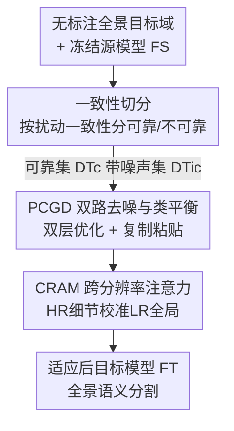

# Denoise and Align: Towards Source-Free UDA for Robust Panoramic Semantic Segmentation

**会议**: CVPR 2026  
**论文**: [CVF Open Access](https://openaccess.thecvf.com/content/CVPR2026/html/Chang_Denoise_and_Align_Towards_Source-Free_UDA_for_Robust_Panoramic_Semantic_CVPR_2026_paper.html)  
**代码**: https://github.com/ZZZPhaethon/DAPASS (有)  
**领域**: 全景语义分割 / 源域无关域适应  
**关键词**: 源域无关UDA, 全景分割, 伪标签去噪, 类别不平衡, 跨分辨率注意力  

## 一句话总结
DAPASS 在没有源域数据的前提下，把针孔相机预训练的分割模型迁移到全景图像：用置信度一致性把目标域样本拆成可靠/不可靠两堆、再靠双层优化和类平衡复制粘贴清洗伪标签，并用一个跨分辨率注意力模块对齐 ERP 畸变下的局部细节与全局语义，在室外 C-to-D 和室内 Spin-to-Span 上分别刷到 55.04% / 70.38% mIoU。

## 研究背景与动机
**领域现状**：全景（360°）语义分割对自动驾驶、VR 等需要整场景理解的应用很关键，但稠密标注极贵。主流做法是从有标注的针孔相机数据集做无监督域适应（UDA），把模型迁到无标注全景域。

**现有痛点**：很多真实场景出于隐私/版权原因拿不到源域数据，于是退化成更严苛的 **源域无关 UDA（SFUDA）**——只给一个预训练源模型和无标注全景图。这个约束把域偏移的核心问题放大了：自训练严重依赖伪标签质量，而源模型在全景域上生成的伪标签噪声大、且因源域长尾分布导致少数类（如 Rider）系统性欠训练，适应后这些类掉点尤其严重。

**核心矛盾**：全景图的等距柱状投影（ERP）带来纬度相关的几何畸变——极区被拉伸、赤道区相对稳定，这种空间不均匀畸变在针孔图上不存在，使得标准特征学习失效；同时源域不可见又让伪标签无从校准。畸变 + 伪标签噪声 + 类别不平衡三者在 SFUDA 下叠加。

**本文目标**：在不碰源数据、不用目标标签的条件下，(1) 把噪声伪标签清干净并补足少数类监督；(2) 让模型对 ERP 畸变和尺度变化鲁棒。

**核心 idea**：先 **Denoise**（置信度引导地筛/洗伪标签 + 类平衡）再 **Align**（用高分辨率局部细节去校准低分辨率全局语义），两个模块协同完成无源知识迁移。

## 方法详解

### 整体框架
给定针孔域预训练的源模型 $F_S$ 和无标注全景目标集 $\mathcal{D}_T=\{x_t\}$，目标是适应出在全景分割上表现好的 $F_T$。DAPASS 把这件事拆成两个串联模块：**PCGD（Panoramic Confidence-Guided Denoising）** 负责把伪标签的可靠性提上来——按一致性把目标样本切成可靠集 $\mathcal{D}_{Tc}$ 和不可靠集 $\mathcal{D}_{Tic}$，再用双层优化让可靠样本"带"噪声样本，并用类平衡复制粘贴补少数类；**CRAM（Cross-Resolution Attention Module）** 负责在干净伪标签之上对抗畸变——用高分辨率裁剪（HR）保局部细节、低分辨率全景（LR）保全局上下文，再学一个尺度注意力把两者自适应融合。源模型在适应过程中保持冻结，只训练目标网络。

### 关键设计

**1. 一致性切分：用扰动一致性把目标样本分成"能信的"和"不能信的"两堆**

源域不可见时，源模型在不同区域的伪标签可靠性差别极大——有些区域稳定地高置信，有些则系统性出错或被忽略。直接把所有伪标签等同对待，噪声会在自训练里累积。PCGD 先对每张目标图算一个一致性分数 $CS$：对第 $i$ 张图的每个像素，比较冻结源模型在初始参数 $\Theta^0$ 与自训练 $\tau$ 步后参数 $\Theta^\tau$ 下预测分布的 KL 散度，取负求和

$$CS^{i,\tau} = -\sum_{l=1}^{H\times W} D_{\mathrm{KL}}\!\left(\mathcal{F}_S(x_t^{(i,l)}\mid\Theta^0)\;\middle\|\;\mathcal{F}_S(x_t^{(i,l)}\mid\Theta^\tau)\right)$$

$CS$ 越高表示预测在扰动/迭代下越稳定、越可信。取 $CS$ 排名 top-$P\%$ 的样本组成可靠集 $\mathcal{D}_{Tc}$，其余进不可靠集 $\mathcal{D}_{Tic}$。这一步把"哪些伪标签能当监督"显式量化出来，为后面"可靠带不可靠"提供基础，比一刀切的置信度阈值更贴合全景域因畸变导致的空间不均匀可靠性。

**2. PCGD 双路去噪与类平衡：让可靠样本"带"噪声样本，同时补齐少数类**

切分之后仍有两个问题：$\mathcal{D}_{Tic}$ 里伪标签是噪声，$\mathcal{D}_{Tc}$ 本身又长尾、少数类样本不足。PCGD 用并行双路解决（见 Algorithm 1）。**Path A 双层近邻去噪**：核心思想是——对噪声样本 $x_i\in\mathcal{D}_{Tic}$ 的一次更新，只有当它同时改善某个稳定样本 $x_j\in\mathcal{D}_{Tc}$ 时才算可靠。为避免域/类别错配，不用整个子集，而是给每个 $x_i$ 在特征空间检索最相似的稳定近邻 $x_j$，对 $(x_i,x_j)$ 做双层优化：内层用 $x_i$ 临时更新参数 $\Theta_{inner}\leftarrow\Theta-\alpha\nabla_\Theta\mathrm{CE}(F_T(x_i\mid\Theta),F_S(x_i))$，外层用稳定近邻评估这次更新好不好 $\mathcal{L}_{outer}=\mathrm{CE}(F_T(x_j\mid\Theta_{inner}),F_S(x_j))$，再用 $\nabla_\Theta\mathcal{L}_{outer}$ 真正更新。这样"被稳定样本认可"的梯度才落地，从机制上抑制了噪声累积。

**Path B 类平衡复制粘贴**：近邻去噪不解决少数类稀缺。PCGD 为每个少数类 $c$ 维护一个 Top-K 类平衡池 $\mathcal{D}^c_{Tca}=\{(x_i,\hat y_i)\mid x_i\in\mathcal{D}_{Tc},\ CS_{i,m,c}\in\text{Top-K}\}$，存放该类高质量样本。对不可靠样本检索到的稳定近邻可能恰好缺某些类，于是从其它可靠样本里把缺失类的物体"借"过来粘贴上去：$(\hat x_i^{con},\hat y_i^{con})=\mathrm{CP}[(x_i^{con},\hat y_i^{con}),(x_{mix},\hat y_{mix})]$，$\mathrm{CP}$ 把后者的目标物体复制到前者。生成的增强样本进训练，给 Rider 这类尾部类补足监督。两路互补：A 管噪声、B 管不平衡。

**3. CRAM 跨分辨率注意力：用高分辨率局部细节去校准低分辨率全局语义，对抗 ERP 畸变**

ERP 让极区被强烈拉伸、赤道区相对稳定，这种纬度相关畸变破坏标准特征学习。CRAM 用两条互补分支：HR 裁剪分支保住局部可靠细节，LR 全景分支保住全局一致上下文，两者共享权重。LR 上下文裁剪 $x_t^{LR}=\zeta(\mathrm{Crop}(x_t^{HR},\mathbf{b}_L),1/s)$ 由原图裁剪后按因子 $s$ 双线性下采样得到——裁剪左上角被约束到特征图网格点（网格步长 $k=s\cdot o$，$o$ 为输出步长），保证后续多分辨率融合时像素级对应；HR 细节裁剪再从 LR 裁剪里随机抠出。

融合时学一个尺度注意力图 $a_{LR}=\sigma(F_T^A(F_T^E(x_t^{LR})))$，从 LR 上下文预测（因为它更能抓全局布局），sigmoid 把权重压到 $[0,1]$，值越大越信 HR 细节预测；细节裁剪之外注意力置零得到掩码后的 $a'_{LR}$。最终融合预测为

$$\hat y_{LR,F}=\zeta\big((1-a'_{LR})\odot\hat y_{LR},\,s\big)+\zeta(a'_{LR},\,s)\odot\hat y_{LR}^{HR}$$

即"全局语义 + 局部细节"按注意力自适应加权。与通用多分辨率融合的区别在于：CRAM 专为全景 SFUDA 设计，让 HR 局部细节去校准畸变和尺度变化下的 LR 全局语义，而非简单拼接。

### 损失函数 / 训练策略
CRAM 用融合预测和 HR 细节预测联合训练编码器、分割头、注意力头，目标损失

$$\mathcal{L}_{\mathrm{CRAM}}^T=(1-\lambda_d)\,\mathcal{L}_{ce}(\hat y_{LR,F}^T,p_{LR,F}^T,q_{LR,F}^T)+\lambda_d\,\mathcal{L}_{ce}(\hat y_{HR}^T,p_{HR}^T,q_{HR}^T)$$

其中 $\lambda_d\in[0,1]$ 平衡 LR 上下文分支与 HR 细节分支，$\mathcal{L}_{ce}(\cdot,\cdot,\tau)$ 是带温度 $\tau$ 的交叉熵（$\tau<1$ 锐化、$\tau>1$ 平滑伪标签分布）。训练用 4 张 3090，AdamW，初始学习率 $6\times10^{-5}$、poly 调度（power 0.9）、12K 迭代。C-to-D 设 top-$P\%{=}10$、$\tau{=}6000$、$s{=}2$；Spin-to-Span 设 $P\%{=}15$、$\tau{=}8000$、$s{=}2$。⚠️ 损失式中 $q$ 项的具体含义原文未充分展开，以原文为准。

## 实验关键数据

### 主实验
两个真实基准：室外 Cityscapes→DensePASS（C-to-D，19 类）与室内 Stanford2D3D pinhole→panoramic（Spin-to-Span，8 类）。SF 列标记是否为源域无关。

| 设置 | Backbone | 本文 DAPASS | 前 SOTA 360SFUDA++ | 提升 |
|------|----------|-------------|---------------------|------|
| C-to-D | SegFormer-B1 | 53.16 | 50.19 | +2.97 |
| C-to-D | SegFormer-B2 | **55.04** | 52.99 | +2.05 |
| Spin-to-Span | SegFormer-B1 | 69.56 | 66.54 | +3.02 |
| Spin-to-Span | SegFormer-B2 | **70.38** | 68.84 | +1.54 |

C-to-D 上 DAPASS 还把同为 SFUDA 的 SFDA / DATC 分别甩开约 10.46% / 10.10% mIoU；Spin-to-Span 上甚至超过能用源数据的 UDA 方法 MPA 3.22%，说明无源约束下也能逼近乃至反超有源方法。

### 消融实验
PCGD 内部双路（B1/B2 为两种 SegFormer backbone，指标 mIoU）：

| 配置 | C-to-D B1 | C-to-D B2 | Spin B1 | Spin B2 |
|------|-----------|-----------|---------|---------|
| Source-Only | 36.43 | 38.65 | 43.54 | 46.75 |
| 未加权伪标签 | 40.71 | 42.56 | 51.35 | 53.54 |
| w/o Path A | 47.82 | 49.10 | 61.43 | 63.55 |
| w/o Path B | 48.35 | 50.02 | 63.12 | 64.78 |
| PCGD (Full) | **50.23** | **52.38** | **65.87** | **67.32** |

模块级消融（PCGD 与 CRAM 叠加）：

| 配置 | C-to-D B1 | C-to-D B2 | Spin B1 | Spin B2 |
|------|-----------|-----------|---------|---------|
| Source-Only | 36.43 | 38.65 | 43.54 | 46.75 |
| SFDA | 42.70 | 44.10 | 54.76 | 56.32 |
| PCGD only | 50.23 | 52.38 | 65.87 | 67.32 |
| PCGD + CRAM | **53.16** | **55.04** | **69.56** | **70.38** |

### 关键发现
- **去噪是大头，对齐是补刀**：从 Source-Only 到 PCGD（C-to-D B2：38.65→52.38）涨了约 14 个点，PCGD 解决了伪标签可靠性这个 SFUDA 主要矛盾；CRAM 再把 52.38→55.04 补约 2.7 点，负责畸变/尺度的细粒度提升。
- **双路缺一不可**：去掉 Path A（双层近邻去噪）比去掉 Path B 掉得更多（C-to-D B1：50.23→47.82 vs →48.35），说明噪声抑制比类平衡更关键，但两路同时在才达最优。
- **超参不敏感**：top-$P$ 在 1%~20% 区间 mIoU 波动很小（C-to-D 54.52~55.04，最优 $P{=}10$）；$\tau$ 增大到一定值后饱和（C-to-D 在 $\tau\ge6000$ 后稳定 55.04），调参容错度高。

## 亮点与洞察
- **"可靠样本带噪声样本"的双层优化很巧**：把"这次更新可不可信"外包给稳定近邻的损失，相当于给每步梯度加了一道无源域的"质检"，比直接阈值滤伪标签更有原则性——这个思路可迁移到任何缺真值监督的自训练场景。
- **一致性分数用 KL 散度量化伪标签稳定性**，而非简单 softmax 置信度，能识别"高置信但其实在迭代中漂移"的假可靠样本，对全景这种空间不均匀畸变特别合适。
- **CRAM 让 HR 细节去校准 LR 语义**而非对称融合，抓住了 ERP 畸变"局部细节比全局更可信"的特性，注意力从 LR 预测但权重偏向 HR，设计动机具体。

## 局限与展望
- 方法引入一致性切分 + 双层优化 + 双路训练 + 双分辨率前传，训练开销和实现复杂度都不低（双层优化要内外两次前反传），论文未给训练耗时对比。
- 少数类的定义是按目标域出现频率人工划定的（C-to-D 把 Pole/Light/Sign/Rider 等列为少数类），换数据集需重新设定，自动化程度有限。
- 类平衡复制粘贴是"借物体粘贴"，在全景 ERP 畸变下被粘贴物体的几何形变是否与目标位置一致，原文未深入分析，极区粘贴可能引入不自然边界。
- ⚠️ 论文部分公式（如复制粘贴的 $x_{mix}$ 来源、损失中 $q$ 项）在 CVF 文本里转写不全，复现需对照官方代码。

## 相关工作与启发
- **vs 360SFUDA++ [1]**：两者都做全景 SFUDA，360SFUDA++ 是该任务首个 SFUDA 框架；DAPASS 在它之上明确针对"伪标签噪声 + 长尾 + ERP 畸变"三个具体痛点分别上 PCGD 和 CRAM，四个设置全面超越（+1.54~+3.02 mIoU），优势在于对少数类和细节边界的恢复。
- **vs 普通 UDA（Trans4PASS / DPPASS / DATR）**：这些方法训练时能直接访问源数据；DAPASS 在更严苛的无源约束下，Spin-to-Span 仍反超有源的 MPA 3.22%，说明高质量伪标签去噪 + 跨分辨率对齐能弥补源数据缺失。
- **vs SND/双层优化自训练 [35]**：DAPASS 借鉴了"稳定样本评估噪声样本更新"的双层思想，但改成特征空间近邻配对（避免域/类错配）并叠加类平衡池，更适配全景长尾场景。

## 评分
- 新颖性: ⭐⭐⭐⭐ 把双层近邻去噪 + 类平衡 + 跨分辨率注意力组合到全景 SFUDA，针对性强但单点机制多有渊源。
- 实验充分度: ⭐⭐⭐⭐ 室内外两基准 + 双 backbone + 充分消融与超参敏感性，缺训练开销分析。
- 写作质量: ⭐⭐⭐⭐ 动机清晰、模块职责分明，但部分公式转写不全影响复现。
- 价值: ⭐⭐⭐⭐ 全景 SFUDA 是隐私受限场景的实际需求，刷新双基准 SOTA 且代码开源。

<!-- RELATED:START -->

## 相关论文

- [\[ICCV 2025\] OmniSAM: Omnidirectional Segment Anything Model for UDA in Panoramic Semantic Segmentation](../../ICCV2025/segmentation/omnisam_omnidirectional_segment_anything_model_for_uda_in_panoramic_semantic_seg.md)
- [\[CVPR 2026\] REL-SF4PASS: Panoramic Semantic Segmentation with REL Depth Representation and Spherical Fusion](rel-sf4pass_panoramic_semantic_segmentation_with_rel_depth_representation_and_sp.md)
- [\[CVPR 2026\] Seeing Beyond: Extrapolative Domain Adaptive Panoramic Segmentation](seeing_beyond_extrapolative_domain_adaptive_panoramic_segmentation.md)
- [\[CVPR 2026\] Towards Robust Multi-Modal Semantic Segmentation with Teacher-Student Framework and Hybrid Prototype Distillation](towards_robust_multi-modal_semantic_segmentation_with_teacher-student_framework_.md)
- [\[CVPR 2026\] The Power of Prior: Training-Free Open-Vocabulary Semantic Segmentation with LLaVA](the_power_of_prior_training-free_open-vocabulary_semantic_segmentation_with_llav.md)

<!-- RELATED:END -->
