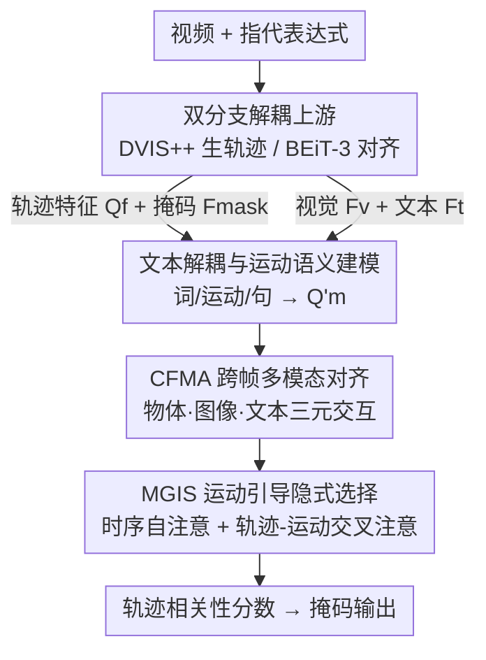

# DeRVOS: Decoupling Consistent Trajectory Generation and Multimodal Understanding for Referring Video Object Segmentation

**会议**: CVPR 2026  
**论文**: [CVF Open Access](https://openaccess.thecvf.com/content/CVPR2026/html/Cheng_DeRVOS_Decoupling_Consistent_Trajectory_Generation_and_Multimodal_Understanding_for_Referring_CVPR_2026_paper.html)  
**代码**: 未公开  
**领域**: 视频理解  
**关键词**: 指代视频目标分割, 轨迹一致性, 多模态理解, DVIS++, BEiT-3  

## 一句话总结
DeRVOS 把指代视频目标分割（RVOS）拆成"一致轨迹生成"和"多模态理解"两条上游分支，分别用冻结的 DVIS++ 和预训练的 BEiT-3 直接产出稳定的实例轨迹和对齐的视觉-文本特征，再用一个 TAIS 模块把任务收敛成"指代表达式 ↔ 实例轨迹"的匹配，在 MeViS 上比 LVLM 方法高 4.7%。

## 研究背景与动机
**领域现状**：RVOS 要根据自然语言把视频里被指代的物体从头到尾分割出来。随着 MeViS 数据集引入遮挡、快速运动、动静态混合表达和长程推理，主流做法是基于 query 的多阶段串行 pipeline——先做多模态特征提取与融合，再生成物体表示，最后预测掩码。近期也有 LVLM 路线借助大模型的视频理解能力刷分。

**现有痛点**：这套"端到端从零学"的多阶段范式有两个老毛病。其一是**轨迹不一致**：物体表示生成时并没有在特征空间里显式建模轨迹一致性，而是靠预测与 GT 的匹配关系（二分匹配/相似度匹配）隐式约束，遇到遮挡和快速运动就会跟踪断裂、目标碎片化。其二是**多模态理解不足**：大多数方法用独立的视觉/文本编码器，跨模态交互推迟到下游融合模块，难以在表示空间建立深层一致性；面对含动作和关系的表达（如"正在追逐另一只狗的那只"）就容易指代模糊。

**核心矛盾**：把轨迹一致性建模和多模态融合两件难事都压在一个从零训练的下游 pipeline 里，二者互相纠缠、谁都没学好——既要稳跟踪又要懂语义，优化目标冲突且数据效率低。

**本文目标**：让轨迹一致性和跨模态对齐这两件事各自交给已经做得很好的预训练模型，在上游就解决掉，把 RVOS 真正剩下的难点——"把表达式和某条实例轨迹对上号"——单独拎出来建模。

**核心 idea**：用一个冻结的视频实例分割模型（DVIS++）在上游产出时序一致的物体轨迹，用一个统一融合编码器（BEiT-3）在上游做好图像级视觉-文本对齐，从而把 RVOS 降维成"指代表达式与实例轨迹之间的关系建模"，再用轻量的 TAIS 模块完成轨迹层面的动态语义选择。

## 方法详解

### 整体框架
DeRVOS 把 RVOS 解耦成三大件：**一致轨迹生成分支**、**多模态理解分支**，以及把二者缝起来的 **TAIS（Trajectory Alignment and Implicit Selection）模块**。输入是一段视频和一句指代表达式，输出是被指代物体在每一帧上的掩码。

整体流程是：高分辨率视频送进冻结的 DVIS++，直接拿到时序一致的物体特征 $Q_f$ 和掩码特征 $F_{mask}$；同一段视频降采样后逐帧和文本一起送进 BEiT-3，拿到共享空间里对齐好的视觉特征 $F_v$ 和文本特征 $F_t$。两个分支都"现成可用"、不用再学分割/跟踪，于是下游只剩理解和选择。TAIS 先把文本解耦成词级/运动级/句级三类特征并编码出运动语义查询 $Q'_m$，再由 CFMA 做跨帧多模态对齐、由 MGIS 做运动引导的隐式轨迹选择，最终给每条轨迹打一个相关性分数，分数最高的轨迹对应的掩码就是答案。

### 关键设计

**1. 双分支解耦：把轨迹一致性和跨模态对齐前置到上游**

针对"从零学轨迹一致性 + 多模态融合，二者纠缠且学不好"的根本矛盾，DeRVOS 不再让一个下游网络硬扛两件事，而是各请一个预训练专家。轨迹侧用冻结的 **DVIS++**（含 backbone、segmentator、tracker、refiner）作为一致轨迹生成器：给定高分辨率视频 $V_{high}\in\mathbb{R}^{T\times3\times H\times W}$，它输出掩码特征 $F_{mask}$、时序一致的物体特征 $Q_f\in\mathbb{R}^{T\times Q\times C}$ 和精修后的掩码 $P_{mask}$。DVIS++ 的 tracker 天生擅长长序列显式时序建模，且在多样视频数据上预训练过，遮挡/快速运动下仍能稳跟踪——这正好绕开了"靠匹配隐式约束一致性"的脆弱点。多模态侧把原本独立的双流编码器换成预训练的**统一融合编码器 BEiT-3**：把视频降采样成低分辨率帧 $I_{low}$，每帧的视觉 token 与文本 token 拼接成 $Z_{in}=\{v_1,\dots,v_{N_v},l_1,\dots,l_{N_l}\}$ 一起编码，输出投影到共享空间的 $F_v$、$F_t$。

之所以有效，是因为它把"融合能力从下游阶段提升到了上游预训练阶段"——视觉和文本在图像级就深度对齐，下游不再从零建立跨模态一致性；同时冻结轨迹生成器还大幅降低了训练复杂度和算力开销。经此一解耦，RVOS 被干净地降维成"指代表达式与实例轨迹的匹配"这一件事。

**2. 文本解耦与运动语义建模：把"动作/关系"从句子里抽出来单独编码**

MeViS 的表达式大量含动作和关系（"正在……的那个"），但整句池化会把这些运动线索淹没。为此 TAIS 先做一次**文本解耦**：$F_w, F_m, F_s = \mathrm{Decoupler}(F_t)$，分别得到词级特征 $F_w$（投影得到）、运动级特征 $F_m$（从表达式里识别动词和副词抽取）、句级特征 $F_s$（对文本特征做均值池化）。视觉侧也先把 $F_{mask}$ 降采样投影后与 $F_v$ 沿通道拼接、过 Fusion 模块得到融合视觉特征 $F_f$，给视觉补上语义上下文。

随后把运动级和句级特征沿通道拼接，让一组可学习查询 $Q_m$ 通过 Transformer 形式的 SemDecoder 与之交互，产出**运动感知语义特征**：

$$Q'_m = \mathrm{FFN}\big(\mathrm{MCA}(\mathrm{MSA}(Q_m),\, F_s \oplus F_m)\big)$$

其中 $\mathrm{MSA}$、$\mathrm{MCA}$ 分别是多头自注意力和交叉注意力，$\oplus$ 是特征拼接。这一步的意义在于：把"做什么动作"显式提炼成一组运动语义查询，供后面 MGIS 沿时间轴去增强相关轨迹的响应，而不是把运动信息混在整句表示里被冲淡。

**3. CFMA 跨帧多模态对齐：用"物体·图像·文本"三元交互消除分支表示差异**

两条分支各自预训练，特征空间并不天然对齐——CFMA（Cross-Frame Multimodal Aligner）就是把生成分支的物体特征和理解分支的多模态特征拉进同一空间。它先让融合视觉特征 $F_f$ 与词级文本 $F_w$ 做**双向多头注意力**互相增强：

$$F'_f, F'_w = \mathrm{BiMHA}(F_f, F_w)$$

然后让时序一致的物体特征 $Q_f$ 依次与增强后的视觉 $F'_f$、文本 $F'_w$ 做交叉注意力——先强化物体在图像中相关区域的响应，再强化物体与文本语义的关联，最后用实例级自注意力建模帧内长程依赖、过 FFN 输出 $Q'_f$：

$$Q'_f = \mathrm{FFN}\big(\mathrm{MSA}(\mathrm{MCA}(\mathrm{MCA}(Q_f, F'_f),\, F'_w))\big)$$

这一连串交叉注意力本质上是物体表示、全局视觉、全局文本三者之间的**三元交互**：它让每条轨迹的特征同时具备视觉一致性和语义对齐，把两个分支之间的表示鸿沟抹平，为后续隐式选择做好准备。消融显示三元交互的 CFMA 比"文本直连"和"视频 query"两种朴素连接结构对得更齐。

**4. MGIS 运动引导隐式选择：用运动语义沿时间轴挑出目标轨迹**

CFMA 给出帧级对齐好的 $Q'_f$ 后，MGIS（Motion-Guided Implicit Selector）负责跨帧地把"哪条轨迹符合这句话描述的运动"挑出来。它先把 $Q'_f$ 的时间维和 query 维互换得到 $Q_t\in\mathbb{R}^{N\times T\times C}$，做**时序自注意力**建模跨帧依赖得到捕捉一致动态的轨迹特征 $Q'_t$；再做**轨迹-运动交叉注意力**，让轨迹特征选择性地关注前面编出的运动语义 $Q'_m$，从而增强与运动表达相关的轨迹响应：

$$Q_p = \mathrm{FFN}\big(\mathrm{MCA}(\mathrm{MSA}(Q_t),\, Q'_m)\big)$$

最后用一个线性投影把 $Q_p$ 映射到标量分数空间，得到轨迹相关性分数 $S_f\in\mathbb{R}^{T\times Q\times2}$。所谓"隐式选择"，是指它不显式地分类或回归每条轨迹，而是借运动语义线索给轨迹打分、让最匹配的轨迹自然胜出——这正契合"把 RVOS 降维成表达式与轨迹的关系建模"的初衷。

### 损失函数 / 训练策略
RVOS 阶段损失极简，只有分类损失：预测轨迹与 GT 用匈牙利算法做一对一匹配、未匹配的轨迹不计损失，$L = L_{cls}$。在 RIS 和图像级预训练任务上，只微调 DVIS++ 的 refiner、冻结其余模块，总损失为 $L = \lambda_{cls}L_{cls} + \lambda_{mask}L_{mask}$，其中掩码损失结合 dice loss 与二元交叉熵，$\lambda_{cls}=2.0$、$\lambda_{mask}=5.0$。训练时片段长 $T=8$，DVIS++ 输入 $640\times640$、多模态编码器输入 $320\times320$；为与 LVLM 公平对比，先在 RefCOCO/+/g 上做图像级预训练再到 MeViS / Ref-YouTube-VOS 微调。

## 实验关键数据

### 主实验
在专家方法对比中 DeRVOS 全面 SOTA；经图像级预训练后（†）相比 LVLM 方法优势更明显，MeViS val 上比 GLUS 高 4.7%。

| 数据集 | 指标 | DeRVOS | 之前最佳 | 提升 |
|--------|------|--------|----------|------|
| MeViS (val) | J&F | 51.8 | 49.3 (ReferDINO) | +2.5 |
| MeViS (valu) | J&F | 60.6 | 58.3 (DMVS) | +2.3 |
| MeViS (val)† | J&F | 56.0 | 51.3 (GLUS, LVLM) | +4.7 |
| MeViS (valu)† | J&F | 61.5 | 57.8 (VISA-7B, LVLM) | +3.7 |
| Ref-YouTube-VOS | J&F | 70.0 | 69.3 (ReferDINO) | +0.7 |
| Ref-DAVIS17 | J&F | 70.9 | 68.9 (ReferDINO) | +2.0 |
| RefCOCO (val, RIS) | mIoU | 80.2 | 79.2 (GSVA-13B) | +1.0 |

### 消融实验
两个分支能力、连接结构、轨迹分支输入分辨率均在 MeViS valu 上验证。

| 配置 | J&F | 说明 |
|------|-----|------|
| CTG=M2F / MU=BEiT3-B | 55.5 | 图像级分割器起点 |
| CTG=VITA / MU=BEiT3-B | 56.0 | 换成视频实例分割 +0.5 |
| CTG=DVIS++ / MU=BEiT3-B | 57.4 | 最强轨迹生成器 +1.9 |
| CTG=DVIS++ / MU=BERT-B | 55.9 | 弱多模态理解 |
| CTG=DVIS++ / MU=ViLT-B | 56.6 | +0.7 |
| Text-Direct Integrator | 56.1 | 文本直连轨迹 |
| Video-Query Integrator | 56.2 | 可学习 query 连接 |
| CFMA only | 56.5 | 三元帧级对齐 |
| TAIS (CFMA+MGIS) | 57.4 | 完整连接 +1.3 |

### 关键发现
- **两个分支能力都"越强越好"且可独立换装**：固定多模态分支、把轨迹生成器从 Mask2Former→VITA→DVIS++，J&F 从 55.5 升到 57.4；固定轨迹分支、把理解器从 BERT→ViLT→BEiT-3，J&F 从 55.9 升到 57.4。解耦设计让二者的提升能各自叠加。
- **连接结构里 MGIS 是关键增量**：仅 CFMA 时 56.5，加上 MGIS 的渐进式 TAIS 达到 57.4（+0.9），说明"运动引导的隐式选择"比单纯帧级对齐更重要；而朴素的文本直连/视频 query 连接几乎不涨点。
- **轨迹分支分辨率是显著的性价比杠杆**：把 DVIS++ 输入从 320 提到 640，J&F 从 56.9 涨到 60.9（+4.0），训练时间仅从 3.8h 增到 5.8h——高分辨率对一致轨迹生成帮助很大。
- **轨迹生成器的预训练数据要"运动丰富"**：DVIS++ 在 OVIS 上预训练给到 57.4，明显优于 YouTube-VIS 2019/2021、VIPSeg（53.8–55.4），因为 OVIS 遮挡/运动更贴近 MeViS 场景。

## 亮点与洞察
- **"解耦 + 冻结预训练专家"把难题降维**：与其让一个网络从零同时学跟踪和语义，不如把这两件已被各自领域做透的事前置到上游、整段冻结，下游只学"表达式↔轨迹"的匹配——这是一种很务实的"站在巨人肩膀上"思路，可迁移到其他需要时序一致性 + 跨模态对齐的任务（如指代视频抠图、视频问答中的实例定位）。
- **文本解耦出"运动级特征"很巧**：显式从表达式抽动词/副词单独编码，避免运动线索被整句池化冲淡，再用 MGIS 沿时间轴增强匹配轨迹的响应，直击 MeViS"动态表达"的痛点。
- **隐式选择而非显式分类**：不强行给每条轨迹分类，而是借运动语义打相关性分数让目标自然胜出，和"把 RVOS 看成匹配问题"的整体观一致，工程上也更简洁（RVOS 主损失只剩分类损失）。

## 局限与展望
- 性能强依赖两个冻结的大预训练模型（DVIS++、BEiT-3），整体效果被它们的上限和预训练数据分布（如轨迹生成器需 OVIS 这类运动丰富数据）所限；在与训练分布差异大的场景下能否保持优势未充分验证。⚠️ 以原文为准。
- 上游用高分辨率 DVIS++（640）才出最佳分数，推理时跑一个完整 VIS 模型 + BEiT-3，实际部署的算力/延迟开销作者未在正文给出，对实时视频应用可能是负担。
- 方法本质是"先生成所有候选轨迹再选"，若被指代物体在轨迹生成阶段就被 DVIS++ 漏掉或跟丢，后续无论怎么对齐选择都无法补救——上游错误不可恢复。
- 改进方向：探索可微调/轻量化的轨迹生成器以降低开销，或在选择阶段引入对漏检的容错机制。

## 相关工作与启发
- **vs DsHmp / SSA / ReferDINO（专家 RVOS）**: 它们仍在一个 pipeline 内学轨迹一致性与多模态融合（靠相似度/二分匹配或双流编码器对齐）；DeRVOS 把这两件事彻底解耦到上游冻结专家，在 MeViS val 上比 ReferDINO 高 2.5%。
- **vs GLUS / VISA / VideoLISA（LVLM 路线）**: 它们靠大模型的视频理解能力刷分但参数量大；DeRVOS 用更轻的专家组合 + TAIS，在 MeViS val 上比 GLUS 高 4.7%、RefCOCO 系列上以更少参数超过 GSVA-13B，说明"解耦专精"在该任务上比"大一统大模型"更高效。
- **vs 用预训练轨迹生成模型的方法（如集成 VIS 的工作）**: DeRVOS 不只引入轨迹生成，还同时把多模态融合也前置、并用 TAIS 的三元交互 + 运动引导选择把两条分支真正缝合，连接结构消融证明这种渐进式缝合显著优于文本直连/query 直连。

## 评分
- 新颖性: ⭐⭐⭐⭐ 解耦 + 冻结专家 + TAIS 缝合的组合很清晰，但各组件均为成熟模块的重组
- 实验充分度: ⭐⭐⭐⭐⭐ 三大 RVOS benchmark + RIS 全覆盖，分支/连接/分辨率/预训练数据消融完整
- 写作质量: ⭐⭐⭐⭐ 动机—解耦—缝合的逻辑链顺畅，公式与图示清楚
- 价值: ⭐⭐⭐⭐ 在 MeViS 上显著超越 LVLM，且提供了一条低成本超大模型的实用范式

<!-- RELATED:START -->

## 相关论文

- [\[CVPR 2026\] InterRVOS: Interaction-Aware Referring Video Object Segmentation](interrvos_interaction-aware_referring_video_object_segmentation.md)
- [\[CVPR 2026\] Long-RVOS: A Comprehensive Benchmark for Long-term Referring Video Object Segmentation](long-rvos_a_comprehensive_benchmark_for_long-term_referring_video_object_segment.md)
- [\[CVPR 2026\] Weakly-Supervised Referring Video Object Segmentation through Text Supervision](wsrvos_weakly_supervised_rvos.md)
- [\[CVPR 2026\] Towards Streaming Referring Video Segmentation via Large Language Model](towards_streaming_referring_video_segmentation_via_large_language_model.md)
- [\[CVPR 2026\] Learning Cross-View Object Correspondence via Cycle-Consistent Mask Prediction](learning_cross-view_object_correspondence_via_cycle-consistent_mask_prediction.md)

<!-- RELATED:END -->
