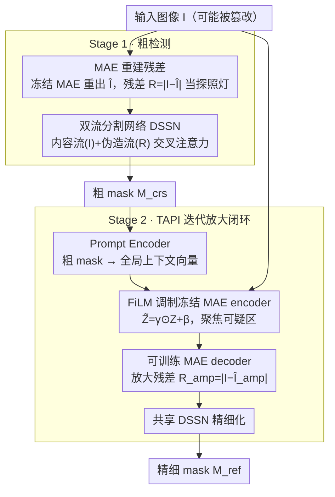

# Detecting AI-Generated Forgeries via Iterative Manifold Deviation Amplification

**会议**: CVPR 2026  
**arXiv**: [2602.18842](https://arxiv.org/abs/2602.18842)  
**代码**: 待确认  
**领域**: 图像分割 / AI 伪造检测  
**关键词**: AI 生成图像检测, 流形偏差, MAE 重建, 迭代放大, 图像伪造定位

## 一句话总结
提出 IFA-Net，从"建模什么是真"而非"学什么是假"的角度检测 AI 伪造：利用冻结 MAE 重建输入产生残差暴露偏离自然图像流形的区域，再通过两阶段闭环——粗检测→任务自适应先验注入→放大残差→精细化——迭代放大流形偏差，在 diffusion inpainting 和传统篡改检测上均取得 SOTA。

## 研究背景与动机
随着 Stable Diffusion、DALL-E 等 AI 图像生成技术的爆发，AI 生成内容（AIGC）的伪造检测与定位变得至关重要。现有方法大多遵循"学习什么是假"的范式：从伪造样本中提取伪造特有的 artifact（如频谱异常、GAN fingerprint）。但这类方法存在根本问题：

**泛化性差**：在特定生成器上训练的检测器难以泛化到未见过的生成器

**对抗脆弱**：伪造者只需微调生成过程即可绕过基于 artifact 的检测

**数据依赖**：需要大量标注的 "真-假" 配对数据

核心转向：**如果我们不去学习"假图像长什么样"，而是精准建模"真实图像应该长什么样"，那么任何偏离真实图像流形的区域都是可疑的。** 这一思路天然具备跨生成器泛化能力，因为建模的是自然图像的统计规律而非特定伪造方法的 artifact。

预训练 MAE（Masked Autoencoder）在海量真实图像上学习了强大的自然图像流形先验。当 MAE 试图重建一张部分伪造的图像时，真实区域可以被良好重建（因为位于流形上），而伪造区域则会产生较大的重建残差（因为偏离流形）。**残差图天然就是伪造区域的"探照灯"。**

## 方法详解

### 整体框架
IFA-Net 换了个思路检测 AI 伪造：不去学"假长什么样"，而是用在海量真实图上预训练的 MAE 建模"真该长什么样"，凡是偏离自然图像流形的区域就是可疑区域。整体是一个两阶段闭环——Stage 1 用冻结 MAE 重建输入、由残差图暴露可疑区，经双流分割网络 DSSN 出一张粗 mask $M_{\text{crs}}$；Stage 2 把粗 mask 当先验注入 MAE，放大那些区域的重建残差，再过同一个 DSSN 精细化成最终 mask $M_{\text{ref}}$。这样"检测→聚焦→放大→精化"形成闭环，越可疑的地方残差被推得越大。

### 关键设计

**1. MAE 重建残差：把"偏离真实流形"变成探照灯**

伪造检测的泛化难题在于 artifact 类方法只认特定生成器的指纹。IFA-Net 改为利用冻结 MAE 的自然图像流形先验：输入可能被篡改的图 $I$ 经 MAE 重建出 $\hat{I}$，真实区域落在流形上、能被准确重建，伪造区域偏离流形、重建误差大，于是残差图 $R = |I - \hat{I}|$ 天然就是伪造区域的探照灯。因为建模的是真实图的统计规律而非某种伪造痕迹，它天然能跨生成器泛化，也不依赖"真-假"配对标注。

**2. 双流分割网络 DSSN：内容流与伪造流互相指路**

只看残差容易被纹理噪声误导，只看原图又没有伪造线索。DSSN 基于 SegFormer 做双流：内容流（Content Stream）编码原图 $I$ 的语义内容（"在哪里看"），伪造流（Artifact Stream）编码残差图 $R$（Stage 2 则是放大残差 $R_{\text{amp}}$）里的伪造线索（"看到了什么异常"），两路在每个 SegFormer stage 后用交叉注意力（cross-attention）交换信息。两个阶段共享同一套 DSSN 权重，既省参数，又让 Stage 1 的梯度顺带帮 Stage 2 的 DSSN 学习。

**3. TAPI 迭代放大闭环：让微弱残差被推大再精化**

生成质量越高、Stage 1 的残差越微弱，需要主动放大。TAPI（Task-Adaptive Prior Injection）先用 Prompt Encoder 把粗 mask $M_{\text{crs}}$ 经卷积降采样 + 线性投影编成全局上下文向量，再用它对冻结 MAE encoder 的中间特征 $Z$ 做 FiLM 调制 $\tilde{Z} = \gamma \odot Z + \beta$（$\gamma, \beta$ 由上下文向量生成），等于告诉 MAE"重点盯这些区域"。配合 Stage 2 改为可训练的 MAE decoder，可疑区的重建误差被进一步放大，放大残差 $R_{\text{amp}} = |I - \hat{I}_{\text{amp}}|$ 送回共享 DSSN 得到精细 mask $M_{\text{ref}}$。MAE encoder 全程冻结以保住流形先验，仅靠 FiLM 注入任务信息，参数高效。

### 损失函数
总损失对两阶段输出加权，精细 mask 权重 1.0、粗 mask 权重 0.5，引导网络重点优化最终输出：

$$\mathcal{L}_{\text{total}} = \mathcal{L}_{\text{ref}} + 0.5 \cdot \mathcal{L}_{\text{crs}}$$

每个阶段的损失同时用 BCE 做像素级分类、Dice 缓解伪造区远小于真实区的类别不平衡：

$$\mathcal{L}_{\text{stage}} = \mathcal{L}_{\text{BCE}} + \mathcal{L}_{\text{Dice}}$$

## 实验关键数据

### 主实验 — Diffusion Inpainting 检测
在四个 diffusion inpainting benchmark 上的平均结果：

| 方法 | IoU (%) | F1 (%) |
|------|---------|--------|
| MVSS-Net | 41.2 | 52.7 |
| ObjectFormer | 43.8 | 55.1 |
| SAFIRE | 47.3 | 59.6 |
| UnionFormer | 49.1 | 61.3 |
| **IFA-Net (Ours)** | **55.6 (+6.5)** | **69.4 (+8.1)** |

关键发现：
- IFA-Net 在 IoU 上平均超越最佳 baseline +6.5%，F1 超越 +8.1%
- 在 Stable Diffusion v2 inpainting 上提升最为显著，说明流形偏差方法对高质量生成更有效

### 泛化性 — 传统篡改检测
在 CASIA、Columbia、NIST 等传统 copy-move/splicing 数据集上：

| 方法 | CASIA F1 | Columbia F1 | NIST F1 |
|------|----------|-------------|---------|
| ManTra-Net | 48.2 | 72.5 | 35.8 |
| SPAN | 52.1 | 76.3 | 39.2 |
| **IFA-Net** | **56.8** | **79.1** | **43.7** |

关键发现：**IFA-Net 无需在传统篡改数据上训练，零样本泛化即超越专门的篡改检测方法**，验证了"建模真而非学假"范式的泛化优势。

### 消融实验

| 配置 | MAE 残差 | TAPI 放大 | 双流 DSSN | IoU (%) |
|------|---------|----------|----------|---------|
| 仅内容流 | ✗ | ✗ | ✗ | 38.5 |
| + MAE 残差 | ✓ | ✗ | ✗ | 46.2 |
| + 双流融合 | ✓ | ✗ | ✓ | 50.8 |
| **+ TAPI（完整）** | ✓ | ✓ | ✓ | **55.6** |

- MAE 残差引入了 +7.7% IoU，确认流形偏差信号的有效性
- 双流 DSSN 再提升 +4.6%，说明内容和 artifact 信息互补
- TAPI 迭代放大额外 +4.8%，证明残差放大机制关键

## 亮点与洞察
- **范式转变**：从"学假"到"建模真"，利用预训练 MAE 的流形先验天然具备跨生成器泛化
- **闭环放大设计**：粗 mask → 注入 MAE → 放大残差 → 精细 mask，形成"检测→聚焦→放大→精化"的优雅闭环
- **冻结 + 调制**：MAE encoder 保持冻结保留流形先验，仅通过 FiLM 调制注入任务信息，参数高效
- **零样本泛化**：在 diffusion inpainting 上训练，零样本迁移到传统 copy-move/splicing，说明流形偏差是统一的伪造指标

## 局限与展望
- MAE 的重建能力有限，对极小区域（<32×32 像素）的伪造可能残差不显著
- 两阶段串行推理增加延迟，实时视频伪造检测需优化效率
- TAPI 仅迭代一次（Stage 1 → Stage 2），多次迭代是否能进一步提升未探索
- 对全图 AI 生成（非局部 inpainting）的检测能力未充分验证
- 共享 DSSN 权重在两个 stage 间可能存在优化冲突

## 相关工作与启发
- 与 ObjectFormer（学习 object-level artifact）的区别：IFA-Net 不学特定 artifact，而是建模流形偏差
- MAE 重建残差的思路与异常检测（如 PatchCore）有理论相通性——都是"学正常→找异常"
- TAPI 的 FiLM 调制灵感可能来自 SAM（Segment Anything Model）的 prompt encoder
- 启发：流形偏差放大思路可推广到 deepfake 视频检测（时序流形偏差）和 AI 生成文本检测

## 评分
- 新颖性: ⭐⭐⭐⭐⭐ "建模真而非学假"的范式转变+闭环残差放大在伪造检测领域原创
- 实验充分度: ⭐⭐⭐⭐ diffusion inpainting + 传统篡改 + 完整消融，但缺少 deepfake 人脸场景
- 写作质量: ⭐⭐⭐⭐ 动机阐述优秀，"流形偏差"概念直观清晰
- 价值: ⭐⭐⭐⭐⭐ 跨生成器泛化能力使方法具有实际部署价值，范式可推广

<!-- RELATED:START -->

## 相关论文

- [\[ICCV 2025\] Rethinking Detecting Salient and Camouflaged Objects in Unconstrained Scenes](../../ICCV2025/segmentation/rethinking_detecting_salient_and_camouflaged_objects_in_unconstrained_scenes.md)
- [\[CVPR 2026\] Masked Representation Modeling for Domain-Adaptive Segmentation](mrm_masked_representation_modeling_domain_adaptive.md)
- [\[CVPR 2026\] Heuristic Self-Paced Learning for Domain Adaptive Semantic Segmentation under Adverse Conditions](heuristic_self-paced_learning_for_domain_adaptive_semantic_segmentation_under_ad.md)
- [\[CVPR 2026\] CrossEarth-SAR: A SAR-Centric and Billion-Scale Geospatial Foundation Model for Domain Generalizable Semantic Segmentation](crossearthsar_a_sarcentric_and_billionscale_geospa.md)
- [\[CVPR 2026\] MPM: Mutual Pair Merging for Efficient Vision Transformers](mpm_mutual_pair_merging_for_efficient_vision_transformers.md)

<!-- RELATED:END -->
