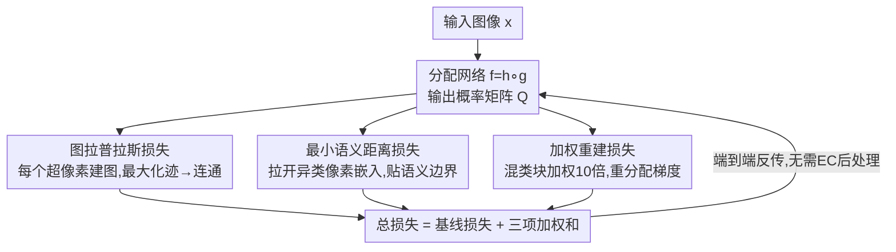

# Differentiable Laplacian Matrix Guided Superpixel Segmentation

**会议**: CVPR 2026  
**论文**: [CVF Open Access](https://openaccess.thecvf.com/content/CVPR2026/html/Juybari_Differentiable_Laplacian_Matrix_Guided_Superpixel_Segmentation_CVPR_2026_paper.html)  
**代码**: https://github.com/jeremyJJB/Differentiable-Laplacian-Matrix-Guided-Superpixel-Segmentation  
**领域**: 语义分割  
**关键词**: 超像素分割, 图拉普拉斯, 连通性, 可微后处理, 端到端学习  

## 一句话总结
针对深度超像素模型必须靠不可微的「强制连通(EC)」后处理才能消掉碎片的痛点，本文提出一个完全可微、与模型无关的图拉普拉斯损失（外加最小语义距离损失和加权重建损失），在训练中就把超像素逼向连通，几乎不掉 ASA 的同时大幅减少碎片，朝「去掉后处理、真正端到端」迈了一步。

## 研究背景与动机
**领域现状**：超像素把图像聚成感知一致的小区域，是下游分割/检测的压缩手段。传统方法（如 SLIC）天生满足连通性——每个标签对应一个连通分量，孤立像素被设计性地避免。2018 年后深度方法（SCN、AINet、CDS、SSM 等）把超像素生成变得可微、可端到端训练，边界贴合与分割精度大幅提升。

**现有痛点**：深度模型虽然边界好，却经常产生不规则边界、把同一个标签碎成多个互不相连的片段（excess components）、以及孤立像素（stray pixels）。实践中只能在推理后套一个从 SLIC 借来的不可微后处理——强制连通(Enforced Connectivity, EC)——把这些散片重新分配，强行恢复连通。

**核心矛盾**：EC 是个不可微操作，它一插进流水线就切断了端到端梯度，模型无法和下游任务联合优化。结果是绝大多数依赖超像素的应用至今还在用传统算法生成超像素。换句话说，EC 是个「遮羞布」，掩盖了一个真问题——**深度模型根本还没学会直接产出空间连通的超像素**。此外文献长期假设 ASA（分割精度）与紧致度(CO)之间存在硬性 trade-off。

**本文目标**：把连通性从「事后修补」变成「训练时就内化的目标」，让模型自己学会产出连通超像素，从而去掉不可微后处理。

**切入角度**：作者借用图论的一个经典事实——拉普拉斯矩阵零特征值的重数等于图的连通分量数。把每个超像素看成一张以像素为节点、以「两像素属于同一超像素的概率乘积」为边权的图，连通性就可以用拉普拉斯的谱来度量，而这个度量恰好是可微的。

**核心 idea**：用一个可微的图拉普拉斯损失（最大化拉普拉斯的迹）作为「减少连通分量数」的代理目标，在训练中隐式逼迫超像素连通，且这个损失与具体架构无关、可即插即用到任意现有超像素网络。

## 方法详解

### 整体框架
方法建立在一个通用的超像素分配网络 $f_\theta = h \circ g$ 上：$g$ 是像素嵌入网络，$h$ 是带 softmax 的卷积层，输出分配概率矩阵 $Q = f_\theta(x) \in [0,1]^{N\times M}$，其中 $N = H\times W$ 是像素数、$M$ 是超像素数，元素 $q_{i,s}$ 表示第 $i$ 个像素被分到第 $s$ 个超像素的概率。沿用前人做法，图像被 $16\times16$ 步长划成规则网格块，每个超像素以一个块为中心；为算得快，每个像素只能分给其 $3\times3$ 邻域内的 9 个候选超像素，$Q$ 按行归一化（$\sum_{s\in S_i} q_{i,s}=1$）。

本文不改架构，只在任意基线模型(SCN/AINet/CDS/SSM)的损失上**叠加三个新损失项**：图拉普拉斯损失 $L_{LAP}$（管连通）、最小语义距离损失 $L_{MSD}$（管语义边界），并把标准重建损失**替换**为加权重建损失 $L_{WR}$（把梯度聚焦到边界块）。三者协同把「连通 ↔ 精度」的天平校准好，最终损失为
$$L(\theta;x,y)=L_{base}+\lambda_{LAP}L_{LAP}+\lambda_{MSD}L_{MSD}+\lambda_{WR}L_{WR}$$
其中 $\lambda_{MSD}=10^{-3},\ \lambda_{LAP}=360,\ \lambda_{WR}=1$。

### 关键设计

**1. 图拉普拉斯损失：用谱性质把「连通」变成可微目标**

这是本文的主贡献，直接针对「深度超像素碎成多片、只能靠不可微 EC 修补」的痛点。对每个超像素 $s$，作者用可能分给它的像素集合 $P_s$ 作为节点构一张无向图 $G_s$，每个像素与其 8 邻居相连，边权取两端的分配概率乘积 $q_{i,s}q_{j,s}$——两像素越确信同属 $s$，边越「实」。于是像素 $i$ 的度为 $d_{i,s}=\sum_{j\in N_i} q_{i,s}q_{j,s}$，拉普拉斯矩阵 $L_s = D_s - A_s$（$D_s$ 是度对角阵，$A_s$ 是邻接阵）。

关键在于图论事实：$L_s$ 零特征值的重数等于 $G_s$ 的连通分量数，因此「减少重数」就等价于「逼图连通」。但直接优化重数不可微，作者用一个便捷代理——**最大化拉普拉斯的迹** $\mathrm{tr}(L_s)=\sum_{i\in P_s} d_{i,s}$（即所有度之和）。迹越大说明边权整体越「实」、节点越紧密相连，碎片越少。归一化后定义损失为
$$L_{LAP}(\theta;x)=1-\frac{1}{M}\sum_{s=1}^{M}\frac{\mathrm{tr}(L_s)}{8N_s}$$
其中 $8N_s$ 是边权全为 1（即结构相同的图）时的最大可能迹，$N_s=|P_s|$。这样损失被压在 $[0,1]$，最小化它就是最大化归一化迹、隐式减少连通分量。整个过程纯靠 $Q$ 计算、完全可微，且不碰任何架构，能即插即用到任意超像素网络——这正是它优于唯一一个内建连通性的架构(SIN)的地方：SIN 靠专用的交替水平/垂直插值层强连通，但牺牲了精度且无法当通用即插组件。⚠️ 「最大化迹是最小化零特征值重数的代理」这一论证细节作者放在补充材料，正文只给结论，以原文为准。

**2. 最小语义距离损失：在嵌入空间拉开异类像素，让超像素自然贴边界**

光连通还不够——超像素不该跨越物体边界、混进多个语义类。作者不去显式做边界检测，而是直接在嵌入空间最大化**不同类像素对**的距离。理想上想最大化所有异类像素对嵌入差的最小值 $\min\|z_i-z_j\|_2$（$z_i=g(x_i)$，$y_i\ne y_j$），但遍历所有异类对代价随类内像素数与类对数暴涨，不可行。于是每类随机采样 100 个像素（不足则有放回），在采样集 $V$ 上求 $\rho=\min_{i,j\in V,\,y_i\ne y_j}\|z_i-z_j\|_2$，损失定义为带 margin 的 hinge 平方：
$$L_{MSD}(\theta;x,y)=\big(\max(0,\,m-\rho)\big)^2,\quad m=1.5$$
margin 让一旦最小异类距离超过阈值就不再产生损失，从而把优化注意力集中在「最难分」的样本——那些不同语义类却嵌入很像的像素，针对性地把它们推开，使类边界更分明、超像素更贴合语义结构。

**3. 加权重建损失：把梯度从同质块重分配到跨边界的混类块**

标准重建损失（用交叉熵 $E$ 度量像素语义属性 $y_i$ 与从 $Q$ 重建属性 $y_i'$ 的差异，$L_R=\sum_i E(y_i,y_i')$）隐式地把所有像素当作同等重要。但实际上规则网格里大多数块是同质的（BSDS500 约 70% 的块只含单一类别），只有少数**混类块**才跨在物体边界上、分配精度最关键。作者给每个像素按所在块赋权：
$$w_i=\begin{cases}0.1 & \text{块内仅一类}\\ 1.0 & \text{块内} \ge 2 \text{ 类}\end{cases}$$
混类块像素拿到 10 倍权重，以补偿 70:30 的数量失衡，让混类块对损失的影响和单类块相当。但直接用 $w_i$ 会让一张图的平均像素权重依赖其混类块比例——混类块多的图整体权重更大，相当于变相改变了不同图之间的有效学习率。为此作者把权重归一化，使其总和恒等于像素数 $N$：
$$W_i=\frac{N\cdot w_i}{\sum_{j=1}^N w_j},\qquad L_{WR}(\theta;x,y)=\sum_{i=1}^N W_i\,E(y_i,y_i')$$
由 $\sum_i W_i=N$ 保证平均权重恒为 1、总损失量级不变，只是把梯度信号从「容易的同质块」重新分配给「跨真实语义边界的混类块」，既聚焦难区域又不打乱跨图的训练尺度。

> 三个损失对应框架图三条分支：$L_{LAP}$ 管连通、$L_{MSD}$ 管语义分离、$L_{WR}$ 管边界梯度聚焦；对 AINet/SSM 这类多阶段训练的模型，拉普拉斯损失只在第二阶段施加。

### 损失函数 / 训练策略
每个基线模型(SCN/AINet/CDS/SSM)沿用其原始训练配方，但去掉原重建损失、换成 $L_{WR}$，再叠加 $L_{LAP}$ 和 $L_{MSD}$，组成式 (8) 的最终损失。$\lambda_{LAP}=360$ 由扫描得到（在连通性与 ASA/CO 间折中）；训练适当延长以保证拉普拉斯损失收敛；所有数字为三次运行平均，评测遵循通用协议，仅「with EC」变体才施加 EC。

## 实验关键数据

### 主实验
在 BSDS500 上训练四个基线模型并加 LAP 变体（同时在 NYUv2、PASCAL VOC 2012 上做仅推理评测）。为便于跨方法比较，作者还提出在固定超像素数区间 $[n_{min},n_{max}]$ 上对各指标曲线求归一化 AUC（如 $\mathrm{ASA}_{AUC}$），并用两个新指标度量「EC 之前」的碎片化：**excess component (XC)** = 每个超像素除最大连通块外的额外分量数之和 $\sum_s(T_s-1)$；**stray pixel (Stray)** = 落在最大连通块之外的像素数之和。理想超像素 XC=Stray=0（传统方法 EC 后即如此）。

下表为 BSDS500（超像素数 384–1200）AUC 汇总（节选自 Table 2，每个 EC 设置内最优加粗）：

| EC | 模型 | ASA↑ | CO↑ | B↑ | XC↓ | Stray↓ |
|----|------|------|------|------|------|--------|
| 有 | CDS | 0.9739 | 0.3670 | 0.1082 | 0 | 0 |
| 有 | CDS-LAP | 0.9741 | **0.4344** | **0.1192** | 0 | 0 |
| 有 | SCN-LAP | 0.9710 | **0.4720** | 0.1125 | 0 | 0 |
| 无 | CDS | 0.9741 | 0.3501 | 0.1084 | 218.7 | 901.6 |
| 无 | CDS-LAP | 0.9746 | 0.4339 | 0.1215 | **103.8** | **507.5** |
| 无 | AINET | 0.9728 | 0.3330 | 0.1071 | 339.2 | 1439.8 |
| 无 | AINET-LAP | 0.9726 | 0.4687 | 0.1189 | 129.5 | 562.9 |

可见加 LAP 后：无 EC 时碎片(XC/Stray)普遍腰斩甚至更多（AINet 的 XC 从 339→129、Stray 从 1440→563），CO 和边界 B 全面上升，ASA 几乎不动。这说明 LAP 让模型不靠后处理就逼近 EC 后的连通水平，同时打破了「ASA vs 紧致度硬 trade-off」的旧假设。

### 消融实验
在 CDS 上训练三个损失的全部组合（MSD/LAP/WR × 有无 EC），节选自 Table 3（无 EC 行）：

| 配置 | ASA↑ | CO↑ | B↑ | XC↓ | 说明 |
|------|------|------|------|------|------|
| 全去掉(仅基线) | 0.974 | 0.350 | 0.108 | 218.7 | 碎片最多 |
| 仅 LAP | 0.973 | 0.468 | 0.118 | **61.6** | 连通性主力,XC 骤降 |
| LAP+MSD | 0.973 | 0.479 | 0.116 | 49.9 | MSD 补边界 |
| LAP+MSD+WR | 0.975 | 0.434 | 0.122 | 103.8 | 完整三项 |

另有拉普拉斯权重研究(Table 1)：$\lambda_{LAP}$ 从 240 增到 5760，XC$_{AUC}$ 从 99.4 一路降到 10.1、CO 从 0.433 升到 0.571，但 ASA 从 0.974 缓降到 0.966——连通性与精度可由单一权重平滑调节。

### 关键发现
- **LAP 是连通性的绝对主力**：单加 LAP 就把无 EC 的 XC 从 218.7 砍到 61.6（降 ~72%），而 MSD、WR 各自都无法独立消碎片，只提供边界等互补增益。
- **几乎不掉精度**：所有 LAP 变体 ASA 仅有零点几个百分点的微小波动，却在 CO/边界召回上明显提升，证伪了 ASA–紧致度的硬 trade-off 假设。
- **权重可控连通-精度折中**：$\lambda_{LAP}$ 越大碎片越少（5760 时近半图像 XC≈0）但 ASA 略降，给了应用方一个清晰的调节旋钮。
- **EC 后改动变小**：用了 LAP 的模型在施加 EC 时标签几乎不变，与 XC/Stray 的下降一致，侧面说明输出本就接近连通。

## 亮点与洞察
- **把图论谱性质变成可微 loss**：连通分量数=拉普拉斯零特征值重数，这个经典事实被巧妙转成「最大化迹」的可微代理，绕开了不可微的离散连通判定——这是整篇最「啊哈」的点，思路可迁移到任何「想约束离散拓扑/连通结构」的可微训练场景。
- **模型无关、即插即用**：损失只依赖分配概率矩阵 $Q$，不碰架构，四个不同基线都能直接受益，比 SIN 那种把连通性焊死进架构的做法通用得多。
- **加权重建的归一化技巧**：用 $\sum W_i=N$ 把「局部强调混类块」和「跨图平均权重」解耦，避免变相改变各图有效学习率——这个细节对任何「按难度加权样本」的训练都有借鉴价值。
- **提出 pre-EC 碎片度量**：XC 和 Stray 填补了「EC 之前无法量化碎片」的空白，加上 AUC 汇总让跨论文比较不再靠肉眼看曲线。

## 局限与展望
- 作者承认这是「朝端到端迈出一步」而非彻底去掉 EC——LAP 把碎片压低但未必恒为 0，强连通时仍可能需要轻量后处理。
- ⚠️ 拉普拉斯迹作为「最小化零特征值重数」的代理，其严格性论证放在补充材料，正文未展开；迹只反映边权总量、不直接等价于连通分量数，弱连通（如细桥相连）下两者可能不完全对齐。
- 连通-精度需手调 $\lambda_{LAP}$，且对 AINet/SSM 只能在第二训练阶段施加，意味着对多阶段架构的接入并非完全无脑。
- 所有模型仅在 BSDS500 上训练（NYUv2/VOC 仅推理评测），跨域泛化的训练侧验证有限。
- 展望：把方法接入联合视觉流水线（如下游分割网络），真正发挥可微超像素的端到端优势。

## 相关工作与启发
- **vs EC(强制连通后处理)**：EC 在推理后不可微地重分配散片来恢复连通，切断端到端梯度；本文把连通性前移到训练损失里，输出本身就近连通，EC 后几乎不改动，从而可与下游联合优化。
- **vs SIN**：SIN 靠专用架构内的交替水平/垂直插值强制连通、去掉后处理，但牺牲 ASA、边界召回与精度，且不是通用即插组件；本文是模型无关的可微损失，连通的同时保住精度。
- **vs 传统拉普拉斯正则**：以往拉普拉斯项多用于约束特征平滑/流形结构/聚类分离（正则化连续特征），本文则用它来约束**离散空间分配**的显式拓扑性质（连通分量数），用法新颖。
- **vs SLIC 等传统方法**：传统算法连通性来自设计本身、但不可微不可端到端；本文想让深度模型学到同样的连通性又保留可微与可训练。

## 评分
- 新颖性: ⭐⭐⭐⭐⭐ 用拉普拉斯谱性质把离散连通约束变成可微即插损失，角度新颖且优雅。
- 实验充分度: ⭐⭐⭐⭐ 四基线×三数据集+权重/损失消融充分，但训练仅在 BSDS500、部分关键论证在补充材料。
- 写作质量: ⭐⭐⭐⭐⭐ 动机—机制—度量层层递进，公式与新指标定义清晰。
- 价值: ⭐⭐⭐⭐ 推动超像素走向端到端可微、并给出 pre-EC 碎片度量，对下游联合优化有实际意义。

<!-- RELATED:START -->

## 相关论文

- [\[CVPR 2026\] LEMMA: Laplacian Pyramids for Efficient Marine Semantic Segmentation](lemma_laplacian_pyramids_for_efficient_marine_semantic_segmentation.md)
- [\[CVPR 2026\] FlowDIS: Language-Guided Dichotomous Image Segmentation with Flow Matching](flowdis_language-guided_dichotomous_image_segmentation_with_flow_matching.md)
- [\[CVPR 2026\] Spatial Matters: Position-Guided 3D Referring Expression Segmentation](spatial_matters_position-guided_3d_referring_expression_segmentation.md)
- [\[CVPR 2026\] Metric-Guided Feature Fusion of Visual Foundation Models for Segmentation Tasks](metric-guided_feature_fusion_of_visual_foundation_models_for_segmentation_tasks.md)
- [\[CVPR 2026\] SPOT: Spatiotemporal Prompt Optimization for Motion-Stabilized MLLM-Guided Video Segmentation](spot_spatiotemporal_prompt_optimization_for_motion-stabilized_mllm-guided_video_.md)

<!-- RELATED:END -->
