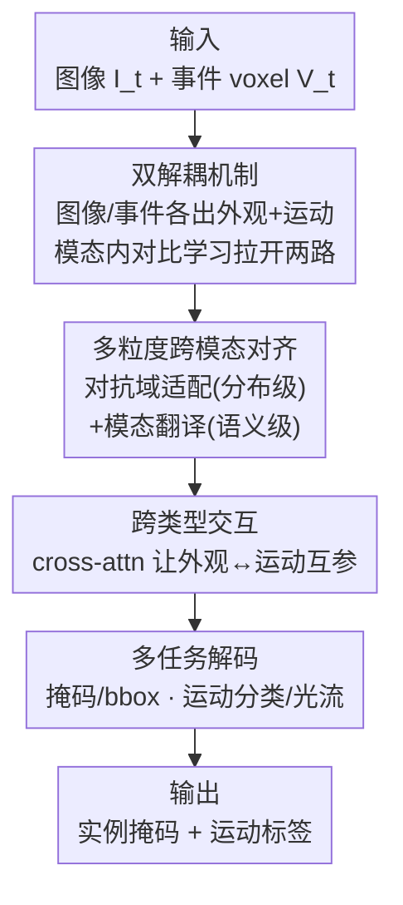

# DIMOS: Disentangling Instance-level Moving Object Segmentation

**会议**: CVPR 2026  
**论文**: [CVF Open Access](https://openaccess.thecvf.com/content/CVPR2026/html/Huang_DIMOS_Disentangling_Instance-level_Moving_Object_Segmentation_CVPR_2026_paper.html)  
**代码**: https://github.com/Neuromorphic-Electronics-Photonics-Lab/DIMOS-Moving-Instance-Segmentation-CVPR2026  
**领域**: 语义分割  
**关键词**: 移动实例分割, 事件相机, 多模态融合, 特征解耦, 跨模态对齐

## 一句话总结
针对"事件相机里外观与运动信息纠缠、小目标特征过稀"的痛点，DIMOS 用双解耦编码器从图像和事件**两个模态里各自抽出外观+运动两路特征**，再用对抗域适配 + 模态翻译做分布级和语义级对齐后融合，在 MouseSIS / SEVD-Fixed / EVIMO 三个小目标移动实例分割基准上刷到 SOTA。

## 研究背景与动机
**领域现状**：移动实例分割（Moving Instance Segmentation, MIS）要同时做三件事——区分类别、分出每个独立实例、判断每个实例是否在运动，难度高于普通语义分割。纯图像方法在低光、逆光、高速运动下容易掉链子；事件相机有微秒级时间分辨率和高动态范围，对运动极敏感，于是"图像出外观、事件出运动"的多模态融合成了主流范式。

**现有痛点**：这套范式在**小目标**上严重退化。事件相机像素间距大、空间分辨率低，事件流又稀疏异步，小目标只占少量像素时，外观和运动信息都被压得很薄，特征密度不足导致分割质量差。更隐蔽的问题是：现有方法默认"图像=外观、事件=运动"的硬切分，但事件相机本身既受运动影响、又受材质/形状（决定表面反射率）影响，**外观与运动在事件里是高度纠缠的**——作者在 MouseSIS 上采样不同迭代的 checkpoint 算余弦相似度，发现事件模态抽出的两类特征相似度明显高于图像模态（Figure 1b），证明确有纠缠。

**核心矛盾**：一是单模态信息密度不够（尤其小目标），二是事件模态外观/运动纠缠让跨模态融合"对不准"。两者叠加，小目标分割成了硬骨头。

**本文目标**：① 提高特征密度——不再让每个模态只负责一种线索，而是从图像和事件里**都同时抽外观和运动**；② 把纠缠的两类特征解耦干净，尤其是事件；③ 让解耦出来的同语义特征在跨模态融合前先对齐。

**核心 idea**：用"**模态内解耦（intra-modal disentangle）+ 多粒度跨模态对齐**"代替"模态间硬切分 + 简单拼接融合"，把每个模态当成同时含外观和运动两种线索的来源，先解耦再对齐再融合。

## 方法详解

### 整体框架
DIMOS 接收一段图像帧 $I_t$ 和同一时间区间内的事件流 $E_{[t,t+\Delta t]}$，要为每个实例预测分割掩码 $\hat{m}_k$ 和二值运动标签 $\hat{y}_k\in\{0,1\}$。事件流先被离散成 $B$ 个时间 bin 累积成 voxel 表示 $V_t$，再与图像一起喂进网络。整条 pipeline 由四块组成：**双解耦机制**先从图像和事件各自抽出"外观、运动"两路共 4 个特征向量；**多粒度跨模态对齐与融合**把同语义、跨模态的特征在分布级和语义级对齐后融合成外观特征 $\mathbf{F}_{appr}$ 和运动特征 $\mathbf{F}_{mot}$；**跨类型交互**用 cross-attention 让外观和运动两路互相参考；最后**任务特定解码器**分成外观相关（掩码、bbox）和运动相关（运动分类、光流）两组头出预测。

推理时按 EvInsMOS 的 mask fusion：上采样掩码 embedding 到全分辨率，对运动分数施加置信阈值 $\theta=0.1$，只保留分数超阈的掩码作为移动实例。训练时则用匈牙利匹配在预测掩码与 GT 实例间建一对一对应，不走阈值。

### 关键设计

**1. 双解耦机制：从每个模态里同时抽外观和运动，并用模态内对比学习把两路拉开**

针对"图像=外观、事件=运动"硬切分导致小目标特征过稀的痛点，DIMOS 给**每个模态**都配一对独立参数的双分支编码器，同时抽外观特征和运动特征——图像得到 $\mathbf{F}^{im}_{appr}, \mathbf{F}^{im}_{mot}$，事件得到 $\mathbf{F}^{ev}_{appr}, \mathbf{F}^{ev}_{mot}$，四路特征互补，缓解单模态信息稀疏。光抽还不够，事件里外观和运动天然纠缠，所以加**模态内对比学习**强制解耦：注意它做的是"同一模态内、不同类型间"的分离（而非常见的跨模态判别），正样本取**同类型 + 相邻帧**的特征，负样本取**不同类型或非相邻帧**的特征，用 InfoNCE：

$$\mathcal{L}_{con}=-\log\frac{\exp(F\cdot F^+/\tau)}{\exp(F\cdot F^+/\tau)+\sum_{F^-}\exp(F\cdot F^-/\tau)}$$

其中 $\cdot$ 是 $\ell_2$ 归一化特征的点积，$\tau$ 是温度。这样网络被逼着去强调"外观 vs 运动"的语义差异而不是模态差异，避免两分支学到冗余或混合的表示。消融里这一机制把 mIoUins 从 63.46% 直接推到 68.11%，是单项贡献最大的模块。

**2. 多粒度跨模态对齐：分布级对抗域适配 + 语义级模态翻译，融合前先对准**

解耦后每个模态有外观、运动两路，但图像和事件来自不同传感器，特征分布和语义都有 gap，直接拼接融合对不准。DIMOS 在融合前做两个粒度的对齐。**分布级**把两个模态看成同一场景的两个"域"，用对抗域适配学域不变表示：给外观、运动分支各设一个判别器 $D_a, D_m$ 判断特征来自哪个模态，编码器经梯度反转层去缩小这个 gap，目标是经典的 min-max：

$$\min_G\max_D\ \mathbb{E}_{x\sim p_{ref}}[\log D(x)]+\mathbb{E}_{z\sim p_{src}}[\log(1-D(G(z)))]$$

这里用了**非对称参考域**：外观分支以图像为参考域（$x=\mathbf{F}^{im}_{appr}$，对齐对象 $G(z)=\mathbf{F}^{ev}_{appr}$），运动分支以事件为参考域（$x=\mathbf{F}^{ev}_{mot}$，对齐 $\mathbf{F}^{im}_{mot}$）——因为图像的外观线索更清晰、事件的运动线索更干净，让"更可靠的那个模态"当锚点。

**语义级**再补一刀：仅分布对齐不能保证语义一致，于是用两组轻量卷积"模态翻译"模块 $T_{a1},T_{a2},T_{m1},T_{m2}$ 在图像/事件空间间**双向重建**同语义特征，用 L2 重建损失约束：

$$\mathcal{L}_{trans}=\|T_{a1}(\mathbf{F}^{im}_{appr})-\mathbf{F}^{ev}_{appr}\|_2^2+\|T_{a2}(\mathbf{F}^{ev}_{appr})-\mathbf{F}^{im}_{appr}\|_2^2+\|T_{m1}(\mathbf{F}^{im}_{mot})-\mathbf{F}^{ev}_{mot}\|_2^2+\|T_{m2}(\mathbf{F}^{ev}_{mot})-\mathbf{F}^{im}_{mot}\|_2^2$$

这保证同语义类型的特征跨模态可互相翻译，融合更稳。值得一提：**这两套对齐全程无监督、且只在训练时启用**，推理零额外开销。消融里语义对齐 +1.12%、再加分布对齐 +1.02%，两者叠加把 68.11% 推到 70.25%。

**3. 跨类型交互 + 多任务监督：让外观/运动两路互参，并用 4 个任务头各自约束语义**

对齐融合得到外观特征 $\mathbf{F}_{appr}$ 和运动特征 $\mathbf{F}_{mot}$ 后，用 cross-attention 模块做**跨类型交互**，让外观和运动两路联合推理、互相参考（运动帮定位、外观帮辨形）。为了保住解耦特征各自的语义，解码端不只做实例分割，而是分两组任务头：外观相关头出**掩码**和 **bbox 坐标**，运动相关头出**运动分类**和**光流**。bbox 提供空间先验（对小目标/重叠目标的定位尤其有用，无框标注时从掩码外接框生成伪框），无监督光流则用相邻帧的 warp 一致性约束运动语义。总损失把主任务、对比、对齐全揉到一起：

$$\mathcal{L}_{total}=\mathcal{L}_{mov\_seg}+\lambda_{flow}\mathcal{L}_{flow}+\lambda_{bbox}\mathcal{L}_{bbox}+\lambda_{con}\mathcal{L}_{con}+\lambda_{dist}\mathcal{L}_{adv}+\lambda_{sem}\mathcal{L}_{trans}$$

其中 $\mathcal{L}_{mov\_seg}$ 是逐实例的运动分类交叉熵 + 掩码 BCE 之和。这组多任务监督本质上是给"解耦出来的每路特征"配一个对应任务，逼它真的学到该学的那种线索，而不是退化成混合表示。

### 损失函数 / 训练策略
权重设为 $\lambda_{flow}=10.0,\ \lambda_{con}=0.5,\ \lambda_{bbox}=0.01,\ \lambda_{dist}=0.1,\ \lambda_{sem}=10.0$。光流损失用鲁棒函数 $\psi(u)=(|u|+\epsilon)^q$（$\epsilon=0.01,q=0.4$）。事件 bin 数 $B=10$，运动置信阈值 $\theta=0.1$。Adam 优化器，weight decay $1\times10^{-6}$，one-cycle 学习率峰值 $1\times10^{-4}$，batch size 16；MouseSIS 训练 400K 迭代、EVIMO 500K、SEVD-Fixed 800K。训练用双 A40，推理用单 RTX 5090。

## 实验关键数据

### 主实验
三个含图像+事件双模态的基准（MouseSIS、SEVD-Fixed 小目标占比极低，EVIMO 目标稍大），对比纯帧方法 IDOL 和事件辅助方法 ModelMixSort、EvInsMOS。主指标 mIoUins（实例级分割精度）。

| 数据集 | 方法 | mIoUins (%) | mIoU01 (%) | mAP (%) |
|--------|------|------|------|------|
| MouseSIS | IDOL (纯图像) | 60.66 | 66.96 | 26.73 |
| MouseSIS | EvInsMOS (事件辅助) | 62.54 | 75.34 | 30.94 |
| MouseSIS | **DIMOS (ours)** | **70.25** | **77.30** | **45.18** |
| SEVD-Fixed | EvInsMOS | 56.50 | 58.45 | 20.24 |
| SEVD-Fixed | **DIMOS (ours)** | **62.05** | **61.53** | **23.29** |
| EVIMO | ModelMixSort | 71.67 | 78.33 | 33.99 |
| EVIMO | **DIMOS (ours)** | **72.08** | **75.74** | **36.44** |

三个基准都是 SOTA。小目标最密集的 SEVD-Fixed 上比 EvInsMOS 高 5.55%（mIoUins），MouseSIS 上 mAP 从 30.94% 跃到 45.18%（涨 14 个点，说明误检大幅减少）。EVIMO 目标较大、基线本就强，提升幅度最小（+0.82%），侧面印证 DIMOS 的红利主要来自小目标场景。

### 消融实验（MouseSIS，逐项叠加）
| 配置 | mIoUins (%) | 说明 |
|------|------|------|
| 基线（纯多模态交互） | 60.47 | 无任何附加模块 |
| + 无监督光流 | 62.54 | 补运动线索 +2.07 |
| + bbox 监督 | 63.46 | 补空间先验 +0.92 |
| + 双解耦机制 | 68.11 | 单项最大贡献 +4.65 |
| + 语义级对齐 | 69.23 | 跨模态翻译 +1.12 |
| + 分布级对齐（完整） | 70.25 | 对抗域适配 +1.02 |

backbone 消融：ResNet-50 70.25% / ResNet-18 69.32% / MobileNetV2 68.62%，换轻量 backbone 仅掉 0.93%~1.63%，说明增益来自解耦/对齐模块而非大编码器。

### 关键发现
- **双解耦机制是绝对主力**：单项 +4.65%，远超光流（+2.07）、bbox（+0.92）、两级对齐（各 ~1%）。这验证了核心假设——事件模态的外观/运动纠缠是小目标分割的真瓶颈，解开它收益最大。
- **mAP 涨幅远大于 mIoU**：MouseSIS 上 mAP 比次优高 14 个点，说明 DIMOS 主要削减了误检/碎掩码，对"多个目标贴近移动"的场景区分更干净（定性图也印证）。
- **backbone-agnostic**：双 MobileNetV2 约 7.0M 参数即可超过单个 ResNet-50（25.6M）的常规方法，性价比高——这对本身就要开多个编码器分支的 DIMOS 很关键。

## 亮点与洞察
- **"每个模态都同时含外观和运动"这个观察很反直觉但站得住**：图像有运动（光流就靠它）、事件密度/分布也隐含外观（材质/形状决定反射率→影响事件触发）。承认这一点才有"双解耦"的必要性，是整篇论文的地基。
- **非对称参考域是个聪明的小设计**：外观对齐以图像为锚、运动对齐以事件为锚，让"更可靠的模态"当老师，比对称对齐更合理，几乎零成本。
- **对齐全在训练期、推理零开销**：对抗判别器和模态翻译模块只在训练用，部署时丢掉，这种"训练时重、推理时轻"的设计很适合落地。
- **可迁移**：模态内对比学习做"同模态内不同语义类型的解耦"这个思路，可迁移到任何多线索纠缠的传感器融合任务（如雷达+相机、红外+可见光）。

## 局限与展望
- **作者承认**：和多数多模态分割系统一样，DIMOS 依赖**成对的双模态输入**，但同步的图像+事件不总是可得；单模态退化时多模态系统往往严重掉点甚至失效。提升单模态兼容性是重要方向。
- **自己发现**：⚠️ 论文未给单模态输入下的定量结果，"多模态优势"在退化场景下的鲁棒性未被实验直接验证。
- **计算开销偏高**：DIMOS 在 SEVD-Fixed 上 FLOPs 达 201.26G（比 EvInsMOS 的 87.52G 高一倍多），多分支编码 + 多任务头带来的代价不小；虽可换轻量 backbone 缓解，但分支数本身固定。
- **三个数据集里两个是合成/受控场景**（SEVD-Fixed 合成、MouseSIS 室内小鼠），真实复杂街景下的泛化有待更多验证。

## 相关工作与启发
- **vs EvInsMOS**：EvInsMOS 也融合图像纹理 + 事件运动、也用对比学习，但走的是"图像出外观、事件出运动"的**硬切分**范式，且对比学习用于跨模态判别；DIMOS 改成**每个模态都抽两路 + 模态内对比解耦**，并补了多粒度对齐，正面解决事件模态的外观/运动纠缠，三基准全面超越（SEVD-Fixed +5.55%）。
- **vs ModelMixSort**：ModelMixSort 把 YOLO 检测器接 SAM，FLOPs 高达 5.49T 却没显式做特征解耦/对齐；DIMOS 用 60G 量级 FLOPs 在 MouseSIS 上 mIoUins 高出近 7 个点，效率与精度双赢。
- **vs IDOL（纯帧 VIS）**：IDOL 靠检测-分割交互维持时序一致，但单模态在运动模糊/低光下不鲁棒；DIMOS 引入事件并解耦对齐，在极端条件下小目标分割明显更稳。

## 评分
- 新颖性: ⭐⭐⭐⭐ "每个模态都含两类线索→模态内解耦"的视角新颖，多粒度对齐是合理但相对常规的组合。
- 实验充分度: ⭐⭐⭐⭐ 三基准 + 逐项消融 + backbone 消融到位，但缺单模态退化和真实街景的验证。
- 写作质量: ⭐⭐⭐⭐ 动机推导清晰（Figure 1b 的纠缠证据很有说服力），方法各模块交代完整。
- 价值: ⭐⭐⭐⭐ 小目标移动实例分割是实际刚需（交通监控、动物追踪），SOTA + 轻量 backbone 友好，落地价值高。

<!-- RELATED:START -->

## 相关论文

- [\[CVPR 2026\] Moving Border Ownership for Event-based Motion Segmentation](moving_border_ownership_for_event-based_motion_segmentation.md)
- [\[ECCV 2024\] Unsupervised Moving Object Segmentation with Atmospheric Turbulence](../../ECCV2024/segmentation/unsupervised_moving_object_segmentation_with_atmospheric_turbulence.md)
- [\[ECCV 2024\] Dataset Enhancement with Instance-Level Augmentations](../../ECCV2024/segmentation/dataset_enhancement_with_instance-level_augmentations.md)
- [\[CVPR 2026\] MARIS: Marine Open-Vocabulary Instance Segmentation](maris_marine_open-vocabulary_instance_segmentation.md)
- [\[CVPR 2026\] Phrase-Instance Alignment for Generalized Referring Segmentation](phrase-instance_alignment_for_generalized_referring_segmentation.md)

<!-- RELATED:END -->
