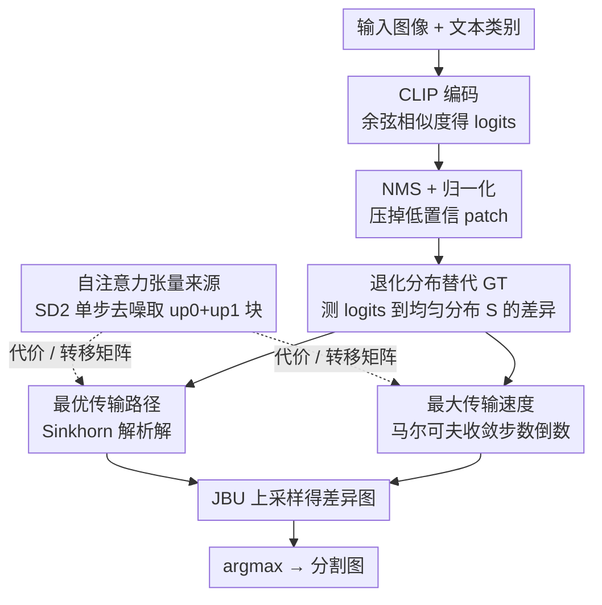

# Direct Segmentation without Logits Optimization for Training-Free Open-Vocabulary Semantic Segmentation

**会议**: CVPR 2026  
**arXiv**: [2604.07723](https://arxiv.org/abs/2604.07723)  
**代码**: [GitHub](https://github.com/liblacklucy/DSLO)  
**领域**: 图像分割  
**关键词**: 开放词汇语义分割, 免训练, 分布差异, 最优传输, 马尔可夫过程

## 一句话总结

提出一种跳过logits优化过程的开放词汇语义分割方法，基于"同类区域的logits到退化分布的分布差异一致"这一假设，直接通过最优传输路径或最大传输速度的解析解来构造分割图，在8个基准上达到SOTA且无需训练或模型特定调制。

## 研究背景与动机

开放词汇语义分割（OVSS）需要像素级的视觉-语言对齐能力。现有方法的核心范式可归纳为**logits优化**——计算视觉与语言特征的余弦相似度（logits），最小化logits分布与GT分布的差异以获得最优logits，再取argmax得到分割图。这一范式有两种实现方式：

**迭代训练范式**：需要GT标注和耗时的训练过程

**注意力调制范式**（免训练）：校准自注意力计算来纠正细粒度对齐，但其去噪操作是**数据无关但模型特定**的（如CLIP特定的注意力替换），泛化性差

这两种方式都**优先推导最优logits、然后构造分割图**。作者的核心洞察是：能否**完全跳过logits优化**，直接从分布差异本身获得分割图？

关键假设：**同类区域（homogeneous regions）呈现一致的分布差异，异类区域（heterogeneous regions）呈现不同的分布差异**。如果这个假设成立，分布差异本身就编码了语义信息，无需先优化出最优logits。

## 方法详解

### 整体框架

这篇论文要解决的是免训练开放词汇语义分割：给一张图和一组文本类别，不训练、不做模型特定的注意力魔改，就要输出像素级分割。整条流水线的关键转折在于它**不再去优化 logits**。传统范式是先用 CLIP 算出视觉-语言相似度 logits，再把 logits 分布往 GT 分布拉（$\mathcal{Q}^* = \arg\min_\mathcal{Q} \mathbf{D}(\mathcal{P}\|\mathcal{Q})$），最后 argmax 取类别；本文把它翻转成一个解析解 $\mathbf{M} = \arg\max_{N_c} \mathbf{D}(\mathcal{S}\|\mathcal{Q})$，直接拿「logits 到退化分布 $\mathcal{S}$ 的差异」当作分割依据。

具体走法是：CLIP 算出 logits 后，先做非极大值抑制（NMS）和归一化压掉噪声；然后计算归一化 logits 到退化分布（均匀分布 $\frac{1}{N}\mathbf{1}_N$）的差异，这一步有两条等价路线——最优传输路径或最大传输速度，两者都依赖一张刻画 patch 间关系的自注意力张量；最后用联合双边上采样（JBU）把低分辨率结果恢复到原图尺寸，argmax 得到分割图。整个过程没有任何参数更新。

### 关键设计

**1. 退化分布替代 GT：把推理时拿不到的 GT 端点换成永远可知的均匀分布**

整套方法的合法性全押在这个替换上。优化范式之所以离不开训练，是因为它需要 GT 分布作为靠拢目标，而推理时根本没有 GT。本文的做法是用退化分布（均匀分布）当替身：作者发现在特征空间里，退化分布 $\mathcal{S}$ 和 GT 分布 $\mathcal{P}$ 恰好占据对跖（antipodal）的两端——logits 优化是朝 GT 端点走，那么反过来「测 logits 到退化端点还有多远」同样能区分类别。实验上，KL 散度从 logits 到 GT（$\mathbf{D}(\mathcal{P}\|\mathcal{Q})$）和从 logits 到退化分布（$\mathbf{D}(\mathcal{S}\|\mathcal{Q})$）在 5 个数据集上性能高度一致，验证了这种端点对调可行。选退化分布而不是别的分布，原因很现实：它是推理时唯一无需任何额外信息就能写出来的分布。

**2. 最优传输路径：用同类区域退化路径一致这件事，把「差异」量化成传输代价**

有了替代端点，还需要一把尺子去量「每个 patch 的 logits 到退化分布有多远」。第一把尺子是路径——核心假设是同类区域走向退化的路径应当一致，于是路径本身就编码了语义差异。作者把它写成带熵正则的 Sinkhorn 最优传输：

$$\boldsymbol{\pi}^* = \min_{\boldsymbol{\pi}} \sum_{i,j} \mathbf{C}_{i,j}\boldsymbol{\pi}_{i,j} - \epsilon\sum_{i,j}\boldsymbol{\pi}_{i,j}(\ln\boldsymbol{\pi}_{i,j} - 1)$$

代价矩阵 $\mathbf{C}$ 取自 Stable Diffusion v2 的层级平均自注意力张量，刻画 patch 之间的相互关系。借 Lagrange 乘子法可得解析解 $\boldsymbol{\pi}^* = \text{diag}(\boldsymbol{\mu})\mathbf{K}\text{diag}(\boldsymbol{\nu})$，其中 Gibbs 核 $\mathbf{K} = \exp(-\mathbf{C}/\epsilon)$，再用 Sinkhorn 迭代（50 次，$\epsilon=0.1$）交替更新 $\boldsymbol{\mu}$、$\boldsymbol{\nu}$ 收敛即可。这条路线对高频纹理更敏感。

**3. 最大传输速度：路径相同时，谁退化得慢谁差异就大**

第二把尺子换了个角度——不看路径走到哪，而看走得多快。作者把 logits 收敛到静止分布的过程建模成马尔可夫链 $\mathbf{f}^{c(l)} = \mathbf{f}^{c(0)} \cdot \mathbf{T}^l$，转移矩阵 $\mathbf{T}$ 由迭代比例拟合（IPF，15 次）把自注意力张量整成双随机矩阵得到。一个 patch 越快被推向退化的均匀态，说明它离退化端点越近、与该类的差异越小；反过来收敛越慢、差异越大。于是把每个 patch 的最大传输速度定义为收敛步数的倒数：

$$\mathbf{v}_i^c = \max\{1/l : |\mathbf{f}_i^{c(l)} - \mathbf{f}_i^{c(l-1)}| \leq \tau\}$$

其中 $\tau=0.3$ 是收敛阈值——阈值太大会让 logits 还没充分退化就被判定收敛。这条路线对类间边界更敏感，和最优路径形成互补（也正因关注点不同，简单融合两者反而互相干扰、掉点）。

**4. 自注意力张量来源：用 SD2 而非 CLIP 的自注意力当 patch 关系图**

前两把尺子都依赖一张刻画 patch 间关系的张量（代价矩阵 / 转移矩阵），它从哪来直接决定效果。作者没用 CLIP 自己的自注意力，而是改用 Stable Diffusion v2 的自注意力：把无噪声潜在特征直接编码后做单步无条件去噪来提取，避免注入噪声、保证特征确定性。来源块也有讲究——组合 $\text{up}_0$ 与 $\text{up}_1$ 上采样块的张量效果最好。这也是全方法唯一引入的「外部模型」，换来的是不绑定任何特定 CLIP 架构的模型无关性。

### 损失函数 / 训练策略

完全**免训练**方法。不涉及任何训练或微调过程。使用现成的CLIP（ViT-B/16 或 ViT-L/14）和Stable Diffusion v2权重。16位浮点精度推理，整图推理无需滑动窗口。

## 实验关键数据

### 主实验

**CLIP ViT-B/16 骨干：**

| 方法 | 范式 | VOC21 | Context60 | COCO-Stuff | Cityscapes | ADE20K | Avg |
|------|------|-------|-----------|------------|------------|--------|-----|
| SCLIP | M.M. | 59.1 | 30.4 | 22.4 | 32.2 | 16.1 | 38.2 |
| NACLIP | M.M. | 58.9 | 32.2 | 23.3 | 35.5 | 17.4 | 39.4 |
| CASS | M.M. | 65.8 | 36.7 | 26.7 | 39.4 | 20.4 | 44.4 |
| **Ours (O.P.)** | - | 66.9 | 37.6 | 28.6 | 41.7 | 22.8 | **46.2** |
| **Ours (M.V.)** | - | **67.8** | **38.3** | **28.9** | **43.3** | **23.0** | **46.9** |

**CLIP ViT-L/14 骨干：**

| 方法 | VOC21 | Context60 | COCO-Stuff | Cityscapes | ADE20K | Avg |
|------|-------|-----------|------------|------------|--------|-----|
| SC-CLIP | 65.0 | 36.9 | 26.9 | 41.3 | 21.7 | 45.2 |
| **Ours (M.V.)** | **68.9** | **38.7** | **29.2** | **43.9** | **23.4** | **47.8** |

### 消融实验

| 配置 | VOC21 | COCO-Stuff | Cityscapes | ADE20K | Avg |
|------|-------|------------|------------|--------|-----|
| (I) Baseline (raw logits) | 18.6 | 7.2 | 6.7 | 3.2 | 8.9 |
| (II) +KL散度 | 44.2 | 12.1 | 8.6 | 6.4 | 17.8 |
| (III) +NMS | 45.9 | 13.0 | 9.6 | 7.7 | 19.1 |
| (IV) +JBU | 46.3 | 13.3 | 10.1 | 8.8 | 19.6 |
| (V) +最优传输路径 | 66.9 | 28.6 | 41.7 | 22.8 | 40.0 |
| (VI) +最大传输速度 | **67.8** | **28.9** | **43.3** | **23.0** | **40.8** |
| (VII) 融合(V)+(VI) | 64.9 | 26.8 | 41.4 | 20.5 | 38.4 |

### 关键发现

1. **分布差异可替代logits优化**：简单KL散度就带来+8.9% mIoU提升，最优传输/马尔可夫进一步+22%
2. **最大速度模式略优于最优路径**：B/16平均+0.7%，L/14平均+0.6%
3. **融合两个模式反而降低性能**：两种差异度量关注不同方面（高频纹理 vs 类间边界），简单融合引入干扰
4. **SD2的自注意力优于ViT基础模型**：SD2的自注意力张量对构建转移矩阵更有效
5. **去噪步数越少越好**：编码过程避免注入噪声，确保确定性特征提取
6. **$\tau=0.3$ 是最优阈值**：更高阈值导致过早退化，logits分布未达到最优退化状态

## 亮点与洞察

- **范式转换**：从"优化logits再构建分割图"转向"直接从分布差异获得分割图"，消除了训练和模型特定调制的需求
- **理论优雅**：将分割问题与最优传输和马尔可夫过程联系，赋予了几何和概率的双重解释
- **退化分布替代GT**：巧妙利用GT和退化分布在特征空间中的对跖关系，使推理时不需要GT
- **三重自由**：不需要GT标注、不需要耗时训练、不需要模型特定调制
- **最优路径 vs 最大速度的互补性**：前者对高频纹理敏感，后者对类间边界敏感
- **Stable Diffusion作为特征提取器**：SD2的自注意力张量比CLIP/DINO的自注意力更适合构建patch间转移概率

## 局限与展望

1. **依赖Stable Diffusion**：需要额外加载SD2模型用于自注意力提取，增加了推理时的内存和计算开销
2. **Sinkhorn迭代的计算代价**：50次迭代的最优传输计算在大分辨率图像上可能较慢
3. **阈值$\tau$和正则化$\epsilon$需要手动调整**：虽然实验表明对这些超参数相对鲁棒，但仍需经验设置
4. **融合两种模式未能叠加收益**：这固然是一个有趣发现，但也意味着错失了可能的性能上限
5. **仅在语义分割上验证**：全景分割、实例分割等更复杂任务的适用性未探索
6. **退化分布替代GT的理论保证有限**：实验验证了可行性但缺乏严格的理论分析

## 相关工作与启发

- 与ClearCLIP、SCLIP、NACLIP等自注意力替换方法形成对比——它们仍在"logits优化"范式内
- ProxyCLIP、CASS等VFM代理方法引入DINO特征，本方法则创新性地引入SD2自注意力
- 最优传输在分割中的应用（Sinkhorn算法）为分布差异的度量提供了几何视角
- 马尔可夫过程的收敛速度作为语义度量是一个新颖的思路
- 方法的模型无关性（不绑定特定CLIP架构）使其有潜力泛化到未来的视觉-语言模型

## 评分

- 新颖性: ⭐⭐⭐⭐⭐ — 跳过logits优化的范式思路独特且有说服力
- 实验充分度: ⭐⭐⭐⭐⭐ — 8个基准、两种CLIP规模、详细消融和分析
- 写作质量: ⭐⭐⭐⭐ — 数学推导清晰，但部分符号较密集
- 价值: ⭐⭐⭐⭐⭐ — 免训练OVSS新SOTA，方法简洁且思路可推广

<!-- RELATED:START -->

## 相关论文

- [\[CVPR 2026\] The Power of Prior: Training-Free Open-Vocabulary Semantic Segmentation with LLaVA](the_power_of_prior_training-free_open-vocabulary_semantic_segmentation_with_llav.md)
- [\[CVPR 2026\] PEARL: Geometry Aligns Semantics for Training-Free Open-Vocabulary Semantic Segmentation](pearl_geometry_aligns_semantics_for_training-free_open-vocabulary_semantic_segme.md)
- [\[CVPR 2026\] Looking Beyond the Window: Global-Local Aligned CLIP for Training-free Open-Vocabulary Semantic Segmentation](looking_beyond_the_window_global-local_aligned_clip_for_training-free_open-vocab.md)
- [\[CVPR 2026\] ReAttnCLIP: Training-Free Open-Vocabulary Remote Sensing Image Segmentation via Re-defined Attention in CLIP](reattnclip_training-free_open-vocabulary_remote_sensing_image_segmentation_via_r.md)
- [\[CVPR 2026\] S2C2Seg: Semantic-Spatial Consistency and Category Optimization for Open-Vocabulary Segmentation](s2c2seg_semantic-spatial_consistency_and_category_optimization_for_open-vocabula.md)

<!-- RELATED:END -->
