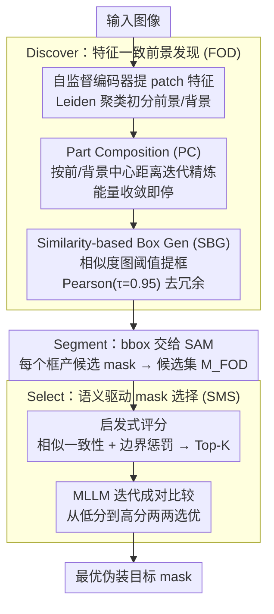

# DSS: Discover, Segment, and Select for Zero-shot Camouflaged Object Segmentation

**会议**: CVPR 2026  
**arXiv**: [2602.19944](https://arxiv.org/abs/2602.19944)  
**代码**: 待确认  
**领域**: 零样本伪装目标分割  
**关键词**: [零样本分割, 伪装目标检测, SAM, MLLM, 无训练pipeline, 聚类定位]  

## 一句话总结
提出DSS三阶段渐进式pipeline(Discover→Segment→Select)，通过自监督视觉编码器+Leiden聚类发现前景(FOD)、SAM生成候选mask、启发式评分+MLLM成对比较选择最优mask，实现零样本无训练的伪装目标分割，尤其在多实例场景上显著优于现有方法。

## 背景与动机
伪装目标分割(COS)要求从高度与背景融合的图像中检测并分割隐匿目标。现有zero-shot COS方法普遍采用"MLLM定位→SAM分割"两阶段范式：先让多模态大语言模型(MLLM)生成目标位置提示(如bounding box)，再将提示送入SAM进行像素级分割。然而MLLM的视觉定位能力在伪装场景下严重退化——伪装目标与背景颜色/纹理高度相似，MLLM难以准确锚定目标区域，生成的bbox偏差大；在多实例场景下问题更严重，MLLM往往只能定位到最显著的一个目标而遗漏其余。

## 核心问题
零样本COS中MLLM定位不准导致SAM分割质量受限，尤其在多实例伪装场景下MLLM无法可靠地发现所有目标。需要一种不依赖MLLM定位、能自动发现多个伪装目标并从候选mask中选择最优结果的无训练方案。

## 方法详解

### 整体框架
DSS 想绕开零样本伪装分割里"MLLM 定位不准"这个老瓶颈——伪装目标和背景太像，MLLM 给的 bbox 偏、多实例时还只盯最显眼那个。它把任务拆成三步渐进式 pipeline：**Discover** 用自监督视觉特征的聚类（而非 MLLM）发现前景、生成 bbox；**Segment** 把 bbox 喂给 SAM 产出一批候选 mask；**Select** 先用启发式评分粗筛、再让 MLLM 做成对比较选出最优。全程 zero-shot、training-free，不需要任何微调或标注。

### 关键设计

**1. Discover（FOD）：用聚类替 MLLM 做定位**

MLLM 在伪装场景定位退化，于是改用自监督视觉特征的内在结构来找目标。先用 DINOv2 提 patch-level 特征 $X \in \mathbb{R}^{N \times D}$，用 Leiden 社区检测做初始前景/背景划分（基于图模块度优化，自动发现聚类、无需预设类别数）；再做 Part Composition 迭代精炼，每轮按"离前景中心近、离背景中心远"算每个 patch 的前景归属概率 $y_i^{(t)} = \sigma(\|x_i - \mu_b\|_2 - \|x_i - \mu_f\|_2)$（$\mu_f, \mu_b$ 为当前前景/背景特征均值中心），直到能量函数 $E$ 收敛；最后做 Similarity-based Box Generation——用前景 centroid 与全图 patch 的余弦相似度生成 affinity map，阈值化 + 连通域提候选区，并用 Pearson 相关（阈值 $\tau=0.95$）去重，避免同一目标出多个冗余 bbox。多实例场景下它能自动发现多个目标，正是 MLLM 做不到的地方。

**2. Segment：bbox 交给 SAM 出候选 mask**

定位准了，分割就交给通用基础模型。把 FOD 生成的所有 bbox prompt 送入 SAM，每个 bbox 产一组候选 mask，汇总成候选集 $M_{FOD}$。这一步只借 SAM 从位置提示出高质量像素级 mask 的能力，不引入额外训练。

**3. Select（SMS）：把 MLLM 从"定位者"改成"裁判"**

候选 mask 里要挑最好的一个。先给每个候选算启发式质量分 $s_i = \text{corr}(m_i, \text{sim}_i) + (1 - \text{BC}(m_i))$——前一项是 mask 与 affinity map 的 Pearson 相关（区域是否与前景特征分布一致），后一项用边界复杂度 $\text{BC}$ 惩罚过度碎片化，高质量 mask 应同时特征一致且边界干净。按分排序取 Top-K 后做 Iterative Pairwise MLLM Comparison：从得分最低的 mask 开始两两问 MLLM"哪个更好地分割了伪装目标"，从低分到高分逐步对比、胜者出线。关键在于 MLLM 做成对比较远比直接定位可靠（任务难度低得多），从差到好的比较顺序也让它逐步建立"什么是更好 mask"的标准、减少单次误判累积。

### 损失函数 / 训练策略
无训练，整个 pipeline 是 inference-only。可调超参包括 Leiden 聚类的分辨率参数、PC 迭代的收敛阈值、SBG 的 Pearson 去重阈值 $\tau=0.95$、以及 SMS 启发式评分的 Top-K 值。

## 实验关键数据

| Benchmark | 指标 | DSS | 前SOTA(ZS方法) | 提升 |
|-----------|------|-----|------------|------|
| CHAMELEON | S_m↑ | 显著领先 | MLLM+SAM baseline | +大幅 |
| CAMO | S_m↑ | 显著领先 | MLLM+SAM baseline | +大幅 |
| COD10K | S_m↑ | 显著领先 | MLLM+SAM baseline | +大幅 |
| NC4K | S_m↑ | 显著领先 | MLLM+SAM baseline | +大幅 |

- 在多实例伪装场景中优势最大，因为FOD能自动发现多个目标区域，而MLLM baseline往往只定位单一目标
- 与使用MLLM定位的zero-shot方法相比，DSS在所有COS benchmark上达到SOTA
- Training-free，无需任何COS标注数据

### 消融实验要点
- FOD vs MLLM定位：FOD在多实例场景上发现目标数量远超MLLM
- PC迭代精炼贡献显著：移除PC后bbox质量明显下降
- SBG中的Pearson去重(τ=0.95)有效减少冗余bbox
- SMS中MLLM成对比较优于直接用启发式评分作为最终选择
- 从低分到高分的比较顺序优于随机顺序

## 亮点
- 巧妙地将MLLM从"定位者"转变为"裁判"——用自监督视觉特征+聚类替代MLLM做定位(更可靠)，让MLLM只做成对比较(更擅长)，任务分配合理
- PC迭代精炼公式简洁优雅，前景/背景距离差的sigmoid可直接解释为概率
- Pearson correlation去重是一种轻量有效的重复检测方式
- 三阶段渐进式设计层次清晰，每个阶段的目标明确且可独立评估
- Zero-shot + training-free的设置使方法具有极强的泛化能力和部署灵活性

## 局限与展望
- 依赖SAM和MLLM两个大模型，推理开销不小(尤其SMS阶段的多次MLLM调用)
- Leiden聚类和PC精炼假设前景/背景在特征空间可分，对于极度伪装(几乎零特征差异)的场景可能失效
- MLLM成对比较的Top-K设置和迭代次数影响效率和质量的trade-off，需调参
- 未探索不同自监督backbone(如MAE、CLIP)对FOD的影响
- Pearson去重阈值τ=0.95为固定值，未做自适应优化

## 与相关工作的对比
- **vs GenSAM/LAKE-RED等MLLM+SAM方法**: 这些方法依赖MLLM生成prompt来引导SAM，在伪装场景下MLLM定位不准是瓶颈。DSS用FOD替代MLLM定位，从根源解决了定位失败问题。
- **vs COS全监督方法(如SINet等)**: 全监督方法依赖大量像素级标注，泛化到新域受限。DSS作为zero-shot方法虽在精度上未必超越全监督SOTA，但在泛化性和标注成本上优势明显。
- **vs 通用zero-shot分割(如Matcher等)**: 通用方法未针对伪装场景优化，在前背景相似度极高时表现差。DSS的FOD专为伪装场景设计，利用细粒度patch特征的聚类分析来突破视觉相似性。

## 启发与关联
- **idea**: FOD的聚类+迭代精炼范式可迁移到其他"目标定位困难"的场景，如水下目标检测、夜间目标发现
- **idea**: SMS的启发式评分+MLLM成对比较可作为通用的"mask质量选择器"，嵌入其他分割pipeline的后处理阶段
- **idea**: 将MLLM角色从定位者转为裁判的思路可推广——在其他视觉任务中也将大模型用在其更擅长的比较/判断环节
- 与EReCu的无监督COS方案互补：EReCu需要训练但处理unsupervised设置，DSS完全免训练但需要SAM+MLLM
- PC的能量收敛机制可与主动推理结合，实现自适应的前景发现深度控制

## 评分
- 新颖性: ⭐⭐⭐⭐ 三阶段pipeline设计新颖，将MLLM角色转换的insight有价值
- 实验充分度: ⭐⭐⭐⭐ 多个COS benchmark + 消融实验 + 多实例分析
- 写作质量: ⭐⭐⭐⭐ 三阶段命名直观，动机阐述清晰
- 对我的价值: ⭐⭐⭐⭐ zero-shot pipeline设计范式可借鉴，FOD和SMS模块可复用

<!-- RELATED:START -->

## 相关论文

- [\[CVPR 2026\] MV3DIS: Multi-View Mask Matching via 3D Guides for Zero-Shot 3D Instance Segmentation](mv3dis_multi-view_mask_matching_via_3d_guides_for_zero-shot_3d_instance_segmenta.md)
- [\[CVPR 2026\] Beyond Appearance: Camouflaged Object Detection via Geometric Structure](beyond_appearance_camouflaged_object_detection_via_geometric_structure.md)
- [\[CVPR 2026\] Seeing Both Sides: Towards Bidirectional Semantic Alignment for Open-Vocabulary Camouflaged Object Segmentation](seeing_both_sides_towards_bidirectional_semantic_alignment_for_open-vocabulary_c.md)
- [\[CVPR 2026\] SDDF: Specificity-Driven Dynamic Focusing for Open-Vocabulary Camouflaged Object Detection](sddf_specificity-driven_dynamic_focusing_for_open-vocabulary_camouflaged_object.md)
- [\[CVPR 2026\] AG-VAS: Anchor-Guided Zero-Shot Visual Anomaly Segmentation with Large Multimodal Models](ag-vas_anchor-guided_zero-shot_visual_anomaly_segmentation_with_large_multimodal.md)

<!-- RELATED:END -->
